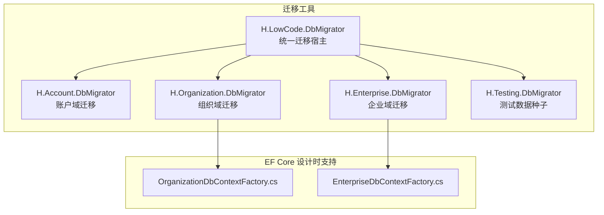
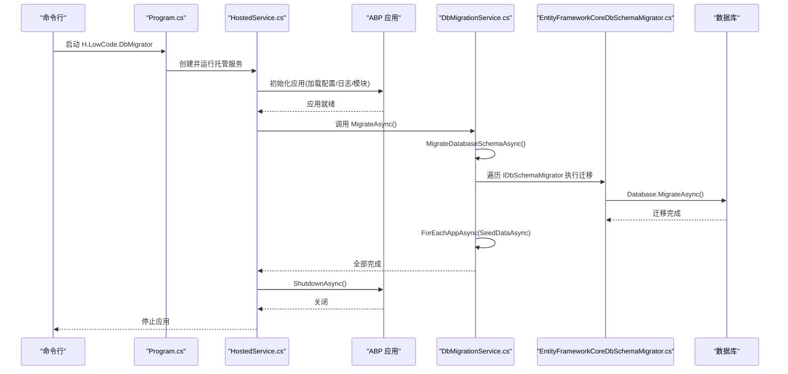
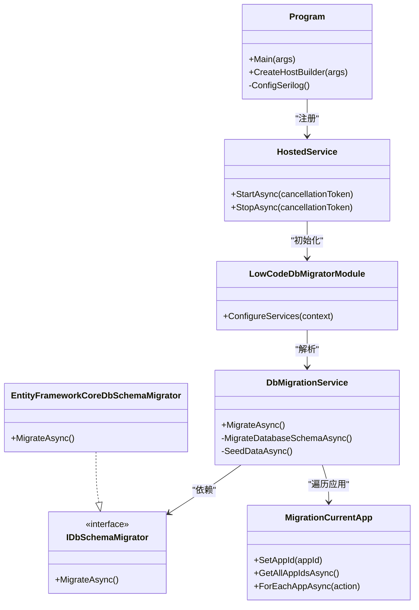
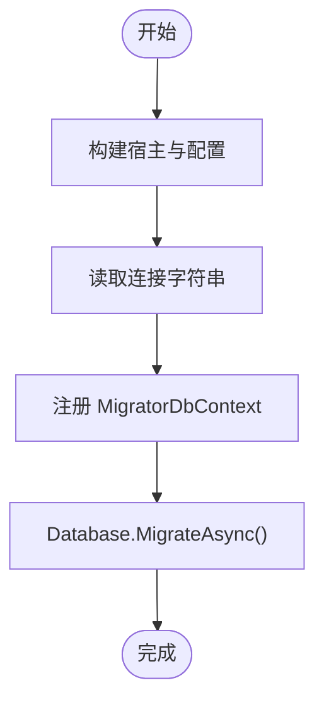
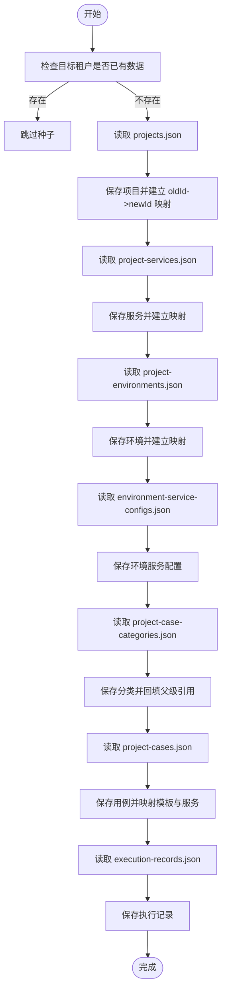
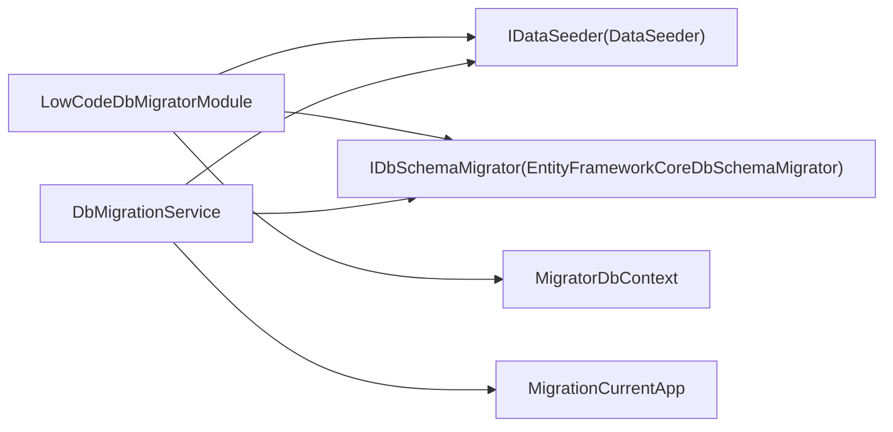

# 数据库迁移管理

<cite>
**本文引用的文件**   
- [H.LowCode.DbMigrator/Program.cs](file://src/Tools/H.LowCode.DbMigrator/Program.cs)
- [H.LowCode.DbMigrator/HostedService.cs](file://src/Tools/H.LowCode.DbMigrator/HostedService.cs)
- [H.LowCode.DbMigrator/LowCodeDbMigratorModule.cs](file://src/Tools/H.LowCode.DbMigrator/LowCodeDbMigratorModule.cs)
- [H.LowCode.DbMigrator/DbMigrationService.cs](file://src/Tools/H.LowCode.DbMigrator/DbMigrationService.cs)
- [H.LowCode.DbMigrator/MigrationServices/IDbSchemaMigrator.cs](file://src/Tools/H.LowCode.DbMigrator/MigrationServices/IDbSchemaMigrator.cs)
- [H.LowCode.DbMigrator/MigrationServices/EntityFrameworkCoreDbSchemaMigrator.cs](file://src/Tools/H.LowCode.DbMigrator/MigrationServices/EntityFrameworkCoreDbSchemaMigrator.cs)
- [H.LowCode.DbMigrator/Services/MigrationCurrentApp.cs](file://src/Tools/H.LowCode.DbMigrator/Services/MigrationCurrentApp.cs)
- [H.Account.DbMigrator/Program.cs](file://src/Tools/H.Account.DbMigrator/Program.cs)
- [H.Account.DbMigrator/MigratorDbContext.cs](file://src/Tools/H.Account.DbMigrator/MigratorDbContext.cs)
- [H.Account.DbMigrator/README.md](file://src/Tools/H.Account.DbMigrator/README.md)
- [H.Organization.DbMigrator/OrganizationDbContextFactory.cs](file://src/Tools/H.Organization.DbMigrator/OrganizationDbContextFactory.cs)
- [H.Enterprise.DbMigrator/EnterpriseDbContextFactory.cs](file://src/Tools/H.Enterprise.DbMigrator/EnterpriseDbContextFactory.cs)
- [H.Testing.DbMigrator/TestingDataSeeder.cs](file://src/Tools/H.Testing.DbMigrator/TestingDataSeeder.cs)
</cite>

## 目录
1. [简介](#简介)
2. [项目结构](#项目结构)
3. [核心组件](#核心组件)
4. [架构总览](#架构总览)
5. [详细组件分析](#详细组件分析)
6. [依赖关系分析](#依赖关系分析)
7. [性能考虑](#性能考虑)
8. [故障排查指南](#故障排查指南)
9. [结论](#结论)
10. [附录](#附录)

## 简介
本文件为 AppLab 的数据库迁移管理提供完整文档，覆盖以下方面：
- 迁移工具的使用方法与命令语法（创建、应用、回滚、查看脚本与列表）
- 迁移脚本编写规范与最佳实践
- 多环境迁移策略与生产部署流程
- 数据种子数据的添加与管理方法
- 迁移冲突解决与数据一致性保证
- 自动化迁移在 CI/CD 流水线中的集成方案

本项目采用 EF Core 迁移机制，并提供统一的迁移执行入口与可扩展的迁移编排能力。

## 项目结构
迁移相关代码主要分布在 Tools 目录下，每个业务域通常拥有独立的 DbMigrator 工程，同时 LowCode 域提供一个统一迁移宿主程序，用于集中编排多个应用的迁移与数据种子。

图表来源 
- [H.LowCode.DbMigrator/Program.cs:1-41](file://src/Tools/H.LowCode.DbMigrator/Program.cs#L1-L41)
- [H.Account.DbMigrator/Program.cs:1-62](file://src/Tools/H.Account.DbMigrator/Program.cs#L1-L62)
- [H.Organization.DbMigrator/OrganizationDbContextFactory.cs:1-28](file://src/Tools/H.Organization.DbMigrator/OrganizationDbContextFactory.cs#L1-L28)
- [H.Enterprise.DbMigrator/EnterpriseDbContextFactory.cs:1-27](file://src/Tools/H.Enterprise.DbMigrator/EnterpriseDbContextFactory.cs#L1-L27)

章节来源
- [H.LowCode.DbMigrator/Program.cs:1-41](file://src/Tools/H.LowCode.DbMigrator/Program.cs#L1-L41)
- [H.Account.DbMigrator/Program.cs:1-62](file://src/Tools/H.Account.DbMigrator/Program.cs#L1-L62)
- [H.Organization.DbMigrator/OrganizationDbContextFactory.cs:1-28](file://src/Tools/H.Organization.DbMigrator/OrganizationDbContextFactory.cs#L1-L28)
- [H.Enterprise.DbMigrator/EnterpriseDbContextFactory.cs:1-27](file://src/Tools/H.Enterprise.DbMigrator/EnterpriseDbContextFactory.cs#L1-L27)

## 核心组件
- 统一迁移宿主（LowCode.DbMigrator）
  - Program.cs：控制台入口，初始化配置与日志
  - HostedService.cs：ABP 应用生命周期托管服务，启动并执行迁移
  - LowCodeDbMigratorModule.cs：模块注册，注入数据种子、EF Core 上下文与迁移器
  - DbMigrationService.cs：迁移编排服务，先执行架构迁移，再按应用遍历执行数据种子
  - IDbSchemaMigrator.cs / EntityFrameworkCoreDbSchemaMigrator.cs：抽象与 EF Core 实现
  - MigrationCurrentApp.cs：迁移期应用上下文，支持遍历所有 AppId

- 领域迁移工具（以 Account 为例）
  - Program.cs：构建宿主、读取连接字符串、使用 MigratorDbContext 执行迁移
  - MigratorDbContext.cs：显式配置 Identity 模型，避免 ABP 模块依赖

- 设计时工厂（Organization、Enterprise 等）
  - OrganizationDbContextFactory.cs / EnterpriseDbContextFactory.cs：供 dotnet ef 命令生成迁移时使用

- 数据种子（Testing）
  - TestingDataSeeder.cs：从 JSON 读取历史数据，映射 ID，写入指定租户

章节来源
- [H.LowCode.DbMigrator/Program.cs:1-41](file://src/Tools/H.LowCode.DbMigrator/Program.cs#L1-L41)
- [H.LowCode.DbMigrator/HostedService.cs:1-50](file://src/Tools/H.LowCode.DbMigrator/HostedService.cs#L1-L50)
- [H.LowCode.DbMigrator/LowCodeDbMigratorModule.cs:1-41](file://src/Tools/H.LowCode.DbMigrator/LowCodeDbMigratorModule.cs#L1-L41)
- [H.LowCode.DbMigrator/DbMigrationService.cs:1-59](file://src/Tools/H.LowCode.DbMigrator/DbMigrationService.cs#L1-L59)
- [H.LowCode.DbMigrator/MigrationServices/IDbSchemaMigrator.cs:1-12](file://src/Tools/H.LowCode.DbMigrator/MigrationServices/IDbSchemaMigrator.cs#L1-L12)
- [H.LowCode.DbMigrator/MigrationServices/EntityFrameworkCoreDbSchemaMigrator.cs:1-29](file://src/Tools/H.LowCode.DbMigrator/MigrationServices/EntityFrameworkCoreDbSchemaMigrator.cs#L1-L29)
- [H.LowCode.DbMigrator/Services/MigrationCurrentApp.cs:1-85](file://src/Tools/H.LowCode.DbMigrator/Services/MigrationCurrentApp.cs#L1-L85)
- [H.Account.DbMigrator/Program.cs:1-62](file://src/Tools/H.Account.DbMigrator/Program.cs#L1-L62)
- [H.Account.DbMigrator/MigratorDbContext.cs:1-24](file://src/Tools/H.Account.DbMigrator/MigratorDbContext.cs#L1-L24)
- [H.Organization.DbMigrator/OrganizationDbContextFactory.cs:1-28](file://src/Tools/H.Organization.DbMigrator/OrganizationDbContextFactory.cs#L1-L28)
- [H.Enterprise.DbMigrator/EnterpriseDbContextFactory.cs:1-27](file://src/Tools/H.Enterprise.DbMigrator/EnterpriseDbContextFactory.cs#L1-L27)
- [H.Testing.DbMigrator/TestingDataSeeder.cs:1-403](file://src/Tools/H.Testing.DbMigrator/TestingDataSeeder.cs#L1-L403)

## 架构总览
下图展示了统一迁移宿主的运行流程：控制台入口初始化日志与配置，托管服务启动 ABP 应用，调用迁移编排服务执行架构迁移与数据种子。

图表来源 
- [H.LowCode.DbMigrator/Program.cs:1-41](file://src/Tools/H.LowCode.DbMigrator/Program.cs#L1-L41)
- [H.LowCode.DbMigrator/HostedService.cs:1-50](file://src/Tools/H.LowCode.DbMigrator/HostedService.cs#L1-L50)
- [H.LowCode.DbMigrator/DbMigrationService.cs:1-59](file://src/Tools/H.LowCode.DbMigrator/DbMigrationService.cs#L1-L59)
- [H.LowCode.DbMigrator/MigrationServices/EntityFrameworkCoreDbSchemaMigrator.cs:1-29](file://src/Tools/H.LowCode.DbMigrator/MigrationServices/EntityFrameworkCoreDbSchemaMigrator.cs#L1-L29)

## 详细组件分析

### 统一迁移宿主（LowCode.DbMigrator）
- Program.cs：设置 Serilog 日志、构建默认主机、注册托管服务
- HostedService.cs：通过 AbpApplicationFactory 创建应用，替换配置、启用数据迁移环境，调用 DbMigrationService 执行迁移后关闭应用
- LowCodeDbMigratorModule.cs：注册数据种子、EF Core 上下文（指向当前程序集作为迁移程序集）、忽略待更改警告
- DbMigrationService.cs：先执行架构迁移，再遍历所有应用进行数据种子
- IDbSchemaMigrator.cs：定义迁移接口
- EntityFrameworkCoreDbSchemaMigrator.cs：基于 EF Core 的迁移实现
- MigrationCurrentApp.cs：迁移期应用上下文，支持获取并遍历所有 AppId

图表来源 
- [H.LowCode.DbMigrator/Program.cs:1-41](file://src/Tools/H.LowCode.DbMigrator/Program.cs#L1-L41)
- [H.LowCode.DbMigrator/HostedService.cs:1-50](file://src/Tools/H.LowCode.DbMigrator/HostedService.cs#L1-L50)
- [H.LowCode.DbMigrator/LowCodeDbMigratorModule.cs:1-41](file://src/Tools/H.LowCode.DbMigrator/LowCodeDbMigratorModule.cs#L1-L41)
- [H.LowCode.DbMigrator/DbMigrationService.cs:1-59](file://src/Tools/H.LowCode.DbMigrator/DbMigrationService.cs#L1-L59)
- [H.LowCode.DbMigrator/MigrationServices/IDbSchemaMigrator.cs:1-12](file://src/Tools/H.LowCode.DbMigrator/MigrationServices/IDbSchemaMigrator.cs#L1-L12)
- [H.LowCode.DbMigrator/MigrationServices/EntityFrameworkCoreDbSchemaMigrator.cs:1-29](file://src/Tools/H.LowCode.DbMigrator/MigrationServices/EntityFrameworkCoreDbSchemaMigrator.cs#L1-L29)
- [H.LowCode.DbMigrator/Services/MigrationCurrentApp.cs:1-85](file://src/Tools/H.LowCode.DbMigrator/Services/MigrationCurrentApp.cs#L1-L85)

章节来源
- [H.LowCode.DbMigrator/Program.cs:1-41](file://src/Tools/H.LowCode.DbMigrator/Program.cs#L1-L41)
- [H.LowCode.DbMigrator/HostedService.cs:1-50](file://src/Tools/H.LowCode.DbMigrator/HostedService.cs#L1-L50)
- [H.LowCode.DbMigrator/LowCodeDbMigratorModule.cs:1-41](file://src/Tools/H.LowCode.DbMigrator/LowCodeDbMigratorModule.cs#L1-L41)
- [H.LowCode.DbMigrator/DbMigrationService.cs:1-59](file://src/Tools/H.LowCode.DbMigrator/DbMigrationService.cs#L1-L59)
- [H.LowCode.DbMigrator/MigrationServices/IDbSchemaMigrator.cs:1-12](file://src/Tools/H.LowCode.DbMigrator/MigrationServices/IDbSchemaMigrator.cs#L1-L12)
- [H.LowCode.DbMigrator/MigrationServices/EntityFrameworkCoreDbSchemaMigrator.cs:1-29](file://src/Tools/H.LowCode.DbMigrator/MigrationServices/EntityFrameworkCoreDbSchemaMigrator.cs#L1-L29)
- [H.LowCode.DbMigrator/Services/MigrationCurrentApp.cs:1-85](file://src/Tools/H.LowCode.DbMigrator/Services/MigrationCurrentApp.cs#L1-L85)

### 领域迁移工具（Account 示例）
- Program.cs：构建宿主、读取 appsettings.json 的连接字符串、注册 MigratorDbContext（指定迁移程序集），执行 Database.MigrateAsync()
- MigratorDbContext.cs：显式配置 Identity 模型，确保与主 DbContext 一致

图表来源 
- [H.Account.DbMigrator/Program.cs:1-62](file://src/Tools/H.Account.DbMigrator/Program.cs#L1-L62)
- [H.Account.DbMigrator/MigratorDbContext.cs:1-24](file://src/Tools/H.Account.DbMigrator/MigratorDbContext.cs#L1-L24)

章节来源
- [H.Account.DbMigrator/Program.cs:1-62](file://src/Tools/H.Account.DbMigrator/Program.cs#L1-L62)
- [H.Account.DbMigrator/MigratorDbContext.cs:1-24](file://src/Tools/H.Account.DbMigrator/MigratorDbContext.cs#L1-L24)

### 设计时工厂（Organization、Enterprise）
- OrganizationDbContextFactory.cs / EnterpriseDbContextFactory.cs：实现 IDesignTimeDbContextFactory<T>，供 dotnet ef migrations add 等命令使用，指定连接字符串与迁移程序集

章节来源
- [H.Organization.DbMigrator/OrganizationDbContextFactory.cs:1-28](file://src/Tools/H.Organization.DbMigrator/OrganizationDbContextFactory.cs#L1-L28)
- [H.Enterprise.DbMigrator/EnterpriseDbContextFactory.cs:1-27](file://src/Tools/H.Enterprise.DbMigrator/EnterpriseDbContextFactory.cs#L1-L27)

### 数据种子（Testing）
- TestingDataSeeder.cs：从 SeedData 下的 JSON 读取历史数据，将旧字符串 ID 映射为新 long 类型，写入指定租户；包含项目、服务、环境、用例分类、用例、执行记录等实体的导入逻辑

图表来源 
- [H.Testing.DbMigrator/TestingDataSeeder.cs:1-403](file://src/Tools/H.Testing.DbMigrator/TestingDataSeeder.cs#L1-L403)

章节来源
- [H.Testing.DbMigrator/TestingDataSeeder.cs:1-403](file://src/Tools/H.Testing.DbMigrator/TestingDataSeeder.cs#L1-L403)

## 依赖关系分析
- 低耦合扩展点：IDbSchemaMigrator 抽象允许新增不同数据库或迁移策略的实现
- 模块化装配：LowCodeDbMigratorModule 负责注册数据种子、上下文与迁移器
- 应用上下文隔离：MigrationCurrentApp 在迁移期间维护 AppId，避免运行时上下文干扰

图表来源 
- [H.LowCode.DbMigrator/LowCodeDbMigratorModule.cs:1-41](file://src/Tools/H.LowCode.DbMigrator/LowCodeDbMigratorModule.cs#L1-L41)
- [H.LowCode.DbMigrator/DbMigrationService.cs:1-59](file://src/Tools/H.LowCode.DbMigrator/DbMigrationService.cs#L1-L59)
- [H.LowCode.DbMigrator/MigrationServices/IDbSchemaMigrator.cs:1-12](file://src/Tools/H.LowCode.DbMigrator/MigrationServices/IDbSchemaMigrator.cs#L1-L12)
- [H.LowCode.DbMigrator/MigrationServices/EntityFrameworkCoreDbSchemaMigrator.cs:1-29](file://src/Tools/H.LowCode.DbMigrator/MigrationServices/EntityFrameworkCoreDbSchemaMigrator.cs#L1-L29)
- [H.LowCode.DbMigrator/Services/MigrationCurrentApp.cs:1-85](file://src/Tools/H.LowCode.DbMigrator/Services/MigrationCurrentApp.cs#L1-L85)

章节来源
- [H.LowCode.DbMigrator/LowCodeDbMigratorModule.cs:1-41](file://src/Tools/H.LowCode.DbMigrator/LowCodeDbMigratorModule.cs#L1-L41)
- [H.LowCode.DbMigrator/DbMigrationService.cs:1-59](file://src/Tools/H.LowCode.DbMigrator/DbMigrationService.cs#L1-L59)
- [H.LowCode.DbMigrator/MigrationServices/IDbSchemaMigrator.cs:1-12](file://src/Tools/H.LowCode.DbMigrator/MigrationServices/IDbSchemaMigrator.cs#L1-L12)
- [H.LowCode.DbMigrator/MigrationServices/EntityFrameworkCoreDbSchemaMigrator.cs:1-29](file://src/Tools/H.LowCode.DbMigrator/MigrationServices/EntityFrameworkCoreDbSchemaMigrator.cs#L1-L29)
- [H.LowCode.DbMigrator/Services/MigrationCurrentApp.cs:1-85](file://src/Tools/H.LowCode.DbMigrator/Services/MigrationCurrentApp.cs#L1-L85)

## 性能考虑
- 迁移阶段仅执行必要的架构变更，避免在迁移中执行重型业务逻辑
- 数据种子应幂等且可中断恢复，减少重复写入与锁竞争
- 对大表操作建议分批处理，降低事务大小与内存占用
- 使用连接池与合理的超时配置，避免迁移阻塞

[本节为通用指导，不直接分析具体文件]

## 故障排查指南
- 常见问题与解决方案（参考 README）
  - 找不到 DLL：在执行 EF Core 命令前先编译 DbMigrator 项目
  - 无法找到 DbContext：确保 --startup-project 指向包含 DbContext 配置的项目
- 迁移失败定位
  - 检查连接字符串与权限
  - 查看迁移脚本差异，确认是否存在破坏性变更
  - 核对迁移程序集是否正确指向当前 DbMigrator 项目
- 数据一致性保障
  - 使用事务包裹关键步骤
  - 对种子数据进行幂等校验（如按租户+唯一键判断）
  - 保留备份与回滚脚本

章节来源
- [H.Account.DbMigrator/README.md:1-102](file://src/Tools/H.Account.DbMigrator/README.md#L1-L102)

## 结论
本迁移体系通过统一的宿主程序与可扩展的迁移接口，实现了跨域的数据库架构迁移与数据种子编排。结合设计时工厂与 EF Core 工具链，开发者可以高效地创建、应用、回滚与审查迁移。在生产环境中，建议配合 CI/CD 自动化执行，并确保幂等性与回滚策略完备。

[本节为总结，不直接分析具体文件]

## 附录

### 使用方法与命令语法
- 生成新迁移（以 Account 为例）
  - 进入 H.Account.DbMigrator 目录
  - 先编译项目
  - 执行 dotnet ef migrations add <MigrationName> --startup-project ../H.Account.HttpApi --output-dir Migrations
- 应用迁移
  - 方式一：运行 DbMigrator 程序（dotnet run）
  - 方式二：在 HttpApi 项目中执行 dotnet ef database update --project ../H.Account.DbMigrator
- 删除迁移
  - dotnet ef migrations remove --startup-project ../H.Account.HttpApi
- 查看迁移脚本
  - dotnet ef migrations script --startup-project ../H.Account.HttpApi
- 查看迁移列表
  - dotnet ef migrations list --startup-project ../H.Account.HttpApi

章节来源
- [H.Account.DbMigrator/README.md:1-102](file://src/Tools/H.Account.DbMigrator/README.md#L1-L102)

### 迁移脚本编写规范与最佳实践
- 命名规范：时间戳_描述（例如 20260517144522_Init.cs）
- 幂等性：避免重复执行导致错误，必要时加入条件判断
- 不可变原则：尽量只增不改，避免破坏性变更
- 注释说明：对重要变更添加清晰注释
- 版本控制：提交到源代码管理，禁止手动修改已发布迁移

[本节为通用指导，不直接分析具体文件]

### 多环境迁移策略与生产部署流程
- 环境隔离：开发、测试、预发、生产分别配置连接字符串
- 顺序执行：先执行架构迁移，再执行数据种子
- 灰度发布：先在非生产环境验证迁移脚本，再推广至生产
- 回滚策略：保留反向迁移脚本，必要时先回滚数据再回滚结构

[本节为通用指导，不直接分析具体文件]

### 数据种子数据的添加与管理方法
- 使用独立的数据种子类（如 TestingDataSeeder）
- 从 JSON 文件读取历史数据，并进行 ID 映射与字段转换
- 按租户维度写入，确保数据隔离
- 幂等检查：若目标租户已存在数据则跳过

章节来源
- [H.Testing.DbMigrator/TestingDataSeeder.cs:1-403](file://src/Tools/H.Testing.DbMigrator/TestingDataSeeder.cs#L1-L403)

### 迁移冲突解决与数据一致性保证
- 冲突检测：对比本地模型快照与数据库状态，生成最小化变更
- 事务边界：将关键步骤放入同一事务，失败自动回滚
- 并发控制：避免多实例同时执行迁移，使用分布式锁或队列
- 审计字段：保持 CreationTime/LastModificationTime 的一致性

[本节为通用指导，不直接分析具体文件]

### 自动化迁移在 CI/CD 流水线中的集成方案
- 构建阶段：编译所有 DbMigrator 项目
- 准备阶段：拉取最新迁移文件，校验连接字符串与环境变量
- 执行阶段：调用统一迁移宿主或各域 DbMigrator 程序
- 验证阶段：执行健康检查与基础数据校验
- 回滚阶段：若失败，执行反向迁移并通知相关人员

[本节为通用指导，不直接分析具体文件]