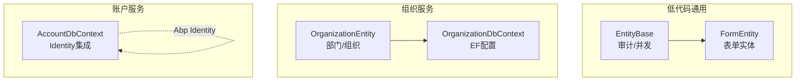
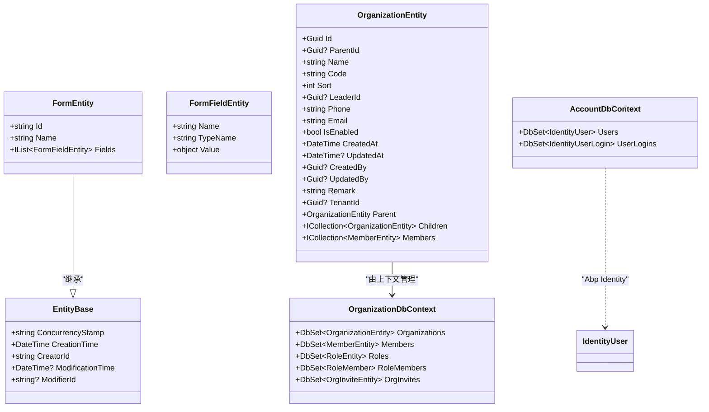
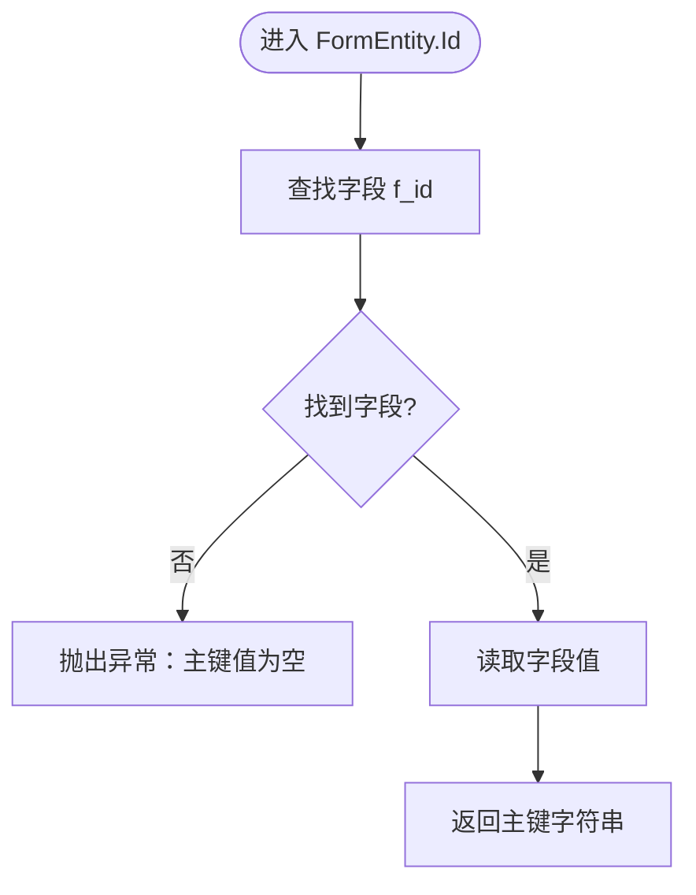
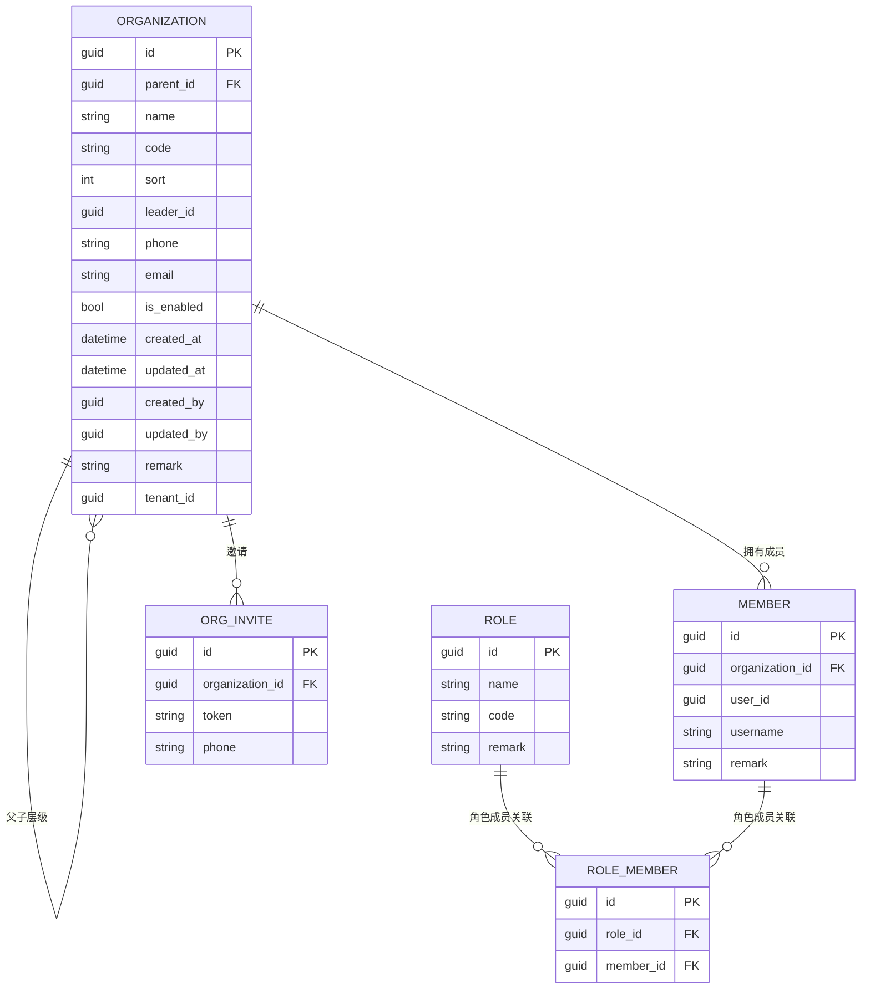
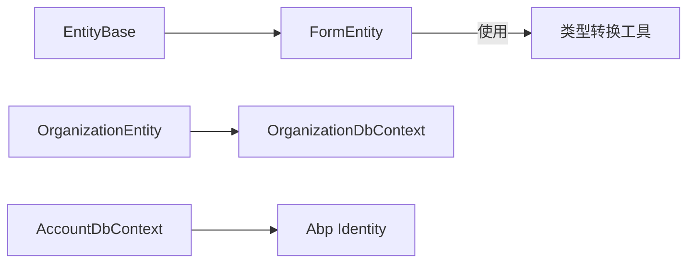

# 数据模型设计

<cite>
**本文引用的文件**
- [EntityBase.cs](file://src/LowCode/Common/H.LowCode.Entity/Base/EntityBase.cs)
- [FormEntity.cs](file://src/LowCode/Common/H.LowCode.Entity/Base/FormEntity.cs)
- [OrganizationEntity.cs](file://src/Services/Organization/H.Organization.EntityFrameworkCore/Entities/OrganizationEntity.cs)
- [OrganizationDbContext.cs](file://src/Services/Organization/H.Organization.EntityFrameworkCore/OrganizationDbContext.cs)
- [AccountDbContext.cs](file://src/Services/Account/H.Account.EntityFrameworkCore/AccountDbContext.cs)
</cite>

## 目录
1. [引言](#引言)
2. [项目结构](#项目结构)
3. [核心组件](#核心组件)
4. [架构总览](#架构总览)
5. [详细组件分析](#详细组件分析)
6. [依赖关系分析](#依赖关系分析)
7. [性能考量](#性能考量)
8. [故障排查指南](#故障排查指南)
9. [结论](#结论)
10. [附录](#附录)

## 引言
本文件面向AppLab的数据模型设计，聚焦实体类的设计原则与命名规范、基类继承与属性定义、关系映射策略、数据验证与约束、通用能力（软删除、审计字段、租户隔离）、版本管理与向后兼容策略，以及最佳实践与反模式规避。文档以代码仓库中的实际实现为依据，结合领域服务与EF Core配置进行系统化说明，帮助读者快速理解并正确扩展数据模型。

## 项目结构
- 低代码通用实体基类位于 LowCode 公共模块，提供统一的审计与并发控制字段，便于跨域复用。
- 领域实体与数据库上下文按服务划分，例如组织服务包含组织实体与对应的 DbContext，使用 EF Core 进行建模与关系配置。
- 账户服务通过 Abp Identity 集成用户与登录信息，由独立的 DbContext 管理。

图表来源
- [EntityBase.cs:1-22](file://src/LowCode/Common/H.LowCode.Entity/Base/EntityBase.cs#L1-L22)
- [FormEntity.cs:1-56](file://src/LowCode/Common/H.LowCode.Entity/Base/FormEntity.cs#L1-L56)
- [OrganizationEntity.cs:1-105](file://src/Services/Organization/H.Organization.EntityFrameworkCore/Entities/OrganizationEntity.cs#L1-L105)
- [OrganizationDbContext.cs:1-145](file://src/Services/Organization/H.Organization.EntityFrameworkCore/OrganizationDbContext.cs#L1-L145)
- [AccountDbContext.cs:1-28](file://src/Services/Account/H.Account.EntityFrameworkCore/AccountDbContext.cs#L1-L28)

章节来源
- [EntityBase.cs:1-22](file://src/LowCode/Common/H.LowCode.Entity/Base/EntityBase.cs#L1-L22)
- [FormEntity.cs:1-56](file://src/LowCode/Common/H.LowCode.Entity/Base/FormEntity.cs#L1-L56)
- [OrganizationEntity.cs:1-105](file://src/Services/Organization/H.Organization.EntityFrameworkCore/Entities/OrganizationEntity.cs#L1-L105)
- [OrganizationDbContext.cs:1-145](file://src/Services/Organization/H.Organization.EntityFrameworkCore/OrganizationDbContext.cs#L1-L145)
- [AccountDbContext.cs:1-28](file://src/Services/Account/H.Account.EntityFrameworkCore/AccountDbContext.cs#L1-L28)

## 核心组件
- EntityBase：统一审计与并发控制字段，包括并发时间戳、创建/修改时间与操作者ID，所有需要审计的实体可继承该基类。
- FormEntity：基于 EntityBase 的表单实体，动态字段集合与类型化取值，用于低代码场景下的元数据驱动表单。
- OrganizationEntity：组织/部门聚合根，支持父子层级、成员关联、角色关联、邀请等，具备多租户字段。
- OrganizationDbContext：组织域的 EF Core 上下文，集中配置表名、主键、索引、唯一约束、外键与级联行为。
- AccountDbContext：账户域的 EF Core 上下文，集成 Abp Identity 的用户与登录信息。

章节来源
- [EntityBase.cs:1-22](file://src/LowCode/Common/H.LowCode.Entity/Base/EntityBase.cs#L1-L22)
- [FormEntity.cs:1-56](file://src/LowCode/Common/H.LowCode.Entity/Base/FormEntity.cs#L1-L56)
- [OrganizationEntity.cs:1-105](file://src/Services/Organization/H.Organization.EntityFrameworkCore/Entities/OrganizationEntity.cs#L1-L105)
- [OrganizationDbContext.cs:1-145](file://src/Services/Organization/H.Organization.EntityFrameworkCore/OrganizationDbContext.cs#L1-L145)
- [AccountDbContext.cs:1-28](file://src/Services/Account/H.Account.EntityFrameworkCore/AccountDbContext.cs#L1-L28)

## 架构总览
数据模型采用“领域实体 + EF Core 上下文”的分层方式：
- 领域实体负责业务语义与关系建模；
- DbContext 负责持久化细节（表名、索引、约束、外键、级联）；
- 通用基类提供跨领域的审计与并发控制；
- 多租户通过实体字段与框架约定实现。

图表来源
- [EntityBase.cs:1-22](file://src/LowCode/Common/H.LowCode.Entity/Base/EntityBase.cs#L1-L22)
- [FormEntity.cs:1-56](file://src/LowCode/Common/H.LowCode.Entity/Base/FormEntity.cs#L1-L56)
- [OrganizationEntity.cs:1-105](file://src/Services/Organization/H.Organization.EntityFrameworkCore/Entities/OrganizationEntity.cs#L1-L105)
- [OrganizationDbContext.cs:1-145](file://src/Services/Organization/H.Organization.EntityFrameworkCore/OrganizationDbContext.cs#L1-L145)
- [AccountDbContext.cs:1-28](file://src/Services/Account/H.Account.EntityFrameworkCore/AccountDbContext.cs#L1-L28)

## 详细组件分析

### 实体基类与通用字段
- 审计字段：CreationTime、CreatorId、ModificationTime、ModifierId，确保所有变更可追溯。
- 并发控制：ConcurrencyStamp 用于乐观并发冲突检测。
- 建议：所有需要审计的实体继承 EntityBase，避免重复定义相同字段。

章节来源
- [EntityBase.cs:1-22](file://src/LowCode/Common/H.LowCode.Entity/Base/EntityBase.cs#L1-L22)

### 表单实体与动态字段
- FormEntity 提供 Id 计算逻辑，从字段集合中读取名为 f_id 的字段作为主键值。
- FormFieldEntity 支持名称、类型名与值，Value 在获取时根据 TypeName 转换为实际类型。
- 注意：TypeName 为空或类型不存在将抛出异常，需在保存前校验。

图表来源
- [FormEntity.cs:1-56](file://src/LowCode/Common/H.LowCode.Entity/Base/FormEntity.cs#L1-L56)

章节来源
- [FormEntity.cs:1-56](file://src/LowCode/Common/H.LowCode.Entity/Base/FormEntity.cs#L1-L56)

### 组织实体与关系映射
- 自引用一对多：Parent/Children 表示部门层级，使用外键 ParentId 与 OnDelete Restrict 防止误删父节点。
- 一对多：Organization 与 Member，组织拥有多个成员，删除组织时级联删除成员。
- 多对多：Role 与 Member 通过 RoleMember 中间表实现，设置联合唯一索引避免重复分配。
- 邀请：OrgInvite 与 Organization 一对一或多对一，Token 唯一索引保证邀请链接唯一性。
- 索引与约束：Name、Code、Phone、Email、Remark 长度限制；UserId、OrganizationId+UserId 组合唯一索引；Role 的 Code 唯一索引。

图表来源
- [OrganizationEntity.cs:1-105](file://src/Services/Organization/H.Organization.EntityFrameworkCore/Entities/OrganizationEntity.cs#L1-L105)
- [OrganizationDbContext.cs:1-145](file://src/Services/Organization/H.Organization.EntityFrameworkCore/OrganizationDbContext.cs#L1-L145)

章节来源
- [OrganizationEntity.cs:1-105](file://src/Services/Organization/H.Organization.EntityFrameworkCore/Entities/OrganizationEntity.cs#L1-L105)
- [OrganizationDbContext.cs:1-145](file://src/Services/Organization/H.Organization.EntityFrameworkCore/OrganizationDbContext.cs#L1-L145)

### 账户服务与 Identity 集成
- AccountDbContext 通过 Abp Identity 配置用户与登录信息，简化身份认证相关的数据建模。
- 建议在涉及用户权限与访问控制的场景中优先使用 Identity 实体，避免重复造轮子。

章节来源
- [AccountDbContext.cs:1-28](file://src/Services/Account/H.Account.EntityFrameworkCore/AccountDbContext.cs#L1-L28)

## 依赖关系分析
- 低代码通用实体被各服务复用，降低重复代码与维护成本。
- 组织域 DbContext 集中管理实体映射与约束，提高一致性。
- 账户域通过 Abp Identity 解耦身份认证与业务实体。

图表来源
- [EntityBase.cs:1-22](file://src/LowCode/Common/H.LowCode.Entity/Base/EntityBase.cs#L1-L22)
- [FormEntity.cs:1-56](file://src/LowCode/Common/H.LowCode.Entity/Base/FormEntity.cs#L1-L56)
- [OrganizationEntity.cs:1-105](file://src/Services/Organization/H.Organization.EntityFrameworkCore/Entities/OrganizationEntity.cs#L1-L105)
- [OrganizationDbContext.cs:1-145](file://src/Services/Organization/H.Organization.EntityFrameworkCore/OrganizationDbContext.cs#L1-L145)
- [AccountDbContext.cs:1-28](file://src/Services/Account/H.Account.EntityFrameworkCore/AccountDbContext.cs#L1-L28)

章节来源
- [OrganizationDbContext.cs:1-145](file://src/Services/Organization/H.Organization.EntityFrameworkCore/OrganizationDbContext.cs#L1-L145)
- [AccountDbContext.cs:1-28](file://src/Services/Account/H.Account.EntityFrameworkCore/AccountDbContext.cs#L1-L28)

## 性能考量
- 索引策略：为高频查询字段建立索引，如 UserId、OrganizationId+UserId 组合唯一索引、Role.Code 唯一索引。
- 外键与级联：谨慎使用级联删除，避免大规模数据删除带来的性能问题；父子层级使用 Restrict 保护数据完整性。
- 并发控制：利用 ConcurrencyStamp 减少锁竞争，提升高并发写入时的吞吐。
- 分页与投影：在服务层使用分页与只读投影，减少不必要的数据加载。

[本节为通用指导，不直接分析具体文件]

## 故障排查指南
- 表单主键为空：检查 FormEntity 的字段集合是否包含 f_id 且值非空，否则将抛出异常。
- 类型转换失败：确保 FormFieldEntity.TypeName 指向有效类型，并在保存前进行校验。
- 唯一约束冲突：插入或更新时若违反唯一索引（如 Token、Code、组合唯一），需检查输入数据与业务逻辑。
- 外键约束失败：删除父节点或关联记录时需遵循 OnDelete 策略，必要时先清理关联数据。

章节来源
- [FormEntity.cs:1-56](file://src/LowCode/Common/H.LowCode.Entity/Base/FormEntity.cs#L1-L56)
- [OrganizationDbContext.cs:1-145](file://src/Services/Organization/H.Organization.EntityFrameworkCore/OrganizationDbContext.cs#L1-L145)

## 结论
AppLab 的数据模型以通用基类为核心，结合 EF Core 的强类型映射与约束配置，实现了可扩展、易维护、高性能的领域建模。通过合理的索引与外键策略、并发控制与审计字段，保障了数据一致性与可追溯性。在多租户与身份认证方面，借助框架能力简化了实现复杂度。建议在设计新实体时遵循现有规范，避免反模式，确保系统长期演进的可维护性。

## 附录

### 实体设计原则与命名规范
- 命名：实体类使用名词单数，属性名清晰表达业务含义，避免缩写歧义。
- 基类：需要审计与并发控制的实体继承 EntityBase。
- 主键：优先使用 Guid，保持分布式环境下的唯一性。
- 关系：明确一对一、一对多、多对多，使用导航属性与外键共同描述。

### 关系映射实现要点
- 一对一：共享主键或唯一外键。
- 一对多：外键置于“多”端，配置级联策略。
- 多对多：引入中间表，设置联合唯一索引避免重复。

### 数据验证与约束
- 字段长度与必填：在 DbContext 中使用 Property 配置 MaxLength 与 IsRequired。
- 唯一性：为关键业务键添加唯一索引。
- 外键约束：合理设置 OnDelete 策略，保护数据完整性。

### 通用功能实现
- 软删除：可在基类增加 IsDeleted 字段，并在查询时过滤；当前未显式实现，可按需扩展。
- 审计字段：继承 EntityBase 即可获得 CreationTime、CreatorId、ModificationTime、ModifierId。
- 租户隔离：实体中包含 TenantId 字段，结合框架的多租户机制实现数据隔离。

### 版本管理与向后兼容
- 迁移：通过 EF Core 迁移管理数据库结构变更，保持版本可控。
- 兼容性：新增字段默认允许为空并提供默认值，避免破坏既有数据；废弃字段保留一段时间再移除。
- 数据迁移脚本：复杂变更编写手动迁移脚本，确保数据平滑过渡。

### 最佳实践与反模式
- 最佳实践：
  - 使用 DbContext 集中配置映射与约束，避免分散在多处。
  - 为高频查询建立合适索引，避免全表扫描。
  - 使用导航属性表达关系，减少手写 SQL。
- 反模式：
  - 在实体中放置业务逻辑，应移至服务层。
  - 过度使用级联删除导致数据丢失风险。
  - 忽略并发控制引发数据覆盖问题。