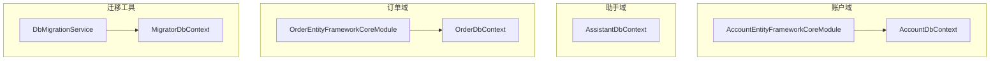
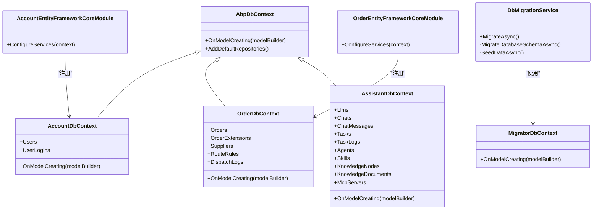
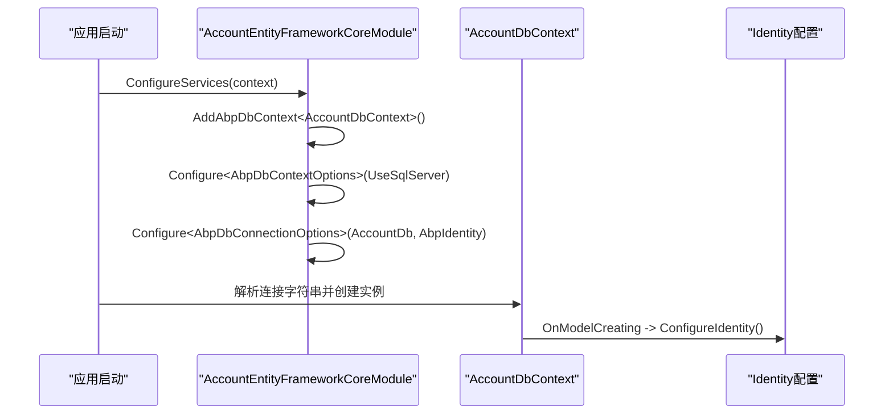
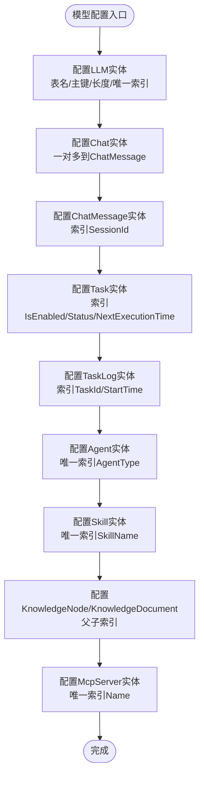
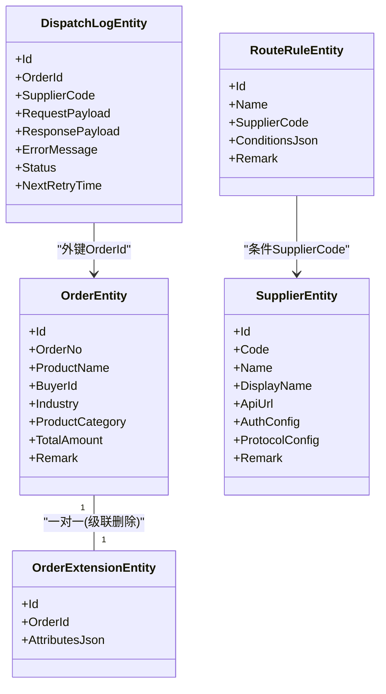
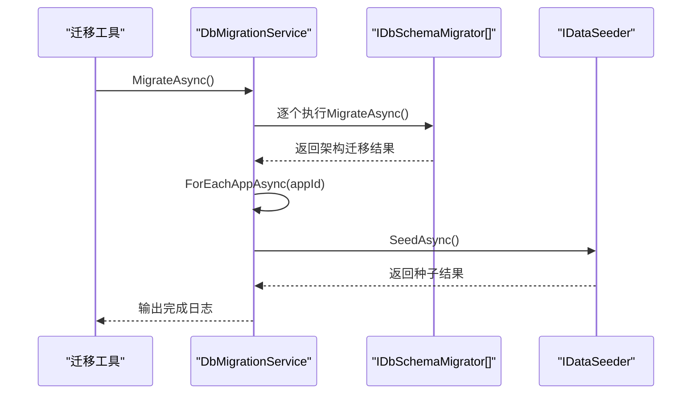
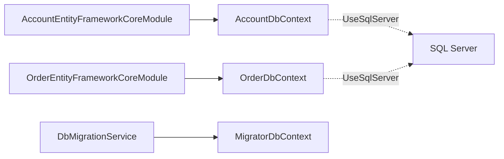

# 数据访问层

<cite>
**本文引用的文件**   
- [AccountDbContext.cs](file://src/Services/Account/H.Account.EntityFrameworkCore/AccountDbContext.cs)
- [AccountEntityFrameworkCoreModule.cs](file://src/Services/Account/H.Account.EntityFrameworkCore/AccountEntityFrameworkCoreModule.cs)
- [MigratorDbContext.cs](file://src/Tools/H.Account.DbMigrator/MigratorDbContext.cs)
- [AssistantDbContext.cs](file://src/Agent/Assistant/H.Assistant.EntityFrameworkCore/AssistantDbContext.cs)
- [OrderDbContext.cs](file://src/Services/Order/H.Order.EntityFrameworkCore/OrderDbContext.cs)
- [OrderEntityFrameworkCoreModule.cs](file://src/Services/Order/H.Order.EntityFrameworkCore/OrderEntityFrameworkCoreModule.cs)
- [DbMigrationService.cs](file://src/Tools/H.LowCode.DbMigrator/DbMigrationService.cs)
</cite>

## 目录
1. [简介](#简介)
2. [项目结构](#项目结构)
3. [核心组件](#核心组件)
4. [架构总览](#架构总览)
5. [详细组件分析](#详细组件分析)
6. [依赖关系分析](#依赖关系分析)
7. [性能考虑](#性能考虑)
8. [故障排查指南](#故障排查指南)
9. [结论](#结论)
10. [附录](#附录)

## 简介
本文件面向AppLab的数据访问层，聚焦于Entity Framework Core在ABP框架下的配置与使用。内容涵盖DbContext设计、实体映射与关系定义、数据库迁移管理与版本控制策略、仓储模式实现与最佳实践、查询优化、事务管理、并发控制、数据模型设计原则与命名规范、性能调优与故障排查建议，以及多数据库支持与数据备份恢复策略。文档以仓库中实际代码为依据，提供可追溯的源码路径与图示说明，帮助读者快速理解并高效扩展数据访问能力。

## 项目结构
AppLab采用按领域/服务划分的模块化架构，每个EF Core模块通常包含：
- DbContext：声明DbSet与模型配置
- EntityFrameworkCoreModule：注册DbContext、连接字符串、驱动（如SQL Server）
- Entities：实体类定义
- DbMigrator：独立迁移工具，用于生成与应用迁移和种子数据

图表来源 
- [AccountEntityFrameworkCoreModule.cs:1-38](file://src/Services/Account/H.Account.EntityFrameworkCore/AccountEntityFrameworkCoreModule.cs#L1-L38)
- [AccountDbContext.cs:1-28](file://src/Services/Account/H.Account.EntityFrameworkCore/AccountDbContext.cs#L1-L28)
- [OrderEntityFrameworkCoreModule.cs:1-31](file://src/Services/Order/H.Order.EntityFrameworkCore/OrderEntityFrameworkCoreModule.cs#L1-L31)
- [OrderDbContext.cs:1-110](file://src/Services/Order/H.Order.EntityFrameworkCore/OrderDbContext.cs#L1-L110)
- [DbMigrationService.cs:1-59](file://src/Tools/H.LowCode.DbMigrator/DbMigrationService.cs#L1-L59)
- [MigratorDbContext.cs:1-24](file://src/Tools/H.Account.DbMigrator/MigratorDbContext.cs#L1-L24)

章节来源
- [AccountDbContext.cs:1-28](file://src/Services/Account/H.Account.EntityFrameworkCore/AccountDbContext.cs#L1-L28)
- [AccountEntityFrameworkCoreModule.cs:1-38](file://src/Services/Account/H.Account.EntityFrameworkCore/AccountEntityFrameworkCoreModule.cs#L1-L38)
- [OrderDbContext.cs:1-110](file://src/Services/Order/H.Order.EntityFrameworkCore/OrderDbContext.cs#L1-L110)
- [OrderEntityFrameworkCoreModule.cs:1-31](file://src/Services/Order/H.Order.EntityFrameworkCore/OrderEntityFrameworkCoreModule.cs#L1-L31)
- [DbMigrationService.cs:1-59](file://src/Tools/H.LowCode.DbMigrator/DbMigrationService.cs#L1-L59)
- [MigratorDbContext.cs:1-24](file://src/Tools/H.Account.DbMigrator/MigratorDbContext.cs#L1-L24)

## 核心组件
- DbContext与模型配置
  - AccountDbContext：基于AbpDbContext，集成Identity实体，通过ConfigureIdentity完成统一映射。
  - AssistantDbContext：集中配置多个业务实体表名、主键、属性长度、索引与一对多关系。
  - OrderDbContext：定义订单核心与扩展、供应商、路由规则、下发日志等实体映射与索引。
- EF Core模块注册
  - AccountEntityFrameworkCoreModule：注册DbContext、默认仓储、SQL Server驱动、连接字符串。
  - OrderEntityFrameworkCoreModule：同上，为订单域提供独立的DbContext与连接字符串。
- 迁移与种子
  - MigratorDbContext：供DbMigrator使用的轻量DbContext，显式配置Identity模型，保证迁移一致性。
  - DbMigrationService：编排数据库架构迁移与按应用的数据种子流程。

章节来源
- [AccountDbContext.cs:1-28](file://src/Services/Account/H.Account.EntityFrameworkCore/AccountDbContext.cs#L1-L28)
- [AssistantDbContext.cs:1-170](file://src/Agent/Assistant/H.Assistant.EntityFrameworkCore/AssistantDbContext.cs#L1-L170)
- [OrderDbContext.cs:1-110](file://src/Services/Order/H.Order.EntityFrameworkCore/OrderDbContext.cs#L1-L110)
- [AccountEntityFrameworkCoreModule.cs:1-38](file://src/Services/Account/H.Account.EntityFrameworkCore/AccountEntityFrameworkCoreModule.cs#L1-L38)
- [OrderEntityFrameworkCoreModule.cs:1-31](file://src/Services/Order/H.Order.EntityFrameworkCore/OrderEntityFrameworkCoreModule.cs#L1-L31)
- [MigratorDbContext.cs:1-24](file://src/Tools/H.Account.DbMigrator/MigratorDbContext.cs#L1-L24)
- [DbMigrationService.cs:1-59](file://src/Tools/H.LowCode.DbMigrator/DbMigrationService.cs#L1-L59)

## 架构总览
整体数据访问层遵循“按域拆分DbContext + ABP模块注册 + 统一迁移”的模式。各域拥有独立的DbContext与连接字符串，便于隔离与水平扩展；迁移工具集中编排架构迁移与种子数据，确保环境一致性。

图表来源 
- [AccountDbContext.cs:1-28](file://src/Services/Account/H.Account.EntityFrameworkCore/AccountDbContext.cs#L1-L28)
- [OrderDbContext.cs:1-110](file://src/Services/Order/H.Order.EntityFrameworkCore/OrderDbContext.cs#L1-L110)
- [AssistantDbContext.cs:1-170](file://src/Agent/Assistant/H.Assistant.EntityFrameworkCore/AssistantDbContext.cs#L1-L170)
- [AccountEntityFrameworkCoreModule.cs:1-38](file://src/Services/Account/H.Account.EntityFrameworkCore/AccountEntityFrameworkCoreModule.cs#L1-L38)
- [OrderEntityFrameworkCoreModule.cs:1-31](file://src/Services/Order/H.Order.EntityFrameworkCore/OrderEntityFrameworkCoreModule.cs#L1-L31)
- [MigratorDbContext.cs:1-24](file://src/Tools/H.Account.DbMigrator/MigratorDbContext.cs#L1-L24)
- [DbMigrationService.cs:1-59](file://src/Tools/H.LowCode.DbMigrator/DbMigrationService.cs#L1-L59)

## 详细组件分析

### AccountDbContext与Identity集成
- 继承AbpDbContext，使用ConnectionStringName指定连接字符串名称。
- 暴露Identity相关DbSet，并在OnModelCreating中调用ConfigureIdentity完成统一映射。
- 模块中通过AddAbpDbContext启用默认仓储，UseSqlServer设置数据库驱动，并注入连接字符串。

图表来源 
- [AccountEntityFrameworkCoreModule.cs:1-38](file://src/Services/Account/H.Account.EntityFrameworkCore/AccountEntityFrameworkCoreModule.cs#L1-L38)
- [AccountDbContext.cs:1-28](file://src/Services/Account/H.Account.EntityFrameworkCore/AccountDbContext.cs#L1-L28)

章节来源
- [AccountDbContext.cs:1-28](file://src/Services/Account/H.Account.EntityFrameworkCore/AccountDbContext.cs#L1-L28)
- [AccountEntityFrameworkCoreModule.cs:1-38](file://src/Services/Account/H.Account.EntityFrameworkCore/AccountEntityFrameworkCoreModule.cs#L1-L38)

### AssistantDbContext实体映射与关系
- 集中定义LLM、聊天会话与消息、任务与日志、智能体、技能、知识节点与文档、MCP服务器等实体的表名、主键、字段长度、唯一索引与复合索引。
- 明确一对多关系（如Chat与ChatMessage），并配置级联删除。
- 针对高频查询字段建立索引以提升性能。

图表来源 
- [AssistantDbContext.cs:1-170](file://src/Agent/Assistant/H.Assistant.EntityFrameworkCore/AssistantDbContext.cs#L1-L170)

章节来源
- [AssistantDbContext.cs:1-170](file://src/Agent/Assistant/H.Assistant.EntityFrameworkCore/AssistantDbContext.cs#L1-L170)

### OrderDbContext订单域建模
- 定义订单核心表、扩展表（JSON存储行业特有属性）、供应商、路由规则与下发日志。
- 对关键字段建立唯一索引与普通索引，保障查询与写入性能。
- 一对一关系（Order与OrderExtension）配置级联删除。

图表来源 
- [OrderDbContext.cs:1-110](file://src/Services/Order/H.Order.EntityFrameworkCore/OrderDbContext.cs#L1-L110)

章节来源
- [OrderDbContext.cs:1-110](file://src/Services/Order/H.Order.EntityFrameworkCore/OrderDbContext.cs#L1-L110)

### 迁移与种子编排
- DbMigrationService负责顺序执行：先进行数据库架构迁移，再遍历应用执行数据种子。
- 通过IEnumerable<IDbSchemaMigrator>聚合各域的迁移器，支持多域独立演进。
- 使用IDataSeeder统一数据初始化，保证测试与部署一致性。

图表来源 
- [DbMigrationService.cs:1-59](file://src/Tools/H.LowCode.DbMigrator/DbMigrationService.cs#L1-L59)

章节来源
- [DbMigrationService.cs:1-59](file://src/Tools/H.LowCode.DbMigrator/DbMigrationService.cs#L1-L59)

## 依赖关系分析
- 模块与DbContext耦合清晰：每个EF Core模块仅注册自身DbContext与连接字符串，避免跨域污染。
- 驱动与连接字符串解耦：通过AbpDbContextOptions.UseSqlServer与AbpDbConnectionOptions.ConnectionStrings统一管理。
- 迁移工具与业务DbContext分离：MigratorDbContext仅承载必要的模型配置，降低迁移复杂度。

图表来源 
- [AccountEntityFrameworkCoreModule.cs:1-38](file://src/Services/Account/H.Account.EntityFrameworkCore/AccountEntityFrameworkCoreModule.cs#L1-L38)
- [OrderEntityFrameworkCoreModule.cs:1-31](file://src/Services/Order/H.Order.EntityFrameworkCore/OrderEntityFrameworkCoreModule.cs#L1-L31)
- [DbMigrationService.cs:1-59](file://src/Tools/H.LowCode.DbMigrator/DbMigrationService.cs#L1-L59)
- [MigratorDbContext.cs:1-24](file://src/Tools/H.Account.DbMigrator/MigratorDbContext.cs#L1-L24)

章节来源
- [AccountEntityFrameworkCoreModule.cs:1-38](file://src/Services/Account/H.Account.EntityFrameworkCore/AccountEntityFrameworkCoreModule.cs#L1-L38)
- [OrderEntityFrameworkCoreModule.cs:1-31](file://src/Services/Order/H.Order.EntityFrameworkCore/OrderEntityFrameworkCoreModule.cs#L1-L31)
- [DbMigrationService.cs:1-59](file://src/Tools/H.LowCode.DbMigrator/DbMigrationService.cs#L1-L59)
- [MigratorDbContext.cs:1-24](file://src/Tools/H.Account.DbMigrator/MigratorDbContext.cs#L1-L24)

## 性能考虑
- 索引策略
  - 对高频过滤与排序字段建立普通索引（如订单状态、买家ID、行业）。
  - 对唯一性约束建立唯一索引（如订单号、供应商编码、技能名称、智能体类型）。
  - 复合索引用于多条件查询（如任务的IsEnabled+Status、知识节点的OwnerType+ParentId）。
- 读写分离与批处理
  - 批量插入/更新减少往返开销。
  - 只读查询尽量使用AsNoTracking提升吞吐。
- JSON列使用
  - 将行业特有属性或动态配置存入JSON列，避免频繁变更表结构；必要时配合计算列或视图导出常用字段以便索引。
- 连接池与超时
  - 合理配置连接池大小与命令超时，避免高并发下资源耗尽。
- 分页与投影
  - 列表接口强制分页，仅选择必要字段，减少数据传输与内存占用。

[本节为通用指导，不直接分析具体文件]

## 故障排查指南
- 连接字符串错误
  - 检查AbpDbConnectionOptions中是否已正确注入对应连接字符串名称（如AccountDb、OrderDb）。
- 模型不一致导致迁移失败
  - 确保MigratorDbContext与业务DbContext的模型配置一致（例如Identity的ConfigureIdentity调用）。
- 索引冲突或重复
  - 检查唯一索引是否与实际数据冲突，必要时清理数据或调整索引定义。
- 性能问题定位
  - 开启EF Core日志，查看生成的SQL语句，结合数据库执行计划分析慢查询。
  - 关注N+1查询与未命中索引的扫描操作。
- 事务回滚异常
  - 确认异常抛出位置与事务边界，避免部分提交导致数据不一致。

章节来源
- [AccountEntityFrameworkCoreModule.cs:1-38](file://src/Services/Account/H.Account.EntityFrameworkCore/AccountEntityFrameworkCoreModule.cs#L1-L38)
- [OrderEntityFrameworkCoreModule.cs:1-31](file://src/Services/Order/H.Order.EntityFrameworkCore/OrderEntityFrameworkCoreModule.cs#L1-L31)
- [MigratorDbContext.cs:1-24](file://src/Tools/H.Account.DbMigrator/MigratorDbContext.cs#L1-L24)

## 结论
AppLab的数据访问层以ABP为核心，采用按域拆分的DbContext与模块注册方式，结合统一的迁移与种子机制，实现了清晰的职责划分与良好的可扩展性。通过合理的索引设计、JSON灵活扩展与严格的迁移管理，既保证了数据一致性，又兼顾了性能与演进灵活性。建议在新增域时遵循现有模式，保持命名与配置的一致性，并持续监控与优化关键查询路径。

[本节为总结性内容，不直接分析具体文件]

## 附录

### 数据模型设计原则与命名规范
- 表名与实体名一致且使用复数形式（如Orders、Suppliers）。
- 主键统一为Id，必要时增加业务唯一键（如OrderNo、Code）。
- 字段长度与精度明确定义，金额使用decimal(18,2)。
- 大文本或动态结构优先使用JSON列，减少表结构变更。
- 索引遵循“查询驱动”原则，覆盖高频过滤与排序场景。

[本节为通用指导，不直接分析具体文件]

### 多数据库支持与数据备份恢复策略
- 多数据库支持
  - 当前模块使用UseSqlServer，如需切换至其他数据库（如PostgreSQL、MySQL），替换驱动配置并保持模型兼容性。
  - 连接字符串通过AbpDbConnectionOptions集中管理，便于环境切换。
- 备份与恢复
  - 定期全量备份与增量备份结合，保留历史快照。
  - 迁移前务必备份，确保可回滚。
  - 测试环境可使用种子数据快速重建，提高迭代效率。

[本节为通用指导，不直接分析具体文件]

### 仓储模式与最佳实践
- 使用ABP默认仓储（AddDefaultRepositories）快速获得CRUD能力。
- 复杂查询封装在Repository或专用服务中，避免在应用层散落LINQ。
- 读写分离场景可通过不同DbContext或只读副本提升性能。
- 单元测试中使用InMemory或TestContainer模拟数据库，确保快速回归。

[本节为通用指导，不直接分析具体文件]

### 事务管理与并发控制
- 短事务包裹写操作，确保原子性与一致性。
- 乐观并发通过版本号字段或行版本控制，避免锁竞争。
- 重试机制适用于幂等操作与网络抖动场景。

[本节为通用指导，不直接分析具体文件]