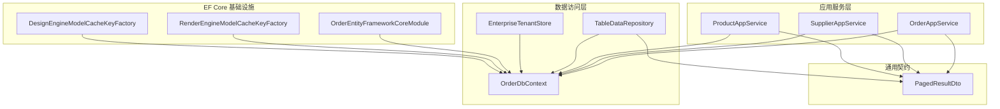
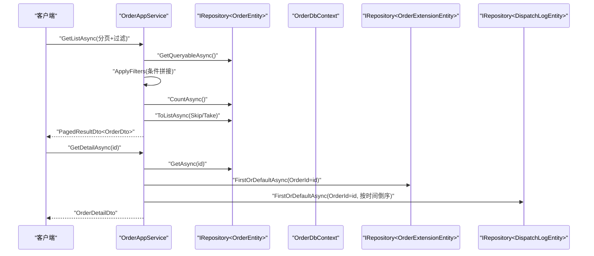
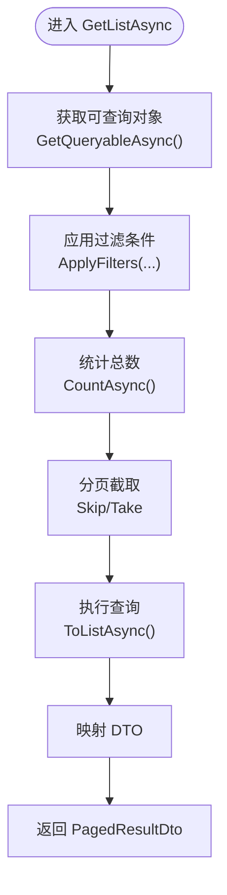
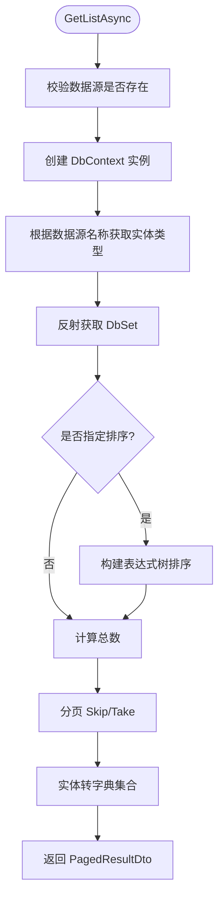
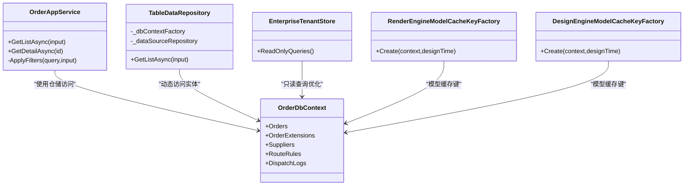

# 查询优化与性能

<cite>
**本文引用的文件**
- [OrderDbContext.cs](file://src/Services/Order/H.Order.EntityFrameworkCore/OrderDbContext.cs)
- [OrderAppService.cs](file://src/Services/Order/H.Order.Application/Services/OrderAppService.cs)
- [OrderEntityFrameworkCoreModule.cs](file://src/Services/Order/H.Order.EntityFrameworkCore/OrderEntityFrameworkCoreModule.cs)
- [TableDataRepository.cs](file://src/LowCode/RenderEngine/H.LowCode.RenderEngine.EntityFrameworkCore/DataRepositories/TableDataRepository.cs)
- [RenderEngineModelCacheKeyFactory.cs](file://src/LowCode/RenderEngine/H.LowCode.RenderEngine.EntityFrameworkCore/EntityFrameworkCore/Extensions/RenderEngineModelCacheKeyFactory.cs)
- [DesignEngineModelCacheKeyFactory.cs](file://src/LowCode/DesignEngine/H.LowCode.DesignEngine.EntityFrameworkCore/EntityFrameworkCore/Extensions/DesignEngineModelCacheKeyFactory.cs)
- [PagedResultDto.cs](file://src/Utils/H.Abp.Application.Contracts/PagedResultDto.cs)
- [SupplierAppService.cs](file://src/Services/Order/H.Order.Application/Services/SupplierAppService.cs)
- [ProductAppService.cs](file://src/Services/SupplyChain/H.SupplyChain.Application/Services/SupplyChainAppService.cs)
- [EnterpriseTenantStore.cs](file://src/System/Enterprise/H.Enterprise.EntityFrameworkCore/EnterpriseTenantStore.cs)
- [OrderApplicationModule.cs](file://src/Services/Order/H.Order.Application/OrderApplicationModule.cs)
- [MigratorDbContext.cs](file://src/Tools/H.LowCode.DbMigrator/MigrationServices/MigratorDbContext.cs)
</cite>

## 目录
1. [简介](#简介)
2. [项目结构](#项目结构)
3. [核心组件](#核心组件)
4. [架构总览](#架构总览)
5. [详细组件分析](#详细组件分析)
6. [依赖关系分析](#依赖关系分析)
7. [性能考量](#性能考量)
8. [故障排查指南](#故障排查指南)
9. [结论](#结论)
10. [附录](#附录)

## 简介
本文件围绕 AppLab 的 EF Core 查询优化与性能主题，结合仓库中的实际代码，系统阐述延迟加载、显式加载、预加载策略；总结 LINQ 查询最佳实践与常见陷阱；给出数据库索引设计与查询计划分析方法；说明查询缓存与内存缓存的使用场景；介绍大数据量处理的分页与流式技术；并提供监控与分析工具使用建议及常见问题诊断案例。

## 项目结构
本项目采用多模块分层架构：应用服务层（Application）通过 ABP 的 IRepository 访问数据，EF Core 数据上下文（EntityFrameworkCore）负责模型映射与连接配置，低代码渲染引擎提供动态表数据访问能力，迁移工具用于数据库迁移。

图表来源
- [OrderDbContext.cs:1-110](file://src/Services/Order/H.Order.EntityFrameworkCore/OrderDbContext.cs#L1-L110)
- [OrderAppService.cs:1-241](file://src/Services/Order/H.Order.Application/Services/OrderAppService.cs#L1-L241)
- [OrderEntityFrameworkCoreModule.cs:1-31](file://src/Services/Order/H.Order.EntityFrameworkCore/OrderEntityFrameworkCoreModule.cs#L1-L31)
- [TableDataRepository.cs:1-203](file://src/LowCode/RenderEngine/H.LowCode.RenderEngine.EntityFrameworkCore/DataRepositories/TableDataRepository.cs#L1-L203)
- [RenderEngineModelCacheKeyFactory.cs:1-13](file://src/LowCode/RenderEngine/H.LowCode.RenderEngine.EntityFrameworkCore/EntityFrameworkCore/Extensions/RenderEngineModelCacheKeyFactory.cs#L1-L13)
- [DesignEngineModelCacheKeyFactory.cs:1-13](file://src/LowCode/DesignEngine/H.LowCode.DesignEngine.EntityFrameworkCore/EntityFrameworkCore/Extensions/DesignEngineModelCacheKeyFactory.cs#L1-L13)
- [PagedResultDto.cs:1-20](file://src/Utils/H.Abp.Application.Contracts/PagedResultDto.cs#L1-L20)

章节来源
- [OrderDbContext.cs:1-110](file://src/Services/Order/H.Order.EntityFrameworkCore/OrderDbContext.cs#L1-L110)
- [OrderEntityFrameworkCoreModule.cs:1-31](file://src/Services/Order/H.Order.EntityFrameworkCore/OrderEntityFrameworkCoreModule.cs#L1-L31)

## 核心组件
- OrderDbContext：定义订单域实体集合与模型映射，包含关键索引设计（如订单号唯一索引、行业、买家ID、状态等）。
- OrderAppService：实现订单列表、详情、创建、更新、删除与下发状态查询，体现分页、过滤、按需加载扩展属性与日志。
- TableDataRepository：基于反射与表达式树构建动态排序与分页查询，返回字典化结果集，适用于低代码表格数据源。
- EnterpriseTenantStore：大量使用 AsNoTracking 提升只读查询性能。
- ModelCacheKeyFactory：为不同 AppId 的 DbContext 生成独立模型缓存键，避免模型冲突。

章节来源
- [OrderDbContext.cs:1-110](file://src/Services/Order/H.Order.EntityFrameworkCore/OrderDbContext.cs#L1-L110)
- [OrderAppService.cs:1-241](file://src/Services/Order/H.Order.Application/Services/OrderAppService.cs#L1-L241)
- [TableDataRepository.cs:1-203](file://src/LowCode/RenderEngine/H.LowCode.RenderEngine.EntityFrameworkCore/DataRepositories/TableDataRepository.cs#L1-L203)
- [EnterpriseTenantStore.cs:23-59](file://src/System/Enterprise/H.Enterprise.EntityFrameworkCore/EnterpriseTenantStore.cs#L23-L59)
- [RenderEngineModelCacheKeyFactory.cs:1-13](file://src/LowCode/RenderEngine/H.LowCode.RenderEngine.EntityFrameworkCore/EntityFrameworkCore/Extensions/RenderEngineModelCacheKeyFactory.cs#L1-L13)
- [DesignEngineModelCacheKeyFactory.cs:1-13](file://src/LowCode/DesignEngine/H.LowCode.DesignEngine.EntityFrameworkCore/EntityFrameworkCore/Extensions/DesignEngineModelCacheKeyFactory.cs#L1-L13)

## 架构总览
下图展示从应用服务到 EF Core 的数据访问路径，以及低代码动态数据源的查询流程。

图表来源
- [OrderAppService.cs:44-104](file://src/Services/Order/H.Order.Application/Services/OrderAppService.cs#L44-L104)
- [OrderDbContext.cs:1-110](file://src/Services/Order/H.Order.EntityFrameworkCore/OrderDbContext.cs#L1-L110)

章节来源
- [OrderAppService.cs:44-104](file://src/Services/Order/H.Order.Application/Services/OrderAppService.cs#L44-L104)

## 详细组件分析

### 订单查询与分页（OrderAppService）
- 列表查询仅返回核心字段，不关联扩展表，减少网络与序列化开销。
- 使用 ApplyFilters 逐步拼接 Where 条件，支持模糊匹配、范围筛选与时间区间。
- 分页采用 Skip/Take，先 Count 再取数，保证前端分页体验。
- 详情接口按需加载扩展属性与最近下发日志，避免 N+1 问题。

图表来源
- [OrderAppService.cs:44-82](file://src/Services/Order/H.Order.Application/Services/OrderAppService.cs#L44-L82)
- [PagedResultDto.cs:1-20](file://src/Utils/H.Abp.Application.Contracts/PagedResultDto.cs#L1-L20)

章节来源
- [OrderAppService.cs:44-82](file://src/Services/Order/H.Order.Application/Services/OrderAppService.cs#L44-L82)
- [PagedResultDto.cs:1-20](file://src/Utils/H.Abp.Application.Contracts/PagedResultDto.cs#L1-L20)

### 动态表格数据查询（TableDataRepository）
- 通过 IDbContextFactory 创建独立 DbContext 实例，确保线程安全。
- 使用反射获取 DbSet，并通过表达式树动态构建排序（OrderBy/OrderByDescending）。
- 先 Count 再分页，将实体转换为字典集合，便于低代码表格渲染。

图表来源
- [TableDataRepository.cs:30-111](file://src/LowCode/RenderEngine/H.LowCode.RenderEngine.EntityFrameworkCore/DataRepositories/TableDataRepository.cs#L30-L111)

章节来源
- [TableDataRepository.cs:30-111](file://src/LowCode/RenderEngine/H.LowCode.RenderEngine.EntityFrameworkCore/DataRepositories/TableDataRepository.cs#L30-L111)

### 只读查询优化（EnterpriseTenantStore）
- 在租户存储读取场景中广泛使用 AsNoTracking，避免跟踪开销，提高只读查询性能。

章节来源
- [EnterpriseTenantStore.cs:23-59](file://src/System/Enterprise/H.Enterprise.EntityFrameworkCore/EnterpriseTenantStore.cs#L23-L59)

### 模型缓存键工厂（RenderEngine/DesignEngine）
- 为不同 AppId 的 DbContext 生成独立模型缓存键，避免多租户或多应用共享模型导致的冲突。

章节来源
- [RenderEngineModelCacheKeyFactory.cs:1-13](file://src/LowCode/RenderEngine/H.LowCode.RenderEngine.EntityFrameworkCore/EntityFrameworkCore/Extensions/RenderEngineModelCacheKeyFactory.cs#L1-L13)
- [DesignEngineModelCacheKeyFactory.cs:1-13](file://src/LowCode/DesignEngine/H.LowCode.DesignEngine.EntityFrameworkCore/EntityFrameworkCore/Extensions/DesignEngineModelCacheKeyFactory.cs#L1-L13)

### 供应商与商品查询示例（SupplierAppService / ProductAppService）
- 供应商列表查询使用 GetQueryableAsync 并应用过滤条件，返回分页结果。
- 商品详情接口演示了主从数据的组合查询模式（主实体 + SKU 列表），适合按需加载。

章节来源
- [SupplierAppService.cs:28-35](file://src/Services/Order/H.Order.Application/Services/SupplierAppService.cs#L28-L35)
- [ProductAppService.cs:93-95](file://src/Services/SupplyChain/H.SupplyChain.Application/Services/SupplyChainAppService.cs#L93-L95)

## 依赖关系分析
- OrderAppService 依赖 IRepository<OrderEntity>、IRepository<OrderExtensionEntity>、IRepository<DispatchLogEntity>，通过 ABP 的仓储抽象解耦具体实现。
- OrderDbContext 由 OrderEntityFrameworkCoreModule 注册，配置 SQL Server 连接字符串与默认仓储。
- TableDataRepository 依赖 IDbContextFactory<RenderEngineDbContext> 与 IDataSourceRepository，实现动态数据源访问。
- EnterpriseTenantStore 直接依赖 EF Core 的只读优化特性（AsNoTracking）。

图表来源
- [OrderAppService.cs:1-241](file://src/Services/Order/H.Order.Application/Services/OrderAppService.cs#L1-L241)
- [OrderDbContext.cs:1-110](file://src/Services/Order/H.Order.EntityFrameworkCore/OrderDbContext.cs#L1-L110)
- [TableDataRepository.cs:1-203](file://src/LowCode/RenderEngine/H.LowCode.RenderEngine.EntityFrameworkCore/DataRepositories/TableDataRepository.cs#L1-L203)
- [EnterpriseTenantStore.cs:23-59](file://src/System/Enterprise/H.Enterprise.EntityFrameworkCore/EnterpriseTenantStore.cs#L23-L59)
- [RenderEngineModelCacheKeyFactory.cs:1-13](file://src/LowCode/RenderEngine/H.LowCode.RenderEngine.EntityFrameworkCore/EntityFrameworkCore/Extensions/RenderEngineModelCacheKeyFactory.cs#L1-L13)
- [DesignEngineModelCacheKeyFactory.cs:1-13](file://src/LowCode/DesignEngine/H.LowCode.DesignEngine.EntityFrameworkCore/EntityFrameworkCore/Extensions/DesignEngineModelCacheKeyFactory.cs#L1-L13)

章节来源
- [OrderEntityFrameworkCoreModule.cs:1-31](file://src/Services/Order/H.Order.EntityFrameworkCore/OrderEntityFrameworkCoreModule.cs#L1-L31)

## 性能考量
- 延迟加载 vs 显式加载 vs 预加载
  - 延迟加载：默认关闭或谨慎开启，避免 N+1 查询。
  - 显式加载：在需要时按需加载关联数据（如订单详情加载扩展属性与日志）。
  - 预加载：对高频关联使用 Include，但需控制投影字段，避免过度抓取。
- LINQ 最佳实践
  - 尽量在服务端完成过滤与排序，减少数据传输。
  - 使用 Contains/StartsWith/EndsWith 时注意索引命中情况。
  - 避免在 Where 中使用复杂函数导致全表扫描。
- 数据库索引设计
  - 为常用过滤与排序字段建立合适索引（如 OrderNo、Industry、BuyerId、OrderStatus）。
  - 复合索引考虑查询谓词顺序，覆盖常用查询列。
- 查询计划分析
  - 使用数据库执行计划工具（如 SQL Server Execution Plan）分析慢查询。
  - 关注 Index Seek/Scan、Key Lookup、Spool 等操作符。
- 查询缓存与内存缓存
  - EF Core 模型缓存已按 AppId 区分（ModelCacheKeyFactory）。
  - 对热点只读数据可使用内存缓存（如 IMemoryCache）降低数据库压力。
- 大数据量处理
  - 分页：Skip/Take 配合 Count 是基础方案；超大分页建议使用游标或基于索引的分页。
  - 流式查询：使用 IAsyncEnumerable 或 SqlReader 进行逐行处理，降低内存占用。
- 监控与分析
  - 启用 EF Core 日志（Database.Log）记录 SQL 语句与耗时。
  - 使用 Application Insights、OpenTelemetry 采集请求链路指标。
  - 数据库侧启用慢查询日志与性能视图（如 sys.dm_exec_query_stats）。

[本节为通用指导，不直接分析具体文件]

## 故障排查指南
- 常见问题
  - N+1 查询：检查是否存在循环导航属性的隐式加载，改用 Include 或批量查询。
  - 分页性能差：确认 Count 与分页查询是否命中索引；避免大偏移量分页。
  - 内存占用高：减少一次性加载的数据量，使用投影（Select）只取必要字段。
  - 并发冲突：更新操作需合理设置乐观并发控制与重试策略。
- 诊断步骤
  - 打开 EF Core 日志，捕获生成的 SQL 与执行时间。
  - 使用数据库执行计划定位慢查询与缺失索引。
  - 通过 APM 工具查看调用链与热点方法。
- 优化案例
  - 订单列表：仅查询核心字段，避免 Join 扩展表；详情接口单独加载扩展与日志。
  - 租户存储：只读查询使用 AsNoTracking，显著降低跟踪开销。
  - 动态表格：通过表达式树构建排序，避免运行时反射带来的额外开销。

章节来源
- [OrderAppService.cs:44-104](file://src/Services/Order/H.Order.Application/Services/OrderAppService.cs#L44-L104)
- [EnterpriseTenantStore.cs:23-59](file://src/System/Enterprise/H.Enterprise.EntityFrameworkCore/EnterpriseTenantStore.cs#L23-L59)
- [TableDataRepository.cs:65-90](file://src/LowCode/RenderEngine/H.LowCode.RenderEngine.EntityFrameworkCore/DataRepositories/TableDataRepository.cs#L65-L90)

## 结论
通过对 OrderAppService、TableDataRepository、EnterpriseTenantStore 等核心组件的分析，可以看到项目在查询优化方面采用了多项有效策略：按需加载、分页与过滤、只读优化、模型缓存键隔离等。结合合适的索引设计与查询计划分析，能够显著提升 EF Core 查询性能。建议在后续迭代中持续引入内存缓存、流式查询与完善的监控体系，以应对更大规模的数据与更高的并发需求。

[本节为总结性内容，不直接分析具体文件]

## 附录
- 相关模块与迁移工具
  - OrderEntityFrameworkCoreModule：注册仓储与数据库连接。
  - MigratorDbContext：用于迁移时的上下文封装，确保动态实体加载完整。

章节来源
- [OrderEntityFrameworkCoreModule.cs:1-31](file://src/Services/Order/H.Order.EntityFrameworkCore/OrderEntityFrameworkCoreModule.cs#L1-L31)
- [MigratorDbContext.cs:1-36](file://src/Tools/H.LowCode.DbMigrator/MigrationServices/MigratorDbContext.cs#L1-L36)