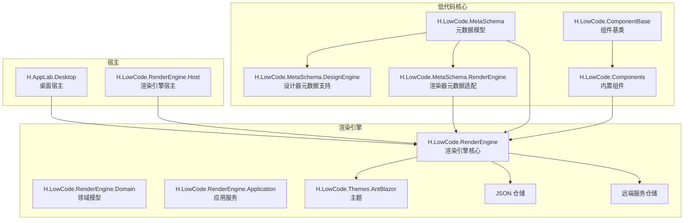
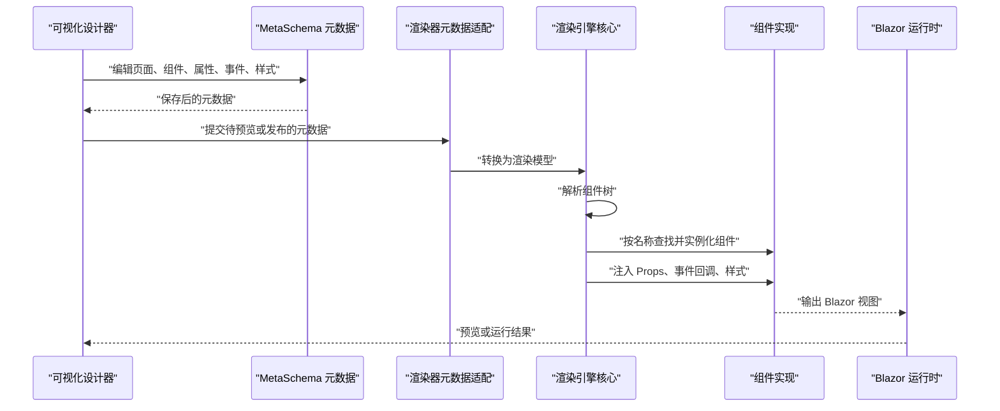
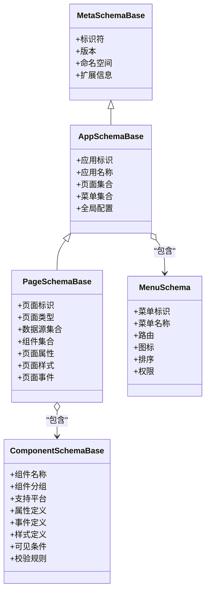
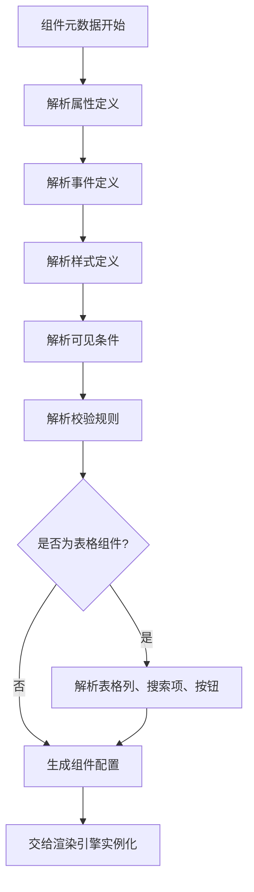
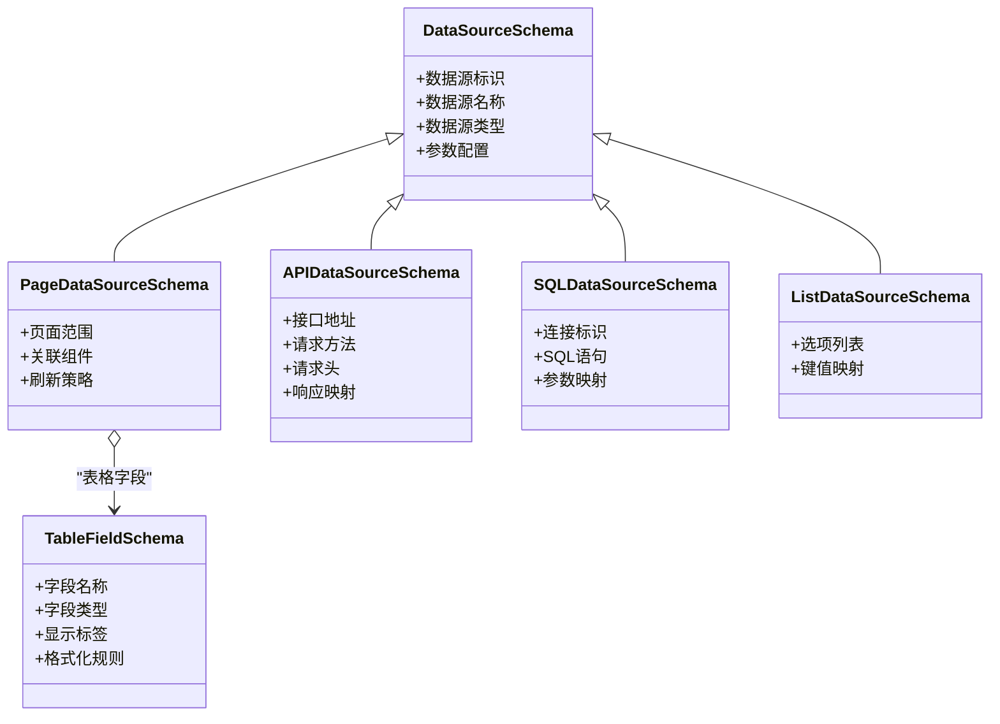
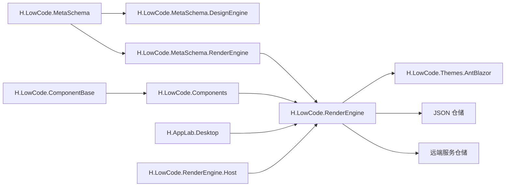

# 低代码架构设计

<cite>
**本文引用的文件**   
- [PageSchemaBase.cs](file://src/LowCode/Common/H.LowCode.MetaSchema/PageSchemaBase.cs)
- [MetaSchemaBase.cs](file://src/LowCode/Common/H.LowCode.MetaSchema/MetaSchemaBase.cs)
- [ComponentSchemaBase.cs](file://src/LowCode/Common/H.LowCode.MetaSchema/ComponentSchemaBase.cs)
- [AppSchemaBase.cs](file://src/LowCode/Common/H.LowCode.MetaSchema/AppSchemaBase.cs)
- [MenuSchema.cs](file://src/LowCode/Common/H.LowCode.MetaSchema/MenuSchema.cs)
- [DataSourceSchema.cs](file://src/LowCode/Common/H.LowCode.MetaSchema/DataSourceSchema.cs)
- [PageDataSourceSchema.cs](file://src/LowCode/Common/H.LowCode.MetaSchema/DataSourceSchemas/PageDataSourceSchema.cs)
- [APIDataSourceSchema.cs](file://src/LowCode/Common/H.LowCode.MetaSchema/DataSourceSchemas/APIDataourceSchema.cs)
- [SQLDataSourceSchema.cs](file://src/LowCode/Common/H.LowCode.MetaSchema/DataSourceSchemas/SQLDataSourceSchema.cs)
- [ListDataSourceSchema.cs](file://src/LowCode/Common/H.LowCode.MetaSchema/DataSourceSchemas/ListDataSourceSchema.cs)
- [TableFieldSchema.cs](file://src/LowCode/Common/H.LowCode.MetaSchema/DataSourceSchemas/TableFieldSchema.cs)
- [EventSchema.cs](file://src/LowCode/Common/H.LowCode.MetaSchema/PropertySchemas/EventSchema.cs)
- [ValidationRuleSchema.cs](file://src/LowCode/Common/H.LowCode.MetaSchema/PropertySchemas/ValidationRuleSchema.cs)
- [ComponentStyleSchema.cs](file://src/LowCode/Common/H.LowCode.MetaSchema/PropertySchemas/ComponentStyleSchema.cs)
- [VisibleConditionSchema.cs](file://src/LowCode/Common/H.LowCode.MetaSchema/PropertySchemas/VisibleConditionSchema.cs)
- [ComponentAttributeDefineSchemaBase.cs](file://src/LowCode/Common/H.LowCode.MetaSchema/PropertySchemas/ComponentAttributeDefineSchemaBase.cs)
- [ComponentFragmentSchemaBase.cs](file://src/LowCode/Common/H.LowCode.MetaSchema/PropertySchemas/ComponentFragmentSchemaBase.cs)
- [TablePropertySchema.cs](file://src/LowCode/Common/H.LowCode.MetaSchema/PropertySchemas/TableSchemas/TablePropertySchema.cs)
- [TableColumnSchema.cs](file://src/LowCode/Common/H.LowCode.MetaSchema/PropertySchemas/TableSchemas/TableColumnSchema.cs)
- [TableSearchItemSchema.cs](file://src/LowCode/Common/H.LowCode.MetaSchema/PropertySchemas/TableSchemas/TableSearchItemSchema.cs)
- [TableButtonSchema.cs](file://src/LowCode/Common/H.LowCode.MetaSchema/PropertySchemas/TableSchemas/TableButtonSchema.cs)
- [StateHasChangeSchema.cs](file://src/LowCode/Common/H.LowCode.MetaSchema/StateHasChangeSchema.cs)
- [ObjectMerger.cs](file://src/LowCode/Common/H.LowCode.MetaSchema/Utils/ObjectMerger.cs)
- [SupportPlatformEnum.cs](file://src/LowCode/Common/H.LowCode.MetaSchema/Enums/SupportPlatformEnum.cs)
- [PublishStatusEnum.cs](file://src/LowCode/Common/H.LowCode.MetaSchema/Enums/PublishStatusEnum.cs)
- [PageTypeEnum.cs](file://src/LowCode/Common/H.LowCode.MetaSchema/Enums/PageTypeEnum.cs)
- [PageDataSourceTypeEnum.cs](file://src/LowCode/Common/H.LowCode.MetaSchema/Enums/PageDataSourceTypeEnum.cs)
- [ComponentValueTypeEnum.cs](file://src/LowCode/Common/H.LowCode.MetaSchema/Enums/ComponentValueTypeEnum.cs)
- [ComponentDataSourceTypeEnum.cs](file://src/LowCode/Common/H.LowCode.MetaSchema/Enums/ComponentDataSourceTypeEnum.cs)
- [ComponentDataSourceGroupTypeEnum.cs](file://src/LowCode/Common/H.LowCode.MetaSchema/Enums/ComponentDataSourceGroupTypeEnum.cs)
- [EventTargetTypeEnum.cs](file://src/LowCode/Common/H.LowCode.MetaSchema/Enums/EventTargetTypeEnum.cs)
- [EventDataActionTypeEnum.cs](file://src/LowCode/Common/H.LowCode.MetaSchema/Enums/EventDataActionTypeEnum.cs)
- [H.LowCode.MetaSchema.csproj](file://src/LowCode/Common/H.LowCode.MetaSchema/H.LowCode.MetaSchema.csproj)
- [H.LowCode.ComponentBase.csproj](file://src/LowCode/Common/H.LowCode.ComponentBase/H.LowCode.ComponentBase.csproj)
- [H.LowCode.Components.csproj](file://src/LowCode/Common/H.LowCode.Components/H.LowCode.Components.csproj)
- [H.LowCode.MetaSchema.DesignEngine.csproj](file://src/LowCode/Common/H.LowCode.MetaSchema.DesignEngine/H.LowCode.MetaSchema.DesignEngine.csproj)
- [H.LowCode.MetaSchema.RenderEngine.csproj](file://src/LowCode/Common/H.LowCode.MetaSchema.RenderEngine/H.LowCode.MetaSchema.RenderEngine.csproj)
- [H.LowCode.RenderEngineBase.csproj](file://src/LowCode/RenderEngine/H.LowCode.RenderEngineBase/H.LowCode.RenderEngineBase.csproj)
- [H.LowCode.RenderEngine.csproj](file://src/LowCode/RenderEngine/H.LowCode.RenderEngine/H.LowCode.RenderEngine.csproj)
- [H.LowCode.RenderEngine.Application.Contracts.csproj](file://src/LowCode/RenderEngine/H.LowCode.RenderEngine.Application.Contracts/H.LowCode.RenderEngine.Application.Contracts.csproj)
- [H.LowCode.RenderEngine.Domain.csproj](file://src/LowCode/RenderEngine/H.LowCode.RenderEngine.Domain/H.LowCode.RenderEngine.Domain.csproj)
- [H.LowCode.RenderEngine.EntityFrameworkCore.csproj](file://src/LowCode/RenderEngine/H.LowCode.RenderEngine.EntityFrameworkCore/H.LowCode.RenderEngine.EntityFrameworkCore.csproj)
- [H.LowCode.RenderEngine.Repository.JsonFile.csproj](file://src/LowCode/RenderEngine/H.LowCode.RenderEngine.Repository.JsonFile/H.LowCode.RenderEngine.Repository.JsonFile.csproj)
- [H.LowCode.RenderEngine.Repository.RemoteService.csproj](file://src/LowCode/RenderEngine/H.LowCode.RenderEngine.Repository.RemoteService/H.LowCode.RenderEngine.Repository.RemoteService.csproj)
- [H.LowCode.Themes.AntBlazor.csproj](file://src/LowCode/RenderEngine/H.LowCode.Themes.AntBlazor/H.LowCode.Themes.AntBlazor.csproj)
- [H.AppLab.Desktop.csproj](file://src/Host/H.AppLab.Desktop/H.AppLab.Desktop.csproj)
- [WorkbenchApp.cs](file://src/Host/H.AppLab.Desktop/WorkbenchApp.cs)
- [Program.cs](file://src/Host/H.AppLab.Desktop/Program.cs)
- [H.LowCode.RenderEngine.Host.csproj](file://src/Host/RenderEngine/H.LowCode.RenderEngine.Host/H.LowCode.RenderEngine.Host.csproj)
- [H.LowCode.RenderEngine.Host.Client.csproj](file://src/Host/RenderEngine/H.LowCode.RenderEngine.Host.Client/H.LowCode.RenderEngine.Host.Client.csproj)
</cite>

## 目录

1. [引言](#引言)
2. [项目结构](#项目结构)
3. [核心组件](#核心组件)
4. [架构总览](#架构总览)
5. [详细组件分析](#详细组件分析)
6. [依赖关系分析](#依赖关系分析)
7. [性能与可扩展性](#性能与可扩展性)
8. [故障排查指南](#故障排查指南)
9. [结论](#结论)
10. [附录：元数据与渲染流程对照表](#附录元数据与渲染流程对照表)

## 引言

本仓库中的 AppLab 低代码平台以“元数据驱动”为核心范式，围绕三类关键角色构建系统能力：

- **元数据定义层**：由 `H.LowCode.MetaSchema` 提供，用于描述页面、应用、菜单、组件、属性、事件、样式、校验规则和数据源等运行时所需的全部结构化信息。
- **可视化设计层**：由 `H.LowCode.MetaSchema.DesignEngine` 和独立 DesignEngine 子系统承载，负责让使用者通过可视化界面编辑上述元数据。
- **动态渲染层**：由 `H.LowCode.MetaSchema.RenderEngine`、`H.LowCode.RenderEngine` 及其宿主模块承担，负责根据元数据动态生成并运行 Blazor 应用。

整体目标是让业务开发者或低代码运营人员通过配置元数据完成页面搭建，再由渲染引擎在浏览器或桌面容器中自动编译并呈现为真实 UI。

## 项目结构

从低代码核心视角看，仓库中与 AppLab 低代码平台直接相关的目录主要分为：

| 路径 | 职责 | 关键说明 |
|---|---|---|
| `src/LowCode/Common/H.LowCode.MetaSchema` | 元数据模型 | 定义页面、应用、菜单、组件、数据源、属性、事件、样式、校验、枚举等元数据结构 |
| `src/LowCode/Common/H.LowCode.ComponentBase` | 组件基类与扩展点 | 提供组件运行时基类、生命周期、事件、状态变更等通用能力 |
| `src/LowCode/Common/H.LowCode.Components` | 内置组件集合 | 提供平台默认可被元数据实例化的组件实现 |
| `src/LowCode/Common/H.LowCode.MetaSchema.DesignEngine` | 设计器元数据支持 | 面向设计器的元数据展示、编辑辅助、校验提示等 |
| `src/LowCode/Common/H.LowCode.MetaSchema.RenderEngine` | 渲染器元数据适配 | 将通用元数据映射到渲染引擎内部使用的中间表示 |
| `src/LowCode/RenderEngine/*` | 渲染引擎核心 | 包含领域模型、应用服务、仓储、主题、运行时编译与执行相关工程 |
| `src/Host/H.AppLab.Desktop` | 桌面宿主 | 提供桌面端运行时容器，加载渲染引擎 |
| `src/Host/RenderEngine/*` | 渲染引擎宿主 | 提供 Web 端或远程渲染宿主能力 |

**图表来源**   
- [H.LowCode.MetaSchema.csproj](file://src/LowCode/Common/H.LowCode.MetaSchema/H.LowCode.MetaSchema.csproj)
- [H.LowCode.MetaSchema.DesignEngine.csproj](file://src/LowCode/Common/H.LowCode.MetaSchema.DesignEngine/H.LowCode.MetaSchema.DesignEngine.csproj)
- [H.LowCode.MetaSchema.RenderEngine.csproj](file://src/LowCode/Common/H.LowCode.MetaSchema.RenderEngine/H.LowCode.MetaSchema.RenderEngine.csproj)
- [H.LowCode.RenderEngine.csproj](file://src/LowCode/RenderEngine/H.LowCode.RenderEngine/H.LowCode.RenderEngine.csproj)
- [H.LowCode.RenderEngine.Domain.csproj](file://src/LowCode/RenderEngine/H.LowCode.RenderEngine.Domain/H.LowCode.RenderEngine.Domain.csproj)
- [H.LowCode.RenderEngine.EntityFrameworkCore.csproj](file://src/LowCode/RenderEngine/H.LowCode.RenderEngine.EntityFrameworkCore/H.LowCode.RenderEngine.EntityFrameworkCore.csproj)
- [H.LowCode.RenderEngine.Repository.JsonFile.csproj](file://src/LowCode/RenderEngine/H.LowCode.RenderEngine.Repository.JsonFile/H.LowCode.RenderEngine.Repository.JsonFile.csproj)
- [H.LowCode.RenderEngine.Repository.RemoteService.csproj](file://src/LowCode/RenderEngine/H.LowCode.RenderEngine.Repository.RemoteService/H.LowCode.RenderEngine.Repository.RemoteService.csproj)
- [H.LowCode.Themes.AntBlazor.csproj](file://src/LowCode/RenderEngine/H.LowCode.Themes.AntBlazor/H.LowCode.Themes.AntBlazor.cs.proj)
- [H.AppLab.Desktop.csproj](file://src/Host/H.AppLab.Desktop/H.AppLab.Desktop.csproj)
- [H.LowCode.RenderEngine.Host.csproj](file://src/Host/RenderEngine/H.LowCode.RenderEngine.Host/H.LowCode.RenderEngine.Host.csproj)

**章节来源**   
- [H.LowCode.MetaSchema.csproj](file://src/LowCode/Common/H.LowCode.MetaSchema/H.LowCode.MetaSchema.csproj)
- [H.LowCode.ComponentBase.csproj](file://src/LowCode/Common/H.LowCode.ComponentBase/H.LowCode.ComponentBase.csproj)
- [H.LowCode.Components.csproj](file://src/LowCode/Common/H.LowCode.Components/H.LowCode.Components.csproj)
- [H.LowCode.MetaSchema.DesignEngine.csproj](file://src/LowCode/Common/H.LowCode.MetaSchema.DesignEngine/H.LowCode.MetaSchema.DesignEngine.csproj)
- [H.LowCode.MetaSchema.RenderEngine.csproj](file://src/LowCode/Common/H.LowCode.MetaSchema.RenderEngine/H.LowCode.MetaSchema.RenderEngine.csproj)
- [H.LowCode.RenderEngine.csproj](file://src/LowCode/RenderEngine/H.LowCode.RenderEngine/H.LowCode.RenderEngine.csproj)
- [H.AppLab.Desktop.csproj](file://src/Host/H.AppLab.Desktop/H.AppLab.Desktop.csproj)
- [H.LowCode.RenderEngine.Host.csproj](file://src/Host/RenderEngine/H.LowCode.RenderEngine.Host/H.LowCode.RenderEngine.Host.csproj)

## 核心组件

### 元数据体系：MetaSchema

MetaSchema 是 AppLab 的“设计语言”。它不直接实现 UI，而是用一组强类型 C# 模型描述 UI 应该如何存在。其核心包括：

| 类别 | 关键类型 | 作用 |
|---|---|---|
| 顶层实体 | `MetaSchemaBase`、`AppSchemaBase`、`PageSchemaBase`、`MenuSchema` | 描述应用、页面、菜单等可发布单元 |
| 组件元数据 | `ComponentSchemaBase` | 描述组件名称、分组、支持平台、属性、事件、样式、可见条件等 |
| 属性定义 | `ComponentAttributeDefineSchemaBase`、`ComponentFragmentSchemaBase`、`PagePropertySchema` | 描述属性的类型、默认值、编辑器、分组、校验规则 |
| 事件定义 | `EventSchema` | 描述事件名、参数、目标类型、动作类型 |
| 样式定义 | `ComponentStyleSchema` | 描述组件外观可配置项 |
| 可见性与校验 | `VisibleConditionSchema`、`ValidationRuleSchema` | 描述组件是否显示以及输入校验规则 |
| 数据源 | `DataSourceSchema`、`PageDataSourceSchema`、`APIDataSourceSchema`、`SQLDataSourceSchema`、`ListDataSourceSchema`、`TableFieldSchema` | 描述页面级数据源、API 数据源、SQL 数据源、静态列表、表格字段 |
| 表格属性 | `TablePropertySchema`、`TableColumnSchema`、`TableSearchItemSchema`、`TableButtonSchema` | 描述表格组件的列、搜索项、按钮等复杂属性 |
| 运行时辅助 | `StateHasChangeSchema`、`ObjectMerger` | 描述状态刷新语义和对象合并工具 |
| 枚举 | `PageTypeEnum`、`ComponentValueTypeEnum`、`EventTargetTypeEnum`、`EventDataActionTypeEnum`、`SupportPlatformEnum`、`PublishStatusEnum` 等 | 约束元数据的取值空间 |

这些类型共同构成一个自描述的 UI DSL：Designer 读取它们生成表单；Renderer 读取它们生成组件树；运行时按元数据执行。

**章节来源**   
- [MetaSchemaBase.cs:1-200](file://src/LowCode/Common/H.LowCode.MetaSchema/MetaSchemaBase.cs)
- [AppSchemaBase.cs:1-200](file://src/LowCode/Common/H.LowCode.MetaSchema/AppSchemaBase.cs)
- [PageSchemaBase.cs:1-200](file://src/LowCode/Common/H.LowCode.MetaSchema/PageSchemaBase.cs)
- [MenuSchema.cs:1-200](file://src/LowCode/Common/H.LowCode.MetaSchema/MenuSchema.cs)
- [ComponentSchemaBase.cs:1-200](file://src/LowCode/Common/H.LowCode.MetaSchema/ComponentSchemaBase.cs)
- [ComponentAttributeDefineSchemaBase.cs:1-200](file://src/LowCode/Common/H.LowCode.MetaSchema/PropertySchemas/ComponentAttributeDefineSchemaBase.cs)
- [ComponentFragmentSchemaBase.cs:1-200](file://src/LowCode/Common/H.LowCode.MetaSchema/PropertySchemas/ComponentFragmentSchemaBase.cs)
- [EventSchema.cs:1-200](file://src/LowCode/Common/H.LowCode.MetaSchema/PropertySchemas/EventSchema.cs)
- [ComponentStyleSchema.cs:1-200](file://src/LowCode/Common/H.LowCode.MetaSchema/PropertySchemas/ComponentStyleSchema.cs)
- [VisibleConditionSchema.cs:1-200](file://src/LowCode/Common/H.LowCode.MetaSchema/PropertySchemas/VisibleConditionSchema.cs)
- [ValidationRuleSchema.cs:1-200](file://src/LowCode/Common/H.LowCode.MetaSchema/PropertySchemas/ValidationRuleSchema.cs)
- [DataSourceSchema.cs:1-200](file://src/LowCode/Common/H.LowCode.MetaSchema/DataSourceSchema.cs)
- [PageDataSourceSchema.cs:1-200](file://src/LowCode/Common/H.LowCode.MetaSchema/DataSourceSchemas/PageDataSourceSchema.cs)
- [APIDataSourceSchema.cs:1-200](file://src/LowCode/Common/H.LowCode.MetaSchema/DataSourceSchemas/APIDataSourceSchema.cs)
- [SQLDataSourceSchema.cs:1-200](file://src/LowCode/Common/H.LowCode.MetaSchema/DataSourceSchemas/SQLDataSourceSchema.cs)
- [ListDataSourceSchema.cs:1-200](file://src/LowCode/Common/H.LowCode.MetaSchema/DataSourceSchemas/ListDataSourceSchema.cs)
- [TableFieldSchema.cs:1-200](file://src/LowCode/Common/H.LowCode.MetaSchema/DataSourceSchemas/TableFieldSchema.cs)
- [TablePropertySchema.cs:1-200](file://src/LowCode/Common/H.LowCode.MetaSchema/PropertySchemas/TableSchemas/TablePropertySchema.cs)
- [TableColumnSchema.cs:1-200](file://src/LowCode/Common/H.LowCode.MetaSchema/PropertySchemas/TableSchemas/TableColumnSchema.cs)
- [TableSearchItemSchema.cs:1-200](file://src/LowCode/Common/H.LowCode.MetaSchema/PropertySchemas/TableSchemas/TableSearchItemSchema.cs)
- [TableButtonSchema.cs:1-200](file://src/LowCode/Common/H.LowCode.MetaSchema/PropertySchemas/TableSchemas/TableButtonSchema.cs)
- [StateHasChangeSchema.cs:1-200](file://src/LowCode/Common/H.LowCode.MetaSchema/StateHasChangeSchema.cs)
- [ObjectMerger.cs:1-200](file://src/LowCode/Common/H.LowCode.MetaSchema/Utils/ObjectMerger.cs)
- [PageTypeEnum.cs:1-200](file://src/LowCode/Common/H.LowCode.MetaSchema/Enums/PageTypeEnum.cs)
- [ComponentValueTypeEnum.cs:1-200](file://src/LowCode/Common/H.LowCode.MetaSchema/Enums/ComponentValueTypeEnum.cs)
- [EventTargetTypeEnum.cs:1-200](file://src/LowCode/Common/H.LowCode.MetaSchema/Enums/EventTargetTypeEnum.cs)
- [EventDataActionTypeEnum.cs:1-200](file://src/LowCode/Common/H.LowCode.MetaSchema/Enums/EventDataActionTypeEnum.cs)
- [SupportPlatformEnum.cs:1-200](file://src/LowCode/Common/H.LowCode.MetaSchema/Enums/SupportPlatformEnum.cs)
- [PublishStatusEnum.cs:1-200](file://src/LowCode/Common/H.LowCode.MetaSchema/Enums/PublishStatusEnum.cs)
- [PageDataSourceTypeEnum.cs:1-200](file://src/LowCode/Common/H.LowCode.MetaSchema/Enums/PageDataSourceTypeEnum.cs)
- [ComponentDataSourceTypeEnum.cs:1-200](file://src/LowCode/Common/H.LowCode.MetaSchema/Enums/ComponentDataSourceTypeEnum.cs)
- [ComponentDataSourceGroupTypeEnum.cs:1-200](file://src/LowCode/Common/H.LowCode.MetaSchema/Enums/ComponentDataSourceGroupTypeEnum.cs)

### 组件基类：ComponentBase

`H.LowCode.ComponentBase` 提供组件运行时公共能力。典型职责包括：

- 提供统一的组件基类，使所有低代码组件共享相同生命周期、状态通知和上下文。
- 暴露通用的事件机制，使子组件可以向父组件或页面级别派发事件。
- 提供状态变更回调入口，配合 `StateHasChangeSchema` 触发 Blazor 重新渲染。
- 提供属性访问、类型转换、数据源注入、主题样式注入等通用扩展点。

组件开发时，自定义组件通常继承该基类，并通过元数据中声明的属性、事件和样式进行绑定。

**章节来源**   
- [H.LowCode.ComponentBase.csproj](file://src/LowCode/Common/H.LowCode.ComponentBase/H.LowCode.ComponentBase.csproj)

### 内置组件集合：Components

`H.LowCode.Components` 是平台预置的可复用组件集合。这些组件既可以在可视化设计器中被拖拽使用，也可以作为元数据中 `ComponentSchemaBase` 的目标组件。常见类别包括布局组件、表单组件、数据展示组件、操作按钮等。

组件注册机制的关键原则是：

1. 组件实现基于 `ComponentBase`。
2. 组件通过元数据中的 `ComponentSchemaBase` 描述自身属性、事件、样式。
3. 渲染引擎根据元数据解析组件名称，查找已注册组件实现。
4. 渲染引擎创建组件实例并传入 Props、事件回调和样式。

**章节来源**   
- [H.LowCode.Components.csproj](file://src/LowCode/Common/H.LowCode.Components/H.LowCode.Components.csproj)

### 设计器元数据支持：DesignEngine

`H.LowCode.MetaSchema.DesignEngine` 不是普通业务模块，而是为可视化设计器提供元数据能力的支撑库。它的主要职责是：

- 向设计器暴露 MetaSchema 的类型信息和默认值。
- 提供属性编辑器所需的元数据描述。
- 在设计阶段对元数据进行轻量校验和提示。
- 将用户编辑结果保存为标准 MetaSchema JSON。

设计器本身可能位于 `H.LowCode.DesignEngine` 或 Workbench 中，但 MetaSchema 的设计期支持集中在 `H.LowCode.MetaSchema.DesignEngine`。

**章节来源**   
- [H.LowCode.MetaSchema.DesignEngine.csproj](file://src/LowCode/Common/H.LowCode.MetaSchema.DesignEngine/H.LowCode.MetaSchema.DesignEngine.csproj)

### 渲染器元数据适配：RenderEngine

`H.LowCode.MetaSchema.RenderEngine` 负责把通用 MetaSchema 转换为渲染引擎内部可用的中间表示。它与 `H.LowCode.RenderEngine` 的区别在于：

- `H.LowCode.MetaSchema.RenderEngine`：聚焦于元数据到渲染模型的映射。
- `H.LowCode.RenderEngine`：聚焦于组件树构建、动态编译、主题装配、事件路由、数据源执行和最终渲染。

这种拆分使得“元数据模型”可以独立演进，同时允许不同渲染实现（如 AntBlazor 主题）替换而不影响元数据定义。

**章节来源**   
- [H.LowCode.MetaSchema.RenderEngine.csproj](file://src/LowCode/Common/H.LowCode.MetaSchema.RenderEngine/H.LowCode.MetaSchema.RenderEngine.csproj)

## 架构总览

AppLab 低代码平台的整体数据流可以概括为：

**图表来源**   
- [PageSchemaBase.cs:1-200](file://src/LowCode/Common/H.LowCode.MetaSchema/PageSchemaBase.cs)
- [ComponentSchemaBase.cs:1-200](file://src/LowCode/Common/H.LowCode.MetaSchema/ComponentSchemaBase.cs)
- [EventSchema.cs:1-200](file://src/LowCode/Common/H.LowCode.MetaSchema/PropertySchemas/EventSchema.cs)
- [ComponentStyleSchema.cs:1-200](file://src/LowCode/Common/H.LowCode.MetaSchema/PropertySchemas/ComponentStyleSchema.cs)
- [H.LowCode.MetaSchema.RenderEngine.csproj](file://src/LowCode/Common/H.LowCode.MetaSchema.RenderEngine/H.LowCode.MetaSchema.RenderEngine.csproj)
- [H.LowCode.RenderEngine.csproj](file://src/LowCode/RenderEngine/H.LowCode.RenderEngine/H.LowCode.RenderEngine.csproj)

## 详细组件分析

### 元数据层次模型

MetaSchema 采用分层建模方式，从应用到页面再到组件，逐级细化 UI 描述：

**图表来源**   
- [MetaSchemaBase.cs:1-200](file://src/LowCode/Common/H.LowCode.MetaSchema/MetaSchemaBase.cs)
- [AppSchemaBase.cs:1-200](file://src/LowCode/Common/H.LowCode.MetaSchema/AppSchemaBase.cs)
- [PageSchemaBase.cs:1-200](file://src/LowCode/Common/H.LowCode.MetaSchema/PageSchemaBase.cs)
- [MenuSchema.cs:1-200](file://src/LowCode/Common/H.LowCode.MetaSchema/MenuSchema.cs)
- [ComponentSchemaBase.cs:1-200](file://src/LowCode/Common/H.LowCode.MetaSchema/ComponentSchemaBase.cs)

#### 组件属性、事件与样式

组件元数据不仅描述“用什么组件”，还描述“这个组件如何配置”：

| 维度 | 对应元数据类型 | 说明 |
|---|---|---|
| 属性 | `ComponentAttributeDefineSchemaBase`、`ComponentFragmentSchemaBase`、`PagePropertySchema` | 描述属性名称、类型、默认值、分组、编辑器、是否必填 |
| 事件 | `EventSchema` | 描述事件名、参数、目标类型、动作类型 |
| 样式 | `ComponentStyleSchema` | 描述颜色、尺寸、间距等外观属性 |
| 可见性 | `VisibleConditionSchema` | 描述条件表达式或规则，决定组件是否渲染 |
| 校验 | `ValidationRuleSchema` | 描述表单输入验证规则 |
| 表格 | `TablePropertySchema`、`TableColumnSchema`、`TableSearchItemSchema`、`TableButtonSchema` | 描述表格组件的复杂属性结构 |

**图表来源**   
- [ComponentAttributeDefineSchemaBase.cs:1-200](file://src/LowCode/Common/H.LowCode.MetaSchema/PropertySchemas/ComponentAttributeDefineSchemaBase.cs)
- [ComponentFragmentSchemaBase.cs:1-200](file://src/LowCode/Common/H.LowCode.MetaSchema/PropertySchemas/ComponentFragmentSchemaBase.cs)
- [EventSchema.cs:1-200](file://src/LowCode/Common/H.LowCode.MetaSchema/PropertySchemas/EventSchema.cs)
- [ComponentStyleSchema.cs:1-200](file://src/LowCode/Common/H.LowCode.MetaSchema/PropertySchemas/ComponentStyleSchema.cs)
- [VisibleConditionSchema.cs:1-200](file://src/LowCode/Common/H.LowCode.MetaSchema/PropertySchemas/VisibleConditionSchema.cs)
- [ValidationRuleSchema.cs:1-200](file://src/LowCode/Common/H.LowCode.MetaSchema/PropertySchemas/ValidationRuleSchema.cs)
- [TablePropertySchema.cs:1-200](file://src/LowCode/Common/H.LowCode.MetaSchema/PropertySchemas/TableSchemas/TablePropertySchema.cs)
- [TableColumnSchema.cs:1-200](file://src/LowCode/Common/H.LowCode.MetaSchema/PropertySchemas/TableSchemas/TableColumnSchema.cs)
- [TableSearchItemSchema.cs:1-200](file://src/LowCode/Common/H.LowCode.MetaSchema/PropertySchemas/TableSchemas/TableSearchItemSchema.cs)
- [TableButtonSchema.cs:1-200](file://src/LowCode/Common/H.LowCode.MetaSchema/PropertySchemas/TableSchemas/TableButtonSchema.cs)

**章节来源**   
- [ComponentAttributeDefineSchemaBase.cs:1-200](file://src/LowCode/Common/H.LowCode.MetaSchema/PropertySchemas/ComponentAttributeDefineSchemaBase.cs)
- [EventSchema.cs:1-200](file://src/LowCode/Common/H.LowCode.MetaSchema/PropertySchemas/EventSchema.cs)
- [ComponentStyleSchema.cs:1-200](file://src/LowCode/Common/H.LowCode.MetaSchema/PropertySchemas/ComponentStyleSchema.cs)
- [VisibleConditionSchema.cs:1-200](file://src/LowCode/Common/H.LowCode.MetaSchema/PropertySchemas/VisibleConditionSchema.cs)
- [ValidationRuleSchema.cs:1-200](file://src/LowCode/Common/H.LowCode.MetaSchema/PropertySchemas/ValidationRuleSchema.cs)
- [TablePropertySchema.cs:1-200](file://src/LowCode/Common/H.LowCode.MetaSchema/PropertySchemas/TableSchemas/TablePropertySchema.cs)
- [TableColumnSchema.cs:1-200](file://src/LowCode/Common/H.LowCode.MetaSchema/PropertySchemas/TableSchemas/TableColumnSchema.cs)
- [TableSearchItemSchema.cs:1-200](file://src/LowCode/Common/H.LowCode.MetaSchema/PropertySchemas/TableSchemas/TableSearchItemSchema.cs)
- [TableButtonSchema.cs:1-200](file://src/LowCode/Common/H.LowCode.MetaSchema/PropertySchemas/TableSchemas/TableButtonSchema.cs)

### 数据源体系

MetaSchema 的数据源体系支持多种数据来源，并以 `DataSourceSchema` 作为统一抽象：

| 数据源类型 | 主要用途 |
|---|---|
| `PageDataSourceSchema` | 页面级数据源，供页面内多个组件共享 |
| `APIDataSourceSchema` | 调用后端 API 获取数据 |
| `SQLDataSourceSchema` | 通过 SQL 查询数据 |
| `ListDataSourceSchema` | 使用静态列表或枚举数据 |
| `TableFieldSchema` | 描述表格列字段及数据映射 |

**图表来源**   
- [DataSourceSchema.cs:1-200](file://src/LowCode/Common/H.LowCode.MetaSchema/DataSourceSchema.cs)
- [PageDataSourceSchema.cs:1-200](file://src/LowCode/Common/H.LowCode.MetaSchema/DataSourceSchemas/PageDataSourceSchema.cs)
- [APIDataSourceSchema.cs:1-200](file://src/LowCode/Common/H.LowCode.MetaSchema/DataSourceSchemas/APIDataSourceSchema.cs)
- [SQLDataSourceSchema.cs:1-200](file://src/LowCode/Common/H.LowCode.MetaSchema/DataSourceSchemas/SQLDataSourceSchema.cs)
- [ListDataSourceSchema.cs:1-200](file://src/LowCode/Common/H.LowCode.MetaSchema/DataSourceSchemas/ListDataSourceSchema.cs)
- [TableFieldSchema.cs:1-200](file://src/LowCode/Common/H.LowCode.MetaSchema/DataSourceSchemas/TableFieldSchema.cs)

**章节来源**   
- [DataSourceSchema.cs:1-200](file://src/LowCode/Common/H.LowCode.MetaSchema/DataSourceSchema.cs)
- [PageDataSourceSchema.cs:1-200](file://src/LowCode/Common/H.LowCode.MetaSchema/DataSourceSchemas/PageDataSourceSchema.cs)
- [APIDataSourceSchema.cs:1-200](file://src/LowCode/Common/H.LowCode.MetaSchema/DataSourceSchemas/APIDataSourceSchema.cs)
- [SQLDataSourceSchema.cs:1-200](file://src/LowCode/Common/H.LowCode.MetaSchema/DataSourceSchemas/SQLDataSourceSchema.cs)
- [ListDataSourceSchema.cs:1-200](file://src/LowCode/Common/H.LowCode.MetaSchema/DataSourceSchemas/ListDataSourceSchema.cs)
- [TableFieldSchema.cs:1-200](file://src/LowCode/Common/H.LowCode.MetaSchema/DataSourceSchemas/TableFieldSchema.cs)

### 组件开发与扩展指南

#### 如何扩展自定义组件

建议遵循以下流程：

1. 新建组件实现，继承 `ComponentBase`。
2. 在组件中声明需要的属性，并在元数据中通过 `ComponentAttributeDefineSchemaBase` 或相关 Fragment Schema 描述。
3. 如果组件需要触发事件，使用组件基类提供的事件机制，并通过 `EventSchema` 描述事件名和参数。
4. 如果需要支持主题样式，使用 `ComponentStyleSchema` 暴露可配置的外观属性。
5. 将组件注册到组件集合中，确保渲染引擎能按名称找到实现。
6. 在可视化设计器中，通过 MetaSchema 将该组件加入页面。

#### 主题定制

主题由 `H.LowCode.Themes.AntBlazor` 提供，渲染引擎在构建组件树时会注入主题相关信息。定制主题时需要注意：

- 主题样式应作用于组件根节点，避免污染全局样式。
- 组件样式优先使用元数据提供的 `ComponentStyleSchema`。
- 若需覆盖默认主题，应在主题工程中重写样式规则。
- 主题切换应由渲染引擎统一管理，而不是每个组件自行处理。

#### 样式覆盖

样式覆盖建议遵循优先级：

1. 元数据中组件级样式。
2. 页面级样式。
3. 主题默认样式。
4. 全局样式。

这样既能保证低代码配置的灵活性，又能保留主题的稳定性。

**章节来源**   
- [H.LowCode.ComponentBase.csproj](file://src/LowCode/Common/H.LowCode.ComponentBase/H.LowCode.ComponentBase.csproj)
- [ComponentAttributeDefineSchemaBase.cs:1-200](file://src/LowCode/Common/H.LowCode.MetaSchema/PropertySchemas/ComponentAttributeDefineSchemaBase.cs)
- [ComponentStyleSchema.cs:1-200](file://src/LowCode/Common/H.LowCode.MetaSchema/PropertySchemas/ComponentStyleSchema.cs)
- [H.LowCode.Themes.AntBlazor.csproj](file://src/LowCode/RenderEngine/H.LowCode.Themes.AntBlazor/H.LowCode.Themes.AntBlazor.csproj)

## 依赖关系分析

从工程依赖角度看，低代码核心模块之间存在清晰的单向依赖：

**图表来源**   
- [H.LowCode.MetaSchema.csproj](file://src/LowCode/Common/H.LowCode.MetaSchema/H.LowCode.MetaSchema.csproj)
- [H.LowCode.MetaSchema.DesignEngine.csproj](file://src/LowCode/Common/H.LowCode.MetaSchema.DesignEngine/H.LowCode.MetaSchema.DesignEngine.csproj)
- [H.LowCode.MetaSchema.RenderEngine.csproj](file://src/LowCode/Common/H.LowCode.MetaSchema.RenderEngine/H.LowCode.MetaSchema.RenderEngine.csproj)
- [H.LowCode.ComponentBase.csproj](file://src/LowCode/Common/H.LowCode.ComponentBase/H.LowCode.ComponentBase.csproj)
- [H.LowCode.Components.csproj](file://src/LowCode/Common/H.LowCode.Components/H.LowCode.Components.csproj)
- [H.LowCode.RenderEngine.csproj](file://src/LowCode/RenderEngine/H.LowCode.RenderEngine/H.LowCode.RenderEngine.csproj)
- [H.LowCode.RenderEngine.Domain.csproj](file://src/LowCode/RenderEngine/H.LowCode.RenderEngine.Domain/H.LowCode.RenderEngine.Domain.csproj)
- [H.LowCode.RenderEngine.EntityFrameworkCore.csproj](file://src/LowCode/RenderEngine/H.LowCode.RenderEngine.EntityFrameworkCore/H.LowCode.RenderEngine.EntityFrameworkCore.csproj)
- [H.LowCode.RenderEngine.Repository.JsonFile.csproj](file://src/LowCode/RenderEngine/H.LowCode.RenderEngine.Repository.JsonFile/H.LowCode.RenderEngine.Repository.JsonFile.csproj)
- [H.LowCode.RenderEngine.Repository.RemoteService.csproj](file://src/LowCode/RenderEngine/H.LowCode.RenderEngine.Repository.RemoteService/H.LowCode.RenderEngine.Repository.RemoteService.csproj)
- [H.LowCode.Themes.AntBlazor.csproj](file://src/LowCode/RenderEngine/H.LowCode.Themes.AntBlazor/H.LowCode.Themes.AntBlazor.csproj)
- [H.AppLab.Desktop.csproj](file://src/Host/H.AppLab.Desktop/H.AppLab.Desktop.csproj)
- [H.LowCode.RenderEngine.Host.csproj](file://src/Host/RenderEngine/H.LowCode.RenderEngine.Host/H.LowCode.RenderEngine.Host.csproj)

### 耦合与内聚分析

| 模块 | 耦合度 | 内聚性 | 风险点 |
|---|---|---|---|
| MetaSchema | 低 | 高 | 元数据变更会影响设计器和渲染器，需要保持向后兼容 |
| ComponentBase | 中 | 高 | 基类变更会影响所有组件 |
| Components | 中 | 中 | 内置组件过多会增加渲染初始化成本 |
| DesignEngine | 中 | 中 | 设计器 UI 变化频繁，应与元数据模型解耦 |
| RenderEngine | 高 | 中 | 负责动态编译和运行，性能敏感 |
| 主题 | 低 | 高 | 主题应尽量只关注样式，不嵌入业务逻辑 |

**章节来源**   
- [H.LowCode.MetaSchema.csproj](file://src/LowCode/Common/H.LowCode.MetaSchema/H.LowCode.MetaSchema.csproj)
- [H.LowCode.ComponentBase.csproj](file://src/LowCode/Common/H.LowCode.ComponentBase/H.LowCode.ComponentBase.csproj)
- [H.LowCode.Components.csproj](file://src/LowCode/Common/H.LowCode.Components/H.LowCode.Components.csproj)
- [H.LowCode.MetaSchema.DesignEngine.csproj](file://src/LowCode/Common/H.LowCode.MetaSchema.DesignEngine/H.LowCode.MetaSchema.DesignEngine.csproj)
- [H.LowCode.MetaSchema.RenderEngine.csproj](file://src/LowCode/Common/H.LowCode.MetaSchema.RenderEngine/H.LowCode.MetaSchema.RenderEngine.csproj)
- [H.LowCode.RenderEngine.csproj](file://src/LowCode/RenderEngine/H.LowCode.RenderEngine/H.LowCode.RenderEngine.csproj)
- [H.LowCode.Themes.AntBlazor.csproj](file://src/LowCode/RenderEngine/H.LowCode.Themes.AntBlazor/H.LowCode.Themes.AntBlazor.csproj)

## 性能与可扩展性

### 渲染性能

渲染引擎的性能瓶颈主要集中在：

1. 元数据解析：大型页面的组件树较深时，解析和合并属性会产生额外开销。
2. 组件实例化：组件数量多、嵌套深时，Blazor 组件树重建成本上升。
3. 数据源执行：页面级数据源可能在多个组件中重复消费，需要缓存或去重。
4. 动态编译：首次运行或元数据变更时需要重新编译组件，冷启动较慢。

优化建议：

- 对元数据做增量更新，避免整页重新渲染。
- 对数据源结果做短期缓存，减少重复请求。
- 对复杂表格组件分页渲染或虚拟滚动。
- 对主题资源按需加载。
- 对大页面拆分组件，降低单组件复杂度。

### 可扩展性

平台在以下几个位置预留了扩展点：

- 新增组件类型：通过继承 `ComponentBase` 并补充 `ComponentSchemaBase`。
- 新增属性类型：通过扩展属性定义 Schema。
- 新增事件行为：通过扩展 `EventSchema` 和事件目标类型。
- 新增数据源：通过扩展 `DataSourceSchema` 的具体实现。
- 新增主题：通过扩展 `H.LowCode.Themes.AntBlazor` 或新主题工程。
- 新增渲染宿主：通过替换 `H.AppLab.Desktop` 或 `H.LowCode.RenderEngine.Host`。

**章节来源**   
- [StateHasChangeSchema.cs:1-200](file://src/LowCode/Common/H.LowCode.MetaSchema/StateHasChangeSchema.cs)
- [ObjectMerger.cs:1-200](file://src/LowCode/Common/H.LowCode.MetaSchema/Utils/ObjectMerger.cs)
- [H.LowCode.RenderEngine.csproj](file://src/LowCode/RenderEngine/H.LowCode.RenderEngine/H.LowCode.RenderEngine.csproj)
- [H.AppLab.Desktop.csproj](file://src/Host/H.AppLab.Desktop/H.AppLab.Desktop.csproj)
- [H.LowCode.RenderEngine.Host.csproj](file://src/Host/RenderEngine/H.LowCode.RenderEngine.Host/H.LowCode.RenderEngine.Host.csproj)

## 故障排查指南

### 元数据无法渲染

常见原因：

- 元数据中组件名称未注册。
- 组件类型与元数据中的属性类型不匹配。
- 事件回调未正确绑定。
- 数据源配置错误导致组件初始化失败。

排查步骤：

1. 检查元数据中组件名称是否与组件实现一致。
2. 检查 `ComponentSchemaBase` 是否正确描述属性类型。
3. 检查 `EventSchema` 的事件目标和动作类型。
4. 检查数据源类型是否为 `APIDataSourceSchema`、`SQLDataSourceSchema` 或 `ListDataSourceSchema` 等合法类型。
5. 查看渲染引擎日志，确认组件实例化和属性注入过程。

### 事件不触发

常见原因：

- 子组件未调用基类事件派发方法。
- 父组件或未订阅事件回调。
- 事件目标类型与实际组件不匹配。
- 元数据中事件名与组件实际事件名不一致。

排查步骤：

1. 确认组件是否继承 `ComponentBase` 并使用其事件机制。
2. 检查 `EventSchema` 中的事件名、参数和目标类型。
3. 检查页面或父组件是否正确订阅事件。
4. 使用 `StateHasChangeSchema` 确认状态变更后是否触发重新渲染。

### 样式未生效

常见原因：

- 组件未使用元数据中的样式配置。
- 主题未正确注入。
- 样式选择器优先级过低。
- 组件样式被全局样式覆盖。

排查步骤：

1. 检查 `ComponentStyleSchema` 是否被渲染引擎读取。
2. 确认主题工程是否被引用。
3. 检查 CSS 选择器是否指向组件根节点。
4. 检查是否有更高层级的样式覆盖。

**章节来源**   
- [EventSchema.cs:1-200](file://src/LowCode/Common/H.LowCode.MetaSchema/PropertySchemas/EventSchema.cs)
- [ComponentStyleSchema.cs:1-200](file://src/LowCode/Common/H.LowCode.MetaSchema/PropertySchemas/ComponentStyleSchema.cs)
- [StateHasChangeSchema.cs:1-200](file://src/LowCode/Common/H.LowCode.MetaSchema/StateHasChangeSchema.cs)
- [H.LowCode.MetaSchema.RenderEngine.csproj](file://src/LowCode/Common/H.LowCode.MetaSchema.RenderEngine/H.LowCode.MetaSchema.RenderEngine.csproj)
- [H.LowCode.RenderEngine.csproj](file://src/LowCode/RenderEngine/H.LowCode.RenderEngine/H.LowCode.RenderEngine.csproj)

## 结论

AppLab 低代码平台的核心价值在于：**把 UI 的实现细节转化为可配置、可预览、可发布的元数据**。在这个体系中：

- `MetaSchema` 是“UI 的语言”，它描述页面应该长什么样、如何交互、如何获取数据。
- `DesignEngine` 是“UI 的编辑器”，它让非专业开发者也能配置出完整页面。
- `RenderEngine` 是“UI 的执行者”，它把元数据变成真实的 Blazor 应用。
- `ComponentBase` 和 `Components` 是“UI 的积木”，提供可复用、可扩展、可主题的组件基础能力。

未来扩展方向应继续围绕元数据稳定性和渲染性能展开：保持 MetaSchema 向后兼容，完善组件注册和事件机制，提升大数据量页面渲染效率，并支持更多主题和宿主形态。

## 附录：元数据与渲染流程对照表

| 阶段 | 输入 | 处理逻辑 | 输出 |
|---|---|---|---|
| 设计阶段 | 用户操作 | 可视化编辑器修改页面结构、属性、事件、样式 | 标准 MetaSchema |
| 解析阶段 | MetaSchema | 转换为渲染引擎可用中间表示 | 渲染模型 |
| 构建阶段 | 渲染模型 | 解析组件树、数据源、事件、样式 | 组件实例树 |
| 渲染阶段 | 组件实例树 | 注入 Props、事件、主题、样式 | Blazor 视图 |
| 运行阶段 | 用户交互 | 事件冒泡、状态更新、数据刷新 | 界面更新 |

**章节来源**   
- [PageSchemaBase.cs:1-200](file://src/LowCode/Common/H.LowCode.MetaSchema/PageSchemaBase.cs)
- [ComponentSchemaBase.cs:1-200](file://src/LowCode/Common/H.LowCode.MetaSchema/ComponentSchemaBase.cs)
- [EventSchema.cs:1-200](file://src/LowCode/Common/H.LowCode.MetaSchema/PropertySchemas/EventSchema.cs)
- [ComponentStyleSchema.cs:1-200](file://src/LowCode/Common/H.LowCode.MetaSchema/PropertySchemas/ComponentStyleSchema.cs)
- [DataSourceSchema.cs:1-200](file://src/LowCode/Common/H.LowCode.MetaSchema/DataSourceSchema.cs)
- [H.LowCode.MetaSchema.RenderEngine.csproj](file://src/LowCode/Common/H.LowCode.MetaSchema.RenderEngine/H.LowCode.MetaSchema.RenderEngine.csproj)
- [H.LowCode.RenderEngine.csproj](file://src/LowCode/RenderEngine/H.LowCode.RenderEngine/H.LowCode.RenderEngine.csproj)