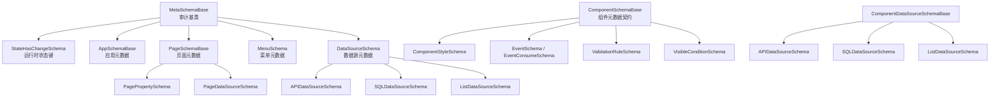
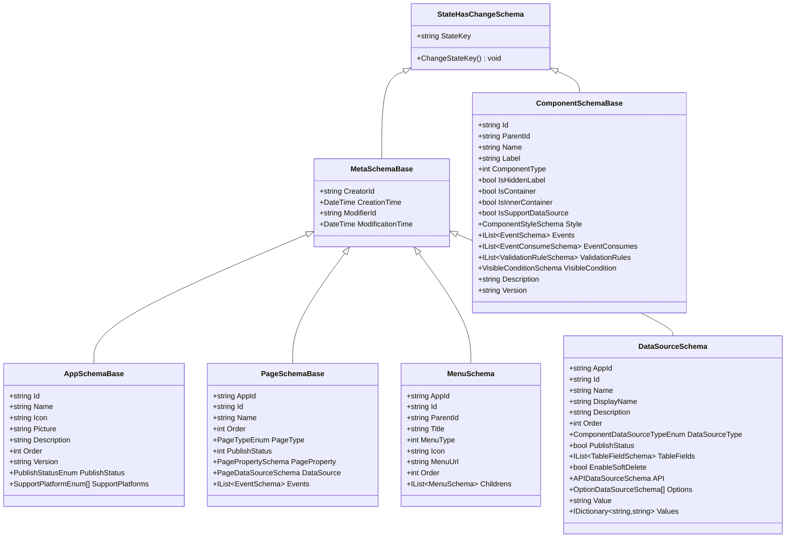
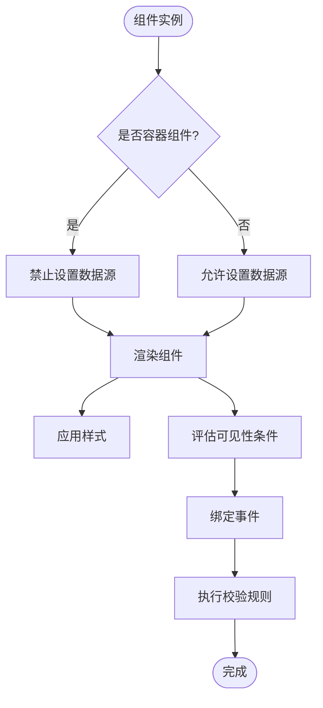
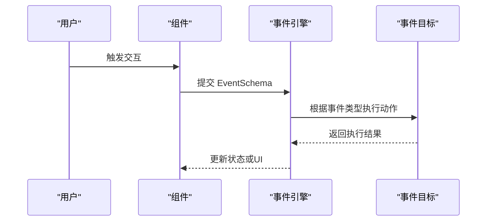
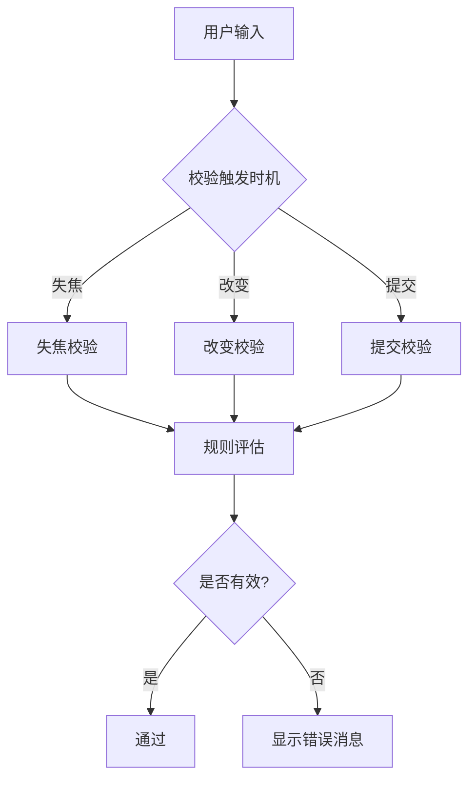
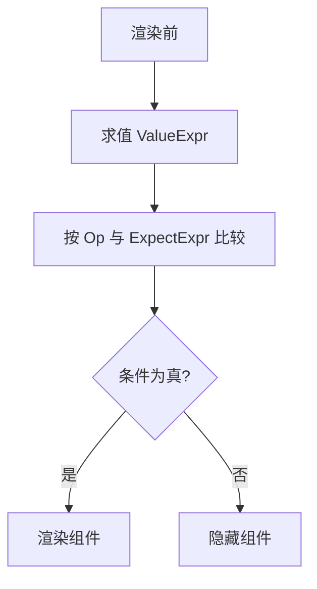
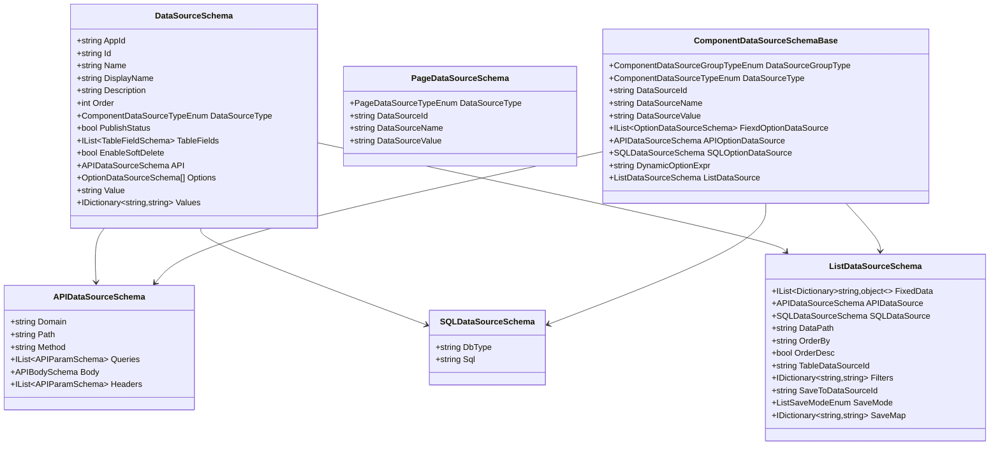
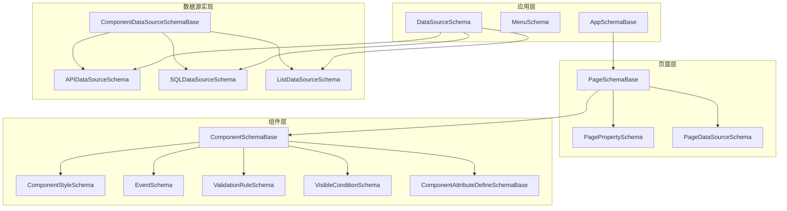
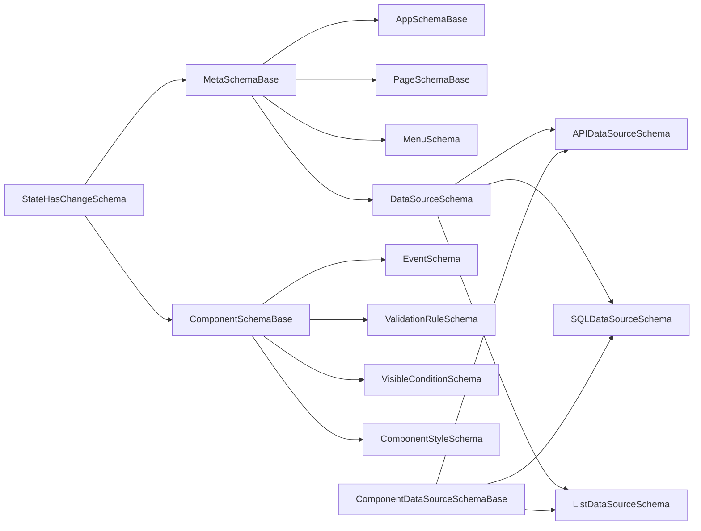

# 元数据 Schema 设计

<cite>
**本文引用的文件**
- [MetaSchemaBase.cs](file://src/LowCode/Common/H.LowCode.MetaSchema/MetaSchemaBase.cs)
- [StateHasChangeSchema.cs](file://src/LowCode/Common/H.LowCode.MetaSchema/StateHasChangeSchema.cs)
- [AppSchemaBase.cs](file://src/LowCode/Common/H.LowCode.MetaSchema/AppSchemaBase.cs)
- [PageSchemaBase.cs](file://src/LowCode/Common/H.LowCode.MetaSchema/PageSchemaBase.cs)
- [ComponentSchemaBase.cs](file://src/LowCode/Common/H.LowCode.MetaSchema/ComponentSchemaBase.cs)
- [MenuSchema.cs](file://src/LowCode/Common/H.LowCode.MetaSchema/MenuSchema.cs)
- [DataSourceSchema.cs](file://src/LowCode/Common/H.LowCode.MetaSchema/DataSourceSchema.cs)
- [APIDataSourceSchema.cs](file://src/LowCode/Common/H.LowCode.MetaSchema/DataSourceSchemas/APIDataSourceSchema.cs)
- [SQLDataSourceSchema.cs](file://src/LowCode/Common/H.LowCode.MetaSchema/DataSourceSchemas/SQLDataSourceSchema.cs)
- [ListDataSourceSchema.cs](file://src/LowCode/Common/H.LowCode.MetaSchema/DataSourceSchemas/ListDataSourceSchema.cs)
- [PageDataSourceSchema.cs](file://src/LowCode/Common/H.LowCode.MetaSchema/DataSourceSchemas/PageDataSourceSchema.cs)
- [ComponentDataSourceSchema.cs](file://src/LowCode/Common/H.LowCode.MetaSchema/DataSourceSchemas/ComponentDataSourceSchema.cs)
- [PagePropertySchema.cs](file://src/LowCode/Common/H.LowCode.MetaSchema/PropertySchemas/PagePropertySchema.cs)
- [ComponentAttributeDefineSchemaBase.cs](file://src/LowCode/Common/H.LowCode.MetaSchema/PropertySchemas/ComponentAttributeDefineSchemaBase.cs)
- [EventSchema.cs](file://src/LowCode/Common/H.LowCode.MetaSchema/PropertySchemas/EventSchema.cs)
- [ValidationRuleSchema.cs](file://src/LowCode/Common/H.LowCode.MetaSchema/PropertySchemas/ValidationRuleSchema.cs)
- [ComponentStyleSchema.cs](file://src/LowCode/Common/H.LowCode.MetaSchema/PropertySchemas/ComponentStyleSchema.cs)
- [VisibleConditionSchema.cs](file://src/LowCode/Common/H.LowCode.MetaSchema/PropertySchemas/VisibleConditionSchema.cs)
- [PageTypeEnum.cs](file://src/LowCode/Common/H.LowCode.MetaSchema/Enums/PageTypeEnum.cs)
- [PublishStatusEnum.cs](file://src/LowCode/Common/H.LowCode.MetaSchema/Enums/PublishStatusEnum.cs)
- [ComponentValueTypeEnum.cs](file://src/LowCode/Common/H.LowCode.MetaSchema/Enums/ComponentValueTypeEnum.cs)
- [EventTargetTypeEnum.cs](file://src/LowCode/Common/H.LowCode.MetaSchema/Enums/EventTargetTypeEnum.cs)
- [PageDataSourceTypeEnum.cs](file://src/LowCode/Common/H.LowCode.MetaSchema/Enums/PageDataSourceTypeEnum.cs)
- [ComponentDataSourceGroupTypeEnum.cs](file://src/LowCode/Common/H.LowCode.MetaSchema/Enums/ComponentDataSourceGroupTypeEnum.cs)
- [ComponentDataSourceTypeEnum.cs](file://src/LowCode/Common/H.LowCode.MetaSchema/Enums/ComponentDataSourceTypeEnum.cs)
</cite>

## 目录
1. [引言](#引言)
2. [项目结构定位](#项目结构定位)
3. [核心抽象基类与审计字段](#核心抽象基类与审计字段)
4. [元数据类型层次结构](#元数据类型层次结构)
5. [组件元数据契约](#组件元数据契约)
6. [属性 Schema 体系](#属性-schema-体系)
7. [事件体系](#事件体系)
8. [校验规则体系](#校验规则体系)
9. [可见性条件体系](#可见性条件体系)
10. [样式定义体系](#样式定义体系)
11. [数据源 Schema 体系](#数据源-schema-体系)
12. [枚举类型说明](#枚举类型说明)
13. [架构总览图](#架构总览图)
14. [依赖关系分析](#依赖关系分析)
15. [Schema 扩展指南](#schema-扩展指南)
16. [性能与序列化特性](#性能与序列化特性)
17. [故障排查指南](#故障排查指南)
18. [结论](#结论)

## 引言
本文件面向 AppLab 低代码平台的元数据 Schema 体系，聚焦以下目标：
- 解释 `MetaSchemaBase` 抽象基类的审计字段与运行时状态机制。
- 梳理 `AppSchemaBase`、`PageSchemaBase`、`ComponentSchemaBase` 的职责与继承关系。
- 说明页面属性、组件属性定义、事件、校验规则、样式、可见性条件等属性 Schema。
- 解释数据源抽象及 API、SQL、列表、选项、页面数据源等具体实现。
- 归纳关键枚举类型的作用。
- 提供 Schema 扩展指南和最佳实践。

该文档以源码为依据，尽量用结构化图表和路径引用替代直接粘贴代码，以便非专业读者也能理解整体设计。

## 项目结构定位
AppLab 的元数据 Schema 集中在低代码公共模块中，主要位于 `H.LowCode.MetaSchema` 命名空间下，并按职责拆分为：
- 顶层元数据基类与实体：如应用、页面、菜单、数据源。
- 属性 Schema：页面属性、组件属性、事件、校验、样式、可见性条件。
- 数据源 Schema：API、SQL、列表、页面级数据源、组件级数据源基类。
- 枚举：页面类型、发布状态、组件值类型、事件目标类型、数据源类型等。

**图示来源**
- [MetaSchemaBase.cs:1-18](file://src/LowCode/Common/H.LowCode.MetaSchema/MetaSchemaBase.cs#L1-L18)
- [StateHasChangeSchema.cs:1-15](file://src/LowCode/Common/H.LowCode.MetaSchema/StateHasChangeSchema.cs#L1-L15)
- [AppSchemaBase.cs:1-31](file://src/LowCode/Common/H.LowCode.MetaSchema/AppSchemaBase.cs#L1-L31)
- [PageSchemaBase.cs:1-40](file://src/LowCode/Common/H.LowCode.MetaSchema/PageSchemaBase.cs#L1-L40)
- [ComponentSchemaBase.cs:1-110](file://src/LowCode/Common/H.LowCode.MetaSchema/ComponentSchemaBase.cs#L1-L110)
- [DataSourceSchema.cs:1-69](file://src/LowCode/Common/H.LowCode.MetaSchema/DataSourceSchema.cs#L1-L69)
- [PagePropertySchema.cs:1-36](file://src/LowCode/Common/H.LowCode.MetaSchema/PropertySchemas/PagePropertySchema.cs#L1-L36)
- [PageDataSourceSchema.cs:1-18](file://src/LowCode/Common/H.LowCode.MetaSchema/DataSourceSchemas/PageDataSourceSchema.cs#L1-L18)
- [APIDataSourceSchema.cs:1-59](file://src/LowCode/Common/H.LowCode.MetaSchema/DataSourceSchemas/APIDataSourceSchema.cs#L1-L59)
- [SQLDataSourceSchema.cs:1-12](file://src/LowCode/Common/H.LowCode.MetaSchema/DataSourceSchemas/SQLDataSourceSchema.cs#L1-L12)
- [ListDataSourceSchema.cs:1-92](file://src/LowCode/Common/H.LowCode.MetaSchema/DataSourceSchemas/ListDataSourceSchema.cs#L1-L92)
- [ComponentDataSourceSchema.cs:1-58](file://src/LowCode/Common/H.LowCode.MetaSchema/DataSourceSchemas/ComponentDataSourceSchema.cs#L1-L58)

**章节来源**
- [MetaSchemaBase.cs:1-18](file://src/LowCode/Common/H.LowCode.MetaSchema/MetaSchemaBase.cs#L1-L18)
- [AppSchemaBase.cs:1-31](file://src/LowCode/Common/H.LowCode.MetaSchema/AppSchemaBase.cs#L1-L31)
- [PageSchemaBase.cs:1-40](file://src/LowCode/Common/H.LowCode.MetaSchema/PageSchemaBase.cs#L1-L40)
- [ComponentSchemaBase.cs:1-110](file://src/LowCode/Common/H.LowCode.MetaSchema/ComponentSchemaBase.cs#L1-L110)
- [DataSourceSchema.cs:1-69](file://src/LowCode/Common/H.LowCode.MetaSchema/DataSourceSchema.cs#L1-L69)

## 核心抽象基类与审计字段
### `StateHasChangeSchema`：运行时状态键
- 提供内部不可见的 `StateKey`，用于运行时刷新或状态管理。
- 提供 `ChangeStateKey()` 方法，通过短 ID 生成器生成新键。
- 所有需要参与渲染或响应式更新的元数据均可继承该类，以获得统一的状态键能力。

### `MetaSchemaBase`：审计字段基类
- 继承 `StateHasChangeSchema`，为所有可持久化的元数据增加审计能力。
- 包含四个常用审计字段：
  - `CreatorId`：创建者标识。
  - `CreationTime`：创建时间。
  - `ModifierId`：修改者标识。
  - `ModificationTime`：修改时间。
- 所有 JSON 字段均使用 `[JsonPropertyName]` 指定紧凑的序列化键名，便于存储和传输。

**章节来源**
- [StateHasChangeSchema.cs:1-15](file://src/LowCode/Common/H.LowCode.MetaSchema/StateHasChangeSchema.cs#L1-L15)
- [MetaSchemaBase.cs:1-18](file://src/LowCode/Common/H.LowCode.MetaSchema/MetaSchemaBase.cs#L1-L18)

## 元数据类型层次结构
AppLab 的元数据按“应用 → 页面 → 组件”组织：
- `AppSchemaBase`：应用层元数据，继承 `MetaSchemaBase`。
- `PageSchemaBase`：页面层元数据，继承 `MetaSchemaBase`。
- `ComponentSchemaBase`：组件实例元数据，继承 `StateHasChangeSchema`，不继承 `MetaSchemaBase`，因为组件实例通常随页面保存，不一定独立具备完整审计字段。
- `MenuSchema`：菜单元数据，继承 `MetaSchemaBase`，描述应用菜单树。
- `DataSourceSchema`：数据源元数据，继承 `MetaSchemaBase`，描述应用级数据源。

**图示来源**
- [MetaSchemaBase.cs:1-18](file://src/LowCode/Common/H.LowCode.MetaSchema/MetaSchemaBase.cs#L1-L18)
- [StateHasChangeSchema.cs:1-15](file://src/LowCode/Common/H.LowCode.MetaSchema/StateHasChangeSchema.cs#L1-L15)
- [AppSchemaBase.cs:1-31](file://src/LowCode/Common/H.LowCode.MetaSchema/AppSchemaBase.cs#L1-L31)
- [PageSchemaBase.cs:1-40](file://src/LowCode/Common/H.LowCode.MetaSchema/PageSchemaBase.cs#L1-L40)
- [ComponentSchemaBase.cs:1-110](file://src/LowCode/Common/H.LowCode.MetaSchema/ComponentSchemaBase.cs#L1-L110)
- [MenuSchema.cs:1-37](file://src/LowCode/Common/H.LowCode.MetaSchema/MenuSchema.cs#L1-L37)
- [DataSourceSchema.cs:1-69](file://src/LowCode/Common/H.LowCode.MetaSchema/DataSourceSchema.cs#L1-L69)

**章节来源**
- [AppSchemaBase.cs:1-31](file://src/LowCode/Common/H.LowCode.MetaSchema/AppSchemaBase.cs#L1-L31)
- [PageSchemaBase.cs:1-40](file://src/LowCode/Common/H.LowCode.MetaSchema/PageSchemaBase.cs#L1-L40)
- [ComponentSchemaBase.cs:1-110](file://src/LowCode/Common/H.LowCode.MetaSchema/ComponentSchemaBase.cs#L1-L110)
- [MenuSchema.cs:1-37](file://src/LowCode/Common/H.LowCode.MetaSchema/MenuSchema.cs#L1-L37)
- [DataSourceSchema.cs:1-69](file://src/LowCode/Common/H.LowCode.MetaSchema/DataSourceSchema.cs#L1-L69)

## 组件元数据契约
`ComponentSchemaBase` 是组件实例的核心契约，定义组件在页面中的实例化信息、行为、样式、事件、校验、可见性等。

### 关键字段分组
- **实例标识与层级**
  - `Id`：组件实例唯一标识。
  - `ParentId`：父容器组件标识。
  - `IsContainer`、`IsInnerContainer`：容器标记，影响是否支持数据源。
- **显示信息**
  - `Name`、`Label`、`IsHiddenLabel`：组件名称、标签及标签隐藏。
  - `Description`、`Version`：组件描述与版本。
- **行为控制**
  - `ComponentType`：原子组件或组合组件。
  - `IsSupportDataSource`：是否支持数据源；容器组件默认不支持。
- **可视化配置**
  - `Style`：组件样式。
- **交互与逻辑**
  - `Events`：事件定义。
  - `EventConsumes`：事件消费。
  - `ValidationRules`：校验规则。
  - `VisibleCondition`：可见性条件。

**图示来源**
- [ComponentSchemaBase.cs:1-110](file://src/LowCode/Common/H.LowCode.MetaSchema/ComponentSchemaBase.cs#L1-L110)
- [ComponentStyleSchema.cs:1-38](file://src/LowCode/Common/H.LowCode.MetaSchema/PropertySchemas/ComponentStyleSchema.cs#L1-L38)
- [VisibleConditionSchema.cs:1-49](file://src/LowCode/Common/H.LowCode.MetaSchema/PropertySchemas/VisibleConditionSchema.cs#L1-L49)
- [EventSchema.cs:1-66](file://src/LowCode/Common/H.LowCode.MetaSchema/PropertySchemas/EventSchema.cs#L1-L66)
- [ValidationRuleSchema.cs:1-172](file://src/LowCode/Common/H.LowCode.MetaSchema/PropertySchemas/ValidationRuleSchema.cs#L1-L172)

**章节来源**
- [ComponentSchemaBase.cs:1-110](file://src/LowCode/Common/H.LowCode.MetaSchema/ComponentSchemaBase.cs#L1-L110)

## 属性 Schema 体系
### 页面属性 `PagePropertySchema`
- `PageLayout`：页面布局列数。
- `TitleWidth`：标题宽度。
- `DefaultStyle`、`CustomStyle`：默认样式与自定义样式。
- `DataSource`：页面数据源配置。

**章节来源**
- [PagePropertySchema.cs:1-36](file://src/LowCode/Common/H.LowCode.MetaSchema/PropertySchemas/PagePropertySchema.cs#L1-L36)

### 组件属性定义 `ComponentAttributeDefineSchemaBase`
- `AttributeName`：组件属性名称，必须与组件实际属性一致。
- `AttributeClrType`：属性的 CLR 类型字符串。
- `AttributeValue`：属性值，类型为 `object`，用于设计时或运行时的动态赋值。

**章节来源**
- [ComponentAttributeDefineSchemaBase.cs:1-25](file://src/LowCode/Common/H.LowCode.MetaSchema/PropertySchemas/ComponentAttributeDefineSchemaBase.cs#L1-L25)

## 事件体系
事件由 `EventSchema` 描述，支持多种事件目标：
- 标准事件：打开页面、操作组件、数据操作。
- 自定义事件：支持 JavaScript、Python、C# 脚本。
- 事件参数：通用参数映射与行数据参数映射。

**图示来源**
- [EventSchema.cs:1-66](file://src/LowCode/Common/H.LowCode.MetaSchema/PropertySchemas/EventSchema.cs#L1-L66)
- [EventTargetTypeEnum.cs:1-27](file://src/LowCode/Common/H.LowCode.MetaSchema/Enums/EventTargetTypeEnum.cs#L1-L27)
- [EventDataActionTypeEnum.cs:1-22](file://src/LowCode/Common/H.LowCode.MetaSchema/Enums/EventDataActionTypeEnum.cs#L1-L22)

**章节来源**
- [EventSchema.cs:1-66](file://src/LowCode/Common/H.LowCode.MetaSchema/PropertySchemas/EventSchema.cs#L1-L66)

## 校验规则体系
`ValidationRuleSchema` 定义组件输入数据的校验规则，包括：
- 必填、长度范围、数值范围。
- 正则表达式、邮箱、手机号、URL、身份证号。
- 自定义表达式校验。
- 触发时机：失焦、改变、提交。

**图示来源**
- [ValidationRuleSchema.cs:1-172](file://src/LowCode/Common/H.LowCode.MetaSchema/PropertySchemas/ValidationRuleSchema.cs#L1-L172)

**章节来源**
- [ValidationRuleSchema.cs:1-172](file://src/LowCode/Common/H.LowCode.MetaSchema/PropertySchemas/ValidationRuleSchema.cs#L1-L172)

## 可见性条件体系
`VisibleConditionSchema` 控制组件是否在渲染阶段显示：
- `ValueExpr`：值来源表达式，例如读取表单字段、查询参数或行数据。
- `Op`：比较操作符，等于、不等于、包含、非空、为空、在列表中。
- `ExpectExpr`：期望值表达式，可与值进行条件判断。

**图示来源**
- [VisibleConditionSchema.cs:1-49](file://src/LowCode/Common/H.LowCode.MetaSchema/PropertySchemas/VisibleConditionSchema.cs#L1-L49)

**章节来源**
- [VisibleConditionSchema.cs:1-49](file://src/LowCode/Common/H.LowCode.MetaSchema/PropertySchemas/VisibleConditionSchema.cs#L1-L49)

## 样式定义体系
`ComponentStyleSchema` 定义组件实例的样式：
- `ItemWidth`、`ItemHeight`：组件宽高。
- `LabelWidth`：标签宽度。
- `DefaultStyle`、`CustomStyle`：默认样式与自定义样式。

**章节来源**
- [ComponentStyleSchema.cs:1-38](file://src/LowCode/Common/H.LowCode.MetaSchema/PropertySchemas/ComponentStyleSchema.cs#L1-L38)

## 数据源 Schema 体系
### 抽象与应用级数据源
- `DataSourceSchema`：应用级数据源元数据，包含数据源基本信息、类型、发布状态、表字段、软删除开关、API 配置、选项值等。
- `PageDataSourceSchema`：页面级数据源配置，表示页面绑定的数据源类型、ID、名称、值。
- `ComponentDataSourceSchemaBase`：组件级数据源抽象基类，支持固定选项、API 选项、SQL 选项、动态表达式、列表循环数据源。

### 具体数据源实现
- `APIDataSourceSchema`：API 数据源，包含域名、路径、方法、查询参数、请求体、请求头。
- `SQLDataSourceSchema`：SQL 数据源，包含数据库类型与 SQL 语句。
- `ListDataSourceSchema`：列表循环数据源，支持固定数据、API/SQL 数据、响应路径、排序、过滤、保存目标与保存映射。

**图示来源**
- [DataSourceSchema.cs:1-69](file://src/LowCode/Common/H.LowCode.MetaSchema/DataSourceSchema.cs#L1-L69)
- [PageDataSourceSchema.cs:1-18](file://src/LowCode/Common/H.LowCode.MetaSchema/DataSourceSchemas/PageDataSourceSchema.cs#L1-L18)
- [ComponentDataSourceSchema.cs:1-58](file://src/LowCode/Common/H.LowCode.MetaSchema/DataSourceSchemas/ComponentDataSourceSchema.cs#L1-L58)
- [APIDataSourceSchema.cs:1-59](file://src/LowCode/Common/H.LowCode.MetaSchema/DataSourceSchemas/APIDataSourceSchema.cs#L1-L59)
- [SQLDataSourceSchema.cs:1-12](file://src/LowCode/Common/H.LowCode.MetaSchema/DataSourceSchemas/SQLDataSourceSchema.cs#L1-L12)
- [ListDataSourceSchema.cs:1-92](file://src/LowCode/Common/H.LowCode.MetaSchema/DataSourceSchemas/ListDataSourceSchema.cs#L1-L92)

**章节来源**
- [DataSourceSchema.cs:1-69](file://src/LowCode/Common/H.LowCode.MetaSchema/DataSourceSchema.cs#L1-L69)
- [PageDataSourceSchema.cs:1-18](file://src/LowCode/Common/H.LowCode.MetaSchema/DataSourceSchemas/PageDataSourceSchema.cs#L1-L18)
- [ComponentDataSourceSchema.cs:1-58](file://src/LowCode/Common/H.LowCode.MetaSchema/DataSourceSchemas/ComponentDataSourceSchema.cs#L1-L58)
- [APIDataSourceSchema.cs:1-59](file://src/LowCode/Common/H.LowCode.MetaSchema/DataSourceSchemas/APIDataSourceSchema.cs#L1-L59)
- [SQLDataSourceSchema.cs:1-12](file://src/LowCode/Common/H.LowCode.MetaSchema/DataSourceSchemas/SQLDataSourceSchema.cs#L1-L12)
- [ListDataSourceSchema.cs:1-92](file://src/LowCode/Common/H.LowCode.MetaSchema/DataSourceSchemas/ListDataSourceSchema.cs#L1-L92)

## 枚举类型说明
### 页面类型 `PageTypeEnum`
- 普通页面、表单页面、表格页面、报表页面。
- 用于区分页面模板、布局与默认行为。

### 发布状态 `PublishStatusEnum`
- 开发中、审批中、已发布。
- 用于应用生命周期管理与权限控制。

### 组件值类型 `ComponentValueTypeEnum`
- 字符串、文本、整数、浮点数、小数、布尔、日期、数组、选项、表格、字符串列表、整数列表、树形等。
- 决定组件属性值的类型与编辑器行为。

### 事件目标类型 `EventTargetTypeEnum`
- 无、页面、组件、数据操作、自定义事件。
- 配合事件处理类型与自定义语言，形成灵活的事件编排。

### 其他相关枚举
- `PageDataSourceTypeEnum`：页面数据源类型（无、数据库、API）。
- `ComponentDataSourceGroupTypeEnum`：组件数据源分组（通用、选项、表格、树、列表）。
- `ComponentDataSourceTypeEnum`：组件数据源类型（无、数据库、API、选项、SQL、表达式、固定值）。

**章节来源**
- [PageTypeEnum.cs:1-15](file://src/LowCode/Common/H.LowCode.MetaSchema/Enums/PageTypeEnum.cs#L1-L15)
- [PublishStatusEnum.cs:1-8](file://src/LowCode/Common/H.LowCode.MetaSchema/Enums/PublishStatusEnum.cs#L1-L8)
- [ComponentValueTypeEnum.cs:1-20](file://src/LowCode/Common/H.LowCode.MetaSchema/Enums/ComponentValueTypeEnum.cs#L1-L20)
- [EventTargetTypeEnum.cs:1-27](file://src/LowCode/Common/H.LowCode.MetaSchema/Enums/EventTargetTypeEnum.cs#L1-L27)
- [PageDataSourceTypeEnum.cs:1-12](file://src/LowCode/Common/H.LowCode.MetaSchema/Enums/PageDataSourceTypeEnum.cs#L1-L12)
- [ComponentDataSourceGroupTypeEnum.cs:1-12](file://src/LowCode/Common/H.LowCode.MetaSchema/Enums/ComponentDataSourceGroupTypeEnum.cs#L1-L12)
- [ComponentDataSourceTypeEnum.cs:1-14](file://src/LowCode/Common/H.LowCode.MetaSchema/Enums/ComponentDataSourceTypeEnum.cs#L1-L14)

## 架构总览图
下图展示元数据从应用到页面、组件、数据源的完整关系，并标注关键枚举与属性 Schema 的归属。

**图示来源**
- [AppSchemaBase.cs:1-31](file://src/LowCode/Common/H.LowCode.MetaSchema/AppSchemaBase.cs#L1-L31)
- [MenuSchema.cs:1-37](file://src/LowCode/Common/H.LowCode.MetaSchema/MenuSchema.cs#L1-L37)
- [DataSourceSchema.cs:1-69](file://src/LowCode/Common/H.LowCode.MetaSchema/DataSourceSchema.cs#L1-L69)
- [PageSchemaBase.cs:1-40](file://src/LowCode/Common/H.LowCode.MetaSchema/PageSchemaBase.cs#L1-L40)
- [PagePropertySchema.cs:1-36](file://src/LowCode/Common/H.LowCode.MetaSchema/PropertySchemas/PagePropertySchema.cs#L1-L36)
- [PageDataSourceSchema.cs:1-18](file://src/LowCode/Common/H.LowCode.MetaSchema/DataSourceSchemas/PageDataSourceSchema.cs#L1-L18)
- [ComponentSchemaBase.cs:1-110](file://src/LowCode/Common/H.LowCode.MetaSchema/ComponentSchemaBase.cs#L1-L110)
- [ComponentStyleSchema.cs:1-38](file://src/LowCode/Common/H.LowCode.MetaSchema/PropertySchemas/ComponentStyleSchema.cs#L1-L38)
- [EventSchema.cs:1-66](file://src/LowCode/Common/H.LowCode.MetaSchema/PropertySchemas/EventSchema.cs#L1-L66)
- [ValidationRuleSchema.cs:1-172](file://src/LowCode/Common/H.LowCode.MetaSchema/PropertySchemas/ValidationRuleSchema.cs#L1-L172)
- [VisibleConditionSchema.cs:1-49](file://src/LowCode/Common/H.LowCode.MetaSchema/PropertySchemas/VisibleConditionSchema.cs#L1-L49)
- [ComponentAttributeDefineSchemaBase.cs:1-25](file://src/LowCode/Common/H.LowCode.MetaSchema/PropertySchemas/ComponentAttributeDefineSchemaBase.cs#L1-L25)
- [APIDataSourceSchema.cs:1-59](file://src/LowCode/Common/H.LowCode.MetaSchema/DataSourceSchemas/APIDataSourceSchema.cs#L1-L59)
- [SQLDataSourceSchema.cs:1-12](file://src/LowCode/Common/H.LowCode.MetaSchema/DataSourceSchemas/SQLDataSourceSchema.cs#L1-L12)
- [ListDataSourceSchema.cs:1-92](file://src/LowCode/Common/H.LowCode.MetaSchema/DataSourceSchemas/ListDataSourceSchema.cs#L1-L92)
- [ComponentDataSourceSchema.cs:1-58](file://src/LowCode/Common/H.LowCode.MetaSchema/DataSourceSchemas/ComponentDataSourceSchema.cs#L1-L58)

## 依赖关系分析
- `MetaSchemaBase` 是所有可审计元数据的基础，集中管理创建者与修改者信息。
- `StateHasChangeSchema` 是所有需要运行时状态刷新能力的基类。
- `ComponentSchemaBase` 是组件实例的聚合点，依赖样式、事件、校验、可见性条件等属性 Schema。
- 数据源体系以 `DataSourceSchema` 为中心，向下延伸 API、SQL、列表等实现；组件级数据源通过 `ComponentDataSourceSchemaBase` 复用相同的数据源模型。
- 枚举类型贯穿页面、事件、数据源、组件值类型等场景，提供强类型的业务语义。

**图示来源**
- [StateHasChangeSchema.cs:1-15](file://src/LowCode/Common/H.LowCode.MetaSchema/StateHasChangeSchema.cs#L1-L15)
- [MetaSchemaBase.cs:1-18](file://src/LowCode/Common/H.LowCode.MetaSchema/MetaSchemaBase.cs#L1-L18)
- [AppSchemaBase.cs:1-31](file://src/LowCode/Common/H.LowCode.MetaSchema/AppSchemaBase.cs#L1-L31)
- [PageSchemaBase.cs:1-40](file://src/LowCode/Common/H.LowCode.MetaSchema/PageSchemaBase.cs#L1-L40)
- [ComponentSchemaBase.cs:1-110](file://src/LowCode/Common/H.LowCode.MetaSchema/ComponentSchemaBase.cs#L1-L110)
- [EventSchema.cs:1-66](file://src/LowCode/Common/H.LowCode.MetaSchema/PropertySchemas/EventSchema.cs#L1-L66)
- [ValidationRuleSchema.cs:1-172](file://src/LowCode/Common/H.LowCode.MetaSchema/PropertySchemas/ValidationRuleSchema.cs#L1-L172)
- [VisibleConditionSchema.cs:1-49](file://src/LowCode/Common/H.LowCode.MetaSchema/PropertySchemas/VisibleConditionSchema.cs#L1-L49)
- [ComponentStyleSchema.cs:1-38](file://src/LowCode/Common/H.LowCode.MetaSchema/PropertySchemas/ComponentStyleSchema.cs#L1-L38)
- [DataSourceSchema.cs:1-69](file://src/LowCode/Common/H.LowCode.MetaSchema/DataSourceSchema.cs#L1-L69)
- [APIDataSourceSchema.cs:1-59](file://src/LowCode/Common/H.LowCode.MetaSchema/DataSourceSchemas/APIDataSourceSchema.cs#L1-L59)
- [SQLDataSourceSchema.cs:1-12](file://src/LowCode/Common/H.LowCode.MetaSchema/DataSourceSchemas/SQLDataSourceSchema.cs#L1-L12)
- [ListDataSourceSchema.cs:1-92](file://src/LowCode/Common/H.LowCode.MetaSchema/DataSourceSchemas/ListDataSourceSchema.cs#L1-L92)
- [ComponentDataSourceSchema.cs:1-58](file://src/LowCode/Common/H.LowCode.MetaSchema/DataSourceSchemas/ComponentDataSourceSchema.cs#L1-L58)

## Schema 扩展指南
### 新增页面类型
- 在 `PageTypeEnum` 中添加新值，并在页面模板、渲染逻辑中补充对应处理。
- 若页面类型影响布局或默认数据源，需在 `PageSchemaBase` 的使用方做兼容。

### 新增组件值类型
- 在 `ComponentValueTypeEnum` 中添加新类型。
- 更新组件属性编辑器、序列化器、校验器，确保属性值正确解析与验证。

### 新增事件目标或动作
- 在 `EventTargetTypeEnum` 或 `EventDataActionTypeEnum` 中添加新目标或动作。
- 在事件引擎中补充对应处理器，确保事件能路由到正确的目标。

### 新增数据源类型
- 在 `ComponentDataSourceTypeEnum` 或 `PageDataSourceTypeEnum` 中添加新类型。
- 扩展 `DataSourceSchema` 或使用方的解析逻辑，确保新类型可被识别与持久化。
- 若涉及外部系统，应在 API 或 SQL 数据源基础上提供适配层。

### 新增校验规则
- 在 `ValidationRuleTypeEnum` 中添加规则类型。
- 在校验引擎中实现规则评估逻辑，并支持相应的错误消息。

### 新增可见性条件操作
- 在 `VisibleConditionOpEnum` 中添加比较操作。
- 在可见性求值引擎中实现表达式求值与比较逻辑。

### 最佳实践
- 保持 JSON 键名简短且稳定，避免破坏已有元数据格式。
- 对新增字段设置合理默认值，保证向后兼容。
- 对运行时字段（如 `StateKey`）使用 `[JsonIgnore]`，避免污染持久化数据。
- 对枚举值添加中文显示名称，提升设计器可读性。
- 对复杂数据结构优先使用 `IDictionary<string,string>` 或专用 Schema，而非裸字符串。

**章节来源**
- [PageTypeEnum.cs:1-15](file://src/LowCode/Common/H.LowCode.MetaSchema/Enums/PageTypeEnum.cs#L1-L15)
- [ComponentValueTypeEnum.cs:1-20](file://src/LowCode/Common/H.LowCode.MetaSchema/Enums/ComponentValueTypeEnum.cs#L1-L20)
- [EventTargetTypeEnum.cs:1-27](file://src/LowCode/Common/H.LowCode.MetaSchema/Enums/EventTargetTypeEnum.cs#L1-L27)
- [EventDataActionTypeEnum.cs:1-22](file://src/LowCode/Common/H.LowCode.MetaSchema/Enums/EventDataActionTypeEnum.cs#L1-L22)
- [ComponentDataSourceTypeEnum.cs:1-14](file://src/LowCode/Common/H.LowCode.MetaSchema/Enums/ComponentDataSourceTypeEnum.cs#L1-L14)
- [PageDataSourceTypeEnum.cs:1-12](file://src/LowCode/Common/H.LowCode.MetaSchema/Enums/PageDataSourceTypeEnum.cs#L1-L12)
- [ValidationRuleSchema.cs:1-172](file://src/LowCode/Common/H.LowCode.MetaSchema/PropertySchemas/ValidationRuleSchema.cs#L1-L172)
- [VisibleConditionSchema.cs:1-49](file://src/LowCode/Common/H.LowCode.MetaSchema/PropertySchemas/VisibleConditionSchema.cs#L1-L49)

## 性能与序列化特性
- 所有元数据字段普遍使用 `[JsonPropertyName]`，使 JSON 体积更小、结构更稳定。
- `StateKey` 使用 `[JsonIgnore]`，避免将运行时状态写入持久化数据。
- 大量集合字段采用 `IList<T>`、`IDictionary<string,string>`，兼顾扩展性与序列化兼容性。
- 组件数据源、页面数据源等配置对象默认初始化，减少空引用风险。

**章节来源**
- [MetaSchemaBase.cs:1-18](file://src/LowCode/Common/H.LowCode.MetaSchema/MetaSchemaBase.cs#L1-L18)
- [StateHasChangeSchema.cs:1-15](file://src/LowCode/Common/H.LowCode.MetaSchema/StateHasChangeSchema.cs#L1-L15)
- [ComponentSchemaBase.cs:1-110](file://src/LowCode/Common/H.LowCode.MetaSchema/ComponentSchemaBase.cs#L1-L110)
- [DataSourceSchema.cs:1-69](file://src/LowCode/Common/H.LowCode.MetaSchema/DataSourceSchema.cs#L1-L69)

## 故障排查指南
### 组件不显示
- 检查 `VisibleConditionSchema` 的表达式与操作符是否正确。
- 确认 `ValueExpr` 与 `ExpectExpr` 能正确取值。
- 查看 `IsContainer` 与 `IsSupportDataSource` 是否影响渲染逻辑。

**章节来源**
- [VisibleConditionSchema.cs:1-49](file://src/LowCode/Common/H.LowCode.MetaSchema/PropertySchemas/VisibleConditionSchema.cs#L1-L49)
- [ComponentSchemaBase.cs:1-110](file://src/LowCode/Common/H.LowCode.MetaSchema/ComponentSchemaBase.cs#L1-L110)

### 校验未生效
- 检查 `ValidationRuleSchema.IsEnabled` 是否为真。
- 确认 `Trigger` 与用户交互时机匹配。
- 核对 `RuleType` 与字段类型是否兼容。

**章节来源**
- [ValidationRuleSchema.cs:1-172](file://src/LowCode/Common/H.LowCode.MetaSchema/PropertySchemas/ValidationRuleSchema.cs#L1-L172)

### 事件未触发
- 检查 `EventSchema.EventHandlerType` 是否与目标匹配。
- 确认 `EventTargetId` 与目标组件或页面 ID 一致。
- 自定义事件需确认 `EventCustomLanguage` 与 `EventCustomScript` 配置正确。

**章节来源**
- [EventSchema.cs:1-66](file://src/LowCode/Common/H.LowCode.MetaSchema/PropertySchemas/EventSchema.cs#L1-L66)
- [EventTargetTypeEnum.cs:1-27](file://src/LowCode/Common/H.LowCode.MetaSchema/Enums/EventTargetTypeEnum.cs#L1-L27)

### 数据源无法加载
- 确认 `DataSourceSchema.DataSourceType` 与实际配置一致。
- API 数据源需检查 `Domain`、`Path`、`Method`、`Headers`、`Body`。
- SQL 数据源需检查 `DbType` 与 `Sql`。
- 列表数据源需检查 `DataPath`、`Filters`、`SaveMap`。

**章节来源**
- [DataSourceSchema.cs:1-69](file://src/LowCode/Common/H.LowCode.MetaSchema/DataSourceSchema.cs#L1-L69)
- [APIDataSourceSchema.cs:1-59](file://src/LowCode/Common/H.LowCode.MetaSchema/DataSourceSchemas/APIDataSourceSchema.cs#L1-L59)
- [SQLDataSourceSchema.cs:1-12](file://src/LowCode/Common/H.LowCode.MetaSchema/DataSourceSchemas/SQLDataSourceSchema.cs#L1-L12)
- [ListDataSourceSchema.cs:1-92](file://src/LowCode/Common/H.LowCode.MetaSchema/DataSourceSchemas/ListDataSourceSchema.cs#L1-L92)

## 结论
AppLab 的元数据 Schema 体系以 `MetaSchemaBase` 与 `StateHasChangeSchema` 为核心，围绕应用、页面、组件三层展开，并通过属性 Schema、事件、校验、样式、可见性条件等构建完整的低代码建模能力。数据源体系则通过抽象与具体实现的分离，支持 API、SQL、列表、选项等多种数据来源。枚举类型贯穿各层，提供强类型业务语义。遵循本文档的扩展指南与最佳实践，可在不破坏现有元数据格式的前提下，持续增强平台能力。