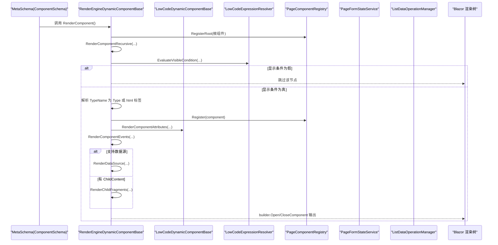
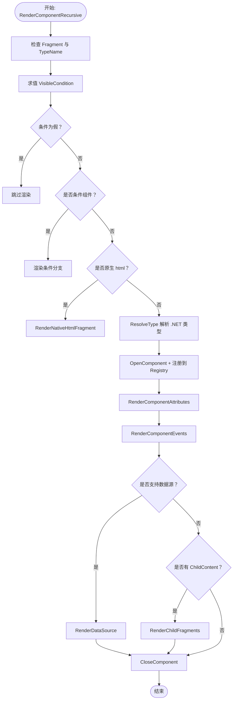

# 渲染引擎架构

<cite>
**本文引用的文件**   
- [RenderEngineDynamicComponentBase.cs](file://src/LowCode/RenderEngine/H.LowCode.RenderEngineBase/RenderEngineDynamicComponentBase.cs)
- [PageComponentRegistry.cs](file://src/LowCode/RenderEngine/H.LowCode.RenderEngineBase/PageComponentRegistry.cs)
- [EventCallbackHelper.cs](file://src/LowCode/RenderEngine/H.LowCode.RenderEngineBase/EventCallbackHelper.cs)
- [LowCodeExpressionResolver.cs](file://src/LowCode/RenderEngine/H.LowCode.RenderEngineBase/LowCodeExpressionResolver.cs)
- [ListDataOperationManager.cs](file://src/LowCode/RenderEngine/H.LowCode.RenderEngineBase/ListDataOperationManager.cs)
- [ThemePartLayoutBase.cs](file://src/LowCode/RenderEngine/H.LowCode.RenderEngineBase/Layout/ThemePartLayoutBase.cs)
- [RenderEngineBaseModule.cs](file://src/LowCode/RenderEngine/H.LowCode.RenderEngineBase/RenderEngineBaseModule.cs)
- [PageFormStateService.cs](file://src/LowCode/RenderEngine/H.LowCode.RenderEngineBase/PageFormStateService.cs)
- [RenderEngineLowCodeComponentBase.cs](file://src/LowCode/RenderEngine/H.LowCode.RenderEngineBase/RenderEngineLowCodeComponentBase.cs)
- [LowCodeComponentBase.cs](file://src/LowCode/Common/H.LowCode.ComponentBase/LowCodeComponentBase.cs)
- [LowCodeDynamicComponentBase.cs](file://src/LowCode/Common/H.LowCode.ComponentBase/LowCodeDynamicComponentBase.cs)
- [PageCascadingModel.cs](file://src/LowCode/Common/H.LowCode.ComponentBase/CascadingModels/PageCascadingModel.cs)
- [IMetaAppService.cs](file://src/LowCode/RenderEngine/H.LowCode.RenderEngine.Application.Contracts/RenderAppServices/IMetaAppService.cs)
- [PageSchema.cs](file://src/LowCode/Common/H.LowCode.MetaSchema.RenderEngine/PageSchema.cs)
- [ComponentSchema.cs](file://src/LowCode/Common/H.LowCode.MetaSchema.RenderEngine/ComponentSchema.cs)
- [ComponentFragmentSchema.cs](file://src/LowCode/Common/H.LowCode.MetaSchema.RenderEngine/PropertySchemas/ComponentFragmentSchema.cs)
- [ComponentDataSourceSchema.cs](file://src/LowCode/Common/H.LowCode.MetaSchema.RenderEngine/DataSourceSchemas/ComponentDataSourceSchema.cs)
- [PageSchemaBase.cs](file://src/LowCode/Common/H.LowCode.MetaSchema/PageSchemaBase.cs)
- [ComponentSchemaBase.cs](file://src/LowCode/Common/H.LowCode.MetaSchema/ComponentSchemaBase.cs)
- [EventSchema.cs](file://src/LowCode/Common/H.LowCode.MetaSchema/PropertySchemas/EventSchema.cs)
- [VisibleConditionSchema.cs](file://src/LowCode/Common/H.LowCode.MetaSchema/PropertySchemas/VisibleConditionSchema.cs)
- [ListDataSourceSchema.cs](file://src/LowCode/Common/H.LowCode.MetaSchema/DataSourceSchemas/ListDataSourceSchema.cs)
</cite>

## 目录
1. [引言](#引言)
2. [项目结构](#项目结构)
3. [核心组件](#核心组件)
4. [架构总览](#架构总览)
5. [详细组件分析](#详细组件分析)
6. [依赖关系分析](#依赖关系分析)
7. [性能与扩展性](#性能与扩展性)
8. [主题系统](#主题系统)
9. [故障排查指南](#故障排查指南)
10. [结论](#结论)

## 引言
本文件面向 AppLab 低代码渲染引擎，聚焦从 MetaSchema 到运行时 Blazor 组件的动态转换过程。文档围绕 RenderEngine 的核心流程展开：元数据解析、组件树构建、动态组件实例化、Blazor 渲染，并解释 H.LowCode.RenderEngineBase 提供的注册表、事件绑定、表达式求值、表单状态与列表数据管理等能力；同时说明 H.LowCode.RenderEngine.Application.Contracts 暴露的应用接口、H.LowCode.Themes.AntBlazor 的主题定位，以及可落地的性能优化策略与扩展点。

## 项目结构
渲染引擎相关代码主要分布在以下模块：
- 元数据模型：H.LowCode.MetaSchema 与 H.LowCode.MetaSchema.RenderEngine，描述应用、页面、组件、数据源、事件与可见条件等结构化定义。
- 渲染基座：H.LowCode.RenderEngineBase，提供动态组件渲染、事件与属性映射、表达式求值、表单状态与列表数据管理、页面布局基础类与服务注册。
- 应用接口：H.LowCode.RenderEngine.Application.Contracts，对外暴露页面与应用元数据查询等契约。
- 主题实现：H.LowCode.Themes.AntBlazor，基于 Ant Design Blazor 的渲染主题（具体类型由项目工程组织决定）。

```mermaid
graph TB
    subgraph "元数据层"
        MS_App["AppSchemaBase"]
        MS_Page["PageSchemaBase"]
        MS_Component["ComponentSchemaBase"]
        MS_Frag["ComponentFragmentSchema"]
        MS_DS["ComponentDataSourceSchema"]
        MS_Event["EventSchema"]
        MS_Vis["VisibleConditionSchema"]
        MS_ListDS["ListDataSourceSchema"]
    end

    subgraph "渲染基座"
        RE_Dyn["RenderEngineDynamicComponentBase"]
        RE_Registry["PageComponentRegistry"]
        RE_Expr["LowCodeExpressionResolver"]
        RE_Form["PageFormStateService"]
        RE_List["ListDataOperationManager"]
        RE_Base["LowCodeDynamicComponentBase"]
        RE_LowCodeBase["RenderEngineLowCodeComponentBase"]
        RE_Module["RenderEngineBaseModule"]
        RE_ThemeLayout["ThemePartLayoutBase"]
    end

    subgraph "应用接口"
        API_Meta["IMetaAppService"]
    end

    subgraph "组件基类"
        LC_Base["LowCodeComponentBase"]
        LC_Casc["PageCascadingModel"]
    end

    MS_App --> MS_Page
    MS_Page --> MS_Component
    MS_Component --> MS_Frag
    MS_Component --> MS_DS
    MS_Component --> MS_Event
    MS_Component --> MS_Vis
    MS_DS --> MS_ListDS

    RE_Dyn --> RE_Registry
    RE_Dyn --> RE_Expr
    RE_Dyn --> RE_Form
    RE_Dyn --> RE_List
    RE_Dyn --> RE_Base
    RE_LowCodeBase --> LC_Base
    RE_ThemeLayout --> API_Meta
    RE_Module --> RE_List
    RE_Module --> RE_Form
    RE_Module --> RE_Registry
```

**图表来源**  
- [PageSchemaBase.cs:1-40](file://src/LowCode/Common/H.LowCode.MetaSchema/PageSchemaBase.cs#L1-L40)  
- [ComponentSchemaBase.cs:1-110](file://src/LowCode/Common/H.LowCode.MetaSchema/ComponentSchemaBase.cs#L1-L110)  
- [ComponentFragmentSchema.cs:1-28](file://src/LowCode/Common/H.LowCode.MetaSchema.RenderEngine/PropertySchemas/ComponentFragmentSchema.cs#L1-L28)  
- [ComponentDataSourceSchema.cs:1-18](file://src/LowCode/Common/H.LowCode.MetaSchema.RenderEngine/DataSourceSchemas/ComponentDataSourceSchema.cs#L1-L18)  
- [EventSchema.cs:1-66](file://src/LowCode/Common/H.LowCode.MetaSchema/PropertySchemas/EventSchema.cs#L1-L66)  
- [VisibleConditionSchema.cs:1-49](file://src/LowCode/Common/H.LowCode.MetaSchema/PropertySchemas/VisibleConditionSchema.cs#L1-L49)  
- [ListDataSourceSchema.cs:1-92](file://src/LowCode/Common/H.LowCode.MetaSchema/DataSourceSchemas/ListDataSourceSchema.cs#L1-L92)  
- [RenderEngineDynamicComponentBase.cs:1-200](file://src/LowCode/RenderEngine/H.LowCode.RenderEngineBase/RenderEngineDynamicComponentBase.cs#L1-L200)  
- [PageComponentRegistry.cs:1-48](file://src/LowCode/RenderEngine/H.LowCode.RenderEngineBase/PageComponentRegistry.cs#L1-L48)  
- [LowCodeExpressionResolver.cs:1-200](file://src/LowCode/RenderEngine/H.LowCode.RenderEngineBase/LowCodeExpressionResolver.cs#L1-L200)  
- [PageFormStateService.cs:1-98](file://src/LowCode/RenderEngine/H.LowCode.RenderEngineBase/PageFormStateService.cs#L1-L98)  
- [ListDataOperationManager.cs:1-200](file://src/LowCode/RenderEngine/H.LowCode.RenderEngineBase/ListDataOperationManager.cs#L1-L200)  
- [RenderEngineBaseModule.cs:1-22](file://src/LowCode/RenderEngine/H.LowCode.RenderEngineBase/RenderEngineBaseModule.cs#L1-L22)  
- [ThemePartLayoutBase.cs:1-44](file://src/LowCode/RenderEngine/H.LowCode.RenderEngineBase/Layout/ThemePartLayoutBase.cs#L1-L44)  
- [LowCodeComponentBase.cs:1-61](file://src/LowCode/Common/H.LowCode.ComponentBase/LowCodeComponentBase.cs#L1-L61)  
- [PageCascadingModel.cs:1-23](file://src/LowCode/Common/H.LowCode.ComponentBase/CascadingModels/PageCascadingModel.cs#L1-L23)

**章节来源**  
- [PageSchema.cs:1-9](file://src/LowCode/Common/H.LowCode.MetaSchema.RenderEngine/PageSchema.cs#L1-L9)  
- [ComponentSchema.cs:1-83](file://src/LowCode/Common/H.LowCode.MetaSchema.RenderEngine/ComponentSchema.cs#L1-L83)  
- [RenderEngineBaseModule.cs:1-22](file://src/LowCode/RenderEngine/H.LowCode.RenderEngineBase/RenderEngineBaseModule.cs#L1-L22)

## 核心组件
- 动态渲染器：RenderEngineDynamicComponentBase 负责将 ComponentSchema 递归转换为 Blazor 组件或原生 HTML 元素，处理显示条件、条件分支、属性与事件绑定、数据源与子片段。
- 组件注册表：PageComponentRegistry 维护根组件与按 Id 索引的组件配置，供事件处理与校验在运行时查找。
- 表达式解析器：LowCodeExpressionResolver 支持 $(item.field)、$(form.key)、$query(name) 等混合表达式，返回原始类型或插值字符串。
- 表单状态服务：PageFormStateService 统一管理页面输入值，支持变化通知与列表实例级取值。
- 列表数据管理器：ListDataOperationManager 管理增删改查、排序与数据库同步删除标记。
- 事件回调助手：EventCallbackHelper 动态创建 EventCallback 与 EventCallback<T>，用于按目标参数类型绑定事件。
- 主题布局基类：ThemePartLayoutBase 集成 IMetaAppService 获取菜单，并在未包含首页时自动注入。
- 服务注册：RenderEngineBaseModule 将 ListDataOperationManager 注册为单例，将 PageFormStateService 与 PageComponentRegistry 注册为会话作用域。

**章节来源**  
- [RenderEngineDynamicComponentBase.cs:1-200](file://src/LowCode/RenderEngine/H.LowCode.RenderEngineBase/RenderEngineDynamicComponentBase.cs#L1-L200)  
- [PageComponentRegistry.cs:1-48](file://src/LowCode/RenderEngine/H.LowCode.RenderEngineBase/PageComponentRegistry.cs#L1-L48)  
- [LowCodeExpressionResolver.cs:1-200](file://src/LowCode/RenderEngine/H.LowCode.RenderEngineBase/LowCodeExpressionResolver.cs#L1-L200)  
- [PageFormStateService.cs:1-98](file://src/LowCode/RenderEngine/H.LowCode.RenderEngineBase/PageFormStateService.cs#L1-L98)  
- [ListDataOperationManager.cs:1-200](file://src/LowCode/RenderEngine/H.LowCode.RenderEngineBase/ListDataOperationManager.cs#L1-L200)  
- [EventCallbackHelper.cs:1-84](file://src/LowCode/RenderEngine/H.LowCode.RenderEngineBase/EventCallbackHelper.cs#L1-L84)  
- [ThemePartLayoutBase.cs:1-44](file://src/LowCode/RenderEngine/H.LowCode.RenderEngineBase/Layout/ThemePartLayoutBase.cs#L1-L44)  
- [RenderEngineBaseModule.cs:1-22](file://src/LowCode/RenderEngine/H.LowCode.RenderEngineBase/RenderEngineBaseModule.cs#L1-L22)

## 架构总览
渲染引擎的整体工作流如下：
1. 读取 MetaSchema（AppSchemaBase/PageSchemaBase/ComponentSchema），其中包含组件 Fragment、数据源、事件与可见条件等。
2. RenderEngineDynamicComponentBase 根据 ComponentFragmentSchema.TypeName 解析为 .NET 类型或原生 html 标签。
3. 对每个组件节点执行显示条件求值与条件分支选择。
4. 通过 LowCodeDynamicComponentBase 与 EventCallbackHelper 完成属性与事件绑定，必要时进行类型转换。
5. 若组件支持数据源，则根据 ComponentDataSourceSchema 渲染选项或列表模板。
6. 将组件 Id 登记至 PageComponentRegistry，供后续事件消费、保存与校验使用。
7. 最终由 Blazor 渲染树输出到 DOM。

**图表来源**  
- [RenderEngineDynamicComponentBase.cs:1-200](file://src/LowCode/RenderEngine/H.LowCode.RenderEngineBase/RenderEngineDynamicComponentBase.cs#L1-L200)  
- [LowCodeDynamicComponentBase.cs:1-134](file://src/LowCode/Common/H.LowCode.ComponentBase/LowCodeDynamicComponentBase.cs#L1-L134)  
- [LowCodeExpressionResolver.cs:1-200](file://src/LowCode/RenderEngine/H.LowCode.RenderEngineBase/LowCodeExpressionResolver.cs#L1-L200)  
- [PageComponentRegistry.cs:1-48](file://src/LowCode/RenderEngine/H.LowCode.RenderEngineBase/PageComponentRegistry.cs#L1-L48)

## 详细组件分析

### 动态组件渲染器：RenderEngineDynamicComponentBase
职责：
- 接收 ComponentSchema 并递归构建 Blazor 渲染树。
- 处理显隐联动（VisibleConditionSchema）、条件渲染（cases/default）。
- 区分原生 html 元素（html:tag）与 .NET 组件类型。
- 渲染属性（RenderComponentAttributes）、事件（RenderComponentEvents）、数据源（RenderDataSource）、子片段（RenderChildFragments）。
- 计算栅格宽度（基于 PageCascading.PageLayout 与 ItemWidth）。
- 订阅 PageFormStateService 与 ListDataOperationManager 的变化，触发 StateHasChanged。

关键流程要点：
- TypeName 为空时使用 DefaultTypeName；仍为空抛出异常，避免静默失败。
- 原生 html 元素走 RenderNativeHtmlFragment，支持 class/style/content、资源挂载（js/css/initFunction）、DraggableContainer 内联容器、radio/checkbox 选项组绑定。
- 普通组件通过 LowCodeDynamicComponentBase 渲染属性，支持 RenderFragment、EventCallback 与简单类型属性。
- 条件组件根据 ConditionValue 属性匹配 cases 或 defaultCase。

**图表来源**  
- [RenderEngineDynamicComponentBase.cs:1-200](file://src/LowCode/RenderEngine/H.LowCode.RenderEngineBase/RenderEngineDynamicComponentBase.cs#L1-L200)  
- [RenderEngineDynamicComponentBase.cs:201-584](file://src/LowCode/RenderEngine/H.LowCode.RenderEngineBase/RenderEngineDynamicComponentBase.cs#L201-L584)

**章节来源**  
- [RenderEngineDynamicComponentBase.cs:1-200](file://src/LowCode/RenderEngine/H.LowCode.RenderEngineBase/RenderEngineDynamicComponentBase.cs#L1-L200)  
- [RenderEngineDynamicComponentBase.cs:201-584](file://src/LowCode/RenderEngine/H.LowCode.RenderEngineBase/RenderEngineDynamicComponentBase.cs#L201-L584)

### 组件注册表：PageComponentRegistry
职责：
- 登记根组件与所有嵌套组件，以 Id 为键建立字典索引。
- 提供 GetById 与 GetRoots，供事件处理器、校验器等按 Id 查找组件配置。

复杂度：
- 登记 O(1)，查询 O(1)。
- 根集合使用引用相等判断去重，避免重复登记同一实例。

**章节来源**  
- [PageComponentRegistry.cs:1-48](file://src/LowCode/RenderEngine/H.LowCode.RenderEngineBase/PageComponentRegistry.cs#L1-L48)

### 表达式解析器：LowCodeExpressionResolver
支持的表达式：
- $query(name)：URL 参数，支持多候选名回退。
- $(item.field)：当前行数据字段。
- $(form.key) / $(form[expr])：表单状态值。
- $(now)：当前时间。
- 支持文本与表达式混合，单一表达式时返回原始类型，否则返回插值字符串。

实现要点：
- TryGetSingleToken 识别 $(...) 或 $query(...) 片段。
- FindMatchingParen 支持括号嵌套。
- FormatValue 将 bool、DateTime 格式化。

**章节来源**  
- [LowCodeExpressionResolver.cs:1-200](file://src/LowCode/RenderEngine/H.LowCode.RenderEngineBase/LowCodeExpressionResolver.cs#L1-L200)

### 表单状态服务：PageFormStateService
职责：
- 存储页面输入值，key 约定：普通组件 Name；列表实例 "{listId}|{pk}|componentName"。
- 提供 SetValue/SetValueSilently、GetValue、HasValue、GetAllValues、GetListInstanceValues、Clear。
- OnChange 事件驱动显隐联动与值回显重新求值。

**章节来源**  
- [PageFormStateService.cs:1-98](file://src/LowCode/RenderEngine/H.LowCode.RenderEngineBase/PageFormStateService.cs#L1-L98)

### 列表数据管理器：ListDataOperationManager
职责：
- 管理列表数据字典，支持 AddItem/AddDefaultItem/DeleteItem/MoveUp/MoveDown/CopyItem。
- 记录 fromDatabase 列表的被删除主键，保存时同步删除数据库记录。
- NotifyChange 触发 UI 刷新。

**章节来源**  
- [ListDataOperationManager.cs:1-200](file://src/LowCode/RenderEngine/H.LowCode.RenderEngineBase/ListDataOperationManager.cs#L1-L200)

### 事件回调助手：EventCallbackHelper
职责：
- 动态创建 EventCallback 与 EventCallback<T>，根据目标参数类型选择 CreateWithArg 或 CreateWithoutArg。
- 反射 EventCallbackFactory.Create 方法以生成对应委托。

**章节来源**  
- [EventCallbackHelper.cs:1-84](file://src/LowCode/RenderEngine/H.LowCode.RenderEngineBase/EventCallbackHelper.cs#L1-L84)

### 主题布局基类：ThemePartLayoutBase
职责：
- 注入 IMetaAppService，加载应用菜单；若不存在“首页”，自动插入首页菜单项。
- 继承 LowCodeLayoutComponentBase，作为主题侧的通用布局入口。

**章节来源**  
- [ThemePartLayoutBase.cs:1-44](file://src/LowCode/RenderEngine/H.LowCode.RenderEngineBase/Layout/ThemePartLayoutBase.cs#L1-L44)

### 服务注册：RenderEngineBaseModule
职责：
- 将 ListDataOperationManager 注册为 Singleton，确保 WebAssembly 中跨组件共享。
- 将 PageFormStateService 与 PageComponentRegistry 注册为 Scoped，隔离会话状态。

**章节来源**  
- [RenderEngineBaseModule.cs:1-22](file://src/LowCode/RenderEngine/H.LowCode.RenderEngineBase/RenderEngineBaseModule.cs#L1-L22)

### 组件基类与上下文
- LowCodeComponentBase：提供导航、JS 互操作、日志、Toast、IsDesign、GetQueryValue 等通用能力。
- LowCodeDynamicComponentBase：抽象动态组件渲染，提供 ResolveComponentType、RenderComponentAttributes、RenderComponentAttribute、RenderComponentSimpleAttribute 等。
- PageCascadingModel：承载 AppId/PageId/PageName/PageLayout/DataSourceName 等页面级上下文。
- RenderEngineLowCodeComponentBase：提供 CascadingParameter pageCascading，便于子组件访问页面上下文。

**章节来源**  
- [LowCodeComponentBase.cs:1-61](file://src/LowCode/Common/H.LowCode.ComponentBase/LowCodeComponentBase.cs#L1-L61)  
- [LowCodeDynamicComponentBase.cs:1-134](file://src/LowCode/Common/H.LowCode.ComponentBase/LowCodeDynamicComponentBase.cs#L1-L134)  
- [PageCascadingModel.cs:1-23](file://src/LowCode/Common/H.LowCode.ComponentBase/CascadingModels/PageCascadingModel.cs#L1-L23)  
- [RenderEngineLowCodeComponentBase.cs:1-15](file://src/LowCode/RenderEngine/H.LowCode.RenderEngineBase/RenderEngineLowCodeComponentBase.cs#L1-L15)

## 依赖关系分析
渲染引擎内部依赖关系如下：

```mermaid
classDiagram
    class RenderEngineDynamicComponentBase {
        +RenderComponent(component)
        -RenderComponentRecursive(...)
        -EvaluateVisibleCondition(...)
        -RenderConditionalComponent(...)
        -RenderNativeHtmlFragment(...)
    }

    class LowCodeDynamicComponentBase {
        +ResolveComponentType(typeName)
        +RenderComponentAttributes(builder, index, componentId, componentType, attributes)
    }

    class PageComponentRegistry {
        +RegisterRoot(component)
        +Register(component)
        +GetById(id)
        +GetRoots()
    }

    class LowCodeExpressionResolver {
        +ContainsExpression(text)
        +Resolve(expression, context)
        +ResolveAsString(expression, context)
        +FormatValue(value)
    }

    class PageFormStateService {
        +SetValue(key, value)
        +GetValue(key)
        +GetListInstanceValues(listId, componentName)
    }

    class ListDataOperationManager {
        +AddItem(listId, item)
        +DeleteItem(listId, index)
        +MoveUp(listId, index)
        +MoveDown(listId, index)
    }

    class EventCallbackHelper {
        +CreateWithArg(receiver, callbackType, handler)
        +CreateWithoutArg(receiver, callbackType, handler)
    }

    class ThemePartLayoutBase {
        +GetMenusAsync(appId)
    }

    class IMetaAppService {
        +GetMenusAsync(appId)
    }

    RenderEngineDynamicComponentBase --> LowCodeDynamicComponentBase : "继承"
    RenderEngineDynamicComponentBase --> PageComponentRegistry : "使用"
    RenderEngineDynamicComponentBase --> LowCodeExpressionResolver : "使用"
    RenderEngineDynamicComponentBase --> PageFormStateService : "订阅"
    RenderEngineDynamicComponentBase --> ListDataOperationManager : "订阅"
    RenderEngineDynamicComponentBase --> EventCallbackHelper : "使用"
    ThemePartLayoutBase --> IMetaAppService : "注入"
```

**图表来源**  
- [RenderEngineDynamicComponentBase.cs:1-200](file://src/LowCode/RenderEngine/H.LowCode.RenderEngineBase/RenderEngineDynamicComponentBase.cs#L1-L200)  
- [LowCodeDynamicComponentBase.cs:1-134](file://src/LowCode/Common/H.LowCode.ComponentBase/LowCodeDynamicComponentBase.cs#L1-L134)  
- [PageComponentRegistry.cs:1-48](file://src/LowCode/RenderEngine/H.LowCode.RenderEngineBase/PageComponentRegistry.cs#L1-L48)  
- [LowCodeExpressionResolver.cs:1-200](file://src/LowCode/RenderEngine/H.LowCode.RenderEngineBase/LowCodeExpressionResolver.cs#L1-L200)  
- [PageFormStateService.cs:1-98](file://src/LowCode/RenderEngine/H.LowCode.RenderEngineBase/PageFormStateService.cs#L1-L98)  
- [ListDataOperationManager.cs:1-200](file://src/LowCode/RenderEngine/H.LowCode.RenderEngineBase/ListDataOperationManager.cs#L1-L200)  
- [EventCallbackHelper.cs:1-84](file://src/LowCode/RenderEngine/H.LowCode.RenderEngineBase/EventCallbackHelper.cs#L1-L84)  
- [ThemePartLayoutBase.cs:1-44](file://src/LowCode/RenderEngine/H.LowCode.RenderEngineBase/Layout/ThemePartLayoutBase.cs#L1-L44)

**章节来源**  
- [RenderEngineDynamicComponentBase.cs:1-200](file://src/LowCode/RenderEngine/H.LowCode.RenderEngineBase/RenderEngineDynamicComponentBase.cs#L1-L200)  
- [IMetaAppService.cs](file://src/LowCode/RenderEngine/H.LowCode.RenderEngine.Application.Contracts/RenderAppServices/IMetaAppService.cs)

## 性能与扩展性

### 性能优化策略
- 组件懒加载：
  - TypeName 解析失败时直接跳过节点，避免整页崩溃；可在主题或扩展中按需加载组件程序集，再更新注册表。
- 虚拟滚动：
  - 列表渲染可通过自定义组件封装虚拟化方案，仅渲染可视区间行；配合 ListDataOperationManager 的数据变更事件触发局部刷新。
- 状态管理：
  - 使用 PageFormStateService 的值比较逻辑减少不必要的 StateHasChanged；仅在值实际变化时触发通知。
  - ListDataOperationManager 对 fromDatabase 列表记录删除主键，避免全量重建。
- 表达式缓存：
  - 可将常用表达式结果缓存于组件实例或 PageFormStateService 中，降低重复解析开销。
- 资源挂载：
  - 原生 html 片段的 js/css 初始化通过 NativeResourceMount 集中加载，避免重复注入。

### 扩展点与定制指南
- 组件类型解析扩展：
  - 重写或扩展 LowCodeDynamicComponentBase.ResolveComponentType，支持从外部程序集加载组件类型。
- 属性映射扩展：
  - 重写 RenderComponentAttributes/RenderComponentAttribute，增加自定义属性转换器或双向绑定策略。
- 事件绑定扩展：
  - 结合 EventCallbackHelper 与 IMetaAppService 的事件消费机制，扩展跨组件事件总线。
- 数据源扩展：
  - 在 RenderDataSource 中接入新的数据源类型（如 GraphQL、WebSocket），并结合 ListDataSourceSchema 的过滤与保存映射。
- 主题扩展：
  - 基于 ThemePartLayoutBase 创建新主题布局，替换默认菜单与页面骨架；AntBlazor 主题在此基础上提供具体样式与组件库集成。
- 生命周期扩展：
  - 在 RenderEngineLowCodeComponentBase 或主题布局中覆写 OnInitializedAsync，加入全局初始化逻辑（如权限、租户、语言）。

## 主题系统
- H.LowCode.Themes.AntBlazor：基于 Ant Design Blazor 的主题实现，提供组件样式、图标与布局规范。其具体类型位于 RenderEngine 主题工程目录下（由 csproj 与 wwwroot 资源组织决定）。
- 扩展自定义主题：
  - 新建主题工程，继承 ThemePartLayoutBase 或现有主题布局，覆盖菜单、导航、页面容器与样式引入。
  - 在 RenderEngineBaseModule 中添加主题服务注册，替换默认布局与资源路径。
  - 通过 IMetaAppService.GetMenusAsync 获取菜单，保持与平台一致的导航行为。

**章节来源**  
- [ThemePartLayoutBase.cs:1-44](file://src/LowCode/RenderEngine/H.LowCode.RenderEngineBase/Layout/ThemePartLayoutBase.cs#L1-L44)  
- [RenderEngineBaseModule.cs:1-22](file://src/LowCode/RenderEngine/H.LowCode.RenderEngineBase/RenderEngineBaseModule.cs#L1-L22)

## 故障排查指南
常见问题与定位方法：
- 组件类型无法解析：
  - 现象：节点不渲染或页面空白。
  - 原因：ComponentFragmentSchema.TypeName 为空或无法解析为 .NET 类型。
  - 处理：检查 DefaultTypeName 是否正确；确认程序集已加载；必要时扩展 ResolveComponentType。
- 事件未触发：
  - 现象：点击无响应或参数不传递。
  - 原因：EventCallback 类型不匹配或未正确绑定。
  - 处理：使用 EventCallbackHelper 动态创建回调；确认组件属性签名一致。
- 显隐联动失效：
  - 现象：组件未按条件显示或隐藏。
  - 原因：VisibleConditionSchema 表达式错误或值未更新。
  - 处理：使用 LowCodeExpressionResolver 调试表达式；确认 PageFormStateService 值已设置且触发 OnChange。
- 列表数据不同步：
  - 现象：新增/删除后 UI 未刷新或数据库未同步。
  - 原因：未调用 ListDataOperationManager.NotifyChange 或 fromDatabase 未记录删除主键。
  - 处理：确保操作后触发 OnChange；检查 _deletedIdsStore 与保存流程。
- 菜单缺失首页：
  - 现象：导航缺少首页入口。
  - 原因：后端未返回首页菜单。
  - 处理：ThemePartLayoutBase 会自动插入首页；检查 IMetaAppService 返回数据是否为空。

**章节来源**  
- [RenderEngineDynamicComponentBase.cs:1-200](file://src/LowCode/RenderEngine/H.LowCode.RenderEngineBase/RenderEngineDynamicComponentBase.cs#L1-L200)  
- [EventCallbackHelper.cs:1-84](file://src/LowCode/RenderEngine/H.LowCode.RenderEngineBase/EventCallbackHelper.cs#L1-L84)  
- [LowCodeExpressionResolver.cs:1-200](file://src/LowCode/RenderEngine/H.LowCode.RenderEngineBase/LowCodeExpressionResolver.cs#L1-L200)  
- [ListDataOperationManager.cs:1-200](file://src/LowCode/RenderEngine/H.LowCode.RenderEngineBase/ListDataOperationManager.cs#L1-L200)  
- [ThemePartLayoutBase.cs:1-44](file://src/LowCode/RenderEngine/H.LowCode.RenderEngineBase/Layout/ThemePartLayoutBase.cs#L1-L44)

## 结论
AppLab 渲染引擎通过 MetaSchema 驱动 Blazor 组件树的动态构建，实现了从设计端到运行时的无缝衔接。RenderEngineDynamicComponentBase 作为核心渲染器，结合 PageComponentRegistry、LowCodeExpressionResolver、PageFormStateService 与 ListDataOperationManager，提供了完整的组件注册、表达式求值、表单状态与列表管理能力。主题系统以 ThemePartLayoutBase 为基础，允许快速扩展 AntBlazor 或其他 UI 框架主题。通过合理的懒加载、虚拟化与状态管理策略，可在复杂页面场景下保持良好的性能与可维护性。