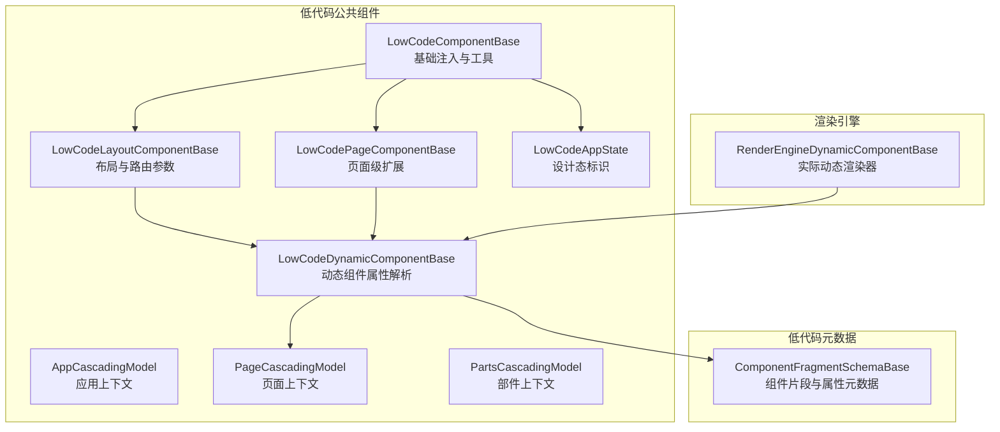
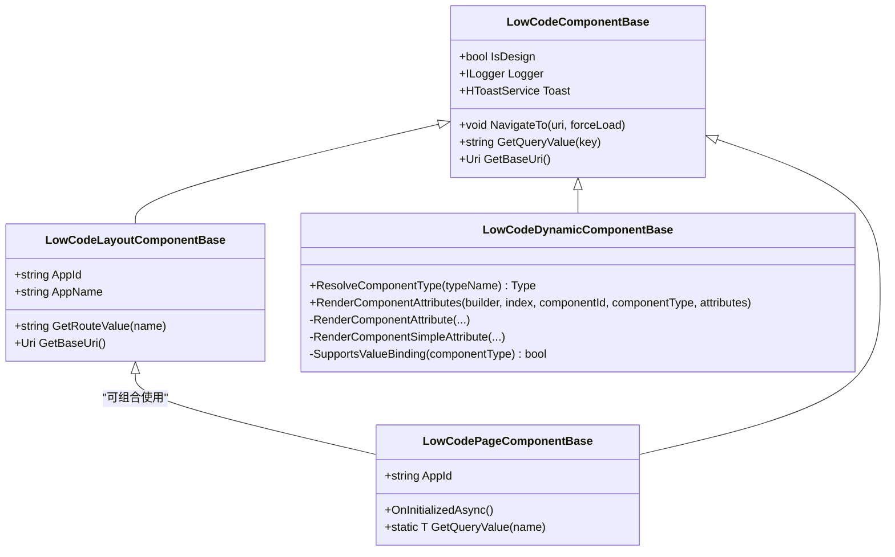
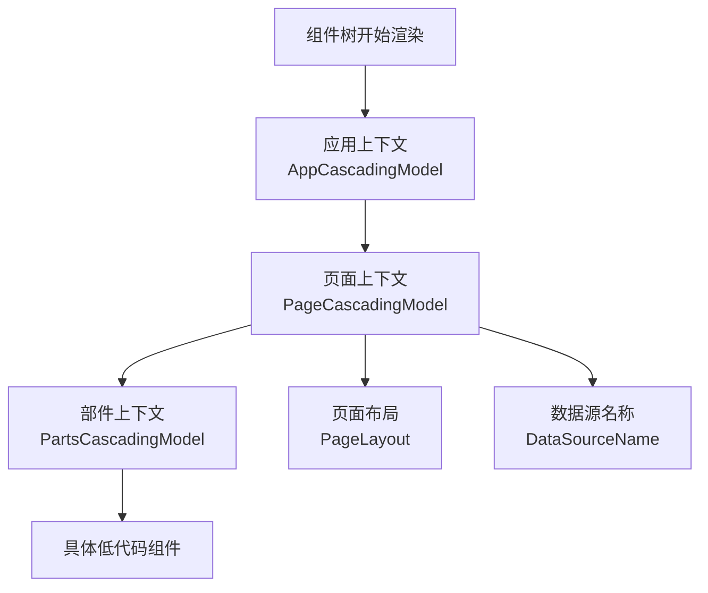
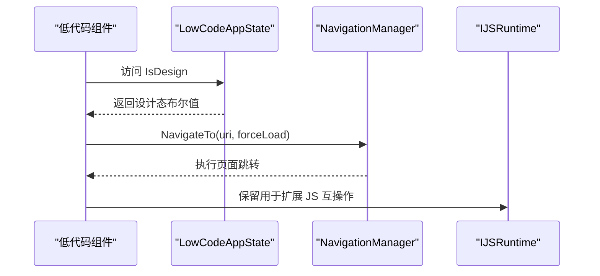
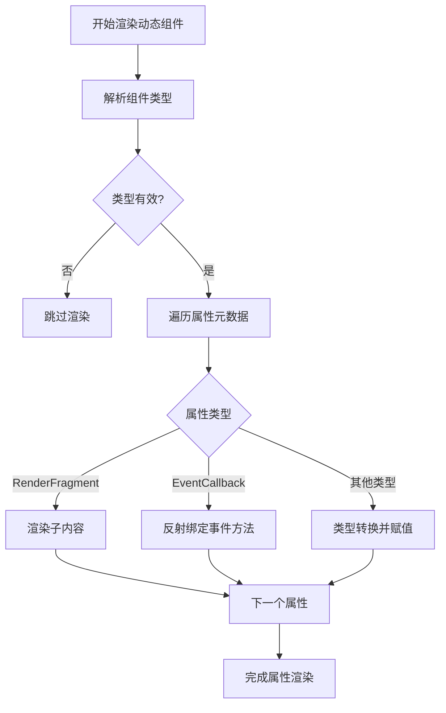
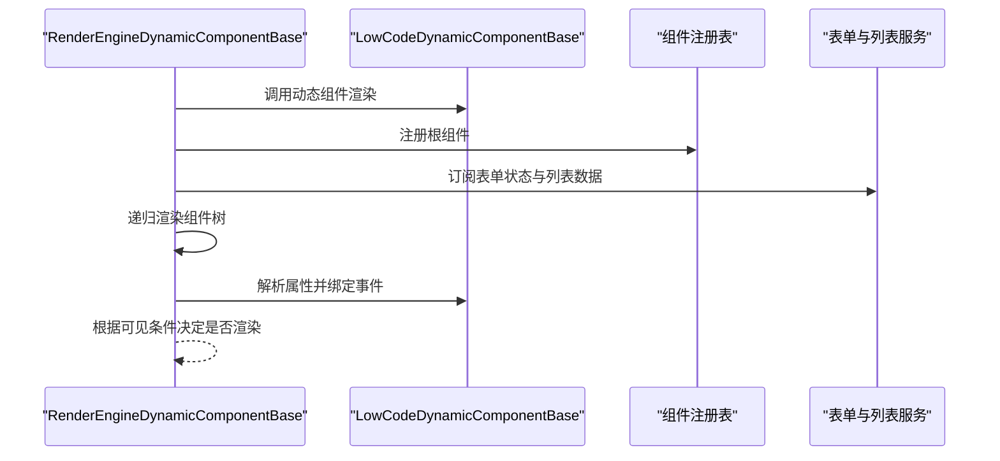
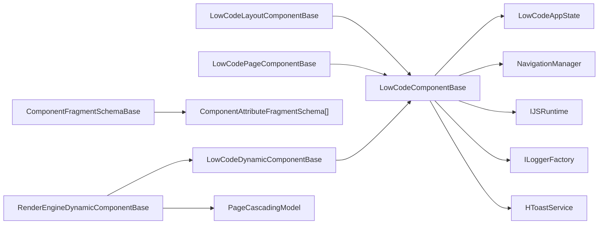

# 组件体系设计

<cite>
**本文引用的文件**
- [LowCodeComponentBase.cs](file://src/LowCode/Common/H.LowCode.ComponentBase/LowCodeComponentBase.cs)
- [LowCodeLayoutComponentBase.cs](file://src/LowCode/Common/H.LowCode.ComponentBase/LowCodeLayoutComponentBase.cs)
- [LowCodeDynamicComponentBase.cs](file://src/LowCode/Common/H.LowCode.ComponentBase/LowCodeDynamicComponentBase.cs)
- [LowCodePageComponentBase.cs](file://src/LowCode/Common/H.LowCode.ComponentBase/LowCodePageComponentBase.cs)
- [AppCascadingModel.cs](file://src/LowCode/Common/H.LowCode.ComponentBase/CascadingModels/AppCascadingModel.cs)
- [PageCascadingModel.cs](file://src/LowCode/Common/H.LowCode.ComponentBase/CascadingModels/PageCascadingModel.cs)
- [PartsCascadingModel.cs](file://src/LowCode/Common/H.LowCode.ComponentBase/CascadingModels/PartsCascadingModel.cs)
- [LowCodeAppState.cs](file://src/LowCode/Common/H.LowCode.ComponentBase/LowCodeAppState.cs)
- [ComponentFragmentSchemaBase.cs](file://src/LowCode/Common/H.LowCode.MetaSchema/PropertySchemas/ComponentFragmentSchemaBase.cs)
- [RenderEngineDynamicComponentBase.cs](file://src/LowCode/RenderEngine/H.LowCode.RenderEngineBase/RenderEngineDynamicComponentBase.cs)
</cite>

## 目录
1. [引言](#引言)
2. [项目结构定位](#项目结构定位)
3. [组件基类层次结构](#组件基类层次结构)
4. [级联模型设计](#级联模型设计)
5. [应用状态与导航、JS 互操作](#应用状态与导航js-互操作)
6. [动态组件渲染机制](#动态组件渲染机制)
7. [生命周期、Props 传递、事件冒泡与样式继承](#生命周期props-传递事件冒泡与样式继承)
8. [自定义组件开发指南](#自定义组件开发指南)
9. [依赖关系分析](#依赖关系分析)
10. [性能优化建议](#性能优化建议)
11. [故障排查](#故障排查)
12. [结论](#结论)

## 引言
本文面向 AppLab 低代码组件体系，系统性梳理组件基类、级联上下文、应用状态、动态渲染引擎以及自定义组件开发方式。重点回答以下问题：
- 四类基类职责如何划分？
- 应用、页面、部件三个层级的级联数据如何传递？
- `LowCodeAppState` 如何统一标识设计态并影响组件行为？
- 动态组件如何根据元数据解析属性、事件和可见性条件？
- 开发者应如何继承基类、注册组件、定义属性、处理事件并实现响应式更新？

## 项目结构定位
AppLab 的组件基础设施集中在低代码公共库中，核心路径为 `H.LowCode.ComponentBase`，并与低代码元数据模型 `H.LowCode.MetaSchema`、渲染引擎基类 `H.LowCode.RenderEngineBase` 协作。

**图示来源**
- [LowCodeComponentBase.cs:1-61](file://src/LowCode/Common/H.LowCode.ComponentBase/LowCodeComponentBase.cs#L1-L61)
- [LowCodeLayoutComponentBase.cs:1-64](file://src/LowCode/Common/H.LowCode.ComponentBase/LowCodeLayoutComponentBase.cs#L1-L64)
- [LowCodeDynamicComponentBase.cs:1-134](file://src/LowCode/Common/H.LowCode.ComponentBase/LowCodeDynamicComponentBase.cs#L1-L134)
- [LowCodePageComponentBase.cs:1-21](file://src/LowCode/Common/H.LowCode.ComponentBase/LowCodePageComponentBase.cs#L1-L21)
- [AppCascadingModel.cs:1-5](file://src/LowCode/Common/H.LowCode.ComponentBase/CascadingModels/AppCascadingModel.cs#L1-L5)
- [PageCascadingModel.cs:1-23](file://src/LowCode/Common/H.LowCode.ComponentBase/CascadingModels/PageCascadingModel.cs#L1-L23)
- [PartsCascadingModel.cs:1-10](file://src/LowCode/Common/H.LowCode.ComponentBase/CascadingModels/PartsCascadingModel.cs#L1-L10)
- [LowCodeAppState.cs:1-14](file://src/LowCode/Common/H.LowCode.ComponentBase/LowCodeAppState.cs#L1-L14)
- [ComponentFragmentSchemaBase.cs:17-17](file://src/LowCode/Common/H.LowCode.MetaSchema/PropertySchemas/ComponentFragmentSchemaBase.cs#L17-L17)
- [RenderEngineDynamicComponentBase.cs:1-200](file://src/LowCode/RenderEngine/H.LowCode.RenderEngineBase/RenderEngineDynamicComponentBase.cs#L1-L200)

**章节来源**
- [LowCodeComponentBase.cs:1-61](file://src/LowCode/Common/H.LowCode.ComponentBase/LowCodeComponentBase.cs#L1-L61)
- [LowCodeLayoutComponentBase.cs:1-64](file://src/LowCode/Common/H.LowCode.ComponentBase/LowCodeLayoutComponentBase.cs#L1-L64)
- [LowCodeDynamicComponentBase.cs:1-134](file://src/LowCode/Common/H.LowCode.ComponentBase/LowCodeDynamicComponentBase.cs#L1-L134)
- [LowCodePageComponentBase.cs:1-21](file://src/LowCode/Common/H.LowCode.ComponentBase/LowCodePageComponentBase.cs#L1-L21)
- [RenderEngineDynamicComponentBase.cs:1-200](file://src/LowCode/RenderEngine/H.LowCode.RenderEngineBase/RenderEngineDynamicComponentBase.cs#L1-L200)

## 组件基类层次结构
AppLab 提供四层组件基类，职责从通用到专用逐步增强：

| 基类 | 职责 | 关键能力 |
|---|---|---|
| `LowCodeComponentBase` | 所有低代码组件的根基类 | 注入 `LowCodeAppState`、导航、JS 运行时、日志、Toast；提供 `IsDesign`、`NavigateTo`、`GetQueryValue`、`GetBaseUri` |
| `LowCodeLayoutComponentBase` | 布局相关组件 | 读取路由中的 `AppId`、`AppName`、`Body.Target`、`RouteData`，暴露 `IsDesign` |
| `LowCodePageComponentBase` | 页面级组件 | 声明 `AppId` 参数，预留页面初始化扩展点 |
| `LowCodeDynamicComponentBase` | 动态组件渲染 | 按类型名解析组件类型、将元数据属性映射到目标组件属性、支持 `RenderFragment` 与 `EventCallback`、支持简单类型转换 |

**图示来源**
- [LowCodeComponentBase.cs:1-61](file://src/LowCode/Common/H.LowCode.ComponentBase/LowCodeComponentBase.cs#L1-L61)
- [LowCodeLayoutComponentBase.cs:1-64](file://src/LowCode/Common/H.LowCode.ComponentBase/LowCodeLayoutComponentBase.cs#L1-L64)
- [LowCodePageComponentBase.cs:1-21](file://src/LowCode/Common/H.LowCode.ComponentBase/LowCodePageComponentBase.cs#L1-L21)
- [LowCodeDynamicComponentBase.cs:1-134](file://src/LowCode/Common/H.LowCode.ComponentBase/LowCodeDynamicComponentBase.cs#L1-L134)

**章节来源**
- [LowCodeComponentBase.cs:1-61](file://src/LowCode/Common/H.LowCode.ComponentBase/LowCodeComponentBase.cs#L1-L61)
- [LowCodeLayoutComponentBase.cs:1-64](file://src/LowCode/Common/H.LowCode.ComponentBase/LowCodeLayoutComponentBase.cs#L1-L64)
- [LowCodePageComponentBase.cs:1-21](file://src/LowCode/Common/H.LowCode.ComponentBase/LowCodePageComponentBase.cs#L1-L21)
- [LowCodeDynamicComponentBase.cs:1-134](file://src/LowCode/Common/H.LowCode.ComponentBase/LowCodeDynamicComponentBase.cs#L1-L134)

## 级联模型设计
AppLab 使用三层级联模型描述不同作用域的数据：

| 模型 | 作用域 | 关键字段 | 用途 |
|---|---|---|---|
| `AppCascadingModel` | 应用级 | 当前为空壳 | 作为应用级上下文占位，便于后续扩展应用级共享数据 |
| `PageCascadingModel` | 页面级 | `AppId`、`PageId`、`PageName`、`PageLayout`、`DataSourceName` | 向页面内组件传递页面标识、布局列数、数据源名称等 |
| `PartsCascadingModel` | 部件级 | `LibraryId`、`PartsId`、`PartsName` | 在部件库或部件实例上下文中传递部件标识与名称 |

**图示来源**
- [AppCascadingModel.cs:1-5](file://src/LowCode/Common/H.LowCode.ComponentBase/CascadingModels/AppCascadingModel.cs#L1-L5)
- [PageCascadingModel.cs:1-23](file://src/LowCode/Common/H.LowCode.ComponentBase/CascadingModels/PageCascadingModel.cs#L1-L23)
- [PartsCascadingModel.cs:1-10](file://src/LowCode/Common/H.LowCode.ComponentBase/CascadingModels/PartsCascadingModel.cs#L1-L10)

**章节来源**
- [AppCascadingModel.cs:1-5](file://src/LowCode/Common/H.LowCode.ComponentBase/CascadingModels/AppCascadingModel.cs#L1-L5)
- [PageCascadingModel.cs:1-23](file://src/LowCode/Common/H.LowCode.ComponentBase/CascadingModels/PageCascadingModel.cs#L1-L23)
- [PartsCascadingModel.cs:1-10](file://src/LowCode/Common/H.LowCode.ComponentBase/CascadingModels/PartsCascadingModel.cs#L1-L10)

## 应用状态与导航、JS 互操作
`LowCodeAppState` 是低代码运行时的全局状态入口，目前主要暴露设计态标识：

- `IsDesign`：标记当前是否处于设计器环境。组件通过该标识决定渲染分支、交互模式或隐藏调试相关 UI。
- 构造时传入 `isDesign`，属于不可变状态，避免运行时被误修改。

`LowCodeComponentBase` 在此基础上封装常用能力：
- 注入 `NavigationManager`，提供 `NavigateTo` 跳转。
- 注入 `IJSRuntime`，供子类扩展 JS 互操作调用。
- 注入 `ILoggerFactory`，提供按组件类型创建的 `Logger`。
- 注入 `HToastService`，提供轻量提示能力。
- 提供 `GetQueryValue` 从 URL 查询字符串取值。
- 提供 `GetBaseUri` 获取基础地址。

**图示来源**
- [LowCodeAppState.cs:1-14](file://src/LowCode/Common/H.LowCode.ComponentBase/LowCodeAppState.cs#L1-L14)
- [LowCodeComponentBase.cs:1-61](file://src/LowCode/Common/H.LowCode.ComponentBase/LowCodeComponentBase.cs#L1-L61)

**章节来源**
- [LowCodeAppState.cs:1-14](file://src/LowCode/Common/H.LowCode.ComponentBase/LowCodeAppState.cs#L1-L14)
- [LowCodeComponentBase.cs:1-61](file://src/LowCode/Common/H.LowCode.ComponentBase/LowCodeComponentBase.cs#L1-L61)

## 动态组件渲染机制
动态组件渲染由 `LowCodeDynamicComponentBase` 提供基础能力，并由渲染引擎中的 `RenderEngineDynamicComponentBase` 实现完整流程。

### 类型解析
- `ResolveComponentType` 根据类型名字符串解析 .NET 类型。
- 若解析失败返回 `null`，调用方应跳过该节点渲染，避免整页崩溃。

### 属性渲染
`RenderComponentAttributes` 遍历元数据中的属性数组，对每种属性进行差异化处理：
- `RenderFragment`：将属性值当作子内容渲染。
- `EventCallback`：反射查找同名方法并创建委托绑定。
- 其他类型：先解析目标 CLR 类型，再将字符串值转换为真实类型后赋值。

**图示来源**
- [LowCodeDynamicComponentBase.cs:1-134](file://src/LowCode/Common/H.LowCode.ComponentBase/LowCodeDynamicComponentBase.cs#L1-L134)

### 渲染引擎扩展
渲染引擎进一步扩展了动态渲染能力：
- 订阅表单状态变化与列表数据变化，触发 `StateHasChanged`。
- 计算表达式上下文，支持表单值键生成、可见条件求值、栅格宽度计算。
- 递归渲染组件树，并根据组件元数据判断是否支持数据源、是否条件渲染。

**图示来源**
- [RenderEngineDynamicComponentBase.cs:1-200](file://src/LowCode/RenderEngine/H.LowCode.RenderEngineBase/RenderEngineDynamicComponentBase.cs#L1-L200)
- [LowCodeDynamicComponentBase.cs:1-134](file://src/LowCode/Common/H.LowCode.ComponentBase/LowCodeDynamicComponentBase.cs#L1-L134)

**章节来源**
- [LowCodeDynamicComponentBase.cs:1-134](file://src/LowCode/Common/H.LowCode.ComponentBase/LowCodeDynamicComponentBase.cs#L1-L134)
- [RenderEngineDynamicComponentBase.cs:1-200](file://src/LowCode/RenderEngine/H.LowCode.RenderEngineBase/RenderEngineDynamicComponentBase.cs#L1-L200)

## 生命周期、Props 传递、事件冒泡与样式继承
### 生命周期
- 基类遵循 Blazor 标准生命周期，如 `OnInitializedAsync`。
- `LowCodePageComponentBase` 重写初始化钩子，预留页面初始化扩展点。
- 渲染引擎的动态组件在初始化阶段订阅外部状态变更，并在变更时触发界面刷新。

### Props 传递机制
- 普通组件通过 Blazor 的 `[Parameter]` 传递参数。
- 动态组件通过元数据中的 `Attributes` 数组驱动属性赋值。
- `ComponentFragmentSchemaBase` 暴露 `Attributes` 字段，承载组件属性片段。

### 事件冒泡处理
- 动态属性解析支持将事件回调绑定到宿主组件的同名方法。
- 若未找到对应方法，则不会绑定事件回调，避免空引用异常。
- 渲染引擎可扩展更复杂的事件传播逻辑，例如跨组件、跨数据项的事件转发。

### 样式继承规则
- 当前基类未直接实现统一的样式继承策略。
- 样式通常由组件自身 CSS、主题库及父容器共同决定。
- 建议在自定义组件中明确样式边界，避免覆盖全局主题样式。

**章节来源**
- [LowCodePageComponentBase.cs:1-21](file://src/LowCode/Common/H.LowCode.ComponentBase/LowCodePageComponentBase.cs#L1-L21)
- [LowCodeDynamicComponentBase.cs:1-134](file://src/LowCode/Common/H.LowCode.ComponentBase/LowCodeDynamicComponentBase.cs#L1-L134)
- [ComponentFragmentSchemaBase.cs:17-17](file://src/LowCode/Common/H.LowCode.MetaSchema/PropertySchemas/ComponentFragmentSchemaBase.cs#L17-L17)
- [RenderEngineDynamicComponentBase.cs:1-200](file://src/LowCode/RenderEngine/H.LowCode.RenderEngineBase/RenderEngineDynamicComponentBase.cs#L1-L200)

## 自定义组件开发指南
### 选择合适基类
- 普通业务组件：继承 `LowCodeComponentBase`。
- 布局组件：继承 `LowCodeLayoutComponentBase`，获取路由信息与应用标识。
- 页面组件：继承 `LowCodePageComponentBase`，获得页面级扩展能力。
- 需要参与低代码动态渲染的组件：确保能被元数据识别，并由渲染引擎调用。

### 注册组件
- 动态组件的类型名需要在系统中可解析，否则 `ResolveComponentType` 会返回 `null`。
- 渲染引擎通常会维护组件注册表，应在应用启动时完成组件类型注册。

### 定义属性
- 普通属性使用 Blazor `[Parameter]`。
- 动态属性通过元数据 `ComponentAttributeFragmentSchema` 配置属性名、CLR 类型和值。
- 若需要双向绑定，可在组件上同时暴露 `Value` 与 `ValueChanged`，并在渲染引擎或包装组件中实现绑定逻辑。

### 处理事件
- 在动态属性解析中，若属性值为方法名且类型为 `EventCallback`，则会尝试绑定宿主组件上的同名方法。
- 自定义组件可接收事件回调并通过 `InvokeAsync` 触发状态更新。

### 实现响应式更新
- 修改状态后调用 `StateHasChanged()` 或通过基类生命周期自动触发重渲染。
- 在渲染引擎中，表单状态和列表数据变化会通过订阅机制驱动界面刷新。

### 最佳实践
- 优先使用强类型属性，减少字符串转换错误。
- 对可能为空的属性做防御性校验。
- 在设计态下隐藏敏感或调试 UI，通过 `IsDesign` 控制显示逻辑。
- 避免在动态属性解析中执行昂贵计算，尽量延迟到渲染前。

**章节来源**
- [LowCodeComponentBase.cs:1-61](file://src/LowCode/Common/H.LowCode.ComponentBase/LowCodeComponentBase.cs#L1-L61)
- [LowCodeDynamicComponentBase.cs:1-134](file://src/LowCode/Common/H.LowCode.ComponentBase/LowCodeDynamicComponentBase.cs#L1-L134)
- [ComponentFragmentSchemaBase.cs:17-17](file://src/LowCode/Common/H.LowCode.MetaSchema/PropertySchemas/ComponentFragmentSchemaBase.cs#L17-L17)
- [RenderEngineDynamicComponentBase.cs:1-200](file://src/LowCode/RenderEngine/H.LowCode.RenderEngineBase/RenderEngineDynamicComponentBase.cs#L1-L200)

## 依赖关系分析
低代码组件体系的依赖关系如下：

**图示来源**
- [LowCodeComponentBase.cs:1-61](file://src/LowCode/Common/H.LowCode.ComponentBase/LowCodeComponentBase.cs#L1-L61)
- [LowCodeLayoutComponentBase.cs:1-64](file://src/LowCode/Common/H.LowCode.ComponentBase/LowCodeLayoutComponentBase.cs#L1-L64)
- [LowCodePageComponentBase.cs:1-21](file://src/LowCode/Common/H.LowCode.ComponentBase/LowCodePageComponentBase.cs#L1-L21)
- [LowCodeDynamicComponentBase.cs:1-134](file://src/LowCode/Common/H.LowCode.ComponentBase/LowCodeDynamicComponentBase.cs#L1-L134)
- [ComponentFragmentSchemaBase.cs:17-17](file://src/LowCode/Common/H.LowCode.MetaSchema/PropertySchemas/ComponentFragmentSchemaBase.cs#L17-L17)
- [RenderEngineDynamicComponentBase.cs:1-200](file://src/LowCode/RenderEngine/H.LowCode.RenderEngineBase/RenderEngineDynamicComponentBase.cs#L1-L200)

**章节来源**
- [LowCodeComponentBase.cs:1-61](file://src/LowCode/Common/H.LowCode.ComponentBase/LowCodeComponentBase.cs#L1-L61)
- [RenderEngineDynamicComponentBase.cs:1-200](file://src/LowCode/RenderEngine/H.LowCode.RenderEngineBase/RenderEngineDynamicComponentBase.cs#L1-L200)

## 性能优化建议
- **减少不必要的重渲染**：仅在状态真正变化时触发 `StateHasChanged`，避免频繁刷新。
- **避免在渲染树中执行重型逻辑**：将计算结果缓存或使用惰性求值。
- **合理使用级联数据**：只在必要时传递大对象，避免污染整个组件树。
- **动态属性解析应避免反射热点**：对高频使用的属性类型建立缓存。
- **列表与表单联动**：利用渲染引擎已有的订阅机制，避免重复请求数据。
- **设计态与运行态分离**：通过 `IsDesign` 关闭非必要的调试逻辑，降低运行时代价。

[本节为通用性能指导，不直接分析具体代码文件]

## 故障排查
| 现象 | 可能原因 | 处理建议 |
|---|---|---|
| 动态组件无法渲染 | 类型名无效或类型未加载 | 检查 `ResolveComponentType` 返回值，确认类型名与程序集已加载 |
| 属性未生效 | 属性名不存在或类型转换失败 | 检查元数据中的属性名、CLR 类型和值格式 |
| 事件未触发 | 宿主组件没有同名方法 | 在宿主组件中实现与事件回调同名方法 |
| 页面布局异常 | `PageLayout` 未正确设置 | 检查 `PageCascadingModel.PageLayout` 是否为有效列数 |
| 设计态逻辑异常 | `LowCodeAppState.IsDesign` 未正确注入 | 确认应用启动时已创建并注入 `LowCodeAppState` |
| 列表数据不刷新 | 未订阅列表数据变化或未触发刷新 | 检查渲染引擎是否订阅 `ListDataManager` 并调用 `StateHasChanged` |

**章节来源**
- [LowCodeDynamicComponentBase.cs:1-134](file://src/LowCode/Common/H.LowCode.ComponentBase/LowCodeDynamicComponentBase.cs#L1-L134)
- [PageCascadingModel.cs:1-23](file://src/LowCode/Common/H.LowCode.ComponentBase/CascadingModels/PageCascadingModel.cs#L1-L23)
- [LowCodeAppState.cs:1-14](file://src/LowCode/Common/H.LowCode.ComponentBase/LowCodeAppState.cs#L1-L14)
- [RenderEngineDynamicComponentBase.cs:1-200](file://src/LowCode/RenderEngine/H.LowCode.RenderEngineBase/RenderEngineDynamicComponentBase.cs#L1-L200)

## 结论
AppLab 低代码组件体系以 `LowCodeComponentBase` 为根基，向上分层提供布局、页面和动态渲染能力；通过 `AppCascadingModel`、`PageCascadingModel`、`PartsCascadingModel` 实现应用、页面、部件三级上下文数据传递；通过 `LowCodeAppState` 统一管理设计态标识；通过 `LowCodeDynamicComponentBase` 与渲染引擎配合，将元数据转化为真实组件树。开发者应选择合适的基类、规范属性与事件定义、谨慎管理状态更新，并结合设计态与运行态差异进行性能优化。