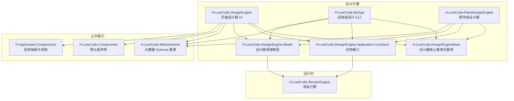
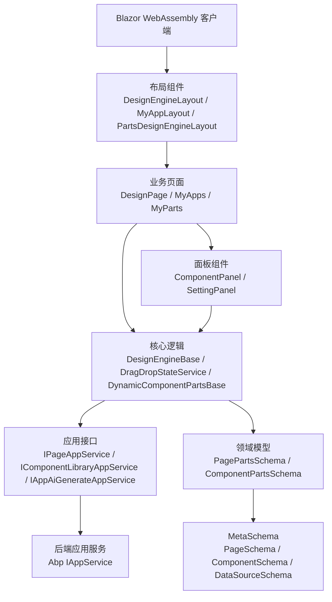
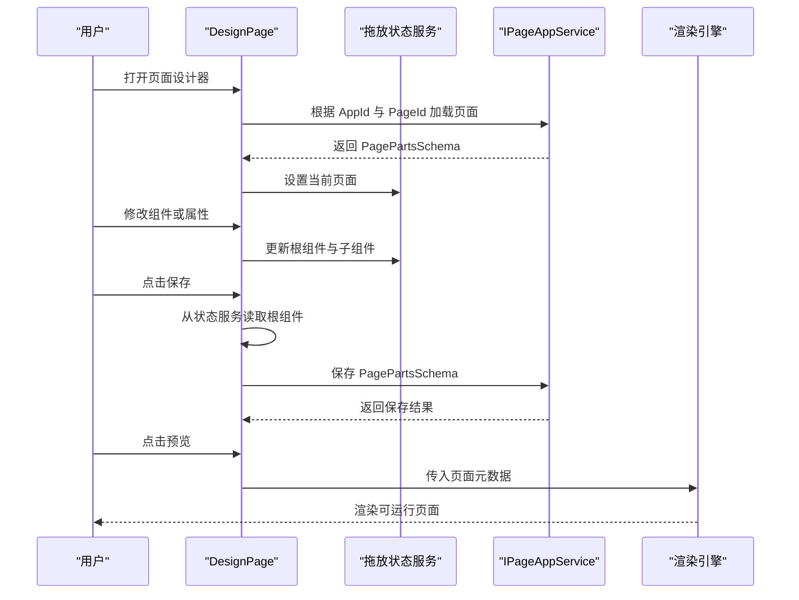
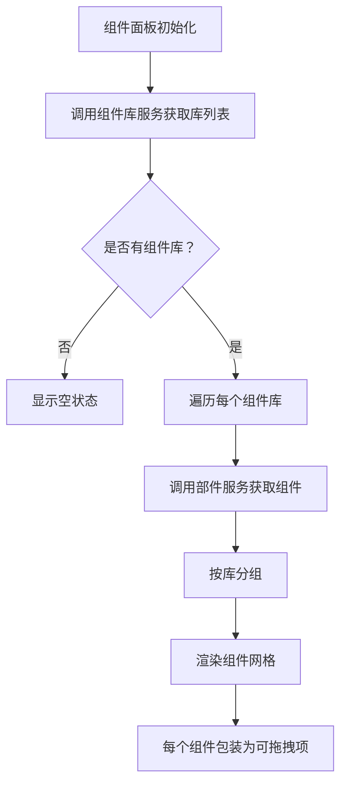
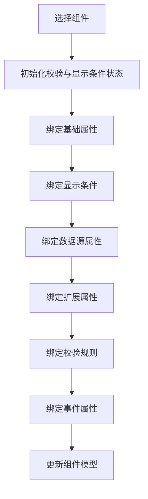
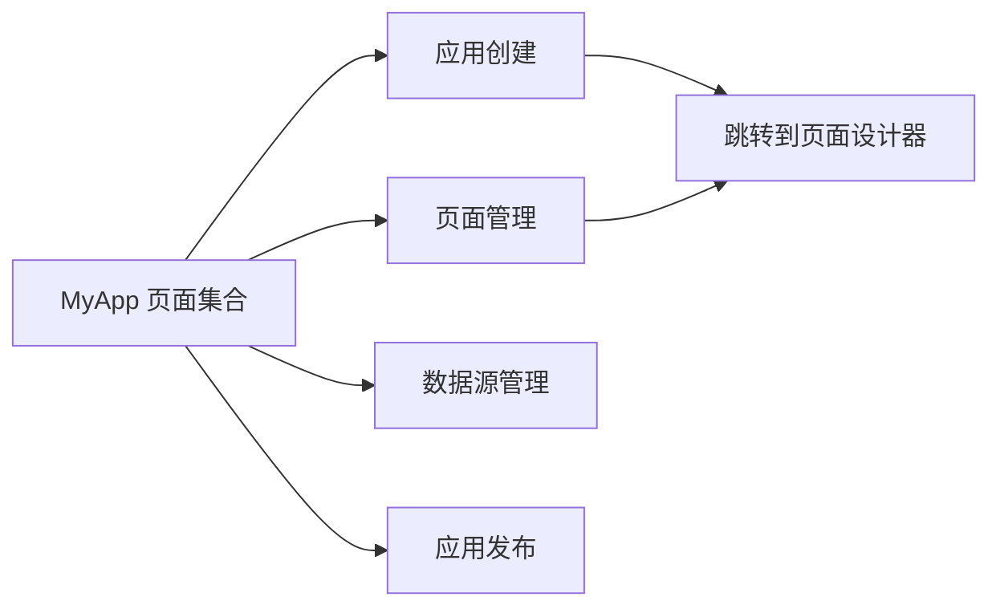
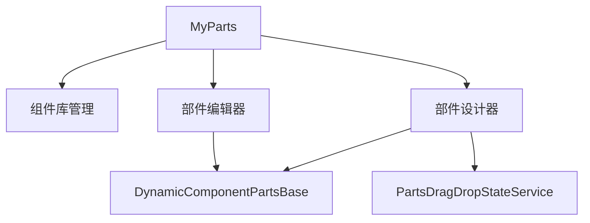
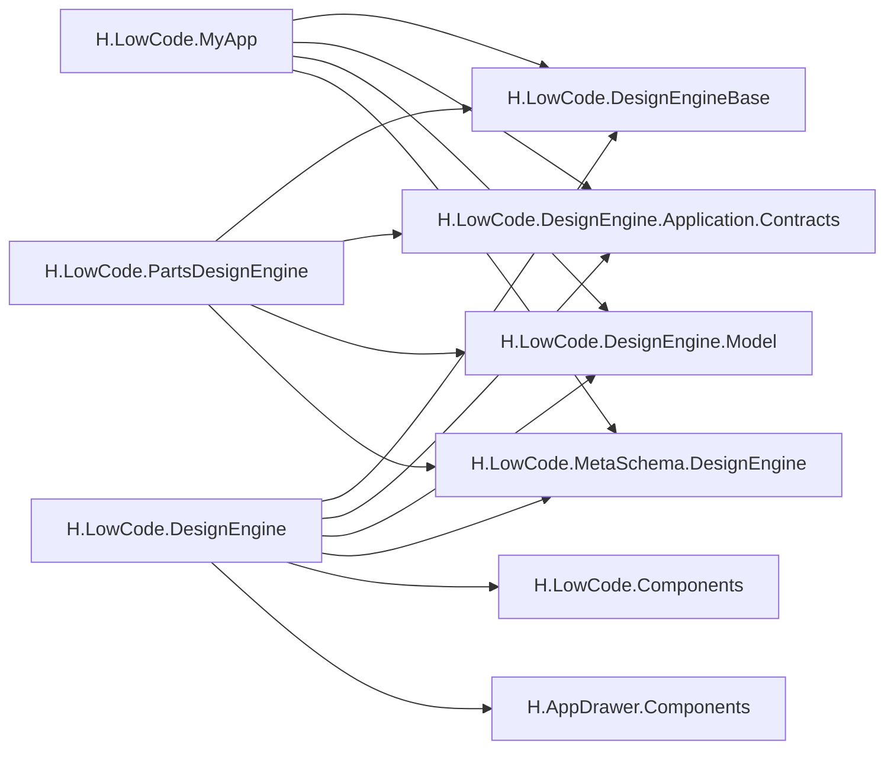
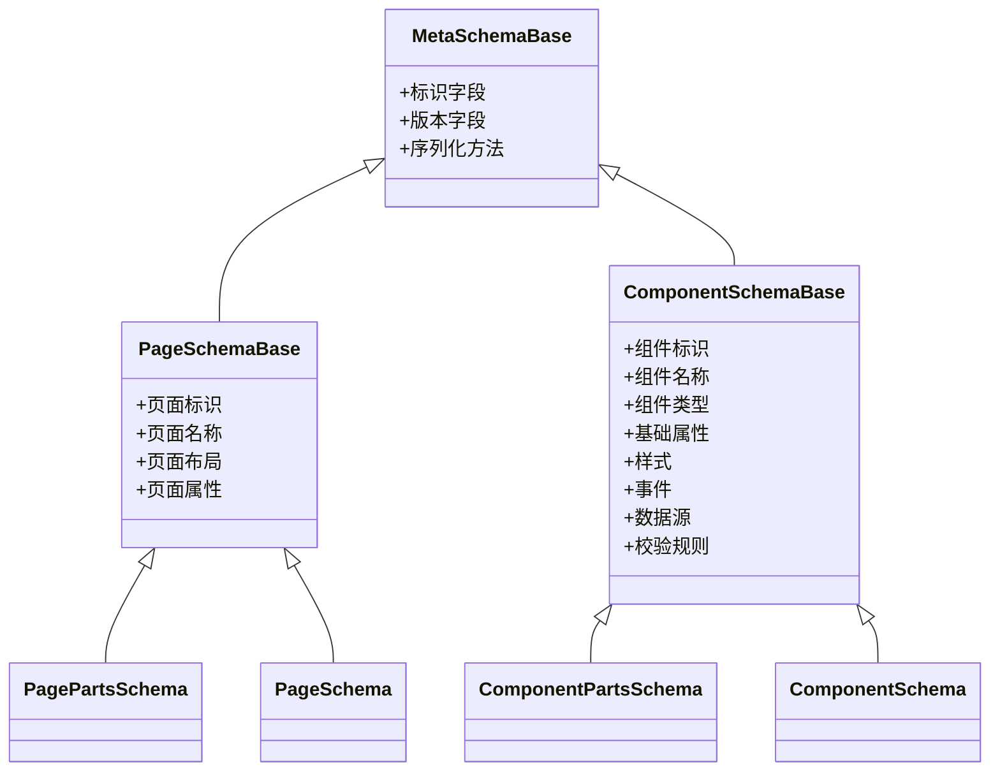
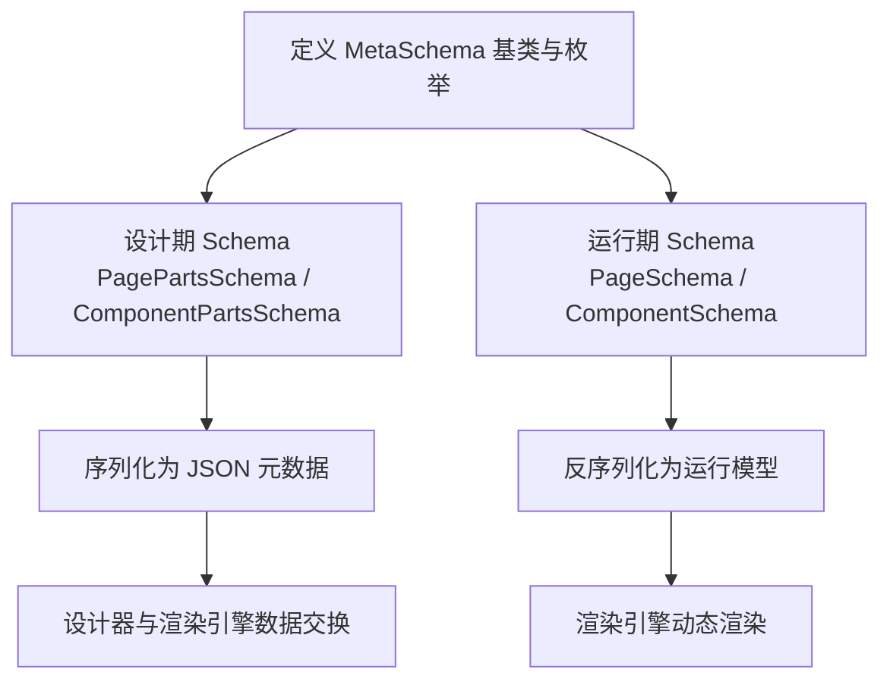

# 设计引擎架构

<cite>
**本文引用的文件**   
- [README.md](file://README.md)
- [H.LowCode.DesignEngine.csproj](file://src/LowCode/DesignEngine/H.LowCode.DesignEngine/H.LowCode.DesignEngine.csproj)
- [H.LowCode.DesignEngineBase.csproj](file://src/LowCode/DesignEngine/H.LowCode.DesignEngineBase/H.LowCode.DesignEngineBase.csproj)
- [H.LowCode.MyApp.csproj](file://src/LowCode/DesignEngine/H.LowCode.MyApp/H.LowCode.MyApp.csproj)
- [H.LowCode.PartsDesignEngine.csproj](file://src/LowCode/DesignEngine/H.LowCode.PartsDesignEngine/H.LowCode.PartsDesignEngine.csproj)
- [DesignPage.razor](file://src/LowCode/DesignEngine/H.LowCode.DesignEngine/Pages/DesignPage.razor)
- [DesignEngineLayout.razor](file://src/LowCode/DesignEngine/H.LowCode.DesignEngine/Layout/DesignEngineLayout.razor)
- [ComponentPanel.razor](file://src/LowCode/DesignEngine/H.LowCode.DesignEngine/ComponentPanel/ComponentPanel.razor)
- [PropertySetting.razor](file://src/LowCode/DesignEngine/H.LowCode.DesignEngine/SettingPanel/PropertySetting.razor)
- [MyAppLayout.razor](file://src/LowCode/DesignEngine/H.LowCode.MyApp/Layout/MyAppLayout.razor)
- [MyApps.razor](file://src/LowCode/DesignEngine/H.LowCode.MyApp/Pages/MyApps.razor)
- [AppCreateFromTemplate.razor](file://src/LowCode/DesignEngine/H.LowCode.MyApp/Pages/MyApps/AppCreateFromTemplate.razor)
- [PageManager.razor](file://src/LowCode/DesignEngine/H.LowCode.MyApp/Pages/PageManager.razor)
- [DataSourceManager.razor](file://src/LowCode/DesignEngine/H.LowCode.MyApp/Pages/DataSourceManager.razor)
- [AppPublish.razor](file://src/LowCode/DesignEngine/H.LowCode.MyApp/Pages/AppPublish.razor)
- [PartsDesignEngineLayout.razor](file://src/LowCode/DesignEngine/H.LowCode.PartsDesignEngine/Layout/PartsDesignEngineLayout.razor)
- [MyParts.razor](file://src/LowCode/DesignEngine/H.LowCode.PartsDesignEngine/Pages/MyParts.razor)
- [ComponentLibraryManager.razor](file://src/LowCode/DesignEngine/H.LowCode.PartsDesignEngine/Pages/ComponentParts/ComponentLibraryManager.razor)
- [ComponentPartsDesignerPage.razor](file://src/LowCode/DesignEngine/H.LowCode.PartsDesignEngine/Pages/ComponentParts/ComponentPartsDesignerPage.razor)
- [ComponentPartsEditorPage.razor](file://src/LowCode/DesignEngine/H.LowCode.PartsDesignEngine/Pages/ComponentParts/ComponentPartsEditorPage.razor)
- [DynamicComponentPartsBase.cs](file://src/LowCode/DesignEngine/H.LowCode.PartsDesignEngine/Services/DynamicComponentPartsBase.cs)
- [PartsDragDropStateService.cs](file://src/LowCode/DesignEngine/H.LowCode.PartsDesignEngine/Services/PartsDragDropStateService.cs)
- [MetaSchemaBase.cs](file://src/LowCode/Common/H.LowCode.MetaSchema/MetaSchemaBase.cs)
- [PageSchemaBase.cs](file://src/LowCode/Common/H.LowCode.MetaSchema/PageSchemaBase.cs)
- [ComponentSchemaBase.cs](file://src/LowCode/Common/H.LowCode.MetaSchema/ComponentSchemaBase.cs)
- [PageSchema.cs](file://src/LowCode/Common/H.LowCode.MetaSchema.RenderEngine/PageSchema.cs)
- [ComponentSchema.cs](file://src/LowCode/Common/H.LowCode.MetaSchema.RenderEngine/PropertySchemas/ComponentAttributeDefineSchema.cs)
- [PagePartsSchema.cs](file://src/LowCode/Common/H.LowCode.MetaSchema.DesignEngine/PagePartsSchema.cs)
- [ComponentPartsSchema.cs](file://src/LowCode/Common/H.LowCode.MetaSchema.DesignEngine/ComponentPartsSchema.cs)
</cite>

## 目录
1. [引言](#引言)
2. [项目结构](#项目结构)
3. [核心组件](#核心组件)
4. [架构总览](#架构总览)
5. [详细组件分析](#详细组件分析)
6. [依赖关系分析](#依赖关系分析)
7. [性能与可维护性](#性能与可维护性)
8. [故障排查指南](#故障排查指南)
9. [结论](#结论)
10. [附录：数据交换协议与 MetaSchema 模式](#附录数据交换协议与-metaschema-模式)

## 引言
AppLab 低代码设计引擎是一个基于 .NET 与 Blazor WebAssembly 的可视化页面设计系统。它通过“设计器 + 渲染引擎”的双端分离实现：设计器负责以拖拽方式编排页面和部件，产出结构化元数据；渲染引擎根据同一套元数据动态生成可运行的应用界面。

该文档聚焦 DesignEngine 整体架构，重点说明以下方面：
- 分层结构：Web 界面层 H.LowCode.DesignEngine、核心逻辑层 H.LowCode.DesignEngineBase、应用接口层 H.LowCode.DesignEngine.Application.Contracts、领域模型层 H.LowCode.DesignEngine.Model。
- 主要功能：页面画布、组件面板、属性编辑器、预览模式、元数据导出。
- 两个具体设计端：H.LowCode.MyApp（应用级设计）与 H.LowCode.PartsDesignEngine（部件级设计）。
- 设计器与渲染引擎之间的数据交换协议，以及贯穿其中的 MetaSchema 设计模式。

## 项目结构
LowCode 子模块按职责划分为 Common、DesignEngine、RenderEngine 等区域。DesignEngine 位于 `src/LowCode/DesignEngine`，其顶层包含多个 Blazor Razor Class Library：
- H.LowCode.DesignEngine：面向浏览器端的通用页面设计 UI。
- H.LowCode.DesignEngineBase：与设计器交互的核心基类、共享状态服务与基础布局。
- H.LowCode.MyApp：应用级管理入口，提供应用创建、页面管理、数据源管理与发布等能力。
- H.LowCode.PartsDesignEngine：部件级设计器，用于定义可复用的组件片段、样式、事件和数据绑定。
- H.LowCode.DesignEngine.Application.Contracts / Domain / Repository.*：应用契约、领域与存储抽象及具体实现。
- H.LowCode.DesignEngine.Model：设计器侧的领域实体与 DTO。

**图示来源**
- [H.LowCode.DesignEngine.csproj:1-22](file://src/LowCode/DesignEngine/H.LowCode.DesignEngine/H.LowCode.DesignEngine.csproj#L1-L22)
- [H.LowCode.DesignEngineBase.csproj:1-20](file://src/LowCode/DesignEngine/H.LowCode.DesignEngineBase/H.LowCode.DesignEngineBase.csproj#L1-L20)
- [H.LowCode.MyApp.csproj:1-20](file://src/LowCode/DesignEngine/H.LowCode.MyApp/H.LowCode.MyApp.csproj#L1-L20)
- [H.LowCode.PartsDesignEngine.csproj:1-17](file://src/LowCode/DesignEngine/H.LowCode.PartsDesignEngine/H.LowCode.PartsDesignEngine.csproj#L1-L17)

**章节来源**
- [README.md:1-73](file://README.md#L1-L73)

## 核心组件
本节从用户可见功能出发，对应到具体页面与组件：

| 功能 | 主要位置 | 作用 |
|---|---|---|
| 页面设计入口 | [DesignPage.razor](file://src/LowCode/DesignEngine/H.LowCode.DesignEngine/Pages/DesignPage.razor) | 路由 `/designengine/designer/{AppId}/{PageId}`，加载页面元数据，组合左侧组件面板、中间画布、右侧属性面板。 |
| 设计器布局 | [DesignEngineLayout.razor](file://src/LowCode/DesignEngine/H.LowCode.DesignEngine/Layout/DesignEngineLayout.razor) | 提供全屏容器，承载设计页面内容。 |
| 组件面板 | [ComponentPanel.razor](file://src/LowCode/DesignEngine/H.LowCode.DesignEngine/ComponentPanel/ComponentPanel.razor) | 展示组件库、页面库、数据源与在线编码入口；按组件库分组加载可拖拽组件。 |
| 属性编辑器 | [PropertySetting.razor](file://src/LowCode/DesignEngine/H.LowCode.DesignEngine/SettingPanel/PropertySetting.razor) | 编辑组件的基础属性、显示条件、数据源、扩展属性、校验规则与事件。 |
| 应用级管理 | [MyAppLayout.razor](file://src/LowCode/DesignEngine/H.LowCode.MyApp/Layout/MyAppLayout.razor)、[MyApps.razor](file://src/LowCode/DesignEngine/H.LowCode.MyApp/Pages/MyApps.razor) | 应用列表、应用创建、应用设置、成员集成等应用级入口。 |
| 页面管理 | [PageManager.razor](file://src/LowCode/DesignEngine/H.LowCode.MyApp/Pages/PageManager.razor) | 应用下的页面列表与跳转。 |
| 数据源管理 | [DataSourceManager.razor](file://src/LowCode/DesignEngine/H.LowCode.MyApp/Pages/DataSourceManager.razor) | 管理 SQL、API、固定选项等数据源。 |
| 发布入口 | [AppPublish.razor](file://src/LowCode/DesignEngine/H.LowCode.MyApp/Pages/AppPublish.razor) | 触发应用或页面元数据的发布流程。 |
| 部件级设计入口 | [MyParts.razor](file://src/LowCode/DesignEngine/H.LowCode.PartsDesignEngine/Pages/MyParts.razor) | 部件库与页面部件的统一入口。 |
| 部件设计器 | [ComponentPartsDesignerPage.razor](file://src/LowCode/DesignEngine/H.LowCode.PartsDesignEngine/Pages/ComponentParts/ComponentPartsDesignerPage.razor) | 部件可视化设计主页面。 |
| 部件编辑器 | [ComponentPartsEditorPage.razor](file://src/LowCode/DesignEngine/H.LowCode.PartsDesignEngine/Pages/ComponentParts/ComponentPartsEditorPage.razor) | 部件元数据表单与编辑流程。 |

**章节来源**
- [DesignPage.razor:1-200](file://src/LowCode/DesignEngine/H.LowCode.DesignEngine/Pages/DesignPage.razor#L1-L200)
- [DesignEngineLayout.razor:1-8](file://src/LowCode/DesignEngine/H.LowCode.DesignEngine/Layout/DesignEngineLayout.razor#L1-L8)
- [ComponentPanel.razor:1-124](file://src/LowCode/DesignEngine/H.LowCode.DesignEngine/ComponentPanel/ComponentPanel.razor#L1-L124)
- [PropertySetting.razor:1-200](file://src/LowCode/DesignEngine/H.LowCode.DesignEngine/SettingPanel/PropertySetting.razor#L1-L200)
- [MyAppLayout.razor](file://src/LowCode/DesignEngine/H.LowCode.MyApp/Layout/MyAppLayout.razor)
- [MyApps.razor](file://src/LowCode/DesignEngine/H.LowCode.MyApp/Pages/MyApps.razor)
- [PageManager.razor](file://src/LowCode/DesignEngine/H.LowCode.MyApp/Pages/PageManager.razor)
- [DataSourceManager.razor](file://src/LowCode/DesignEngine/H.LowCode.MyApp/Pages/DataSourceManager.razor)
- [AppPublish.razor](file://src/LowCode/DesignEngine/H.LowCode.MyApp/Pages/AppPublish.razor)
- [MyParts.razor](file://src/LowCode/DesignEngine/H.LowCode.PartsDesignEngine/Pages/MyParts.razor)
- [ComponentPartsDesignerPage.razor](file://src/LowCode/DesignEngine/H.LowCode.PartsDesignEngine/Pages/ComponentParts/ComponentPartsDesignerPage.razor)
- [ComponentPartsEditorPage.razor](file://src/LowCode/DesignEngine/H.LowCode.PartsDesignEngine/Pages/ComponentParts/ComponentPartsEditorPage.razor)

## 架构总览
DesignEngine 采用典型的 Blazor WebAssembly 分层架构：
- Web 界面层：使用 Razor 组件构建页面设计器、属性面板、组件面板、应用与部件管理页面。
- 核心逻辑层：提供设计器共享基类、拖放状态服务、动态部件渲染基类与跨页面状态管理。
- 应用接口层：定义与后端 Abp IAppService 对应的客户端代理接口，如页面服务、组件库服务、AI 生成服务等。
- 领域模型层：封装设计器侧的页面、部件、组件、数据源等实体与 DTO。
- 公共元数据层：MetaSchema 提供设计期与运行期共用的类型描述，包括 PageSchema、ComponentSchema、DataSourceSchema 等。

**图示来源**
- [H.LowCode.DesignEngine.csproj:1-22](file://src/LowCode/DesignEngine/H.LowCode.DesignEngine/H.LowCode.DesignEngine.csproj#L1-L22)
- [H.LowCode.DesignEngineBase.csproj:1-20](file://src/LowCode/DesignEngine/H.LowCode.DesignEngineBase/H.LowCode.DesignEngineBase.csproj#L1-L20)
- [DesignPage.razor:1-200](file://src/LowCode/DesignEngine/H.LowCode.DesignEngine/Pages/DesignPage.razor#L1-L200)
- [ComponentPanel.razor:1-124](file://src/LowCode/DesignEngine/H.LowCode.DesignEngine/ComponentPanel/ComponentPanel.razor#L1-L124)
- [PropertySetting.razor:1-200](file://src/LowCode/DesignEngine/H.LowCode.DesignEngine/SettingPanel/PropertySetting.razor#L1-L200)

## 详细组件分析

### 页面设计器：DesignPage
DesignPage 是页面设计的核心入口。它通过路由参数解析 AppId 与 PageId，加载页面元数据，并将当前页面注入为级联值，供画布与属性面板消费。

关键行为：
- 初始化时加载页面 Schema，并同步到拖放状态服务。
- 新建页面时使用临时 ID，保存成功后再导航到真实 ID。
- 保存前从拖放状态服务获取根组件，将其子组件写入页面 Schema。
- 提供 AI 生成弹窗，支持将生成的组件树应用到画布。
- 提供预览按钮，将当前页面元数据交给渲染引擎预览。

**图示来源**
- [DesignPage.razor:1-200](file://src/LowCode/DesignEngine/H.LowCode.DesignEngine/Pages/DesignPage.razor#L1-L200)

**章节来源**
- [DesignPage.razor:1-200](file://src/LowCode/DesignEngine/H.LowCode.DesignEngine/Pages/DesignPage.razor#L1-L200)

### 组件面板：ComponentPanel
ComponentPanel 承担组件库浏览与拖拽准备职责：
- 左侧垂直图标栏切换组件库、数据源、在线编码三个视图。
- 组件库视图下按组件库分组，加载每个库的组件列表，并以 DragItem 包裹可拖拽项。
- 初始化时调用组件库服务获取库列表，再逐个拉取组件。

**图示来源**
- [ComponentPanel.razor:1-124](file://src/LowCode/DesignEngine/H.LowCode.DesignEngine/ComponentPanel/ComponentPanel.razor#L1-L124)

**章节来源**
- [ComponentPanel.razor:1-124](file://src/LowCode/DesignEngine/H.LowCode.DesignEngine/ComponentPanel/ComponentPanel.razor#L1-L124)

### 属性编辑器：PropertySetting
PropertySetting 是当前选中组件的属性编辑中心，围绕组件元数据进行双向绑定：
- 基础属性区：由 BasicPropertyItem 渲染。
- 显示条件：支持启用开关、表达式、比较符与期望值。
- 数据源属性：由 DataSourcePropertyItem 渲染。
- 扩展属性：由 ExtensionPropertyItem 渲染。
- 校验规则：支持必填、长度、数值范围、正则、邮箱、手机、URL、自定义规则，并可配置触发时机与优先级。
- 事件属性：由 EventPropertyItem 渲染。

**图示来源**
- [PropertySetting.razor:1-200](file://src/LowCode/DesignEngine/H.LowCode.DesignEngine/SettingPanel/PropertySetting.razor#L1-L200)

**章节来源**
- [PropertySetting.razor:1-200](file://src/LowCode/DesignEngine/H.LowCode.DesignEngine/SettingPanel/PropertySetting.razor#L1-L200)

### 应用级设计：H.LowCode.MyApp
H.LowCode.MyApp 是应用级设计与管理入口，典型页面包括：
- 应用列表与应用创建：支持模板创建、AI 生成、应用设置与成员管理。
- 页面管理：列出应用下所有页面，进入页面设计器。
- 数据源管理：集中管理 API、SQL、固定选项等数据源。
- 应用发布：将设计好的应用或页面提交到发布流程。

**图示来源**
- [MyAppLayout.razor](file://src/LowCode/DesignEngine/H.LowCode.MyApp/Layout/MyAppLayout.razor)
- [MyApps.razor](file://src/LowCode/DesignEngine/H.LowCode.MyApp/Pages/MyApps.razor)
- [AppCreateFromTemplate.razor](file://src/LowCode/DesignEngine/H.LowCode.MyApp/Pages/MyApps/AppCreateFromTemplate.razor)
- [PageManager.razor](file://src/LowCode/DesignEngine/H.LowCode.MyApp/Pages/PageManager.razor)
- [DataSourceManager.razor](file://src/LowCode/DesignEngine/H.LowCode.MyApp/Pages/DataSourceManager.razor)
- [AppPublish.razor](file://src/LowCode/DesignEngine/H.LowCode.MyApp/Pages/AppPublish.razor)

**章节来源**
- [MyAppLayout.razor](file://src/LowCode/DesignEngine/H.LowCode.MyApp/Layout/MyAppLayout.razor)
- [MyApps.razor](file://src/LowCode/DesignEngine/H.LowCode.MyApp/Pages/MyApps.razor)
- [AppCreateFromTemplate.razor](file://src/LowCode/DesignEngine/H.LowCode.MyApp/Pages/MyApps/AppCreateFromTemplate.razor)
- [PageManager.razor](file://src/LowCode/DesignEngine/H.LowCode.MyApp/Pages/PageManager.razor)
- [DataSourceManager.razor](file://src/LowCode/DesignEngine/H.LowCode.MyApp/Pages/DataSourceManager.razor)
- [AppPublish.razor](file://src/LowCode/DesignEngine/H.LowCode.MyApp/Pages/AppPublish.razor)

### 部件级设计：H.LowCode.PartsDesignEngine
H.LowCode.PartsDesignEngine 专注于“部件级”设计，即定义可复用的组件片段、样式、事件、属性分组与数据绑定。其核心页面包括：
- MyParts：部件库与页面部件入口。
- ComponentLibraryManager：组件库管理。
- ComponentPartsDesignerPage：部件可视化设计主页面。
- ComponentPartsEditorPage：部件元数据表单编辑器。
- DynamicComponentPartsBase 与 PartsDragDropStateService：支撑部件级拖放与动态渲染。

**图示来源**
- [MyParts.razor](file://src/LowCode/DesignEngine/H.LowCode.PartsDesignEngine/Pages/MyParts.razor)
- [ComponentLibraryManager.razor](file://src/LowCode/DesignEngine/H.LowCode.PartsDesignEngine/Pages/ComponentParts/ComponentLibraryManager.razor)
- [ComponentPartsDesignerPage.razor](file://src/LowCode/DesignEngine/H.LowCode.PartsDesignEngine/Pages/ComponentParts/ComponentPartsDesignerPage.razor)
- [ComponentPartsEditorPage.razor](file://src/LowCode/DesignEngine/H.LowCode.PartsDesignEngine/Pages/ComponentParts/ComponentPartsEditorPage.razor)
- [DynamicComponentPartsBase.cs](file://src/LowCode/DesignEngine/H.LowCode.PartsDesignEngine/Services/DynamicComponentPartsBase.cs)
- [PartsDragDropStateService.cs](file://src/LowCode/DesignEngine/H.LowCode.PartsDesignEngine/Services/PartsDragDropStateService.cs)

**章节来源**
- [MyParts.razor](file://src/LowCode/DesignEngine/H.LowCode.PartsDesignEngine/Pages/MyParts.razor)
- [ComponentLibraryManager.razor](file://src/LowCode/DesignEngine/H.LowCode.PartsDesignEngine/Pages/ComponentParts/ComponentLibraryManager.razor)
- [ComponentPartsDesignerPage.razor](file://src/LowCode/DesignEngine/H.LowCode.PartsDesignEngine/Pages/ComponentParts/ComponentPartsDesignerPage.razor)
- [ComponentPartsEditorPage.razor](file://src/LowCode/DesignEngine/H.LowCode.PartsDesignEngine/Pages/ComponentParts/ComponentPartsEditorPage.razor)
- [DynamicComponentPartsBase.cs](file://src/LowCode/DesignEngine/H.LowCode.PartsDesignEngine/Services/DynamicComponentPartsBase.cs)
- [PartsDragDropStateService.cs](file://src/LowCode/DesignEngine/H.LowCode.PartsDesignEngine/Services/PartsDragDropStateService.cs)

## 依赖关系分析
从 csproj 引用可以看出 DesignEngine 各项目的依赖边界：

| 项目 | 直接引用 | 职责说明 |
|---|---|---|
| H.LowCode.DesignEngine | DesignEngineBase、Application.Contracts、Model、MetaSchema.DesignEngine、Components、AppDrawer | 页面设计器 UI，依赖核心逻辑、接口、模型与公共组件。 |
| H.LowCode.DesignEngineBase | ComponentBase、MetaSchema.DesignEngine、Application.Contracts | 设计器核心基类，不依赖具体 WebAssembly 宿主。 |
| H.LowCode.MyApp | DesignEngineBase、Application.Contracts、Model、MetaSchema.DesignEngine | 应用级设计入口，复用设计器核心能力。 |
| H.LowCode.PartsDesignEngine | DesignEngineBase、Application.Contracts、Model、MetaSchema.DesignEngine | 部件级设计入口，复用设计器核心能力。 |

**图示来源**
- [H.LowCode.DesignEngine.csproj:1-22](file://src/LowCode/DesignEngine/H.LowCode.DesignEngine/H.LowCode.DesignEngine.csproj#L1-L22)
- [H.LowCode.DesignEngineBase.csproj:1-20](file://src/LowCode/DesignEngine/H.LowCode.DesignEngineBase/H.LowCode.DesignEngineBase.csproj#L1-L20)
- [H.LowCode.MyApp.csproj:1-20](file://src/LowCode/DesignEngine/H.LowCode.MyApp/H.LowCode.MyApp.csproj#L1-L20)
- [H.LowCode.PartsDesignEngine.csproj:1-17](file://src/LowCode/DesignEngine/H.LowCode.PartsDesignEngine/H.LowCode.PartsDesignEngine.csproj#L1-L17)

**章节来源**
- [H.LowCode.DesignEngine.csproj:1-22](file://src/LowCode/DesignEngine/H.LowCode.DesignEngine/H.LowCode.DesignEngine.csproj#L1-L22)
- [H.LowCode.DesignEngineBase.csproj:1-20](file://src/LowCode/DesignEngine/H.LowCode.DesignEngineBase/H.LowCode.DesignEngineBase.csproj#L1-L20)
- [H.LowCode.MyApp.csproj:1-20](file://src/LowCode/DesignEngine/H.LowCode.MyApp/H.LowCode.MyApp.csproj#L1-L20)
- [H.LowCode.PartsDesignEngine.csproj:1-17](file://src/LowCode/DesignEngine/H.LowCode.PartsDesignEngine/H.LowCode.PartsDesignEngine.csproj#L1-L17)

## 性能与可维护性
- Blazor WebAssembly 懒加载：README 明确说明前端按需下载程序集，降低首屏体积。
- AOT 与裁剪：Release 模式启用 AOT 与裁剪，Debug 模式额外加载调试符号。
- 组件面板按库分组加载：避免一次性渲染大量组件，提升初次体验。
- 属性编辑器分区块渲染：基础属性、显示条件、数据源、扩展属性、校验规则与事件各自独立，便于局部更新与维护。
- 设计器与渲染引擎解耦：通过统一元数据协议，减少两端耦合，提高可替换性与测试性。

## 故障排查指南
常见定位方向：
- 页面无法保存：检查 DesignPage 中是否已从拖放状态服务读取根组件，并确认页面组件数量非空。
- 组件未出现在面板：检查 ComponentPanel 是否正确调用组件库服务与部件服务，并确认库与组件数据已分组。
- 属性未生效：检查 PropertySetting 中对应属性是否完成双向绑定，并确认校验规则、显示条件与事件配置正确。
- 部件设计器异常：检查 DynamicComponentPartsBase 与 PartsDragDropStateService 是否被正确注册与使用。
- 预览失败：确认预览时传入的页面元数据结构完整，且渲染引擎能识别该版本 MetaSchema。

**章节来源**
- [DesignPage.razor:1-200](file://src/LowCode/DesignEngine/H.LowCode.DesignEngine/Pages/DesignPage.razor#L1-L200)
- [ComponentPanel.razor:1-124](file://src/LowCode/DesignEngine/H.LowCode.DesignEngine/ComponentPanel/ComponentPanel.razor#L1-L124)
- [PropertySetting.razor:1-200](file://src/LowCode/DesignEngine/H.LowCode.DesignEngine/SettingPanel/PropertySetting.razor#L1-L200)
- [DynamicComponentPartsBase.cs](file://src/LowCode/DesignEngine/H.LowCode.PartsDesignEngine/Services/DynamicComponentPartsBase.cs)
- [PartsDragDropStateService.cs](file://src/LowCode/DesignEngine/H.LowCode.PartsDesignEngine/Services/PartsDragDropStateService.cs)

## 结论
AppLab 设计引擎以 Blazor WebAssembly 为基础，形成“Web 界面层 + 核心逻辑层 + 应用接口层 + 领域模型层”的分层架构。DesignPage、ComponentPanel、PropertySetting 构成页面设计器的核心三角；MyApp 提供应用级管理能力；PartsDesignEngine 提供部件级设计能力。两者都依赖统一的 MetaSchema 模型，并通过 Application.Contracts 与后端服务交互，最终将结构化元数据交给 RenderEngine 进行渲染。这种设计既保证了可视化设计的灵活性，也保障了运行时渲染的一致性与可演进性。

## 附录：数据交换协议与 MetaSchema 模式

### 设计器与渲染引擎的数据交换协议
设计器产出的数据本质上是结构化 JSON，由 MetaSchema 描述。交换的关键点包括：
- 页面级对象：设计器使用 PagePartsSchema，渲染引擎使用 PageSchema，二者共享 PageSchemaBase 所定义的页面基础字段。
- 组件级对象：设计器使用 ComponentPartsSchema，渲染引擎使用 ComponentSchema 及其属性定义，二者共享 ComponentSchemaBase。
- 数据源对象：设计器与渲染引擎共享 DataSourceSchema 体系，包括 SQL、API、List、Option、TableField 等。
- 事件与样式：设计期与运行期分别有 FragmentEventSchema、FragmentStyleSchema 等变体，但语义一致。

**图示来源**
- [MetaSchemaBase.cs](file://src/LowCode/Common/H.LowCode.MetaSchema/MetaSchemaBase.cs)
- [PageSchemaBase.cs](file://src/LowCode/Common/H.LowCode.MetaSchema/PageSchemaBase.cs)
- [ComponentSchemaBase.cs](file://src/LowCode/Common/H.LowCode.MetaSchema/ComponentSchemaBase.cs)
- [PagePartsSchema.cs](file://src/LowCode/Common/H.LowCode.MetaSchema.DesignEngine/PagePartsSchema.cs)
- [PageSchema.cs](file://src/LowCode/Common/H.LowCode.MetaSchema.RenderEngine/PageSchema.cs)
- [ComponentPartsSchema.cs](file://src/LowCode/Common/H.LowCode.MetaSchema.DesignEngine/ComponentPartsSchema.cs)
- [ComponentSchema.cs](file://src/LowCode/Common/H.LowCode.MetaSchema.RenderEngine/PropertySchemas/ComponentAttributeDefineSchema.cs)

### MetaSchema 设计模式
MetaSchema 在本项目中扮演“描述元数据的元数据”角色：
- 它为页面、组件、数据源、事件、样式、校验规则提供统一类型描述。
- 设计期与运行期存在不同实现，例如 DesignEngine 侧侧重可编辑性与可视化表达，RenderEngine 侧侧重可渲染性与执行效率。
- 通过继承基类与枚举，保证设计器与渲染引擎在字段命名、取值范围与语义上保持一致。

**图示来源**
- [MetaSchemaBase.cs](file://src/LowCode/Common/H.LowCode.MetaSchema/MetaSchemaBase.cs)
- [PageSchemaBase.cs](file://src/LowCode/Common/H.LowCode.MetaSchema/PageSchemaBase.cs)
- [ComponentSchemaBase.cs](file://src/LowCode/Common/H.LowCode.MetaSchema/ComponentSchemaBase.cs)
- [PagePartsSchema.cs](file://src/LowCode/Common/H.LowCode.MetaSchema.DesignEngine/PagePartsSchema.cs)
- [PageSchema.cs](file://src/LowCode/Common/H.LowCode.MetaSchema.RenderEngine/PageSchema.cs)
- [ComponentPartsSchema.cs](file://src/LowCode/Common/H.LowCode.MetaSchema.DesignEngine/ComponentPartsSchema.cs)
- [ComponentSchema.cs](file://src/LowCode/Common/H.LowCode.MetaSchema.RenderEngine/PropertySchemas/ComponentAttributeDefineSchema.cs)