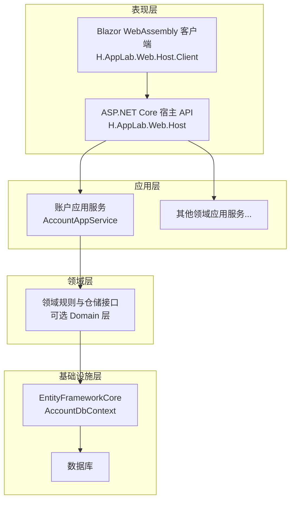
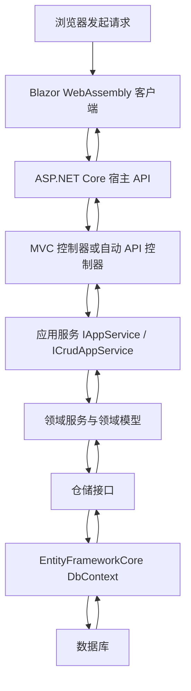
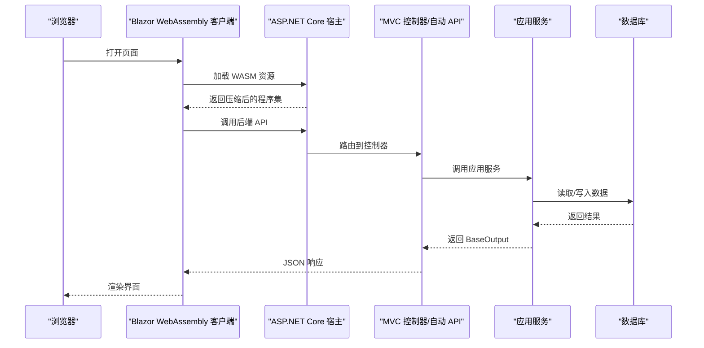
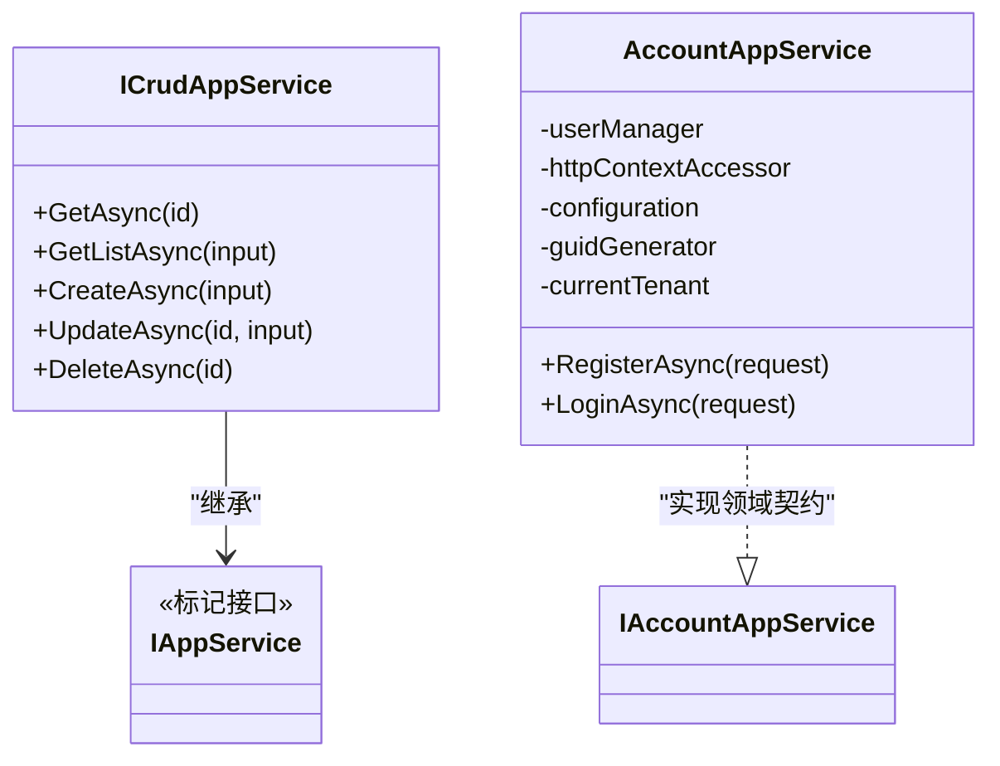
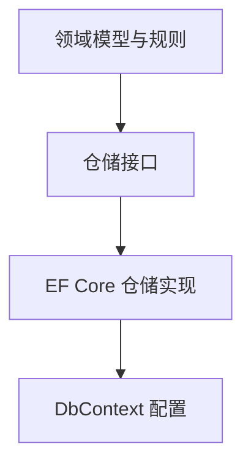
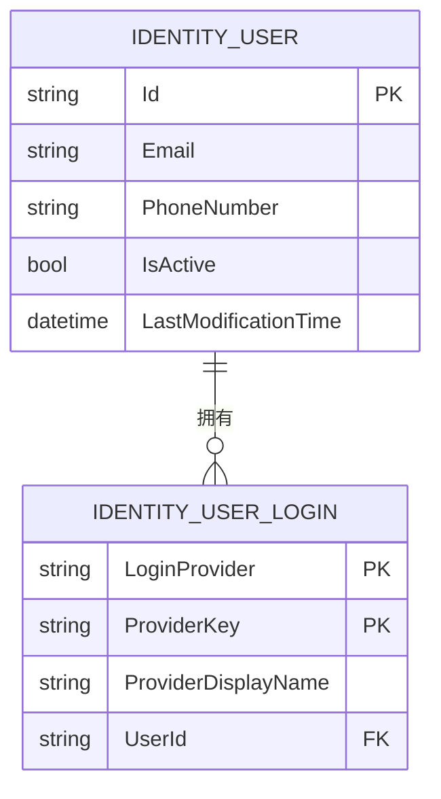
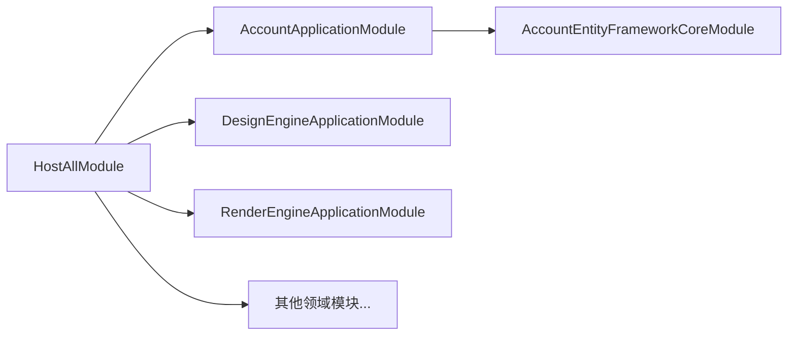
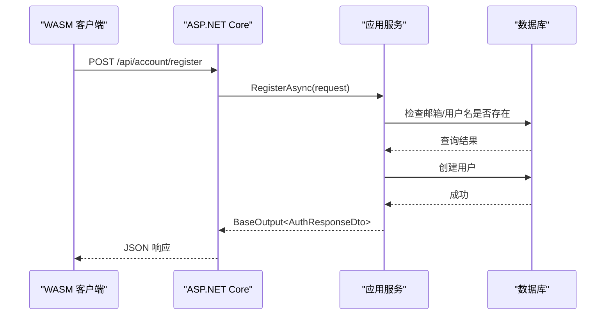
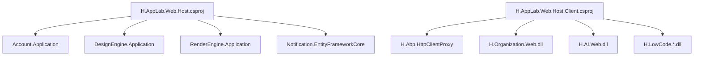

# 分层架构设计

<cite>
**本文引用的文件**   
- [IAppService.cs](file://src/Utils/H.Abp.Application.Contracts/IAppService.cs)
- [ICrudAppService.cs](file://src/Utils/H.Abp.Application.Contracts/ICrudAppService.cs)
- [Program.cs](file://src/Host/H.AppLab.Web.Host/H.AppLab.Web.Host/Program.cs)
- [HostAllModule.cs](file://src/Host/H.AppLab.Web.Host/H.AppLab.Web.Host/HostAllModule.cs)
- [H.AppLab.Web.Host.csproj](file://src/Host/H.AppLab.Web.Host/H.AppLab.Web.Host/H.AppLab.Web.Host.csproj)
- [H.AppLab.Web.Host.Client.csproj](file://src/Host/H.AppLab.Web.Host/H.AppLab.Web.Host.Client/H.AppLab.Web.Host.Client.csproj)
- [AccountApplicationModule.cs](file://src/Services/Account/H.Account.Application/AccountApplicationModule.cs)
- [AccountAppService.cs](file://src/Services/Account/H.Account.Application/Services/AccountAppService.cs)
- [AccountDbContext.cs](file://src/Services/Account/H.Account.EntityFrameworkCore/AccountDbContext.cs)
</cite>

## 目录
1. [引言](#引言)
2. [项目结构](#项目结构)
3. [核心组件](#核心组件)
4. [架构总览](#架构总览)
5. [详细组件分析](#详细组件分析)
6. [依赖关系分析](#依赖关系分析)
7. [性能与可扩展性](#性能与可扩展性)
8. [故障排查指南](#故障排查指南)
9. [结论](#结论)

## 引言
本文件面向 H.AppLab 平台，以“四层架构模式”为主线，系统化梳理表现层、应用层、领域层和基础设施层的职责边界、接口规范、数据流向、跨层通信模式和异常处理策略。文档同时给出请求处理流程、响应返回机制以及基于 ABP 模块化体系的服务编排方式，帮助开发者在不同层次中定位问题、扩展能力并保持架构一致性。

## 项目结构
H.AppLab 采用多模块服务化组织：每个业务域通常包含应用契约、应用实现、实体框架实现，部分领域（如 LowCode 的设计引擎与渲染引擎）进一步拆出独立 Domain 层。统一宿主程序集负责组合所有应用模块、配置认证、多租户、控制器路由、Blazor 运行模式与静态资源分发。

图表来源
- [Program.cs:1-112](file://src/Host/H.AppLab.Web.Host/H.AppLab.Web.Host/Program.cs#L1-L112)
- [HostAllModule.cs:1-207](file://src/Host/H.AppLab.Web.Host/H.AppLab.Web.Host/HostAllModule.cs#L1-L207)
- [AccountAppService.cs:1-200](file://src/Services/Account/H.Account.Application/Services/AccountAppService.cs#L1-L200)
- [AccountDbContext.cs:1-28](file://src/Services/Account/H.Account.EntityFrameworkCore/AccountDbContext.cs#L1-L28)

章节来源
- [Program.cs:1-112](file://src/Host/H.AppLab.Web.Host/H.AppLab.Web.Host/Program.cs#L1-L112)
- [HostAllModule.cs:1-207](file://src/Host/H.AppLab.Web.Host/H.AppLab.Web.Host/HostAllModule.cs#L1-L207)
- [H.AppLab.Web.Host.csproj:1-64](file://src/Host/H.AppLab.Web.Host/H.AppLab.Web.Host/H.AppLab.Web.Host.csproj#L1-L64)
- [H.AppLab.Web.Host.Client.csproj:1-147](file://src/Host/H.AppLab.Web.Host/H.AppLab.Web.Host.Client/H.AppLab.Web.Host.Client.csproj#L1-L147)

## 核心组件
- IAppService：标记接口，用于标识可通过 HTTP 代理远程调用的服务接口。
- ICrudAppService：定义标准 CRUD 操作签名，与 ABP 的 ICrudAppService 保持一致，输出统一 BaseOutput 包装。
- HostAllModule：统一宿主模块，聚合所有 Application 模块、EF Core 模块及仓库模块，并注册 MVC 常规控制器、认证、多租户、外部登录等。
- Program：构建 ASP.NET Core 应用、启用 Blazor WebAssembly、SignalR、响应压缩、Hangfire、静态资源与路由。
- AccountAppService：账户领域的应用服务示例，封装用户注册、登录、Cookie 认证、JWT 签发等业务流程。
- AccountDbContext：账户领域的数据访问上下文，映射 Identity 实体到数据库。

章节来源
- [IAppService.cs:1-8](file://src/Utils/H.Abp.Application.Contracts/IAppService.cs#L1-L8)
- [ICrudAppService.cs:1-15](file://src/Utils/H.Abp.Application.Contracts/ICrudAppService.cs#L1-L15)
- [HostAllModule.cs:1-207](file://src/Host/H.AppLab.Web.Host/H.AppLab.Web.Host/HostAllModule.cs#L1-L207)
- [Program.cs:1-112](file://src/Host/H.AppLab.Web.Host/H.AppLab.Web.Host/Program.cs#L1-L112)
- [AccountAppService.cs:1-200](file://src/Services/Account/H.Account.Application/Services/AccountAppService.cs#L1-L200)
- [AccountDbContext.cs:1-28](file://src/Services/Account/H.Account.EntityFrameworkCore/AccountDbContext.cs#L1-L28)

## 架构总览
H.AppLab 的分层遵循以下原则：
- 表现层（Blazor UI + Host API）：负责页面交互、路由、HTTP 协议、认证中间件、SignalR 实时通信与静态资源托管。
- 应用层（Application Services）：对外暴露 IAppService / ICrudAppService 契约；编排业务用例、协调领域对象、调用基础设施；不直接耦合存储实现。
- 领域层（Domain Services）：封装业务规则、实体行为、仓储接口；对上层保持纯领域语义。
- 基础设施层（EntityFrameworkCore）：提供 DbContext、实体映射、迁移、持久化实现；对上层仅暴露仓储或领域接口。

图表来源
- [Program.cs:1-112](file://src/Host/H.AppLab.Web.Host/H.AppLab.Web.Host/Program.cs#L1-L112)
- [HostAllModule.cs:1-207](file://src/Host/H.AppLab.Web.Host/H.AppLab.Web.Host/HostAllModule.cs#L1-L207)
- [AccountAppService.cs:1-200](file://src/Services/Account/H.Account.Application/Services/AccountAppService.cs#L1-L200)
- [AccountDbContext.cs:1-28](file://src/Services/Account/H.Account.EntityFrameworkCore/AccountDbContext.cs#L1-L28)

## 详细组件分析

### 表现层：Blazor UI 与宿主 API
- Blazor WebAssembly 客户端通过懒加载按需加载各业务模块的程序集，降低首屏体积。
- 宿主使用 AddInteractiveWebAssemblyComponents 支持交互式 WASM 渲染模式。
- 启用 SignalR，便于推送通知、进度更新等实时场景。
- 启用 Brotli/Gzip 响应压缩，优化 WASM 程序集传输。
- 使用 MapStaticAssets 管理带内容哈希的 WASM 程序集缓存，避免启动清单过期导致静默 404。
- 统一挂载 Razor 组件并附加多个业务模块的 _Imports 程序集，实现跨模块 UI 集成。

图表来源
- [Program.cs:1-112](file://src/Host/H.AppLab.Web.Host/H.AppLab.Web.Host/Program.cs#L1-L112)
- [H.AppLab.Web.Host.Client.csproj:1-147](file://src/Host/H.AppLab.Web.Host/H.AppLab.Web.Host.Client/H.AppLab.Web.Host.Client.csproj#L1-L147)

章节来源
- [Program.cs:1-112](file://src/Host/H.AppLab.Web.Host/H.AppLab.Web.Host/Program.cs#L1-L112)
- [H.AppLab.Web.Host.Client.csproj:1-147](file://src/Host/H.AppLab.Web.Host/H.AppLab.Web.Host.Client/H.AppLab.Web.Host.Client.csproj#L1-L147)

### 应用层：IAppService 与编排职责
- IAppService 作为可被 HTTP 代理远程调用的服务标记接口，使前端或客户端能按约定发现与调用服务。
- ICrudAppService 定义统一的增删改查方法签名，返回值统一为 BaseOutput<T>，简化前后端错误与成功状态的表达。
- 应用服务不直接持有存储细节，而是编排用例、验证输入、调用领域逻辑与基础设施。
- AccountAppService 展示了典型编排流程：输入校验、用户查找、密码校验、会话建立、令牌签发、最后更新时间更新。

图表来源
- [IAppService.cs:1-8](file://src/Utils/H.Abp.Application.Contracts/IAppService.cs#L1-L8)
- [ICrudAppService.cs:1-15](file://src/Utils/H.Abp.Application.Contracts/ICrudAppService.cs#L1-L15)
- [AccountAppService.cs:1-200](file://src/Services/Account/H.Account.Application/Services/AccountAppService.cs#L1-L200)

章节来源
- [IAppService.cs:1-8](file://src/Utils/H.Abp.Application.Contracts/IAppService.cs#L1-L8)
- [ICrudAppService.cs:1-15](file://src/Utils/H.Abp.Application.Contracts/ICrudAppService.cs#L1-L15)
- [AccountAppService.cs:1-200](file://src/Services/Account/H.Account.Application/Services/AccountAppService.cs#L1-L200)

### 领域层：业务规则与仓储接口
- 领域层负责抽象业务概念、状态变更规则与不变式约束。
- 在 H.AppLab 中，LowCode 相关领域（DesignEngine、RenderEngine）显式存在 Domain 工程，体现领域边界清晰分离。
- 仓储接口位于领域层，具体实现由 EF Core 模块提供，从而将持久化细节隔离在基础设施层。

图表来源
- [AccountDbContext.cs:1-28](file://src/Services/Account/H.Account.EntityFrameworkCore/AccountDbContext.cs#L1-L28)

章节来源
- [AccountDbContext.cs:1-28](file://src/Services/Account/H.Account.EntityFrameworkCore/AccountDbContext.cs#L1-L28)

### 基础设施层：EntityFrameworkCore 持久化
- AccountDbContext 继承 AbpDbContext，并通过 ConnectionStringName 指定连接字符串。
- OnModelCreating 调用 base 与 ConfigureIdentity，完成 Identity 实体的模型配置。
- 各业务域均提供独立的 DbContext 与 Module，便于多库或多租户隔离。

图表来源
- [AccountDbContext.cs:1-28](file://src/Services/Account/H.Account.EntityFrameworkCore/AccountDbContext.cs#L1-L28)

章节来源
- [AccountDbContext.cs:1-28](file://src/Services/Account/H.Account.EntityFrameworkCore/AccountDbContext.cs#L1-L28)

### 统一宿主模块与模块装配
- HostAllModule 使用 DependsOn 聚合所有应用模块与 EF Core 模块，形成完整运行时装配图。
- 通过 ConfigureAutoApiControllers 批量注册各模块的控制器，减少手动维护成本。
- 配置 Cookie 认证、多租户、外部登录（微信、钉钉），并将 Claims 中的 TenantId 注入租户解析链首位。

图表来源
- [HostAllModule.cs:1-207](file://src/Host/H.AppLab.Web.Host/H.AppLab.Web.Host/HostAllModule.cs#L1-L207)
- [AccountApplicationModule.cs:1-22](file://src/Services/Account/H.Account.Application/AccountApplicationModule.cs#L1-L22)

章节来源
- [HostAllModule.cs:1-207](file://src/Host/H.AppLab.Web.Host/H.AppLab.Web.Host/HostAllModule.cs#L1-L207)
- [AccountApplicationModule.cs:1-22](file://src/Services/Account/H.Account.Application/AccountApplicationModule.cs#L1-L22)

### 请求处理与响应返回机制
- 请求进入路径：浏览器 → Blazor WASM → ASP.NET Core → MVC/自动 API → 应用服务 → 领域/仓储 → EF Core → 数据库。
- 响应返回路径：数据库 → EF Core → 仓储 → 领域 → 应用服务 → BaseOutput<T> → MVC → JSON → WASM → 界面。
- 认证与会话：应用服务内部使用 HttpContextAccessor 创建 ClaimsPrincipal，设置 Cookie 认证，必要时签发 JWT。
- 错误处理：应用服务返回 BaseOutput 包装 Success/Message，便于前端统一提示；宿主启用异常处理器与状态码页面。

图表来源
- [AccountAppService.cs:1-200](file://src/Services/Account/H.Account.Application/Services/AccountAppService.cs#L1-L200)
- [Program.cs:1-112](file://src/Host/H.AppLab.Web.Host/H.AppLab.Web.Host/Program.cs#L1-L112)

章节来源
- [AccountAppService.cs:1-200](file://src/Services/Account/H.Account.Application/Services/AccountAppService.cs#L1-L200)
- [Program.cs:1-112](file://src/Host/H.AppLab.Web.Host/H.AppLab.Web.Host/Program.cs#L1-L112)

### 跨层通信模式
- DTO 数据传输：应用契约与服务契约通过 DTO 传递，避免领域模型泄露到表现层。
- 事件驱动通信：SignalR 已启用，可用于实时通知、任务进度推送等异步消息场景。
- 异步消息处理：Hangfire 仪表盘已挂载，适合后台任务调度与重试机制。
- HTTP 代理：IAppService 标记接口为远端代理提供基础发现与调用约定。

章节来源
- [Program.cs:1-112](file://src/Host/H.AppLab.Web.Host/H.AppLab.Web.Host/Program.cs#L1-L112)
- [IAppService.cs:1-8](file://src/Utils/H.Abp.Application.Contracts/IAppService.cs#L1-L8)

## 依赖关系分析
- 宿主程序集引用多个 Application 与 EntityFrameworkCore 工程，确保运行时能够解析全部模块。
- 客户端程序集通过 BlazorWebAssemblyLazyLoad 声明延迟加载的业务模块与契约程序集，提升启动性能。
- 模块间依赖通过 ABP 的 AbpModule 与 DependsOn 声明，保证装配顺序与生命周期。

图表来源
- [H.AppLab.Web.Host.csproj:1-64](file://src/Host/H.AppLab.Web.Host/H.AppLab.Web.Host/H.AppLab.Web.Host.csproj#L1-L64)
- [H.AppLab.Web.Host.Client.csproj:1-147](file://src/Host/H.AppLab.Web.Host/H.AppLab.Web.Host.Client/H.AppLab.Web.Host.Client.csproj#L1-L147)

章节来源
- [H.AppLab.Web.Host.csproj:1-64](file://src/Host/H.AppLab.Web.Host/H.AppLab.Web.Host/H.AppLab.Web.Host.csproj#L1-L64)
- [H.AppLab.Web.Host.Client.csproj:1-147](file://src/Host/H.AppLab.Web.Host/H.AppLab.Web.Host.Client/H.AppLab.Web.Host.Client.csproj#L1-L147)

## 性能与可扩展性
- 启动与加载性能
  - WASM 客户端启用 AOT 编译，显著减少启动时间。
  - 通过 BlazorWebAssemblyLazyLoad 将非关键模块与契约程序集延迟加载，避免一次性下载。
  - 服务端启用 Brotli/Gzip 响应压缩，减小传输体积。
- 并发与实时性
  - SignalR 已启用，适合高吞吐实时场景；注意最大接收消息大小配置。
- 缓存与静态资源
  - 使用 MapStaticAssets 统一管理 WASM 程序集与 boot manifest 的缓存策略，避免指纹变化导致的 404。
- 可扩展性
  - 新增业务域时，仅需添加 Application、Contracts、EntityFrameworkCore 模块，并在 HostAllModule 中 DependsOn 引用。
  - 应用服务实现 IAppService/ICrudAppService，即可被自动 API 控制器发现与调用。

[本节为通用建议，无需列出具体文件]

## 故障排查指南
- 常见问题
  - WASM 启动卡住：确认未将 /_framework 整体标记为 immutable；MapStaticAssets 会处理指纹化资源的长缓存。
  - 登录后仍跳转登录页：检查 Cookie 认证方案、Claims 是否包含必要身份属性，以及同一站点 Cookie 作用域。
  - 多租户错误：确认 ITenantStore 正确从 Enterprise 数据库读取租户配置，ClaimsTenantResolveContributor 优先解析 TenantId。
  - 控制器无法访问：确认 HostAllModule.ConfigureAutoApiControllers 已注册对应模块程序集。
- 诊断步骤
  - 查看宿主异常处理器返回的错误页面。
  - 检查 Hangfire 后台任务日志与队列状态。
  - 检查 SignalR 连接状态与最大消息大小限制。
  - 检查数据库连接字符串与 EF Core 迁移状态。

章节来源
- [Program.cs:1-112](file://src/Host/H.AppLab.Web.Host/H.AppLab.Web.Host/Program.cs#L1-L112)
- [HostAllModule.cs:1-207](file://src/Host/H.AppLab.Web.Host/H.AppLab.Web.Host/HostAllModule.cs#L1-L207)

## 结论
H.AppLab 的分层架构以 ABP 模块化为基础，严格区分表现层、应用层、领域层与基础设施层。IAppService 与 ICrudAppService 定义了稳定的服务契约；HostAllModule 与 Program 负责统一装配与运行时配置；AccountAppService 与 AccountDbContext 展示了应用编排与持久化的典型实现。通过 Blazor WebAssembly、SignalR、Hangfire 与响应压缩，平台在保证可维护性的同时兼顾了用户体验与可扩展性。新增业务域时，遵循本分层规范即可快速接入并复用现有基础设施。