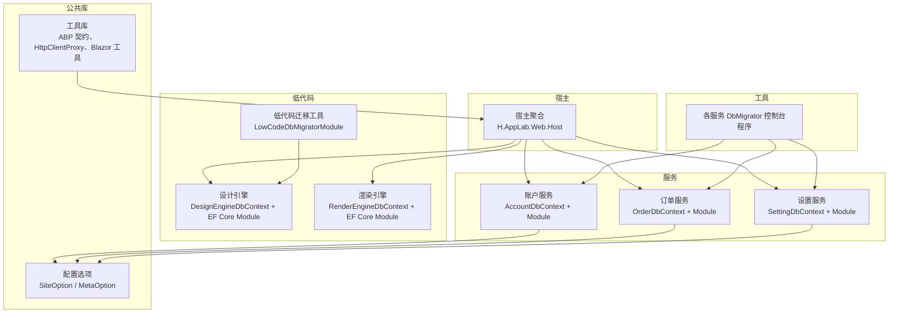
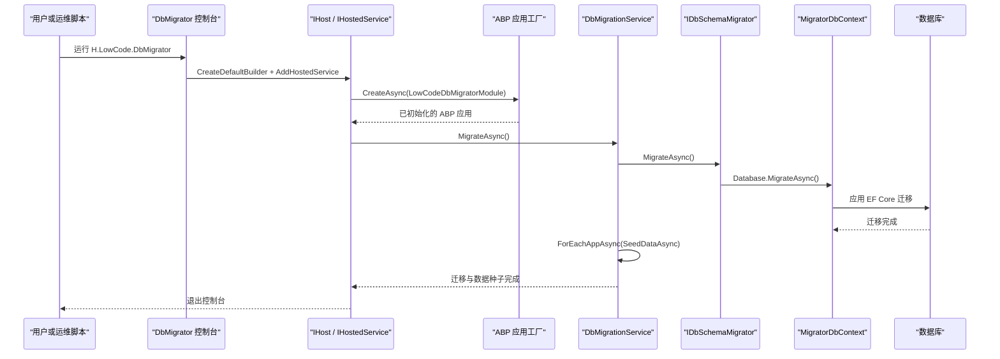
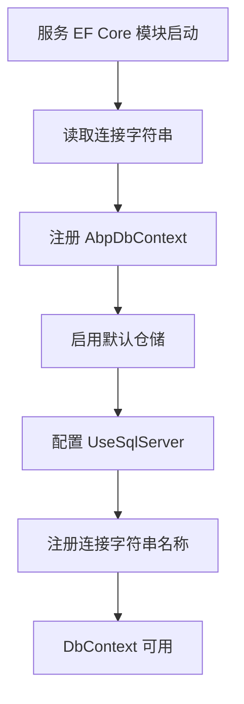
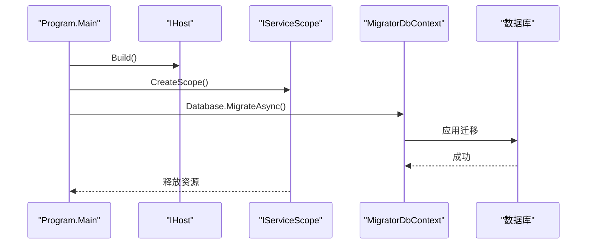
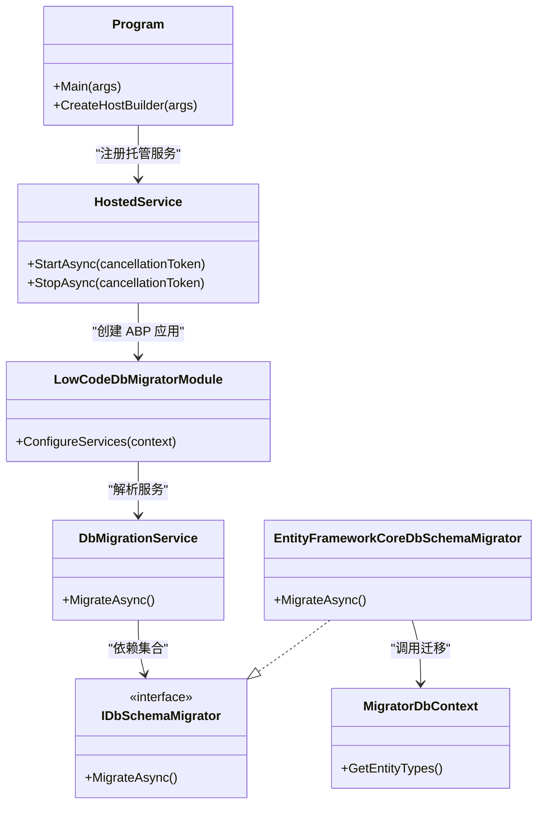
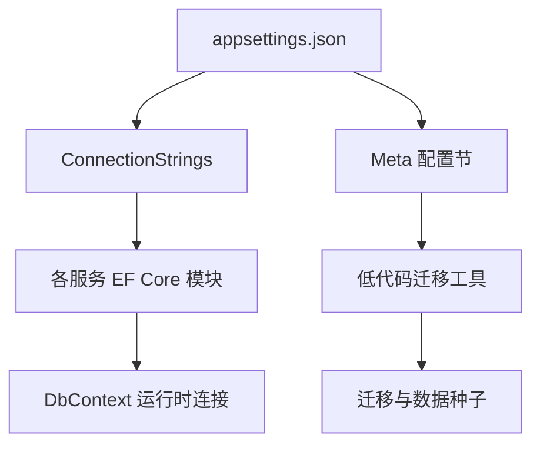
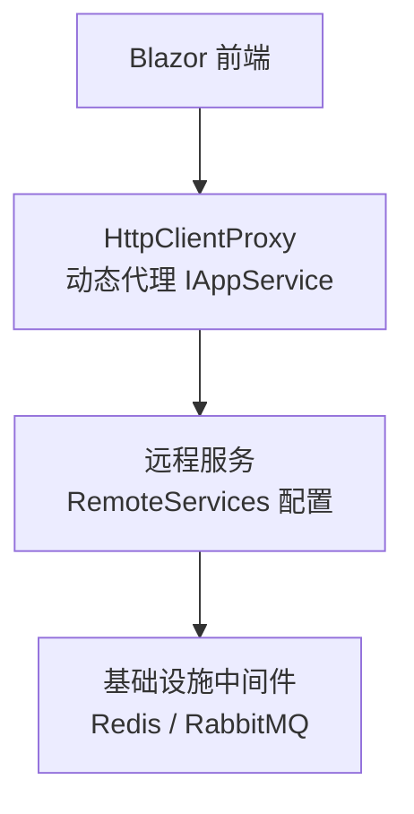
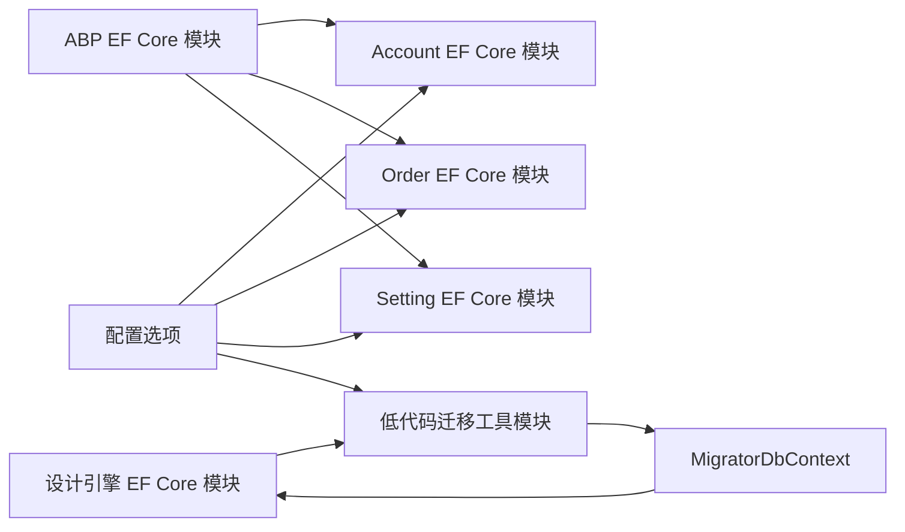

# 基础设施层设计

<cite>
**本文引用的文件**   
- [README.md](file://README.md)
- [Program.cs（H.LowCode.DbMigrator）](file://src/Tools/H.LowCode.DbMigrator/Program.cs)
- [appsettings.json（H.LowCode.DbMigrator）](file://src/Tools/H.LowCode.DbMigrator/appsettings.json)
- [LowCodeDbMigratorModule.cs](file://src/Tools/H.LowCode.DbMigrator/LowCodeDbMigratorModule.cs)
- [HostedService.cs](file://src/Tools/H.LowCode.DbMigrator/HostedService.cs)
- [DbMigrationService.cs](file://src/Tools/H.LowCode.DbMigrator/DbMigrationService.cs)
- [IDbSchemaMigrator.cs](file://src/Tools/H.LowCode.DbMigrator/MigrationServices/IDbSchemaMigrator.cs)
- [EntityFrameworkCoreDbSchemaMigrator.cs](file://src/Tools/H.LowCode.DbMigrator/MigrationServices/EntityFrameworkCoreDbSchemaMigrator.cs)
- [MigratorDbContext.cs（迁移专用上下文）](file://src/Tools/H.LowCode.DbMigrator/MigrationServices/MigratorDbContext.cs)
- [Program.cs（H.Account.DbMigrator）](file://src/Tools/H.Account.DbMigrator/Program.cs)
- [appsettings.json（H.AI.DbMigrator）](file://src/Tools/H.AI.DbMigrator/appsettings.json)
- [SiteOption.cs](file://src/LowCode/Common/H.LowCode.Configuration/Options/SiteOption.cs)
- [MetaOption.cs](file://src/LowCode/Common/H.LowCode.Configuration/Options/MetaOption.cs)
- [AccountEntityFrameworkCoreModule.cs](file://src/Services/Account/H.Account.EntityFrameworkCore/AccountEntityFrameworkCoreModule.cs)
- [AccountDbContext.cs](file://src/Services/Account/H.Account.EntityFrameworkCore/AccountDbContext.cs)
- [OrderEntityFrameworkCoreModule.cs](file://src/Services/Order/H.Order.EntityFrameworkCore/OrderEntityFrameworkCoreModule.cs)
- [SettingEntityFrameworkCoreModule.cs](file://src/Services/Setting/H.Setting.EntityFrameworkCore/SettingEntityFrameworkCoreModule.cs)
</cite>

## 目录
1. [引言](#引言)
2. [项目结构与基础设施边界](#项目结构与基础设施边界)
3. [核心基础设施组件](#核心基础设施组件)
4. [架构总览](#架构总览)
5. [详细组件分析](#详细组件分析)
6. [依赖关系分析](#依赖关系分析)
7. [性能与连接池配置建议](#性能与连接池配置建议)
8. [故障排查指南](#故障排查指南)
9. [结论](#结论)

## 引言
本文件系统梳理 H.AppLab 平台的基础设施层，重点覆盖以下方面：
- EntityFramework Core 的配置与使用模式：DbContext 设计、实体映射、数据库迁移管理。
- 仓储模式的实现思路：通用仓储抽象、特定仓储实现、查询优化策略。
- 配置文件与环境变量：应用选项、连接字符串、元数据路径等。
- 外部服务集成模式：消息队列、缓存、文件存储等基础设施组件的集成方式。
- 数据库性能优化与连接池配置指导。

项目整体采用模块化架构，支持单体部署和按服务独立部署；低代码领域包含设计引擎、渲染引擎及多套仓储实现；服务层按限界上下文划分，每个服务通常包含 Application.Contracts、Application、EntityFrameworkCore、Web 分层。工具层为各服务提供独立的数据库迁移程序集。

**章节来源**
- [README.md:1-73](file://README.md#L1-L73)

## 项目结构与基础设施边界
从基础设施视角看，本项目的关键边界如下：
- 宿主层：聚合各服务的模块注册，统一入口。
- 服务层：每个业务服务拥有自己的 DbContext、EF Core 模块、迁移程序集和 Web 入口。
- 低代码层：提供设计引擎与渲染引擎，并支持多种元数据存储后端（JSON 文件、EntityFrameworkCore、远程服务）。
- 工具层：DbMigrator 控制台程序负责生成或应用数据库迁移，部分迁移程序通过 ABP HostedService 启动。
- 公共库：配置选项、基础契约、HTTP 客户端代理、Blazor 工具、ID 生成器等。

**图表来源**
- [AccountEntityFrameworkCoreModule.cs:16-37](file://src/Services/Account/H.Account.EntityFrameworkCore/AccountEntityFrameworkCoreModule.cs#L16-L37)
- [OrderEntityFrameworkCoreModule.cs:11-31](file://src/Services/Order/H.Order.EntityFrameworkCore/OrderEntityFrameworkCoreModule.cs#L11-L31)
- [SettingEntityFrameworkCoreModule.cs:11-31](file://src/Services/Setting/H.Setting.EntityFrameworkCore/SettingEntityFrameworkCoreModule.cs#L11-L31)
- [LowCodeDbMigratorModule.cs:17-40](file://src/Tools/H.LowCode.DbMigrator/LowCodeDbMigratorModule.cs#L17-L40)

**章节来源**
- [README.md:1-73](file://README.md#L1-L73)

## 核心基础设施组件
本节聚焦与数据库访问、配置、迁移相关的基础设施组件：
- DbContext 与 EF Core 模块：每个服务通过 AbpDbContext 扩展定义 DbContext，并在 EF Core Module 中注册默认仓储、SQL Server 提供者、连接字符串名称。
- 迁移工具：每个服务有独立 DbMigrator 程序；低代码域还提供一个基于 ABP 的迁移工具，支持按应用动态加载实体并执行迁移和数据种子。
- 配置选项：SiteOption、MetaOption 等类提供强类型配置绑定入口。
- 外部服务集成：README 说明依赖 Redis、RabbitMQ 等中间件；前端 HttpClientProxy 通过 RemoteServices 配置远程服务地址。

**章节来源**
- [AccountEntityFrameworkCoreModule.cs:16-37](file://src/Services/Account/H.Account.EntityFrameworkCore/AccountEntityFrameworkCoreModule.cs#L16-L37)
- [OrderEntityFrameworkCoreModule.cs:11-31](file://src/Services/Order/H.Order.EntityFrameworkCore/OrderEntityFrameworkCoreModule.cs#L11-L31)
- [SettingEntityFrameworkCoreModule.cs:11-31](file://src/Services/Setting/H.Setting.EntityFrameworkCore/SettingEntityFrameworkCoreModule.cs#L11-L31)
- [Program.cs（H.LowCode.DbMigrator）:1-38](file://src/Tools/H.LowCode.DbMigrator/Program.cs#L1-L38)
- [SiteOption.cs:1-10](file://src/LowCode/Common/H.LowCode.Configuration/Options/SiteOption.cs#L1-L10)
- [MetaOption.cs:1-10](file://src/LowCode/Common/H.LowCode.Configuration/Options/MetaOption.cs#L1-L10)
- [README.md:1-73](file://README.md#L1-L73)

## 架构总览
下图展示 H.AppLab 基础设施层的总体交互：宿主聚合服务模块，服务模块注册 EF Core DbContext 和默认仓储；低代码迁移工具通过 ABP 模块系统初始化容器，运行迁移和数据种子；配置来自 appsettings 与连接字符串；外部中间件如 Redis、RabbitMQ 由宿主或 Docker Compose 提供。

**图表来源**
- [Program.cs（H.LowCode.DbMigrator）:10-38](file://src/Tools/H.LowCode.DbMigrator/Program.cs#L10-L38)
- [HostedService.cs:18-47](file://src/Tools/H.LowCode.DbMigrator/HostedService.cs#L18-L47)
- [DbMigrationService.cs:17-58](file://src/Tools/H.LowCode.DbMigrator/DbMigrationService.cs#L17-L58)
- [EntityFrameworkCoreDbSchemaMigrator.cs:13-23](file://src/Tools/H.LowCode.DbMigrator/MigrationServices/EntityFrameworkCoreDbSchemaMigrator.cs#L13-L23)

## 详细组件分析

### EntityFramework Core 配置与 DbContext 设计
每个服务的 EF Core 配置集中在其 EntityFrameworkCore 模块中，典型流程如下：
- 从配置读取连接字符串。
- 调用 `AddAbpDbContext<TDbContext>` 并启用默认仓储。
- 通过 `Configure<AbpDbContextOptions>(options => options.UseSqlServer())` 指定 SQL Server 驱动。
- 将连接字符串名注册到 `AbpDbConnectionOptions.ConnectionStrings`，供 DbContext 上的 `[ConnectionStringName]` 属性使用。

示例中的账户服务、订单服务和设置服务都遵循这一模式；账户服务还额外配置了 ABP Identity 的模型映射。

**图表来源**
- [AccountEntityFrameworkCoreModule.cs:16-37](file://src/Services/Account/H.Account.EntityFrameworkCore/AccountEntityFrameworkCoreModule.cs#L16-L37)
- [OrderEntityFrameworkCoreModule.cs:11-31](file://src/Services/Order/H.Order.EntityFrameworkCore/OrderEntityFrameworkCoreModule.cs#L11-L31)
- [SettingEntityFrameworkCoreModule.cs:11-31](file://src/Services/Setting/H.Setting.EntityFrameworkCore/SettingEntityFrameworkCoreModule.cs#L11-L31)

**章节来源**
- [AccountEntityFrameworkCoreModule.cs:16-37](file://src/Services/Account/H.Account.EntityFrameworkCore/AccountEntityFrameworkCoreModule.cs#L16-L37)
- [AccountDbContext.cs:10-28](file://src/Services/Account/H.Account.EntityFrameworkCore/AccountDbContext.cs#L10-L28)
- [OrderEntityFrameworkCoreModule.cs:11-31](file://src/Services/Order/H.Order.EntityFrameworkCore/OrderEntityFrameworkCoreModule.cs#L11-L31)
- [SettingEntityFrameworkCoreModule.cs:11-31](file://src/Services/Setting/H.Setting.EntityFrameworkCore/SettingEntityFrameworkCoreModule.cs#L11-L31)

### 数据库迁移管理
项目为每个服务提供独立 DbMigrator 控制台程序，用于创建和应用数据库迁移。常见模式包括：
- 简单迁移程序：直接构建 Host、解析 MigratorDbContext、调用 `Database.MigrateAsync()`。
- ABP 迁移工具：以 HostedService 启动 ABP 应用，按应用维度执行迁移和数据种子。

#### 简单迁移程序模式
账户服务的迁移程序通过配置注入 `MigratorDbContext`，显式设置 `MigrationsAssembly`，然后执行迁移。该模式适合不需要 ABP 模块系统完整初始化的场景。

**图表来源**
- [Program.cs（H.Account.DbMigrator）:12-59](file://src/Tools/H.Account.DbMigrator/Program.cs#L12-L59)

#### ABP 迁移工具模式
低代码迁移工具通过 ABP 模块系统初始化容器，注册 `IDbSchemaMigrator` 实现，并使用 `MigratorDbContext` 执行迁移；随后按应用枚举执行数据种子。

**图表来源**
- [Program.cs（H.LowCode.DbMigrator）:10-38](file://src/Tools/H.LowCode.DbMigrator/Program.cs#L10-L38)
- [HostedService.cs:18-47](file://src/Tools/H.LowCode.DbMigrator/HostedService.cs#L18-L47)
- [LowCodeDbMigratorModule.cs:17-40](file://src/Tools/H.LowCode.DbMigrator/LowCodeDbMigratorModule.cs#L17-L40)
- [DbMigrationService.cs:17-58](file://src/Tools/H.LowCode.DbMigrator/DbMigrationService.cs#L17-L58)
- [IDbSchemaMigrator.cs:1-6](file://src/Tools/H.LowCode.DbMigrator/MigrationServices/IDbSchemaMigrator.cs#L1-L6)
- [EntityFrameworkCoreDbSchemaMigrator.cs:13-23](file://src/Tools/H.LowCode.DbMigrator/MigrationServices/EntityFrameworkCoreDbSchemaMigrator.cs#L13-L23)
- [MigratorDbContext.cs:10-36](file://src/Tools/H.LowCode.DbMigrator/MigrationServices/MigratorDbContext.cs#L10-L36)

**章节来源**
- [Program.cs（H.Account.DbMigrator）:12-59](file://src/Tools/H.Account.DbMigrator/Program.cs#L12-L59)
- [Program.cs（H.LowCode.DbMigrator）:10-38](file://src/Tools/H.LowCode.DbMigrator/Program.cs#L10-L38)
- [HostedService.cs:18-47](file://src/Tools/H.LowCode.DbMigrator/HostedService.cs#L18-L47)
- [DbMigrationService.cs:17-58](file://src/Tools/H.LowCode.DbMigrator/DbMigrationService.cs#L17-L58)
- [EntityFrameworkCoreDbSchemaMigrator.cs:13-23](file://src/Tools/H.LowCode.DbMigrator/MigrationServices/EntityFrameworkCoreDbSchemaMigrator.cs#L13-L23)
- [MigratorDbContext.cs:10-36](file://src/Tools/H.LowCode.DbMigrator/MigrationServices/MigratorDbContext.cs#L10-L36)

### 仓储模式与查询优化
仓库模式在本项目中主要通过 ABP 的默认仓储机制体现：
- EF Core 模块中使用 `AddAbpDbContext<TDbContext>(options => options.AddDefaultRepositories(includeAllEntities: true))` 自动为所有实体生成通用仓储。
- 应用服务可直接注入默认仓储接口进行 CRUD 操作，无需手写仓储实现。
- 对于复杂查询，可在应用服务层使用 LINQ 组合查询条件，或通过自定义仓储扩展能力进行细化。

由于本仓库未展示具体仓储接口与实现细节，实际查询优化建议包括：
- 使用 `AsNoTracking()` 提升只读查询性能。
- 按需选择投影，避免加载无关导航属性。
- 合理使用分页、过滤与排序，减少服务端返回数据量。
- 对高频查询建立合适索引，并在 EF Core 配置中调整最大命令长度、超时时间等参数。

**章节来源**
- [AccountEntityFrameworkCoreModule.cs:16-37](file://src/Services/Account/H.Account.EntityFrameworkCore/AccountEntityFrameworkCoreModule.cs#L16-L37)
- [OrderEntityFrameworkCoreModule.cs:11-31](file://src/Services/Order/H.Order.EntityFrameworkCore/OrderEntityFrameworkCoreModule.cs#L11-L31)
- [SettingEntityFrameworkCoreModule.cs:11-31](file://src/Services/Setting/H.Setting.EntityFrameworkCore/SettingEntityFrameworkCoreModule.cs#L11-L31)

### 配置文件管理与环境变量
项目的配置组织方式包括：
- 连接字符串：各服务 EF Core 模块从配置中读取连接字符串，并将其注册到 ABP 的连接字符串选项中。
- 应用选项：`SiteOption` 和 `MetaOption` 提供强类型配置项，便于在应用中读取站点信息、元数据文件路径等。
- 迁移工具配置：低代码迁移工具的 `appsettings.json` 中包含连接字符串和元数据路径。

**图表来源**
- [appsettings.json（H.AI.DbMigrator）:1-5](file://src/Tools/H.AI.DbMigrator/appsettings.json#L1-L5)
- [appsettings.json（H.LowCode.DbMigrator）:1-8](file://src/Tools/H.LowCode.DbMigrator/appsettings.json#L1-L8)
- [SiteOption.cs:1-10](file://src/LowCode/Common/H.LowCode.Configuration/Options/SiteOption.cs#L1-L10)
- [MetaOption.cs:1-10](file://src/LowCode/Common/H.LowCode.Configuration/Options/MetaOption.cs#L1-L10)
- [AccountEntityFrameworkCoreModule.cs:16-37](file://src/Services/Account/H.Account.EntityFrameworkCore/AccountEntityFrameworkCoreModule.cs#L16-L37)

**章节来源**
- [appsettings.json（H.AI.DbMigrator）:1-5](file://src/Tools/H.AI.DbMigrator/appsettings.json#L1-L5)
- [appsettings.json（H.LowCode.DbMigrator）:1-8](file://src/Tools/H.LowCode.DbMigrator/appsettings.json#L1-L8)
- [SiteOption.cs:1-10](file://src/LowCode/Common/H.LowCode.Configuration/Options/SiteOption.cs#L1-L10)
- [MetaOption.cs:1-10](file://src/LowCode/Common/H.LowCode.Configuration/Options/MetaOption.cs#L1-L10)

### 外部服务集成模式
根据 README，项目依赖 Redis、RabbitMQ 等中间件，并通过 Docker Compose 启动；前端通过 `H.Abp.HttpClientProxy` 将 IAppService 接口转换为 HTTP 请求，远程服务地址由配置中的 RemoteServices 节点统一管理。这表明基础设施层的外部服务集成具有以下特点：
- 中间件由宿主环境或容器编排提供。
- 远端服务调用通过动态代理封装，业务代码仅依赖契约接口。
- 配置集中化，便于在不同环境中切换远程服务地址。

**图表来源**
- [README.md:1-73](file://README.md#L1-L73)

**章节来源**
- [README.md:1-73](file://README.md#L1-L73)

## 依赖关系分析
基础设施层的主要依赖关系如下：
- 服务 EF Core 模块依赖 ABP EF Core 模块和 SQL Server 驱动。
- 低代码迁移工具依赖设计引擎的 EF Core 模块与应用模块，并通过 ABP 模块系统进行依赖注入。
- 迁移工具通过 `MigratorDbContext` 重写实体类型加载逻辑，支持按应用动态加载动态实体。
- 配置选项被迁移工具和 EF Core 模块共同消费。

**图表来源**
- [AccountEntityFrameworkCoreModule.cs:16-37](file://src/Services/Account/H.Account.EntityFrameworkCore/AccountEntityFrameworkCoreModule.cs#L16-L37)
- [OrderEntityFrameworkCoreModule.cs:11-31](file://src/Services/Order/H.Order.EntityFrameworkCore/OrderEntityFrameworkCoreModule.cs#L11-L31)
- [SettingEntityFrameworkCoreModule.cs:11-31](file://src/Services/Setting/H.Setting.EntityFrameworkCore/SettingEntityFrameworkCoreModule.cs#L11-L31)
- [LowCodeDbMigratorModule.cs:17-40](file://src/Tools/H.LowCode.DbMigrator/LowCodeDbMigratorModule.cs#L17-L40)
- [MigratorDbContext.cs:10-36](file://src/Tools/H.LowCode.DbMigrator/MigrationServices/MigratorDbContext.cs#L10-L36)

**章节来源**
- [AccountEntityFrameworkCoreModule.cs:16-37](file://src/Services/Account/H.Account.EntityFrameworkCore/AccountEntityFrameworkCoreModule.cs#L16-L37)
- [OrderEntityFrameworkCoreModule.cs:11-31](file://src/Services/Order/H.Order.EntityFrameworkCore/OrderEntityFrameworkCoreModule.cs#L11-L31)
- [SettingEntityFrameworkCoreModule.cs:11-31](file://src/Services/Setting/H.Setting.EntityFrameworkCore/SettingEntityFrameworkCoreModule.cs#L11-L31)
- [LowCodeDbMigratorModule.cs:17-40](file://src/Tools/H.LowCode.DbMigrator/LowCodeDbMigratorModule.cs#L17-L40)
- [MigratorDbContext.cs:10-36](file://src/Tools/H.LowCode.DbMigrator/MigrationServices/MigratorDbContext.cs#L10-L36)

## 性能与连接池配置建议
结合当前 EF Core 配置模式，建议在生产环境中关注以下优化点：
- 连接池大小：根据并发连接数和数据库容量合理设置连接池最小值和最大值，避免连接耗尽或过度占用。
- 查询超时与命令长度：针对大对象或批量写入场景，适当调整命令超时和最大命令长度。
- 日志与诊断：开启 EF Core 日志与性能监控，定位慢查询和频繁连接创建问题。
- 只读副本与读写分离：在高并发读场景下，考虑引入只读副本分担压力。
- 索引优化：根据业务查询模式建立复合索引，减少全表扫描。
- 缓存策略：对热点数据使用 Redis 等缓存服务，降低数据库压力。

[本节为通用性能建议，不直接分析具体源码文件]

## 故障排查指南
常见问题与排查方向：
- 迁移失败：检查连接字符串是否正确、数据库是否可访问、迁移程序集是否指向正确项目。
- ABP 模块未初始化：在需要 ABP 上下文的迁移场景中，应使用 ABP HostedService 方式启动迁移工具。
- 配置缺失：确保 appsettings.json 中包含必要的连接字符串和配置节。
- 远端服务不可用：检查 RemoteServices 配置和 DNS 解析，确认服务健康状态。
- 中间件未启动：确认 Redis、RabbitMQ 等中间件已通过 Docker Compose 启动并暴露端口。

**章节来源**
- [Program.cs（H.Account.DbMigrator）:12-59](file://src/Tools/H.Account.DbMigrator/Program.cs#L12-L59)
- [HostedService.cs:18-47](file://src/Tools/H.LowCode.DbMigrator/HostedService.cs#L18-L47)
- [appsettings.json（H.AI.DbMigrator）:1-5](file://src/Tools/H.AI.DbMigrator/appsettings.json#L1-L5)
- [appsettings.json（H.LowCode.DbMigrator）:1-8](file://src/Tools/H.LowCode.DbMigrator/appsettings.json#L1-L8)
- [README.md:1-73](file://README.md#L1-L73)

## 结论
H.AppLab 的基础设施层以模块化架构为基础，围绕 EF Core、ABP 模块系统和 DbMigrator 工具构建了清晰的数据库访问与迁移体系。服务层通过统一的 EF Core 模块注册默认仓储，简化了数据访问实现；低代码迁移工具则提供了按应用维度迁移和数据种子的能力。配置通过强类型选项和连接字符串集中管理，外部中间件由宿主或容器编排提供。未来可在连接池调优、查询优化、缓存与消息队列集成方面进一步扩展，以提升平台的可扩展性和稳定性。