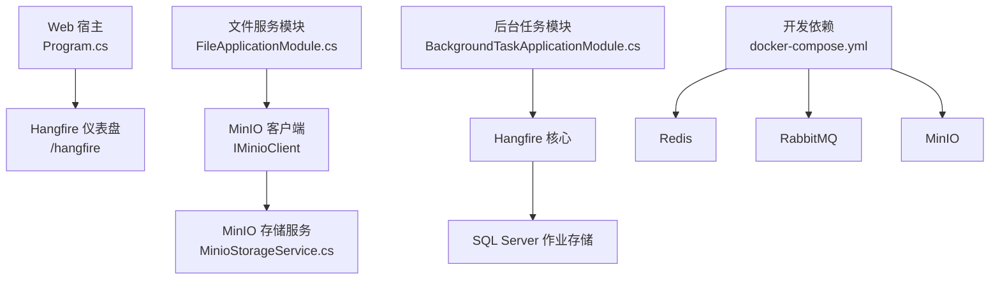
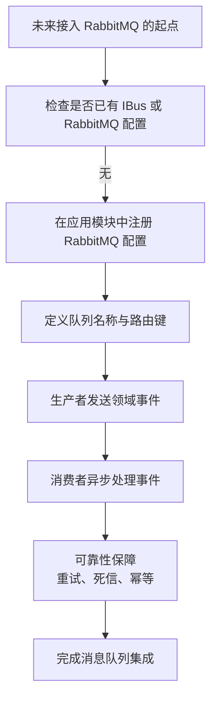
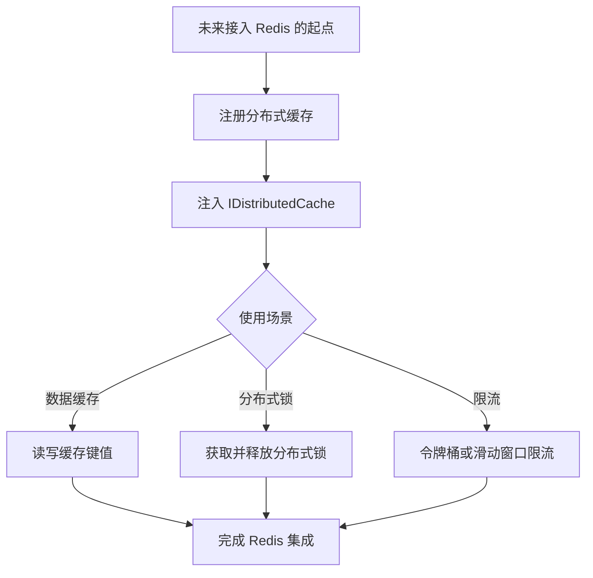
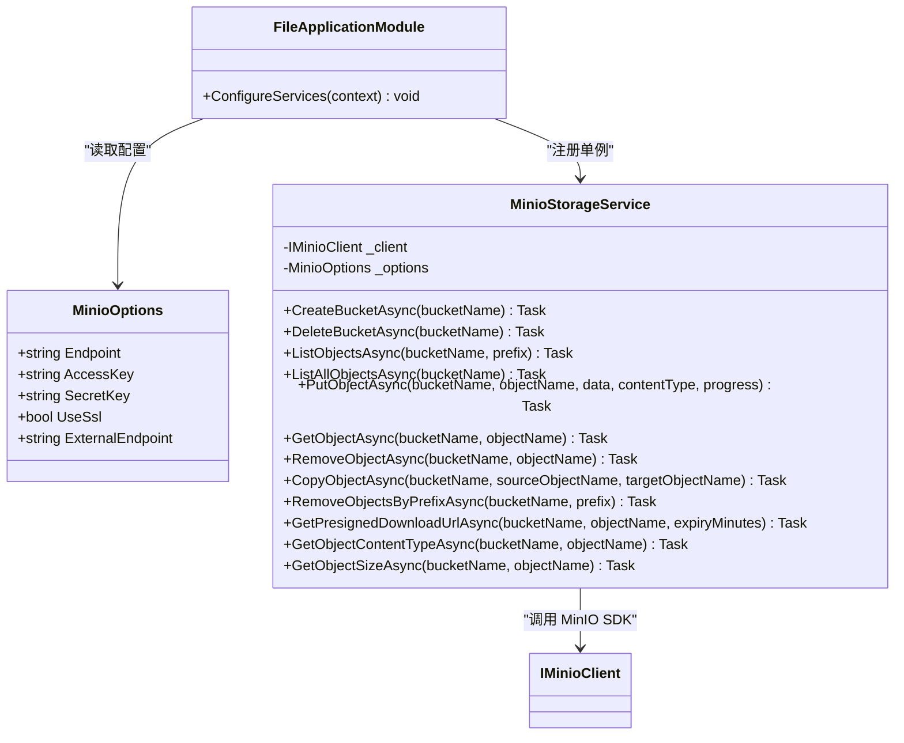
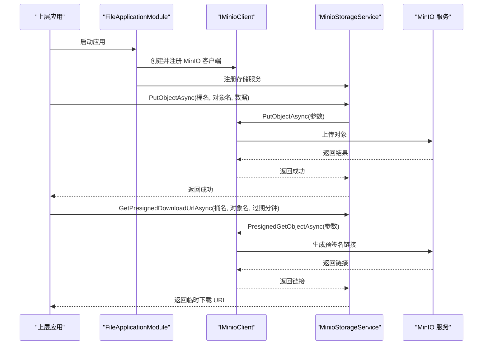
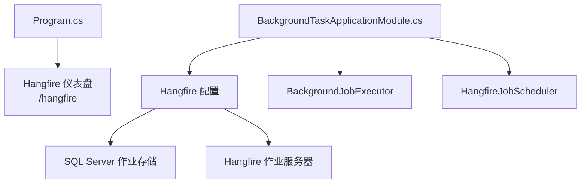
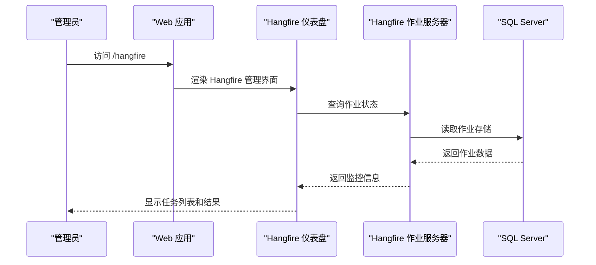

# 外部服务集成

<cite>
**本文引用的文件**   
- [README.md](file://README.md)
- [docker-compose.yml](file://cd/docker-compose.yml)
- [Program.cs](file://src/Host/H.AppLab.Web.Host/H.AppLab.Web.Host/Program.cs)
- [FileApplicationModule.cs](file://src/Services/File/H.File.Application/FileApplicationModule.cs)
- [MinioOptions.cs](file://src/Services/File/H.File.Application/MinioOptions.cs)
- [MinioStorageService.cs](file://src/Services/File/H.File.Application/Services/MinioStorageService.cs)
- [BackgroundTaskApplicationModule.cs](file://src/Services/BackgroundTask/H.BackgroundTask.Application/BackgroundTaskApplicationModule.cs)
- [H.BackgroundTask.Application.csproj](file://src/Services/BackgroundTask/H.BackgroundTask.Application/H.BackgroundTask.Application.csproj)
</cite>

## 目录
1. [引言](#引言)
2. [项目结构中的外部服务依赖](#项目结构中的外部服务依赖)
3. [消息队列集成现状](#消息队列集成现状)
4. [缓存服务集成现状](#缓存服务集成现状)
5. [文件存储服务集成](#文件存储服务集成)
6. [后台任务系统集成](#后台任务系统集成)
7. [连接配置示例与部署说明](#连接配置示例与部署说明)
8. [错误处理策略](#错误处理策略)
9. [性能优化建议](#性能优化建议)
10. [常见问题排查](#常见问题排查)
11. [结论](#结论)

## 引言
本文件聚焦 H.AppLab 平台中外部服务的集成方式，重点覆盖：
- 消息队列（RabbitMQ）
- 缓存服务（Redis）
- 文件存储服务（MinIO）
- 后台任务系统（Hangfire）

需要特别说明的是，仓库当前已明确提供 RabbitMQ、Redis 和 MinIO 的容器化依赖；但代码中实际实现的外部服务集成以 **MinIO 文件存储** 和 **Hangfire 后台任务** 为主。RabbitMQ 和 Redis 目前更多体现在基础设施部署和通用 ABP 生态约定上，尚未在本仓库中发现具体的业务消息或分布式缓存使用实现。因此，文档会严格区分“已实现的集成”和“可基于现有基础设施扩展的集成”。

## 项目结构中的外部服务依赖
从整体项目结构看，H.AppLab 是一个模块化 .NET + Blazor 平台，包含宿主程序、低代码引擎、企业级应用、系统应用、迁移工具和工具库。外部服务通过以下方式进入系统：
- 开发环境依赖由 `cd/docker-compose.yml` 统一声明。
- Web 宿主程序注册 Hangfire 仪表盘路由。
- 文件服务模块注册 MinIO 客户端和服务。
- 后台任务模块注册 Hangfire 作业存储和执行服务器。

**图表来源**
- [Program.cs:89-89](file://src/Host/H.AppLab.Web.Host/H.AppLab.Web.Host/Program.cs#L89-L89)
- [FileApplicationModule.cs:19-36](file://src/Services/File/H.File.Application/FileApplicationModule.cs#L19-L36)
- [MinioStorageService.cs:13-190](file://src/Services/File/H.File.Application/Services/MinioStorageService.cs#L13-L190)
- [BackgroundTaskApplicationModule.cs:37-53](file://src/Services/BackgroundTask/H.BackgroundTask.Application/BackgroundTaskApplicationModule.cs#L37-L53)
- [docker-compose.yml:1-48](file://cd/docker-compose.yml#L1-L48)

**章节来源**
- [README.md:1-73](file://README.md#L1-L73)
- [docker-compose.yml:1-48](file://cd/docker-compose.yml#L1-L48)

## 消息队列集成现状
### 当前状态
在源码中未发现 RabbitMQ 的直接集成代码，例如：
- 没有发现 `AddRabbitMq`、`UseRabbitMq`、`IBus`、`PublishAsync`、`SubscribeAsync` 等典型消息总线调用。
- 搜索到的 `PublishAsync` 主要出现在 UI 发布流程、订单领域事件发布以及页面交互逻辑中，并非 RabbitMQ 消息发送。

因此，**RabbitMQ 在当前代码库中属于基础设施就绪但业务未使用的状态**。

### 基础设施可用性
开发环境中，RabbitMQ 已通过 Docker Compose 启动：
- 镜像为 `rabbitmq:4.0-management-alpine`。
- 管理界面暴露端口 `15672`。
- 客户端通信端口 `5672`。
- 默认用户名为 `root`，默认密码为 `123456`。
- 数据卷挂载到 `rabbitmq_data`。

这意味着后续接入 RabbitMQ 时，可直接复用该容器作为消息中间件。

### 推荐的扩展方向
如果未来需要在 H.AppLab 中引入消息队列，推荐采用以下思路：
1. 使用 ABP 的消息总线能力，将 RabbitMQ 作为后端传输通道。
2. 在对应应用的 Application 模块中注册 RabbitMQ 选项、队列和订阅者。
3. 生产者通过 `IBus.PublishAsync` 发送领域事件。
4. 消费者通过 `[Queue]` 或订阅接口异步消费消息。
5. 对关键业务流程启用重试、死信队列和幂等处理。

[本图为概念流程图，不直接映射具体源码，因此不提供图表来源]

**章节来源**
- [docker-compose.yml:14-26](file://cd/docker-compose.yml#L14-L26)
- [OrderAppService.cs:234-234](file://src/Services/Order/H.Order.Application/Services/OrderAppService.cs#L234-L234)

## 缓存服务集成现状
### 当前状态
在源码中未发现显式的 Redis 客户端初始化、`IDistributedCache` 使用、分布式锁实现或 Redis 连接字符串绑定。搜索结果显示 Redis 主要出现在：
- 开发环境的 Docker Compose 依赖。
- 仓库元数据和文档索引。
- 一些 API 参考文档标题。

因此，**Redis 在当前代码库中同样属于基础设施就绪但未直接集成的状态**。

### 基础设施可用性
开发环境中，Redis 已通过 Docker Compose 启动：
- 镜像为 `redis:8.8-alpine`。
- 容器主机名为 `redishost`。
- 默认监听端口 `6379`。
- 默认密码配置为 `secure_password_here`（同时存在一条命令参数形式的旧密码）。
- 环境变量设置了时区和语言。

若后续需要引入分布式缓存、会话缓存、限流或分布式锁，可以直接复用该 Redis 实例。

### 推荐的扩展方向
推荐按 ABP 标准方式接入 Redis：
1. 在应用模块中注册 `AddDistributedRedisCache`。
2. 通过配置文件注入 Redis 连接字符串或连接参数。
3. 使用 `IDistributedCache` 做键值缓存。
4. 使用分布式锁保护并发写入或跨进程临界区。
5. 为热点键设置过期时间，避免内存泄漏。

[本图为概念流程图，不直接映射具体源码，因此不提供图表来源]

**章节来源**
- [docker-compose.yml:1-13](file://cd/docker-compose.yml#L1-L13)

## 文件存储服务集成
文件存储服务是本次仓库中**已实现且结构清晰**的外部服务集成点。它围绕 MinIO 构建，封装了桶管理、对象上传下载、预签名链接生成和基础元信息查询。

### 架构概览
文件服务采用分层设计：
- 配置层：`MinioOptions` 描述 MinIO 的连接地址、凭据、SSL 开关和外部访问端点。
- 配置注册层：`FileApplicationModule` 将配置绑定到 DI 容器，并创建单例 `IMinioClient`。
- 存储实现层：`MinioStorageService` 封装 MinIO SDK 操作。
- 上层应用：通过 `IFileObjectAppService`、`IFileProjectAppService` 等应用服务调用存储能力。

**图表来源**
- [MinioOptions.cs:1-14](file://src/Services/File/H.File.Application/MinioOptions.cs#L1-L14)
- [FileApplicationModule.cs:19-36](file://src/Services/File/H.File.Application/FileApplicationModule.cs#L19-L36)
- [MinioStorageService.cs:13-190](file://src/Services/File/H.File.Application/Services/MinioStorageService.cs#L13-L190)

### 连接配置
`MinioOptions` 提供了以下配置项：
- `Endpoint`：MinIO 服务端地址。
- `AccessKey`：访问密钥。
- `SecretKey`：秘密密钥。
- `UseSsl`：是否启用 SSL。
- `ExternalEndpoint`：用于生成预览或下载 URL 的外部访问地址。

`FileApplicationModule` 中：
- 从配置节 `Minio` 绑定 `MinioOptions`。
- 根据 `Endpoint`、`AccessKey`、`SecretKey` 和 `UseSsl` 构建 `IMinioClient`。
- 将 `IMinioClient` 和 `MinioStorageService` 注册为单例。

### 核心功能
`MinioStorageService` 提供的能力包括：
- 桶管理：创建桶、删除桶。
- 对象列表：按前缀列出对象，支持非递归和递归查询。
- 对象操作：上传字节数组、下载对象、删除对象、复制对象、按前缀批量删除。
- 预签名下载：生成临时下载链接。
- 元信息读取：获取内容类型和对象大小。

**图表来源**
- [FileApplicationModule.cs:19-36](file://src/Services/File/H.File.Application/FileApplicationModule.cs#L19-L36)
- [MinioStorageService.cs:33-168](file://src/Services/File/H.File.Application/Services/MinioStorageService.cs#L33-L168)

### 可靠性与错误处理
- 创建桶前先检查桶是否存在，避免重复创建。
- 删除桶前递归删除桶内所有对象，再删除桶本身。
- 上传时为空数据会替换为单字节空流，避免底层 SDK 异常。
- 获取对象元信息和大小时使用 try-catch 包裹 StatObject，失败时返回空值而不是抛出异常。
- 预签名链接默认过期时间为 60 分钟，适合短期下载场景。

### 性能特性
- 上传方法接收字节数组，内部转换为内存流；大文件场景应结合分页上传或流式上传优化。
- MinIO SDK 对大于 5MB 的对象自动使用分片上传，减少单次传输压力。
- 列举对象使用枚举迭代器，避免一次性加载全部对象列表造成内存峰值。
- 预签名链接可减少应用服务器转发大文件的带宽压力。

**章节来源**
- [MinioOptions.cs:1-14](file://src/Services/File/H.File.Application/MinioOptions.cs#L1-L14)
- [FileApplicationModule.cs:19-36](file://src/Services/File/H.File.Application/FileApplicationModule.cs#L19-L36)
- [MinioStorageService.cs:13-190](file://src/Services/File/H.File.Application/Services/MinioStorageService.cs#L13-L190)

## 后台任务系统集成
后台任务系统使用 Hangfire，并通过 SQL Server 作为作业持久化存储。宿主的 Web 管道中启用了 Hangfire 仪表盘。

### 组件关系
- `BackgroundTaskApplicationModule` 负责：
  - 注册 HTTP 上下文访问器和 HttpClient。
  - 注册后台任务执行器和调度器。
  - 配置 Hangfire 作业存储。
  - 启动 Hangfire 作业服务器。
- `Program.cs` 负责：
  - 注册 Hangfire 仪表盘路由 `/hangfire`。

**图表来源**
- [Program.cs:89-89](file://src/Host/H.AppLab.Web.Host/H.AppLab.Web.Host/Program.cs#L89-L89)
- [BackgroundTaskApplicationModule.cs:17-53](file://src/Services/BackgroundTask/H.BackgroundTask.Application/BackgroundTaskApplicationModule.cs#L17-L53)

### 作业存储配置
Hangfire 配置位于 `BackgroundTaskApplicationModule.ConfigureHangfire`：
- 连接字符串来自配置项 `BackgroundTaskDb`。
- 使用 `SqlServerStorage`。
- 兼容性级别设置为 `Version_180`。
- 使用简单程序集名称序列化器和推荐序列化设置。
- 批处理命令超时设置为 5 分钟。
- 滑动不可见超时设置为 5 分钟。
- 队列轮询间隔设置为 0。
- 使用推荐隔离级别。
- 禁用全局锁。

这些配置表明 Hangfire 作业表会创建在指定的 SQL Server 数据库中，并由 `BackgroundTaskDb` 连接字符串指向的数据库承载。

### 执行模型
- 作业服务器通过 `AddHangfireServer()` 随宿主启动。
- 调度器接口 `IJobScheduler` 的实现类为 `HangfireJobScheduler`。
- 执行器接口 `IBackgroundJobExecutor` 的实现类为 `BackgroundJobExecutor`。
- 控制台应用可通过 `/hangfire` 查看作业执行情况。

**图表来源**
- [Program.cs:89-89](file://src/Host/H.AppLab.Web.Host/H.AppLab.Web.Host/Program.cs#L89-L89)
- [BackgroundTaskApplicationModule.cs:37-53](file://src/Services/BackgroundTask/H.BackgroundTask.Application/BackgroundTaskApplicationModule.cs#L37-L53)

### 失败重试机制
当前源码中没有发现自定义的重试策略、重试次数配置或失败回调。Hangfire 默认具备失败记录和重跑能力，但具体重试行为取决于：
- Hangfire 默认配置。
- 业务代码中是否使用 `RecurringJob`、`BackgroundJob` 或自定义调度逻辑。
- 是否需要扩展 Hangfire 插件实现自定义重试、退避、告警。

若需要更严格的可靠性，建议：
1. 使用 Hangfire 的内置重试机制或扩展插件。
2. 对幂等性要求高的任务增加去重键。
3. 对失败任务设置最大重试次数和最终告警。
4. 将关键任务日志写入独立日志表或监控系统。

**章节来源**
- [Program.cs:89-89](file://src/Host/H.AppLab.Web.Host/H.AppLab.Web.Host/Program.cs#L89-L89)
- [BackgroundTaskApplicationModule.cs:17-53](file://src/Services/BackgroundTask/H.BackgroundTask.Application/BackgroundTaskApplicationModule.cs#L17-L53)
- [H.BackgroundTask.Application.csproj:1-21](file://src/Services/BackgroundTask/H.BackgroundTask.Application/H.BackgroundTask.Application.csproj#L1-L21)

## 连接配置示例与部署说明
### 开发环境依赖
开发环境通过 `cd/docker-compose.yml` 提供三个外部服务：

| 服务 | 镜像 | 主要端口 | 认证或凭据 | 用途 |
|---|---|---|---|---|
| Redis | `redis:8.8-alpine` | 6379 | 密码 `secure_password_here` | 分布式缓存、会话、锁 |
| RabbitMQ | `rabbitmq:4.0-management-alpine` | 5672、15672 | 用户名 `root`，密码 `123456` | 消息队列 |
| MinIO | `minio/minio:latest` | 9010、9011 | 用户名 `minioadmin`，密码 `minioadmin` | 对象存储 |

注意：
- Redis 配置中存在两处密码相关设置：环境变量 `REDIS_ARGS=--requirepass secure_password_here` 和命令参数 `command redis-server --requirepass "123456"`。部署时应统一密码来源，避免测试环境与运行环境不一致。
- MinIO 控制台端口映射为 9011，API 端口映射为 9010。
- RabbitMQ 管理界面端口映射为 15672，客户端端口映射为 5672。

### MinIO 配置示例
应用侧通过 `appsettings.json` 中的 `Minio` 配置节注入 `MinioOptions`：
- `Endpoint`：MinIO 服务地址。
- `AccessKey`：`minioadmin`。
- `SecretKey`：`minioadmin`。
- `UseSsl`：根据部署环境决定是否启用 HTTPS。
- `ExternalEndpoint`：面向浏览器或外部系统的可访问地址。

### Hangfire 配置示例
应用侧通过 `BackgroundTaskDb` 连接字符串配置 Hangfire 的作业数据库。该连接字符串通常位于宿主或应用配置的数据库连接部分。

### Redis 配置示例
若后续启用 Redis，可在配置中新增 Redis 连接字符串或连接参数，并在应用模块中注册分布式缓存。

### RabbitMQ 配置示例
若后续启用 RabbitMQ，可在应用模块中注册消息总线、RabbitMQ 连接参数、队列名称、交换器和路由键。

**章节来源**
- [docker-compose.yml:1-48](file://cd/docker-compose.yml#L1-L48)
- [MinioOptions.cs:1-14](file://src/Services/File/H.File.Application/MinioOptions.cs#L1-L14)
- [BackgroundTaskApplicationModule.cs:34-42](file://src/Services/BackgroundTask/H.BackgroundTask.Application/BackgroundTaskApplicationModule.cs#L34-L42)

## 错误处理策略
### MinIO 文件存储
- 桶不存在时跳过删除，避免误删报错。
- 删除桶前清空桶内对象，防止因非空桶导致删除失败。
- 上传空数据时修正为单字节流，降低底层 SDK 异常概率。
- 获取对象元信息失败时返回空值，让上层调用方自行判断对象是否存在。
- 预签名链接通过过期时间控制访问有效期，避免长期暴露下载地址。

### Hangfire 后台任务
- 当前实现未展示自定义异常处理逻辑。
- 建议对业务执行器捕获异常并记录结构化日志。
- 对可重试异常使用指数退避重试。
- 对不可重试异常直接进入失败队列或人工干预流程。

### Redis 和 RabbitMQ
当前代码未直接使用这两个服务，因此暂无对应的业务错误处理实现。未来接入时应考虑：
- Redis：网络超时、连接断开、键空间不足、分布式锁竞争。
- RabbitMQ：连接中断、队列未创建、消息序列化失败、消费者处理异常。

**章节来源**
- [MinioStorageService.cs:27-189](file://src/Services/File/H.File.Application/Services/MinioStorageService.cs#L27-L189)

## 性能优化建议
### MinIO
- 大文件上传建议使用流式上传或分片上传，避免一次性加载完整字节数组。
- 合理设置预签名链接过期时间，避免过长暴露风险。
- 使用 `ExternalEndpoint` 生成直链，减少应用服务器代理流量。
- 对频繁访问的对象建立缓存层，例如 CDN 或应用缓存。

### Hangfire
- 合理设置 SQL Server 连接超时和不可见超时，避免长事务阻塞。
- 将高吞吐任务放入独立队列，避免阻塞关键任务。
- 避免在作业中执行长时间同步 I/O。
- 使用 Hangfire 仪表盘监控失败任务和积压队列。

### Redis
- 为热点键设置过期时间，防止内存膨胀。
- 使用 pipeline 或 Lua 脚本减少网络往返。
- 对分布式锁设置合理超时，避免死锁。

### RabbitMQ
- 为不同业务域划分队列，避免单队列成为瓶颈。
- 消费者使用并发消费并限制最大并发数。
- 对慢消费者进行背压和限流。
- 使用持久化队列和确认机制保证消息不丢失。

[本节为通用性能建议，不直接分析具体源码，因此不提供章节来源]

## 常见问题排查
### 无法连接 MinIO
可能原因：
- `Endpoint` 地址错误。
- `AccessKey` 或 `SecretKey` 配置不正确。
- `UseSsl` 与实际部署协议不一致。
- 防火墙或容器网络阻止访问 MinIO 端口。

排查步骤：
1. 检查 `MinioOptions` 配置。
2. 确认 MinIO 容器正常运行。
3. 使用 MinIO 控制台验证登录。
4. 检查应用日志中的 MinIO SDK 异常。

### Hangfire 仪表盘无法访问
可能原因：
- 未启用 Hangfire 仪表盘路由。
- 路由路径被其他中间件拦截。
- 权限控制阻止访问 `/hangfire`。

排查步骤：
1. 确认 `Program.cs` 中已注册 `UseHangfireDashboard("/hangfire")`。
2. 检查身份认证和授权中间件。
3. 查看 Hangfire 仪表盘是否能连接到 SQL Server。

### Redis 或 RabbitMQ 未生效
可能原因：
- 仅启动了 Docker Compose，但应用未读取相应配置。
- 未在应用模块中注册 Redis 或 RabbitMQ。
- 业务代码尚未实现缓存或消息逻辑。

排查步骤：
1. 确认 Docker Compose 服务已启动。
2. 检查应用配置是否包含 Redis 或 RabbitMQ 连接信息。
3. 在对应应用模块中查找服务注册代码。
4. 在业务代码中确认是否真正调用了缓存或消息接口。

**章节来源**
- [MinioOptions.cs:1-14](file://src/Services/File/H.File.Application/MinioOptions.cs#L1-L14)
- [FileApplicationModule.cs:19-36](file://src/Services/File/H.File.Application/FileApplicationModule.cs#L19-L36)
- [Program.cs:89-89](file://src/Host/H.AppLab.Web.Host/H.AppLab.Web.Host/Program.cs#L89-L89)
- [docker-compose.yml:1-48](file://cd/docker-compose.yml#L1-L48)

## 结论
H.AppLab 平台的外部服务集成现状可概括为：
- **MinIO 文件存储**：已实现完整的客户端配置、存储服务封装和常用对象操作，是当前最成熟的外部服务集成点。
- **Hangfire 后台任务**：已实现作业存储、作业服务器和仪表盘，适合调度后台任务并监控执行状态。
- **RabbitMQ 消息队列**：基础设施可用，但源码中未见业务消息生产与消费实现，适合未来扩展。
- **Redis 缓存服务**：基础设施可用，但源码中未见分布式缓存或分布式锁实现，适合未来扩展。

对于生产环境，建议优先完善 MinIO 和 Hangfire 的配置管理、错误处理和监控；在此基础上再逐步接入 RabbitMQ 和 Redis，确保每个外部服务都有明确的配置来源、错误边界和可观测性。