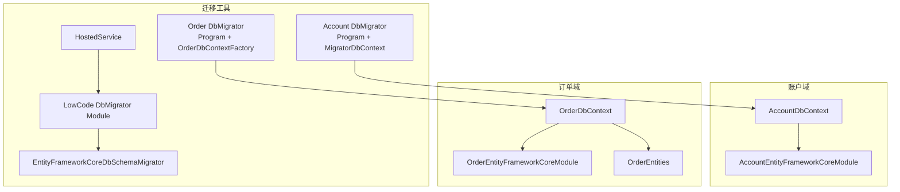
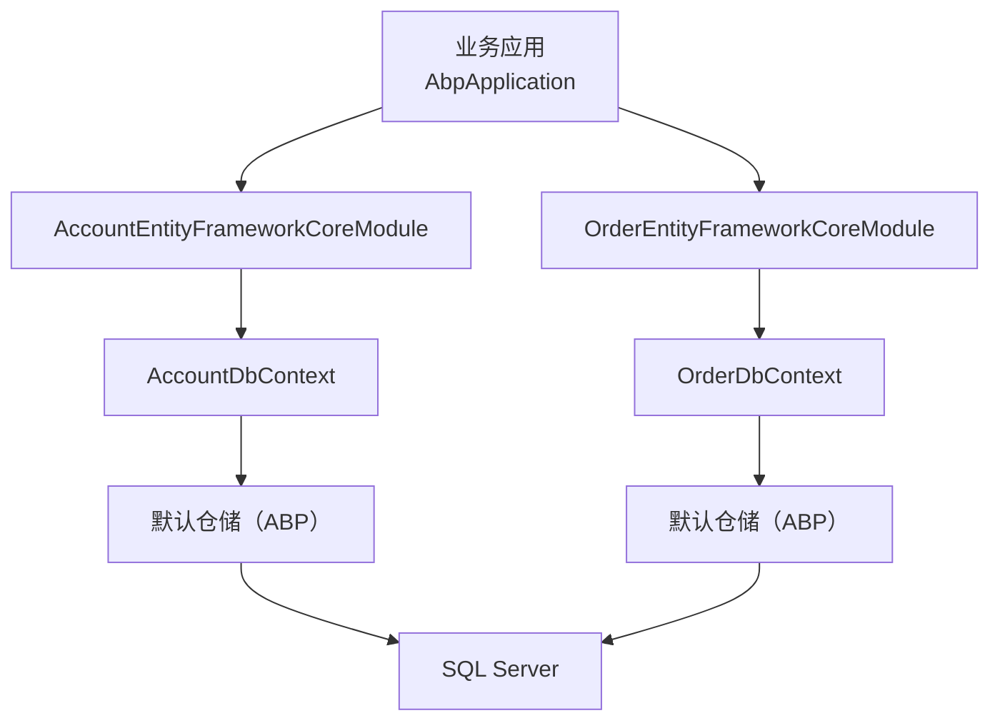
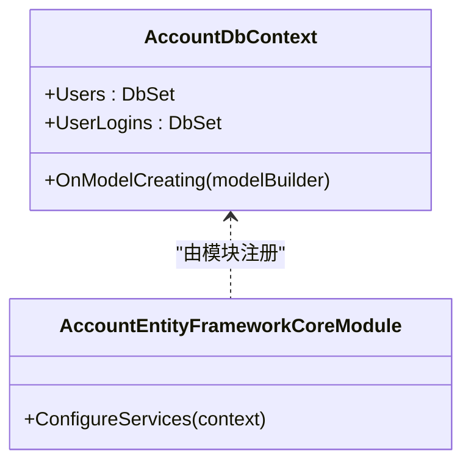
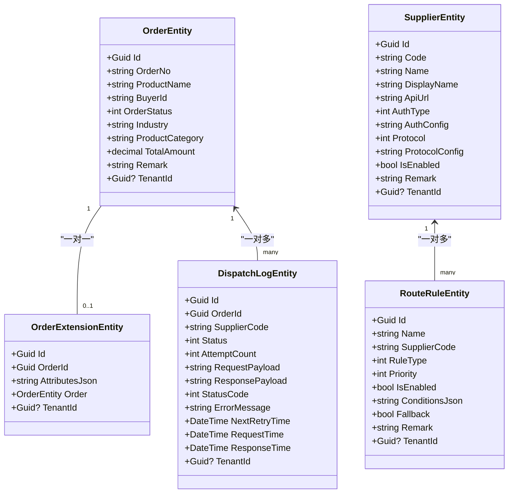
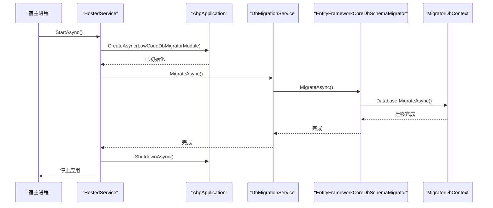
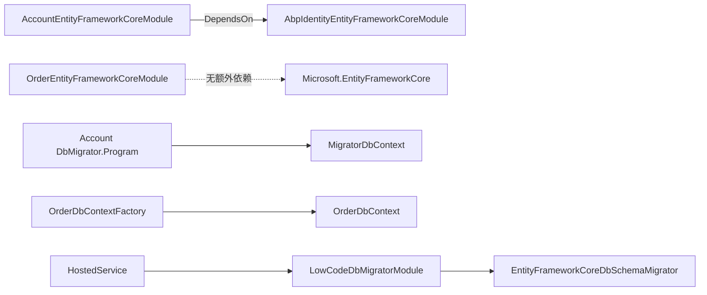
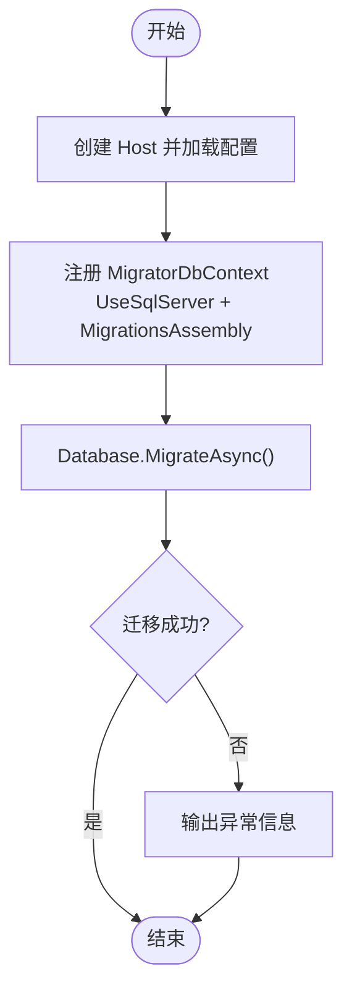
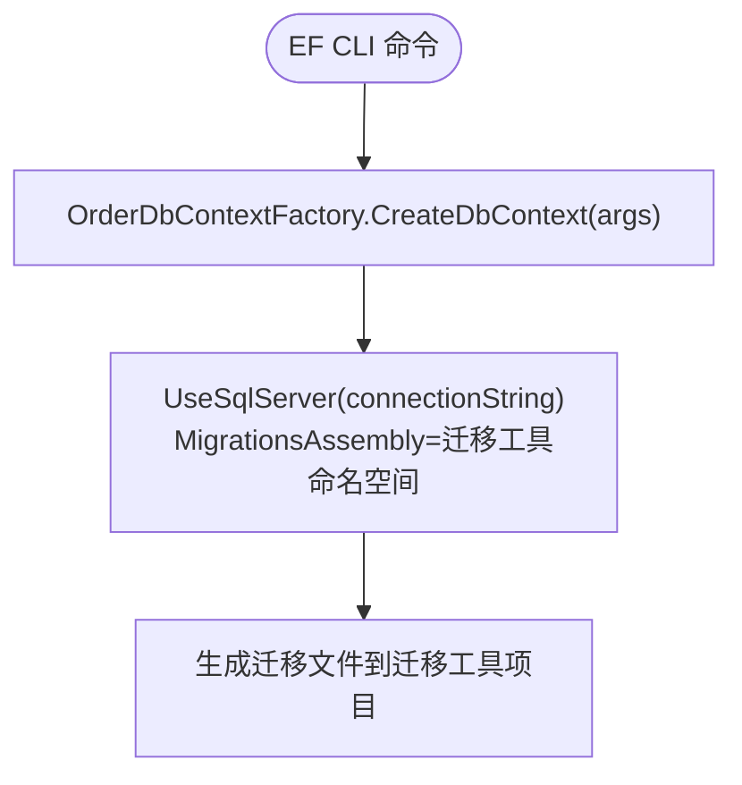
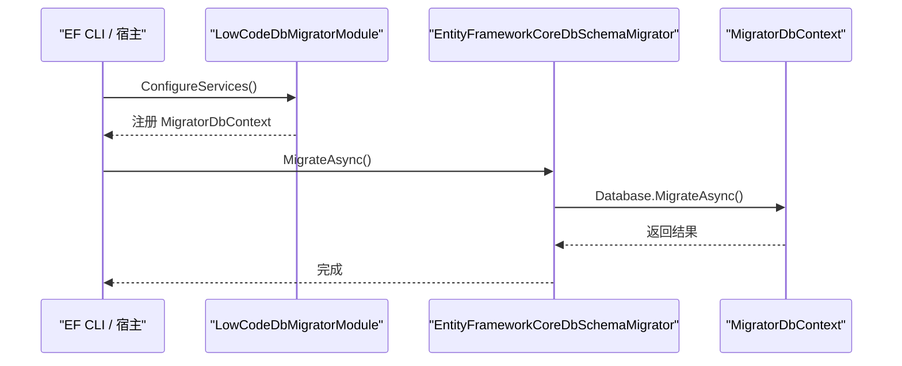

# 数据持久化设计

<cite>
**本文引用的文件**   
- [AccountDbContext.cs](file://src/Services/Account/H.Account.EntityFrameworkCore/AccountDbContext.cs)
- [AccountEntityFrameworkCoreModule.cs](file://src/Services/Account/H.Account.EntityFrameworkCore/AccountEntityFrameworkCoreModule.cs)
- [OrderDbContext.cs](file://src/Services/Order/H.Order.EntityFrameworkCore/OrderDbContext.cs)
- [OrderEntities.cs](file://src/Services/Order/H.Order.EntityFrameworkCore/Entities/OrderEntities.cs)
- [OrderEntityFrameworkCoreModule.cs](file://src/Services/Order/H.Order.EntityFrameworkCore/OrderEntityFrameworkCoreModule.cs)
- [MigratorDbContext.cs](file://src/Tools/H.Account.DbMigrator/MigratorDbContext.cs)
- [AccountDbContextFactory.cs](file://src/Tools/H.Account.DbMigrator/AccountDbContextFactory.cs)
- [OrderDbContextFactory.cs](file://src/Tools/H.Order.DbMigrator/OrderDbContextFactory.cs)
- [Program.cs](file://src/Tools/H.Account.DbMigrator/Program.cs)
- [LowCodeDbMigratorModule.cs](file://src/Tools/H.LowCode.DbMigrator/LowCodeDbMigratorModule.cs)
- [EntityFrameworkCoreDbSchemaMigrator.cs](file://src/Tools/H.LowCode.DbMigrator/MigrationServices/EntityFrameworkCoreDbSchemaMigrator.cs)
- [HostedService.cs](file://src/Tools/H.LowCode.DbMigrator/HostedService.cs)
- [appsettings.json（账户迁移工具）](file://src/Tools/H.Account.DbMigrator/appsettings.json)
- [appsettings.json（订单迁移工具）](file://src/Tools/H.Order.DbMigrator/appsettings.json)
</cite>

## 目录
1. [引言](#引言)
2. [项目结构](#项目结构)
3. [核心组件](#核心组件)
4. [架构总览](#架构总览)
5. [详细组件分析](#详细组件分析)
6. [依赖关系分析](#依赖关系分析)
7. [性能与连接池配置](#性能与连接池配置)
8. [事务管理最佳实践](#事务管理最佳实践)
9. [数据库迁移管理](#数据库迁移管理)
10. [仓储模式实现与复杂查询优化](#仓储模式实现与复杂查询优化)
11. [故障排查指南](#故障排查指南)
12. [结论](#结论)

## 引言
本文件面向 H.AppLab 平台的数据持久化层，围绕 EntityFramework Core 与 ABP Framework 的组合使用，系统说明 AccountDbContext、OrderDbContext 的设计原则、实体映射、关系映射、索引策略，以及 DbMigrator 迁移机制、仓储模式和性能调优要点。文档同时给出架构图表、流程图和常见问题处理建议，帮助开发者快速理解并安全扩展该平台的持久化能力。

## 项目结构
H.AppLab 在领域服务中按业务域拆分 EF Core 上下文：
- 账户域：AccountDbContext 用于 Identity 相关数据访问。
- 订单域：OrderDbContext 承载订单主表、扩展表、供应商、路由规则与下发日志等模型。
- 迁移工具：每个域提供独立 DbMigrator 控制台应用，负责生成和应用迁移。
- 低代码域：提供一个通用迁移模块，统一封装基于 EF Core 的 Schema 迁移能力。

**图表来源**
- [AccountDbContext.cs:1-28](file://src/Services/Account/H.Account.EntityFrameworkCore/AccountDbContext.cs#L1-L28)
- [AccountEntityFrameworkCoreModule.cs:1-37](file://src/Services/Account/H.Account.EntityFrameworkCore/AccountEntityFrameworkCoreModule.cs#L1-L37)
- [OrderDbContext.cs:1-110](file://src/Services/Order/H.Order.EntityFrameworkCore/OrderDbContext.cs#L1-L110)
- [OrderEntities.cs:1-169](file://src/Services/Order/H.Order.EntityFrameworkCore/Entities/OrderEntities.cs#L1-L169)
- [OrderEntityFrameworkCoreModule.cs:1-31](file://src/Services/Order/H.Order.EntityFrameworkCore/OrderEntityFrameworkCoreModule.cs#L1-L31)
- [MigratorDbContext.cs:1-22](file://src/Tools/H.Account.DbMigrator/MigratorDbContext.cs#L1-L22)
- [AccountDbContextFactory.cs:1-28](file://src/Tools/H.Account.DbMigrator/AccountDbContextFactory.cs#L1-L28)
- [OrderDbContextFactory.cs:1-26](file://src/Tools/H.Order.DbMigrator/OrderDbContextFactory.cs#L1-L26)
- [Program.cs:1-59](file://src/Tools/H.Account.DbMigrator/Program.cs#L1-L59)
- [LowCodeDbMigratorModule.cs:1-40](file://src/Tools/H.LowCode.DbMigrator/LowCodeDbMigratorModule.cs#L1-L40)
- [EntityFrameworkCoreDbSchemaMigrator.cs:1-23](file://src/Tools/H.LowCode.DbMigrator/MigrationServices/EntityFrameworkCoreDbSchemaMigrator.cs#L1-L23)
- [HostedService.cs:1-47](file://src/Tools/H.LowCode.DbMigrator/HostedService.cs#L1-L47)

**章节来源**
- [AccountDbContext.cs:1-28](file://src/Services/Account/H.Account.EntityFrameworkCore/AccountDbContext.cs#L1-L28)
- [OrderDbContext.cs:1-110](file://src/Services/Order/H.Order.EntityFrameworkCore/OrderDbContext.cs#L1-L110)
- [OrderEntities.cs:1-169](file://src/Services/Order/H.Order.EntityFrameworkCore/Entities/OrderEntities.cs#L1-L169)
- [AccountEntityFrameworkCoreModule.cs:1-37](file://src/Services/Account/H.Account.EntityFrameworkCore/AccountEntityFrameworkCoreModule.cs#L1-L37)
- [OrderEntityFrameworkCoreModule.cs:1-31](file://src/Services/Order/H.Order.EntityFrameworkCore/OrderEntityFrameworkCoreModule.cs#L1-L31)
- [MigratorDbContext.cs:1-22](file://src/Tools/H.Account.DbMigrator/MigratorDbContext.cs#L1-L22)
- [AccountDbContextFactory.cs:1-28](file://src/Tools/H.Account.DbMigrator/AccountDbContextFactory.cs#L1-L28)
- [OrderDbContextFactory.cs:1-26](file://src/Tools/H.Order.DbMigrator/OrderDbContextFactory.cs#L1-L26)
- [Program.cs:1-59](file://src/Tools/H.Account.DbMigrator/Program.cs#L1-L59)
- [LowCodeDbMigratorModule.cs:1-40](file://src/Tools/H.LowCode.DbMigrator/LowCodeDbMigratorModule.cs#L1-L40)
- [EntityFrameworkCoreDbSchemaMigrator.cs:1-23](file://src/Tools/H.LowCode.DbMigrator/MigrationServices/EntityFrameworkCoreDbSchemaMigrator.cs#L1-L23)
- [HostedService.cs:1-47](file://src/Tools/H.LowCode.DbMigrator/HostedService.cs#L1-L47)

## 核心组件
- AccountDbContext：继承自 ABP 的 AbpDbContext，暴露 IdentityUser 与 UserLogins 集合，并通过 ConfigureIdentity() 完成 Identity 实体的映射。
- OrderDbContext：定义订单主表、扩展表、供应商、路由规则和下发日志的 DbSet，并在 OnModelCreating 中集中配置表名、字段类型、唯一索引、普通索引与一对零或一关系。
- OrderEntities：包含 OrderEntity、OrderExtensionEntity、SupplierEntity、RouteRuleEntity、DispatchLogEntity 等业务实体，遵循多租户接口 IMultiTenant，并使用 ABP 审计基类。
- AccountEntityFrameworkCoreModule / OrderEntityFrameworkCoreModule：ABP 模块，注册 DbContext、默认仓储、SQL Server 提供程序及连接字符串。
- 迁移工具：
  - Account DbMigrator：通过 Program 启动 Host，注入 MigratorDbContext，调用 Database.MigrateAsync() 执行迁移；设计时由 AccountDbContextFactory 提供 EF CLI 所需上下文。
  - Order DbMigrator：通过 OrderDbContextFactory 为 EF CLI 提供上下文。
  - LowCode DbMigrator：提供 LowCodeDbMigratorModule 与 EntityFrameworkCoreDbSchemaMigrator，封装统一的 EF Core Schema 迁移能力；HostedService 在应用启动时触发迁移流程。

**章节来源**
- [AccountDbContext.cs:1-28](file://src/Services/Account/H.Account.EntityFrameworkCore/AccountDbContext.cs#L1-L28)
- [OrderDbContext.cs:1-110](file://src/Services/Order/H.Order.EntityFrameworkCore/OrderDbContext.cs#L1-L110)
- [OrderEntities.cs:1-169](file://src/Services/Order/H.Order.EntityFrameworkCore/Entities/OrderEntities.cs#L1-L169)
- [AccountEntityFrameworkCoreModule.cs:1-37](file://src/Services/Account/H.Account.EntityFrameworkCore/AccountEntityFrameworkCoreModule.cs#L1-L37)
- [OrderEntityFrameworkCoreModule.cs:1-31](file://src/Services/Order/H.Order.EntityFrameworkCore/OrderEntityFrameworkCoreModule.cs#L1-L31)
- [MigratorDbContext.cs:1-22](file://src/Tools/H.Account.DbMigrator/MigratorDbContext.cs#L1-L22)
- [AccountDbContextFactory.cs:1-28](file://src/Tools/H.Account.DbMigrator/AccountDbContextFactory.cs#L1-L28)
- [OrderDbContextFactory.cs:1-26](file://src/Tools/H.Order.DbMigrator/OrderDbContextFactory.cs#L1-L26)
- [Program.cs:1-59](file://src/Tools/H.Account.DbMigrator/Program.cs#L1-L59)
- [LowCodeDbMigratorModule.cs:1-40](file://src/Tools/H.LowCode.DbMigrator/LowCodeDbMigratorModule.cs#L1-L40)
- [EntityFrameworkCoreDbSchemaMigrator.cs:1-23](file://src/Tools/H.LowCode.DbMigrator/MigrationServices/EntityFrameworkCoreDbSchemaMigrator.cs#L1-L23)
- [HostedService.cs:1-47](file://src/Tools/H.LowCode.DbMigrator/HostedService.cs#L1-L47)

## 架构总览
H.AppLab 的持久化架构采用“领域分库/分上下文”的模式：每个业务域拥有独立的 DbContext 与 EF Core 模块，迁移工具与应用解耦。运行时由 ABP 模块加载 DbContext 并提供仓储；迁移阶段由独立控制台程序或托管服务驱动 EF Core 执行迁移。

**图表来源**
- [AccountEntityFrameworkCoreModule.cs:1-37](file://src/Services/Account/H.Account.EntityFrameworkCore/AccountEntityFrameworkCoreModule.cs#L1-L37)
- [OrderEntityFrameworkCoreModule.cs:1-31](file://src/Services/Order/H.Order.EntityFrameworkCore/OrderEntityFrameworkCoreModule.cs#L1-L31)
- [AccountDbContext.cs:1-28](file://src/Services/Account/H.Account.EntityFrameworkCore/AccountDbContext.cs#L1-L28)
- [OrderDbContext.cs:1-110](file://src/Services/Order/H.Order.EntityFrameworkCore/OrderDbContext.cs#L1-L110)

## 详细组件分析

### AccountDbContext 与 Identity 集成
- 设计原则
  - 继承 AbpDbContext，启用 ABP 的多租户、审计、仓储等横切能力。
  - 通过 ConnectionStringName 指定连接字符串名称 AccountDb。
  - 在 OnModelCreating 中调用 ConfigureIdentity() 完成 Identity 实体映射，避免重复配置。
- 关键能力
  - 暴露 Users、UserLogins 集合，供身份认证与登录记录访问。
  - 与 AccountEntityFrameworkCoreModule 配合，注册 SQL Server 提供程序与连接字符串。

**图表来源**
- [AccountDbContext.cs:1-28](file://src/Services/Account/H.Account.EntityFrameworkCore/AccountDbContext.cs#L1-L28)
- [AccountEntityFrameworkCoreModule.cs:1-37](file://src/Services/Account/H.Account.EntityFrameworkCore/AccountEntityFrameworkCoreModule.cs#L1-L37)

**章节来源**
- [AccountDbContext.cs:1-28](file://src/Services/Account/H.Account.EntityFrameworkCore/AccountDbContext.cs#L1-L28)
- [AccountEntityFrameworkCoreModule.cs:1-37](file://src/Services/Account/H.Account.EntityFrameworkCore/AccountEntityFrameworkCoreModule.cs#L1-L37)

### OrderDbContext 与订单领域建模
- 设计原则
  - 将订单核心属性与行业特有扩展分离：Orders 存储最小必要字段，OrderExtensions 以 JSON 存储扩展属性，降低主表膨胀。
  - 所有实体实现 IMultiTenant，支持多租户隔离。
  - 在 OnModelCreating 中集中配置表名、字段长度、数据类型、唯一索引与普通索引，以及一对一关系与级联删除。
- 关系与索引
  - OrderEntity.OrderNo 唯一索引；Industry、BuyerId、OrderStatus 普通索引，加速常见查询。
  - OrderExtensionEntity.OrderId 唯一索引，保证一对一；外键关联 OrderEntity，级联删除。
  - SupplierEntity.Code 唯一索引；RouteRuleEntity.SupplierCode、IsEnabled 建立索引；DispatchLogEntity 针对 OrderId、SupplierCode、Status、NextRetryTime 建索引，优化重试与查询。
- 实体模型
  - OrderEntity：订单主实体，包含订单号、商品、买家、状态、金额、备注等。
  - OrderExtensionEntity：扩展实体，JSON 字段 AttributesJson 存储行业特定属性。
  - SupplierEntity：供应商元数据，包含编码、名称、API 地址、认证方式、协议与配置等。
  - RouteRuleEntity：路由规则，包含命中条件、优先级、是否兜底等。
  - DispatchLogEntity：下发日志，包含请求响应负载、状态码、错误信息、重试时间等。

**图表来源**
- [OrderEntities.cs:1-169](file://src/Services/Order/H.Order.EntityFrameworkCore/Entities/OrderEntities.cs#L1-L169)
- [OrderDbContext.cs:1-110](file://src/Services/Order/H.Order.EntityFrameworkCore/OrderDbContext.cs#L1-L110)

**章节来源**
- [OrderEntities.cs:1-169](file://src/Services/Order/H.Order.EntityFrameworkCore/Entities/OrderEntities.cs#L1-L169)
- [OrderDbContext.cs:1-110](file://src/Services/Order/H.Order.EntityFrameworkCore/OrderDbContext.cs#L1-L110)

### 低代码域迁移模块与托管服务
- LowCodeDbMigratorModule
  - 依赖 DesignEngineEntityFrameworkCoreModule 与 Application 模块。
  - 注册 IDataSeeder、IDbSchemaMigrator 实现，并注入 MigrationCurrentApp。
  - 使用 MigratorDbContext 并显式指定 MigrationsAssembly 为当前迁移工具程序集，忽略待更改警告。
- EntityFrameworkCoreDbSchemaMigrator
  - 封装 IDbSchemaMigrator，通过 IServiceProvider 获取 MigratorDbContext 并调用 Database.MigrateAsync()。
- HostedService
  - 作为 IHostedService 在应用启动时初始化 ABP 应用，执行 DbMigrationService.MigrateAsync()，然后关闭应用。

**图表来源**
- [LowCodeDbMigratorModule.cs:1-40](file://src/Tools/H.LowCode.DbMigrator/LowCodeDbMigratorModule.cs#L1-L40)
- [EntityFrameworkCoreDbSchemaMigrator.cs:1-23](file://src/Tools/H.LowCode.DbMigrator/MigrationServices/EntityFrameworkCoreDbSchemaMigrator.cs#L1-L23)
- [HostedService.cs:1-47](file://src/Tools/H.LowCode.DbMigrator/HostedService.cs#L1-L47)

**章节来源**
- [LowCodeDbMigratorModule.cs:1-40](file://src/Tools/H.LowCode.DbMigrator/LowCodeDbMigratorModule.cs#L1-L40)
- [EntityFrameworkCoreDbSchemaMigrator.cs:1-23](file://src/Tools/H.LowCode.DbMigrator/MigrationServices/EntityFrameworkCoreDbSchemaMigrator.cs#L1-L23)
- [HostedService.cs:1-47](file://src/Tools/H.LowCode.DbMigrator/HostedService.cs#L1-L47)

## 依赖关系分析
- 模块依赖
  - AccountEntityFrameworkCoreModule 依赖 AbpIdentityEntityFrameworkCoreModule，用于加载 Identity 实体映射。
  - OrderEntityFrameworkCoreModule 为纯 EF Core 模块，不依赖其他 ABP 模块。
- 迁移工具依赖
  - Account DbMigrator 使用 MigratorDbContext 直接调用 Database.MigrateAsync()。
  - Order DbMigrator 通过 IDesignTimeDbContextFactory<OrderDbContext> 支持 EF CLI 命令。
  - LowCode DbMigrator 通过 Hosting 模式统一驱动迁移，屏蔽底层差异。

**图表来源**
- [AccountEntityFrameworkCoreModule.cs:1-37](file://src/Services/Account/H.Account.EntityFrameworkCore/AccountEntityFrameworkCoreModule.cs#L1-L37)
- [OrderEntityFrameworkCoreModule.cs:1-31](file://src/Services/Order/H.Order.EntityFrameworkCore/OrderEntityFrameworkCoreModule.cs#L1-L31)
- [Program.cs:1-59](file://src/Tools/H.Account.DbMigrator/Program.cs#L1-L59)
- [AccountDbContextFactory.cs:1-28](file://src/Tools/H.Account.DbMigrator/AccountDbContextFactory.cs#L1-L28)
- [OrderDbContextFactory.cs:1-26](file://src/Tools/H.Order.DbMigrator/OrderDbContextFactory.cs#L1-L26)
- [LowCodeDbMigratorModule.cs:1-40](file://src/Tools/H.LowCode.DbMigrator/LowCodeDbMigratorModule.cs#L1-L40)
- [EntityFrameworkCoreDbSchemaMigrator.cs:1-23](file://src/Tools/H.LowCode.DbMigrator/MigrationServices/EntityFrameworkCoreDbSchemaMigrator.cs#L1-L23)
- [HostedService.cs:1-47](file://src/Tools/H.LowCode.DbMigrator/HostedService.cs#L1-L47)

**章节来源**
- [AccountEntityFrameworkCoreModule.cs:1-37](file://src/Services/Account/H.Account.EntityFrameworkCore/AccountEntityFrameworkCoreModule.cs#L1-L37)
- [OrderEntityFrameworkCoreModule.cs:1-31](file://src/Services/Order/H.Order.EntityFrameworkCore/OrderEntityFrameworkCoreModule.cs#L1-L31)
- [Program.cs:1-59](file://src/Tools/H.Account.DbMigrator/Program.cs#L1-L59)
- [AccountDbContextFactory.cs:1-28](file://src/Tools/H.Account.DbMigrator/AccountDbContextFactory.cs#L1-L28)
- [OrderDbContextFactory.cs:1-26](file://src/Tools/H.Order.DbMigrator/OrderDbContextFactory.cs#L1-L26)
- [LowCodeDbMigratorModule.cs:1-40](file://src/Tools/H.LowCode.DbMigrator/LowCodeDbMigratorModule.cs#L1-L40)
- [EntityFrameworkCoreDbSchemaMigrator.cs:1-23](file://src/Tools/H.LowCode.DbMigrator/MigrationServices/EntityFrameworkCoreDbSchemaMigrator.cs#L1-L23)
- [HostedService.cs:1-47](file://src/Tools/H.LowCode.DbMigrator/HostedService.cs#L1-L47)

## 性能与连接池配置
- 连接字符串与数据库提供程序
  - 账户与订单模块均通过 ABP 的 AbpDbContextOptions.UseSqlServer() 启用 SQL Server 提供程序。
  - 连接字符串分别命名为 AccountDb 与 OrderDb，便于多环境切换。
- 连接池与性能建议
  - ABP 默认会复用 EF Core 的连接池；生产环境建议在 appsettings 中根据并发与数据库实例规格调整最大连接数、超时与重试策略。
  - 对高频查询字段建立合适索引，例如订单域的 OrderNo、Industry、BuyerId、OrderStatus，以及下发日志的 OrderId、SupplierCode、Status、NextRetryTime。
  - 对 JSON 大字段（AttributesJson、AuthConfig、ProtocolConfig、ConditionsJson、RequestPayload、ResponsePayload）注意列大小与查询模式，必要时拆分历史归档表。
  - 使用分页与投影减少数据传输量，避免 Select *。

[本节为通用指导，不直接分析具体文件]

## 事务管理最佳实践
- 单 DbContext 内操作天然具备事务语义；跨多个 DbContext 建议使用 ABP 的事务服务或分布式事务方案。
- 对于批量写入（如下发日志），应控制每批大小，避免长事务导致锁竞争。
- 在迁移工具中应避免开启业务事务；仅执行数据库结构变更。
- 对于幂等性要求高的操作，结合唯一约束与重试逻辑确保最终一致性。

[本节为通用指导，不直接分析具体文件]

## 数据库迁移管理

### 账户域迁移流程
- 设计时：AccountDbContextFactory 为 EF CLI 提供 AccountDbContext，设置 MigrationsAssembly 指向迁移工具命名空间，使生成的迁移文件位于迁移工具项目中。
- 运行时：Program 构建 Host，注入 MigratorDbContext，调用 Database.MigrateAsync() 执行迁移。
- 连接配置：appsettings.json 中的 ConnectionStrings.AccountDb 指定 LocalDB 数据库。

**图表来源**
- [AccountDbContextFactory.cs:1-28](file://src/Tools/H.Account.DbMigrator/AccountDbContextFactory.cs#L1-L28)
- [Program.cs:1-59](file://src/Tools/H.Account.DbMigrator/Program.cs#L1-L59)
- [appsettings.json（账户迁移工具）:1-5](file://src/Tools/H.Account.DbMigrator/appsettings.json#L1-L5)

**章节来源**
- [AccountDbContextFactory.cs:1-28](file://src/Tools/H.Account.DbMigrator/AccountDbContextFactory.cs#L1-L28)
- [Program.cs:1-59](file://src/Tools/H.Account.DbMigrator/Program.cs#L1-L59)
- [appsettings.json（账户迁移工具）:1-5](file://src/Tools/H.Account.DbMigrator/appsettings.json#L1-L5)

### 订单域迁移流程
- 设计时：OrderDbContextFactory 为 EF CLI 提供 OrderDbContext，设置 MigrationsAssembly 指向迁移工具命名空间。
- 运行时无需特殊逻辑，常规由业务应用生命周期管理；若需要独立迁移，可参考账户域模式添加 Program 入口。

**图表来源**
- [OrderDbContextFactory.cs:1-26](file://src/Tools/H.Order.DbMigrator/OrderDbContextFactory.cs#L1-L26)

**章节来源**
- [OrderDbContextFactory.cs:1-26](file://src/Tools/H.Order.DbMigrator/OrderDbContextFactory.cs#L1-L26)

### 低代码域迁移流程
- 模块注册：LowCodeDbMigratorModule 注册 MigratorDbContext，指定 MigrationsAssembly 为当前迁移工具程序集，忽略 PendingModelChangesWarning。
- 迁移执行：EntityFrameworkCoreDbSchemaMigrator 通过服务提供者获取 MigratorDbContext 并调用 Database.MigrateAsync()。
- 启动触发：HostedService 在应用启动时初始化 ABP 应用并执行 DbMigrationService.MigrateAsync()，随后关闭应用。

**图表来源**
- [LowCodeDbMigratorModule.cs:1-40](file://src/Tools/H.LowCode.DbMigrator/LowCodeDbMigratorModule.cs#L1-L40)
- [EntityFrameworkCoreDbSchemaMigrator.cs:1-23](file://src/Tools/H.LowCode.DbMigrator/MigrationServices/EntityFrameworkCoreDbSchemaMigrator.cs#L1-L23)

**章节来源**
- [LowCodeDbMigratorModule.cs:1-40](file://src/Tools/H.LowCode.DbMigrator/LowCodeDbMigratorModule.cs#L1-L40)
- [EntityFrameworkCoreDbSchemaMigrator.cs:1-23](file://src/Tools/H.LowCode.DbMigrator/MigrationServices/EntityFrameworkCoreDbSchemaMigrator.cs#L1-L23)
- [HostedService.cs:1-47](file://src/Tools/H.LowCode.DbMigrator/HostedService.cs#L1-L47)

## 仓储模式实现与复杂查询优化
- 默认仓储抽象
  - 账户与订单模块通过 AddAbpDbContext().AddDefaultRepositories(includeAllEntities: true) 自动为所有实体生成默认仓储，提供常见的增删改查能力。
- 特定仓储实现
  - 当存在复杂查询、跨聚合根操作或性能敏感场景时，可定义领域仓储接口与实现，委托到对应 DbContext 进行精细化查询。
- 复杂查询优化
  - 优先使用 EF Core 的 LINQ 组合过滤与投影，减少内存开销。
  - 对高频查询字段建立合适索引（订单域已在 OnModelCreating 中完成）。
  - 对 JSON 字段查询尽量使用数据库原生函数或拆分为结构化字段以提升可维护性与性能。
  - 大批量写入使用批量插入或分批提交，避免长事务。

**章节来源**
- [AccountEntityFrameworkCoreModule.cs:1-37](file://src/Services/Account/H.Account.EntityFrameworkCore/AccountEntityFrameworkCoreModule.cs#L1-L37)
- [OrderEntityFrameworkCoreModule.cs:1-31](file://src/Services/Order/H.Order.EntityFrameworkCore/OrderEntityFrameworkCoreModule.cs#L1-L31)
- [OrderDbContext.cs:1-110](file://src/Services/Order/H.Order.EntityFrameworkCore/OrderDbContext.cs#L1-L110)

## 故障排查指南
- 迁移找不到模型
  - 确认迁移工具的 MigrationsAssembly 指向正确的程序集，AccountDbContextFactory 与 OrderDbContextFactory 均已设置。
- 连接失败
  - 检查 appsettings.json 中 ConnectionStrings 是否正确，本地开发使用 LocalDB，生产环境替换为真实服务器与凭据。
- 模型不一致
  - LowCodeDbMigratorModule 忽略了 PendingModelChangesWarning，但在新增实体后仍应重新生成迁移。
- 权限不足
  - 迁移工具需要数据库管理员权限以创建数据库对象，请确保连接字符串用户具备相应权限。

**章节来源**
- [AccountDbContextFactory.cs:1-28](file://src/Tools/H.Account.DbMigrator/AccountDbContextFactory.cs#L1-L28)
- [OrderDbContextFactory.cs:1-26](file://src/Tools/H.Order.DbMigrator/OrderDbContextFactory.cs#L1-L26)
- [LowCodeDbMigratorModule.cs:1-40](file://src/Tools/H.LowCode.DbMigrator/LowCodeDbMigratorModule.cs#L1-L40)
- [appsettings.json（账户迁移工具）:1-5](file://src/Tools/H.Account.DbMigrator/appsettings.json#L1-L5)
- [appsettings.json（订单迁移工具）:1-5](file://src/Tools/H.Order.DbMigrator/appsettings.json#L1-L5)

## 结论
H.AppLab 的数据持久化设计以 EF Core 与 ABP 为基础，采用领域分上下文的方式组织模型与映射，结合索引优化、JSON 扩展与多租户能力，满足订单领域的复杂业务需求。迁移机制通过独立 DbMigrator 与托管服务统一管控，确保版本演进可控、可回滚。默认仓储简化了常见 CRUD 操作，同时在复杂场景下允许自定义仓储实现以满足性能与业务复杂度要求。生产部署时应关注连接池、索引与 JSON 字段的使用策略，并结合事务边界与重试机制提升系统的稳定性与可观测性。