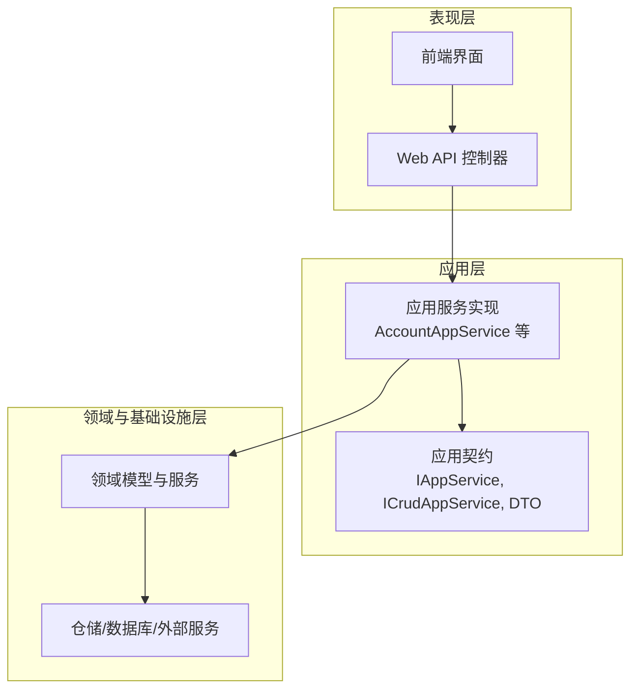
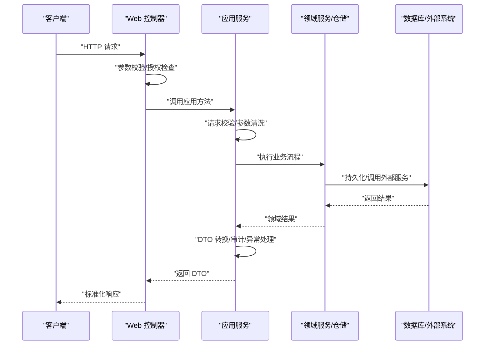
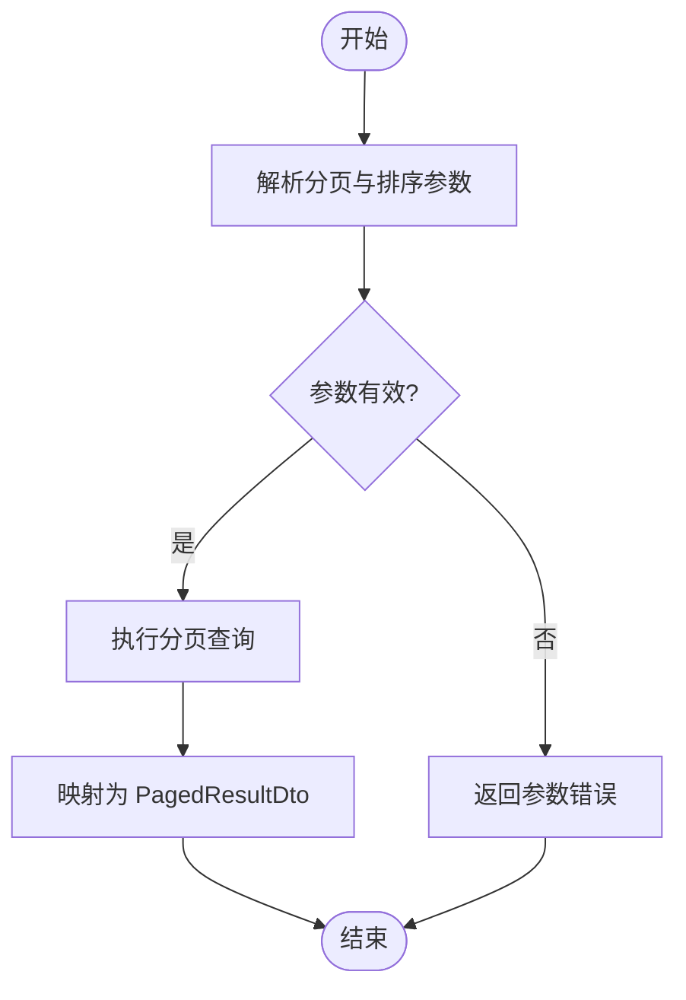
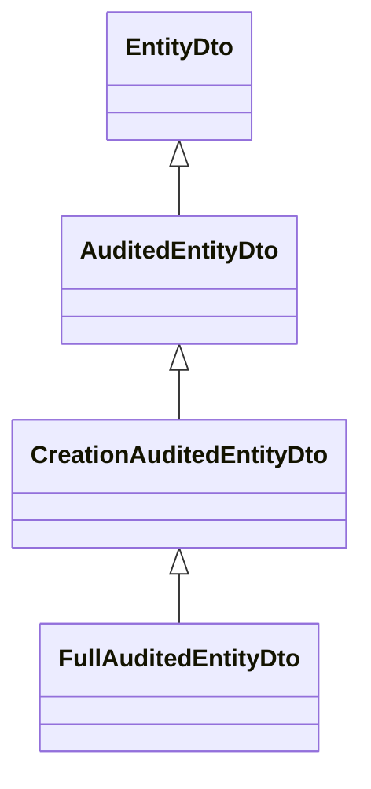
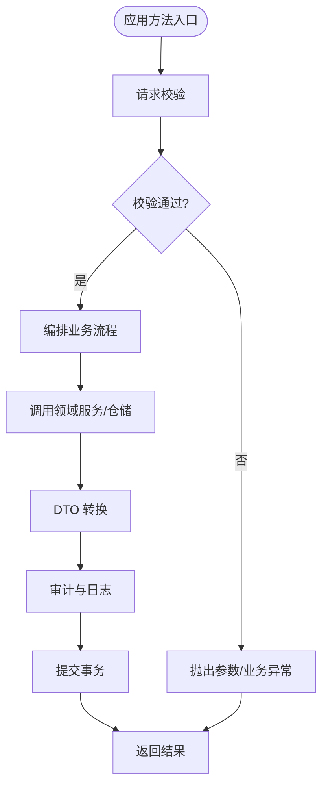
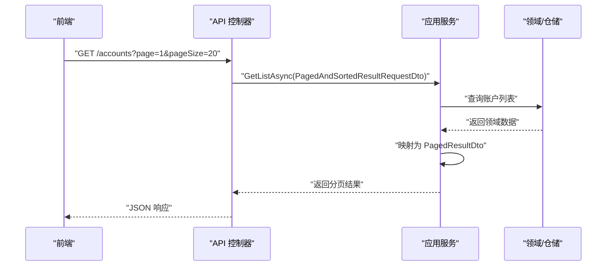
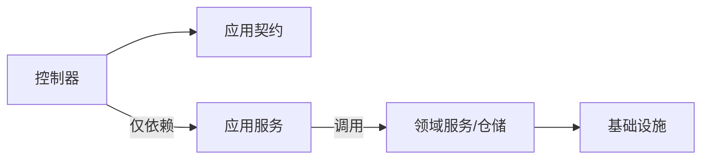

# 应用层设计

<cite>
**本文引用的文件**   
- [IAppService.cs](file://src/src/Utils/src/Utils/H.Abp.Application.Contracts/src/Utils/H.Abp.Application.Contracts/IAppService.cs)
- [ICrudAppService.cs](file://src/src/Utils/src/Utils/H.Abp.Application.Contracts/src/Utils/H.Abp.Application.Contracts/ICrudAppService.cs)
- [PagedResultDto.cs](file://src/src/Utils/src/Utils/H.Abp.Application.Contracts/src/Utils/H.Abp.Application.Contracts/PagedResultDto.cs)
- [PagedAndSortedResultRequestDto.cs](file://src/src/Utils/src/Utils/H.Abp.Application.Contracts/src/Utils/H.Abp.Application.Contracts/PagedAndSortedResultRequestDto.cs)
- [PagedResultRequestDto.cs](file://src/src/Utils/src/Utils/H.Abp.Application.Contracts/src/Utils/H.Abp.Application.Contracts/PagedResultRequestDto.cs)
- [EntityDto.cs](file://src/src/Utils/src/Utils/H.Abp.Application.Contracts/src/Utils/H.Abp.Application.Contracts/EntityDto.cs)
- [AuditedEntityDto.cs](file://src/src/Utils/src/Utils/H.Abp.Application.Contracts/src/Utils/H.Abp.Application.Contracts/AuditedEntityDto.cs)
- [CreationAuditedEntityDto.cs](file://src/src/Utils/src/Utils/H.Abp.Application.Contracts/src/Utils/H.Abp.Application.Contracts/CreationAuditedEntityDto.cs)
- [FullAuditedEntityDto.cs](file://src/src/Utils/src/Utils/H.Abp.Application.Contracts/src/Utils/H.Abp.Application.Contracts/FullAuditedEntityDto.cs)
</cite>

## 目录
1. [引言](#引言)
2. [项目结构](#项目结构)
3. [核心组件](#核心组件)
4. [架构总览](#架构总览)
5. [详细组件分析](#详细组件分析)
6. [依赖关系分析](#依赖关系分析)
7. [性能考量](#性能考量)
8. [故障排查指南](#故障排查指南)
9. [结论](#结论)
10. [附录](#附录)

## 引言
本文面向 H.AppLab 平台的应用层设计，聚焦应用服务契约与实现模式。重点解释 IAppService 接口规范在分层架构中的作用、应用服务作为业务编排层的职责边界，并基于仓库中的通用应用契约类型，总结请求验证、业务流程编排、领域服务调用、DTO 转换、跨领域事务管理、异常处理策略、审计日志记录以及表现层契约定义等实践要点。文末提供扩展模式与最佳实践指导，帮助团队在 AccountAppService 等具体应用服务中保持一致的实现风格。

## 项目结构
H.AppLab 采用多领域服务 + Host 的多模块结构。每个业务域通常包含 Application（应用服务）、Application.Contracts（应用契约与 DTO）、Domain/Infrastructure/Web 等子模块；表现层通过 Web 或客户端访问这些应用契约。应用层的核心契约集中在 Utils 下的 H.Abp.Application.Contracts 项目中，包括：
- IAppService：所有应用服务的统一根接口
- ICrudAppService：标准增删改查应用服务接口
- Paged*Dto：分页查询的请求与响应模型
- EntityDto / AuditedEntityDto / CreationAuditedEntityDto / FullAuditedEntityDto：实体及其审计变体的基类 DTO



**图表来源** 
- [IAppService.cs:1-200](file://src/src/Utils/src/Utils/H.Abp.Application.Contracts/src/Utils/H.Abp.Application.Contracts/IAppService.cs#L1-L200)
- [ICrudAppService.cs:1-200](file://src/src/Utils/src/Utils/H.Abp.Application.Contracts/src/Utils/H.Abp.Application.Contracts/ICrudAppService.cs#L1-L200)
- [PagedResultDto.cs:1-200](file://src/src/Utils/src/Utils/H.Abp.Application.Contracts/src/Utils/H.Abp.Application.Contracts/PagedResultDto.cs#L1-L200)
- [PagedAndSortedResultRequestDto.cs:1-200](file://src/src/Utils/src/Utils/H.Abp.Application.Contracts/src/Utils/H.Abp.Application.Contracts/PagedAndSortedResultRequestDto.cs#L1-L200)
- [PagedResultRequestDto.cs:1-200](file://src/src/Utils/src/Utils/H.Abp.Application.Contracts/src/Utils/H.Abp.Application.Contracts/PagedResultRequestDto.cs#L1-L200)
- [EntityDto.cs:1-200](file://src/src/Utils/src/Utils/H.Abp.Application.Contracts/src/Utils/H.Abp.Application.Contracts/EntityDto.cs#L1-L200)
- [AuditedEntityDto.cs:1-200](file://src/src/Utils/src/Utils/H.Abp.Application.Contracts/src/Utils/H.Abp.Application.Contracts/AuditedEntityDto.cs#L1-L200)
- [CreationAuditedEntityDto.cs:1-200](file://src/src/Utils/src/Utils/H.Abp.Application.Contracts/src/Utils/H.Abp.Application.Contracts/CreationAuditedEntityDto.cs#L1-L200)
- [FullAuditedEntityDto.cs:1-200](file://src/src/Utils/src/Utils/H.Abp.Application.Contracts/src/Utils/H.Abp.Application.Contracts/FullAuditedEntityDto.cs#L1-L200)

**章节来源**
- [IAppService.cs:1-200](file://src/src/Utils/src/Utils/H.Abp.Application.Contracts/src/Utils/H.Abp.Application.Contracts/IAppService.cs#L1-L200)
- [ICrudAppService.cs:1-200](file://src/src/Utils/src/Utils/H.Abp.Application.Contracts/src/Utils/H.Abp.Application.Contracts/ICrudAppService.cs#L1-L200)
- [PagedResultDto.cs:1-200](file://src/src/Utils/src/Utils/H.Abp.Application.Contracts/src/Utils/H.Abp.Application.Contracts/PagedResultDto.cs#L1-L200)
- [PagedAndSortedResultRequestDto.cs:1-200](file://src/src/Utils/src/Utils/H.Abp.Application.Contracts/src/Utils/H.Abp.Application.Contracts/PagedAndSortedResultRequestDto.cs#L1-L200)
- [PagedResultRequestDto.cs:1-200](file://src/src/Utils/src/Utils/H.Abp.Application.Contracts/src/Utils/H.Abp.Application.Contracts/PagedResultRequestDto.cs#L1-L200)
- [EntityDto.cs:1-200](file://src/src/Utils/src/Utils/H.Abp.Application.Contracts/src/Utils/H.Abp.Application.Contracts/EntityDto.cs#L1-L200)
- [AuditedEntityDto.cs:1-200](file://src/src/Utils/src/Utils/H.Abp.Application.Contracts/src/Utils/H.Abp.Application.Contracts/AuditedEntityDto.cs#L1-L200)
- [CreationAuditedEntityDto.cs:1-200](file://src/src/Utils/src/Utils/H.Abp.Application.Contracts/src/Utils/H.Abp.Application.Contracts/CreationAuditedEntityDto.cs#L1-L200)
- [FullAuditedEntityDto.cs:1-200](file://src/src/Utils/src/Utils/H.Abp.Application.Contracts/src/Utils/H.Abp.Application.Contracts/FullAuditedEntityDto.cs#L1-L200)

## 核心组件
本节梳理应用层契约与 DTO，说明它们在分层架构中的定位与职责。

- IAppService
  - 角色：所有应用服务的根接口，用于标识“这是一个应用服务”，便于框架扫描、注册、拦截与远程代理生成。
  - 价值：为表现层契约与应用实现解耦，统一入口语义。

- ICrudAppService<TDto, TKey>
  - 角色：标准化 CRUD 操作接口，约束 Get/Create/Update/Delete/List/Paging 等行为。
  - 价值：减少重复代码，保证不同领域应用服务的一致性体验。

- PagedResultDto<T>
  - 角色：分页结果 DTO，承载数据集合与分页元信息（如总数、页码、每页数量）。
  - 价值：统一列表与分页场景的响应格式，利于前端统一渲染。

- PagedResultRequestDto / PagedAndSortedResultRequestDto
  - 角色：分页查询请求 DTO，封装 Skip/Take、排序字段与顺序等参数。
  - 价值：将分页与排序逻辑从控制器下沉到应用层，保持表现层简洁。

- EntityDto / AuditedEntityDto / CreationAuditedEntityDto / FullAuditedEntityDto
  - 角色：实体及其审计变体的基类 DTO。
  - 价值：标准化 Id、创建时间、更新时间、删除状态、审计人等公共字段，降低 DTO 建模成本。

```mermaid
classDiagram
    class IAppService
    class ICrudAppService~TDto, TKey~ {
        <<interface>>
    }
    class PagedResultDto~T~ {
        <<dto>>
    }
    class PagedResultRequestDto {
        <<dto>>
    }
    class PagedAndSortedResultRequestDto {
        <<dto>>
    }
    class EntityDto {
        <<dto>>
    }
    class AuditedEntityDto {
        <<dto>>
    }
    class CreationAuditedEntityDto {
        <<dto>>
    }
    class FullAuditedEntityDto {
        <<dto>>
    }

    ICrudAppService <|.. IAppService : "扩展"
    PagedResultDto <|-- * : "泛型"
    PagedResultRequestDto <|-- PagedAndSortedResultRequestDto : "扩展"
    EntityDto <|-- AuditedEntityDto : "扩展"
    AuditedEntityDto <|-- CreationAuditedEntityDto : "扩展"
    CreationAuditedEntityDto <|-- FullAuditedEntityDto : "扩展"
```

**图表来源** 
- [IAppService.cs:1-200](file://src/src/Utils/src/Utils/H.Abp.Application.Contracts/src/Utils/H.Abp.Application.Contracts/IAppService.cs#L1-L200)
- [ICrudAppService.cs:1-200](file://src/src/Utils/src/Utils/H.Abp.Application.Contracts/src/Utils/H.Abp.Application.Contracts/ICrudAppService.cs#L1-L200)
- [PagedResultDto.cs:1-200](file://src/src/Utils/src/Utils/H.Abp.Application.Contracts/src/Utils/H.Abp.Application.Contracts/PagedResultDto.cs#L1-L200)
- [PagedResultRequestDto.cs:1-200](file://src/src/Utils/src/Utils/H.Abp.Application.Contracts/src/Utils/H.Abp.Application.Contracts/PagedResultRequestDto.cs#L1-L200)
- [PagedAndSortedResultRequestDto.cs:1-200](file://src/src/Utils/src/Utils/H.Abp.Application.Contracts/src/Utils/H.Abp.Application.Contracts/PagedAndSortedResultRequestDto.cs#L1-L200)
- [EntityDto.cs:1-200](file://src/src/Utils/src/Utils/H.Abp.Application.Contracts/src/Utils/H.Abp.Application.Contracts/EntityDto.cs#L1-L200)
- [AuditedEntityDto.cs:1-200](file://src/src/Utils/src/Utils/H.Abp.Application.Contracts/src/Utils/H.Abp.Application.Contracts/AuditedEntityDto.cs#L1-L200)
- [CreationAuditedEntityDto.cs:1-200](file://src/src/Utils/src/Utils/H.Abp.Application.Contracts/src/Utils/H.Abp.Application.Contracts/CreationAuditedEntityDto.cs#L1-L200)
- [FullAuditedEntityDto.cs:1-200](file://src/src/Utils/src/Utils/H.Abp.Application.Contracts/src/Utils/H.Abp.Application.Contracts/FullAuditedEntityDto.cs#L1-L200)

**章节来源**
- [IAppService.cs:1-200](file://src/src/Utils/src/Utils/H.Abp.Application.Contracts/src/Utils/H.Abp.Application.Contracts/IAppService.cs#L1-L200)
- [ICrudAppService.cs:1-200](file://src/src/Utils/src/Utils/H.Abp.Application.Contracts/src/Utils/H.Abp.Application.Contracts/ICrudAppService.cs#L1-L200)
- [PagedResultDto.cs:1-200](file://src/src/Utils/src/Utils/H.Abp.Application.Contracts/src/Utils/H.Abp.Application.Contracts/PagedResultDto.cs#L1-L200)
- [PagedResultRequestDto.cs:1-200](file://src/src/Utils/src/Utils/H.Abp.Application.Contracts/src/Utils/H.Abp.Application.Contracts/PagedResultRequestDto.cs#L1-L200)
- [PagedAndSortedResultRequestDto.cs:1-200](file://src/src/Utils/src/Utils/H.Abp.Application.Contracts/src/Utils/H.Abp.Application.Contracts/PagedAndSortedResultRequestDto.cs#L1-L200)
- [EntityDto.cs:1-200](file://src/src/Utils/src/Utils/H.Abp.Application.Contracts/src/Utils/H.Abp.Application.Contracts/EntityDto.cs#L1-L200)
- [AuditedEntityDto.cs:1-200](file://src/src/Utils/src/Utils/H.Abp.Application.Contracts/src/Utils/H.Abp.Application.Contracts/AuditedEntityDto.cs#L1-L200)
- [CreationAuditedEntityDto.cs:1-200](file://src/src/Utils/src/Utils/H.Abp.Application.Contracts/src/Utils/H.Abp.Application.Contracts/CreationAuditedEntityDto.cs#L1-L200)
- [FullAuditedEntityDto.cs:1-200](file://src/src/Utils/src/Utils/H.Abp.Application.Contracts/src/Utils/H.Abp.Application.Contracts/FullAuditedEntityDto.cs#L1-L200)

## 架构总览
应用层位于表现层与领域/基础设施层之间，承担“业务编排”的职责。典型调用链如下：



**图表来源** 
- [IAppService.cs:1-200](file://src/src/Utils/src/Utils/H.Abp.Application.Contracts/src/Utils/H.Abp.Application.Contracts/IAppService.cs#L1-L200)
- [ICrudAppService.cs:1-200](file://src/src/Utils/src/Utils/H.Abp.Application.Contracts/src/Utils/H.Abp.Application.Contracts/ICrudAppService.cs#L1-L200)
- [PagedResultDto.cs:1-200](file://src/src/Utils/src/Utils/H.Abp.Application.Contracts/src/Utils/H.Abp.Application.Contracts/PagedResultDto.cs#L1-L200)
- [PagedResultRequestDto.cs:1-200](file://src/src/Utils/src/Utils/H.Abp.Application.Contracts/src/Utils/H.Abp.Application.Contracts/PagedResultRequestDto.cs#L1-L200)

## 详细组件分析

### IAppService 接口规范与职责边界
- 接口作用
  - 作为应用服务的统一标记，便于 DI 容器发现、AOP 拦截（权限、审计、日志）与远程代理生成。
  - 与表现层解耦：控制器/客户端只依赖契约，不关心实现细节。
- 职责边界
  - 不包含复杂领域规则；负责协调多个领域服务、聚合用例、编排事务、转换 DTO、抛出标准化异常。
  - 不做视图渲染、UI 逻辑；不做底层 SQL/存储细节。

**章节来源**
- [IAppService.cs:1-200](file://src/src/Utils/src/Utils/H.Abp.Application.Contracts/src/Utils/H.Abp.Application.Contracts/IAppService.cs#L1-L200)

### ICrudAppService 标准化 CRUD 模式
- 设计目的
  - 用最小接口覆盖常见读多写少场景，减少样板代码。
- 关键方法
  - Create/Update/Delete：单实体变更
  - Get：按主键获取
  - List/Paging：列表与分页
- 使用建议
  - 对简单实体优先继承 ICrudAppService；复杂领域可在此基础上扩展自定义方法。

**章节来源**
- [ICrudAppService.cs:1-200](file://src/src/Utils/src/Utils/H.Abp.Application.Contracts/src/Utils/H.Abp.Application.Contracts/ICrudAppService.cs#L1-L200)

### 分页与排序契约
- PagedResultRequestDto
  - 提供 Skip/Take 等基础分页参数。
- PagedAndSortedResultRequestDto
  - 在基础上增加排序字段与顺序控制，适用于更灵活的列表查询。
- PagedResultDto
  - 承载数据集合与分页元信息，确保前后端一致的分页语义。



**图表来源** 
- [PagedResultRequestDto.cs:1-200](file://src/src/Utils/src/Utils/H.Abp.Application.Contracts/src/Utils/H.Abp.Application.Contracts/PagedResultRequestDto.cs#L1-L200)
- [PagedAndSortedResultRequestDto.cs:1-200](file://src/src/Utils/src/Utils/H.Abp.Application.Contracts/src/Utils/H.Abp.Application.Contracts/PagedAndSortedResultRequestDto.cs#L1-L200)
- [PagedResultDto.cs:1-200](file://src/src/Utils/src/Utils/H.Abp.Application.Contracts/src/Utils/H.Abp.Application.Contracts/PagedResultDto.cs#L1-L200)

**章节来源**
- [PagedResultRequestDto.cs:1-200](file://src/src/Utils/src/Utils/H.Abp.Application.Contracts/src/Utils/H.Abp.Application.Contracts/PagedResultRequestDto.cs#L1-L200)
- [PagedAndSortedResultRequestDto.cs:1-200](file://src/src/Utils/src/Utils/H.Abp.Application.Contracts/src/Utils/H.Abp.Application.Contracts/PagedAndSortedResultRequestDto.cs#L1-L200)
- [PagedResultDto.cs:1-200](file://src/src/Utils/src/Utils/H.Abp.Application.Contracts/src/Utils/H.Abp.Application.Contracts/PagedResultDto.cs#L1-L200)

### 实体 DTO 体系与审计基类
- EntityDto
  - 提供 Id 等基础字段，作为所有实体 DTO 的起点。
- AuditedEntityDto
  - 在 EntityDto 基础上加入审计字段（如创建/修改时间、审计人）。
- CreationAuditedEntityDto
  - 进一步细化创建相关审计信息。
- FullAuditedEntityDto
  - 完整审计字段集合，适用于需要强审计追踪的实体。



**图表来源** 
- [EntityDto.cs:1-200](file://src/src/Utils/src/Utils/H.Abp.Application.Contracts/src/Utils/H.Abp.Application.Contracts/EntityDto.cs#L1-L200)
- [AuditedEntityDto.cs:1-200](file://src/src/Utils/src/Utils/H.Abp.Application.Contracts/src/Utils/H.Abp.Application.Contracts/AuditedEntityDto.cs#L1-L200)
- [CreationAuditedEntityDto.cs:1-200](file://src/src/Utils/src/Utils/H.Abp.Application.Contracts/src/Utils/H.Abp.Application.Contracts/CreationAuditedEntityDto.cs#L1-L200)
- [FullAuditedEntityDto.cs:1-200](file://src/src/Utils/src/Utils/H.Abp.Application.Contracts/src/Utils/H.Abp.Application.Contracts/FullAuditedEntityDto.cs#L1-L200)

**章节来源**
- [EntityDto.cs:1-200](file://src/src/Utils/src/Utils/H.Abp.Application.Contracts/src/Utils/H.Abp.Application.Contracts/EntityDto.cs#L1-L200)
- [AuditedEntityDto.cs:1-200](file://src/src/Utils/src/Utils/H.Abp.Application.Contracts/src/Utils/H.Abp.Application.Contracts/AuditedEntityDto.cs#L1-L200)
- [CreationAuditedEntityDto.cs:1-200](file://src/src/Utils/src/Utils/H.Abp.Application.Contracts/src/Utils/H.Abp.Application.Contracts/CreationAuditedEntityDto.cs#L1-L200)
- [FullAuditedEntityDto.cs:1-200](file://src/src/Utils/src/Utils/H.Abp.Application.Contracts/src/Utils/H.Abp.Application.Contracts/FullAuditedEntityDto.cs#L1-L200)

### 应用服务实现模式（以 AccountAppService 为例）
以下模式适用于 AccountAppService 及其他应用服务：

- 请求验证
  - 在应用层对入参进行二次校验（业务规则），避免脏数据进入领域层。
- 业务流程编排
  - 组合多个领域服务或仓储操作，组织用例步骤，必要时引入工作单元/事务边界。
- 领域服务调用
  - 仅传递必要的领域对象或 DTO，不暴露基础设施细节。
- DTO 转换
  - 应用层负责领域模型与 DTO 的双向转换，保持表现层无感知。
- 跨领域事务管理
  - 对跨多个聚合的操作，统一在应用层开启事务，保证一致性。
- 异常处理策略
  - 捕获领域异常并转换为标准化应用异常，由表现层统一处理。
- 审计日志记录
  - 利用 AuditedEntityDto 系列记录审计信息；在应用层补充业务审计事件。



**图表来源** 
- [ICrudAppService.cs:1-200](file://src/src/Utils/src/Utils/H.Abp.Application.Contracts/src/Utils/H.Abp.Application.Contracts/ICrudAppService.cs#L1-L200)
- [AuditedEntityDto.cs:1-200](file://src/src/Utils/src/Utils/H.Abp.Application.Contracts/src/Utils/H.Abp.Application.Contracts/AuditedEntityDto.cs#L1-L200)
- [CreationAuditedEntityDto.cs:1-200](file://src/src/Utils/src/Utils/H.Abp.Application.Contracts/src/Utils/H.Abp.Application.Contracts/CreationAuditedEntityDto.cs#L1-L200)
- [FullAuditedEntityDto.cs:1-200](file://src/src/Utils/src/Utils/H.Abp.Application.Contracts/src/Utils/H.Abp.Application.Contracts/FullAuditedEntityDto.cs#L1-L200)

**章节来源**
- [ICrudAppService.cs:1-200](file://src/src/Utils/src/Utils/H.Abp.Application.Contracts/src/Utils/H.Abp.Application.Contracts/ICrudAppService.cs#L1-L200)
- [AuditedEntityDto.cs:1-200](file://src/src/Utils/src/Utils/H.Abp.Application.Contracts/src/Utils/H.Abp.Application.Contracts/AuditedEntityDto.cs#L1-L200)
- [CreationAuditedEntityDto.cs:1-200](file://src/src/Utils/src/Utils/H.Abp.Application.Contracts/src/Utils/H.Abp.Application.Contracts/CreationAuditedEntityDto.cs#L1-L200)
- [FullAuditedEntityDto.cs:1-200](file://src/src/Utils/src/Utils/H.Abp.Application.Contracts/src/Utils/H.Abp.Application.Contracts/FullAuditedEntityDto.cs#L1-L200)

### 表现层契约与 API 设计
- API 接口设计
  - 控制器仅做轻量校验与委托调用，真正业务逻辑位于应用服务。
- 参数验证
  - 表现层进行基础格式校验，应用层进行业务级校验。
- 响应格式标准化
  - 统一返回 PagedResultDto 等约定 DTO，保证前端一致的消费方式。



**图表来源** 
- [PagedAndSortedResultRequestDto.cs:1-200](file://src/src/Utils/src/Utils/H.Abp.Application.Contracts/src/Utils/H.Abp.Application.Contracts/PagedAndSortedResultRequestDto.cs#L1-L200)
- [PagedResultDto.cs:1-200](file://src/src/Utils/src/Utils/H.Abp.Application.Contracts/src/Utils/H.Abp.Application.Contracts/PagedResultDto.cs#L1-L200)

**章节来源**
- [PagedAndSortedResultRequestDto.cs:1-200](file://src/src/Utils/src/Utils/H.Abp.Application.Contracts/src/Utils/H.Abp.Application.Contracts/PagedAndSortedResultRequestDto.cs#L1-L200)
- [PagedResultDto.cs:1-200](file://src/src/Utils/src/Utils/H.Abp.Application.Contracts/src/Utils/H.Abp.Application.Contracts/PagedResultDto.cs#L1-L200)

## 依赖关系分析
- 低耦合
  - 表现层仅依赖应用契约（IAppService、ICrudAppService、DTO），不直接依赖应用实现。
- 内聚性
  - 应用服务内部聚合领域服务与仓储，对外仅暴露稳定的契约。
- 可扩展点
  - 新增应用服务时，只需实现 IAppService 或 ICrudAppService，并在容器中注册。
- 潜在循环依赖
  - 应避免应用层反向依赖表现层；领域层不应依赖应用层。



**图表来源** 
- [IAppService.cs:1-200](file://src/src/Utils/src/Utils/H.Abp.Application.Contracts/src/Utils/H.Abp.Application.Contracts/IAppService.cs#L1-L200)
- [ICrudAppService.cs:1-200](file://src/src/Utils/src/Utils/H.Abp.Application.Contracts/src/Utils/H.Abp.Application.Contracts/ICrudAppService.cs#L1-L200)

**章节来源**
- [IAppService.cs:1-200](file://src/src/Utils/src/Utils/H.Abp.Application.Contracts/src/Utils/H.Abp.Application.Contracts/IAppService.cs#L1-L200)
- [ICrudAppService.cs:1-200](file://src/src/Utils/src/Utils/H.Abp.Application.Contracts/src/Utils/H.Abp.Application.Contracts/ICrudAppService.cs#L1-L200)

## 性能考量
- 分页与投影
  - 使用 PagedResultRequestDto/PagedAndSortedResultRequestDto 在服务端完成分页与排序，避免全量加载。
- DTO 转换开销
  - 批量转换时使用高效映射策略，避免在热点路径频繁分配对象。
- 事务边界
  - 尽量缩小事务范围，减少锁竞争与长事务带来的性能问题。
- 缓存与幂等
  - 对读多写少的查询考虑缓存；对写操作支持幂等，降低重试成本。

[本节为通用指导，不直接分析具体文件]

## 故障排查指南
- 参数校验失败
  - 检查表现层与应用层的校验规则是否一致；确认 PagedResultRequestDto/PagedAndSortedResultRequestDto 的参数命名与取值范围。
- 分页结果异常
  - 核对 Skip/Take 计算逻辑；确认 PagedResultDto 的总数与集合大小匹配。
- 审计字段缺失
  - 确认实体 DTO 继承链是否正确；检查应用层是否在写入时设置审计属性。
- 事务不一致
  - 核查应用层事务边界是否覆盖所有写操作；确认异常是否导致回滚。

**章节来源**
- [PagedResultRequestDto.cs:1-200](file://src/src/Utils/src/Utils/H.Abp.Application.Contracts/src/Utils/H.Abp.Application.Contracts/PagedResultRequestDto.cs#L1-L200)
- [PagedAndSortedResultRequestDto.cs:1-200](file://src/src/Utils/src/Utils/H.Abp.Application.Contracts/src/Utils/H.Abp.Application.Contracts/PagedAndSortedResultRequestDto.cs#L1-L200)
- [PagedResultDto.cs:1-200](file://src/src/Utils/src/Utils/H.Abp.Application.Contracts/src/Utils/H.Abp.Application.Contracts/PagedResultDto.cs#L1-L200)
- [EntityDto.cs:1-200](file://src/src/Utils/src/Utils/H.Abp.Application.Contracts/src/Utils/H.Abp.Application.Contracts/EntityDto.cs#L1-L200)
- [AuditedEntityDto.cs:1-200](file://src/src/Utils/src/Utils/H.Abp.Application.Contracts/src/Utils/H.Abp.Application.Contracts/AuditedEntityDto.cs#L1-L200)
- [CreationAuditedEntityDto.cs:1-200](file://src/src/Utils/src/Utils/H.Abp.Application.Contracts/src/Utils/H.Abp.Application.Contracts/CreationAuditedEntityDto.cs#L1-L200)
- [FullAuditedEntityDto.cs:1-200](file://src/src/Utils/src/Utils/H.Abp.Application.Contracts/src/Utils/H.Abp.Application.Contracts/FullAuditedEntityDto.cs#L1-L200)

## 结论
H.AppLab 的应用层通过 IAppService 与 ICrudAppService 建立清晰的契约边界，配合统一的分页与审计 DTO，使应用服务成为稳定可靠的业务编排层。表现层仅需关注交互与展示，领域与基础设施细节被安全地封装在应用层之下。遵循本文的模式与最佳实践，可以在 AccountAppService 等具体应用中保持一致性、可维护性与可扩展性。

[本节为总结性内容，不直接分析具体文件]

## 附录
- 扩展模式
  - 新增领域应用服务：实现 IAppService 或 ICrudAppService，定义 DTO，注入领域服务，编写用例编排逻辑。
  - 自定义分页：基于 PagedResultRequestDto/PagedAndSortedResultRequestDto 扩展额外过滤条件。
  - 审计增强：在 FullAuditedEntityDto 基础上添加业务审计字段，或在应用层记录审计事件。
- 最佳实践清单
  - 表现层薄、应用层厚：控制器只做轻量校验与委托。
  - DTO 与领域模型分离：禁止将领域实体直接暴露给表现层。
  - 事务与异常集中管理：在应用层统一处理。
  - 分页与排序参数规范化：统一使用 Paged*Dto。
  - 审计字段完备：优先使用 AuditedEntityDto 系列。

[本节为补充性内容，不直接分析具体文件]