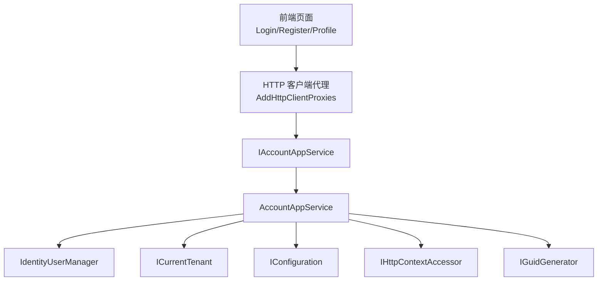
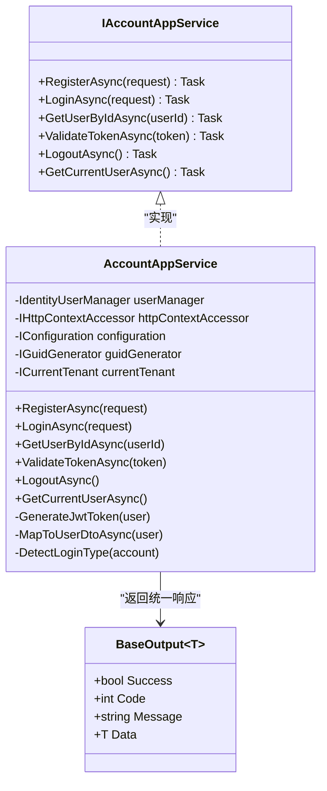
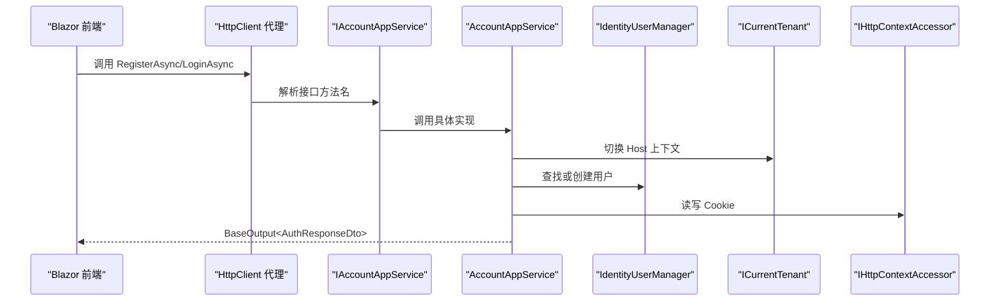
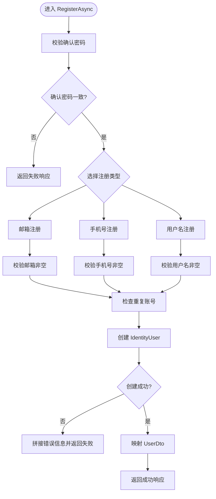
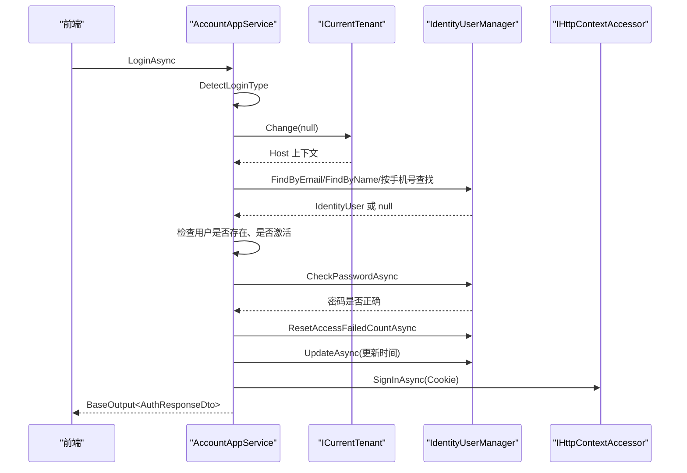
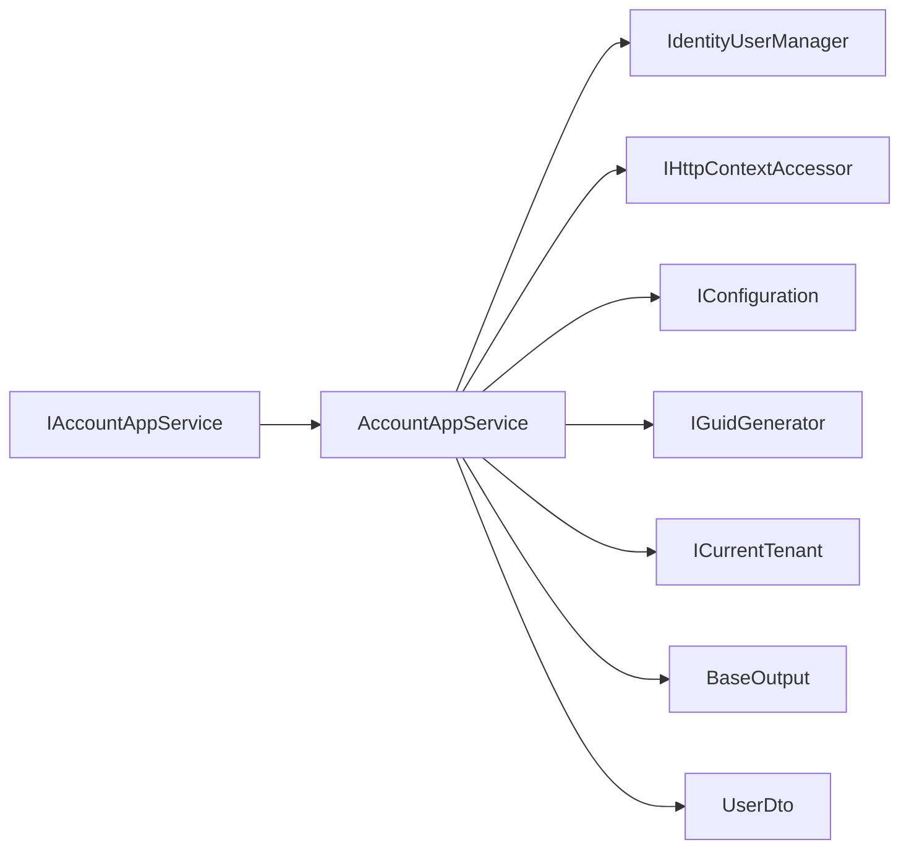
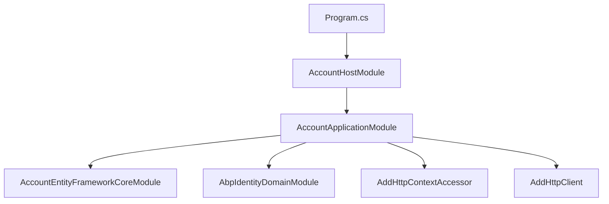

# 应用服务实现模式

<cite>
**本文引用的文件**   
- [AccountAppService.cs](file://src/Services/Account/H.Account.Application/Services/AccountAppService.cs)
- [IAccountAppService.cs](file://src/Services/Account/H.Account.Application.Contracts/Services/IAccountAppService.cs)
- [AccountApplicationModule.cs](file://src/Services/Account/H.Account.Application/AccountApplicationModule.cs)
- [BaseOutput.cs](file://src/Utils/H.Util.Base/BaseOutput.cs)
- [IAppService.cs](file://src/Utils/H.Abp.Application.Contracts/IAppService.cs)
- [AuditedEntityDto.cs](file://src/Utils/H.Abp.Application.Contracts/AuditedEntityDto.cs)
- [FullAuditedEntityDto.cs](file://src/Utils/H.Abp.Application.Contracts/FullAuditedEntityDto.cs)
- [ServiceCollectionExtensions.cs](file://src/Utils/H.Abp.HttpClientProxy/ServiceCollectionExtensions.cs)
- [Program.cs](file://src/Host/Account/H.Account.Host/Program.cs)
- [README.md](file://README.md)
</cite>

## 目录

1. [引言](#引言)
2. [项目结构](#项目结构)
3. [核心组件](#核心组件)
4. [架构总览](#架构总览)
5. [详细组件分析](#详细组件分析)
6. [依赖关系分析](#依赖关系分析)
7. [性能与缓存策略](#性能与缓存策略)
8. [故障排查指南](#故障排查指南)
9. [结论](#结论)
10. [附录：跨领域事务协调建议](#附录跨领域事务协调建议)

## 引言

本文件面向 H.AppLab 平台的应用服务实现模式，重点解释以 `AccountAppService` 为代表的业务应用服务在模块化 ABP 体系中的职责边界、依赖注入配置、构造函数注入模式、参数验证、领域服务调用、数据转换、认证流程、异常与返回值标准化，以及审计字段的设计。同时给出 HTTP 动态代理机制、WebAssembly 懒加载、跨租户上下文切换等关键工程实践，并提供可操作的优化与排错建议。

H.AppLab 采用模块化架构，支持单体部署和按服务独立部署；账户、组织、审批、通知、订单、供应链、后台任务等都属于“企业级应用”范畴，遵循 Application.Contracts / Application / EntityFrameworkCore / Web 分层约定。前端通过 `IAppService` 接口由 `H.Abp.HttpClientProxy` 生成 HTTP 客户端代理，使同一份接口在服务端进程内调用与远程 HTTP 调用之间透明切换。

**章节来源**
- [README.md:1-73](file://README.md#L1-L73)

## 项目结构

围绕应用服务实现，仓库中与本主题直接相关的结构如下：

- **服务层契约**：每个服务提供 `*.Application.Contracts` 程序集，定义 `I*AppService` 接口，继承自统一标记接口 `IAppService`。
- **服务层实现**：每个服务提供 `*.Application` 程序集，实现具体 `*AppService`，通常继承 ABP 的 `ApplicationService`。
- **基础设施工具**：
  - `H.Util.Base.BaseOutput<T>`：统一的响应包装模型。
  - `H.Abp.Application.Contracts.IAppService`：HTTP 代理扫描的基础接口。
  - `AuditedEntityDto` / `FullAuditedEntityDto`：带审计字段的 DTO 基类。
- **宿主与模块注册**：
  - `AccountApplicationModule`：账户应用模块，负责依赖 ABP Identity、EF Core 并注册 `HttpContextAccessor`、`HttpClient`。
  - `H.Account.Host.Program`：账户宿主入口，使用 Autofac、初始化应用模块、启用认证授权、反伪造令牌等。
- **HTTP 动态代理**：
  - `ServiceCollectionExtensions.AddHttpClientProxies`：扫描所有 `IAppService` 接口，批量注册基于 `DispatchProxy` 的 HTTP 客户端代理。

**图表来源**
- [ServiceCollectionExtensions.cs:18-63](file://src/Utils/H.Abp.HttpClientProxy/ServiceCollectionExtensions.cs#L18-L63)
- [IAccountAppService.cs:1-18](file://src/Services/Account/H.Account.Application.Contracts/Services/IAccountAppService.cs#L1-L18)
- [AccountAppService.cs:1-30](file://src/Services/Account/H.Account.Application/Services/AccountAppService.cs#L1-L30)

**章节来源**
- [README.md:1-73](file://README.md#L1-L73)
- [ServiceCollectionExtensions.cs:18-63](file://src/Utils/H.Abp.HttpClientProxy/ServiceCollectionExtensions.cs#L18-L63)
- [AccountApplicationModule.cs:1-22](file://src/Services/Account/H.Account.Application/AccountApplicationModule.cs#L1-L22)

## 核心组件

### `IAccountAppService`：账户应用服务契约

`IAccountAppService` 继承统一标记接口 `IAppService`，暴露以下能力：

| 方法 | 输入 | 输出语义 | 说明 |
|---|---|---|---|
| `RegisterAsync` | `RegisterRequestDto` | `BaseOutput<AuthResponseDto>` | 注册邮箱、手机号或用户名用户 |
| `LoginAsync` | `LoginRequestDto` | `BaseOutput<AuthResponseDto>` | 登录并设置 Cookie |
| `GetUserByIdAsync` | `Guid` | `BaseOutput<UserDto?>` | 根据用户标识获取用户信息 |
| `ValidateTokenAsync` | `string token` | `BaseOutput<bool>` | 校验 JWT 是否有效 |
| `LogoutAsync` | 无 | `BaseOutput` | 注销并清除 Cookie |
| `GetCurrentUserAsync` | 无 | `BaseOutput<UserDto?>` | 获取当前登录用户 |

该接口是前端和服务端共享的契约；服务端由 `AccountAppService` 实现，前端可通过 `H.Abp.HttpClientProxy` 自动获得 HTTP 代理实现。

**章节来源**
- [IAccountAppService.cs:1-18](file://src/Services/Account/H.Account.Application.Contracts/Services/IAccountAppService.cs#L1-L18)
- [IAppService.cs:1-8](file://src/Utils/H.Abp.Application.Contracts/IAppService.cs#L1-L8)

### `AccountAppService`：账户业务编排中心

`AccountAppService` 继承 ABP 的 `ApplicationService`，并通过构造函数注入以下依赖：

| 依赖 | 作用 |
|---|---|
| `IdentityUserManager` | 用户创建、密码校验、访问失败计数管理、用户更新 |
| `IHttpContextAccessor` | 读取当前 HTTP 上下文，用于 Cookie 认证和注销 |
| `IConfiguration` | 读取 JWT 密钥、签发者、受众、过期时间 |
| `IGuidGenerator` | 生成用户标识 |
| `ICurrentTenant` | 切换多租户上下文，确保全局账户数据在 Host 上下文中查询 |

该类承担的职责包括：

- 参数校验：密码一致性、必填字段检查、账号唯一性检查。
- 领域服务调用：通过 `IdentityUserManager` 完成用户生命周期操作。
- 数据转换：将 `IdentityUser` 映射为 `UserDto`。
- 认证流程：Cookie 登录、JWT 签发（私有方法）、JWT 校验、注销。
- 租户隔离：对全局账户数据显式切换到 Host 上下文。

**图表来源**
- [IAccountAppService.cs:1-18](file://src/Services/Account/H.Account.Application.Contracts/Services/IAccountAppService.cs#L1-L18)
- [AccountAppService.cs:1-357](file://src/Services/Account/H.Account.Application/Services/AccountAppService.cs#L1-L357)
- [BaseOutput.cs:1-52](file://src/Utils/H.Util.Base/BaseOutput.cs#L1-L52)

**章节来源**
- [AccountAppService.cs:1-357](file://src/Services/Account/H.Account.Application/Services/AccountAppService.cs#L1-L357)

### `BaseOutput<T>`：统一响应包装

`BaseOutput` 是所有应用服务的标准响应格式，包含：

| 字段 | 类型 | 含义 |
|---|---|---|
| `Success` | `bool` | 表示请求是否成功 |
| `Code` | `int` | 业务状态码，默认成功为 `0` |
| `Message` | `string?` | 人类可读的错误或提示消息 |
| `Data` | `T?` | 泛型业务数据 |

典型用法：

- 成功时构造 `new BaseOutput<T>(data)`，自动设置 `Success = true`、`Code = 0`。
- 失败时构造 `new BaseOutput(code, message)` 或直接构造普通 `BaseOutput` 并设置 `Success = false`。
- 前端解包时从 `data` 字段取业务数据，从 `success`、`code`、`message` 判断结果。

该设计避免 Controller 或应用服务直接抛出 HTTP 错误作为业务失败路径，也便于跨语言、跨端统一处理响应。

**章节来源**
- [BaseOutput.cs:1-52](file://src/Utils/H.Util.Base/BaseOutput.cs#L1-L52)

### 审计 DTO 基类

`AuditedEntityDto<TKey>` 提供基础审计字段：

| 字段 | 类型 | 含义 |
|---|---|---|
| `CreationTime` | `DateTime` | 创建时间 |
| `CreatorId` | `Guid?` | 创建者标识 |
| `LastModificationTime` | `DateTime?` | 最后修改时间 |
| `LastModifierId` | `Guid?` | 最后修改者标识 |

`FullAuditedEntityDto<TKey>` 在此基础上增加软删除相关字段：

| 字段 | 类型 | 含义 |
|---|---|---|
| `IsDeleted` | `bool` | 是否已删除 |
| `DeletionTime` | `DateTime?` | 删除时间 |
| `DleterId` | `Guid?` | 删除者标识 |

这些基类用于 DTO 侧表达实体审计信息；实际实体层的审计字段填充通常由 EF Core 拦截器或领域对象逻辑完成，DTO 本身不保存持久化状态。

**章节来源**
- [AuditedEntityDto.cs:1-9](file://src/Utils/H.Abp.Application.Contracts/AuditedEntityDto.cs#L1-L9)
- [FullAuditedEntityDto.cs:1-11](file://src/Utils/H.Abp.Application.Contracts/FullAuditedEntityDto.cs#L1-L11)

## 架构总览

H.AppLab 的应用服务层整体遵循“契约在前、实现在后、HTTP 代理桥接”的模式：

**图表来源**
- [ServiceCollectionExtensions.cs:18-63](file://src/Utils/H.Abp.HttpClientProxy/ServiceCollectionExtensions.cs#L18-L63)
- [AccountAppService.cs:1-357](file://src/Services/Account/H.Account.Application/Services/AccountAppService.cs#L1-L357)
- [IAccountAppService.cs:1-18](file://src/Services/Account/H.Account.Application.Contracts/Services/IAccountAppService.cs#L1-L18)

**章节来源**
- [README.md:1-73](file://README.md#L1-L73)
- [ServiceCollectionExtensions.cs:18-63](file://src/Utils/H.Abp.HttpClientProxy/ServiceCollectionExtensions.cs#L18-L63)

## 详细组件分析

### 依赖注入与模块配置

#### `AccountApplicationModule`

该模块声明依赖：

- `AccountEntityFrameworkCoreModule`：账户数据库上下文、仓储等 EF Core 基础设施。
- `AbpIdentityDomainModule`：ABP Identity 领域模块，提供 `IdentityUserManager` 等身份管理能力。

在 `ConfigureServices` 中：

- 注册 `HttpContextAccessor`，供应用服务访问当前 HTTP 上下文。
- 注册 `HttpClient`，供外部登录等服务使用。

这体现了 ABP 模块化 DI 的典型方式：模块通过 `[DependsOn]` 声明依赖，再通过 `ConfigureServices` 扩展服务容器。

**章节来源**
- [AccountApplicationModule.cs:1-22](file://src/Services/Account/H.Account.Application/AccountApplicationModule.cs#L1-L22)

#### 宿主入口 `Program.cs`

账户宿主的 `Program.cs` 完成以下工作：

- 使用 Autofac 作为 DI 容器。
- 异步添加应用模块。
- 初始化应用。
- 开发环境启用 WebAssembly 调试。
- 生产环境启用异常处理、HSTS、状态页、HTTPS 重定向。
- 启用认证、授权、反伪造令牌。
- 映射 Razor 组件，支持交互式 WebAssembly 渲染。

这表明应用服务运行在 ASP.NET Core 管道之后，认证授权管线会先于控制器和 Razor 组件执行。

**章节来源**
- [Program.cs:1-48](file://src/Host/Account/H.Account.Host/Program.cs#L1-L48)

### 构造函数注入模式

`AccountAppService` 使用构造函数注入，而不是属性注入或静态依赖。其优势包括：

- 依赖明确：构造函数参数即服务契约。
- 易于测试：可在单元测试中传入模拟依赖。
- 符合 ABP 最佳实践：`ApplicationService` 天然支持基于构造函数的依赖解析。

需要注意：

- 不要引入过宽的服务，例如整个 `IServiceProvider`。
- 避免在构造函数中进行耗时操作，如数据库查询、网络调用。
- 若需要当前请求上下文，应使用 `IHttpContextAccessor`，而不是在方法体内创建新的上下文。

**章节来源**
- [AccountAppService.cs:1-30](file://src/Services/Account/H.Account.Application/Services/AccountAppService.cs#L1-L30)

### 业务编排流程：注册

注册流程的核心步骤如下：

**图表来源**
- [AccountAppService.cs:31-110](file://src/Services/Account/H.Account.Application/Services/AccountAppService.cs#L31-L110)

关键点：

- 注册类型分为邮箱、手机号、用户名三种。
- 邮箱注册通过 `FindByEmailAsync` 查重。
- 手机号注册遍历用户列表并按手机号匹配，存在全表扫描风险。
- 用户名注册通过 `FindByNameAsync` 查重。
- 最终调用 `CreateAsync`，并将 `IdentityUserManager.CreateAsync` 的错误集合拼接成消息。

**章节来源**
- [AccountAppService.cs:31-110](file://src/Services/Account/H.Account.Application/Services/AccountAppService.cs#L31-L110)

### 业务编排流程：登录

登录流程涉及多租户上下文切换、用户查找、活跃状态检查、密码校验、访问失败计数、最后登录时间更新、Cookie 登录和 JWT 生成。

**图表来源**
- [AccountAppService.cs:112-200](file://src/Services/Account/H.Account.Application/Services/AccountAppService.cs#L112-L200)
- [AccountAppService.cs:201-357](file://src/Services/Account/H.Account.Application/Services/AccountAppService.cs#L201-L357)

关键点：

- 登录时使用 `_currentTenant.Change(null)` 切换到 Host 上下文，因为账户是全局跨租户数据。
- 登录失败时可能调用 `AccessFailedAsync` 累计失败次数。
- 成功登录后重置失败次数，并更新最后登录时间。
- Cookie 持久化时间根据“记住我”选项设置为 7 天或 24 小时。
- JWT 签发逻辑位于私有方法 `GenerateJwtToken`，但当前公开登录接口返回的是 Cookie 认证结果，未直接返回 Token。

**章节来源**
- [AccountAppService.cs:112-200](file://src/Services/Account/H.Account.Application/Services/AccountAppService.cs#L112-L200)
- [AccountAppService.cs:201-357](file://src/Services/Account/H.Account.Application/Services/AccountAppService.cs#L201-L357)

### 业务编排流程：获取当前用户

`GetCurrentUserAsync` 的流程：

1. 从 `IHttpContextAccessor.HttpContext` 读取当前用户。
2. 从 Claims 中提取 `NameIdentifier`，即用户标识。
3. 解析为 `Guid`。
4. 切换到 Host 上下文。
5. 通过 `IdentityUserManager.FindByIdAsync` 查询用户。
6. 映射为 `UserDto` 并返回。

这个流程强调两个重要点：

- 前端会话基于 Cookie 或 Token，而用户数据必须通过身份管理器查询。
- 即使 Cookie 中包含租户信息，查询全局账户时仍需切回 Host 上下文，否则可能被租户过滤条件隐藏。

**章节来源**
- [AccountAppService.cs:236-266](file://src/Services/Account/H.Account.Application/Services/AccountAppService.cs#L236-L266)

### 数据转换：`MapToUserDtoAsync`

`MapToUserDtoAsync` 将 `IdentityUser` 转换为 `UserDto`，映射字段包括：

| IdentityUser 字段 | UserDto 字段 | 转换规则 |
|---|---|---|
| `Id` | `Id` | 直接复制 |
| `UserName` | `UserName` | 空值兜底为空字符串 |
| `Email` | `Email` | 空值兜底为空字符串 |
| `PhoneNumber` | `PhoneNumber` | 空值兜底为空字符串 |
| `LockoutEnabled` / `LockoutEnd` | `IsActive` | 判断是否锁定 |
| `EmailConfirmed` | `EmailConfirmed` | 直接复制 |
| `PhoneNumberConfirmed` | `PhoneNumberConfirmed` | 直接复制 |
| `LockoutEnd` | `LockoutEnd` | 转为 DateTime |
| `AccessFailedCount` | `AccessFailedCount` | 直接复制 |
| `CreationTime` | `CreatedAt` | 直接复制 |
| `LastModificationTime` | `UpdatedAt` / `LastLoginAt` | 复用最后登录时间 |

这种转换属于应用层表现模型映射，不应把领域实体直接暴露给前端。

**章节来源**
- [AccountAppService.cs:318-340](file://src/Services/Account/H.Account.Application/Services/AccountAppService.cs#L318-L340)

### 异常处理策略

在当前 `AccountAppService` 中，异常处理主要体现为：

1. **业务失败走正常返回**：注册失败、密码不一致、账号重复、用户不存在、用户被禁用、密码错误等，都通过 `BaseOutput` 返回 `Success = false`。
2. **JWT 校验异常吞掉**：`ValidateTokenAsync` 使用 try-catch，校验失败返回 `false`，不向外抛出异常。
3. **未看到全局异常处理器**：代码中没有自定义全局异常过滤器或统一异常转换器。
4. **ASP.NET Core 管道异常处理**：宿主 `Program.cs` 在非开发环境启用 `UseExceptionHandler`，这会捕获未处理异常，但不会自动转换为 `BaseOutput`。

因此，当前策略可以概括为：

- 已知业务失败：用 `BaseOutput` 表达。
- 未知系统异常：交给 ASP.NET Core 默认异常处理。
- 尚未实现统一的 API 异常到 `BaseOutput` 的全局映射。

这意味着如果下游 EF Core、外部 HTTP 或第三方库抛出未捕获异常，前端可能收到 HTML 错误页或默认 JSON 错误，而不是统一的 `BaseOutput`。

**章节来源**
- [AccountAppService.cs:112-199](file://src/Services/Account/H.Account.Application/Services/AccountAppService.cs#L112-L199)
- [AccountAppService.cs:217-235](file://src/Services/Account/H.Account.Application/Services/AccountAppService.cs#L217-L235)
- [Program.cs:17-48](file://src/Host/Account/H.Account.Host/Program.cs#L17-L48)

### 审计日志记录机制

在当前 `AccountAppService` 中：

- **没有写入 `IAuditLog` 或自定义审计表**。
- **没有调用 `OperationLog`、`AccessLog` 等日志服务**。
- **没有显式记录登录成功、注册成功等操作日志**。
- **用户实体的审计字段**：`CreatedAt`、`UpdatedAt`、`LastLoginAt` 来源于 `IdentityUser` 的时间字段，并在登录时更新最后登录时间。
- **DTO 层有审计基类**：`AuditedEntityDto` 和 `FullAuditedEntityDto` 可用于其他实体的 DTO 设计，但 `UserDto` 并未继承它们。

因此，当前审计机制更接近“实体时间戳”，而非完整的“操作审计日志”。如果需要完整审计，应补充：

- 操作日志：注册、登录、注销、密码修改等。
- 访问日志：接口调用、IP、UA、耗时。
- 审计字段自动填充：通过 ABP 的 `IAuditedEntity`、`IHasCreationTime`、`IHasModificationTime`、`IFullAuditedEntity` 配合 EF Core 拦截器或领域事件实现。

**章节来源**
- [AccountAppService.cs:160-199](file://src/Services/Account/H.Account.Application/Services/AccountAppService.cs#L160-L199)
- [AccountAppService.cs:318-340](file://src/Services/Account/H.Account.Application/Services/AccountAppService.cs#L318-L340)
- [AuditedEntityDto.cs:1-9](file://src/Utils/H.Abp.Application.Contracts/AuditedEntityDto.cs#L1-L9)
- [FullAuditedEntityDto.cs:1-11](file://src/Utils/H.Abp.Application.Contracts/FullAuditedEntityDto.cs#L1-L11)

### 跨领域事务协调

当前 `AccountAppService` 内部只调用 `IdentityUserManager`，不涉及多个聚合根之间的复杂事务协调。它也没有显式使用 `IDbContextTransaction` 或 ABP 的事务装饰器。

如果需要跨领域事务，推荐做法：

- 在应用服务方法上通过 ABP 事务特性或手动开启事务。
- 将跨聚合的变更封装在一个应用服务方法中，由该方法保证一致性。
- 对于分布式场景，考虑使用 Saga、补偿事务或可靠消息队列。

当前代码更偏向单聚合事务，由 `IdentityUserManager` 内部管理用户持久化。

**章节来源**
- [AccountAppService.cs:31-199](file://src/Services/Account/H.Account.Application/Services/AccountAppService.cs#L31-L199)

### HTTP 动态代理与前端集成

`H.Abp.HttpClientProxy` 提供两个关键扩展：

1. `AddRemoteServices(configuration)`：从配置节 `RemoteServices` 读取远程服务基础地址。
2. `AddHttpClientProxies(assembly, remoteServiceName)`：扫描指定程序集中所有继承 `IAppService` 的接口，并注册代理实现。

代理实现通过反射调用 `HttpClientProxyInterceptor<T>.Create`，由拦截器根据 ABP URL 约定将接口方法名转换为 HTTP 请求。

这使得前端只需引用 `IAccountAppService`，无需手写 `HttpClient` 调用。

**章节来源**
- [ServiceCollectionExtensions.cs:18-63](file://src/Utils/H.Abp.HttpClientProxy/ServiceCollectionExtensions.cs#L18-L63)
- [README.md:20-73](file://README.md#L20-L73)

## 依赖关系分析

### 应用服务依赖图

**图表来源**
- [IAccountAppService.cs:1-18](file://src/Services/Account/H.Account.Application.Contracts/Services/IAccountAppService.cs#L1-L18)
- [AccountAppService.cs:1-357](file://src/Services/Account/H.Account.Application/Services/AccountAppService.cs#L1-L357)
- [BaseOutput.cs:1-52](file://src/Utils/H.Util.Base/BaseOutput.cs#L1-L52)

### 模块与服务注册依赖

**图表来源**
- [Program.cs:1-48](file://src/Host/Account/H.Account.Host/Program.cs#L1-L48)
- [AccountApplicationModule.cs:1-22](file://src/Services/Account/H.Account.Application/AccountApplicationModule.cs#L1-L22)

**章节来源**
- [Program.cs:1-48](file://src/Host/Account/H.Account.Host/Program.cs#L1-L48)
- [AccountApplicationModule.cs:1-22](file://src/Services/Account/H.Account.Application/AccountApplicationModule.cs#L1-L22)

## 性能与缓存策略

### 当前性能关注点

1. **手机号注册查重**：当前实现遍历所有用户后再匹配手机号，时间复杂度接近 O(n)，在高用户量下可能成为瓶颈。
2. **手机号登录查重**：同样存在全表扫描问题。
3. **JWT 密钥默认值**：当配置缺失时回退到硬编码默认值，不适合生产环境。
4. **未使用内存缓存**：当前没有对热点用户信息做缓存。
5. **未分页查询用户列表**：用于手机号查重的用户列表是一次性加载。

### 优化建议

| 问题 | 建议 |
|---|---|
| 手机号查重慢 | 使用索引字段查询，或通过 `Where` 条件过滤后查找，避免 `ToList()` 全量加载。 |
| 登录频繁查询用户 | 可对常用用户信息加短期本地缓存，注意失效策略和并发安全。 |
| JWT 配置不安全 | 强制要求配置中存在密钥，禁止生产环境回退到默认值。 |
| 未缓存热点用户 | 对 `GetCurrentUserAsync` 的结果加短 TTL 缓存，结合租户上下文区分缓存键。 |
| 未统计接口耗时 | 通过中间件或 ABP 内置指标收集接口耗时、错误率。 |

### 缓存策略建议

- **读多写少数据**：用户基本信息、配置项可加入 Redis 或内存缓存。
- **缓存键设计**：包含租户、用户标识、版本或更新时间戳，避免脏读。
- **缓存失效**：用户注册、登录失败计数、密码变更后主动失效。
- **降级策略**：缓存不可用时直接回源数据库，不阻断主流程。

[本节为通用性能建议，不直接分析具体代码行]

## 故障排查指南

### 常见问题

| 现象 | 可能原因 | 排查方向 |
|---|---|---|
| 注册成功但前端仍显示失败 | 前端未正确解包 `BaseOutput.Data` | 检查前端对 `success`、`data` 的处理逻辑 |
| 登录成功但无法获取当前用户 | Cookie 未携带或 Claims 缺失 | 检查浏览器 Cookie、`IHttpContextAccessor` 取值 |
| 当前用户为空 | 租户上下文未切换或用户被租户过滤隐藏 | 检查 `_currentTenant.Change(null)` |
| JWT 校验失败 | 密钥、签发者、受众、过期时间配置不一致 | 检查配置文件和 `ValidateTokenAsync` 参数 |
| 登录失败多次后被锁定 | 访问失败计数累积 | 检查 `AccessFailedAsync`、`ResetAccessFailedCountAsync` |
| 手机号注册或登录很慢 | 全表扫描用户列表 | 检查 `Users.ToListAsync()` 的使用方式 |

### 调试建议

1. 在 `RegisterAsync`、`LoginAsync`、`GetCurrentUserAsync` 的关键分支添加结构化日志。
2. 打印用户查找结果、密码校验结果、Claims 内容，但注意脱敏敏感信息。
3. 使用浏览器开发者工具查看 Cookie、请求头、响应体结构。
4. 确认 `BaseOutput` 的 `Success`、`Code`、`Message`、`Data` 是否与前端预期一致。
5. 若出现 HTML 错误页，优先检查 `Program.cs` 中的异常处理和管道顺序。

**章节来源**
- [AccountAppService.cs:31-199](file://src/Services/Account/H.Account.Application/Services/AccountAppService.cs#L31-L199)
- [AccountAppService.cs:217-266](file://src/Services/Account/H.Account.Application/Services/AccountAppService.cs#L217-L266)
- [Program.cs:17-48](file://src/Host/Account/H.Account.Host/Program.cs#L17-L48)

## 结论

H.AppLab 的 `AccountAppService` 展示了典型的 ABP 应用服务模式：

- 接口定义在 `Application.Contracts`，实现在 `Application`。
- 通过构造函数注入领域服务和基础设施依赖。
- 使用 `BaseOutput<T>` 统一响应格式。
- 通过 `ICurrentTenant` 显式处理多租户上下文。
- 通过 `IdentityUserManager` 委托用户管理逻辑。
- 通过 `H.Abp.HttpClientProxy` 实现前后端共享的 `IAppService` 契约。

当前实现的优点在于清晰、直接、可理解；改进空间主要集中在：

- 手机号查询性能优化。
- 统一全局异常处理到 `BaseOutput`。
- 完善审计日志和操作审计。
- 加强配置安全和生产可用性。
- 对热点数据引入合理的缓存策略。

这些改进可以在不破坏现有契约的前提下逐步演进，保持应用服务作为“业务编排中心”的职责不变。

[本节为总结性内容，不直接分析具体代码行]

## 附录：跨领域事务协调建议

虽然当前 `AccountAppService` 不涉及跨聚合事务，但在 H.AppLab 的其他业务场景中，常见协调模式包括：

- **单服务内多仓储事务**：在应用服务方法中统一管理 DbContext 事务。
- **跨服务调用**：通过 HTTP 代理或消息队列协调，必要时引入补偿逻辑。
- **最终一致性**：优先接受短暂不一致，通过事件、重试、对账修复数据。
- **幂等设计**：对外部调用、消息消费、重试路径进行幂等控制。

建议在新增跨领域操作时：

1. 明确事务边界。
2. 最小化事务范围。
3. 避免在事务中调用耗时外部服务。
4. 记录关键业务事件，便于审计和排查。
5. 为失败路径设计重试和补偿。

[本节为概念性指导，不直接分析具体代码行]