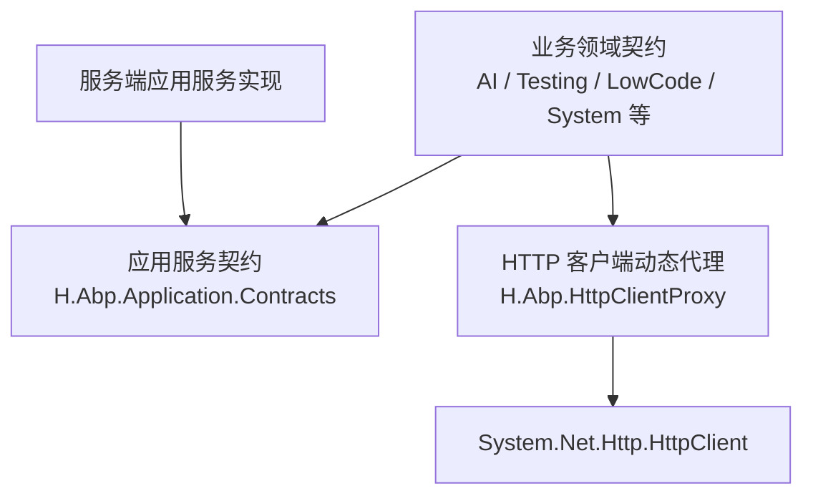
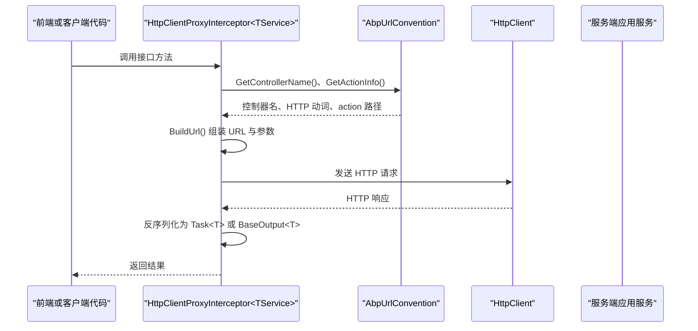
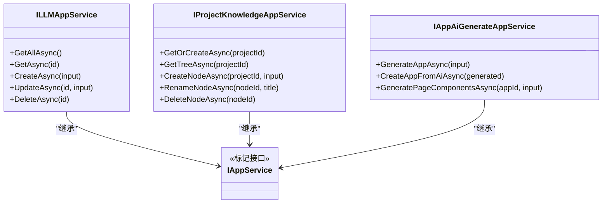
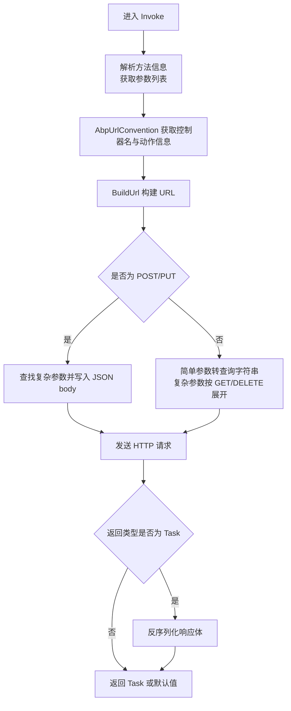
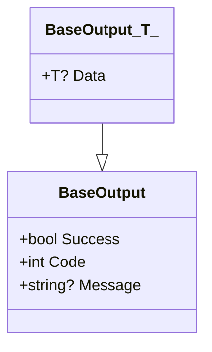
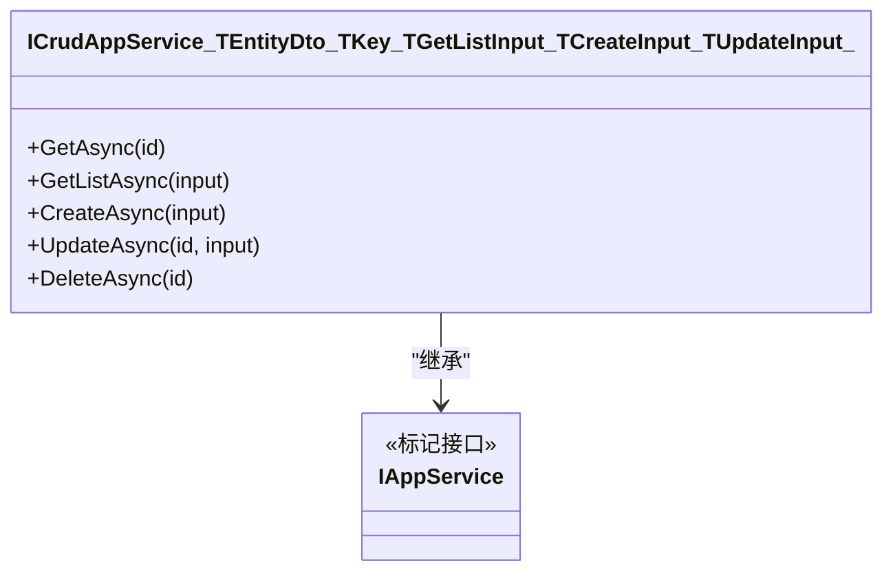
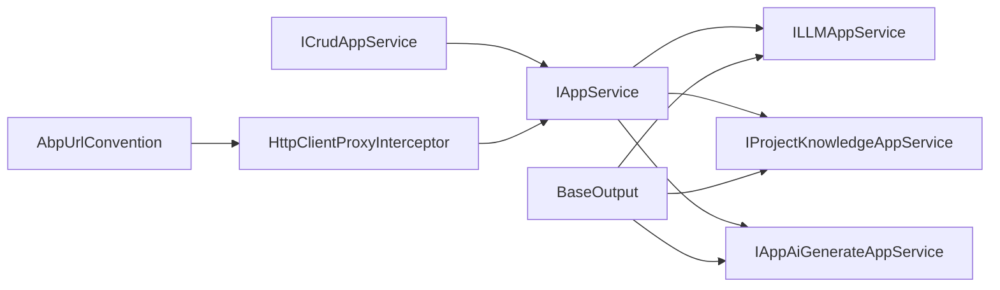

# 应用服务接口规范

<cite>
**本文引用的文件**   
- [IAppService.cs](file://src/Utils/H.Abp.Application.Contracts/IAppService.cs)
- [ICrudAppService.cs](file://src/Utils/H.Abp.Application.Contracts/ICrudAppService.cs)
- [BaseOutput.cs](file://src/Utils/H.Util.Base/BaseOutput.cs)
- [HttpClientProxyInterceptor.cs](file://src/Utils/H.Abp.HttpClientProxy/HttpClientProxyInterceptor.cs)
- [AbpUrlConvention.cs](file://src/Utils/H.Abp.HttpClientProxy/AbpUrlConvention.cs)
- [PagedResultRequestDto.cs](file://src/Utils/H.Abp.Application.Contracts/PagedResultRequestDto.cs)
- [PagedAndSortedResultRequestDto.cs](file://src/Utils/H.Abp.Application.Contracts/PagedAndSortedResultRequestDto.cs)
- [PagedResultDto.cs](file://src/Utils/H.Abp.Application.Contracts/PagedResultDto.cs)
- [EntityDto.cs](file://src/Utils/H.Abp.Application.Contracts/EntityDto.cs)
- [ILLMAppService.cs](file://src/Services/AI/H.AI.Application.Contracts/Services/Llms/ILLMAppService.cs)
- [IProjectKnowledgeAppService.cs](file://src/Services/Testing/H.Testing.Application.Contracts/Services/Knowledge/IProjectKnowledgeAppService.cs)
- [IAppAiGenerateAppService.cs](file://src/LowCode/DesignEngine/H.LowCode.DesignEngine.Application.Contracts/AppServices/IAppAiGenerateAppService.cs)
</cite>

## 目录
1. [引言](#引言)
2. [项目结构定位](#项目结构定位)
3. [核心组件总览](#核心组件总览)
4. [架构总览](#架构总览)
5. [详细组件分析](#详细组件分析)
6. [依赖关系分析](#依赖关系分析)
7. [性能与运行时特性](#性能与运行时特性)
8. [接口契约与最佳实践](#接口契约与最佳实践)
9. [版本管理与向后兼容](#版本管理与向后兼容)
10. [故障排查指南](#故障排查指南)
11. [结论](#结论)

## 引言
本文件面向 H.AppLab 平台的应用服务接口规范，重点说明以下目标：
- IAppService 标记接口的设计意图及其在 HTTP 动态代理中的作用。
- 如何通过该接口实现前后端契约定义。
- IAccountAppService、ILLMAppService、IProjectKnowledgeAppService 等具体应用服务接口的命名约定与方法签名规范。
- BaseOutput<T> 响应包装器的成功、错误与状态码映射规则。
- 请求 DTO、响应 DTO、查询 DTO 的职责分离设计。
- 接口版本管理策略和向后兼容性考虑。
- 结合仓库中的实际接口示例给出可操作的规范与最佳实践。

## 项目结构定位
H.AppLab 平台将“应用服务契约”与“HTTP 客户端动态代理”解耦为两个关键部分：
- 契约层位于 Utils 下的 H.Abp.Application.Contracts，提供 IAppService、ICrudAppService 以及分页、实体 DTO 基类。
- 客户端代理位于 Utils 下的 H.Abp.HttpClientProxy，通过 DispatchProxy 拦截接口方法调用，按 ABP 风格生成 URL、序列化参数并反序列化响应。
- 业务服务契约分布在 Services、LowCode、System 等子域中，均继承 IAppService 并以 BaseOutput<T> 作为统一返回类型。

**图表来源**
- [IAppService.cs:1-8](file://src/Utils/H.Abp.Application.Contracts/IAppService.cs#L1-L8)
- [ICrudAppService.cs:1-15](file://src/Utils/H.Abp.Application.Contracts/ICrudAppService.cs#L1-L15)
- [HttpClientProxyInterceptor.cs:1-234](file://src/Utils/H.Abp.HttpClientProxy/HttpClientProxyInterceptor.cs#L1-L234)
- [AbpUrlConvention.cs:1-86](file://src/Utils/H.Abp.HttpClientProxy/AbpUrlConvention.cs#L1-L86)

**章节来源**
- [IAppService.cs:1-8](file://src/Utils/H.Abp.Application.Contracts/IAppService.cs#L1-L8)
- [ICrudAppService.cs:1-15](file://src/Utils/H.Abp.Application.Contracts/ICrudAppService.cs#L1-L15)
- [HttpClientProxyInterceptor.cs:1-234](file://src/Utils/H.Abp.HttpClientProxy/HttpClientProxyInterceptor.cs#L1-L234)
- [AbpUrlConvention.cs:1-86](file://src/Utils/H.Abp.HttpClientProxy/AbpUrlConvention.cs#L1-L86)

## 核心组件总览
| 组件 | 职责 | 关键行为 |
|---|---|---|
| IAppService | 标记可通过 HTTP 动态代理远程调用的应用服务接口 | 空标记接口，用于识别可代理的服务契约 |
| ICrudAppService<TEntityDto, TKey, TGetListInput, TCreateInput, TUpdateInput> | 通用 CRUD 应用服务契约 | GetAsync、GetListAsync、CreateAsync、UpdateAsync、DeleteAsync |
| BaseOutput / BaseOutput<T> | 统一响应包装器 | Success、Code、Message、Data；默认成功 Code=0 |
| AbpUrlConvention | ABP URL 约定工具 | 接口名转控制器名、方法名前缀映射 HTTP 动词与 action |
| HttpClientProxyInterceptor<TService> | DispatchProxy 拦截器 | 构造 URL、序列化复杂参数、反序列化响应 |
| PagedResultRequestDto / PagedAndSortedResultRequestDto | 分页查询输入 | SkipCount、MaxResultCount、Sorting |
| PagedResultDto<T> | 分页结果输出 | TotalCount、Items |
| EntityDto<TKey> | 实体基 DTO | Id 字段 |

**章节来源**
- [IAppService.cs:1-8](file://src/Utils/H.Abp.Application.Contracts/IAppService.cs#L1-L8)
- [ICrudAppService.cs:1-15](file://src/Utils/H.Abp.Application.Contracts/ICrudAppService.cs#L1-L15)
- [BaseOutput.cs:1-52](file://src/Utils/H.Util.Base/BaseOutput.cs#L1-L52)
- [AbpUrlConvention.cs:1-86](file://src/Utils/H.Abp.HttpClientProxy/AbpUrlConvention.cs#L1-L86)
- [HttpClientProxyInterceptor.cs:1-234](file://src/Utils/H.Abp.HttpClientProxy/HttpClientProxyInterceptor.cs#L1-L234)
- [PagedResultRequestDto.cs:1-11](file://src/Utils/H.Abp.Application.Contracts/PagedResultRequestDto.cs#L1-L11)
- [PagedAndSortedResultRequestDto.cs:1-9](file://src/Utils/H.Abp.Application.Contracts/PagedAndSortedResultRequestDto.cs#L1-L9)
- [PagedResultDto.cs:1-19](file://src/Utils/H.Abp.Application.Contracts/PagedResultDto.cs#L1-L19)
- [EntityDto.cs:1-6](file://src/Utils/H.Abp.Application.Contracts/EntityDto.cs#L1-L6)

## 架构总览
IAppService 是前端生成的 HTTP 客户端与服务端应用服务之间的契约锚点。客户端通过 HttpClientProxyInterceptor 对 IAppService 实现类进行拦截，将其方法调用转换为 HTTP 请求；服务端则使用传统 ASP.NET Core 或 ABP 风格的应用服务暴露这些 API。

**图表来源**
- [HttpClientProxyInterceptor.cs:1-234](file://src/Utils/H.Abp.HttpClientProxy/HttpClientProxyInterceptor.cs#L1-L234)
- [AbpUrlConvention.cs:1-86](file://src/Utils/H.Abp.HttpClientProxy/AbpUrlConvention.cs#L1-L86)

**章节来源**
- [HttpClientProxyInterceptor.cs:1-234](file://src/Utils/H.Abp.HttpClientProxy/HttpClientProxyInterceptor.cs#L1-L234)
- [AbpUrlConvention.cs:1-86](file://src/Utils/H.Abp.HttpClientProxy/AbpUrlConvention.cs#L1-L86)

## 详细组件分析

### IAppService 标记接口
IAppService 是一个空标记接口，其设计意图是标识“可通过 HTTP 动态代理远程调用的服务接口”。它不定义任何成员，因此不会限制具体业务方法的形态，只作为契约层与代理层的共同识别边界。

设计要点：
- 所有需要被 HttpClientProxyInterceptor 代理的接口都应继承 IAppService。
- 标记接口本身不参与 URL 路由，真正路由由 AbpUrlConvention 根据接口名和方法名推导。
- 该设计使契约层保持轻量，避免在服务端与客户端之间引入不必要的抽象耦合。

**图表来源**
- [IAppService.cs:1-8](file://src/Utils/H.Abp.Application.Contracts/IAppService.cs#L1-L8)
- [ILLMAppService.cs:1-65](file://src/Services/AI/H.AI.Application.Contracts/Services/Llms/ILLMAppService.cs#L1-L65)
- [IProjectKnowledgeAppService.cs:1-71](file://src/Services/Testing/H.Testing.Application.Contracts/Services/Knowledge/IProjectKnowledgeAppService.cs#L1-L71)
- [IAppAiGenerateAppService.cs:1-42](file://src/LowCode/DesignEngine/H.LowCode.DesignEngine.Application.Contracts/AppServices/IAppAiGenerateAppService.cs#L1-L42)

**章节来源**
- [IAppService.cs:1-8](file://src/Utils/H.Abp.Application.Contracts/IAppService.cs#L1-L8)
- [ILLMAppService.cs:1-65](file://src/Services/AI/H.AI.Application.Contracts/Services/Llms/ILLMAppService.cs#L1-L65)
- [IProjectKnowledgeAppService.cs:1-71](file://src/Services/Testing/H.Testing.Application.Contracts/Services/Knowledge/IProjectKnowledgeAppService.cs#L1-L71)
- [IAppAiGenerateAppService.cs:1-42](file://src/LowCode/DesignEngine/H.LowCode.DesignEngine.Application.Contracts/AppServices/IAppAiGenerateAppService.cs#L1-L42)

### HTTP 动态代理机制
HttpClientProxyInterceptor 基于 DispatchProxy 拦截接口方法调用，完成以下关键步骤：
1. 通过 AbpUrlConvention.GetControllerName 将接口名转为 kebab-case 控制器名。
2. 通过 AbpUrlConvention.GetActionInfo 解析方法前缀，得到 HTTP 动词与 action 路径。
3. 通过 BuildUrl 组装完整 URL：
   - 名为 id 的简单类型参数作为路径段插入到 action 之前。
   - 恰好一个以 Id 结尾的非 id 参数作为第二个路径段插入到 action 之后。
   - 其余简单参数放入查询字符串。
   - GET/DELETE 的复杂参数展开为属性查询参数。
   - POST/PUT 的复杂参数放入 JSON body。
4. 对返回值进行反序列化：
   - 支持 Task 与 Task<T>。
   - NoContent 响应返回默认值。
   - 空响应体按类型返回默认值或空字符串。
   - text/* 响应直接返回文本内容。
   - 其他响应按 JSON 反序列化为 T。

**图表来源**
- [HttpClientProxyInterceptor.cs:1-234](file://src/Utils/H.Abp.HttpClientProxy/HttpClientProxyInterceptor.cs#L1-L234)
- [AbpUrlConvention.cs:1-86](file://src/Utils/H.Abp.HttpClientProxy/AbpUrlConvention.cs#L1-L86)

**章节来源**
- [HttpClientProxyInterceptor.cs:1-234](file://src/Utils/H.Abp.HttpClientProxy/HttpClientProxyInterceptor.cs#L1-L234)
- [AbpUrlConvention.cs:1-86](file://src/Utils/H.Abp.HttpClientProxy/AbpUrlConvention.cs#L1-L86)

### ABP URL 约定
AbpUrlConvention 负责将 C# 接口与方法名映射为 ABP 风格的 REST URL。

关键点：
- 控制器名：去掉 I 前缀，去掉 AppService 或 ApplicationService 后缀，再转为 kebab-case。
- 动作前缀：GetList、GetAll、Get、Put、Update、Delete、Remove、Create、Add、Insert、Post、Patch。
- 未匹配前缀的方法默认为 POST，并使用完整方法名作为 action。
- ToKebabCase 先转 camelCase，再在小写字母/数字与大写字母之间插入连字符，保证与 ABP 服务端一致。

典型映射示例：
- ILLMAppService → llm
- GetAllAsync → GET /llm/get-all
- CreateAsync → POST /llm/create
- UpdateAsync(Guid id, ...) → PUT /llm/update/{id}

**章节来源**
- [AbpUrlConvention.cs:1-86](file://src/Utils/H.Abp.HttpClientProxy/AbpUrlConvention.cs#L1-L86)

### BaseOutput<T> 响应包装器
BaseOutput 是统一的非泛型响应包装器，BaseOutput<T> 在其基础上增加 Data 字段。

语义规则：
- Success 表示业务是否成功。
- Code 表示业务状态码，默认成功时 Code=0。
- Message 用于传递错误消息或提示。
- Data 承载业务数据，可为 null。

构造模式：
- 默认构造函数设置 Success=true。
- 带 message 的构造函数设置 Success=false、Code=1。
- 带 code 和 message 的构造函数按 code==0 决定 Success。
- BaseOutput<T> 的 data 构造函数设置 Data=data、Success=true、Code=0。

**图表来源**
- [BaseOutput.cs:1-52](file://src/Utils/H.Util.Base/BaseOutput.cs#L1-L52)

**章节来源**
- [BaseOutput.cs:1-52](file://src/Utils/H.Util.Base/BaseOutput.cs#L1-L52)

### ICrudAppService 通用 CRUD 契约
ICrudAppService<TEntityDto, TKey, TGetListInput, TCreateInput, TUpdateInput> 继承 IAppService，并提供标准 CRUD 方法：
- GetAsync(TKey id)
- GetListAsync(TGetListInput input)
- CreateAsync(TCreateInput input)
- UpdateAsync(TKey id, TUpdateInput input)
- DeleteAsync(TKey id)

该方法族与 ABP 的 ICrudAppService 保持相同签名，便于团队在不同业务域复用统一的数据访问模式。

**图表来源**
- [ICrudAppService.cs:1-15](file://src/Utils/H.Abp.Application.Contracts/ICrudAppService.cs#L1-L15)
- [IAppService.cs:1-8](file://src/Utils/H.Abp.Application.Contracts/IAppService.cs#L1-L8)

**章节来源**
- [ICrudAppService.cs:1-15](file://src/Utils/H.Abp.Application.Contracts/ICrudAppService.cs#L1-L15)

### 分页与实体 DTO 设计规范
- PagedResultRequestDto：分页请求输入，包含 SkipCount 与 MaxResultCount。
- PagedAndSortedResultRequestDto：在分页基础上增加 Sorting。
- PagedResultDto<T>：分页结果输出，包含 TotalCount 与 Items。
- EntityDto<TKey>：实体基 DTO，包含 Id 字段。

职责分离原则：
- 请求 DTO：仅包含前端需要传入的筛选、分页、排序字段。
- 响应 DTO：仅包含前端需要展示的业务字段，不包含内部实现细节。
- 查询 DTO：用于复杂查询条件，可与分页 DTO 组合使用。
- 实体 DTO：用于简单 ID 标识的实体对象传输。

**章节来源**
- [PagedResultRequestDto.cs:1-11](file://src/Utils/H.Abp.Application.Contracts/PagedResultRequestDto.cs#L1-L11)
- [PagedAndSortedResultRequestDto.cs:1-9](file://src/Utils/H.Abp.Application.Contracts/PagedAndSortedResultRequestDto.cs#L1-L9)
- [PagedResultDto.cs:1-19](file://src/Utils/H.Abp.Application.Contracts/PagedResultDto.cs#L1-L19)
- [EntityDto.cs:1-6](file://src/Utils/H.Abp.Application.Contracts/EntityDto.cs#L1-L6)

### 具体应用服务接口示例

#### LLM 配置服务 ILLMAppService
ILLMAppService 展示了典型的增删改查与业务扩展方法：
- 列表查询：GetAllAsync 返回 List<LLMDto>。
- 单条查询：GetAsync(Guid id)。
- 条件查询：GetConfigAsync(providerName)、GetDefaultConfigAsync。
- 创建与更新：CreateAsync(CreateLLMDto)、UpdateAsync(Guid id, UpdateLLMDto)。
- 删除：DeleteAsync(Guid id)。
- 业务操作：SetDefaultAsync(providerName)。
- 服务端专用方法：GetCredentialAsync、GetCredentialByProviderAsync、GetDefaultCredentialAsync，注释明确仅限服务端进程内使用，不对外暴露 HTTP 端点。

该接口体现了：
- 所有方法返回 BaseOutput<T> 或 BaseOutput。
- 敏感数据方法通过注释约束使用范围。
- Guid 作为主键类型，string 作为 Provider 名称。

**章节来源**
- [ILLMAppService.cs:1-65](file://src/Services/AI/H.AI.Application.Contracts/Services/Llms/ILLMAppService.cs#L1-L65)

#### 测试项目知识库服务 IProjectKnowledgeAppService
IProjectKnowledgeAppService 展示了复杂业务场景下的接口设计：
- 懒创建：GetOrCreateAsync(long projectId) 在不存在时自动创建并绑定。
- 树形结构：GetTreeAsync(projectId) 返回节点树。
- 节点管理：CreateNodeAsync、RenameNodeAsync、DeleteNodeAsync。
- 文档管理：GetDocumentContentAsync、SaveDocumentAsync。
- AI 集成：GenerateWithAiAsync、GetKnowledgeDigestAsync。
- 输入模型：CreateProjectKnowledgeNodeInput 包含 ParentId、Title、NodeType。

该接口体现了：
- 长整型 long 作为项目 ID，Guid 作为节点 ID。
- 异步方法统一返回 BaseOutput<T>。
- 复杂输入对象拆分为独立 DTO，提高可读性与可维护性。

**章节来源**
- [IProjectKnowledgeAppService.cs:1-71](file://src/Services/Testing/H.Testing.Application.Contracts/Services/Knowledge/IProjectKnowledgeAppService.cs#L1-L71)

#### 低代码 AI 生成服务 IAppAiGenerateAppService
IAppAiGenerateAppService 展示了低代码平台与 AI 能力集成的接口设计：
- 应用生成：GenerateAppAsync、CreateAppFromAiAsync。
- 页面生成：GenerateAppContentAsync、CreateAppContentFromAiAsync。
- 组件生成：GeneratePageComponentsAsync、GenerateComponentPartsAsync。
- 输入模型：AiGenerateInputDto。
- 输出模型：AiGeneratedAppDto、AppPartsSchema、ComponentPartsSchema。

该接口体现了：
- 生成草稿与确认落库分离，降低 AI 不确定性带来的风险。
- 返回真实组件实例或 schema，供前端渲染或二次编辑。
- 接口命名清晰表达“生成”与“创建”的区别。

**章节来源**
- [IAppAiGenerateAppService.cs:1-42](file://src/LowCode/DesignEngine/H.LowCode.DesignEngine.Application.Contracts/AppServices/IAppAiGenerateAppService.cs#L1-L42)

## 依赖关系分析
IAppService 是契约层的核心锚点；ICrudAppService 是其泛化扩展；BaseOutput<T> 是响应层的核心包装；AbpUrlConvention 与 HttpClientProxyInterceptor 共同构成 HTTP 动态代理链。

**图表来源**
- [IAppService.cs:1-8](file://src/Utils/H.Abp.Application.Contracts/IAppService.cs#L1-L8)
- [ICrudAppService.cs:1-15](file://src/Utils/H.Abp.Application.Contracts/ICrudAppService.cs#L1-L15)
- [BaseOutput.cs:1-52](file://src/Utils/H.Util.Base/BaseOutput.cs#L1-L52)
- [AbpUrlConvention.cs:1-86](file://src/Utils/H.Abp.HttpClientProxy/AbpUrlConvention.cs#L1-L86)
- [HttpClientProxyInterceptor.cs:1-234](file://src/Utils/H.Abp.HttpClientProxy/HttpClientProxyInterceptor.cs#L1-L234)
- [ILLMAppService.cs:1-65](file://src/Services/AI/H.AI.Application.Contracts/Services/Llms/ILLMAppService.cs#L1-L65)
- [IProjectKnowledgeAppService.cs:1-71](file://src/Services/Testing/H.Testing.Application.Contracts/Services/Knowledge/IProjectKnowledgeAppService.cs#L1-L71)
- [IAppAiGenerateAppService.cs:1-42](file://src/LowCode/DesignEngine/H.LowCode.DesignEngine.Application.Contracts/AppServices/IAppAiGenerateAppService.cs#L1-L42)

**章节来源**
- [IAppService.cs:1-8](file://src/Utils/H.Abp.Application.Contracts/IAppService.cs#L1-L8)
- [ICrudAppService.cs:1-15](file://src/Utils/H.Abp.Application.Contracts/ICrudAppService.cs#L1-L15)
- [BaseOutput.cs:1-52](file://src/Utils/H.Util.Base/BaseOutput.cs#L1-L52)
- [AbpUrlConvention.cs:1-86](file://src/Utils/H.Abp.HttpClientProxy/AbpUrlConvention.cs#L1-L86)
- [HttpClientProxyInterceptor.cs:1-234](file://src/Utils/H.Abp.HttpClientProxy/HttpClientProxyInterceptor.cs#L1-L234)
- [ILLMAppService.cs:1-65](file://src/Services/AI/H.AI.Application.Contracts/Services/Llms/ILLMAppService.cs#L1-L65)
- [IProjectKnowledgeAppService.cs:1-71](file://src/Services/Testing/H.Testing.Application.Contracts/Services/Knowledge/IProjectKnowledgeAppService.cs#L1-L71)
- [IAppAiGenerateAppService.cs:1-42](file://src/LowCode/DesignEngine/H.LowCode.DesignEngine.Application.Contracts/AppServices/IAppAiGenerateAppService.cs#L1-L42)

## 性能与运行时特性
- 动态代理开销：DispatchProxy 会在每次方法调用时反射解析方法与参数，适合契约稳定且调用频率可控的场景。
- JSON 序列化：HttpClientProxyInterceptor 使用 JsonNamingPolicy.CamelCase 与 PropertyNameCaseInsensitive，提升跨语言与跨框架兼容性。
- 参数序列化：
  - 简单类型直接 URL 编码。
  - DateTime/DateTimeOffset 使用 ISO 8601 格式。
  - 布尔值 true/false。
  - 复杂类型在 POST/PUT 中作为 JSON body，在 GET/DELETE 中展开为查询参数。
- 响应处理：
  - NoContent 返回默认值。
  - 空响应体按类型返回默认值或空字符串。
  - text/* 响应直接返回原文。
  - JSON 响应反序列化为 T。

优化建议：
- 对高频接口考虑缓存或批量接口。
- 避免在查询 DTO 中传递过大对象，优先使用分页与筛选。
- 谨慎使用复杂类型作为 GET 参数，必要时拆分接口。

**章节来源**
- [HttpClientProxyInterceptor.cs:1-234](file://src/Utils/H.Abp.HttpClientProxy/HttpClientProxyInterceptor.cs#L1-L234)
- [AbpUrlConvention.cs:1-86](file://src/Utils/H.Abp.HttpClientProxy/AbpUrlConvention.cs#L1-L86)

## 接口契约与最佳实践

### 命名约定
- 接口命名：I{领域}{业务}AppService，例如 ILLMAppService、IProjectKnowledgeAppService、IAppAiGenerateAppService。
- 方法命名：
  - 查询：Get、GetList、GetAll、GetById、GetByXxx。
  - 创建：Create、Add、Insert。
  - 更新：Update、Put。
  - 删除：Delete、Remove。
  - 异步方法可加 Async 后缀，代理会自动去除。
- 控制器名：接口名去掉 I 与 AppService/ApplicationService 后缀后转为 kebab-case。

### 方法签名规范
- 所有应用服务方法应返回 Task<BaseOutput<T>> 或 Task<BaseOutput>。
- 主键参数建议使用 Guid 或 long，并在方法签名中命名为 id 或 XxxId。
- 输入参数优先使用独立的 DTO，避免直接暴露实体或数据库模型。
- 可选参数使用 CancellationToken 或默认值，避免破坏现有调用方。

### 参数类型选择原则
- 简单类型：string、int、long、Guid、bool、DateTime、DateTimeOffset、TimeSpan、Enum。
- 复杂类型：DTO 对象，POST/PUT 时作为 JSON body，GET/DELETE 时展开为查询参数。
- 分页与排序：使用 PagedResultRequestDto 或 PagedAndSortedResultRequestDto。

### 响应包装器使用模式
- 成功：new BaseOutput<T>(data)。
- 失败：new BaseOutput(code, message)，code 非 0 时 Success=false。
- 无数据：BaseOutput 或 BaseOutput<T> 的 Data 可为 null。
- 纯文本：text/* 响应可直接返回 string。

### DTO 设计规范
- 请求 DTO：仅包含必要字段，遵循最小可用原则。
- 响应 DTO：仅包含前端所需字段，避免泄露内部实现。
- 查询 DTO：封装筛选条件、分页、排序，避免方法参数爆炸。
- 实体 DTO：用于简单 ID 标识对象，如 EntityDto<TKey>。

### 接口版本管理策略
当前代码库未发现显式版本化字段或路径版本前缀。建议采用以下策略：
- URL 版本：/api/app/v1/{controller}/{action}，通过 AbpUrlConvention 扩展支持。
- 接口版本：新增 IV2{业务}AppService，旧接口保留过渡期。
- 请求字段：新增字段使用可空类型，避免破坏现有调用方。
- 响应字段：新增字段置于响应 DTO 末尾，并标注弃用计划。
- 行为变更：通过新方法暴露新行为，旧方法保持兼容。

### 向后兼容性考虑
- 新增方法：不影响现有调用方。
- 新增 DTO 字段：使用可空类型或默认值。
- 删除 DTO 字段：标记为 Obsolete 并保留反序列化兼容。
- 修改枚举值：新增枚举值而非替换，保留旧值映射。
- 修改 HTTP 动词：优先新增方法，旧方法保留直到迁移完成。

**章节来源**
- [IAppService.cs:1-8](file://src/Utils/H.Abp.Application.Contracts/IAppService.cs#L1-L8)
- [ICrudAppService.cs:1-15](file://src/Utils/H.Abp.Application.Contracts/ICrudAppService.cs#L1-L15)
- [BaseOutput.cs:1-52](file://src/Utils/H.Util.Base/BaseOutput.cs#L1-L52)
- [AbpUrlConvention.cs:1-86](file://src/Utils/H.Abp.HttpClientProxy/AbpUrlConvention.cs#L1-L86)
- [HttpClientProxyInterceptor.cs:1-234](file://src/Utils/H.Abp.HttpClientProxy/HttpClientProxyInterceptor.cs#L1-L234)
- [ILLMAppService.cs:1-65](file://src/Services/AI/H.AI.Application.Contracts/Services/Llms/ILLMAppService.cs#L1-L65)
- [IProjectKnowledgeAppService.cs:1-71](file://src/Services/Testing/H.Testing.Application.Contracts/Services/Knowledge/IProjectKnowledgeAppService.cs#L1-L71)
- [IAppAiGenerateAppService.cs:1-42](file://src/LowCode/DesignEngine/H.LowCode.DesignEngine.Application.Contracts/AppServices/IAppAiGenerateAppService.cs#L1-L42)

## 版本管理与向后兼容
由于当前仓库未实现显式 API 版本控制，建议在以下层面引入版本管理：
- 契约层：为重大变更新增 V2 接口，旧接口保留至迁移期结束。
- 协议层：在 AbpUrlConvention 中增加版本号解析逻辑。
- 数据层：响应 DTO 新增字段使用可空类型，并记录弃用时间线。
- 客户端层：HttpClientProxyInterceptor 可根据 baseUrl 或 header 选择不同版本路径。

推荐流程：
1. 评估变更影响范围。
2. 新增 V2 接口或字段。
3. 服务端同时支持 V1 与 V2。
4. 客户端逐步迁移至 V2。
5. 废弃 V1，发布迁移公告。

[本节为概念性指导，不直接分析具体文件]

## 故障排查指南
常见问题与定位方式：
- 接口未被代理：确认接口继承 IAppService。
- URL 不正确：检查接口名与方法名是否符合 ABP 前缀约定。
- 参数未生效：确认参数是否为简单类型或正确放在 body/query。
- 响应为空：检查服务端是否返回 NoContent 或空响应体。
- 文本响应异常：确认 Content-Type 是否为 text/*。
- JSON 反序列化失败：检查响应结构与 T 类型是否匹配。

定位步骤：
1. 查看 HttpClientProxyInterceptor 的 Invoke 与 SendWithResultAsync。
2. 检查 AbpUrlConvention 的控制器名与动作映射。
3. 核对 BaseOutput<T> 的 Success、Code、Message、Data。
4. 对比 DTO 字段与响应结构。

**章节来源**
- [HttpClientProxyInterceptor.cs:1-234](file://src/Utils/H.Abp.HttpClientProxy/HttpClientProxyInterceptor.cs#L1-L234)
- [AbpUrlConvention.cs:1-86](file://src/Utils/H.Abp.HttpClientProxy/AbpUrlConvention.cs#L1-L86)
- [BaseOutput.cs:1-52](file://src/Utils/H.Util.Base/BaseOutput.cs#L1-L52)

## 结论
H.AppLab 平台的应用服务接口规范以 IAppService 为契约锚点，以 ICrudAppService 为通用 CRUD 模板，以 BaseOutput<T> 为统一响应包装器，并通过 AbpUrlConvention 与 HttpClientProxyInterceptor 实现 ABP 风格的 HTTP 动态代理。该体系强调契约清晰、命名一致、DTO 职责分离、响应统一，并为后续版本管理与向后兼容预留扩展空间。在实际开发中，应严格遵循接口命名、方法签名、参数类型与 DTO 设计原则，确保前后端协作高效、可维护性强。