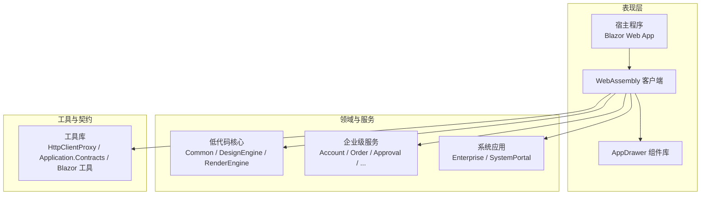
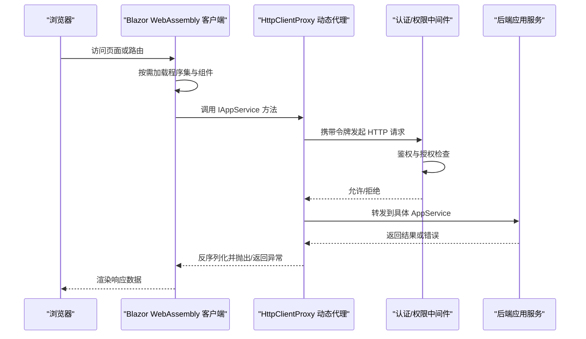
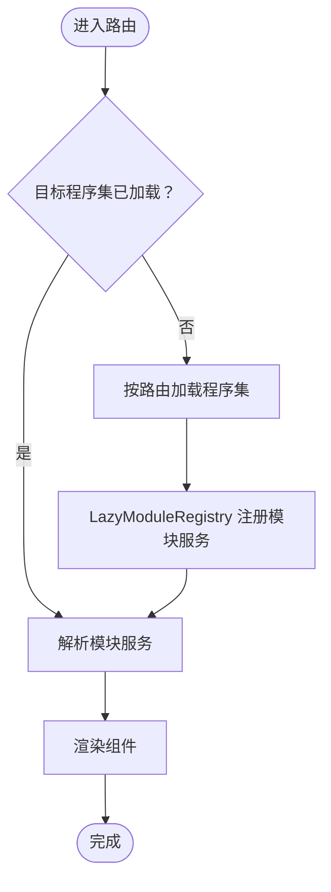
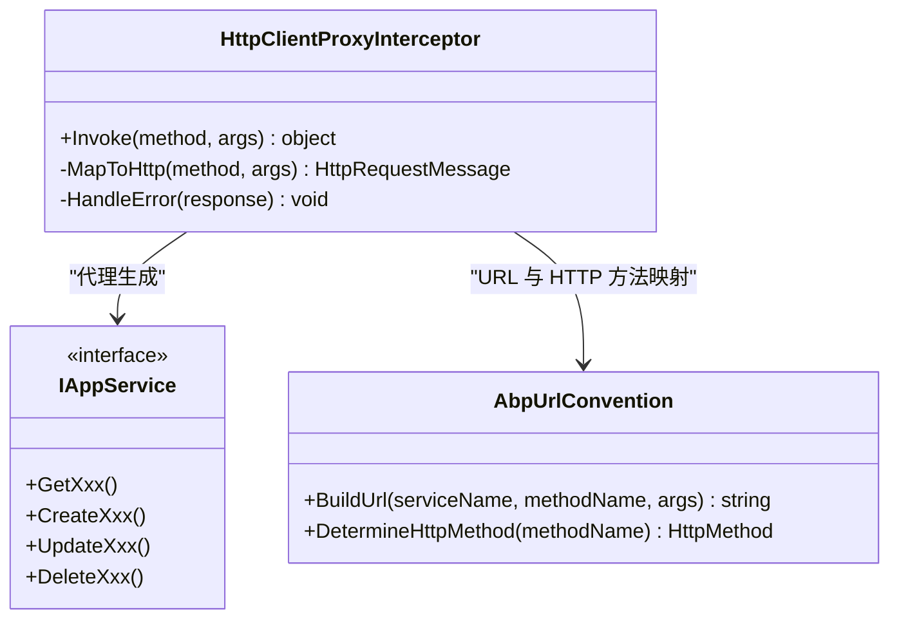
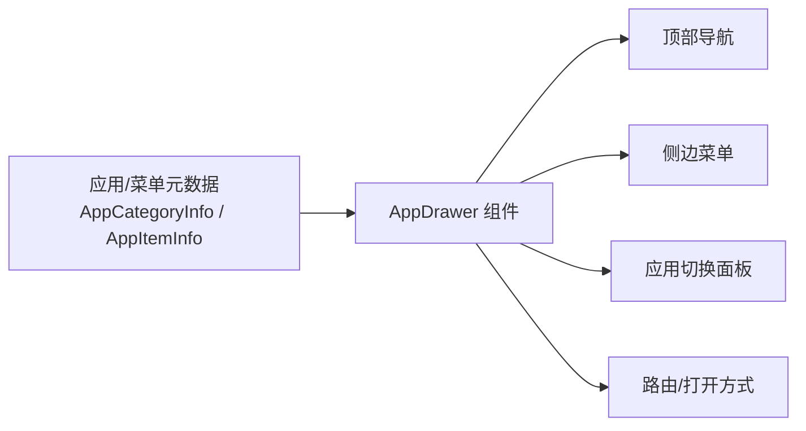
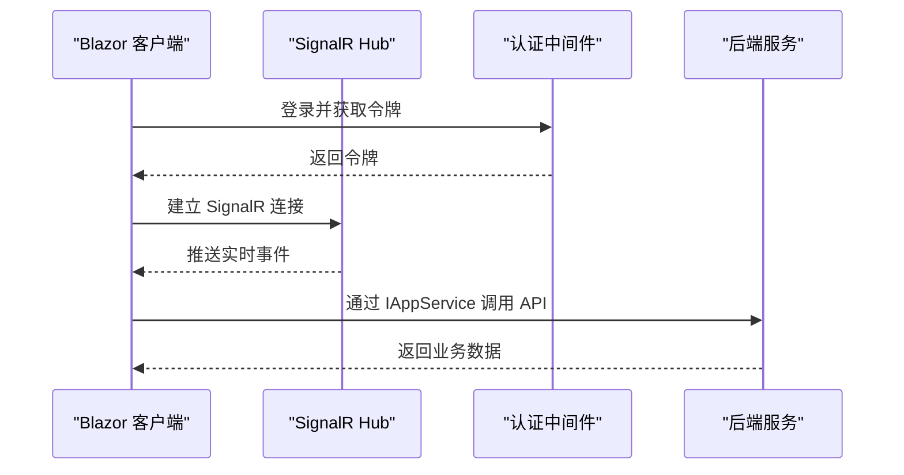
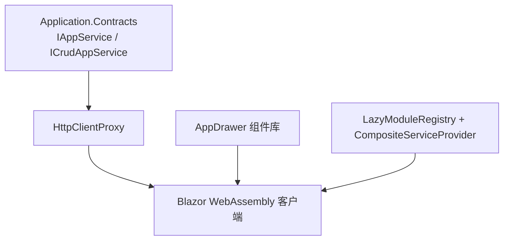

# 表现层设计

<cite>
**本文引用的文件**   
- [README.md](file://README.md)
</cite>

## 目录
1. [引言](#引言)
2. [项目结构](#项目结构)
3. [核心组件](#核心组件)
4. [架构总览](#架构总览)
5. [详细组件分析](#详细组件分析)
6. [依赖关系分析](#依赖关系分析)
7. [性能与体积优化](#性能与体积优化)
8. [常见问题与排错](#常见问题与排错)
9. [结论](#结论)

## 引言
本文件面向 H.AppLab 平台的表现层，聚焦 Blazor WebAssembly 客户端架构、路由懒加载机制、组件组织与状态管理、HTTP 动态代理通信模式、应用抽屉组件设计，以及认证、权限和实时通信的集成思路。文档基于仓库中的说明性信息整理，强调可操作的最佳实践与实现要点。

## 项目结构
H.AppLab 采用模块化架构，支持单体部署与按服务独立部署。前端以 Blazor Web App（Server + WebAssembly Client）形式运行，宿主程序负责服务注册，不包含业务逻辑；业务由 Services 下的限界上下文模块提供，系统级应用位于 System 下，工具与迁移脚本位于 Tools 下，通用 UI 组件集中在 Components 下，其中 AppDrawer 提供统一的导航与应用切换能力。

图示来源
- [README.md:1-73](file://README.md#L1-L73)

章节来源
- [README.md:1-73](file://README.md#L1-L73)

## 核心组件
- Blazor WebAssembly 客户端：通过 Blazor Web App 模式承载，配合 Server 端进行初始渲染与资源分发。
- AppDrawer 组件库：提供顶部导航、侧边菜单与应用切换面板，支持以元数据方式接入新应用。
- HttpClientProxy 动态代理：基于 IAppService 接口自动生成 HTTP 调用，屏蔽底层网络细节。
- 懒加载运行时：通过显式声明与路由触发，按需下载 Contracts、LowCode 库及第三方依赖。
- 组合式 DI：LazyModuleRegistry 与 CompositeServiceProvider 支撑模块化的延迟服务注册与解析回退。

章节来源
- [README.md:1-73](file://README.md#L1-L73)

## 架构总览
下图展示从浏览器到后端服务的典型请求路径，包括认证、权限校验、动态代理与远程服务调用。

图示来源
- [README.md:1-73](file://README.md#L1-L73)

## 详细组件分析

### Blazor WebAssembly 客户端与路由懒加载
- 启动时仅加载必要程序集（如 Portal、AppDrawer 与少量契约/工具库），其余应用在导航到对应路由时才按需下载。
- 在客户端 csproj 中通过 BlazorWebAssemblyLazyLoad 显式声明懒加载程序集。
- Routes.razor 的 OnNavigateAsync 根据目标路由触发程序集加载，确保首次渲染快速且后续功能按需引入。
- 自研组合式 DI：LazyModuleRegistry 维护各路由模块的服务容器，CompositeServiceProvider 提供“根容器 → 模块容器”的服务解析回退，使模块在服务被使用后才完成注册。

最佳实践
- 将大型依赖（如 Markdig、Sqids）放入懒加载程序集，避免首屏冗余。
- 在 OnNavigateAsync 中集中处理加载失败与重试逻辑，统一用户提示。
- 使用 LazyModuleRegistry 为每个模块定义最小化服务边界，减少全局污染。

章节来源
- [README.md:1-73](file://README.md#L1-L73)

### HttpClientProxy 动态代理与 IAppService 约定
- 前端仅依赖 Application.Contracts 中的 IAppService 接口，无需手写 HttpClient 调用。
- 基于 DispatchProxy 拦截接口方法调用，按 ABP 路由约定（AbpUrlConvention）将“接口名 + 方法名”转换为 HTTP 请求：例如 GetXxx → GET，CreateXxx → POST，复杂参数自动序列化为请求体。
- 通过 AddHttpClientProxies 扫描程序集内所有 IAppService 接口并批量注册代理。
- 远程服务地址由配置 RemoteServices 节点统一管理，便于多环境切换。
- 同一套接口在服务端为进程内实现，在 WebAssembly 客户端为 HTTP 代理实现，业务代码无感知。

最佳实践
- 严格遵循 IAppService 命名约定（GetXxx、CreateXxx 等），避免自定义路由导致映射失败。
- 对复杂对象参数，确保前后端 DTO 一致，避免序列化歧义。
- 将跨域、超时、重试策略统一在 AddHttpClientProxies 配置中，避免分散在各组件。
- 错误处理应区分网络错误、鉴权失败与业务异常，并在客户端给出友好提示。

章节来源
- [README.md:1-73](file://README.md#L1-L73)

### 应用抽屉组件架构（AppDrawer）
- AppDrawer 由 H.AppDrawer.Components 与 H.AppDrawer.Model 组成，提供统一布局：顶部导航栏、侧边菜单、应用抽屉面板。
- 应用以元数据方式接入：通过 AppCategoryInfo / AppItemInfo 配置应用分类、图标、跳转地址与打开方式，实现跨应用快速切换。
- 各宿主只需引用组件并提供应用/菜单数据，即可获得一致的导航体验，无需重复实现布局。

最佳实践
- 将应用元数据放在远端或集中配置中心，运行时拉取，便于动态扩展。
- 菜单权限按角色或租户过滤，未授权项不渲染。
- 主题定制通过 CSS 变量或主题包注入，保持样式解耦。

章节来源
- [README.md:1-73](file://README.md#L1-L73)

### 表现层与后端服务的通信模式
- 认证流程：客户端在登录后获取令牌，随 HTTP 请求头携带至服务端；服务端中间件校验令牌并注入当前用户身份。
- 权限控制：基于角色的访问控制（RBAC）或基于资源的权限模型，在服务端对 AppService 方法进行授权检查。
- 实时通信（SignalR）：适用于通知、审计日志、任务进度等场景，客户端通过 Hub 订阅事件，服务端推送更新。

最佳实践
- 认证失败时统一重定向到登录页，并保留原始路由以便登录后继续。
- 权限不足时返回明确错误码，前端据此显示“无权限”提示。
- SignalR 连接断开时实现指数退避重连，避免风暴式重试。

章节来源
- [README.md:1-73](file://README.md#L1-L73)

## 依赖关系分析
- 客户端依赖 Application.Contracts 定义的 IAppService 接口，运行时由 HttpClientProxy 生成代理。
- AppDrawer 组件库为各宿主共享，降低布局与导航的重复开发成本。
- LazyModuleRegistry 与 CompositeServiceProvider 共同构成模块化的延迟 DI 体系，支撑懒加载后的服务注册与解析。

图示来源
- [README.md:1-73](file://README.md#L1-L73)

## 性能与体积优化
- 启用 AOT 与裁剪（Trimming）以减少发布包体积。
- Debug 模式额外加载 .pdb 以支持调试。
- 合理使用懒加载，避免首屏加载过多第三方库。
- 对静态资源与图片进行压缩与缓存策略优化。

章节来源
- [README.md:1-73](file://README.md#L1-L73)

## 常见问题与排错
- 动态代理 URL 不匹配：检查是否遵循 IAppService 命名约定与 ABP 路由约定。
- 远程服务地址配置错误：确认 RemoteServices 配置节点正确指向后端服务。
- 懒加载程序集未加载：确认 Routes.razor 的 OnNavigateAsync 是否正确触发加载。
- 信号连接不稳定：实现断线重连与降级策略，记录连接状态日志。
- 权限误判：核对服务端 RBAC 规则与前端权限过滤逻辑一致性。

章节来源
- [README.md:1-73](file://README.md#L1-L73)

## 结论
H.AppLab 的表现层以 Blazor WebAssembly 为核心，结合路由懒加载、动态代理与 AppDrawer 组件库，形成高内聚、低耦合的前端架构。通过统一的 IAppService 契约与 HttpClientProxy 代理，前端与后端服务通信简洁可靠；组合式 DI 与懒加载有效降低了初始体积与启动时间。在此基础上，认证、权限与 SignalR 实时通信为平台提供了完整的企业级能力支撑。