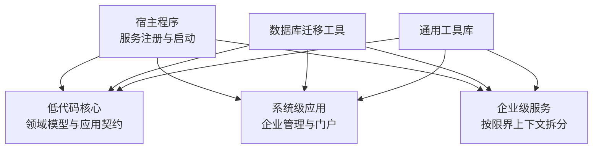
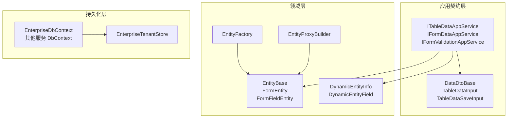
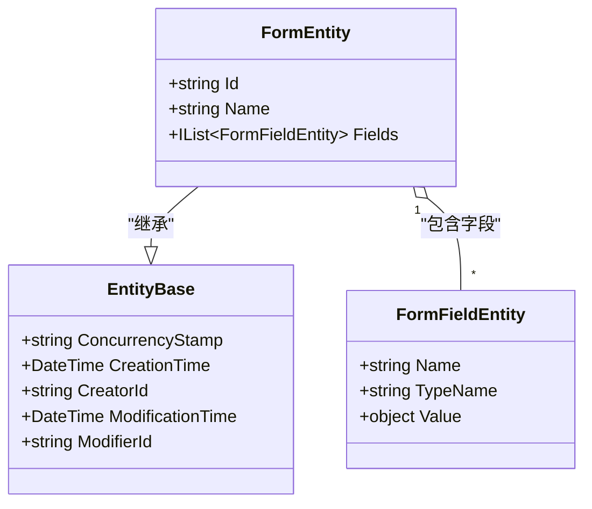
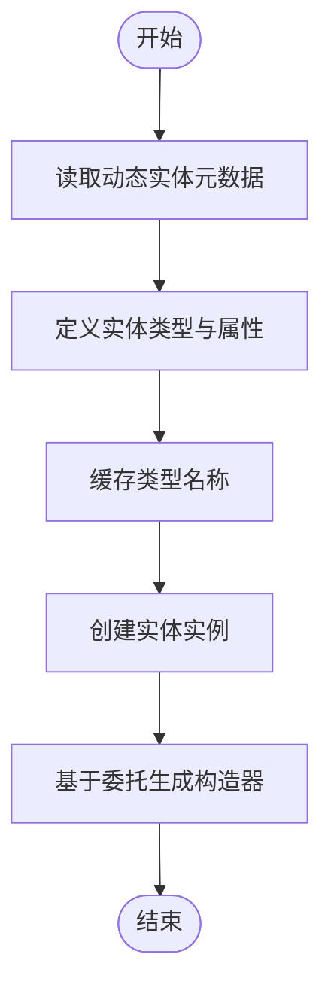
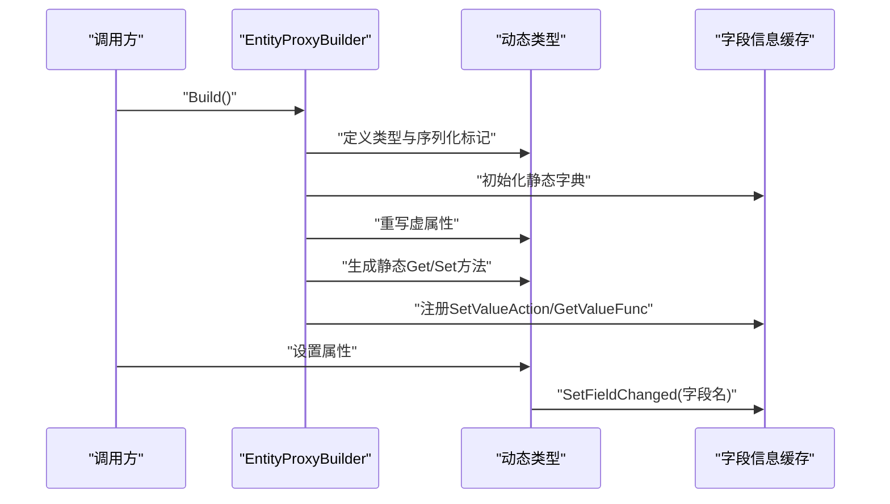
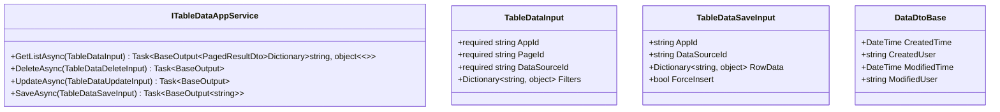
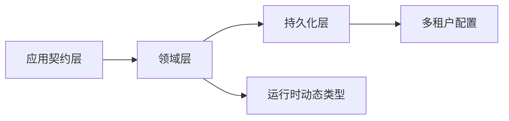
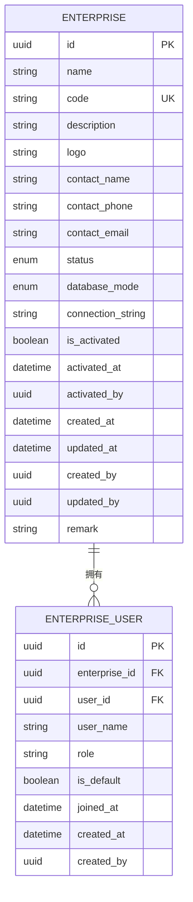
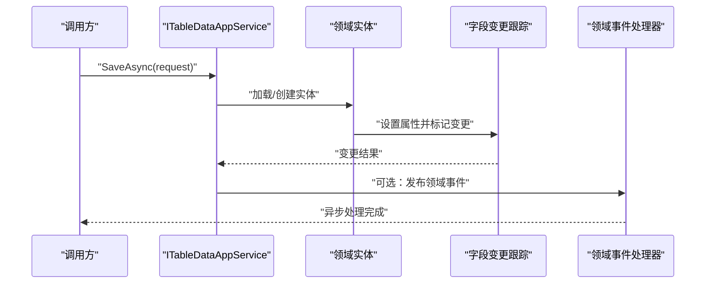

# 领域层设计

<cite>
**本文引用的文件**   
- [README.md](file://README.md)
- [EntityBase.cs](file://src/LowCode/Common/H.LowCode.Entity/Base/EntityBase.cs)
- [FormEntity.cs](file://src/LowCode/Common/H.LowCode.Entity/Base/FormEntity.cs)
- [DynamicEntityInfo.cs](file://src/LowCode/Common/H.LowCode.Entity/EntityManager/DynamicEntityInfo.cs)
- [EntityFactory.cs](file://src/LowCode/Common/H.LowCode.Entity/EntityManager/EntityFactory.cs)
- [EntityProxyBuilder.cs](file://src/LowCode/Common/H.LowCode.Entity/EntityManager/EntityProxyBuilder.cs)
- [DataDtoBase.cs](file://src/LowCode/Common/H.LowCode.Application.Contracts/Dtos/DataDtoBase.cs)
- [TableDataInput.cs](file://src/LowCode/Common/H.LowCode.Application.Contracts/Dtos/TableDataInput.cs)
- [TableDataSaveInput.cs](file://src/LowCode/Common/H.LowCode.Application.Contracts/Dtos/TableDataSaveInput.cs)
- [ITableDataAppService.cs](file://src/LowCode/Common/H.LowCode.Application.Contracts/AppServices/ITableDataAppService.cs)
- [EnterpriseEntity.cs](file://src/System/Enterprise/H.Enterprise.EntityFrameworkCore/Entities/EnterpriseEntity.cs)
- [EnterpriseUserEntity.cs](file://src/System/Enterprise/H.Enterprise.EntityFrameworkCore/Entities/EnterpriseUserEntity.cs)
- [Enums.cs](file://src/System/Enterprise/H.Enterprise.EntityFrameworkCore/Entities/Enums.cs)
- [EnterpriseDbContext.cs](file://src/System/Enterprise/H.Enterprise.EntityFrameworkCore/EnterpriseDbContext.cs)
- [EnterpriseTenantStore.cs](file://src/System/Enterprise/H.Enterprise.EntityFrameworkCore/EnterpriseTenantStore.cs)
</cite>

## 目录
1. [引言](#引言)
2. [项目结构](#项目结构)
3. [核心领域模型](#核心领域模型)
4. [架构总览](#架构总览)
5. [关键组件详解](#关键组件详解)
6. [依赖关系分析](#依赖关系分析)
7. [性能与扩展性考虑](#性能与扩展性考虑)
8. [多租户领域模型设计](#多租户领域模型设计)
9. [领域服务与领域事件使用模式](#领域服务与领域事件使用模式)
10. [测试策略与质量保证](#测试策略与质量保证)
11. [结论](#结论)

## 引言
本文件面向 H.AppLab 平台的领域层设计，聚焦低代码元数据实体、动态实体基础设施、应用契约以及企业级多租户领域模型。文档从领域实体生命周期管理、值对象与聚合根概念、领域服务与领域事件的使用模式、多租户隔离与数据访问控制，到测试策略和质量保证进行系统化说明，并给出可追溯的具体源码路径和架构图表。

## 项目结构
H.AppLab 采用模块化架构，支持单体部署与服务独立部署。LowCode 模块提供低代码核心能力，包括元数据 Schema、组件基类、默认组件库、实体与应用契约；System 模块承载平台运营侧能力；Services 模块按限界上下文划分企业级业务；Host 仅做宿主与服务注册；Tools 提供数据库迁移工具；Utils 提供通用工具库。

**图表来源**
- [README.md:1-73](file://README.md#L1-L73)

**章节来源**
- [README.md:1-73](file://README.md#L1-L73)

## 核心领域模型
H.AppLab 的领域模型围绕低代码元数据与运行时动态实体展开，核心包括：

- 基础实体基类：提供并发戳、创建时间、创建者、修改时间与修改者等通用审计字段。
- 表单实体与字段实体：将表单结构建模为实体集合，主键由特定字段解析，字段值通过类型名称进行转换。
- 动态实体描述与工厂：通过运行时定义实体类型、属性与实例构造器，支持反射与 IL 发射。
- 动态代理构建器：对实体的虚属性生成代理实现，缓存字段信息、生成静态存取方法，并在设置时标记字段变更。
- 应用契约与数据传输对象：以 IAppService 接口暴露 CRUD 与保存操作，DTO 包含审计字段与分页排序请求参数。

这些模型体现了以下原则：
- 实体具备完整生命周期元数据，便于审计与并发控制。
- 值对象与结构化数据通过 DTO 与强类型字段封装，避免裸字典散落。
- 动态实体基础设施将“元数据驱动”的能力下沉到领域层，使低代码场景中的数据结构具有运行时灵活性。

**章节来源**
- [EntityBase.cs:1-19](file://src/LowCode/Common/H.LowCode.Entity/Base/EntityBase.cs#L1-L19)
- [FormEntity.cs:1-50](file://src/LowCode/Common/H.LowCode.Entity/Base/FormEntity.cs#L1-L50)
- [DynamicEntityInfo.cs:1-63](file://src/LowCode/Common/H.LowCode.Entity/EntityManager/DynamicEntityInfo.cs#L1-L63)
- [EntityFactory.cs:1-82](file://src/LowCode/Common/H.LowCode.Entity/EntityManager/EntityFactory.cs#L1-L82)
- [EntityProxyBuilder.cs:1-551](file://src/LowCode/Common/H.LowCode.Entity/EntityManager/EntityProxyBuilder.cs#L1-L551)
- [DataDtoBase.cs:1-17](file://src/LowCode/Common/H.LowCode.Application.Contracts/Dtos/DataDtoBase.cs#L1-L17)
- [TableDataInput.cs:1-29](file://src/LowCode/Common/H.LowCode.Application.Contracts/Dtos/TableDataInput.cs#L1-L29)
- [TableDataSaveInput.cs:1-28](file://src/LowCode/Common/H.LowCode.Application.Contracts/Dtos/TableDataSaveInput.cs#L1-L28)
- [ITableDataAppService.cs:1-30](file://src/LowCode/Common/H.LowCode.Application.Contracts/AppServices/ITableDataAppService.cs#L1-L30)

## 架构总览
领域层在 H.AppLab 中承担“低代码元数据模型 + 动态实体基础设施 + 多租户领域模型”的职责。上层应用服务通过 IAppService 暴露能力，EF Core 作为数据持久化实现，ABP 多租户框架通过自定义 ITenantStore 与企业实体交互。

**图表来源**
- [ITableDataAppService.cs:1-30](file://src/LowCode/Common/H.LowCode.Application.Contracts/AppServices/ITableDataAppService.cs#L1-L30)
- [EntityBase.cs:1-19](file://src/LowCode/Common/H.LowCode.Entity/Base/EntityBase.cs#L1-L19)
- [DynamicEntityInfo.cs:1-63](file://src/LowCode/Common/H.LowCode.Entity/EntityManager/DynamicEntityInfo.cs#L1-L63)
- [EntityFactory.cs:1-82](file://src/LowCode/Common/H.LowCode.Entity/EntityManager/EntityFactory.cs#L1-L82)
- [EntityProxyBuilder.cs:1-551](file://src/LowCode/Common/H.LowCode.Entity/EntityManager/EntityProxyBuilder.cs#L1-L551)
- [EnterpriseDbContext.cs:1-83](file://src/System/Enterprise/H.Enterprise.EntityFrameworkCore/EnterpriseDbContext.cs#L1-L83)
- [EnterpriseTenantStore.cs:1-86](file://src/System/Enterprise/H.Enterprise.EntityFrameworkCore/EnterpriseTenantStore.cs#L1-L86)

## 关键组件详解

### 基础实体与表单实体
- 基础实体基类提供并发戳与审计字段，用于并发控制与审计追踪。
- 表单实体将表单定义建模为主键与字段集合，主键通过固定字段名解析；字段实体通过类型名称与值进行转换，确保运行时类型安全。

**图表来源**
- [EntityBase.cs:1-19](file://src/LowCode/Common/H.LowCode.Entity/Base/EntityBase.cs#L1-L19)
- [FormEntity.cs:1-50](file://src/LowCode/Common/H.LowCode.Entity/Base/FormEntity.cs#L1-L50)

**章节来源**
- [EntityBase.cs:1-19](file://src/LowCode/Common/H.LowCode.Entity/Base/EntityBase.cs#L1-L19)
- [FormEntity.cs:1-50](file://src/LowCode/Common/H.LowCode.Entity/Base/FormEntity.cs#L1-L50)

### 动态实体元数据与工厂
- 动态实体元数据描述实体名、主键、是否启用软删除及字段集合，字段包含 CLR 类型、长度、精度、可空性与默认值等约束。
- 实体工厂负责根据元数据动态定义实体类型、属性，并提供基于委托的实例构造器，降低反射开销。

**图表来源**
- [DynamicEntityInfo.cs:1-63](file://src/LowCode/Common/H.LowCode.Entity/EntityManager/DynamicEntityInfo.cs#L1-L63)
- [EntityFactory.cs:1-82](file://src/LowCode/Common/H.LowCode.Entity/EntityManager/EntityFactory.cs#L1-L82)

**章节来源**
- [DynamicEntityInfo.cs:1-63](file://src/LowCode/Common/H.LowCode.Entity/EntityManager/DynamicEntityInfo.cs#L1-L63)
- [EntityFactory.cs:1-82](file://src/LowCode/Common/H.LowCode.Entity/EntityManager/EntityFactory.cs#L1-L82)

### 动态代理构建器
- 动态代理构建器针对目标类型的虚属性生成代理实现，初始化静态字典缓存字段信息，并为每个属性生成静态存取方法与无状态设置方法。
- 在属性设置过程中调用字段变更标记，便于后续跟踪变更或触发领域事件。

**图表来源**
- [EntityProxyBuilder.cs:1-551](file://src/LowCode/Common/H.LowCode.Entity/EntityManager/EntityProxyBuilder.cs#L1-L551)

**章节来源**
- [EntityProxyBuilder.cs:1-551](file://src/LowCode/Common/H.LowCode.Entity/EntityManager/EntityProxyBuilder.cs#L1-L551)

### 应用契约与数据输入输出
- 应用服务接口定义表格数据的查询、删除、更新与保存（按主键新增或更新）。
- 数据输入包含应用 ID、页面 ID、数据源 ID 与筛选条件；保存输入包含行数据与强制新增标志。
- 数据 DTO 基类包含创建时间、创建者、修改时间与修改者等审计字段。

**图表来源**
- [ITableDataAppService.cs:1-30](file://src/LowCode/Common/H.LowCode.Application.Contracts/AppServices/ITableDataAppService.cs#L1-L30)
- [TableDataInput.cs:1-29](file://src/LowCode/Common/H.LowCode.Application.Contracts/Dtos/TableDataInput.cs#L1-L29)
- [TableDataSaveInput.cs:1-28](file://src/LowCode/Common/H.LowCode.Application.Contracts/Dtos/TableDataSaveInput.cs#L1-L28)
- [DataDtoBase.cs:1-17](file://src/LowCode/Common/H.LowCode.Application.Contracts/Dtos/DataDtoBase.cs#L1-L17)

**章节来源**
- [ITableDataAppService.cs:1-30](file://src/LowCode/Common/H.LowCode.Application.Contracts/AppServices/ITableDataAppService.cs#L1-L30)
- [TableDataInput.cs:1-29](file://src/LowCode/Common/H.LowCode.Application.Contracts/Dtos/TableDataInput.cs#L1-L29)
- [TableDataSaveInput.cs:1-28](file://src/LowCode/Common/H.LowCode.Application.Contracts/Dtos/TableDataSaveInput.cs#L1-L28)
- [DataDtoBase.cs:1-17](file://src/LowCode/Common/H.LowCode.Application.Contracts/Dtos/DataDtoBase.cs#L1-L17)

## 依赖关系分析
领域层依赖关系呈现如下特点：
- 应用契约层依赖基础 DTO 与 IAppService 接口，不感知底层持久化实现。
- 领域层通过 EntityBase、FormEntity、DynamicEntityInfo、EntityFactory、EntityProxyBuilder 形成“元数据 + 动态类型”的核心链路。
- 持久化层通过 EnterpriseDbContext 映射企业实体，并通过 EnterpriseTenantStore 对接 ABP 多租户框架。

**图表来源**
- [ITableDataAppService.cs:1-30](file://src/LowCode/Common/H.LowCode.Application.Contracts/AppServices/ITableDataAppService.cs#L1-L30)
- [EntityFactory.cs:1-82](file://src/LowCode/Common/H.LowCode.Entity/EntityManager/EntityFactory.cs#L1-L82)
- [EntityProxyBuilder.cs:1-551](file://src/LowCode/Common/H.LowCode.Entity/EntityManager/EntityProxyBuilder.cs#L1-L551)
- [EnterpriseDbContext.cs:1-83](file://src/System/Enterprise/H.Enterprise.EntityFrameworkCore/EnterpriseDbContext.cs#L1-L83)
- [EnterpriseTenantStore.cs:1-86](file://src/System/Enterprise/H.Enterprise.EntityFrameworkCore/EnterpriseTenantStore.cs#L1-L86)

**章节来源**
- [ITableDataAppService.cs:1-30](file://src/LowCode/Common/H.LowCode.Application.Contracts/AppServices/ITableDataAppService.cs#L1-L30)
- [EntityFactory.cs:1-82](file://src/LowCode/Common/H.LowCode.Entity/EntityManager/EntityFactory.cs#L1-L82)
- [EntityProxyBuilder.cs:1-551](file://src/LowCode/Common/H.LowCode.Entity/EntityManager/EntityProxyBuilder.cs#L1-L551)
- [EnterpriseDbContext.cs:1-83](file://src/System/Enterprise/H.Enterprise.EntityFrameworkCore/EnterpriseDbContext.cs#L1-L83)
- [EnterpriseTenantStore.cs:1-86](file://src/System/Enterprise/H.Enterprise.EntityFrameworkCore/EnterpriseTenantStore.cs#L1-L86)

## 性能与扩展性考虑
- 动态类型与 IL 发射：EntityFactory 与 EntityProxyBuilder 通过反射与 IL 生成减少运行时反射成本，提高频繁实例化与属性访问的性能。
- 静态缓存：代理构建器为每个类型维护静态字段信息字典，避免重复计算。
- 并发控制：EntityBase 的并发戳可用于乐观锁，防止覆盖写入。
- 可扩展点：DynamicEntityInfo 允许扩展字段约束（如 Unicode、精度、默认值），EntityProxyBuilder 预留枚举列映射等扩展位。

[本节为通用性能建议，不直接分析具体文件]

## 多租户领域模型设计
H.AppLab 的企业领域模型体现多租户设计的核心思想：

- 企业实体作为租户表示，Id 同时作为 TenantId，支持共享数据库与独立数据库两种模式。
- 企业用户关联实体用于多对多关系，冗余用户名便于显示，角色用于权限判断。
- 企业状态与数据库模式通过枚举明确表达，激活状态决定租户可用性。
- 企业上下文不应用租户过滤，因为企业与用户关联是跨租户实体。
- 自定义租户存储从企业表中读取活跃租户，并将独立数据库的连接字符串注入 ABP 的多租户配置。

**图表来源**
- [EnterpriseEntity.cs:1-107](file://src/System/Enterprise/H.Enterprise.EntityFrameworkCore/Entities/EnterpriseEntity.cs#L1-L107)
- [EnterpriseUserEntity.cs:1-58](file://src/System/Enterprise/H.Enterprise.EntityFrameworkCore/Entities/EnterpriseUserEntity.cs#L1-L58)
- [Enums.cs:1-38](file://src/System/Enterprise/H.Enterprise.EntityFrameworkCore/Entities/Enums.cs#L1-L38)

**章节来源**
- [EnterpriseEntity.cs:1-107](file://src/System/Enterprise/H.Enterprise.EntityFrameworkCore/Entities/EnterpriseEntity.cs#L1-L107)
- [EnterpriseUserEntity.cs:1-58](file://src/System/Enterprise/H.Enterprise.EntityFrameworkCore/Entities/EnterpriseUserEntity.cs#L1-L58)
- [Enums.cs:1-38](file://src/System/Enterprise/H.Enterprise.EntityFrameworkCore/Entities/Enums.cs#L1-L38)
- [EnterpriseDbContext.cs:1-83](file://src/System/Enterprise/H.Enterprise.EntityFrameworkCore/EnterpriseDbContext.cs#L1-L83)
- [EnterpriseTenantStore.cs:1-86](file://src/System/Enterprise/H.Enterprise.EntityFrameworkCore/EnterpriseTenantStore.cs#L1-L86)

## 领域服务与领域事件使用模式
在本仓库中，领域行为主要通过以下方式组织：
- 应用服务接口（IAppService）暴露业务操作，如表格数据查询、删除、更新与保存，业务规则封装在应用服务与仓储之间。
- 动态实体代理在属性设置时调用字段变更标记，这为未来引入领域事件提供了天然切入点（例如在 SetFieldChanged 后发布实体变更事件）。
- 当前代码未直接出现显式领域事件类与处理器，但已有变更跟踪机制可作为事件驱动的扩展点。

**图表来源**
- [ITableDataAppService.cs:1-30](file://src/LowCode/Common/H.LowCode.Application.Contracts/AppServices/ITableDataAppService.cs#L1-L30)
- [EntityProxyBuilder.cs:1-551](file://src/LowCode/Common/H.LowCode.Entity/EntityManager/EntityProxyBuilder.cs#L1-L551)

**章节来源**
- [ITableDataAppService.cs:1-30](file://src/LowCode/Common/H.LowCode.Application.Contracts/AppServices/ITableDataAppService.cs#L1-L30)
- [EntityProxyBuilder.cs:1-551](file://src/LowCode/Common/H.LowCode.Entity/EntityManager/EntityProxyBuilder.cs#L1-L551)

## 测试策略与质量保证
针对领域模型的测试与质量保障建议如下：
- 单元测试
  - 验证 EntityBase 的生命周期字段初始值与并发戳生成逻辑。
  - 验证 FormEntity 的主键解析与异常分支。
  - 验证 FormFieldEntity 的类型转换与无效类型名的错误处理。
  - 验证 DynamicEntityInfo 的字段约束与默认值。
  - 验证 EntityFactory 的动态类型创建与实例构造器委托。
  - 验证 EntityProxyBuilder 的属性代理、静态存取方法与字段变更标记。
- 集成测试
  - 验证 ITableDataAppService 的 GetListAsync、DeleteAsync、UpdateAsync、SaveAsync 在不同数据源与筛选条件下的行为。
  - 验证 EnterpriseTenantStore 在共享与独立数据库模式下的租户查找与连接字符串注入。
- 边界与异常
  - 主键为空时的异常路径。
  - 类型名称无效或类型不存在时的异常路径。
  - 企业未激活或状态不符时的租户查找失败路径。
- 可观测性与审计
  - 确认 CreatedTime、ModifiedTime、CreatorId、ModifierId 在写操作中正确填充。
  - 确认 ConcurrencyStamp 在并发冲突场景下被正确使用。

[本节为通用测试建议，不直接分析具体文件]

## 结论
H.AppLab 的领域层以低代码元数据为核心，结合动态实体基础设施与多租户企业模型，形成了灵活、可扩展且具备良好审计与并发控制的领域设计。应用契约清晰暴露业务操作，持久化层通过 EF Core 与 ABP 多租户框架支撑跨租户数据访问。未来可在字段变更跟踪基础上引入领域事件，进一步完善事件驱动架构。