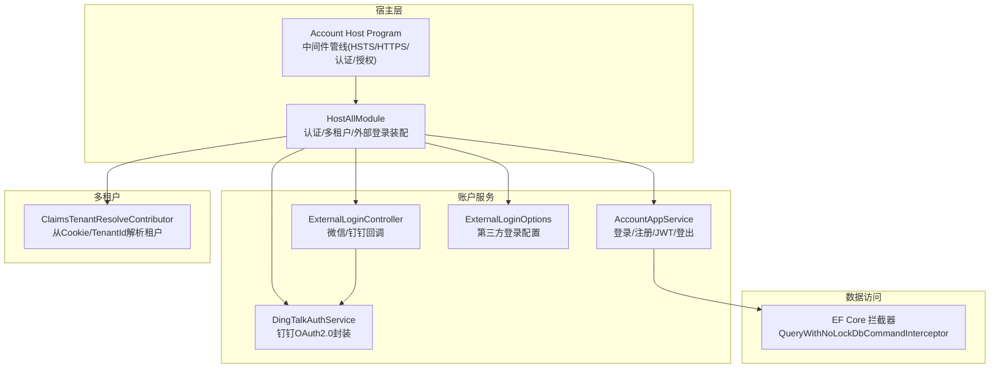
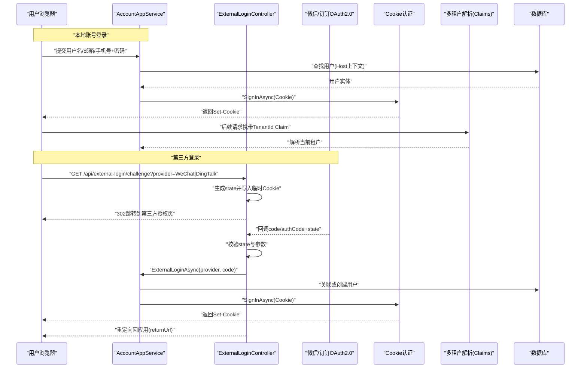
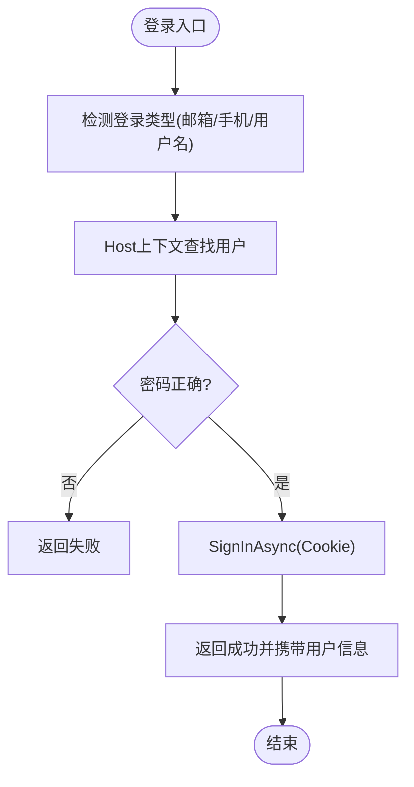
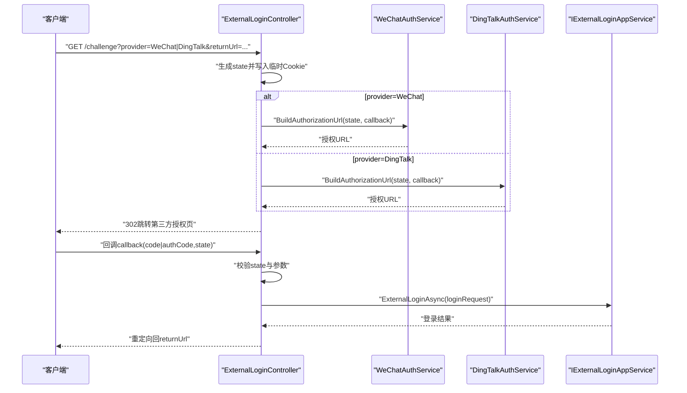
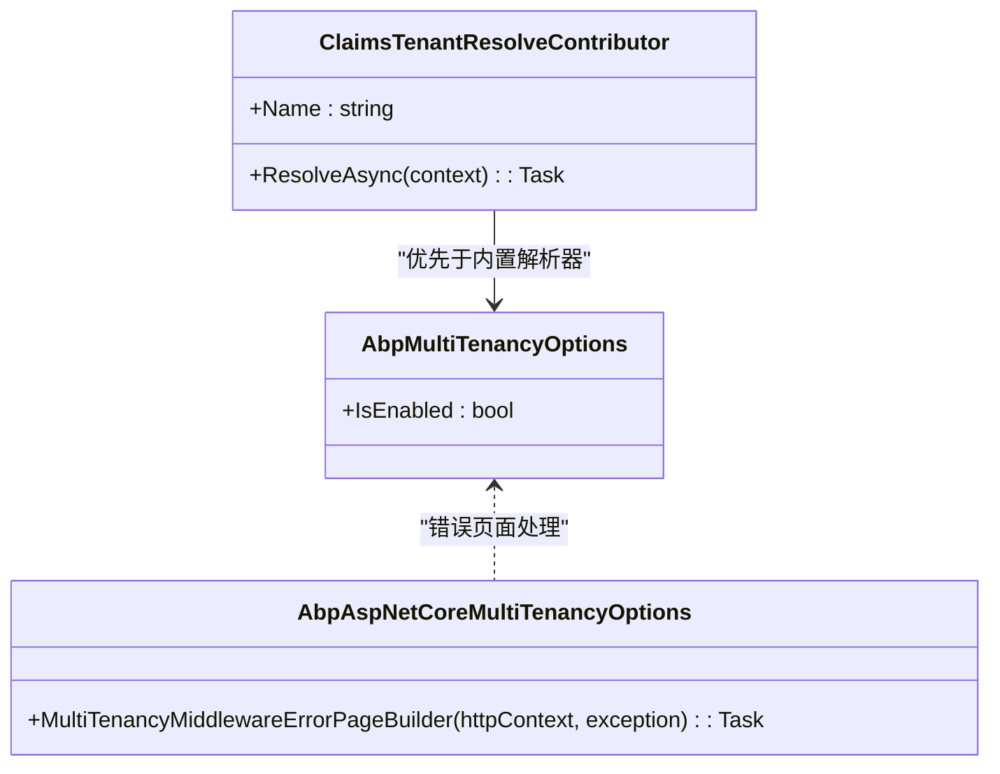
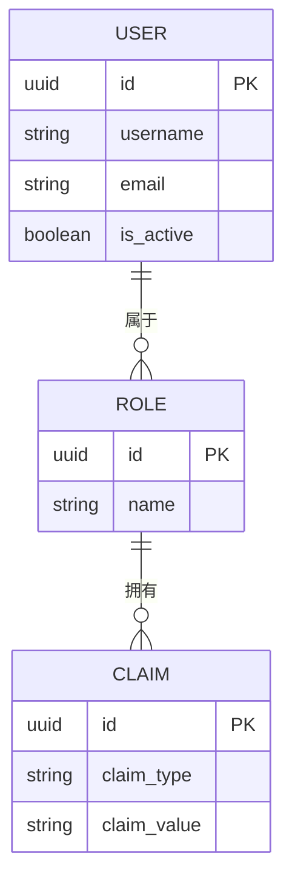
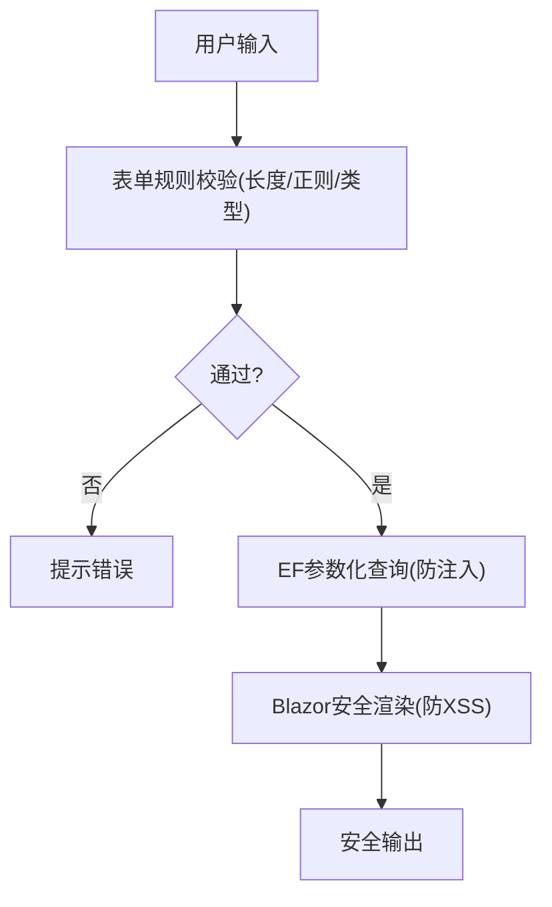
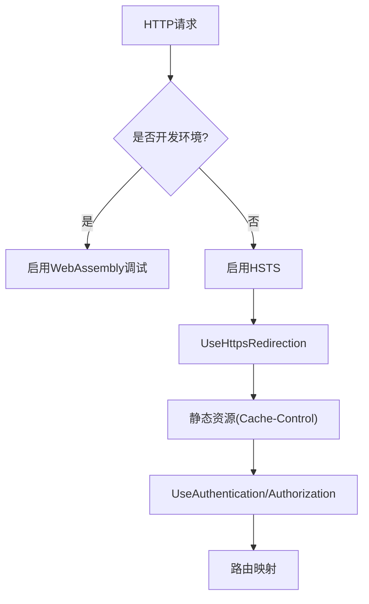
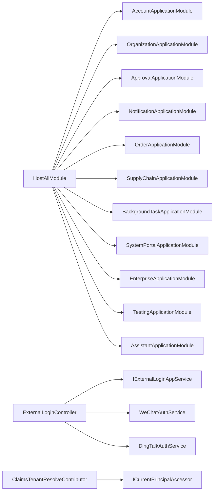

# 安全架构

<cite>
**本文引用的文件**   
- [HostAllModule.cs](file://src/Host/H.AppLab.Host.All/H.AppLab.Host.All/HostAllModule.cs)
- [ClaimsTenantResolveContributor.cs](file://src/Host/H.AppLab.Host.All/H.AppLab.Host.All/ClaimsTenantResolveContributor.cs)
- [Program.cs（Account Host）](file://src/Host/Account/H.Account.Host/Program.cs)
- [AccountAppService.cs](file://src/Services/Account/H.Account.Application/Services/AccountAppService.cs)
- [ExternalLoginController.cs](file://src/Services/Account/H.Account.Application/ExternalLogin/ExternalLoginController.cs)
- [DingTalkAuthService.cs](file://src/Services/Account/H.Account.Application/ExternalLogin/DingTalkAuthService.cs)
- [ExternalLoginOptions.cs](file://src/Services/Account/H.Account.Application/ExternalLogin/ExternalLoginOptions.cs)
- [ExternalLoginDtos.cs](file://src/Services/Account/H.Account.Application.Contracts/Dtos/ExternalLoginDtos.cs)
- [QueryWithNoLockDbCommandInterceptor.cs（设计引擎）](file://src/LowCode/DesignEngine/H.LowCode.DesignEngine.EntityFrameworkCore/Extensions/QueryWithNoLockDbCommandInterceptor.cs)
- [QueryWithNoLockDbCommandInterceptor.cs（渲染引擎）](file://src/LowCode/RenderEngine/H.LowCode.RenderEngine.EntityFrameworkCore/Extensions/QueryWithNoLockDbCommandInterceptor.cs)
- [appsettings.json（Host All）](file://src/Host/H.AppLab.Host.All/H.AppLab.Host.All/appsettings.json)
</cite>

## 目录
1. [简介](#简介)
2. [项目结构](#项目结构)
3. [核心组件](#核心组件)
4. [架构总览](#架构总览)
5. [详细组件分析](#详细组件分析)
6. [依赖关系分析](#依赖关系分析)
7. [性能与安全特性](#性能与安全特性)
8. [故障排查指南](#故障排查指南)
9. [结论](#结论)

## 简介
本安全架构文档面向 AppLab 平台，系统性阐述认证授权、多租户隔离、外部登录集成（微信、钉钉 OAuth2.0）、角色权限模型（RBAC）、输入验证与防注入/XSS 策略、跨域与 HTTPS 配置及安全响应头设置。文档结合代码级实现，提供流程图与架构图，帮助开发者与运维人员理解并落地安全最佳实践。

## 项目结构
- 统一宿主模块负责装配认证、多租户、外部登录与控制器注册，是安全能力入口。
- Account 服务提供账号注册、登录、登出、JWT 校验与用户信息获取等核心认证逻辑。
- 外部登录通过 Controller + Service 封装第三方 OAuth2.0 流程（微信、钉钉）。
- 多租户通过 Claims 解析器从 Cookie 的 TenantId Claim 中读取当前企业上下文。
- EF Core 拦截器用于查询优化（NOLOCK），非安全相关但影响性能与一致性。

**图表来源** 
- [HostAllModule.cs:81-111](file://src/Host/H.AppLab.Host.All/H.AppLab.Host.All/HostAllModule.cs#L81-L111)
- [Program.cs（Account Host）:20-38](file://src/Host/Account/H.Account.Host/Program.cs#L20-L38)
- [AccountAppService.cs:114-210](file://src/Services/Account/H.Account.Application/Services/AccountAppService.cs#L114-L210)
- [ExternalLoginController.cs:42-82](file://src/Services/Account/H.Account.Application/ExternalLogin/ExternalLoginController.cs#L42-L82)
- [DingTalkAuthService.cs:31-41](file://src/Services/Account/H.Account.Application/ExternalLogin/DingTalkAuthService.cs#L31-L41)
- [ExternalLoginOptions.cs:1-21](file://src/Services/Account/H.Account.Application/ExternalLogin/ExternalLoginOptions.cs#L1-L21)
- [ClaimsTenantResolveContributor.cs:18-29](file://src/Host/H.AppLab.Host.All/H.AppLab.Host.All/ClaimsTenantResolveContributor.cs#L18-L29)
- [QueryWithNoLockDbCommandInterceptor.cs（设计引擎）:28-35](file://src/LowCode/DesignEngine/H.LowCode.DesignEngine.EntityFrameworkCore/Extensions/QueryWithNoLockDbCommandInterceptor.cs#L28-L35)
- [QueryWithNoLockDbCommandInterceptor.cs（渲染引擎）:28-35](file://src/LowCode/RenderEngine/H.LowCode.RenderEngine.EntityFrameworkCore/Extensions/QueryWithNoLockDbCommandInterceptor.cs#L28-L35)

**章节来源**
- [HostAllModule.cs:81-111](file://src/Host/H.AppLab.Host.All/H.AppLab.Host.All/HostAllModule.cs#L81-L111)
- [Program.cs（Account Host）:20-38](file://src/Host/Account/H.Account.Host/Program.cs#L20-L38)

## 核心组件
- 认证与会话管理：基于 Cookie 认证的双 Scheme（用户与企业系统），支持滑动过期与持久化。
- JWT 令牌：生成与校验，用于客户端无状态鉴权场景；包含 Issuer/Audience/签名密钥与过期时间。
- 外部登录：微信与钉钉 OAuth2.0 流程，state 防重放、临时 Cookie 存储跳转上下文、回调后签发 Cookie。
- 多租户：启用 ABP 多租户，自定义 Claims 解析器从 Cookie 的 TenantId Claim 解析当前企业。
- 输入验证与防护：WASM 模式关闭服务端 AntiForgery 自动校验，依赖 SameSite Cookie 防护 CSRF；表单侧具备规则化校验。
- 数据库访问：EF Core 拦截器添加 NOLOCK 提升读性能（注意一致性权衡）。

**章节来源**
- [HostAllModule.cs:115-133](file://src/Host/H.AppLab.Host.All/H.AppLab.Host.All/HostAllModule.cs#L115-L133)
- [AccountAppService.cs:222-247](file://src/Services/Account/H.Account.Application/Services/AccountAppService.cs#L222-L247)
- [ExternalLoginController.cs:91-192](file://src/Services/Account/H.Account.Application/ExternalLogin/ExternalLoginController.cs#L91-L192)
- [ClaimsTenantResolveContributor.cs:18-29](file://src/Host/H.AppLab.Host.All/H.AppLab.Host.All/ClaimsTenantResolveContributor.cs#L18-L29)
- [HostAllModule.cs:105-110](file://src/Host/H.AppLab.Host.All/H.AppLab.Host.All/HostAllModule.cs#L105-L110)
- [QueryWithNoLockDbCommandInterceptor.cs（设计引擎）:28-35](file://src/LowCode/DesignEngine/H.LowCode.DesignEngine.EntityFrameworkCore/Extensions/QueryWithNoLockDbCommandInterceptor.cs#L28-L35)

## 架构总览
下图展示用户登录、外部登录回调、权限验证与会话管理的端到端流程，以及多租户上下文在请求中的传递。

**图表来源** 
- [AccountAppService.cs:114-210](file://src/Services/Account/H.Account.Application/Services/AccountAppService.cs#L114-L210)
- [ExternalLoginController.cs:42-82](file://src/Services/Account/H.Account.Application/ExternalLogin/ExternalLoginController.cs#L42-L82)
- [ExternalLoginController.cs:91-192](file://src/Services/Account/H.Account.Application/ExternalLogin/ExternalLoginController.cs#L91-L192)
- [ClaimsTenantResolveContributor.cs:18-29](file://src/Host/H.AppLab.Host.All/H.AppLab.Host.All/ClaimsTenantResolveContributor.cs#L18-L29)

## 详细组件分析

### 认证与会话管理（Cookie + JWT）
- Cookie 认证：默认 Scheme 与系统 Scheme 双配置，支持登录路径、拒绝路径、滑动过期与持久化。
- JWT 令牌：对称密钥签名，校验时严格验证 Issuer/Audience/Lifetime，ClockSkew 为 0。
- 登出：清除 Cookie 会话。
- 当前用户：从 HttpContext.User 提取 NameIdentifier 并切换至 Host 上下文查询用户。

**图表来源** 
- [AccountAppService.cs:114-210](file://src/Services/Account/H.Account.Application/Services/AccountAppService.cs#L114-L210)

**章节来源**
- [HostAllModule.cs:115-133](file://src/Host/H.AppLab.Host.All/H.AppLab.Host.All/HostAllModule.cs#L115-L133)
- [AccountAppService.cs:222-247](file://src/Services/Account/H.Account.Application/Services/AccountAppService.cs#L222-L247)
- [AccountAppService.cs:249-257](file://src/Services/Account/H.Account.Application/Services/AccountAppService.cs#L249-L257)
- [AccountAppService.cs:259-279](file://src/Services/Account/H.Account.Application/Services/AccountAppService.cs#L259-L279)

### 外部登录集成（微信、钉钉 OAuth2.0）
- Challenge：校验 provider 是否启用，生成 state 并写入 HttpOnly/SameSite/Lax 的临时 Cookie，构建第三方授权 URL 并 302 跳转。
- Callback：从 Cookie 读取 state 并校验，根据 provider 换取用户信息，调用应用服务完成登录并签发 Cookie，最后重定向回前端。
- DingTalk：新版 login.dingtalk.com 授权流程，scope=openid，使用 authCode 参数。

**图表来源** 
- [ExternalLoginController.cs:42-82](file://src/Services/Account/H.Account.Application/ExternalLogin/ExternalLoginController.cs#L42-L82)
- [ExternalLoginController.cs:91-192](file://src/Services/Account/H.Account.Application/ExternalLogin/ExternalLoginController.cs#L91-L192)
- [DingTalkAuthService.cs:31-41](file://src/Services/Account/H.Account.Application/ExternalLogin/DingTalkAuthService.cs#L31-L41)
- [ExternalLoginOptions.cs:1-21](file://src/Services/Account/H.Account.Application/ExternalLogin/ExternalLoginOptions.cs#L1-L21)
- [ExternalLoginDtos.cs:1-50](file://src/Services/Account/H.Account.Application.Contracts/Dtos/ExternalLoginDtos.cs#L1-L50)

**章节来源**
- [ExternalLoginController.cs:42-82](file://src/Services/Account/H.Account.Application/ExternalLogin/ExternalLoginController.cs#L42-L82)
- [ExternalLoginController.cs:91-192](file://src/Services/Account/H.Account.Application/ExternalLogin/ExternalLoginController.cs#L91-L192)
- [DingTalkAuthService.cs:31-41](file://src/Services/Account/H.Account.Application/ExternalLogin/DingTalkAuthService.cs#L31-L41)
- [ExternalLoginOptions.cs:1-21](file://src/Services/Account/H.Account.Application/ExternalLogin/ExternalLoginOptions.cs#L1-L21)
- [ExternalLoginDtos.cs:1-50](file://src/Services/Account/H.Account.Application.Contracts/Dtos/ExternalLoginDtos.cs#L1-L50)

### 多租户身份验证与隔离
- 启用 ABP 多租户，自定义 ITenantStore 从 Enterprise 数据库加载租户。
- 自定义 ClaimsTenantResolveContributor 优先从 Cookie 的 TenantId Claim 解析租户，驱动各服务的数据隔离。
- 无效租户处理：清理 __tenant Cookie、注销会话并重定向首页，避免阻断所有请求。

**图表来源** 
- [ClaimsTenantResolveContributor.cs:18-29](file://src/Host/H.AppLab.Host.All/H.AppLab.Host.All/ClaimsTenantResolveContributor.cs#L18-L29)
- [HostAllModule.cs:171-201](file://src/Host/H.AppLab.Host.All/H.AppLab.Host.All/HostAllModule.cs#L171-L201)

**章节来源**
- [HostAllModule.cs:171-201](file://src/Host/H.AppLab.Host.All/H.AppLab.Host.All/HostAllModule.cs#L171-L201)
- [ClaimsTenantResolveContributor.cs:18-29](file://src/Host/H.AppLab.Host.All/H.AppLab.Host.All/ClaimsTenantResolveContributor.cs#L18-L29)

### 角色权限模型（RBAC）
- 基于 Volo.Abp.Identity 的 IdentityRoleClaim 表，支持角色与声明（Claim）绑定，可承载权限标识。
- 用户-角色-权限层次：用户分配角色，角色拥有权限声明，服务层通过 ClaimsPrincipal 进行授权判断。
- 建议：在控制器或服务方法上使用 [Authorize] 与 [AllowAnonymous] 控制访问；对外部登录接口使用 AllowAnonymous。

**图表来源** 
- [20260517144522_Init.Designer.cs:166-193](file://src/Tools/H.Account.DbMigrator/Migrations/20260517144522_Init.Designer.cs#L166-L193)

**章节来源**
- [20260517144522_Init.Designer.cs:166-193](file://src/Tools/H.Account.DbMigrator/Migrations/20260517144522_Init.Designer.cs#L166-L193)

### 输入验证、SQL注入防护与XSS防护
- 输入验证：低代码表单字段支持多种校验规则（长度、数值范围、正则、邮箱、电话、URL、自定义表达式），并在 UI 层触发校验。
- SQL注入防护：EF Core 参数化查询天然防止拼接注入；如需原生 SQL，应使用参数化与白名单。
- XSS防护：Blazor 默认对输出进行 HTML 转义；对外部内容需显式转义或使用安全 API。
- CSRF防护：WASM 模式关闭服务端 AntiForgery 自动校验，依赖 SameSite Cookie（Lax）与 Secure 标志提供足够保护。

**图表来源** 
- [PropertySetting.razor（PartsDesignEngine）:94-113](file://src/LowCode/DesignEngine/H.LowCode.PartsDesignEngine/SettingPanel/PropertySetting.razor#L94-L113)
- [PropertySetting.razor（PartsDesignEngine）:236-248](file://src/LowCode/DesignEngine/H.LowCode.PartsDesignEngine/SettingPanel/PropertySetting.razor#L236-L248)
- [HostAllModule.cs:105-110](file://src/Host/H.AppLab.Host.All/H.AppLab.Host.All/HostAllModule.cs#L105-L110)

**章节来源**
- [PropertySetting.razor（PartsDesignEngine）:94-113](file://src/LowCode/DesignEngine/H.LowCode.PartsDesignEngine/SettingPanel/PropertySetting.razor#L94-L113)
- [PropertySetting.razor（PartsDesignEngine）:236-248](file://src/LowCode/DesignEngine/H.LowCode.PartsDesignEngine/SettingPanel/PropertySetting.razor#L236-L248)
- [HostAllModule.cs:105-110](file://src/Host/H.AppLab.Host.All/H.AppLab.Host.All/HostAllModule.cs#L105-L110)

### 跨域安全、HTTPS 配置与安全头
- HTTPS 强制：生产环境启用 HSTS 与 HTTPS 重定向。
- 静态资源缓存：渲染引擎对静态资源设置 Cache-Control。
- 安全头：可通过中间件或反向代理（Nginx/IIS）设置 Strict-Transport-Security、Content-Security-Policy、X-Frame-Options 等。
- 跨域：CORS 应在网关或反向代理集中配置，限制允许的源、方法与头。

**图表来源** 
- [Program.cs（Account Host）:20-38](file://src/Host/Account/H.Account.Host/Program.cs#L20-L38)
- [Program.cs（Render Engine Host）:44-79](file://src/Host/RenderEngine/H.LowCode.RenderEngine.Host/Program.cs#L44-L79)

**章节来源**
- [Program.cs（Account Host）:20-38](file://src/Host/Account/H.Account.Host/Program.cs#L20-L38)
- [Program.cs（Render Engine Host）:44-79](file://src/Host/RenderEngine/H.LowCode.RenderEngine.Host/Program.cs#L44-L79)

## 依赖关系分析
- 宿主模块依赖 Account、Organization、Approval、Notification、Order、SupplyChain、BackgroundTask、SystemPortal、Enterprise、Testing、Assistant 等服务模块，统一装配控制器与认证。
- ExternalLoginController 依赖 IExternalLoginAppService 与第三方 OAuth2.0 服务（WeChatAuthService、DingTalkAuthService）。
- 多租户解析器依赖 ICurrentPrincipalAccessor 从 Claims 中读取 TenantId。
- EF Core 拦截器在读写命令执行前修改 SQL（添加 NOLOCK），影响读一致性与并发。

**图表来源** 
- [HostAllModule.cs:135-156](file://src/Host/H.AppLab.Host.All/H.AppLab.Host.All/HostAllModule.cs#L135-L156)
- [ExternalLoginController.cs:25-35](file://src/Services/Account/H.Account.Application/ExternalLogin/ExternalLoginController.cs#L25-L35)
- [ClaimsTenantResolveContributor.cs:18-29](file://src/Host/H.AppLab.Host.All/H.AppLab.Host.All/ClaimsTenantResolveContributor.cs#L18-L29)

**章节来源**
- [HostAllModule.cs:135-156](file://src/Host/H.AppLab.Host.All/H.AppLab.Host.All/HostAllModule.cs#L135-L156)
- [ExternalLoginController.cs:25-35](file://src/Services/Account/H.Account.Application/ExternalLogin/ExternalLoginController.cs#L25-L35)
- [ClaimsTenantResolveContributor.cs:18-29](file://src/Host/H.AppLab.Host.All/H.AppLab.Host.All/ClaimsTenantResolveContributor.cs#L18-L29)

## 性能与安全特性
- 会话管理：Cookie 滑动过期与持久化减少频繁登录；JWT 校验开销低，适合无状态场景。
- 外部登录：state 防重放、临时 Cookie 短生命周期，降低劫持风险。
- 多租户：Claims 解析优先级高，避免额外查询；无效租户快速清理并重定向。
- 数据库：NOLOCK 提升读吞吐，但可能读到未提交数据，需评估业务一致性要求。
- 安全头：HSTS、HTTPS 重定向、SameSite Cookie 与 Secure 标志共同保障传输与跨站安全。

[本节为通用指导，不直接分析具体文件]

## 故障排查指南
- 登录失败：检查用户是否存在、是否禁用、密码是否正确；查看 AccessFailedCount 与 LockoutEnd。
- 外部登录回调失败：确认 state 存在且匹配、第三方授权码有效、Provider 已启用；检查回调 URL 与配置。
- 多租户异常：检查 __tenant Cookie 是否指向已删除租户；确认 TenantId Claim 是否存在且有效。
- 跨域问题：确认 CORS 配置与 AllowedOrigins；检查请求头与预检请求。
- 安全头缺失：在生产环境启用 HSTS 与 HTTPS 重定向；必要时通过反向代理补充 CSP、X-Frame-Options。

**章节来源**
- [AccountAppService.cs:140-170](file://src/Services/Account/H.Account.Application/Services/AccountAppService.cs#L140-L170)
- [ExternalLoginController.cs:91-192](file://src/Services/Account/H.Account.Application/ExternalLogin/ExternalLoginController.cs#L91-L192)
- [HostAllModule.cs:191-201](file://src/Host/H.AppLab.Host.All/H.AppLab.Host.All/HostAllModule.cs#L191-L201)

## 结论
AppLab 平台的安全架构以 Cookie 认证为核心，辅以 JWT 无状态校验与多租户 Claims 解析，形成稳健的会话与隔离机制。外部登录通过标准 OAuth2.0 流程接入微信与钉钉，确保安全性与可扩展性。输入验证、参数化查询与 Blazor 安全渲染共同抵御注入与 XSS。生产环境通过 HSTS、HTTPS 重定向与 SameSite Cookie 强化传输与跨站安全。建议在网关层集中配置 CORS 与安全头，并根据业务需求评估 NOLOCK 的一致性影响。