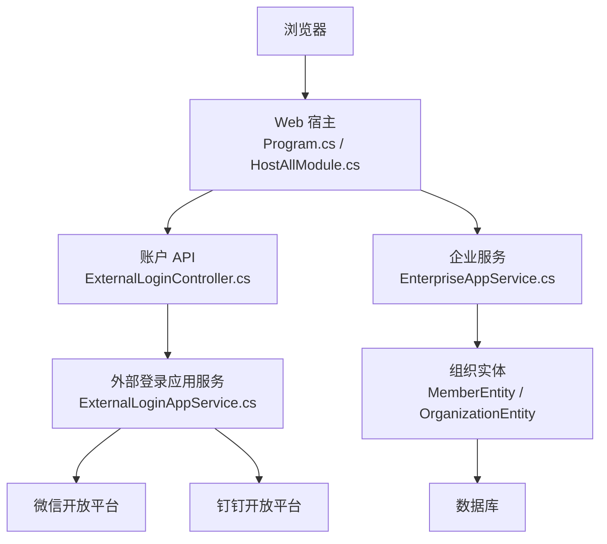
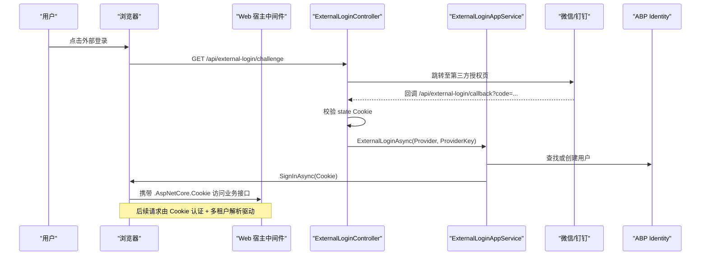
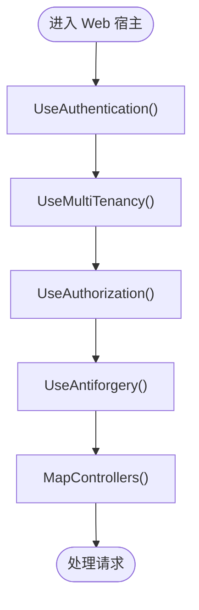
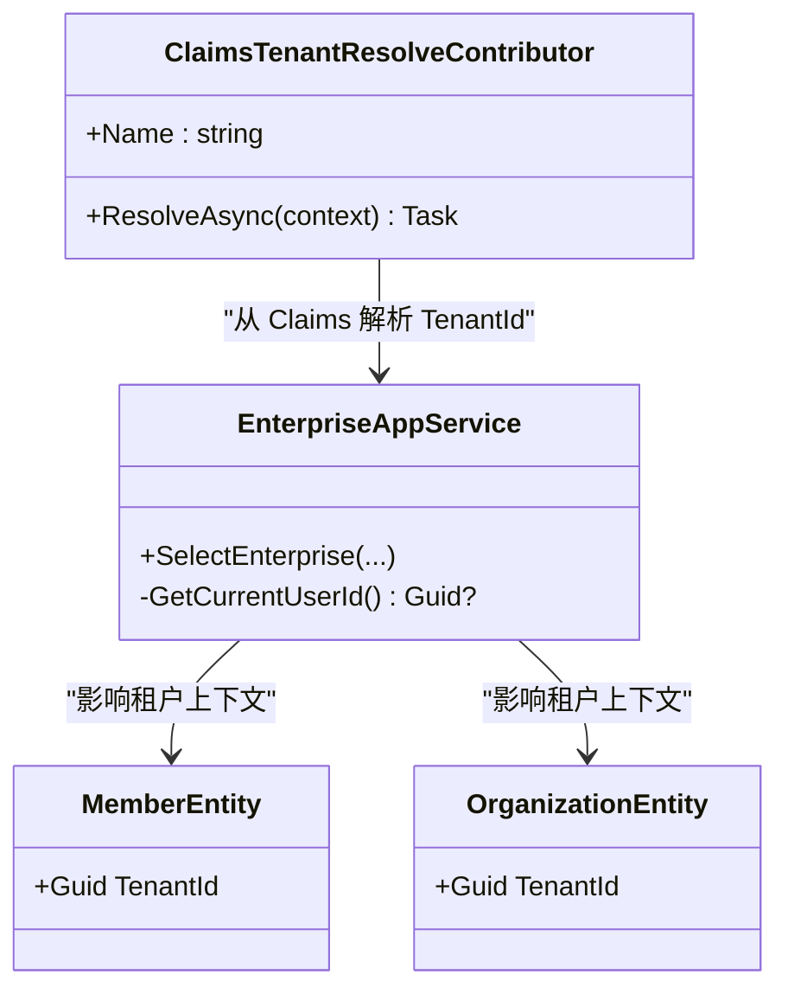
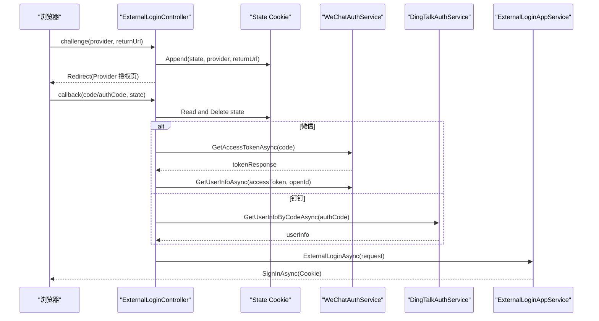
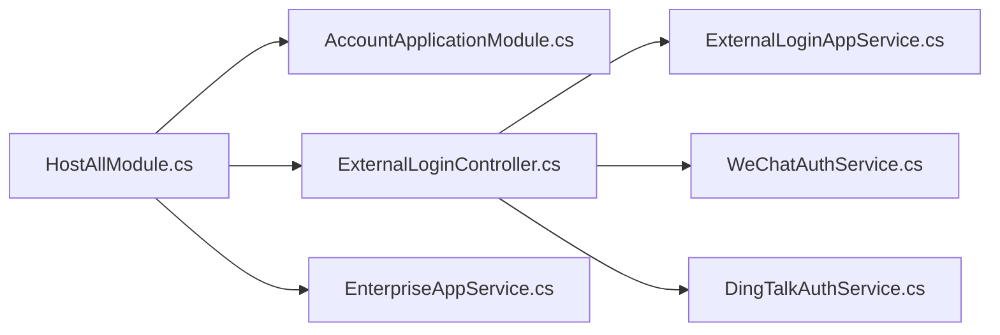

# 安全架构设计

<cite>
**本文引用的文件**   
- [Program.cs](file://src/Host/H.AppLab.Web.Host/H.AppLab.Web.Host/Program.cs)
- [HostAllModule.cs](file://src/Host/H.AppLab.Web.Host/H.AppLab.Web.Host/HostAllModule.cs)
- [ClaimsTenantResolveContributor.cs](file://src/Host/H.AppLab.Web.Host/H.AppLab.Web.Host/ClaimsTenantResolveContributor.cs)
- [ExternalLoginController.cs](file://src/Services/Account/H.Account.Application/ExternalLogin/ExternalLoginController.cs)
- [ExternalLoginAppService.cs](file://src/Services/Account/H.Account.Application/ExternalLogin/ExternalLoginAppService.cs)
- [WeChatAuthService.cs](file://src/Services/Account/H.Account.Application/ExternalLogin/WeChatAuthService.cs)
- [DingTalkAuthService.cs](file://src/Services/Account/H.Account.Application/ExternalLogin/DingTalkAuthService.cs)
- [ExternalLoginOptions.cs](file://src/Services/Account/H.Account.Application/ExternalLogin/ExternalLoginOptions.cs)
- [EnterpriseAppService.cs](file://src/System/Enterprise/H.Enterprise.Application/Services/EnterpriseAppService.cs)
- [EnterpriseEntity.cs](file://src/System/Enterprise/H.Enterprise.EntityFrameworkCore/Entities/EnterpriseEntity.cs)
- [MemberEntity.cs](file://src/Services/Organization/H.Organization.EntityFrameworkCore/Entities/MemberEntity.cs)
- [OrganizationEntity.cs](file://src/Services/Organization/H.Organization.EntityFrameworkCore/Entities/OrganizationEntity.cs)
</cite>

## 目录
1. [引言](#引言)
2. [项目结构与安全边界](#项目结构与安全边界)
3. [核心安全组件](#核心安全组件)
4. [系统架构总览](#系统架构总览)
5. [详细安全机制分析](#详细安全机制分析)
6. [依赖与耦合分析](#依赖与耦合分析)
7. [性能与安全权衡](#性能与安全权衡)
8. [故障排查指南](#故障排查指南)
9. [安全配置清单](#安全配置清单)
10. [结论](#结论)

## 引言
本文面向 H.AppLab 平台的安全架构，围绕认证授权、多租户隔离、跨站请求伪造防护、数据安全与网络安全五个维度展开。文档基于 Web 宿主入口、账户外部登录、企业租户选择及组织实体等源码实现进行分析，给出可操作的安全配置清单和最佳实践建议，帮助开发者在现有 ABP + Blazor + FastEndpoints 基础上持续强化安全性。

## 项目结构与安全边界
H.AppLab 是一个以 ABP 模块化为基础的多服务架构，Web 宿主负责统一认证、路由、中间件管线、静态资源与反向代理能力；账户服务提供本地与外部登录；企业模块负责租户标识管理；组织、审批、订单等业务模块共享统一的身份与租户上下文。

**图示来源**
- [Program.cs:54-93](file://src/Host/H.AppLab.Web.Host/H.AppLab.Web.Host/Program.cs#L54-L93)
- [HostAllModule.cs:104-197](file://src/Host/H.AppLab.Web.Host/H.AppLab.Web.Host/HostAllModule.cs#L104-L197)
- [ExternalLoginController.cs:1-200](file://src/Services/Account/H.Account.Application/ExternalLogin/ExternalLoginController.cs#L1-L200)
- [ExternalLoginAppService.cs:1-200](file://src/Services/Account/H.Account.Application/ExternalLogin/ExternalLoginAppService.cs#L1-L200)
- [EnterpriseAppService.cs:362-374](file://src/System/Enterprise/H.Enterprise.Application/Services/EnterpriseAppService.cs#L362-L374)
- [MemberEntity.cs:83](file://src/Services/Organization/H.Organization.EntityFrameworkCore/Entities/MemberEntity.cs#L83)
- [OrganizationEntity.cs:88](file://src/Services/Organization/H.Organization.EntityFrameworkCore/Entities/OrganizationEntity.cs#L88)

**章节来源**
- [Program.cs:1-112](file://src/Host/H.AppLab.Web.Host/H.AppLab.Web.Host/Program.cs#L1-L112)
- [HostAllModule.cs:1-207](file://src/Host/H.AppLab.Web.Host/H.AppLab.Web.Host/HostAllModule.cs#L1-L207)

## 核心安全组件
- Cookie 认证：默认使用 ASP.NET Core Cookie 认证方案，并注册一个系统级 Cookie Scheme，用于系统域内独立会话。
- 多租户：启用 ABP 多租户，自定义从 Claims 解析租户标识，并在无效租户时清理 Cookie 并重定向。
- 外部登录：通过微信与钉钉 OAuth 流程完成扫码登录，生成临时状态 Cookie，回调后转换为内部用户会话。
- CSRF 防护：禁用 ABP AntiForgery 自动验证，依赖 SameSite Cookie 与 HTTPS 作为主要防护手段。
- 网络安全：生产环境启用 HSTS 与 HTTPS 重定向；Blazor WASM 使用响应压缩优化传输。

**章节来源**
- [HostAllModule.cs:104-197](file://src/Host/H.AppLab.Web.Host/H.AppLab.Web.Host/HostAllModule.cs#L104-L197)
- [Program.cs:54-93](file://src/Host/H.AppLab.Web.Host/H.AppLab.Web.Host/Program.cs#L54-L93)

## 系统架构总览
下图展示一次典型的外部登录请求如何经过 Web 宿主中间件、外部登录控制器、外部登录应用服务，最终写入 Cookie 认证会话，并通过企业模块将租户标识注入后续请求。

**图示来源**
- [ExternalLoginController.cs:1-200](file://src/Services/Account/H.Account.Application/ExternalLogin/ExternalLoginController.cs#L1-L200)
- [ExternalLoginAppService.cs:1-200](file://src/Services/Account/H.Account.Application/ExternalLogin/ExternalLoginAppService.cs#L1-L200)
- [Program.cs:80-93](file://src/Host/H.AppLab.Web.Host/H.AppLab.Web.Host/Program.cs#L80-L93)

## 详细安全机制分析

### 认证与授权机制
- 认证方案
  - 默认使用 Cookie 认证方案，登录失败与拒绝访问均重定向到账户登录页面。
  - 额外注册系统级 Cookie Scheme，名称为独立 Cookie，便于系统域内会话隔离。
  - 会话过期时间设置为 24 小时，支持滑动过期。
- 授权中间件
  - 管道中启用认证与授权中间件，控制器可通过 ABP 的权限体系进行细粒度控制。
  - 外部登录控制器标注匿名访问，避免拦截第三方回调。

**图示来源**
- [Program.cs:80-93](file://src/Host/H.AppLab.Web.Host/H.AppLab.Web.Host/Program.cs#L80-L93)

**章节来源**
- [HostAllModule.cs:104-160](file://src/Host/H.AppLab.Web.Host/H.AppLab.Web.Host/HostAllModule.cs#L104-L160)
- [Program.cs:80-93](file://src/Host/H.AppLab.Web.Host/H.AppLab.Web.Host/Program.cs#L80-L93)

### 多租户安全隔离
- 租户标识解析
  - 启用 ABP 多租户，并注册自定义解析器：从当前 Principal 的 “TenantId” Claim 读取租户标识。
  - 该解析器插入到解析链首位，优先于 ABP 内置解析器生效。
- 企业切换与 Claim 更新
  - 企业模块在服务中选择企业后重新签发 Cookie，追加 “TenantId”“EnterpriseName”“EnterpriseId”“EnterpriseRole” 等 Claim。
  - 旧租户相关 Claim 被移除，防止陈旧上下文污染后续请求。
- 数据隔离策略
  - 组织相关实体包含 TenantId 字段，结合 ABP 多租户过滤，实现逻辑隔离。
- 无效租户处理
  - 当 __tenant Cookie 指向已删除租户时，中间件清理 Cookie 并签出默认认证方案，重定向首页，避免返回 404 阻断所有请求。

**图示来源**
- [ClaimsTenantResolveContributor.cs:1-29](file://src/Host/H.AppLab.Web.Host/H.AppLab.Web.Host/ClaimsTenantResolveContributor.cs#L1-L29)
- [EnterpriseAppService.cs:362-374](file://src/System/Enterprise/H.Enterprise.Application/Services/EnterpriseAppService.cs#L362-L374)
- [MemberEntity.cs:83](file://src/Services/Organization/H.Organization.EntityFrameworkCore/Entities/MemberEntity.cs#L83)
- [OrganizationEntity.cs:88](file://src/Services/Organization/H.Organization.EntityFrameworkCore/Entities/OrganizationEntity.cs#L88)

**章节来源**
- [HostAllModule.cs:161-207](file://src/Host/H.AppLab.Web.Host/H.AppLab.Web.Host/HostAllModule.cs#L161-L207)
- [ClaimsTenantResolveContributor.cs:1-29](file://src/Host/H.AppLab.Web.Host/H.AppLab.Web.Host/ClaimsTenantResolveContributor.cs#L1-L29)
- [EnterpriseAppService.cs:362-374](file://src/System/Enterprise/H.Enterprise.Application/Services/EnterpriseAppService.cs#L362-L374)

### 外部登录集成与状态保护
- 提供方
  - 微信开放平台：扫码登录，回调获取 access_token 与 openid，再拉取用户信息。
  - 钉钉开放平台：新版 OAuth2，使用 authCode 换取 accessToken，再调用用户信息接口。
- 状态保护
  - 发起挑战时生成随机 state，并写入 HttpOnly、Secure、SameSite=Lax 的临时 Cookie，有效期 5 分钟。
  - 回调时校验 state，失败则直接重定向登录页并提示错误。
- 会话建立
  - 外部登录成功后，根据 provider 与 providerKey 绑定或创建用户，写入 Cookie 认证会话。
  - 新用户自动生成满足密码策略的随机密码，并设置持久化 Cookie。

**图示来源**
- [ExternalLoginController.cs:1-200](file://src/Services/Account/H.Account.Application/ExternalLogin/ExternalLoginController.cs#L1-L200)
- [WeChatAuthService.cs:1-118](file://src/Services/Account/H.Account.Application/ExternalLogin/WeChatAuthService.cs#L1-L118)
- [DingTalkAuthService.cs:1-139](file://src/Services/Account/H.Account.Application/ExternalLogin/DingTalkAuthService.cs#L1-L139)
- [ExternalLoginAppService.cs:1-200](file://src/Services/Account/H.Account.Application/ExternalLogin/ExternalLoginAppService.cs#L1-L200)

**章节来源**
- [ExternalLoginController.cs:1-200](file://src/Services/Account/H.Account.Application/ExternalLogin/ExternalLoginController.cs#L1-L200)
- [ExternalLoginAppService.cs:1-200](file://src/Services/Account/H.Account.Application/ExternalLogin/ExternalLoginAppService.cs#L1-L200)
- [ExternalLoginOptions.cs:1-21](file://src/Services/Account/H.Account.Application/ExternalLogin/ExternalLoginOptions.cs#L1-L21)

### CSRF 防护机制与 AntiForgery 禁用原因
- 现状
  - 管道启用了 UseAntiforgery()，但 ABP AntiForgery 的 AutoValidate 被显式关闭。
  - 官方注释说明：WASM 应用使用 JSON API + Cookie 认证，不需要服务端 CSRF 验证；SameSite Cookie 已提供足够保护。
- 风险评估
  - 关闭 AntiForgery 自动验证意味着服务端不会强制校验表单令牌；若前端未正确设置 SameSite 或未强制 HTTPS，仍可能面临 CSRF 风险。
  - 当前实现对外部登录回调使用了 Secure、HttpOnly、SameSite=Lax 的临时 Cookie，提升了状态安全性。
- 建议
  - 对写操作接口保持最小暴露面，仅允许受信任来源。
  - 对非表单场景（JSON API），可在关键写接口上增加自定义防重放或一次性 Token 机制。
  - 确保部署环境中 AlwaysRequireHttps 与 SameSite=None; Secure 策略一致，避免开发环境与生产环境行为差异。

**章节来源**
- [HostAllModule.cs:104-120](file://src/Host/H.AppLab.Web.Host/H.AppLab.Web.Host/HostAllModule.cs#L104-L120)
- [Program.cs:80-93](file://src/Host/H.AppLab.Web.Host/H.AppLab.Web.Host/Program.cs#L80-L93)
- [ExternalLoginController.cs:60-90](file://src/Services/Account/H.Account.Application/ExternalLogin/ExternalLoginController.cs#L60-L90)

### 数据安全保护措施
- 敏感信息加密
  - 当前源码未看到显式的数据库列加密或敏感配置项加密实现；外部登录客户端密钥通过 ProviderOptions 配置注入。
  - 建议对 ClientSecret、CallbackPath 等敏感配置进行环境变量或密钥管理服务管理，避免明文落盘。
- 输入验证
  - 外部登录回调对 code/authCode 与 state 进行了基本校验；用户显示名做了简单用户名构造与去重。
  - 建议在 DTO 层引入 FluentValidation 或 Abp Validation，对所有外部输入进行白名单校验。
- SQL 注入防护
  - 项目使用 EF Core，查询应使用参数化查询；当前未发现直接拼接 SQL 的代码片段。
  - 建议审计所有自定义 SQL 与 RawQuery，确保无字符串拼接。

**章节来源**
- [ExternalLoginController.cs:90-160](file://src/Services/Account/H.Account.Application/ExternalLogin/ExternalLoginController.cs#L90-L160)
- [ExternalLoginOptions.cs:1-21](file://src/Services/Account/H.Account.Application/ExternalLogin/ExternalLoginOptions.cs#L1-L21)

### 网络安全配置
- HTTPS 强制
  - 生产环境启用 UseHttpsRedirection()，非开发环境启用 UseExceptionHandler 与 UseHsts()。
- HSTS
  - 三个宿主入口均启用 HSTS：Web 宿主、账户宿主、渲染引擎宿主。
- CORS
  - 源码中未发现 AddCors 或 CorsOptions 配置；如前后端跨域部署，需在反向代理或网关层统一处理跨域策略，避免在服务端放宽 CORS。
- SameSite
  - 外部登录临时状态 Cookie 使用 SameSite=Lax；Cookie 认证默认策略由 ASP.NET Core 决定，建议在生产环境中设置为 Strict 或配合 SameSite=None; Secure 的场景谨慎评估。

**章节来源**
- [Program.cs:54-74](file://src/Host/H.AppLab.Web.Host/H.AppLab.Web.Host/Program.cs#L54-L74)
- [Program.cs:64-74](file://src/Host/H.AppLab.Web.Host/H.AppLab.Web.Host/Program.cs#L64-L74)

## 依赖与耦合分析
- 宿主模块依赖多个应用模块，形成松耦合的服务边界；认证、多租户、外部登录集中在宿主模块与应用服务中。
- 外部登录服务依赖 HttpClient 与 IOptions<ExternalLoginOptions>，降低对第三方平台的硬编码耦合。
- 企业模块通过 Claim 注入租户标识，与组织实体的 TenantId 字段形成逻辑关联。

**图示来源**
- [HostAllModule.cs:1-207](file://src/Host/H.AppLab.Web.Host/H.AppLab.Web.Host/HostAllModule.cs#L1-L207)
- [ExternalLoginController.cs:1-200](file://src/Services/Account/H.Account.Application/ExternalLogin/ExternalLoginController.cs#L1-L200)
- [ExternalLoginAppService.cs:1-200](file://src/Services/Account/H.Account.Application/ExternalLogin/ExternalLoginAppService.cs#L1-L200)
- [WeChatAuthService.cs:1-118](file://src/Services/Account/H.Account.Application/ExternalLogin/WeChatAuthService.cs#L1-L118)
- [DingTalkAuthService.cs:1-139](file://src/Services/Account/H.Account.Application/ExternalLogin/DingTalkAuthService.cs#L1-L139)
- [EnterpriseAppService.cs:362-374](file://src/System/Enterprise/H.Enterprise.Application/Services/EnterpriseAppService.cs#L362-L374)

**章节来源**
- [HostAllModule.cs:1-207](file://src/Host/H.AppLab.Web.Host/H.AppLab.Web.Host/HostAllModule.cs#L1-L207)

## 性能与安全权衡
- 响应压缩
  - 启用 Brotli 与 Gzip 压缩，提升 WASM 程序集传输效率；压缩选项级别设为 Optimal。
- SignalR
  - 最大接收消息大小设置为 1MB，需评估是否足以应对业务负载，同时避免过大消息被滥用。
- Cookie 会话
  - 24 小时滑动过期适合长期在线场景，但需结合安全策略定期刷新或缩短超时。
- HSTS 与 HTTPS
  - 开启 HSTS 可提升安全性，但需注意首屏加载与缓存策略；建议结合 CDN 与反向代理优化。

**章节来源**
- [Program.cs:18-53](file://src/Host/H.AppLab.Web.Host/H.AppLab.Web.Host/Program.cs#L18-L53)
- [Program.cs:54-74](file://src/Host/H.AppLab.Web.Host/H.AppLab.Web.Host/Program.cs#L54-L74)

## 故障排查指南
- 外部登录失败
  - 检查 provider 是否启用；确认 ExternalLoginOptions 中 ClientId 与 ClientSecret 配置正确。
  - 查看回调 URL 是否正确，state Cookie 是否存在且未过期。
  - 微信/钉钉接口返回码与用户信息是否完整。
- 会话无法登录
  - 检查 Cookie 是否被浏览器策略拦截（SameSite、Secure、HttpOnly）。
  - 确认 UseAuthentication 与 UseAuthorization 顺序正确。
- 多租户数据异常
  - 确认 EnterpriseAppService 是否正确签发包含 TenantId 的 Cookie。
  - 检查 __tenant Cookie 是否指向有效租户；若无效，中间件会清理并重定向首页。
- 反 CSRF 问题
  - 若前端表单提交出现 400/403，检查是否依赖服务端 AntiForgery；当前已关闭自动验证，需改用 SameSite 与 HTTPS 策略。

**章节来源**
- [ExternalLoginController.cs:60-160](file://src/Services/Account/H.Account.Application/ExternalLogin/ExternalLoginController.cs#L60-L160)
- [HostAllModule.cs:161-207](file://src/Host/H.AppLab.Web.Host/H.AppLab.Web.Host/HostAllModule.cs#L161-L207)
- [Program.cs:80-93](file://src/Host/H.AppLab.Web.Host/H.AppLab.Web.Host/Program.cs#L80-L93)

## 安全配置清单
- 认证与授权
  - 启用 Cookie 认证方案，区分系统与默认会话 Cookie。
  - 登录与拒绝访问路径指向账户登录页。
  - 外部登录控制器标注匿名访问。
- 多租户
  - 启用 ABP 多租户。
  - 注册 ClaimsTenantResolveContributor，优先从 Claim 解析租户。
  - 企业模块签发包含 TenantId 的 Cookie。
  - 无效租户清理 __tenant Cookie 并重定向首页。
- CSRF
  - 关闭 ABP AntiForgery 自动验证。
  - 使用 SameSite Cookie 与 HTTPS 作为主要防护。
  - 对外部登录状态 Cookie 设置 HttpOnly、Secure、SameSite=Lax。
- 数据安全
  - 对敏感配置项进行环境变量或密钥管理。
  - 对所有外部输入进行严格校验。
  - 审计自定义 SQL，确保参数化查询。
- 网络安全
  - 生产环境启用 HTTPS 重定向与 HSTS。
  - 谨慎配置 CORS，避免放宽跨域策略。
  - 在反向代理层统一处理跨域与 TLS 终止。

**章节来源**
- [HostAllModule.cs:104-207](file://src/Host/H.AppLab.Web.Host/H.AppLab.Web.Host/HostAllModule.cs#L104-L207)
- [Program.cs:54-93](file://src/Host/H.AppLab.Web.Host/H.AppLab.Web.Host/Program.cs#L54-L93)
- [ExternalLoginController.cs:60-90](file://src/Services/Account/H.Account.Application/ExternalLogin/ExternalLoginController.cs#L60-L90)

## 结论
H.AppLab 平台在认证授权、多租户隔离与外部登录方面具备较完整的实现基础。当前安全策略以 Cookie 认证、Claim 驱动的租户解析、SameSite Cookie 与 HTTPS/HSTS 为主，同时通过禁用 AntiForgery 自动验证简化了 WASM 场景下的跨站请求处理。建议在后续迭代中加强输入验证、敏感配置管理与 SQL 注入审计，并对 CORS 策略进行集中治理，以确保在多租户、多服务环境下的一致性与可维护性。