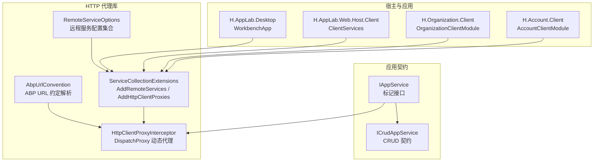
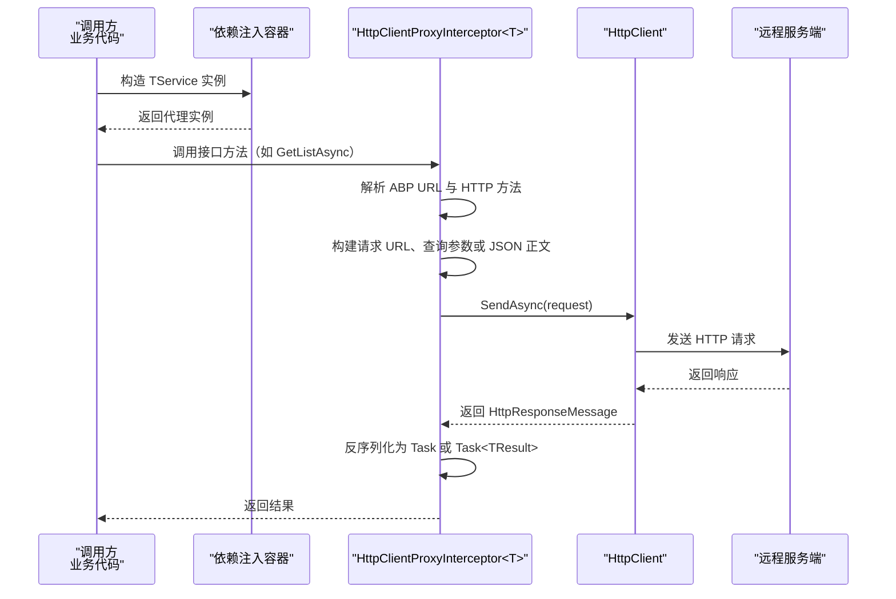
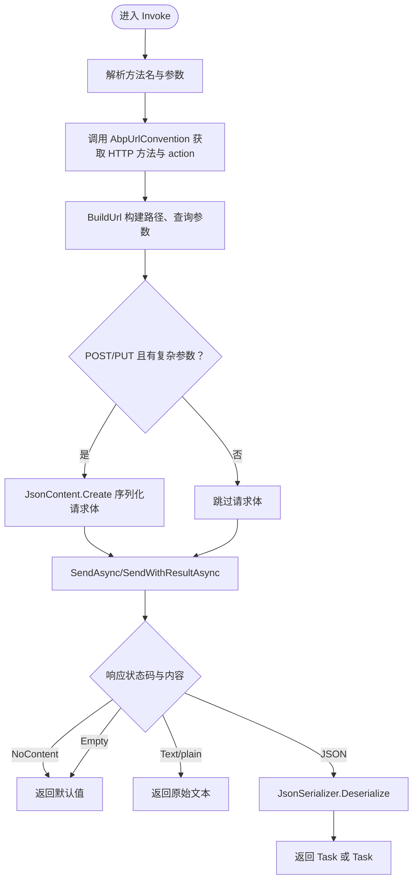
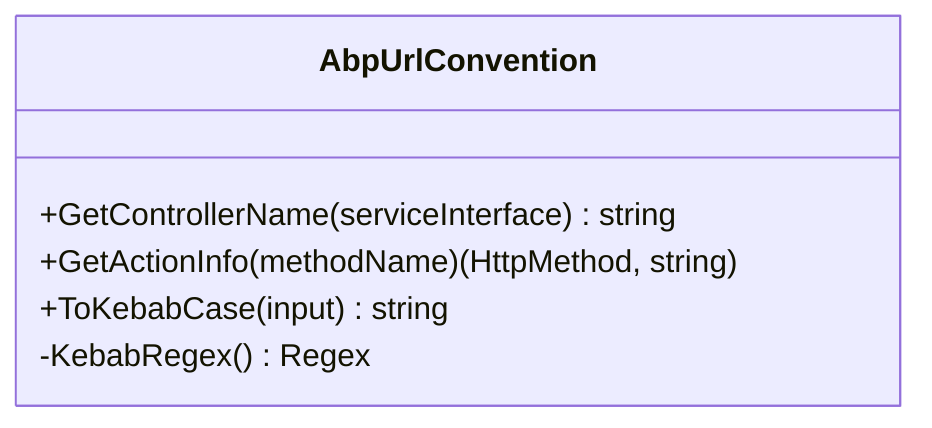
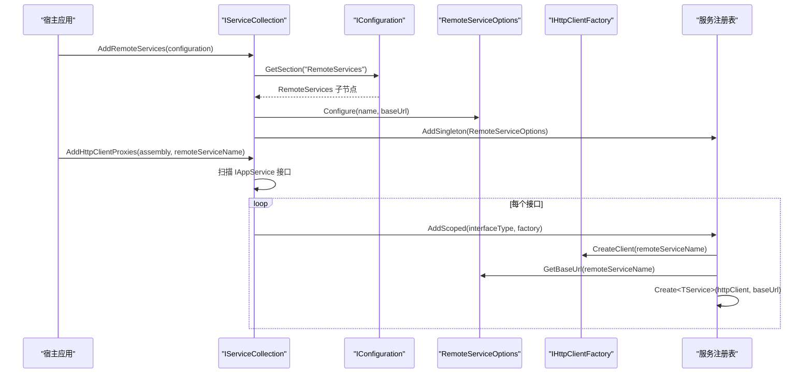
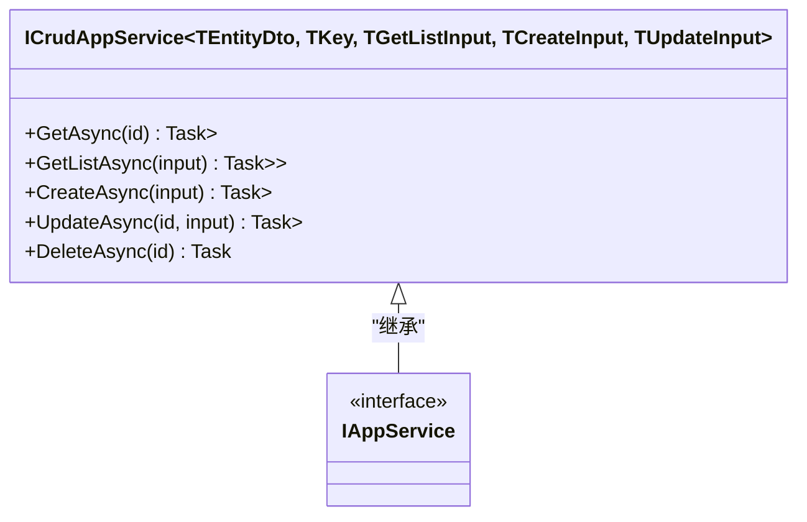
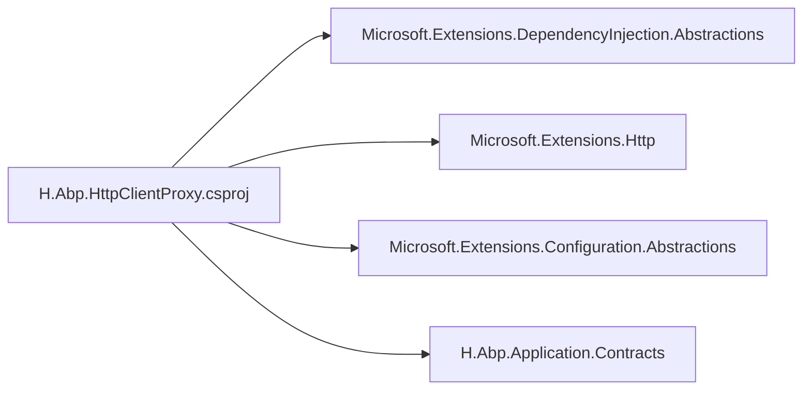

# HTTP 代理扩展

<cite>
**本文引用的文件**   
- [HttpClientProxyInterceptor.cs](file://src/Utils/H.Abp.HttpClientProxy/HttpClientProxyInterceptor.cs)
- [ServiceCollectionExtensions.cs](file://src/Utils/H.Abp.HttpClientProxy/ServiceCollectionExtensions.cs)
- [AbpUrlConvention.cs](file://src/Utils/H.Abp.HttpClientProxy/AbpUrlConvention.cs)
- [RemoteServiceOptions.cs](file://src/Utils/H.Abp.HttpClientProxy/RemoteServiceOptions.cs)
- [H.Abp.HttpClientProxy.csproj](file://src/Utils/H.Abp.HttpClientProxy/H.Abp.HttpClientProxy.csproj)
- [IAppService.cs](file://src/Utils/H.Abp.Application.Contracts/IAppService.cs)
- [ICrudAppService.cs](file://src/Utils/H.Abp.Application.Contracts/ICrudAppService.cs)
- [WorkbenchApp.cs](file://src/Host/H.AppLab.Desktop/WorkbenchApp.cs)
- [ClientServices.cs](file://src/Host/H.AppLab.Web.Host/H.AppLab.Web.Host.Client/ClientServices.cs)
- [OrganizationClientModule.cs](file://src/Services/Organization/H.Organization.Client/OrganizationClientModule.cs)
- [AccountClientModule.cs](file://src/Services/Account/H.Account.Client/AccountClientModule.cs)
</cite>

## 目录
1. [引言](#引言)
2. [项目结构](#项目结构)
3. [核心组件](#核心组件)
4. [架构总览](#架构总览)
5. [详细组件分析](#详细组件分析)
6. [依赖关系分析](#依赖关系分析)
7. [性能与可靠性](#性能与可靠性)
8. [自定义拦截器开发指南](#自定义拦截器开发指南)
9. [远程服务配置](#远程服务配置)
10. [最佳实践](#最佳实践)
11. [故障排查](#故障排查)
12. [结论](#结论)

## 引言
本文件面向 AppLab 平台开发者，系统性说明基于 DispatchProxy 的 HTTP 代理扩展。重点包括：
- HttpClientProxyInterceptor 的动态代理实现原理；
- IAppService 接口的自动代理生成机制；
- ABP URL 约定解析器的工作方式；
- ServiceCollectionExtensions 提供的 AddRemoteServices 与 AddHttpClientProxies 扩展方法；
- 远程服务配置 RemoteServiceOptions 的使用方式；
- 如何扩展认证、日志、监控等请求拦截能力；
- 连接池、超时、重试与熔断降级的工程建议。

## 项目结构
HTTP 代理扩展位于 Utils 层，由两个主要程序集组成：
- H.Abp.Application.Contracts：定义 IAppService 标记接口及通用 CRUD 应用服务契约；
- H.Abp.HttpClientProxy：提供基于 DispatchProxy 的 HTTP 客户端代理、URL 约定解析、依赖注入扩展和远程服务配置。



**图表来源**
- [HttpClientProxyInterceptor.cs:1-234](file://src/Utils/H.Abp.HttpClientProxy/HttpClientProxyInterceptor.cs#L1-L234)
- [ServiceCollectionExtensions.cs:1-63](file://src/Utils/H.Abp.HttpClientProxy/ServiceCollectionExtensions.cs#L1-L63)
- [AbpUrlConvention.cs:1-86](file://src/Utils/H.Abp.HttpClientProxy/AbpUrlConvention.cs#L1-L86)
- [RemoteServiceOptions.cs:1-33](file://src/Utils/H.Abp.HttpClientProxy/RemoteServiceOptions.cs#L1-L33)
- [IAppService.cs:1-8](file://src/Utils/H.Abp.Application.Contracts/IAppService.cs#L1-L8)
- [ICrudAppService.cs:1-15](file://src/Utils/H.Abp.Application.Contracts/ICrudAppService.cs#L1-L15)
- [WorkbenchApp.cs:31-48](file://src/Host/H.AppLab.Desktop/WorkbenchApp.cs#L31-L48)
- [ClientServices.cs:19-165](file://src/Host/H.AppLab.Web.Host/H.AppLab.Web.Host.Client/ClientServices.cs#L19-L165)
- [OrganizationClientModule.cs:16-16](file://src/Services/Organization/H.Organization.Client/OrganizationClientModule.cs#L16-L16)
- [AccountClientModule.cs:16-16](file://src/Services/Account/H.Account.Client/AccountClientModule.cs#L16-L16)

**章节来源**
- [H.Abp.HttpClientProxy.csproj:1-11](file://src/Utils/H.Abp.HttpClientProxy/H.Abp.HttpClientProxy.csproj#L1-L11)

## 核心组件
- HttpClientProxyInterceptor<TService>：基于 System.Net.DispatchProxy 的动态代理，拦截 TService 接口方法调用，转换为 HTTP 请求并返回 Task 或 Task<TResult>。
- AbpUrlConvention：将接口名与方法名解析为 ABP 风格的控制器名、HTTP 方法与 action 路径，并处理 kebab-case 转换。
- RemoteServiceOptions：维护多个远程服务的 BaseUrl 映射，从 IConfiguration.RemoteServices 节点加载。
- ServiceCollectionExtensions：提供 AddRemoteServices 与 AddHttpClientProxies，完成远程服务配置加载与服务接口代理注册。
- IAppService：所有可通过 HTTP 代理远程调用的服务接口必须继承该标记接口。

**章节来源**
- [HttpClientProxyInterceptor.cs:1-234](file://src/Utils/H.Abp.HttpClientProxy/HttpClientProxyInterceptor.cs#L1-L234)
- [AbpUrlConvention.cs:1-86](file://src/Utils/H.Abp.HttpClientProxy/AbpUrlConvention.cs#L1-L86)
- [RemoteServiceOptions.cs:1-33](file://src/Utils/H.Abp.HttpClientProxy/RemoteServiceOptions.cs#L1-L33)
- [ServiceCollectionExtensions.cs:1-63](file://src/Utils/H.Abp.HttpClientProxy/ServiceCollectionExtensions.cs#L1-L63)
- [IAppService.cs:1-8](file://src/Utils/H.Abp.Application.Contracts/IAppService.cs#L1-L8)

## 架构总览
下图展示一次远程方法调用从业务代码到 HTTP 响应的完整流程：



**图表来源**
- [HttpClientProxyInterceptor.cs:20-90](file://src/Utils/H.Abp.HttpClientProxy/HttpClientProxyInterceptor.cs#L20-L90)
- [HttpClientProxyInterceptor.cs:91-199](file://src/Utils/H.Abp.HttpClientProxy/HttpClientProxyInterceptor.cs#L91-L199)
- [HttpClientProxyInterceptor.cs:201-234](file://src/Utils/H.Abp.HttpClientProxy/HttpClientProxyInterceptor.cs#L201-L234)
- [AbpUrlConvention.cs:1-86](file://src/Utils/H.Abp.HttpClientProxy/AbpUrlConvention.cs#L1-L86)

## 详细组件分析

### HttpClientProxyInterceptor：动态代理实现原理
HttpClientProxyInterceptor<TService> 继承自 DispatchProxy，通过覆盖 Invoke 方法拦截所有接口方法调用。其关键行为如下：
- Initialize 阶段：保存 HttpClient、baseUrl，并解析服务接口对应的控制器名称。
- Invoke 阶段：
  - 使用 AbpUrlConvention.GetActionInfo 解析 HTTP 方法与 action 路径；
  - BuildUrl 构建最终 URL：支持 id 前缀段、Id 后缀段、简单参数查询字符串、GET/DELETE 复杂类型展开为查询参数；
  - 对 POST/PUT 且存在复杂参数的情况，使用 JsonContent 序列化到请求体；
  - 根据返回值类型分发到 SendAsync 或泛型 SendWithResultAsync；
  - 响应处理：空响应返回默认值，text/* 直接返回字符串，否则按 JsonSerializerOptions 反序列化。



**图表来源**
- [HttpClientProxyInterceptor.cs:20-90](file://src/Utils/H.Abp.HttpClientProxy/HttpClientProxyInterceptor.cs#L20-L90)
- [HttpClientProxyInterceptor.cs:91-199](file://src/Utils/H.Abp.HttpClientProxy/HttpClientProxyInterceptor.cs#L91-L199)
- [HttpClientProxyInterceptor.cs:201-234](file://src/Utils/H.Abp.HttpClientProxy/HttpClientProxyInterceptor.cs#L201-L234)

**章节来源**
- [HttpClientProxyInterceptor.cs:1-234](file://src/Utils/H.Abp.HttpClientProxy/HttpClientProxyInterceptor.cs#L1-L234)

### AbpUrlConvention：ABP URL 约定解析
AbpUrlConvention 负责：
- 将服务接口名转换为 kebab-case 控制器名，去除 I 前缀与 AppService/ApplicationService 后缀；
- 根据方法名前缀映射 HTTP 方法与 action 路径，例如 GetList、GetAll、Get、Put、Update、Delete、Remove、Create、Add、Insert、Post、Patch；
- 无匹配前缀时默认使用 POST，并将完整方法名转为 kebab-case 作为 action；
- ToKebabCase 采用与 ABP 一致的规则：先 camelCase，再在大写字母处插入连字符。



**图表来源**
- [AbpUrlConvention.cs:1-86](file://src/Utils/H.Abp.HttpClientProxy/AbpUrlConvention.cs#L1-L86)

**章节来源**
- [AbpUrlConvention.cs:1-86](file://src/Utils/H.Abp.HttpClientProxy/AbpUrlConvention.cs#L1-L86)

### ServiceCollectionExtensions：依赖注入扩展点
ServiceCollectionExtensions 暴露两个关键扩展方法：
- AddRemoteServices：读取 IConfiguration 中 RemoteServices 子节点，逐个子项提取 BaseUrl 并写入 RemoteServiceOptions；
- AddHttpClientProxies：扫描指定程序集中所有继承 IAppService 的接口，并为每个接口注册一个 Scoped 服务，实际类型为 HttpClientProxyInterceptor<TService> 的静态 Create 工厂方法生成的代理实例。



**图表来源**
- [ServiceCollectionExtensions.cs:16-33](file://src/Utils/H.Abp.HttpClientProxy/ServiceCollectionExtensions.cs#L16-L33)
- [ServiceCollectionExtensions.cs:35-63](file://src/Utils/H.Abp.HttpClientProxy/ServiceCollectionExtensions.cs#L35-L63)

**章节来源**
- [ServiceCollectionExtensions.cs:1-63](file://src/Utils/H.Abp.HttpClientProxy/ServiceCollectionExtensions.cs#L1-L63)

### IAppService 与 ICrudAppService：接口契约
- IAppService：仅作为标记接口，用于标识可通过 HTTP 代理远程调用的服务接口；
- ICrudAppService<TEntityDto, TKey, TGetListInput, TCreateInput, TUpdateInput>：定义标准 CRUD 操作，返回统一包装 BaseOutput<T> 与分页 PagedResultDto<T>。



**图表来源**
- [IAppService.cs:1-8](file://src/Utils/H.Abp.Application.Contracts/IAppService.cs#L1-L8)
- [ICrudAppService.cs:1-15](file://src/Utils/H.Abp.Application.Contracts/ICrudAppService.cs#L1-L15)

**章节来源**
- [IAppService.cs:1-8](file://src/Utils/H.Abp.Application.Contracts/IAppService.cs#L1-L8)
- [ICrudAppService.cs:1-15](file://src/Utils/H.Abp.Application.Contracts/ICrudAppService.cs#L1-L15)

## 依赖关系分析
H.Abp.HttpClientProxy 依赖以下外部库与内部模块：
- Microsoft.Extensions.DependencyInjection.Abstractions：提供 IServiceCollection 抽象；
- Microsoft.Extensions.Http：提供 IHttpClientFactory 与 HttpClient 扩展；
- Microsoft.Extensions.Configuration.Abstractions：读取 IConfiguration；
- H.Abp.Application.Contracts：引用 IAppService 与 ICrudAppService。



**图表来源**
- [H.Abp.HttpClientProxy.csproj:1-11](file://src/Utils/H.Abp.HttpClientProxy/H.Abp.HttpClientProxy.csproj#L1-L11)

**章节来源**
- [H.Abp.HttpClientProxy.csproj:1-11](file://src/Utils/H.Abp.HttpClientProxy/H.Abp.HttpClientProxy.csproj#L1-L11)

## 性能与可靠性
当前实现的性能与可靠性特征如下：
- 连接池管理：通过 IHttpClientFactory 创建 HttpClient，复用底层连接池；
- 超时配置：未显式设置 HttpClient.Timeout，应通过外部 IHttpClientBuilder 配置；
- 错误处理：HttpResponse.EnsureSuccessStatusCode 抛出非成功状态异常；
- 重试与熔断：未内置重试与熔断逻辑，需通过 Polly 或外部中间件扩展；
- 反序列化：使用统一的 JsonSerializerOptions，驼峰命名、属性名忽略大小写。

优化建议：
- 在 IHttpClientFactory 配置中设置合理的 Timeout、MaxConnectionsPerServer；
- 引入 Polly 配置 Retry/CircuitBreaker 策略；
- 对大响应体启用流式读取或限制最大响应长度；
- 对频繁访问的服务开启 HttpClient 缓存策略。

[本节为通用指导，不直接分析具体源码]

## 自定义拦截器开发指南
当前 HttpClientProxyInterceptor 直接调用 HttpClient.SendAsync，没有暴露可插拔的请求/响应拦截器链。若需要认证令牌注入、日志记录、性能监控等功能，推荐两种方案：

### 方案一：通过 IHttpClientFactory 添加全局 HttpClient 管道
- 使用 services.AddHttpClient(remoteServiceName) 配置 HttpClient；
- 使用 IHttpClientBuilder.AddHttpMessageHandler 注册自定义 DelegatingHandler；
- 在 Handler 中统一注入认证头、记录日志、统计耗时、处理重试与熔断。

优点：
- 对所有远程服务统一生效；
- 无需修改 HttpClientProxyInterceptor；
- 符合 .NET HttpClient 生态最佳实践。

注意：
- 认证令牌应从安全存储或服务上下文获取；
- 避免在 Handler 中泄露敏感信息；
- 控制日志级别与采样率，避免性能影响。

### 方案二：封装 HttpClientProxyInterceptor 扩展
- 新增一个继承 HttpClientProxyInterceptor<TService> 的子类；
- 重写 Invoke 或在 Initialize 后注入额外逻辑；
- 在 SendAsync/SendWithResultAsync 前后添加计时、日志与异常捕获；
- 通过反射或新的工厂方法替换 Create 行为。

风险：
- 依赖反射调用 Create 与内部字段，耦合度高；
- 升级版本时需验证兼容性。

[本节为通用指导，不直接分析具体源码]

## 远程服务配置
RemoteServiceOptions 支持多服务路由，每个服务通过 name 键映射 BaseUrl。配置来源于 IConfiguration 的 RemoteServices 节点，格式示例如下：

```json
{
  "RemoteServices": {
    "Workbench": "https://workbench.example.com",
    "Account": "https://account.example.com",
    "Organization": "https://organization.example.com"
  }
}
```

在多服务场景下：
- 不同服务可对应不同的 BaseUrl；
- 同一服务名被多次 AddHttpClientProxies 调用时会复用已注册的 RemoteServiceOptions；
- 未配置的远程服务名会返回空 BaseUrl，调用时将触发异常。

**章节来源**
- [RemoteServiceOptions.cs:1-33](file://src/Utils/H.Abp.HttpClientProxy/RemoteServiceOptions.cs#L1-L33)
- [ServiceCollectionExtensions.cs:16-33](file://src/Utils/H.Abp.HttpClientProxy/ServiceCollectionExtensions.cs#L16-L33)

## 最佳实践
- 连接池管理
  - 始终通过 IHttpClientFactory 创建 HttpClient；
  - 合理设置 MaxConnectionsPerServer 与 Timeout；
  - 避免在业务代码中直接 new HttpClient。

- 超时配置
  - 为每个远程服务设置独立 Timeout；
  - 对长任务调用考虑单独配置更长的 Timeout。

- 错误重试机制
  - 使用 Polly 配置指数退避重试；
  - 仅对幂等请求重试 GET、HEAD、OPTIONS、TRACE；
  - 区分网络异常与业务错误，避免无限重试。

- 熔断降级
  - 对不稳定下游服务启用 CircuitBreaker；
  - 配置失败阈值、冷却时间、熔断恢复策略；
  - 提供降级响应或本地缓存兜底。

- 认证与安全
  - 通过 DelegatingHandler 注入 Authorization 头；
  - 使用安全存储保存令牌，避免硬编码；
  - 对敏感日志脱敏。

- 日志与监控
  - 记录请求 URL、方法、耗时、状态码；
  - 避免记录请求体与响应体中的敏感数据；
  - 结合分布式追踪 ID 进行链路追踪。

[本节为通用指导，不直接分析具体源码]

## 故障排查
常见问题与定位建议：
- 无法解析远程服务 BaseUrl
  - 检查 appsettings.json 中 RemoteServices 节点是否存在；
  - 确认服务名与 AddHttpClientProxies 传入的 remoteServiceName 一致；
  - 查看 RemoteServiceOptions.GetBaseUrl 是否返回空字符串。

- 404 或路由不匹配
  - 检查接口方法名是否符合 ABP 约定前缀；
  - 确认控制器名是否为 kebab-case；
  - 核对 id 与 Id 参数位置是否与约定一致。

- 请求体为空或反序列化失败
  - 确认 POST/PUT 的参数是否为复杂类型；
  - 检查返回值类型是否为 Task 或 Task<TResult>；
  - 查看服务端 Content-Type 是否为 application/json。

- 非成功状态异常
  - EnsureSuccessStatusCode 会在非 2xx 时抛出异常；
  - 在服务端返回错误时应记录状态码与响应消息。

**章节来源**
- [HttpClientProxyInterceptor.cs:20-90](file://src/Utils/H.Abp.HttpClientProxy/HttpClientProxyInterceptor.cs#L20-L90)
- [HttpClientProxyInterceptor.cs:201-234](file://src/Utils/H.Abp.HttpClientProxy/HttpClientProxyInterceptor.cs#L201-L234)
- [ServiceCollectionExtensions.cs:16-63](file://src/Utils/H.Abp.HttpClientProxy/ServiceCollectionExtensions.cs#L16-L63)

## 结论
AppLab 平台的 HTTP 代理扩展以 IAppService 为入口，通过 HttpClientProxyInterceptor 与 AbpUrlConvention 实现 ABP 风格动态代理，再由 ServiceCollectionExtensions 完成远程服务配置加载与服务代理注册。当前实现简洁高效，适合快速对接 ABP 后端服务；在生产环境中，建议通过 IHttpClientFactory 与 Polly 增强连接池、超时、重试与熔断能力，并通过自定义 DelegatingHandler 实现认证、日志与监控的统一治理。

[本节为总结性内容，不直接分析具体源码]