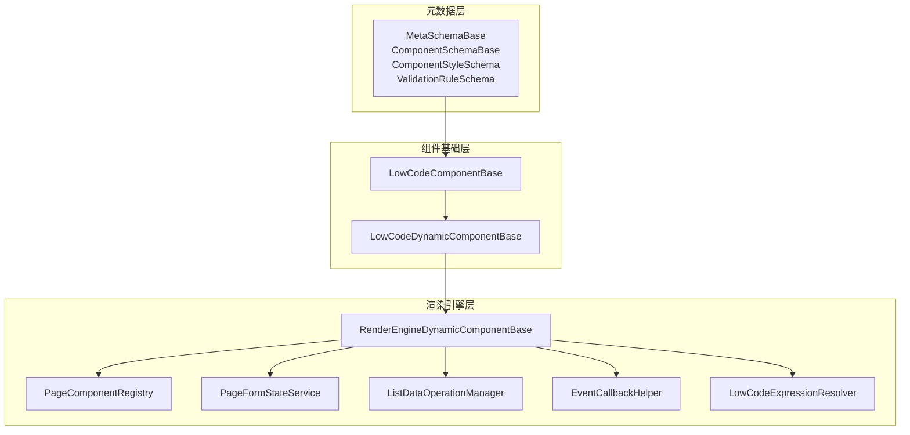
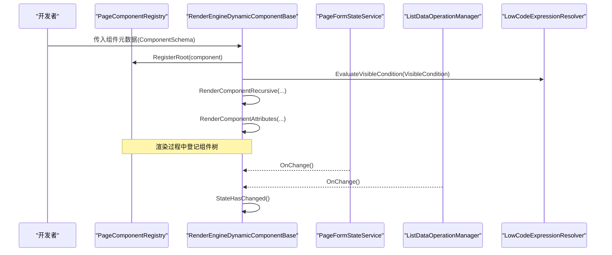
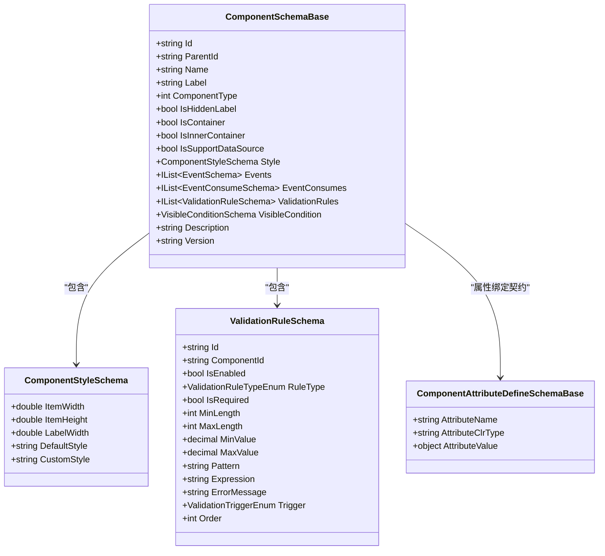
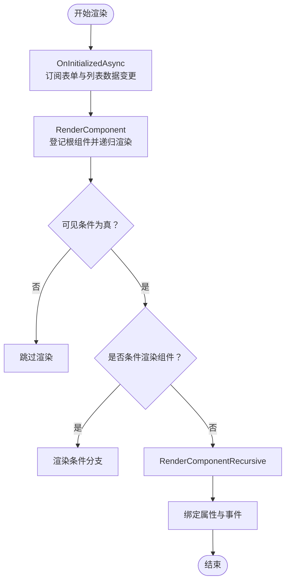
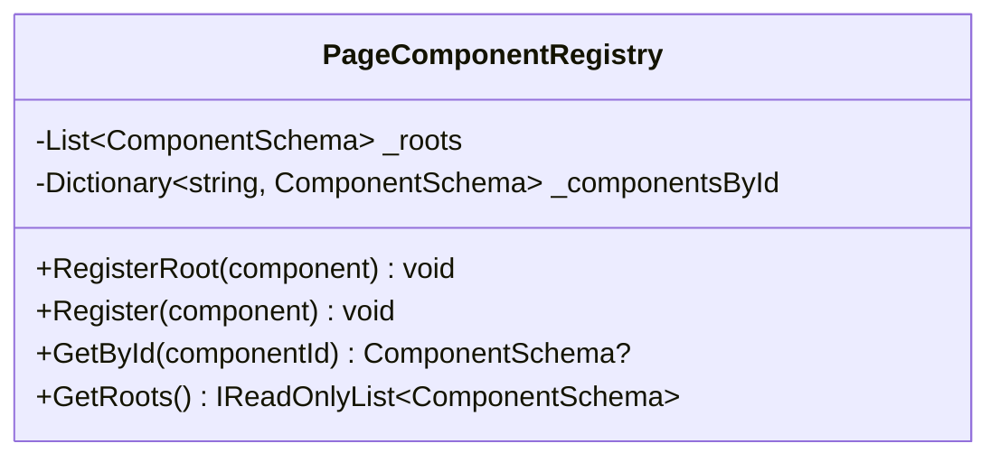
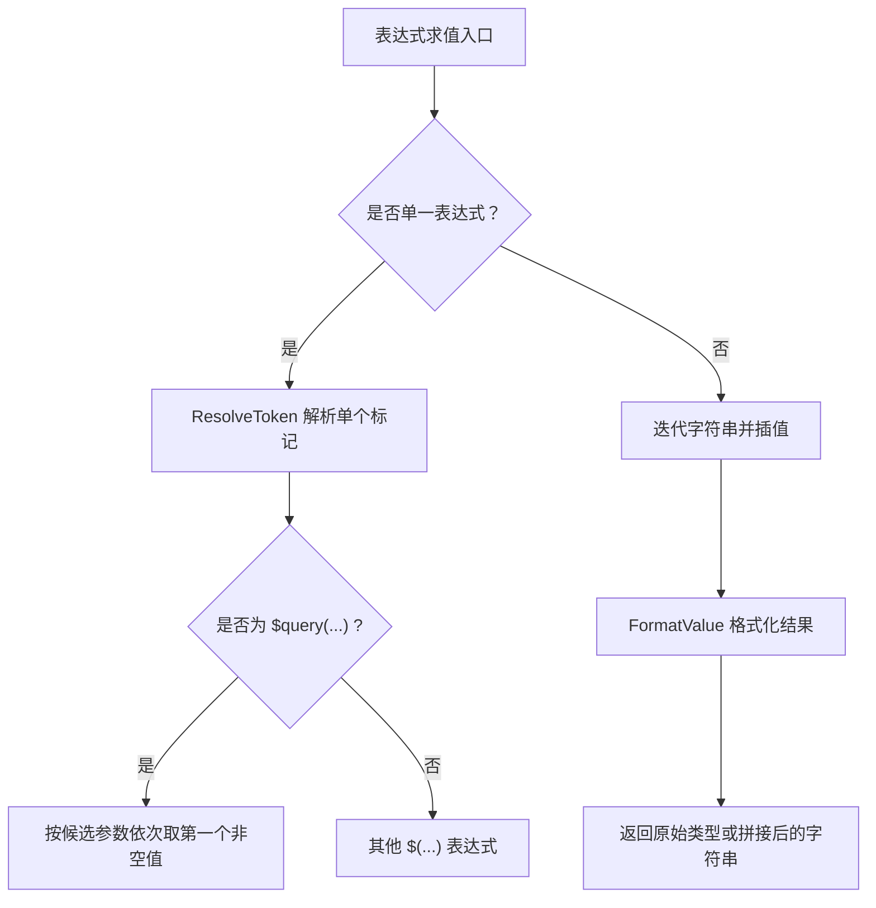
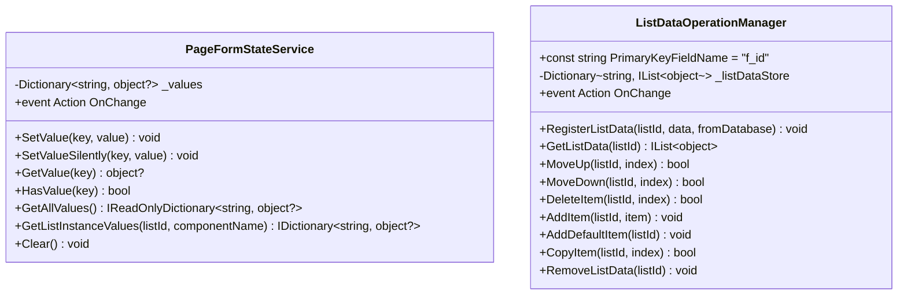
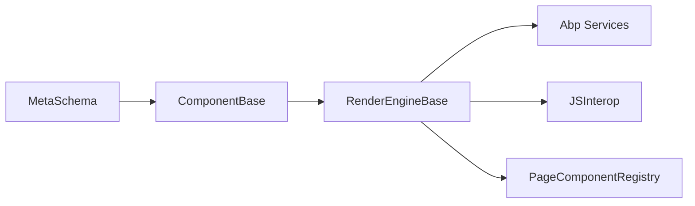
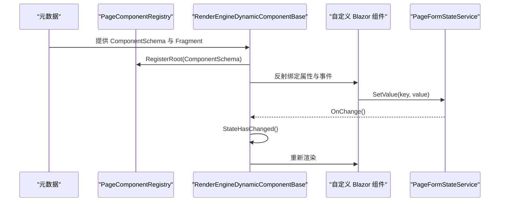

# UI 组件扩展

<cite>
**本文引用的文件**   
- [MetaSchemaBase.cs](file://src/LowCode/Common/H.LowCode.MetaSchema/MetaSchemaBase.cs)
- [ComponentSchemaBase.cs](file://src/LowCode/Common/H.LowCode.MetaSchema/ComponentSchemaBase.cs)
- [ComponentAttributeDefineSchemaBase.cs](file://src/LowCode/Common/H.LowCode.MetaSchema/PropertySchemas/ComponentAttributeDefineSchemaBase.cs)
- [ValidationRuleSchema.cs](file://src/LowCode/Common/H.LowCode.MetaSchema/PropertySchemas/ValidationRuleSchema.cs)
- [ComponentStyleSchema.cs](file://src/LowCode/Common/H.LowCode.MetaSchema/PropertySchemas/ComponentStyleSchema.cs)
- [PagePropertySchema.cs](file://src/LowCode/Common/H.LowCode.MetaSchema/PropertySchemas/PagePropertySchema.cs)
- [ComponentValueTypeEnum.cs](file://src/LowCode/Common/H.LowCode.MetaSchema/Enums/ComponentValueTypeEnum.cs)
- [LowCodeComponentBase.cs](file://src/LowCode/Common/H.LowCode.ComponentBase/LowCodeComponentBase.cs)
- [LowCodeDynamicComponentBase.cs](file://src/LowCode/Common/H.LowCode.ComponentBase/LowCodeDynamicComponentBase.cs)
- [RenderEngineDynamicComponentBase.cs](file://src/LowCode/RenderEngine/H.LowCode.RenderEngineBase/RenderEngineDynamicComponentBase.cs)
- [PageComponentRegistry.cs](file://src/LowCode/RenderEngine/H.LowCode.RenderEngineBase/PageComponentRegistry.cs)
- [EventCallbackHelper.cs](file://src/LowCode/RenderEngine/H.LowCode.RenderEngineBase/EventCallbackHelper.cs)
- [PageFormStateService.cs](file://src/LowCode/RenderEngine/H.LowCode.RenderEngineBase/PageFormStateService.cs)
- [ListDataOperationManager.cs](file://src/LowCode/RenderEngine/H.LowCode.RenderEngineBase/ListDataOperationManager.cs)
- [LowCodeExpressionResolver.cs](file://src/LowCode/RenderEngine/H.LowCode.RenderEngineBase/LowCodeExpressionResolver.cs)
</cite>

## 目录
1. [引言](#引言)
2. [项目结构](#项目结构)
3. [核心组件](#核心组件)
4. [架构总览](#架构总览)
5. [详细组件分析](#详细组件分析)
6. [依赖关系分析](#依赖关系分析)
7. [性能与可访问性](#性能与可访问性)
8. [自定义 Blazor 组件开发指南](#自定义-blazor-组件开发指南)
9. [扩展示例：从元数据到运行时渲染](#扩展示例从元数据到运行时渲染)
10. [故障排查](#故障排查)
11. [结论](#结论)

## 引言
本文件面向 AppLab 低代码平台的 UI 组件扩展开发者，系统化说明组件体系架构、元数据定义、动态渲染机制、组件注册系统以及自定义 Blazor 组件的开发流程。文档以现有源码为依据，重点覆盖以下主题：
- MetaSchema 元数据定义：组件描述、属性、事件、样式、校验规则等结构化配置。
- ComponentSchemaBase 基类：所有组件实例的公共元数据模型。
- RenderEngineDynamicComponentBase 动态渲染机制：从元数据到真实 Blazor 组件的动态构建。
- PageComponentRegistry 组件注册系统：页面级组件树登记与按 Id 查找。
- 自定义 Blazor 组件开发指南：继承、属性 Schema、事件回调、状态管理。
- 元数据设计最佳实践：类型映射、验证规则、样式定制。
- 性能优化、可访问性与响应式设计的扩展建议。
- 完整扩展示例：从元数据到运行时渲染的端到端流程。

## 项目结构
AppLab 低代码平台围绕“元数据 + 渲染引擎 + 组件基类”的三层架构组织：
- 元数据层（H.LowCode.MetaSchema）：描述页面、组件、属性、数据源、样式、事件、校验规则等。
- 组件基础层（H.LowCode.ComponentBase）：提供通用组件能力、动态属性/事件渲染、跨组件上下文。
- 渲染引擎层（H.LowCode.RenderEngineBase）：实现动态组件解析、表达式求值、表单状态、列表数据、组件注册等。

图表来源
- [ComponentSchemaBase.cs:1-110](file://src/LowCode/Common/H.LowCode.MetaSchema/ComponentSchemaBase.cs#L1-L110)
- [ComponentStyleSchema.cs:1-38](file://src/LowCode/Common/H.LowCode.MetaSchema/PropertySchemas/ComponentStyleSchema.cs#L1-L38)
- [ValidationRuleSchema.cs:1-172](file://src/LowCode/Common/H.LowCode.MetaSchema/PropertySchemas/ValidationRuleSchema.cs#L1-L172)
- [LowCodeComponentBase.cs:1-61](file://src/LowCode/Common/H.LowCode.ComponentBase/LowCodeComponentBase.cs#L1-L61)
- [LowCodeDynamicComponentBase.cs:1-134](file://src/LowCode/Common/H.LowCode.ComponentBase/LowCodeDynamicComponentBase.cs#L1-L134)
- [RenderEngineDynamicComponentBase.cs:1-200](file://src/LowCode/RenderEngine/H.LowCode.RenderEngineBase/RenderEngineDynamicComponentBase.cs#L1-L200)
- [PageComponentRegistry.cs:1-48](file://src/LowCode/RenderEngine/H.LowCode.RenderEngineBase/PageComponentRegistry.cs#L1-L48)
- [PageFormStateService.cs:1-98](file://src/LowCode/RenderEngine/H.LowCode.RenderEngineBase/PageFormStateService.cs#L1-L98)
- [ListDataOperationManager.cs:1-200](file://src/LowCode/RenderEngine/H.LowCode.RenderEngineBase/ListDataOperationManager.cs#L1-L200)
- [EventCallbackHelper.cs:1-84](file://src/LowCode/RenderEngine/H.LowCode.RenderEngineBase/EventCallbackHelper.cs#L1-L84)
- [LowCodeExpressionResolver.cs:1-200](file://src/LowCode/RenderEngine/H.LowCode.RenderEngineBase/LowCodeExpressionResolver.cs#L1-L200)

章节来源
- [ComponentSchemaBase.cs:1-110](file://src/LowCode/Common/H.LowCode.MetaSchema/ComponentSchemaBase.cs#L1-L110)
- [LowCodeComponentBase.cs:1-61](file://src/LowCode/Common/H.LowCode.ComponentBase/LowCodeComponentBase.cs#L1-L61)
- [RenderEngineDynamicComponentBase.cs:1-200](file://src/LowCode/RenderEngine/H.LowCode.RenderEngineBase/RenderEngineDynamicComponentBase.cs#L1-L200)

## 核心组件
本节聚焦元数据与运行时基类的职责边界与协作方式：
- MetaSchemaBase：为页面与组件元数据提供统一的创建者、修改者与时间戳字段，便于审计与版本控制。
- ComponentSchemaBase：定义组件实例的公共元数据，包括唯一标识、父子关系、名称、标签、类型、容器标记、数据源支持、样式、事件、校验规则、显示条件与版本。
- LowCodeComponentBase：提供通用注入服务（导航、JS 互操作、日志、Toast）、设计模式判断、查询参数获取等通用能力。
- LowCodeDynamicComponentBase：负责将元数据中的属性与事件动态绑定到目标 Blazor 组件，包括 RenderFragment、EventCallback 与普通属性的反射处理。
- RenderEngineDynamicComponentBase：扩展动态渲染逻辑，订阅表单与列表数据变更、计算栅格宽度、递归渲染组件树、条件渲染与显隐联动、表达式求值。
- PageComponentRegistry：页面级组件注册表，维护根节点与按 Id 索引的组件配置，供事件处理、保存与校验使用。

章节来源
- [MetaSchemaBase.cs:1-18](file://src/LowCode/Common/H.LowCode.MetaSchema/MetaSchemaBase.cs#L1-L18)
- [ComponentSchemaBase.cs:1-110](file://src/LowCode/Common/H.LowCode.MetaSchema/ComponentSchemaBase.cs#L1-L110)
- [LowCodeComponentBase.cs:1-61](file://src/LowCode/Common/H.LowCode.ComponentBase/LowCodeComponentBase.cs#L1-L61)
- [LowCodeDynamicComponentBase.cs:1-134](file://src/LowCode/Common/H.LowCode.ComponentBase/LowCodeDynamicComponentBase.cs#L1-L134)
- [RenderEngineDynamicComponentBase.cs:1-200](file://src/LowCode/RenderEngine/H.LowCode.RenderEngineBase/RenderEngineDynamicComponentBase.cs#L1-L200)
- [PageComponentRegistry.cs:1-48](file://src/LowCode/RenderEngine/H.LowCode.RenderEngineBase/PageComponentRegistry.cs#L1-L48)

## 架构总览
低代码平台的 UI 组件扩展由“声明式元数据 → 动态渲染 → 运行时状态管理”构成闭环。渲染引擎在初始化时订阅表单与列表数据变更；当用户交互或数据变化发生时，触发组件重新渲染与显隐联动。组件注册表在首次渲染时将组件配置登记，以便后续事件处理器通过组件 Id 精准定位配置。

图表来源
- [RenderEngineDynamicComponentBase.cs:1-200](file://src/LowCode/RenderEngine/H.LowCode.RenderEngineBase/RenderEngineDynamicComponentBase.cs#L1-L200)
- [PageComponentRegistry.cs:1-48](file://src/LowCode/RenderEngine/H.LowCode.RenderEngineBase/PageComponentRegistry.cs#L1-L48)
- [PageFormStateService.cs:1-98](file://src/LowCode/RenderEngine/H.LowCode.RenderEngineBase/PageFormStateService.cs#L1-L98)
- [ListDataOperationManager.cs:1-200](file://src/LowCode/RenderEngine/H.LowCode.RenderEngineBase/ListDataOperationManager.cs#L1-L200)
- [LowCodeExpressionResolver.cs:1-200](file://src/LowCode/RenderEngine/H.LowCode.RenderEngineBase/LowCodeExpressionResolver.cs#L1-L200)

## 详细组件分析

### 元数据体系与 ComponentSchemaBase
ComponentSchemaBase 是低代码平台中每个组件实例的公共描述模型，包含以下关键维度：
- 标识与层级：Id、ParentId、Name、Label。
- 行为标记：ComponentType（原子/组合）、IsContainer、IsInnerContainer、IsSupportDataSource。
- 外观配置：Style（ItemWidth、ItemHeight、LabelWidth、DefaultStyle、CustomStyle）。
- 交互配置：Events、EventConsumes。
- 数据校验：ValidationRules（必填、长度、数值范围、正则、邮箱、手机、URL、身份证、自定义表达式）。
- 显示条件：VisibleCondition（用于显隐联动）。
- 版本与描述：Version、Description。

此外，ComponentAttributeDefineSchemaBase 定义了属性绑定的最小契约：AttributeName、AttributeClrType、AttributeValue，供渲染器反射绑定到目标组件属性。

图表来源
- [ComponentSchemaBase.cs:1-110](file://src/LowCode/Common/H.LowCode.MetaSchema/ComponentSchemaBase.cs#L1-L110)
- [ComponentAttributeDefineSchemaBase.cs:1-25](file://src/LowCode/Common/H.LowCode.MetaSchema/PropertySchemas/ComponentAttributeDefineSchemaBase.cs#L1-L25)
- [ComponentStyleSchema.cs:1-38](file://src/LowCode/Common/H.LowCode.MetaSchema/PropertySchemas/ComponentStyleSchema.cs#L1-L38)
- [ValidationRuleSchema.cs:1-172](file://src/LowCode/Common/H.LowCode.MetaSchema/PropertySchemas/ValidationRuleSchema.cs#L1-L172)

章节来源
- [ComponentSchemaBase.cs:1-110](file://src/LowCode/Common/H.LowCode.MetaSchema/ComponentSchemaBase.cs#L1-L110)
- [ComponentAttributeDefineSchemaBase.cs:1-25](file://src/LowCode/Common/H.LowCode.MetaSchema/PropertySchemas/ComponentAttributeDefineSchemaBase.cs#L1-L25)
- [ComponentStyleSchema.cs:1-38](file://src/LowCode/Common/H.LowCode.MetaSchema/PropertySchemas/ComponentStyleSchema.cs#L1-L38)
- [ValidationRuleSchema.cs:1-172](file://src/LowCode/Common/H.LowCode.MetaSchema/PropertySchemas/ValidationRuleSchema.cs#L1-L172)

### 动态渲染机制与 RenderEngineDynamicComponentBase
RenderEngineDynamicComponentBase 承担以下职责：
- 生命周期与订阅：在初始化阶段订阅表单状态与列表数据变更，并在变更后调用 StateHasChanged 触发重新渲染。
- 表达式上下文：为可见性条件与显示值计算提供上下文，包括当前行数据、表单状态、URL 参数提供器。
- 栅格宽度计算：根据页面布局与组件样式决定组件宽度百分比。
- 组件递归渲染：遍历组件 Fragment，处理默认 TypeName、显隐条件、条件渲染组件、数据源与子节点。
- 属性与事件绑定：委托 LowCodeDynamicComponentBase 将属性与事件反射到目标组件，支持 RenderFragment、EventCallback 与简单属性。

图表来源
- [RenderEngineDynamicComponentBase.cs:1-200](file://src/LowCode/RenderEngine/H.LowCode.RenderEngineBase/RenderEngineDynamicComponentBase.cs#L1-L200)
- [LowCodeDynamicComponentBase.cs:1-134](file://src/LowCode/Common/H.LowCode.ComponentBase/LowCodeDynamicComponentBase.cs#L1-L134)

章节来源
- [RenderEngineDynamicComponentBase.cs:1-200](file://src/LowCode/RenderEngine/H.LowCode.RenderEngineBase/RenderEngineDynamicComponentBase.cs#L1-L200)
- [LowCodeDynamicComponentBase.cs:1-134](file://src/LowCode/Common/H.LowCode.ComponentBase/LowCodeDynamicComponentBase.cs#L1-L134)

### 组件注册系统与 PageComponentRegistry
PageComponentRegistry 维护两个核心数据结构：
- _roots：页面直接渲染的根组件集合。
- _componentsById：按组件 Id 索引的配置字典。

主要方法：
- RegisterRoot：登记根组件并同步索引。
- Register：登记任意组件（含嵌套）。
- GetById：按 Id 获取组件配置。
- GetRoots：获取根组件集合。

该注册表确保事件处理、保存与校验流程能基于组件 Id 快速找到对应元数据。

图表来源
- [PageComponentRegistry.cs:1-48](file://src/LowCode/RenderEngine/H.LowCode.RenderEngineBase/PageComponentRegistry.cs#L1-L48)

章节来源
- [PageComponentRegistry.cs:1-48](file://src/LowCode/RenderEngine/H.LowCode.RenderEngineBase/PageComponentRegistry.cs#L1-L48)

### 表达式求值与显隐联动
LowCodeExpressionResolver 提供表达式解析能力，支持的语法包括：
- $query(name)：读取 URL 参数，支持多候选参数回退。
- $(item.field)：读取当前行数据字段。
- $(form.key)：读取表单状态值。
- $(form[innerExpr])：表单键为表达式，递归求值。
- $(formjson(listId,compName))：聚合列表实例表单值为 JSON 数组。
- $(now)：当前时间字符串。

渲染引擎使用 CreateExpressionContext 构造上下文，并将 QueryProvider 指向页面查询参数解析；VisibleCondition 求值失败或为假时，组件被跳过渲染，从而实现显隐联动。

图表来源
- [LowCodeExpressionResolver.cs:1-200](file://src/LowCode/RenderEngine/H.LowCode.RenderEngineBase/LowCodeExpressionResolver.cs#L1-L200)

章节来源
- [LowCodeExpressionResolver.cs:1-200](file://src/LowCode/RenderEngine/H.LowCode.RenderEngineBase/LowCodeExpressionResolver.cs#L1-L200)

### 表单状态管理与列表数据管理
- PageFormStateService：统一管理页面内输入组件的值，key 约定为组件 Name 或 "{listId}|{itemPrimaryKey}|{componentName}"；提供 SetValue、GetValue、GetAllValues、GetListInstanceValues、Clear 等方法；支持静默设值与值变化通知。
- ListDataOperationManager：管理列表数据的增删改查与排序，维护主键字段名 f_id、数据库同步标记、删除行记录；提供 MoveUp/MoveDown/DeleteItem/AddItem/AddDefaultItem/CopyItem 等方法；通过 OnChange 事件驱动渲染更新。

图表来源
- [PageFormStateService.cs:1-98](file://src/LowCode/RenderEngine/H.LowCode.RenderEngineBase/PageFormStateService.cs#L1-L98)
- [ListDataOperationManager.cs:1-200](file://src/LowCode/RenderEngine/H.LowCode.RenderEngineBase/ListDataOperationManager.cs#L1-L200)

章节来源
- [PageFormStateService.cs:1-98](file://src/LowCode/RenderEngine/H.LowCode.RenderEngineBase/PageFormStateService.cs#L1-L98)
- [ListDataOperationManager.cs:1-200](file://src/LowCode/RenderEngine/H.LowCode.RenderEngineBase/ListDataOperationManager.cs#L1-L200)

## 依赖关系分析
- 元数据层对运行时无强依赖，仅使用 System.Text.Json.Serialization。
- 组件基础层依赖 Blazor 运行时与通用工具（导航、JS 互操作、日志、Toast）。
- 渲染引擎层依赖元数据模型、组件基础层、Blazor 运行时、Abp 应用服务接口与 JS 互操作。
- PageComponentRegistry 解耦了组件树的登记与查找，避免事件处理逻辑耦合具体渲染细节。
- EventCallbackHelper 封装了 EventCallbackFactory 的泛型方法选择，简化动态事件绑定。

图表来源
- [MetaSchemaBase.cs:1-18](file://src/LowCode/Common/H.LowCode.MetaSchema/MetaSchemaBase.cs#L1-L18)
- [LowCodeComponentBase.cs:1-61](file://src/LowCode/Common/H.LowCode.ComponentBase/LowCodeComponentBase.cs#L1-L61)
- [RenderEngineDynamicComponentBase.cs:1-200](file://src/LowCode/RenderEngine/H.LowCode.RenderEngineBase/RenderEngineDynamicComponentBase.cs#L1-L200)
- [PageComponentRegistry.cs:1-48](file://src/LowCode/RenderEngine/H.LowCode.RenderEngineBase/PageComponentRegistry.cs#L1-L48)

章节来源
- [LowCodeComponentBase.cs:1-61](file://src/LowCode/Common/H.LowCode.ComponentBase/LowCodeComponentBase.cs#L1-L61)
- [RenderEngineDynamicComponentBase.cs:1-200](file://src/LowCode/RenderEngine/H.LowCode.RenderEngineBase/RenderEngineDynamicComponentBase.cs#L1-L200)

## 性能与可访问性
- 性能优化建议：
  - 避免在可见性条件中使用高开销表达式；尽量缓存中间结果或使用更简单的布尔状态。
  - 合理使用 ShouldRender（可通过组件内部状态键控制），减少不必要的重渲染。
  - 列表数据操作尽量批量进行，减少频繁 OnChange 通知。
  - 表达式求值注意嵌套层级，避免深层递归解析造成卡顿。
- 可访问性支持建议：
  - 在自定义组件中设置合适的 aria-* 属性（如 aria-label、aria-describedby、role）。
  - 为键盘交互提供焦点管理（Tab 顺序、Enter/Space 行为）。
  - 颜色对比度符合 WCAG 标准，并提供替代文本。
- 响应式设计建议：
  - 使用栅格宽度与媒体查询结合，在小屏设备上自动调整列数。
  - 通过 ItemWidth 与页面布局 playOut 控制组件在不同断点下的表现。
  - 避免固定像素尺寸，优先使用相对单位与自适应布局。

[本节为通用指导，不直接分析具体文件]

## 自定义 Blazor 组件开发指南
本节给出从零开始扩展一个自定义 Blazor 组件的步骤与要点：

1. 继承基类
   - 推荐继承 LowCodeComponentBase 或 LowCodeDynamicComponentBase，以获得通用注入服务与动态属性/事件绑定能力。
   - 若需要与渲染引擎深度集成（如参与显隐联动、表达式求值），可在渲染引擎侧扩展 RenderEngineDynamicComponentBase 的渲染流程。

2. 定义组件属性 Schema
   - 在元数据中使用 ComponentAttributeDefineSchemaBase 描述属性：AttributeName 必须与组件实际 C# 属性名一致；AttributeClrType 为目标 CLR 类型字符串；AttributeValue 为运行时值。
   - 如需复杂属性，可使用 ComponentFragmentSchemaBase（片段化属性结构）配合渲染引擎的递归解析。

3. 实现事件回调处理
   - 对于 EventCallback 类型的属性，渲染引擎会尝试通过反射查找同名方法并创建委托；建议在组件中实现对应的事件处理方法。
   - 对于带参数的 EventCallback<T>，可使用 EventCallbackHelper 提供的工厂方法进行动态创建。

4. 处理组件状态管理
   - 使用 PageFormStateService 存储与读取组件值；普通组件 key 为 Name，列表实例 key 为 "{listId}|{itemPrimaryKey}|{componentName}"。
   - 在值变化时调用 SetValue 触发 OnChange，从而驱动显隐联动与其他组件的重新求值。

5. 样式定制选项
   - 使用 ComponentStyleSchema 的 ItemWidth、ItemHeight、LabelWidth、DefaultStyle、CustomStyle 配置外观。
   - 页面级样式可通过 PagePropertySchema 的 DefaultStyle 与 CustomStyle 统一设置。

6. 数据源与表达式
   - 若组件支持数据源，需在元数据中将 IsSupportDataSource 设为 true，并在渲染时由 RenderEngineDynamicComponentBase 处理数据绑定。
   - 使用 LowCodeExpressionResolver 的表达式语法动态计算显示值或可见性条件。

章节来源
- [LowCodeComponentBase.cs:1-61](file://src/LowCode/Common/H.LowCode.ComponentBase/LowCodeComponentBase.cs#L1-L61)
- [LowCodeDynamicComponentBase.cs:1-134](file://src/LowCode/Common/H.LowCode.ComponentBase/LowCodeDynamicComponentBase.cs#L1-L134)
- [ComponentAttributeDefineSchemaBase.cs:1-25](file://src/LowCode/Common/H.LowCode.MetaSchema/PropertySchemas/ComponentAttributeDefineSchemaBase.cs#L1-L25)
- [ComponentStyleSchema.cs:1-38](file://src/LowCode/Common/H.LowCode.MetaSchema/PropertySchemas/ComponentStyleSchema.cs#L1-L38)
- [PagePropertySchema.cs:1-36](file://src/LowCode/Common/H.LowCode.MetaSchema/PropertySchemas/PagePropertySchema.cs#L1-L36)
- [EventCallbackHelper.cs:1-84](file://src/LowCode/RenderEngine/H.LowCode.RenderEngineBase/EventCallbackHelper.cs#L1-L84)
- [PageFormStateService.cs:1-98](file://src/LowCode/RenderEngine/H.LowCode.RenderEngineBase/PageFormStateService.cs#L1-L98)
- [LowCodeExpressionResolver.cs:1-200](file://src/LowCode/RenderEngine/H.LowCode.RenderEngineBase/LowCodeExpressionResolver.cs#L1-L200)

## 扩展示例：从元数据到运行时渲染
本节提供一个完整的扩展流程示例，涵盖元数据定义、组件注册、属性绑定、事件回调与状态管理：

1. 定义组件元数据
   - 在 ComponentSchemaBase 中为该组件实例设置 Id、Name、Label、Style、Events、ValidationRules、VisibleCondition 等。
   - 在 ComponentAttributeDefineSchemaBase 列表中定义属性绑定，例如将文本框的 Value 绑定到某个表单状态 key。

2. 注册组件类型
   - 在渲染引擎侧，通过 ComponentFragmentSchema 的 TypeName 指定目标 Blazor 组件类型；若为空则使用 DefaultTypeName。
   - 确保组件程序集已加载，RenderEngineDynamicComponentBase.ResolveComponentType 能成功解析 Type。

3. 渲染属性与事件
   - RenderEngineDynamicComponentBase 调用 RenderComponentAttributes，LowCodeDynamicComponentBase 反射匹配属性名与类型，绑定 RenderFragment、EventCallback 或简单属性。
   - 事件回调通过 EventCallbackHelper 动态创建，支持有参与无参两种形式。

4. 状态管理与显隐联动
   - 组件值写入 PageFormStateService；当值变化时触发 OnChange，RenderEngineDynamicComponentBase 收到通知后调用 StateHasChanged。
   - 可见性条件通过 LowCodeExpressionResolver 求值，结果为假则跳过渲染。

5. 列表数据与聚合
   - 列表组件通过 ListDataOperationManager 管理数据；新增、删除、移动等操作触发 OnChange。
   - 使用 $(formjson(listId,compName)) 表达式聚合列表实例的表单值，供其他组件消费。

图表来源
- [RenderEngineDynamicComponentBase.cs:1-200](file://src/LowCode/RenderEngine/H.LowCode.RenderEngineBase/RenderEngineDynamicComponentBase.cs#L1-L200)
- [PageComponentRegistry.cs:1-48](file://src/LowCode/RenderEngine/H.LowCode.RenderEngineBase/PageComponentRegistry.cs#L1-L48)
- [PageFormStateService.cs:1-98](file://src/LowCode/RenderEngine/H.LowCode.RenderEngineBase/PageFormStateService.cs#L1-L98)
- [LowCodeDynamicComponentBase.cs:1-134](file://src/LowCode/Common/H.LowCode.ComponentBase/LowCodeDynamicComponentBase.cs#L1-L134)

章节来源
- [RenderEngineDynamicComponentBase.cs:1-200](file://src/LowCode/RenderEngine/H.LowCode.RenderEngineBase/RenderEngineDynamicComponentBase.cs#L1-L200)
- [PageComponentRegistry.cs:1-48](file://src/LowCode/RenderEngine/H.LowCode.RenderEngineBase/PageComponentRegistry.cs#L1-L48)
- [LowCodeDynamicComponentBase.cs:1-134](file://src/LowCode/Common/H.LowCode.ComponentBase/LowCodeDynamicComponentBase.cs#L1-L134)
- [PageFormStateService.cs:1-98](file://src/LowCode/RenderEngine/H.LowCode.RenderEngineBase/PageFormStateService.cs#L1-L98)

## 故障排查
常见问题与定位思路：
- 组件类型无法解析：检查 ComponentFragmentSchema.TypeName 是否正确，程序集是否加载；参考 ResolveComponentType 的行为。
- 属性未绑定：确认 AttributeName 与组件属性名完全一致；AttributeClrType 是否有效；AttributeValue 是否能转换为目标类型。
- 事件回调未触发：确认组件中存在同名方法且签名匹配；EventCallback 类型是否为 EventCallback 或 EventCallback<T>。
- 表单值未生效：检查 key 是否符合约定（普通组件 Name，列表实例 "{listId}|{itemPrimaryKey}|{componentName}"）；是否调用了 SetValue 而非 SetValueSilently。
- 可见性条件无效：检查 VisibleCondition 表达式语法；确认表达式上下文是否正确注入（Item、FormState、QueryProvider）。
- 列表数据不同步：确认是否调用 RegisterListData 并设置 fromDatabase；检查 DeleteItem 是否记录了删除的主键以同步数据库。

章节来源
- [LowCodeDynamicComponentBase.cs:1-134](file://src/LowCode/Common/H.LowCode.ComponentBase/LowCodeDynamicComponentBase.cs#L1-L134)
- [EventCallbackHelper.cs:1-84](file://src/LowCode/RenderEngine/H.LowCode.RenderEngineBase/EventCallbackHelper.cs#L1-L84)
- [PageFormStateService.cs:1-98](file://src/LowCode/RenderEngine/H.LowCode.RenderEngineBase/PageFormStateService.cs#L1-L98)
- [ListDataOperationManager.cs:1-200](file://src/LowCode/RenderEngine/H.LowCode.RenderEngineBase/ListDataOperationManager.cs#L1-L200)
- [LowCodeExpressionResolver.cs:1-200](file://src/LowCode/RenderEngine/H.LowCode.RenderEngineBase/LowCodeExpressionResolver.cs#L1-L200)

## 结论
AppLab 低代码平台的 UI 组件扩展体系以元数据为核心，通过 ComponentSchemaBase 统一描述组件结构与行为，借助 RenderEngineDynamicComponentBase 完成从声明到运行的动态渲染，并以 PageComponentRegistry、PageFormStateService、ListDataOperationManager 与 LowCodeExpressionResolver 支撑事件、状态、数据与表达式的运行时协同。开发者遵循本文档的规范与最佳实践，即可高效扩展高质量、可维护、可访问的 Blazor 组件。