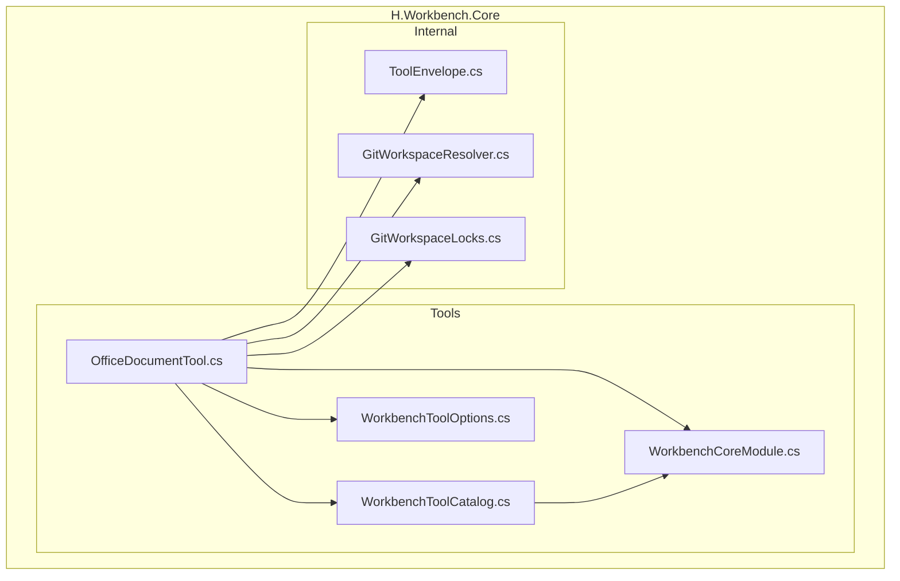
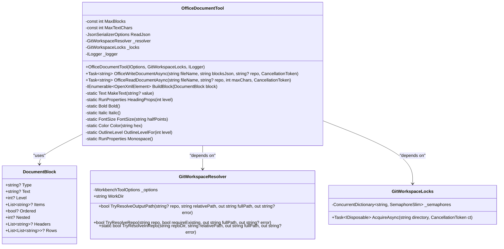
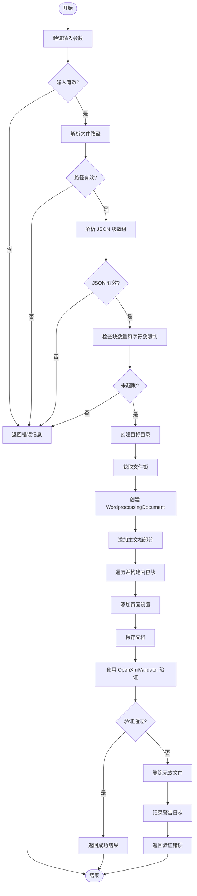
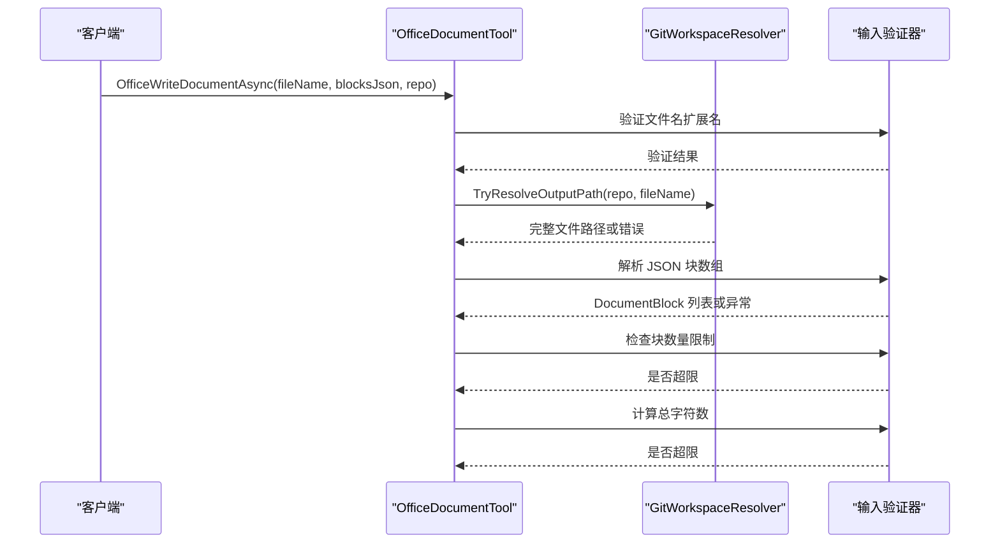
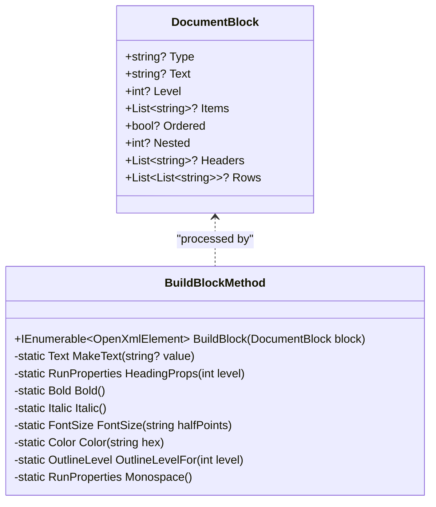
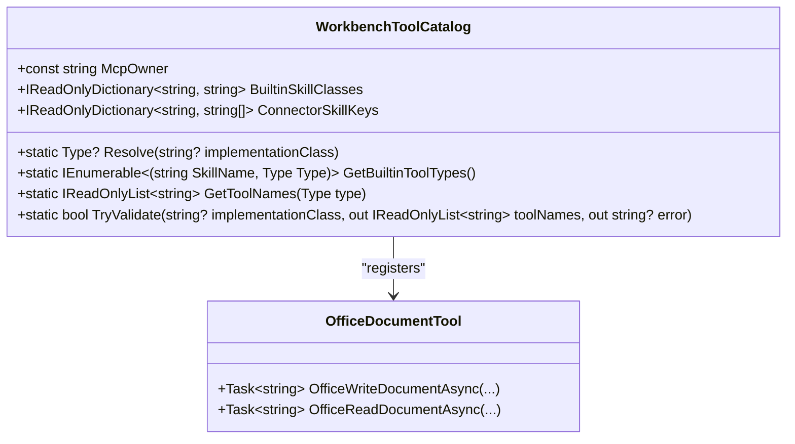
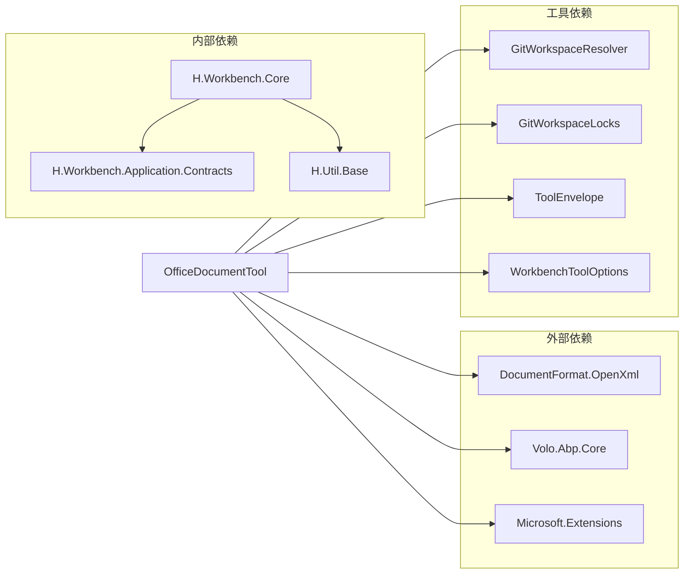

# Office 文档生成工具

<cite>
**Referenced Files in This Document **
- [OfficeDocumentTool.cs](file://src/Agent/Workbench/H.Workbench.Core/Tools/OfficeDocumentTool.cs)
- [WorkbenchToolCatalog.cs](file://src/Agent/Workbench/H.Workbench.Core/Tools/WorkbenchToolCatalog.cs)
- [WorkbenchCoreModule.cs](file://src/Agent/Workbench/H.Workbench.Core/WorkbenchCoreModule.cs)
- [WorkbenchToolOptions.cs](file://src/Agent/Workbench/H.Workbench.Core/WorkbenchToolOptions.cs)
- [ToolEnvelope.cs](file://src/Agent/Workbench/H.Workbench.Core/Tools/Internal/ToolEnvelope.cs)
- [GitWorkspaceResolver.cs](file://src/Agent/Workbench/H.Workbench.Core/Tools/Internal/GitWorkspaceResolver.cs)
- [GitWorkspaceLocks.cs](file://src/Agent/Workbench/H.Workbench.Core/Tools/Internal/GitWorkspaceLocks.cs)
- [H.Workbench.Core.csproj](file://src/Agent/Workbench/H.Workbench.Core/H.Workbench.Core.csproj)
</cite>

## Table of Contents
1. [Introduction](#introduction)
2. [Project Structure](#project-structure)
3. [Core Components](#core-components)
4. [Architecture Overview](#architecture-overview)
5. [Detailed Component Analysis](#detailed-component-analysis)
6. [Dependency Analysis](#dependency-analysis)
7. [Performance Considerations](#performance-considerations)
8. [Troubleshooting Guide](#troubleshooting-guide)
9. [Conclusion](#conclusion)

## Introduction

Office 文档生成工具（OfficeDocumentTool）是一个基于 OpenXML SDK 的专业级 Word 文档生成解决方案，专为结构化内容生成设计。该工具支持将标题、段落、列表、表格、引用、代码块等多种内容类型转换为标准的 .docx 文件格式，并在生成后立即进行文档有效性验证，确保生成的文件能够在 Microsoft Office 中正常打开和编辑。

该工具采用"块协议"（block protocol）设计理念，用户只需提供结构化的内容描述，由服务端负责格式拼装，避免了自由 HTML 转换带来的兼容性问题。工具内置严格的安全护栏和错误处理机制，确保在复杂的企业环境中稳定运行。

## Project Structure

OfficeDocumentTool 位于 Workbench 核心模块中，遵循模块化架构设计：

**Diagram sources **
- [OfficeDocumentTool.cs:1-50](file://src/Agent/Workbench/H.Workbench.Core/Tools/OfficeDocumentTool.cs#L1-L50)
- [WorkbenchToolCatalog.cs:1-30](file://src/Agent/Workbench/H.Workbench.Core/Tools/WorkbenchToolCatalog.cs#L1-L30)
- [WorkbenchCoreModule.cs:1-38](file://src/Agent/Workbench/H.Workbench.Core/WorkbenchCoreModule.cs#L1-L38)

项目依赖通过 NuGet 包管理，核心依赖包括 DocumentFormat.OpenXml 用于 OpenXML 文档操作。

**Section sources**
- [H.Workbench.Core.csproj:1-24](file://src/Agent/Workbench/H.Workbench.Core/H.Workbench.Core.csproj#L1-L24)
- [OfficeDocumentTool.cs:1-20](file://src/Agent/Workbench/H.Workbench.Core/Tools/OfficeDocumentTool.cs#L1-L20)

## Core Components

### OfficeDocumentTool 核心类

OfficeDocumentTool 是文档生成的核心实现类，提供两个主要方法：

1. **OfficeWriteDocumentAsync**: 生成 Word 文档
2. **OfficeReadDocumentAsync**: 回读 Word 文档内容

该类采用依赖注入模式，接收配置选项、工作区锁管理器和服务日志记录器作为构造函数参数。

**Diagram sources **
- [OfficeDocumentTool.cs:25-440](file://src/Agent/Workbench/H.Workbench.Core/Tools/OfficeDocumentTool.cs#L25-L440)
- [GitWorkspaceResolver.cs:12-277](file://src/Agent/Workbench/H.Workbench.Core/Tools/Internal/GitWorkspaceResolver.cs#L12-L277)
- [GitWorkspaceLocks.cs:9-26](file://src/Agent/Workbench/H.Workbench.Core/Tools/Internal/GitWorkspaceLocks.cs#L9-L26)

**Section sources**
- [OfficeDocumentTool.cs:25-100](file://src/Agent/Workbench/H.Workbench.Core/Tools/OfficeDocumentTool.cs#L25-L100)
- [OfficeDocumentTool.cs:401-440](file://src/Agent/Workbench/H.Workbench.Core/Tools/OfficeDocumentTool.cs#L401-L440)

## Architecture Overview

OfficeDocumentTool 的架构设计遵循以下核心原则：

1. **安全性优先**: 所有文件操作都在工作目录内进行，防止路径遍历攻击
2. **即时验证**: 生成后立即使用 OpenXmlValidator 验证文档结构
3. **原子操作**: 使用文件锁确保并发安全
4. **错误恢复**: 验证失败时自动删除半成品文件

**Diagram sources **
- [OfficeDocumentTool.cs:50-150](file://src/Agent/Workbench/H.Workbench.Core/Tools/OfficeDocumentTool.cs#L50-L150)

系统通过 ToolEnvelope 统一返回格式，确保调用方能够正确识别成功和失败状态。

**Section sources**
- [OfficeDocumentTool.cs:50-180](file://src/Agent/Workbench/H.Workbench.Core/Tools/OfficeDocumentTool.cs#L50-L180)
- [ToolEnvelope.cs:1-56](file://src/Agent/Workbench/H.Workbench.Core/Tools/Internal/ToolEnvelope.cs#L1-L56)

## Detailed Component Analysis

### 文档生成流程分析

OfficeWriteDocumentAsync 方法是文档生成的核心入口，实现了完整的生成、验证和错误处理流程。

#### 输入验证阶段

方法首先对输入参数进行严格验证：

1. **文件名验证**: 确保以 .docx 结尾
2. **路径解析**: 通过 GitWorkspaceResolver 解析安全的文件路径
3. **JSON 解析**: 将 blocksJson 字符串反序列化为 DocumentBlock 对象列表
4. **容量限制**: 检查块数量（最大 400 个）和总字符数（最大 200,000 字符）

**Diagram sources **
- [OfficeDocumentTool.cs:50-90](file://src/Agent/Workbench/H.Workbench.Core/Tools/OfficeDocumentTool.cs#L50-L90)

#### 文档构建阶段

通过 BuildBlock 方法将每个 DocumentBlock 转换为 OpenXML 元素：

1. **标题块**: 根据级别设置字体大小、颜色和大纲级别
2. **段落块**: 标准文本段落
3. **列表块**: 支持有序和无序列表，可嵌套
4. **表格块**: 包含表头和行数据，自动计算列宽
5. **引用块**: 带灰色背景和斜体样式
6. **代码块**: 使用等宽字体 Consolas
7. **分页符**: 插入分页控制

**Diagram sources **
- [OfficeDocumentTool.cs:250-400](file://src/Agent/Workbench/H.Workbench.Core/Tools/OfficeDocumentTool.cs#L250-L400)
- [OfficeDocumentTool.cs:401-440](file://src/Agent/Workbench/H.Workbench.Core/Tools/OfficeDocumentTool.cs#L401-L440)

**Section sources**
- [OfficeDocumentTool.cs:50-180](file://src/Agent/Workbench/H.Workbench.Core/Tools/OfficeDocumentTool.cs#L50-L180)
- [OfficeDocumentTool.cs:250-400](file://src/Agent/Workbench/H.Workbench.Core/Tools/OfficeDocumentTool.cs#L250-L400)

### 文档验证机制

生成完成后，使用 OpenXmlValidator 进行结构验证：

1. **即时验证**: 在文件关闭前执行验证
2. **错误收集**: 收集所有验证错误
3. **失败处理**: 验证失败时删除文件并记录日志
4. **错误报告**: 返回第一个错误的详细描述

这种设计确保了不会留下损坏的文档文件，符合"生成打不开的文件比不生成更糟"的设计理念。

**Diagram sources **
- [OfficeDocumentTool.cs:130-160](file://src/Agent/Workbench/H.Workbench.Core/Tools/OfficeDocumentTool.cs#L130-L160)

### 文档读取功能

OfficeReadDocumentAsync 方法提供文档内容回读能力：

1. **路径验证**: 同样使用 GitWorkspaceResolver 确保路径安全
2. **文件存在性检查**: 确认文件存在后再尝试打开
3. **内容提取**: 遍历段落和表格提取文本
4. **长度限制**: 默认最多读取 4000 字符，可配置
5. **截断标记**: 如果内容被截断，返回 truncated 标志

表格内容以竖线分隔的格式返回，便于模型理解表格结构。

**Section sources**
- [OfficeDocumentTool.cs:165-245](file://src/Agent/Workbench/H.Workbench.Core/Tools/OfficeDocumentTool.cs#L165-L245)

### 工具注册与发现

WorkbenchToolCatalog 提供统一的工具注册表：

**Diagram sources **
- [WorkbenchToolCatalog.cs:15-25](file://src/Agent/Workbench/H.Workbench.Core/Tools/WorkbenchToolCatalog.cs#L15-L25)
- [WorkbenchToolCatalog.cs:50-122](file://src/Agent/Workbench/H.Workbench.Core/Tools/WorkbenchToolCatalog.cs#L50-L122)

office_document 技能被注册到内置技能列表中，映射到 OfficeDocumentTool 类。

**Section sources**
- [WorkbenchToolCatalog.cs:15-25](file://src/Agent/Workbench/H.Workbench.Core/Tools/WorkbenchToolCatalog.cs#L15-L25)
- [WorkbenchCoreModule.cs:22](file://src/Agent/Workbench/H.Workbench.Core/WorkbenchCoreModule.cs#L22)

### 配置管理

WorkbenchToolOptions 提供运行时配置：

- **Git 工作目录**: 所有生成的文档都保存在此目录下
- **工具超时**: 默认 660 秒，确保长时操作有足够时间
- **工具隔离**: 支持员工级工具权限控制

GitWorkspaceResolver 负责将相对路径解析为安全的绝对路径，防止路径遍历攻击。

**Section sources**
- [WorkbenchToolOptions.cs:1-50](file://src/Agent/Workbench/H.Workbench.Core/WorkbenchToolOptions.cs#L1-L50)
- [GitWorkspaceResolver.cs:12-100](file://src/Agent/Workbench/H.Workbench.Core/Tools/Internal/GitWorkspaceResolver.cs#L12-L100)

## Dependency Analysis

OfficeDocumentTool 的依赖关系如下：

**Diagram sources **
- [H.Workbench.Core.csproj:7-17](file://src/Agent/Workbench/H.Workbench.Core/H.Workbench.Core.csproj#L7-L17)
- [H.Workbench.Core.csproj:20-22](file://src/Agent/Workbench/H.Workbench.Core/H.Workbench.Core.csproj#L20-L22)

关键依赖说明：

1. **DocumentFormat.OpenXml**: 核心 OpenXML SDK，提供 WordprocessingDocument、OpenXmlValidator 等类
2. **GitWorkspaceResolver**: 提供安全的路径解析服务
3. **GitWorkspaceLocks**: 提供并发安全的文件锁机制
4. **ToolEnvelope**: 提供统一的返回格式封装

无循环依赖，依赖层次清晰。

**Section sources**
- [H.Workbench.Core.csproj:1-24](file://src/Agent/Workbench/H.Workbench.Core/H.Workbench.Core.csproj#L1-L24)

## Performance Considerations

### 性能优化策略

1. **流式处理**: 使用 StringBuilder 累积文本，避免频繁字符串拼接
2. **早期验证**: 在文件关闭前验证，避免写入磁盘后发现错误
3. **内存限制**: 设置最大块数（400）和字符数（200,000）防止内存溢出
4. **并发控制**: 使用信号量按目录串行化写操作，避免冲突

### 资源管理

- **文件锁**: 使用 GitWorkspaceLocks 确保同一目录的并发访问安全
- **自动清理**: 验证失败时立即删除无效文件，避免磁盘空间浪费
- **日志记录**: 验证错误记录到日志，便于问题排查

### 可扩展性

当前设计支持：
- 最多 400 个内容块
- 最多 200,000 个字符
- 表格列数动态计算
- 列表嵌套层级支持

如需处理更大文档，可调整 MaxBlocks 和 MaxTextChars 常量。

## Troubleshooting Guide

### 常见问题及解决方案

#### 1. 文件名验证失败

**症状**: 返回错误 "fileName 必须以 .docx 结尾"

**原因**: 文件名不以 .docx 结尾（不区分大小写）

**解决**: 确保文件名以 .docx 或 .DOCX 结尾

#### 2. JSON 解析错误

**症状**: 返回错误 "blocksJson 不是合法 JSON 数组"

**原因**: blocksJson 参数不是有效的 JSON 格式

**解决**: 
- 检查 JSON 语法是否正确
- 确保是数组格式 `[{...}, {...}]`
- 验证属性名称拼写

#### 3. 内容块数量超限

**症状**: 返回错误 "内容块数量超过上限 400"

**原因**: blocksJson 中包含超过 400 个块

**解决**: 将大文档拆分为多个小文档生成

#### 4. 字符数超限

**症状**: 返回错误 "内容总字数超过上限 200000"

**原因**: 所有内容块的文本总长度超过 200,000 字符

**解决**: 减少文本内容或拆分文档

#### 5. 文档验证失败

**症状**: 返回错误 "生成的文档结构校验未通过（X 个问题）"

**原因**: OpenXML 结构不符合规范

**解决**:
- 检查块类型是否有效
- 确保表格 headers 和 rows 格式正确
- 查看日志中的具体错误描述

#### 6. 路径安全问题

**症状**: 返回错误 "拒绝写到工作目录之外"

**原因**: 文件路径试图访问工作目录外的位置

**解决**: 
- 使用相对路径
- 确保不包含 ".." 等路径遍历字符
- 检查工作目录配置

### 调试技巧

1. **启用详细日志**: 查看 Workbench 日志了解验证错误详情
2. **使用 OfficeReadDocumentAsync**: 生成后回读验证内容正确性
3. **检查 blocksJson 格式**: 使用 JSON 验证工具检查语法
4. **测试简单文档**: 先用少量块测试，逐步增加复杂度

## Conclusion

OfficeDocumentTool 提供了一个安全、可靠且易于使用的 Word 文档生成解决方案。其核心优势包括：

1. **结构化内容协议**: 通过块协议简化内容描述，避免 HTML 转换的复杂性
2. **即时验证机制**: 确保生成的文档始终有效，不会产生损坏文件
3. **严格的安全护栏**: 路径验证、并发控制和容量限制保障系统安全
4. **完善的错误处理**: 统一的返回格式和详细的错误信息便于问题排查
5. **灵活的配置选项**: 支持自定义工作目录和超时设置

该工具特别适合需要批量生成标准化文档的场景，如报告生成、合同制作、技术文档输出等。通过结合 AI 助手的能力，可以进一步简化文档创建流程，提高工作效率。

未来改进方向可能包括：
- 支持更多文档元素（图片、超链接、页眉页脚）
- 提供模板功能
- 支持样式自定义
- 增加批量处理能力