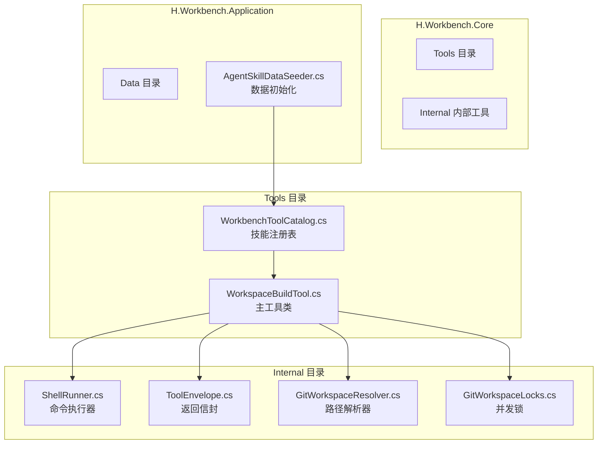
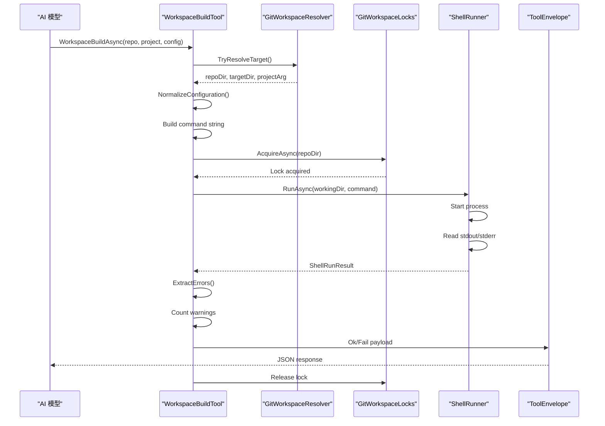
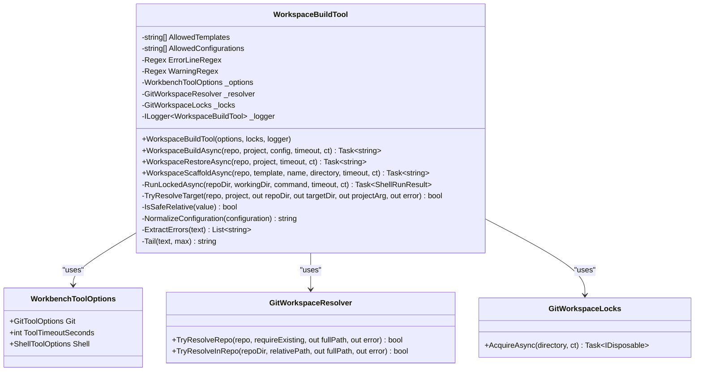
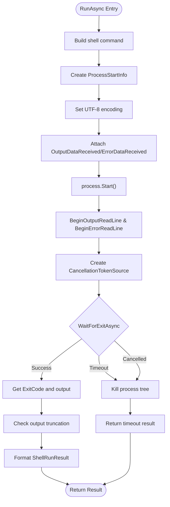
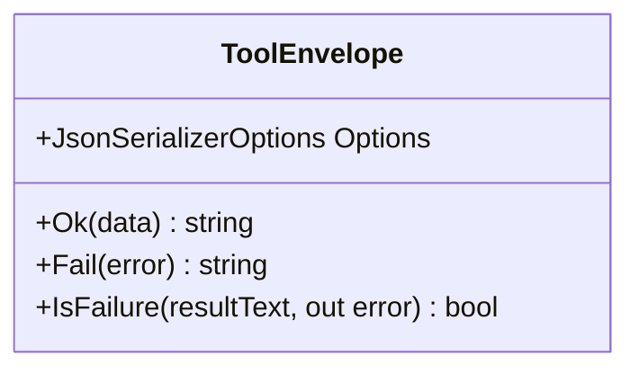
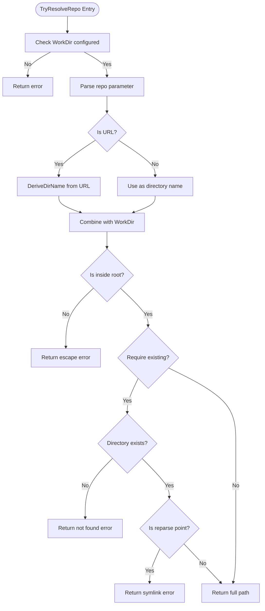
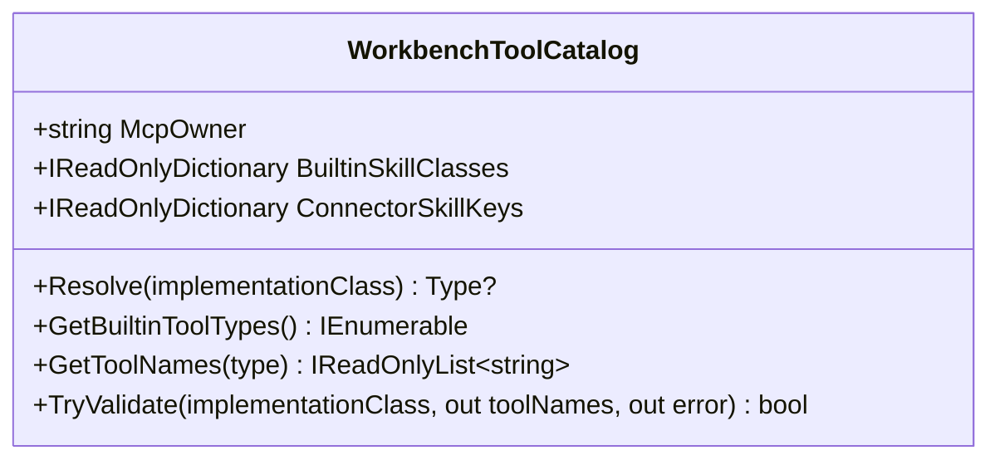
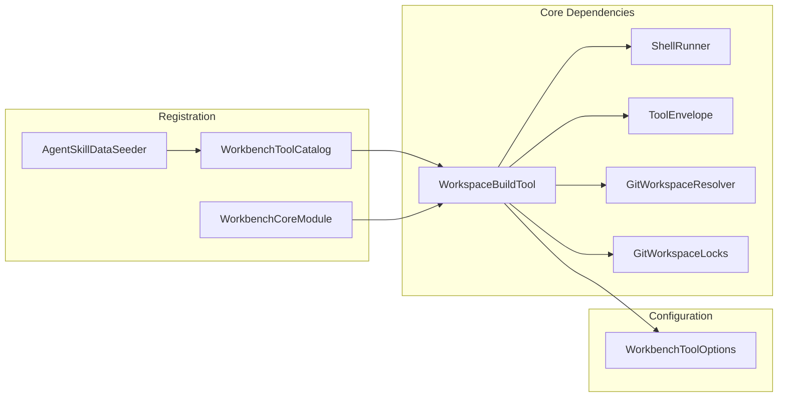

# 工作区构建工具

<cite>
**Referenced Files in This Document **
- [WorkspaceBuildTool.cs](file://src/Agent/Workbench/H.Workbench.Core/Tools/WorkspaceBuildTool.cs)
- [WorkbenchToolCatalog.cs](file://src/Agent/Workbench/H.Workbench.Core/Tools/WorkbenchToolCatalog.cs)
- [WorkbenchCoreModule.cs](file://src/Agent/Workbench/H.Workbench.Core/WorkbenchCoreModule.cs)
- [AgentSkillDataSeeder.cs](file://src/Agent/Workbench/H.Workbench.Application/Data/AgentSkillDataSeeder.cs)
- [ShellRunner.cs](file://src/Agent/Workbench/H.Workbench.Core/Tools/Internal/ShellRunner.cs)
- [ToolEnvelope.cs](file://src/Agent/Workbench/H.Workbench.Core/Tools/Internal/ToolEnvelope.cs)
- [GitWorkspaceResolver.cs](file://src/Agent/Workbench/H.Workbench.Core/Tools/Internal/GitWorkspaceResolver.cs)
- [GitWorkspaceLocks.cs](file://src/Agent/Workbench/H.Workbench.Core/Tools/Internal/GitWorkspaceLocks.cs)
- [WorkbenchToolOptions.cs](file://src/Agent/Workbench/H.Workbench.Core/WorkbenchToolOptions.cs)
</cite>

## Table of Contents
1. [Introduction](#introduction)
2. [Project Structure](#project-structure)
3. [Core Components](#core-components)
4. [Architecture Overview](#architecture-overview)
5. [Detailed Component Analysis](#detailed-component-analysis)
6. [Dependency Analysis](#dependency-analysis)
7. [Performance Considerations](#performance-considerations)
8. [Troubleshooting Guide](#troubleshooting-guide)
9. [Conclusion](#conclusion)

## Introduction

工作区构建工具（WorkspaceBuildTool）是 H.Workbench 平台中的一项核心能力，旨在解决员工在开发过程中验证代码可编译性的痛点。传统工作流程中，员工需要手动审批每个构建命令才能执行编译操作，这不仅效率低下，还容易导致"应该能跑"的盲目签字现象。

该工具通过服务端拼装命令、模型只指定仓库和配置的方式，实现了免人工审批的自动化构建流程。它支持 dotnet build 命令执行、错误解析和模板化项目创建三大核心功能，帮助团队快速验证代码质量，提升研发效率。

## Project Structure

工作区构建工具位于 Workbench 核心模块中，采用分层架构设计：

**Diagram sources **
- [WorkspaceBuildTool.cs:1-50](file://src/Agent/Workbench/H.Workbench.Core/Tools/WorkspaceBuildTool.cs#L1-L50)
- [WorkbenchToolCatalog.cs:1-30](file://src/Agent/Workbench/H.Workbench.Core/Tools/WorkbenchToolCatalog.cs#L1-L30)
- [ShellRunner.cs:1-30](file://src/Agent/Workbench/H.Workbench.Core/Tools/Internal/ShellRunner.cs#L1-L30)
- [ToolEnvelope.cs:1-20](file://src/Agent/Workbench/H.Workbench.Core/Tools/Internal/ToolEnvelope.cs#L1-L20)
- [GitWorkspaceResolver.cs:1-30](file://src/Agent/Workbench/H.Workbench.Core/Tools/Internal/GitWorkspaceResolver.cs#L1-L30)
- [GitWorkspaceLocks.cs:1-26](file://src/Agent/Workbench/H.Workbench.Core/Tools/Internal/GitWorkspaceLocks.cs#L1-L26)
- [AgentSkillDataSeeder.cs:430-450](file://src/Agent/Workbench/H.Workbench.Application/Data/AgentSkillDataSeeder.cs#L430-L450)

**Section sources**
- [WorkspaceBuildTool.cs:1-319](file://src/Agent/Workbench/H.Workbench.Core/Tools/WorkspaceBuildTool.cs#L1-L319)
- [WorkbenchToolCatalog.cs:1-122](file://src/Agent/Workbench/H.Workbench.Core/Tools/WorkbenchToolCatalog.cs#L1-L122)
- [WorkbenchCoreModule.cs:1-38](file://src/Agent/Workbench/H.Workbench.Core/WorkbenchCoreModule.cs#L1-L38)

## Core Components

工作区构建工具由以下几个核心组件构成：

### 1. WorkspaceBuildTool 主工具类

这是构建工具的核心实现类，提供了三个主要方法：

- **WorkspaceBuildAsync**: 执行 dotnet build 命令，编译已克隆的仓库
- **WorkspaceRestoreAsync**: 执行 dotnet restore 命令，还原 NuGet 依赖
- **WorkspaceScaffoldAsync**: 使用 dotnet new 生成工程骨架

该类的设计哲学是"命令由服务端拼装、模型只给参数"，因此无需像自由命令那样每次人工审批。

### 2. WorkbenchToolCatalog 技能注册表

作为内置技能注册表的唯一真源，维护了技能名到实现类的映射关系。workspace_build 技能在此注册，确保技能指向真实存在的类。

### 3. ShellRunner 命令执行器

负责实际执行 shell 命令，具备以下特性：
- 超时控制和进程树击杀
- 输出截断防止内存溢出
- 凭据掩码保护敏感信息
- 跨平台支持（Windows/Linux）

### 4. ToolEnvelope 统一返回信封

所有工具方法都通过统一的信封格式返回结果：
- 成功时：`{success:true, data:...}`
- 失败时：`{success:false, error:...}`

这种设计确保模型能准确识别构建是否成功，避免将错误文本当作事实继续处理。

### 5. GitWorkspaceResolver 路径解析器

提供安全的路径解析服务，确保所有操作都在工作目录范围内：
- 拒绝绝对路径和路径遍历（..）
- 检测符号链接逃逸
- 验证 .git 目录访问

### 6. GitWorkspaceLocks 并发锁

按仓库目录串行的写操作锁，防止同一工作副本被并发操作破坏。

**Section sources**
- [WorkspaceBuildTool.cs:15-60](file://src/Agent/Workbench/H.Workbench.Core/Tools/WorkspaceBuildTool.cs#L15-L60)
- [WorkbenchToolCatalog.cs:10-30](file://src/Agent/Workbench/H.Workbench.Core/Tools/WorkbenchToolCatalog.cs#L10-L30)
- [ShellRunner.cs:10-40](file://src/Agent/Workbench/H.Workbench.Core/Tools/Internal/ShellRunner.cs#L10-L40)
- [ToolEnvelope.cs:10-30](file://src/Agent/Workbench/H.Workbench.Core/Tools/Internal/ToolEnvelope.cs#L10-L30)

## Architecture Overview

工作区构建工具的架构设计遵循安全性和易用性并重的原则：

**Diagram sources **
- [WorkspaceBuildTool.cs:62-100](file://src/Agent/Workbench/H.Workbench.Core/Tools/WorkspaceBuildTool.cs#L62-L100)
- [GitWorkspaceResolver.cs:100-150](file://src/Agent/Workbench/H.Workbench.Core/Tools/Internal/GitWorkspaceResolver.cs#L100-L150)
- [GitWorkspaceLocks.cs:10-26](file://src/Agent/Workbench/H.Workbench.Core/Tools/Internal/GitWorkspaceLocks.cs#L10-L26)
- [ShellRunner.cs:15-80](file://src/Agent/Workbench/H.Workbench.Core/Tools/Internal/ShellRunner.cs#L15-L80)
- [ToolEnvelope.cs:15-30](file://src/Agent/Workbench/H.Workbench.Core/Tools/Internal/ToolEnvelope.cs#L15-L30)

**Section sources**
- [WorkspaceBuildTool.cs:62-110](file://src/Agent/Workbench/H.Workbench.Core/Tools/WorkspaceBuildTool.cs#L62-L110)
- [ShellRunner.cs:15-90](file://src/Agent/Workbench/H.Workbench.Core/Tools/Internal/ShellRunner.cs#L15-L90)

## Detailed Component Analysis

### WorkspaceBuildTool 详细分析

#### 类结构和字段

**Diagram sources **
- [WorkspaceBuildTool.cs:10-50](file://src/Agent/Workbench/H.Workbench.Core/Tools/WorkspaceBuildTool.cs#L10-L50)
- [WorkbenchToolOptions.cs:1-50](file://src/Agent/Workbench/H.Workbench.Core/WorkbenchToolOptions.cs#L1-L50)
- [GitWorkspaceResolver.cs:10-30](file://src/Agent/Workbench/H.Workbench.Core/Tools/Internal/GitWorkspaceResolver.cs#L10-L30)
- [GitWorkspaceLocks.cs:1-26](file://src/Agent/Workbench/H.Workbench.Core/Tools/Internal/GitWorkspaceLocks.cs#L1-L26)

#### 核心方法分析

##### 1. WorkspaceBuildAsync - 编译方法

该方法执行 dotnet build 命令，关键特性包括：

- **参数验证**: 通过 TryResolveTarget 确保路径安全
- **配置标准化**: 只允许 Debug 或 Release
- **错误提取**: 使用正则表达式匹配 MSBuild 错误行（如 `error CS1002`）
- **警告统计**: 统计 warning 数量但不影响成功判定
- **结果封装**: 返回包含退出码、错误列表、输出尾部的结构化数据

错误提取正则为：`\berror\s+[A-Z]{2,}\d{3,}\b[^\r\n]*`，这确保了只捕获标准的编译器错误，而不受控制台文案语言变化的影响。

##### 2. WorkspaceRestoreAsync - 依赖还原方法

当构建报告缺少包时，应先调用此方法。它执行 `dotnet restore` 命令，流程与构建类似但更简单，因为不需要复杂的错误解析。

##### 3. WorkspaceScaffoldAsync - 脚手架生成方法

使用 dotnet new 生成工程骨架，具备严格的安全控制：

- **模板白名单**: 只允许预定义的模板短名（console、classlib、web 等）
- **名称校验**: 工程名只能包含字母、数字和 `. _ -`
- **路径安全检查**: 防止目录遍历攻击
- **产物清单**: 返回生成的文件列表（最多40个）

**Section sources**
- [WorkspaceBuildTool.cs:62-110](file://src/Agent/Workbench/H.Workbench.Core/Tools/WorkspaceBuildTool.cs#L62-L110)
- [WorkspaceBuildTool.cs:112-145](file://src/Agent/Workbench/H.Workbench.Core/Tools/WorkspaceBuildTool.cs#L112-L145)
- [WorkspaceBuildTool.cs:147-210](file://src/Agent/Workbench/H.Workbench.Core/Tools/WorkspaceBuildTool.cs#L147-L210)
- [WorkspaceBuildTool.cs:250-280](file://src/Agent/Workbench/H.Workbench.Core/Tools/WorkspaceBuildTool.cs#L250-L280)

### ShellRunner 命令执行器分析

**Diagram sources **
- [ShellRunner.cs:15-90](file://src/Agent/Workbench/H.Workbench.Core/Tools/Internal/ShellRunner.cs#L15-L90)

关键设计点：

1. **防死锁读取**: 先启动后台线程读取流，再等待进程退出
2. **超时控制**: 使用 CancellationTokenSource 实现精确超时
3. **进程树击杀**: 超时时击杀整个进程树，防止子进程泄漏
4. **输出截断**: stdout 限制 8000 字符，stderr 限制 4000 字符
5. **跨平台支持**: Windows 使用 cmd.exe/pwsh.exe，Linux 使用 bash

**Section sources**
- [ShellRunner.cs:15-126](file://src/Agent/Workbench/H.Workbench.Core/Tools/Internal/ShellRunner.cs#L15-L126)

### ToolEnvelope 统一返回信封

**Diagram sources **
- [ToolEnvelope.cs:10-56](file://src/Agent/Workbench/H.Workbench.Core/Tools/Internal/ToolEnvelope.cs#L10-L56)

设计要点：

- **CamelCase 命名**: 符合 JavaScript/JSON 惯例
- **UnsafeRelaxedJsonEscaping**: 允许中文等非 ASCII 字符直接输出
- **失败检测**: 通过解析 JSON 判断 success 字段，非 JSON 文本按成功处理（兼容 MCP 工具）

**Section sources**
- [ToolEnvelope.cs:10-56](file://src/Agent/Workbench/H.Workbench.Core/Tools/Internal/ToolEnvelope.cs#L10-L56)

### GitWorkspaceResolver 路径安全分析

**Diagram sources **
- [GitWorkspaceResolver.cs:100-180](file://src/Agent/Workbench/H.Workbench.Core/Tools/Internal/GitWorkspaceResolver.cs#L100-L180)

安全措施：

1. **路径规范化**: 使用 Path.GetFullPath 消除相对路径歧义
2. **根目录检查**: 确保解析后的路径在工作目录内
3. **符号链接检测**: 拒绝访问符号链接，防止逃逸
4. **.git 目录保护**: 禁止访问 .git 内部文件

**Section sources**
- [GitWorkspaceResolver.cs:100-277](file://src/Agent/Workbench/H.Workbench.Core/Tools/Internal/GitWorkspaceResolver.cs#L100-L277)

### WorkbenchToolCatalog 技能注册表

**Diagram sources **
- [WorkbenchToolCatalog.cs:10-122](file://src/Agent/Workbench/H.Workbench.Core/Tools/WorkbenchToolCatalog.cs#L10-L122)

关键功能：

- **BuiltinSkillClasses**: 维护技能名到实现类的映射，workspace_build 映射到 WorkspaceBuildTool
- **TryValidate**: 验证实现类可加载且至少有一个带 Description 的方法
- **Resolve**: 支持跨程序集类型解析，先 Type.GetType 再扫描已加载程序集

**Section sources**
- [WorkbenchToolCatalog.cs:10-122](file://src/Agent/Workbench/H.Workbench.Core/Tools/WorkbenchToolCatalog.cs#L10-L122)

## Dependency Analysis

工作区构建工具的依赖关系如下：

**Diagram sources **
- [WorkspaceBuildTool.cs:1-50](file://src/Agent/Workbench/H.Workbench.Core/Tools/WorkspaceBuildTool.cs#L1-L50)
- [WorkbenchToolCatalog.cs:15-25](file://src/Agent/Workbench/H.Workbench.Core/Tools/WorkbenchToolCatalog.cs#L15-L25)
- [WorkbenchCoreModule.cs:15-25](file://src/Agent/Workbench/H.Workbench.Core/WorkbenchCoreModule.cs#L15-L25)
- [AgentSkillDataSeeder.cs:430-450](file://src/Agent/Workbench/H.Workbench.Application/Data/AgentSkillDataSeeder.cs#L430-L450)

依赖特点：

1. **单例注入**: WorkspaceBuildTool 及其依赖都是单例，避免依赖 scoped 服务
2. **无循环依赖**: 各组件职责清晰，没有循环引用
3. **配置驱动**: 通过 WorkbenchToolOptions 集中管理配置

**Section sources**
- [WorkbenchCoreModule.cs:1-38](file://src/Agent/Workbench/H.Workbench.Core/WorkbenchCoreModule.cs#L1-L38)
- [WorkbenchToolOptions.cs:1-50](file://src/Agent/Workbench/H.Workbench.Core/WorkbenchToolOptions.cs#L1-L50)

## Performance Considerations

### 性能优化策略

1. **正则表达式编译**: ErrorLineRegex 和 WarningRegex 使用 RegexOptions.Compiled，提高重复匹配性能

2. **输出截断**: 
   - stdout 限制 8000 字符
   - stderr 限制 4000 字符
   - 防止大输出占用过多内存

3. **并发控制**: GitWorkspaceLocks 按仓库串行化操作，避免并发冲突导致的重试开销

4. **超时分级**:
   - 构建默认 600 秒
   - 脚手架默认 180 秒
   - 还原默认 600 秒
   - 可根据需要调整

### 资源消耗分析

- **CPU**: 主要消耗在 dotnet build 过程，工具本身开销很小
- **内存**: 输出缓冲控制在 12KB 以内
- **磁盘 I/O**: 取决于项目大小，工具本身不产生额外 I/O

### 扩展建议

对于大型解决方案，可以考虑：
- 增量构建优化
- 并行项目构建
- 构建缓存利用

## Troubleshooting Guide

### 常见问题及解决方案

#### 1. 构建失败但退出码为 0

**症状**: 构建显示成功，但实际有编译错误

**原因**: 某些警告可能被误判为错误，或者错误输出被截断

**解决方案**:
- 检查返回的 errors 数组
- 查看 stderrTail 获取完整错误信息
- 确认项目确实存在编译错误

**Section sources**
- [WorkspaceBuildTool.cs:85-100](file://src/Agent/Workbench/H.Workbench.Core/Tools/WorkspaceBuildTool.cs#L85-L100)

#### 2. 路径解析失败

**症状**: 提示"仓库不存在或越出工作目录"

**原因**: 
- 仓库未克隆
- 路径包含 .. 尝试逃逸
- 路径是符号链接

**解决方案**:
- 先调用 GitCloneAsync 克隆仓库
- 使用相对路径，避免 ..
- 确认路径不是符号链接

**Section sources**
- [GitWorkspaceResolver.cs:120-150](file://src/Agent/Workbench/H.Workbench.Core/Tools/Internal/GitWorkspaceResolver.cs#L120-L150)

#### 3. 模板不在允许列表

**症状**: 脚手架生成失败，提示模板不在白名单

**原因**: 使用了未在 AllowedTemplates 中定义的模板

**解决方案**:
- 使用允许的模板：console、classlib、xunit、web、blazor 等
- 如需新模板，修改 AllowedTemplates 数组

**Section sources**
- [WorkspaceBuildTool.cs:12-18](file://src/Agent/Workbench/H.Workbench.Core/Tools/WorkspaceBuildTool.cs#L12-L18)

#### 4. 超时错误

**症状**: 执行超时，返回 -1 退出码

**原因**: 
- 构建时间超过 timeoutSeconds
- 网络问题导致 restore 缓慢

**解决方案**:
- 增加 timeoutSeconds 参数
- 先执行 WorkspaceRestoreAsync 还原依赖
- 检查网络连接

**Section sources**
- [ShellRunner.cs:55-70](file://src/Agent/Workbench/H.Workbench.Core/Tools/Internal/ShellRunner.cs#L55-L70)

#### 5. 并发冲突

**症状**: 多个操作同时执行同一仓库，出现文件锁定错误

**原因**: GitWorkspaceLocks 未正确释放锁

**解决方案**:
- 确保使用 using 语句或正确释放 IDisposable
- 避免在同一仓库上并发执行写操作

**Section sources**
- [GitWorkspaceLocks.cs:10-26](file://src/Agent/Workbench/H.Workbench.Core/Tools/Internal/GitWorkspaceLocks.cs#L10-L26)

### 调试技巧

1. **查看详细日志**: 工具会记录执行的命令和超时设置
2. **检查 StdOut/StdErr**: 返回结果中包含输出尾部，可用于诊断
3. **验证路径**: 使用 WorkspaceListFilesAsync 确认文件存在
4. **测试简单项目**: 先用小型项目验证工具正常工作

## Conclusion

工作区构建工具通过精心设计的架构和安全机制，成功解决了代码编译验证的自动化问题。其核心优势包括：

1. **免审批执行**: 命令由服务端拼装，模型只提供参数，无需每次人工审批
2. **安全可控**: 多层路径验证、模板白名单、输出截断等安全措施
3. **错误友好**: 结构化返回包含错误列表、警告计数和输出尾部
4. **易于集成**: 作为标准技能注册到 WorkbenchToolCatalog，可被 AI 模型直接调用

该工具不仅提升了研发效率，还通过自动化验证减少了人为错误，是现代化开发工作流的重要组成部分。未来可以考虑增强对多框架支持、构建缓存优化等功能，进一步提升用户体验。

**Section sources**
- [WorkspaceBuildTool.cs:1-319](file://src/Agent/Workbench/H.Workbench.Core/Tools/WorkspaceBuildTool.cs#L1-L319)
- [WorkbenchToolCatalog.cs:1-122](file://src/Agent/Workbench/H.Workbench.Core/Tools/WorkbenchToolCatalog.cs#L1-L122)