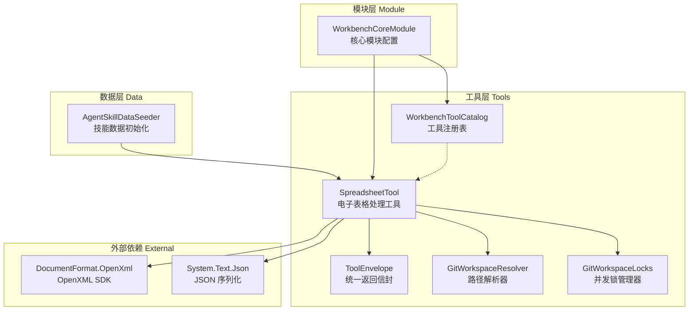
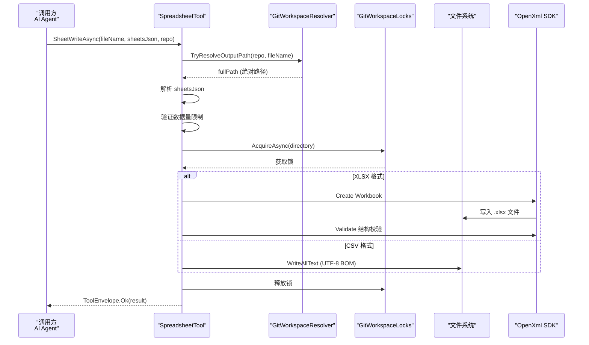
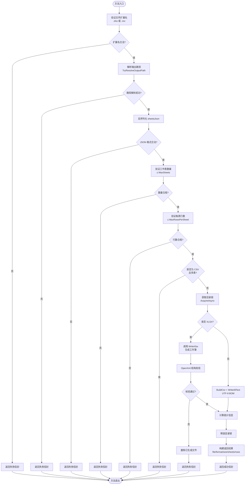
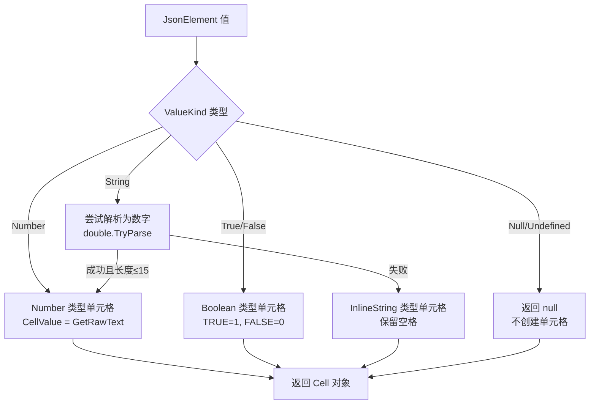
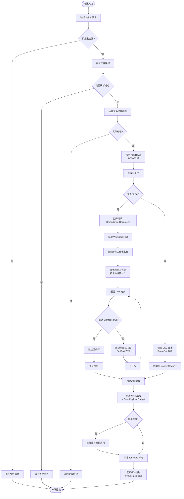
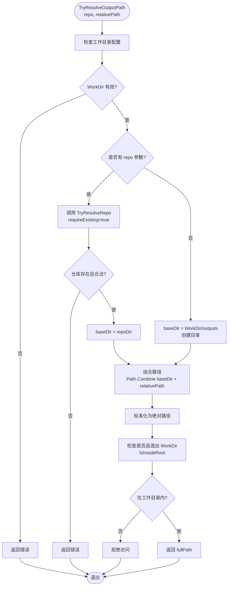
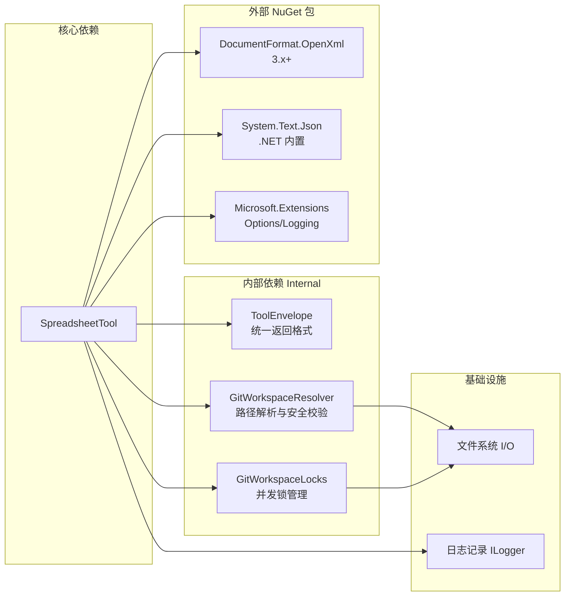

# 电子表格处理工具

<cite>
**本文档引用文件**
- [SpreadsheetTool.cs](file://src/Agent/Workbench/H.Workbench.Core/Tools/SpreadsheetTool.cs)
- [WorkbenchToolCatalog.cs](file://src/Agent/Workbench/H.Workbench.Core/Tools/WorkbenchToolCatalog.cs)
- [WorkbenchCoreModule.cs](file://src/Agent/Workbench/H.Workbench.Core/WorkbenchCoreModule.cs)
- [AgentSkillDataSeeder.cs](file://src/Agent/Workbench/H.Workbench.Application/Data/AgentSkillDataSeeder.cs)
- [ToolEnvelope.cs](file://src/Agent/Workbench/H.Workbench.Core/Tools/Internal/ToolEnvelope.cs)
- [GitWorkspaceResolver.cs](file://src/Agent/Workbench/H.Workbench.Core/Tools/Internal/GitWorkspaceResolver.cs)
- [GitWorkspaceLocks.cs](file://src/Agent/Workbench/H.Workbench.Core/Tools/Internal/GitWorkspaceLocks.cs)
- [H.Workbench.Core.csproj](file://src/Agent/Workbench/H.Workbench.Core/H.Workbench.Core.csproj)
</cite>

## 目录
1. [简介](#简介)
2. [项目结构](#项目结构)
3. [核心组件](#核心组件)
4. [架构概览](#架构概览)
5. [详细组件分析](#详细组件分析)
6. [依赖分析](#依赖分析)
7. [性能考量](#性能考量)
8. [故障排除指南](#故障排除指南)
9. [结论](#结论)

## 简介

电子表格处理工具（SpreadsheetTool）是 H.Workbench 平台中的一个核心功能组件，专门用于在工作目录内生成和读取 Excel (.xlsx) 与 CSV 格式的电子表格文件。该工具旨在解决 AI 助手在交付报表类任务时的痛点——传统方式往往将表格数据以文本形式粘贴在对话中，导致格式混乱、对齐困难且难以直接使用。

该工具的核心设计理念包括：

**安全验证机制**：通过严格的路径校验防止目录遍历攻击，确保所有文件操作都在指定的工作目录范围内进行。使用 DocumentFormat.OpenXml 库进行结构化验证，确保生成的 xlsx 文件格式正确，避免产生损坏的文件。

**数据量限制**：针对 AI 对话轨迹的截断特性，工具对读写操作设置了明确的上限。单个工作表最多支持 5000 行、100 列，整个工作簿最多包含 20 个工作表。回读操作默认返回 60 行，并设有 3300 字符的序列化预算，超过此限制会自动截断数据并标记 truncated 标志，确保返回的 JSON 完整可用。

**并发控制**：通过 GitWorkspaceLocks 实现按目录的写操作串行化，防止多个并发操作同时修改同一工作副本导致的文件损坏或数据不一致问题。

**双格式支持**：同时支持 .xlsx（Excel 工作簿，支持多工作表、富数据类型）和 .csv（逗号分隔文本，轻量级单表格式），满足不同场景下的需求。CSV 文件特别添加了 UTF-8 BOM 头，确保在中文 Windows 系统上的 Excel 中能正确显示中文内容。

## 项目结构

**图表来源**
- [SpreadsheetTool.cs:1-50](file://src/Agent/Workbench/H.Workbench.Core/Tools/SpreadsheetTool.cs#L1-L50)
- [WorkbenchCoreModule.cs:1-38](file://src/Agent/Workbench/H.Workbench.Core/WorkbenchCoreModule.cs#L1-L38)
- [WorkbenchToolCatalog.cs:1-122](file://src/Agent/Workbench/H.Workbench.Core/Tools/WorkbenchToolCatalog.cs#L1-L122)

**章节来源**
- [SpreadsheetTool.cs:1-607](file://src/Agent/Workbench/H.Workbench.Core/Tools/SpreadsheetTool.cs#L1-L607)
- [WorkbenchCoreModule.cs:1-38](file://src/Agent/Workbench/H.Workbench.Core/WorkbenchCoreModule.cs#L1-L38)
- [H.Workbench.Core.csproj:1-24](file://src/Agent/Workbench/H.Workbench.Core/H.Workbench.Core.csproj#L1-L24)

## 核心组件

### SpreadsheetTool 主类

SpreadsheetTool 是整个电子表格处理功能的核心实现类，提供了两个主要的公共方法：SheetWriteAsync 和 SheetReadAsync。该类采用依赖注入模式，接收 WorkbenchToolOptions 配置、GitWorkspaceLocks 并发锁管理器和日志记录器作为构造函数参数。

**关键常量定义**：

| 常量名称 | 值 | 说明 |
|---------|-----|------|
| MaxSheets | 20 | 工作簿中允许的最大工作表数量 |
| MaxRowsPerSheet | 5000 | 单个工作表允许的最大行数 |
| MaxColumns | 100 | 单个工作表允许的最大列数 |
| ReadPayloadBudget | 3300 | 回读数据的序列化字符预算（为 ToolExecutor 的 4000 字截断预留 700 字余量） |

**核心字段**：

- `_resolver`：GitWorkspaceResolver 实例，负责将相对路径解析为工作目录内的绝对路径，并进行安全校验
- `_locks`：GitWorkspaceLocks 实例，提供基于信号量的目录级并发控制
- `_logger`：ILogger 实例，用于记录警告和错误信息

**章节来源**
- [SpreadsheetTool.cs:15-50](file://src/Agent/Workbench/H.Workbench.Core/Tools/SpreadsheetTool.cs#L15-L50)

### SheetSpec 数据结构

SheetSpec 是一个私有密封类，用于表示单个工作表的规范定义。它包含两个属性：Name（工作表名称，可为空）和 Rows（行数据列表，每行是一个 JsonElement 可选值的列表）。该结构在反序列化 sheetsJson 参数时使用，支持字符串、数字、布尔值和 null 等多种单元格数据类型。

**章节来源**
- [SpreadsheetTool.cs:602-607](file://src/Agent/Workbench/H.Workbench.Core/Tools/SpreadsheetTool.cs#L602-L607)

### ToolEnvelope 统一信封

ToolEnvelope 是一个静态工具类，提供统一的工具返回格式封装。所有工具方法都通过 Ok() 或 Fail() 方法返回标准化的 JSON 字符串，格式为 `{success:true, data:...}` 或 `{success:false, error:...}`。这种设计确保了失败情况能被正确识别和处理，避免模型将错误文本当作事实继续加工。

**章节来源**
- [ToolEnvelope.cs:1-56](file://src/Agent/Workbench/H.Workbench.Core/Tools/Internal/ToolEnvelope.cs#L1-L56)

## 架构概览

**图表来源**
- [SpreadsheetTool.cs:55-140](file://src/Agent/Workbench/H.Workbench.Core/Tools/SpreadsheetTool.cs#L55-L140)
- [GitWorkspaceResolver.cs:170-210](file://src/Agent/Workbench/H.Workbench.Core/Tools/Internal/GitWorkspaceResolver.cs#L170-L210)
- [GitWorkspaceLocks.cs:14-20](file://src/Agent/Workbench/H.Workbench.Core/Tools/Internal/GitWorkspaceLocks.cs#L14-L20)

**章节来源**
- [SpreadsheetTool.cs:55-140](file://src/Agent/Workbench/H.Workbench.Core/Tools/SpreadsheetTool.cs#L55-L140)
- [GitWorkspaceResolver.cs:1-277](file://src/Agent/Workbench/H.Workbench.Core/Tools/Internal/GitWorkspaceResolver.cs#L1-L277)
- [GitWorkspaceLocks.cs:1-26](file://src/Agent/Workbench/H.Workbench.Core/Tools/Internal/GitWorkspaceLocks.cs#L1-L26)

## 详细组件分析

### 写入流程分析

#### SheetWriteAsync 方法执行流程

**图表来源**
- [SpreadsheetTool.cs:55-140](file://src/Agent/Workbench/H.Workbench.Core/Tools/SpreadsheetTool.cs#L55-L140)
- [SpreadsheetTool.cs:260-360](file://src/Agent/Workbench/H.Workbench.Core/Tools/SpreadsheetTool.cs#L260-L360)

#### WriteXlsx 内部实现

WriteXlsx 方法负责创建符合 OpenXML 标准的 Excel 工作簿文件。该方法执行以下关键步骤：

1. **创建工作簿结构**：使用 SpreadsheetDocument.Create 创建新的工作簿，添加 WorkbookPart 和 Sheets 集合
2. **工作表命名规范化**：通过 SanitizeSheetName 方法清理工作表名称，移除非法字符（: \ / ? * [ ]），限制长度不超过 31 个字符
3. **行列数据处理**：遍历每个工作表的行数据，根据 JsonElement 的值类型构建 Cell 对象
   - Null/Undefined：跳过不创建单元格
   - Number：设置 DataType 为 Number，直接写入数值
   - Boolean：转换为 "1" 或 "0"，DataType 设为 Boolean
   - String：尝试解析为数字（长度 ≤ 15 时），否则作为 InlineString 存储
4. **列宽设置**：为有数据的列设置固定宽度 22
5. **结构校验**：使用 OpenXmlValidator 验证生成的文件是否符合 OpenXML 标准，如有错误则记录警告并返回错误信息

**单元格类型转换逻辑**：

**图表来源**
- [SpreadsheetTool.cs:362-410](file://src/Agent/Workbench/H.Workbench.Core/Tools/SpreadsheetTool.cs#L362-L410)

**章节来源**
- [SpreadsheetTool.cs:55-140](file://src/Agent/Workbench/H.Workbench.Core/Tools/SpreadsheetTool.cs#L55-L140)
- [SpreadsheetTool.cs:260-410](file://src/Agent/Workbench/H.Workbench.Core/Tools/SpreadsheetTool.cs#L260-L410)

### 读取流程分析

#### SheetReadAsync 方法执行流程

**图表来源**
- [SpreadsheetTool.cs:142-235](file://src/Agent/Workbench/H.Workbench.Core/Tools/SpreadsheetTool.cs#L142-L235)
- [SpreadsheetTool.cs:237-258](file://src/Agent/Workbench/H.Workbench.Core/Tools/SpreadsheetTool.cs#L237-L258)

#### CSV 解析算法

ParseCsv 方法实现了最小化的 RFC4180 兼容解析器，能够正确处理以下复杂场景：

- **引号包裹字段**：支持双引号包裹包含特殊字符的字段
- **转义引号**：字段内的双引号通过 "" 转义
- **字段内含换行**：引号包裹的字段可以包含换行符
- **空行过滤**：自动过滤首尾的空行（记事本/Excel 常见行为）

解析过程采用状态机方式，维护 inQuotes 标志位跟踪当前是否在引号包裹的字段内。遇到逗号时分隔字段，遇到换行时结束当前行。

**章节来源**
- [SpreadsheetTool.cs:142-235](file://src/Agent/Workbench/H.Workbench.Core/Tools/SpreadsheetTool.cs#L142-L235)
- [SpreadsheetTool.cs:500-580](file://src/Agent/Workbench/H.Workbench.Core/Tools/SpreadsheetTool.cs#L500-L580)

### 安全机制分析

#### 路径解析与安全校验

GitWorkspaceResolver 提供了多层安全防护，确保所有文件操作都在授权的工作目录范围内：

**TryResolveOutputPath 方法的安全检查流程**：

**图表来源**
- [GitWorkspaceResolver.cs:170-210](file://src/Agent/Workbench/H.Workbench.Core/Tools/Internal/GitWorkspaceResolver.cs#L170-L210)

**关键安全措施**：

1. **禁止绝对路径**：relativePath 不能以 "/" 开头或为根路径
2. **禁止目录穿越**：通过 Path.GetFullPath 标准化后检查路径前缀，防止 ".." 逃逸
3. **符号链接检测**：使用 FileAttributes.ReparsePoint 检测符号链接，拒绝访问以防绕过安全检查
4. **.git 目录保护**：通过 IsInsideGitDir 方法阻止访问仓库的 .git 内部目录
5. **工作目录隔离**：所有路径必须在配置的 WorkDir 范围内，即使给了 repo 参数也会二次校验

**章节来源**
- [GitWorkspaceResolver.cs:1-277](file://src/Agent/Workbench/H.Workbench.Core/Tools/Internal/GitWorkspaceResolver.cs#L1-L277)

#### 并发控制机制

GitWorkspaceLocks 使用 ConcurrentDictionary 和 SemaphoreSlim 实现细粒度的目录级锁：

- **键值设计**：使用 Path.GetFullPath 标准化后的目录路径作为键，确保同一物理目录只有一个锁实例
- **信号量配置**：初始计数和最大计数均为 1，实现互斥锁语义
- **自动释放**：通过 Releaser 内部类实现 IDisposable 模式，确保锁在 using 块结束时自动释放
- **异步等待**：支持 CancellationToken，允许调用方取消等待

这种设计避免了全局锁的性能瓶颈，不同目录的操作可以并行执行，而同一目录的并发写操作会被串行化。

**章节来源**
- [GitWorkspaceLocks.cs:1-26](file://src/Agent/Workbench/H.Workbench.Core/Tools/Internal/GitWorkspaceLocks.cs#L1-L26)

### 工具注册与集成

#### WorkbenchToolCatalog 注册表

WorkbenchToolCatalog 是内置技能注册表的唯一真源，维护了技能名称到实现类的映射关系。spreadsheet 技能被注册为指向 H.Workbench.Core.Tools.SpreadsheetTool 类。

**关键功能**：

- **BuiltinSkillClasses 字典**：存储所有内置技能的名称和对应的完全限定类名
- **Resolve 方法**：通过 Type.GetType 和程序集扫描双重机制加载类型，支持跨程序集的实现类
- **GetToolNames 方法**：反射获取类中所有带 [Description] 特性的公共方法，这些方法可注册为工具
- **TryValidate 方法**：验证实现类是否可加载且至少包含一个工具方法，供数据播种器和 UI 共用

**章节来源**
- [WorkbenchToolCatalog.cs:1-122](file://src/Agent/Workbench/H.Workbench.Core/Tools/WorkbenchToolCatalog.cs#L1-L122)

#### WorkbenchCoreModule 依赖注入配置

WorkbenchCoreModule 在 ConfigureServices 方法中将 SpreadsheetTool 注册为单例服务。由于工具实例被单例 ToolRegistry 捕获，因此必须是单例生命周期，不能依赖 scoped 服务。

**注册顺序**：
1. 从配置文件绑定 WorkbenchToolOptions
2. 依次注册各个工具类为单例（包括 SpreadsheetTool）
3. 注册 BrowserSessionPool 和 GitWorkspaceLocks 等支撑服务

**章节来源**
- [WorkbenchCoreModule.cs:1-38](file://src/Agent/Workbench/H.Workbench.Core/WorkbenchCoreModule.cs#L1-L38)

#### AgentSkillDataSeeder 数据初始化

AgentSkillDataSeeder 在系统启动时播种 spreadsheet 技能的元数据：

| 字段 | 值 |
|------|-----|
| SkillName | spreadsheet |
| DisplayName | 表格处理 |
| Description | 在工作目录内生成/回读 .xlsx 与 .csv（多工作表、表头、数字与文本自动区分） |
| SkillType | Function |
| ImplementationClass | H.Workbench.Core.Tools.SpreadsheetTool |
| RequiresApproval | false |

该技能被分配给多个代理角色，如财务分析师、数据分析师等，与其他技能（office_document、notify、search、database）组合使用。

**章节来源**
- [AgentSkillDataSeeder.cs:458-464](file://src/Agent/Workbench/H.Workbench.Application/Data/AgentSkillDataSeeder.cs#L458-L464)

## 依赖分析

**图表来源**
- [H.Workbench.Core.csproj:1-24](file://src/Agent/Workbench/H.Workbench.Core/H.Workbench.Core.csproj#L1-L24)
- [SpreadsheetTool.cs:1-10](file://src/Agent/Workbench/H.Workbench.Core/Tools/SpreadsheetTool.cs#L1-L10)

**关键依赖说明**：

**DocumentFormat.OpenXml**：微软官方提供的 OpenXML SDK，用于创建和操作 Office Open XML 格式文件（.xlsx、.docx 等）。该库提供了强类型的 API 来构建工作簿、工作表、行、单元格等结构，并包含 OpenXmlValidator 用于验证文件结构的合规性。

**System.Text.Json**：.NET 内置的高性能 JSON 序列化库，用于解析 sheetsJson 参数和序列化返回结果。使用 PropertyNameCaseInsensitive 选项实现大小写不敏感的属性匹配，提升容错性。

**Microsoft.Extensions.Options/Logging**：提供配置绑定和日志记录基础设施，支持从 appsettings.json 等配置文件读取 WorkbenchToolOptions，并通过 ILogger 记录警告和错误信息。

**章节来源**
- [H.Workbench.Core.csproj:1-24](file://src/Agent/Workbench/H.Workbench.Core/H.Workbench.Core.csproj#L1-L24)
- [SpreadsheetTool.cs:1-10](file://src/Agent/Workbench/H.Workbench.Core/Tools/SpreadsheetTool.cs#L1-L10)

## 性能考量

### 数据量限制策略

工具通过多层次的限制机制平衡功能性和安全性：

**写入限制**：
- 工作表数量上限 20 个，防止生成过于庞大的工作簿
- 单表行数上限 5000 行，避免内存溢出和文件过大
- 列数上限 100 列，限制横向扩展
- CSV 仅支持单表，多表需求必须使用 xlsx 格式

**读取限制**：
- 默认返回 60 行，可通过 maxRows 参数调整（上限 500 行）
- 序列化预算 3300 字符，超过时自动逐行裁剪并标记 truncated
- 这种设计考虑了 ToolExecutor 在 4000 字符处截断的特性，预留 700 字符给 JSON 信封和提示字段

**预算裁剪算法**：
当序列化后的 rows 数组超过 ReadPayloadBudget 时，从末尾逐行移除直到满足预算要求。这种策略优先保留前面的数据（通常是表头和重要数据），牺牲尾部数据以保证返回内容的完整性。

### 并发性能优化

**目录级细粒度锁**：相比全局锁，GitWorkspaceLocks 使用基于目录路径的信号量字典，允许不同目录的操作并行执行。只有针对同一目录的并发写操作才会被串行化，最大化并发吞吐量。

**只读操作无锁**：SheetReadAsync 虽然也获取锁，但主要目的是保证读取期间文件不被并发写入破坏。对于纯查询场景，可以考虑进一步优化为读写锁或无锁读取。

### 内存效率

**流式处理**：WriteXlsx 方法逐行构建 SheetData，而非一次性加载所有数据到内存。CellText 方法按需解析 SharedStringTable，避免预先加载所有共享字符串。

**延迟序列化**：BuildReadPayload 方法先构建完整的结果对象，仅在需要时才调用 JsonSerializer.Serialize 检查长度，避免不必要的序列化开销。

### CSV 编码优化

**UTF-8 BOM 头**：CSV 文件写入时使用 `new UTF8Encoding(true)` 显式添加 BOM 头，解决中文 Windows 系统上 Excel 打开 UTF-8 文件时乱码的问题。这是一个小而重要的兼容性改进。

## 故障排除指南

### 常见问题及解决方案

**问题 1：fileName 必须以 .xlsx 或 .csv 结尾**

*原因*：传入的文件名没有正确的扩展名  
*解决方案*：确保 fileName 参数以 ".xlsx" 或 ".csv" 结尾（不区分大小写）

**问题 2：sheetsJson 不是合法 JSON 数组**

*原因*：sheetsJson 参数格式错误或不是有效的 JSON 数组  
*解决方案*：检查 JSON 语法，确保是数组格式 `[{"name":"...", "rows":[...]}]`，可以使用在线 JSON 验证工具检查

**问题 3：工作表数量超过上限 20**

*原因*：sheetsJson 中包含的工作表数量超过 MaxSheets 限制  
*解决方案*：减少工作表数量或将数据分散到多个文件中

**问题 4：单表行数超过上限 5000**

*原因*：某个工作表的 rows 数组长度超过 MaxRowsPerSheet  
*解决方案*：拆分数据到多个工作表或多个文件

**问题 5：csv 只能承载单个工作表**

*原因*：尝试将多个工作表写入 .csv 文件  
*解决方案*：改用 .xlsx 格式或将数据合并为单个工作表

**问题 6：文件不存在**

*原因*：SheetReadAsync 尝试读取的文件在指定路径不存在  
*解决方案*：确认文件名和路径正确，或先调用 SheetWriteAsync 生成文件

**问题 7：生成的表格结构校验未通过**

*原因*：OpenXmlValidator 检测到生成的 xlsx 文件结构不符合 OpenXML 标准  
*解决方案*：检查输入数据的合法性，查看日志中的具体错误描述。常见原因包括非法的工作表名称、无效的单元格引用等

**问题 8：拒绝访问工作目录之外的路径**

*原因*：fileName 包含 ".." 或绝对路径试图逃逸出 WorkDir  
*解决方案*：使用相对于工作目录或仓库目录的路径，不要使用 ".." 或绝对路径

**问题 9：仓库 XXX 尚未克隆到工作目录**

*原因*：指定的 repo 参数对应的仓库目录不存在  
*解决方案*：先调用 GitCloneAsync 克隆仓库，或使用 GitListReposAsync 查看已克隆的仓库列表

**问题 10：回读数据被截断（truncated: true）**

*原因*：返回的数据序列化后超过 3300 字符预算  
*解决方案*：这是预期行为，表示部分数据被裁剪以保证 JSON 完整性。可以增加 maxRows 参数获取更多数据，或分多次读取不同部分

### 调试技巧

**启用详细日志**：检查应用日志中关于 OpenXml 校验失败的警告信息，通常包含具体的错误描述和位置

**验证 JSON 格式**：在调用 SheetWriteAsync 前，先在本地验证 sheetsJson 是否能被正确反序列化

**检查文件权限**：确认工作目录和 outputs 子目录具有写入权限

**测试小数据集**：先用少量数据测试工具功能，确认基本流程正常后再处理大数据集

## 结论

SpreadsheetTool 是一个设计精良的电子表格处理组件，成功解决了 AI 助手在报表交付场景中的核心痛点。其设计亮点包括：

**安全性优先**：通过多层路径校验、符号链接检测和并发锁机制，确保文件操作的安全性和一致性。所有文件都被限制在配置的工作目录范围内，防止目录遍历攻击。

**智能数据限制**：针对 AI 对话轨迹的截断特性，设计了合理的读写上限和预算裁剪算法，确保返回的数据始终完整可用。这种"宁可少返回，不可返回残缺"的设计理念值得借鉴。

**双格式灵活支持**：同时支持功能丰富的 xlsx 格式和轻量的 csv 格式，满足不同场景需求。特别针对中文环境的编码问题进行了优化（UTF-8 BOM）。

**标准化返回格式**：通过 ToolEnvelope 统一信封确保所有工具返回格式一致，便于调用方统一处理成功和失败情况。

**可扩展架构**：通过 WorkbenchToolCatalog 注册表和依赖注入模式，新工具可以轻松集成到系统中。SpreadsheetTool 本身也可以作为模板，指导其他类似工具的开发。

未来可能的改进方向包括：支持更多 Excel 功能（公式、图表、条件格式）、增加数据透视表支持、优化大数据集的流式读写性能、以及提供更丰富的 CSV 解析选项（自定义分隔符、编码等）。