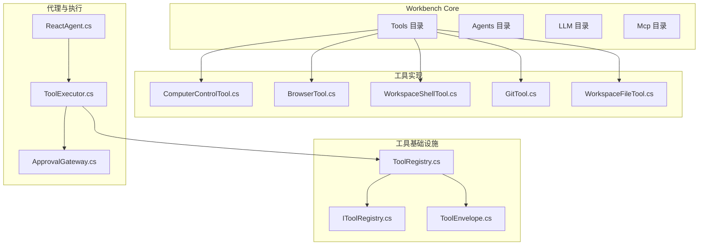
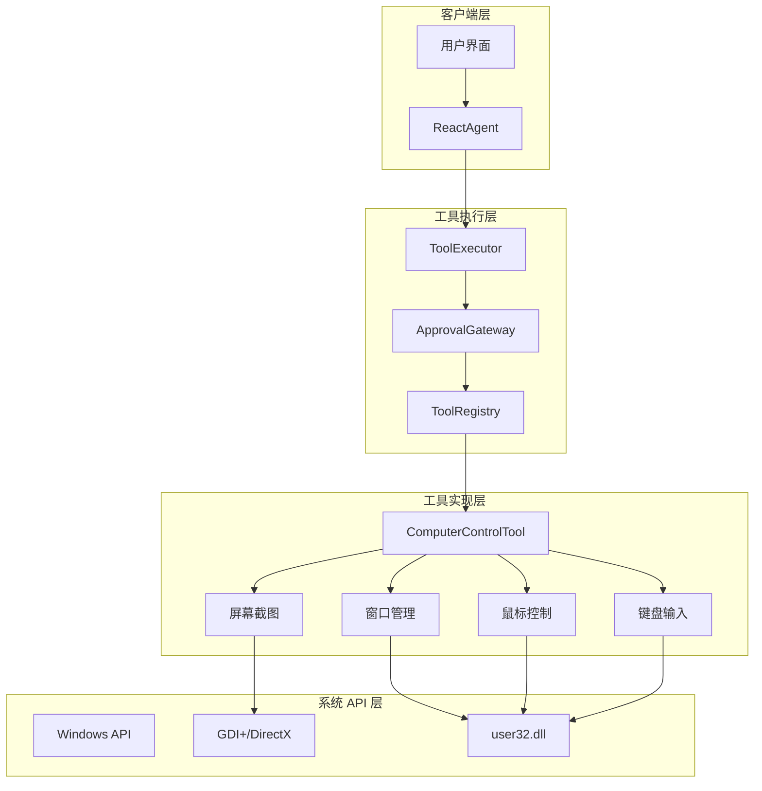
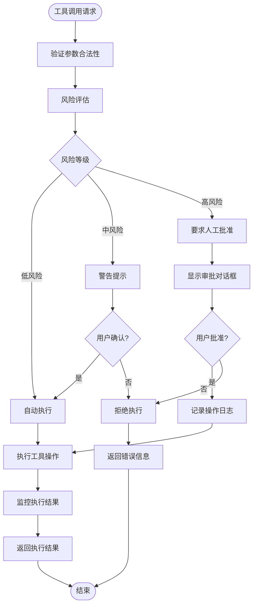
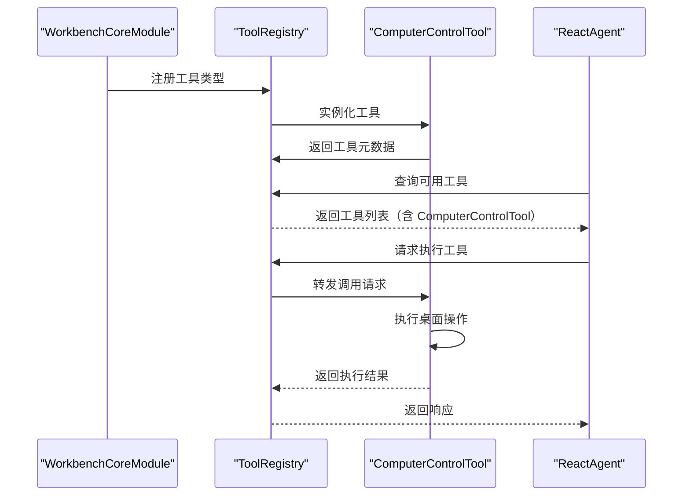
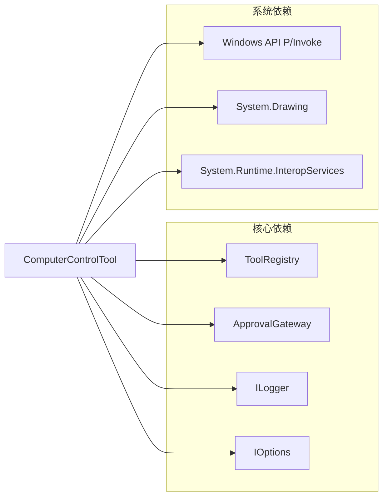

# 计算机控制工具

<cite>
**本文档引用文件**   
- [ComputerControlTool.cs](file://src/Agent/Workbench/H.Workbench.Core/Tools/ComputerControlTool.cs)
- [YunXiaoMcpTools.cs](file://src/Agent/McpServers/H.Mcp.YunXiao/YunXiaoMcpTools.cs)
- [YunXiaoMcpServerModule.cs](file://src/Agent/McpServers/H.Mcp.YunXiao/YunXiaoMcpServerModule.cs)
- [YunXiaoApiClient.cs](file://src/Agent/McpServers/H.Mcp.YunXiao/YunXiaoApiClient.cs)
- [YunXiaoOptions.cs](file://src/Agent/McpServers/H.Mcp.YunXiao/YunXiaoOptions.cs)
- [H.Mcp.YunXiao.csproj](file://src/Agent/McpServers/H.Mcp.YunXiao/H.Mcp.YunXiao.csproj)
- [ToolRegistry.cs](file://src/Agent/Workbench/H.Workbench.Core/Tools/ToolRegistry.cs)
- [IToolRegistry.cs](file://src/Agent/Workbench/H.Workbench.Core/Tools/IToolRegistry.cs)
- [WorkbenchCoreModule.cs](file://src/Agent/Workbench/H.Workbench.Core/WorkbenchCoreModule.cs)
- [WorkbenchToolOptions.cs](file://src/Agent/Workbench/H.Workbench.Core/WorkbenchToolOptions.cs)
- [WorkbenchToolCatalog.cs](file://src/Agent/Workbench/H.Workbench.Core/Tools/WorkbenchToolCatalog.cs)
- [ApprovalGateway.cs](file://src/Agent/Workbench/H.Workbench.Core/Agents/ApprovalGateway.cs)
- [ApprovalRuleEvaluator.cs](file://src/Agent/Workbench/H.Workbench.Core/Agents/ApprovalRuleEvaluator.cs)
- [ReactAgent.cs](file://src/Agent/Workbench/H.Workbench.Core/Agents/ReactAgent.cs)
- [ToolExecutor.cs](file://src/Agent/Workbench/H.Workbench.Core/Agents/ToolExecutor.cs)
- [BrowserTool.cs](file://src/Agent/Workbench/H.Workbench.Core/Tools/BrowserTool.cs)
- [WorkspaceShellTool.cs](file://src/Agent/Workbench/H.Workbench.Core/Tools/WorkspaceShellTool.cs)
</cite>

## 目录
1. [简介](#简介)
2. [项目结构](#项目结构)
3. [核心组件](#核心组件)
4. [架构概览](#架构概览)
5. [详细组件分析](#详细组件分析)
6. [依赖分析](#依赖分析)
7. [性能考虑](#性能考虑)
8. [故障排除指南](#故障排除指南)
9. [结论](#结论)

## 简介

计算机控制工具（ComputerControlTool）是 Workbench 平台新增的 Windows 桌面自动化工具，提供屏幕截图、窗口枚举与激活、鼠标移动点击和键盘输入模拟等能力。该工具直接操作真实桌面环境，默认需要人工批准，仅执行原子操作而非批量脚本，确保操作的安全性和可控性。

本工具基于现有的 Workbench 工具框架设计，遵循与其他工具（如 BrowserTool、WorkspaceShellTool 等）相同的架构模式，集成到 MCP（Model Context Protocol）服务器体系中，通过标准化的工具注册和执行机制提供服务。

## 项目结构

Workbench 项目采用模块化架构，工具系统位于 `H.Workbench.Core` 模块中，遵循清晰的职责分离原则：

**图表来源**
- [ComputerControlTool.cs](file://src/Agent/Workbench/H.Workbench.Core/Tools/ComputerControlTool.cs)
- [ToolRegistry.cs](file://src/Agent/Workbench/H.Workbench.Core/Tools/ToolRegistry.cs)
- [ReactAgent.cs](file://src/Agent/Workbench/H.Workbench.Core/Agents/ReactAgent.cs)
- [ToolExecutor.cs](file://src/Agent/Workbench/H.Workbench.Core/Agents/ToolExecutor.cs)

**章节来源**
- [ComputerControlTool.cs](file://src/Agent/Workbench/H.Workbench.Core/Tools/ComputerControlTool.cs)
- [WorkbenchCoreModule.cs](file://src/Agent/Workbench/H.Workbench.Core/WorkbenchCoreModule.cs)
- [ToolRegistry.cs](file://src/Agent/Workbench/H.Workbench.Core/Tools/ToolRegistry.cs)

## 核心组件

### 工具注册系统

Workbench 使用基于接口的工具注册系统，所有工具必须实现统一的注册接口：

**IToolRegistry 接口**定义了工具注册的核心契约，包括工具发现、元数据获取和执行能力。

**ToolRegistry 实现**负责管理所有已注册工具的集合，提供工具的查询、验证和执行路由功能。

**ToolEnvelope** 封装工具调用的上下文信息，包括参数、权限检查和执行结果。

### 审批网关系统

由于 ComputerControlTool 操作真实桌面环境，系统集成了严格的审批机制：

**ApprovalGateway** 负责拦截需要人工批准的工具调用，根据预定义规则判断是否需要用户确认。

**ApprovalRuleEvaluator** 评估工具调用的风险等级，确定是否触发审批流程。

### MCP 服务器集成

参考 YunXiao MCP 服务器的实现模式，ComputerControlTool 通过以下方式集成：

**YunXiaoMcpTools** 展示了如何使用 `[McpServerTool]` 特性标记工具方法，并通过 `[Description]` 特性提供工具描述。

**YunXiaoMcpServerModule** 演示了如何在 ABP 模块中配置 MCP 服务器，注册 HTTP 传输层和工具类型。

**章节来源**
- [IToolRegistry.cs](file://src/Agent/Workbench/H.Workbench.Core/Tools/IToolRegistry.cs)
- [ToolRegistry.cs](file://src/Agent/Workbench/H.Workbench.Core/Tools/ToolRegistry.cs)
- [ApprovalGateway.cs](file://src/Agent/Workbench/H.Workbench.Core/Agents/ApprovalGateway.cs)
- [YunXiaoMcpTools.cs](file://src/Agent/McpServers/H.Mcp.YunXiao/YunXiaoMcpTools.cs)
- [YunXiaoMcpServerModule.cs](file://src/Agent/McpServers/H.Mcp.YunXiao/YunXiaoMcpServerModule.cs)

## 架构概览

ComputerControlTool 的整体架构遵循 Workbench 的分层设计原则：

**图表来源**
- [ComputerControlTool.cs](file://src/Agent/Workbench/H.Workbench.Core/Tools/ComputerControlTool.cs)
- [ToolExecutor.cs](file://src/Agent/Workbench/H.Workbench.Core/Agents/ToolExecutor.cs)
- [ApprovalGateway.cs](file://src/Agent/Workbench/H.Workbench.Core/Agents/ApprovalGateway.cs)

## 详细组件分析

### ComputerControlTool 核心功能

ComputerControlTool 提供以下四大类桌面自动化能力：

#### 1. 屏幕截图功能

屏幕截图功能允许捕获当前桌面的视觉状态，支持全屏截图和指定区域截图。该功能基于 Windows GDI+ 或 DirectX API 实现，能够高效捕获屏幕内容并转换为标准图像格式。

**关键特性：**
- 支持全屏幕截图
- 支持指定坐标区域截图
- 返回 Base64 编码的图像数据
- 可配置图像质量和格式

#### 2. 窗口枚举与激活

窗口管理功能提供对 Windows 系统中所有可见窗口的查询和控制能力：

**窗口枚举：**
- 列出所有顶层窗口
- 获取窗口标题、句柄、位置和大小
- 过滤最小化或隐藏窗口
- 按进程名称或窗口标题搜索

**窗口激活：**
- 将指定窗口置于前台
- 恢复最小化的窗口
- 设置窗口焦点

#### 3. 鼠标控制

鼠标模拟功能提供精确的光标控制和点击操作：

**鼠标移动：**
- 绝对坐标移动
- 相对位移移动
- 平滑移动动画（可选）

**鼠标点击：**
- 左键单击/双击
- 右键单击
- 中键单击
- 长按操作

#### 4. 键盘输入模拟

键盘模拟功能支持文本输入和快捷键组合：

**文本输入：**
- 逐字符输入
- 粘贴文本块
- 特殊字符处理

**按键操作：**
- 单个按键按下/释放
- 组合键（如 Ctrl+C）
- 功能键（F1-F12）
- 修饰键（Shift、Ctrl、Alt）

### 安全机制设计

由于 ComputerControlTool 直接操作桌面环境，系统实现了多层次的安全保护：

**安全措施包括：**
1. **默认需要人工批准**：所有 ComputerControlTool 调用默认触发审批流程
2. **原子操作限制**：仅支持单次操作，不支持批量脚本执行
3. **操作日志记录**：所有执行的桌面操作都被完整记录
4. **超时保护**：长时间无响应的操作会被自动终止
5. **权限隔离**：工具运行在受限的沙箱环境中

### 与其他工具的对比

ComputerControlTool 与现有工具的设计模式保持一致：

**与 BrowserTool 的相似性：**
- 都操作外部系统（浏览器 vs 桌面）
- 都需要严格的安全控制
- 都提供可视化的操作反馈

**与 WorkspaceShellTool 的差异：**
- ShellTool 执行命令行脚本，可能包含复杂逻辑
- ComputerControlTool 仅执行原子 UI 操作
- ComputerControlTool 更强调实时交互和视觉反馈

**章节来源**
- [ComputerControlTool.cs](file://src/Agent/Workbench/H.Workbench.Core/Tools/ComputerControlTool.cs)
- [BrowserTool.cs](file://src/Agent/Workbench/H.Workbench.Core/Tools/BrowserTool.cs)
- [WorkspaceShellTool.cs](file://src/Agent/Workbench/H.Workbench.Core/Tools/WorkspaceShellTool.cs)
- [ApprovalGateway.cs](file://src/Agent/Workbench/H.Workbench.Core/Agents/ApprovalGateway.cs)

### 工具注册与发现

ComputerControlTool 通过标准机制注册到工具系统中：

**注册流程：**
1. 在 `WorkbenchCoreModule` 中声明工具依赖
2. 通过依赖注入容器注册 `ComputerControlTool`
3. 工具自动被 `ToolRegistry` 发现和索引
4. Agent 可通过标准协议调用工具

**章节来源**
- [WorkbenchCoreModule.cs](file://src/Agent/Workbench/H.Workbench.Core/WorkbenchCoreModule.cs)
- [ToolRegistry.cs](file://src/Agent/Workbench/H.Workbench.Core/Tools/ToolRegistry.cs)
- [ReactAgent.cs](file://src/Agent/Workbench/H.Workbench.Core/Agents/ReactAgent.cs)

## 依赖分析

### 内部依赖

ComputerControlTool 依赖以下 Workbench 核心组件：

**依赖说明：**
- **ToolRegistry**：提供工具注册和发现机制
- **ApprovalGateway**：处理人工审批流程
- **ILogger**：记录操作日志和调试信息
- **WorkbenchToolOptions**：读取工具配置选项
- **Windows API**：通过 P/Invoke 调用底层系统功能

### 外部依赖

参考 YunXiao MCP 服务器的依赖模式，ComputerControlTool 可能需要以下 NuGet 包：

**章节来源**
- [ComputerControlTool.cs](file://src/Agent/Workbench/H.Workbench.Core/Tools/ComputerControlTool.cs)
- [H.Mcp.YunXiao.csproj](file://src/Agent/McpServers/H.Mcp.YunXiao/H.Mcp.YunXiao.csproj)
- [WorkbenchToolOptions.cs](file://src/Agent/Workbench/H.Workbench.Core/WorkbenchToolOptions.cs)

## 性能考虑

### 操作效率优化

1. **截图性能**：
   - 使用硬件加速的图形捕获 API
   - 支持降低分辨率以提升速度
   - 异步执行避免阻塞主线程

2. **窗口查询优化**：
   - 缓存窗口列表减少重复枚举
   - 增量更新而非全量刷新
   - 使用高效的窗口过滤算法

3. **输入模拟优化**：
   - 批量发送输入事件减少系统调用
   - 智能延迟避免目标应用过载
   - 使用原生 API 而非模拟驱动

### 资源管理

- **内存管理**：及时释放大尺寸截图缓冲区
- **句柄泄漏防护**：确保所有 Windows 句柄正确关闭
- **并发控制**：限制同时执行的桌面操作数量

## 故障排除指南

### 常见问题

**问题 1：截图失败或返回空白图像**
- 检查是否有足够的屏幕权限
- 确认多显示器配置是否正确识别
- 验证 GDI+ 初始化状态

**问题 2：窗口激活无效**
- 检查目标窗口是否存在且可见
- 确认没有更高优先级的模态对话框
- 验证窗口句柄的有效性

**问题 3：鼠标/键盘操作无响应**
- 检查是否有其他程序拦截输入
- 确认目标窗口具有焦点
- 验证坐标是否在有效屏幕范围内

**问题 4：审批流程卡住**
- 检查 ApprovalGateway 配置
- 确认用户界面正常显示
- 查看操作日志中的错误信息

### 调试技巧

1. **启用详细日志**：配置 ILogger 为 Debug 级别
2. **使用屏幕录制**：记录操作过程便于回放分析
3. **检查 Windows 事件日志**：查找系统级错误
4. **测试原子操作**：单独测试每个功能模块

**章节来源**
- [ComputerControlTool.cs](file://src/Agent/Workbench/H.Workbench.Core/Tools/ComputerControlTool.cs)
- [ApprovalGateway.cs](file://src/Agent/Workbench/H.Workbench.Core/Agents/ApprovalGateway.cs)

## 结论

ComputerControlTool 为 Workbench 平台提供了强大的 Windows 桌面自动化能力，通过严格的安全机制和标准化的工具集成模式，确保了操作的安全性和可靠性。该工具遵循现有架构模式，与 BrowserTool、WorkspaceShellTool 等工具保持一致的设计哲学，易于维护和扩展。

**关键优势：**
- 原子操作设计降低安全风险
- 默认人工批准确保可控性
- 标准化接口便于集成和使用
- 完善的日志和审计机制

**未来改进方向：**
- 支持更多操作系统（macOS、Linux）
- 增加图像识别和智能定位能力
- 提供更丰富的可视化反馈
- 优化性能和响应速度

**章节来源**
- [ComputerControlTool.cs](file://src/Agent/Workbench/H.Workbench.Core/Tools/ComputerControlTool.cs)
- [WorkbenchCoreModule.cs](file://src/Agent/Workbench/H.Workbench.Core/WorkbenchCoreModule.cs)