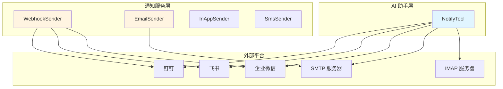
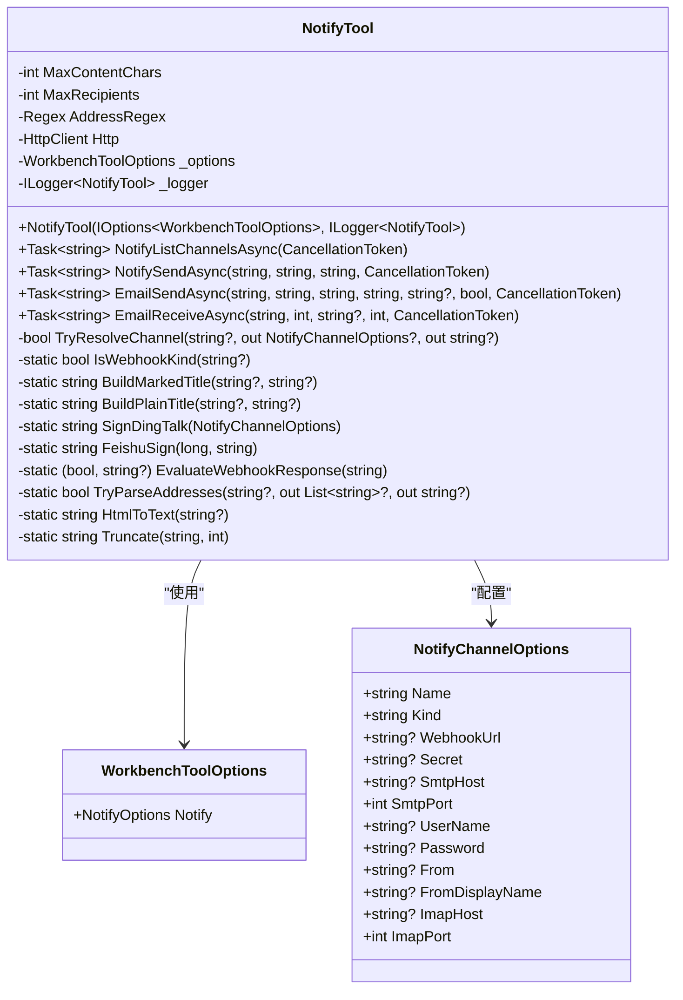
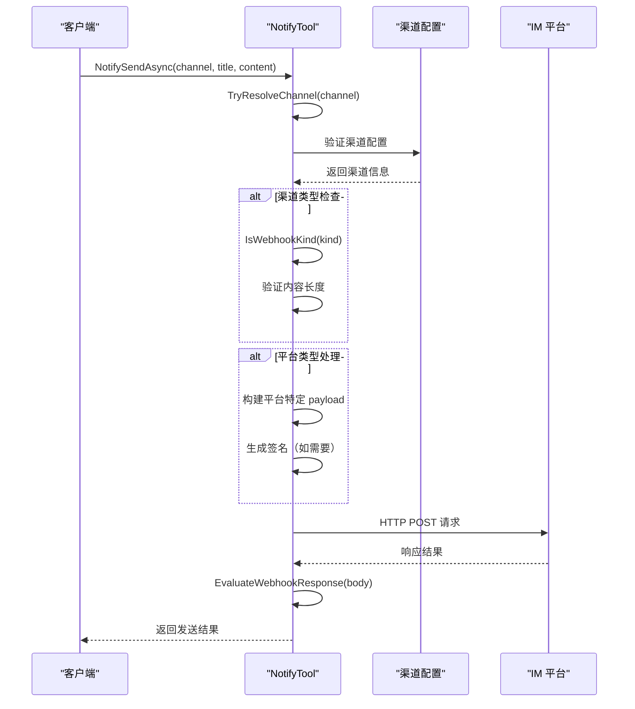
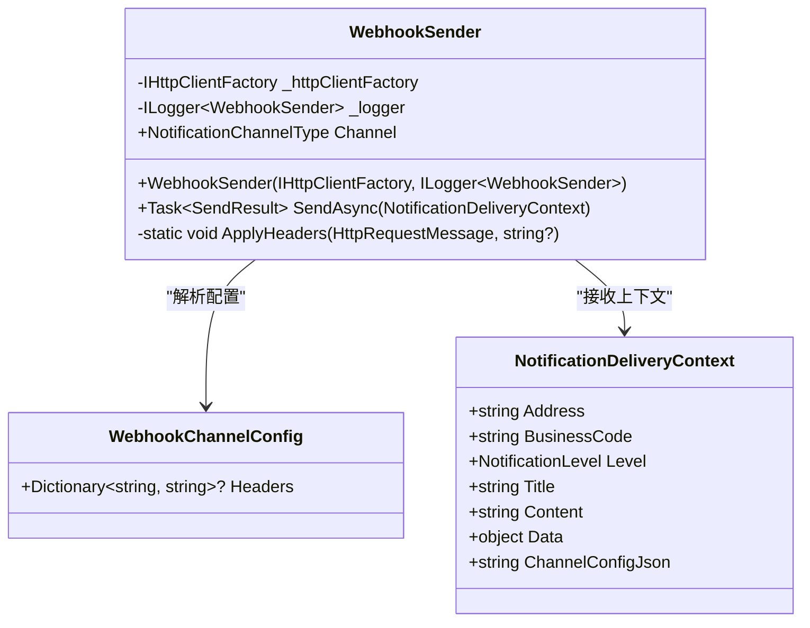
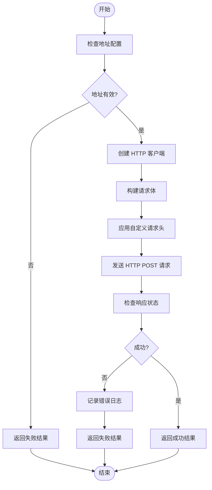
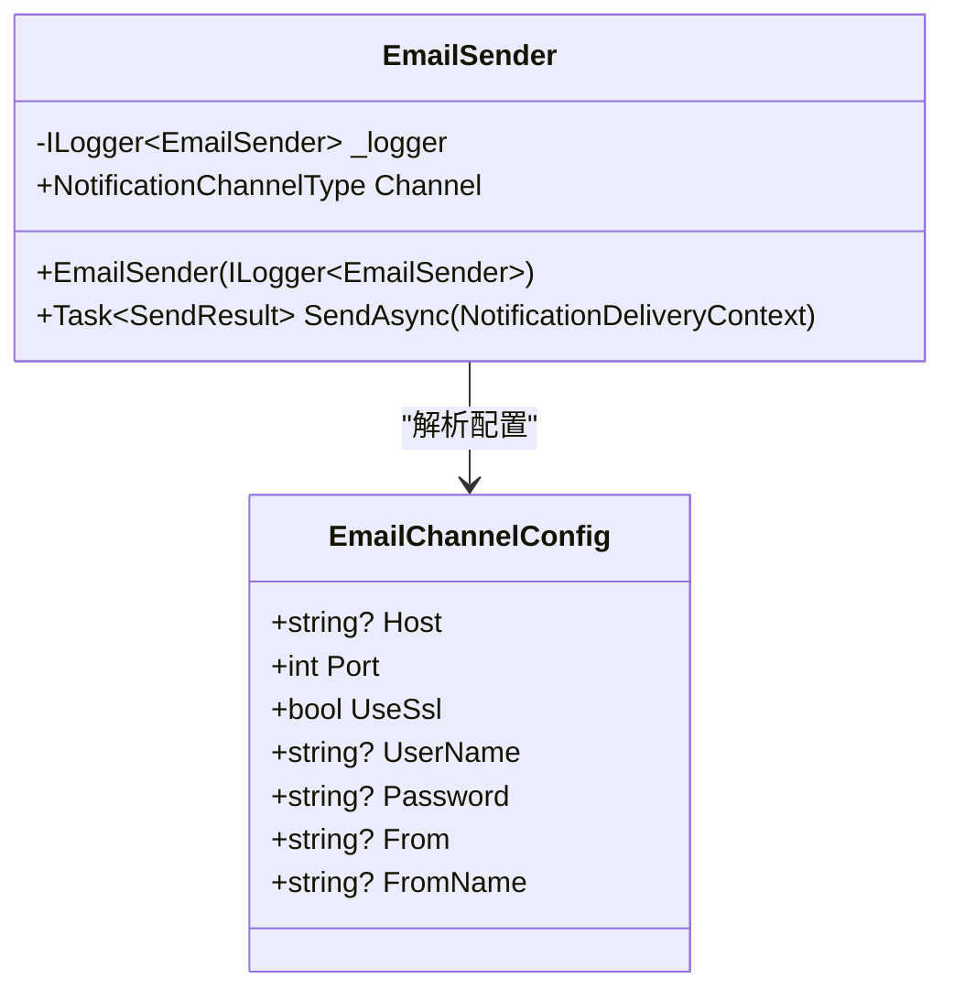
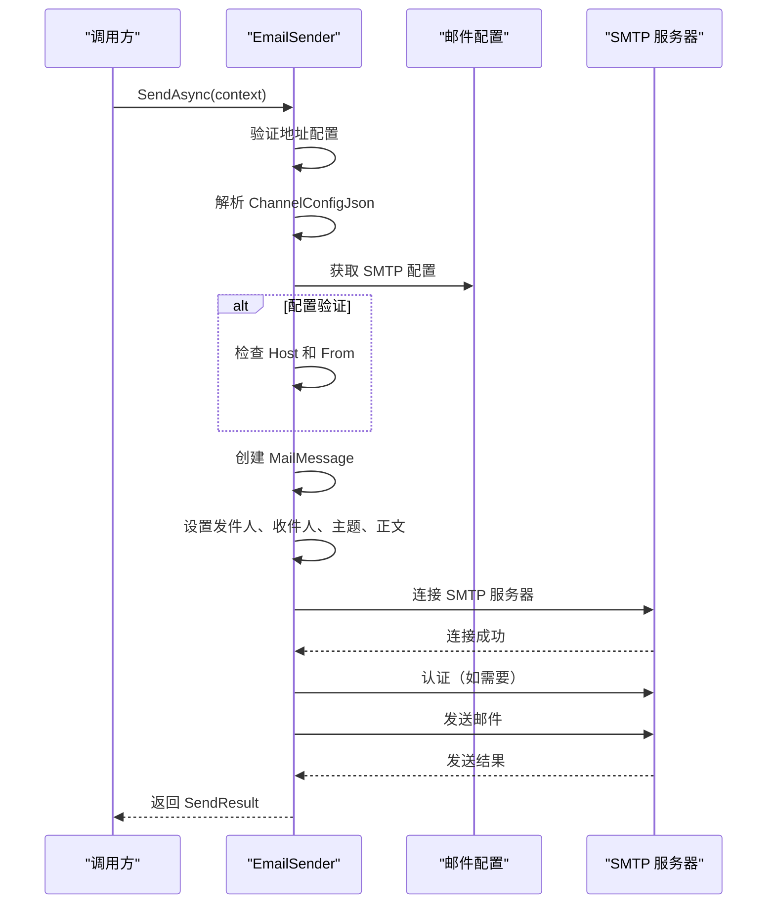
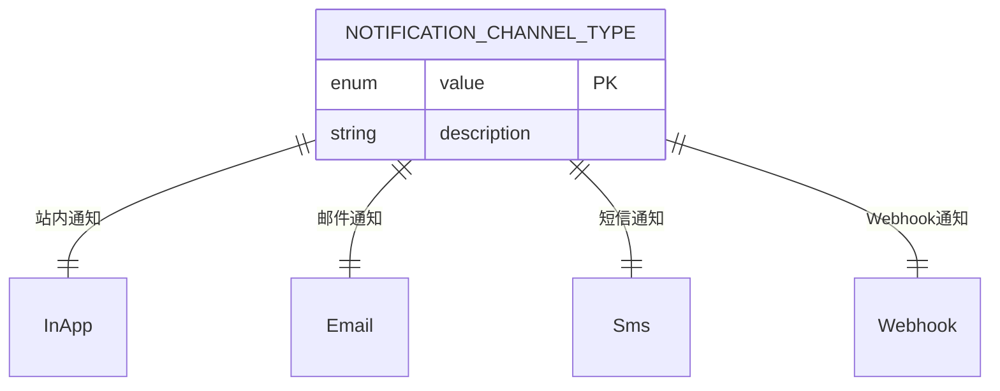
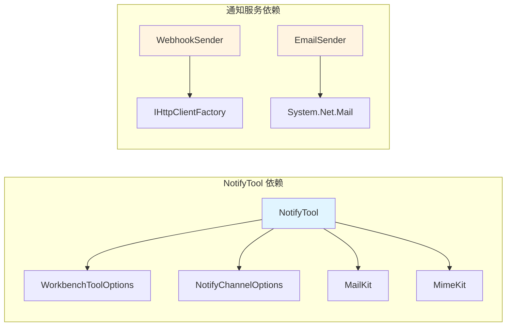

# 通知推送工具

<cite>
**本文档引用的文件**   
- [NotifyTool.cs](file://src/Agent/Workbench/H.Workbench.Core/Tools/NotifyTool.cs)
- [WebhookSender.cs](file://src/Services/Notification/H.Notification.Application/Sending/WebhookSender.cs)
- [EmailSender.cs](file://src/Services/Notification/H.Notification.Application/Sending/EmailSender.cs)
- [NotificationChannelType.cs](file://src/Services/Notification/H.Notification.Application.Contracts/Enums/NotificationChannelType.cs)
</cite>

## 目录
1. [简介](#简介)
2. [核心组件](#核心组件)
3. [架构概览](#架构概览)
4. [详细组件分析](#详细组件分析)
5. [依赖分析](#依赖分析)
6. [性能考虑](#性能考虑)
7. [故障排除指南](#故障排除指南)
8. [结论](#结论)

## 简介

通知推送工具（NotifyTool）是一个支持向即时通讯平台（钉钉、飞书、企业微信）推送消息和发送电子邮件的服务组件。该工具通过服务端配置的 Webhook URL 和 SMTP/IMAP 实现消息推送功能，具备内容长度限制和平台特定的签名机制，确保消息推送的安全性和可靠性。

## 核心组件

通知推送系统包含两个主要部分：AI 助手使用的 NotifyTool 和服务端的通知服务模块。

### NotifyTool 核心功能

NotifyTool 提供以下核心方法：

- **NotifyListChannelsAsync**：列出服务端已登记的通知渠道
- **NotifySendAsync**：向 IM 群机器人推送消息
- **EmailSendAsync**：通过邮箱渠道发送邮件
- **EmailReceiveAsync**：读取邮箱的最新来信

### 通知服务模块

服务端通知服务包含多种发送器：

- **WebhookSender**：HTTP POST 方式发送 Webhook 通知
- **EmailSender**：SMTP 方式发送邮件通知
- **InAppSender**：站内通知发送器
- **SmsSender**：短信通知发送器

**章节来源**
- [NotifyTool.cs:1-50](file://src/Agent/Workbench/H.Workbench.Core/Tools/NotifyTool.cs#L1-L50)
- [WebhookSender.cs:1-30](file://src/Services/Notification/H.Notification.Application/Sending/WebhookSender.cs#L1-L30)
- [EmailSender.cs:1-30](file://src/Services/Notification/H.Notification.Application/Sending/EmailSender.cs#L1-L30)

## 架构概览

**图表来源**
- [NotifyTool.cs:1-100](file://src/Agent/Workbench/H.Workbench.Core/Tools/NotifyTool.cs#L1-L100)
- [WebhookSender.cs:1-50](file://src/Services/Notification/H.Notification.Application/Sending/WebhookSender.cs#L1-L50)
- [EmailSender.cs:1-50](file://src/Services/Notification/H.Notification.Application/Sending/EmailSender.cs#L1-L50)

## 详细组件分析

### NotifyTool 组件分析

#### 类结构

**图表来源**
- [NotifyTool.cs:1-100](file://src/Agent/Workbench/H.Workbench.Core/Tools/NotifyTool.cs#L1-L100)
- [NotifyTool.cs:350-400](file://src/Agent/Workbench/H.Workbench.Core/Tools/NotifyTool.cs#L350-L400)

#### 消息发送流程

**图表来源**
- [NotifyTool.cs:60-150](file://src/Agent/Workbench/H.Workbench.Core/Tools/NotifyTool.cs#L60-L150)
- [NotifyTool.cs:400-450](file://src/Agent/Workbench/H.Workbench.Core/Tools/NotifyTool.cs#L400-L450)

#### 平台特定签名机制

NotifyTool 实现了三种 IM 平台的签名机制：

1. **钉钉签名**：使用 HMAC-SHA256 算法，对 timestamp 和 secret 进行签名
2. **飞书签名**：使用 HMAC-SHA256 算法，对 timestamp 和 secret 进行签名
3. **企业微信**：无需额外签名，直接使用 Markdown 格式

**章节来源**
- [NotifyTool.cs:410-430](file://src/Agent/Workbench/H.Workbench.Core/Tools/NotifyTool.cs#L410-L430)

### WebhookSender 组件分析

#### 类结构

**图表来源**
- [WebhookSender.cs:1-50](file://src/Services/Notification/H.Notification.Application/Sending/WebhookSender.cs#L1-L50)

#### 发送流程

**图表来源**
- [WebhookSender.cs:30-80](file://src/Services/Notification/H.Notification.Application/Sending/WebhookSender.cs#L30-L80)

### EmailSender 组件分析

#### 类结构

**图表来源**
- [EmailSender.cs:1-50](file://src/Services/Notification/H.Notification.Application/Sending/EmailSender.cs#L1-L50)

#### 邮件发送流程

**图表来源**
- [EmailSender.cs:30-90](file://src/Services/Notification/H.Notification.Application/Sending/EmailSender.cs#L30-L90)

### 通知渠道类型

**图表来源**
- [NotificationChannelType.cs:1-27](file://src/Services/Notification/H.Notification.Application.Contracts/Enums/NotificationChannelType.cs#L1-L27)

## 依赖分析

**图表来源**
- [NotifyTool.cs:1-20](file://src/Agent/Workbench/H.Workbench.Core/Tools/NotifyTool.cs#L1-L20)
- [WebhookSender.cs:1-10](file://src/Services/Notification/H.Notification.Application/Sending/WebhookSender.cs#L1-L10)
- [EmailSender.cs:1-10](file://src/Services/Notification/H.Notification.Application/Sending/EmailSender.cs#L1-L10)

## 性能考虑

### 内容长度限制

- **最大内容长度**：20000 字符
- **最大收件人数**：20 个
- **HTTP 超时**：30 秒

### 优化建议

1. **批量发送**：对于大量收件人，建议分批发送以避免单次请求过大
2. **连接复用**：HttpClient 采用单例模式，避免频繁创建连接
3. **异步处理**：所有发送操作均为异步，避免阻塞主线程
4. **结果截断**：工具结果超过 4000 字会被轨迹列截断，建议在返回前自行控制大小

## 故障排除指南

### 常见问题

#### 1. 渠道未配置

**问题描述**：调用 NotifySendAsync 时返回"未登记任何通知渠道"

**解决方案**：
- 检查服务端配置 `Workbench:Notify:Channels` 是否已添加渠道
- 确认渠道配置包含必要的参数（Name、Kind、WebhookUrl 或邮箱参数）
- 使用 NotifyListChannelsAsync 确认可用渠道列表

#### 2. 签名验证失败

**问题描述**：钉钉或飞书返回签名验证错误

**解决方案**：
- 确认渠道配置中的 Secret 参数正确
- 检查时间戳是否与服务器时间同步
- 验证签名算法实现是否正确

#### 3. 邮件发送失败

**问题描述**：EmailSendAsync 返回 SMTP 连接错误

**解决方案**：
- 检查 SMTP 服务器地址和端口配置
- 确认用户名和密码正确
- 验证网络连接是否正常
- 检查防火墙是否阻止 SMTP 端口

#### 4. 内容长度超限

**问题描述**：返回"正文超过 20000 字上限"

**解决方案**：
- 精简消息内容
- 将长内容拆分为多条消息发送
- 使用附件方式传递大量数据

### 调试技巧

1. **启用日志**：检查 ILogger 输出的警告和错误信息
2. **查看响应体**：EvaluateWebhookResponse 方法会解析平台返回的错误码和消息
3. **测试渠道配置**：先使用 NotifyListChannelsAsync 确认渠道可用性
4. **验证邮箱地址**：使用正则表达式验证邮箱格式是否正确

**章节来源**
- [NotifyTool.cs:150-200](file://src/Agent/Workbench/H.Workbench.Core/Tools/NotifyTool.cs#L150-L200)
- [WebhookSender.cs:60-90](file://src/Services/Notification/H.Notification.Application/Sending/WebhookSender.cs#L60-L90)
- [EmailSender.cs:70-90](file://src/Services/Notification/H.Notification.Application/Sending/EmailSender.cs#L70-L90)

## 结论

通知推送工具提供了一个统一的消息推送接口，支持多种 IM 平台和电子邮件渠道。通过服务端配置的 Webhook URL 和 SMTP/IMAP 实现，确保了消息推送的安全性和可靠性。平台特定的签名机制和内容长度限制进一步增强了系统的稳定性和安全性。

主要特点包括：

1. **多平台支持**：支持钉钉、飞书、企业微信等主流 IM 平台
2. **安全机制**：实现平台特定的签名验证机制
3. **灵活配置**：通过服务端配置管理渠道信息，模型不直接接触敏感信息
4. **内容限制**：内置内容长度和收件人数量限制，防止滥用
5. **双向通信**：不仅支持发送消息，还支持通过 IMAP 读取邮件

该系统设计合理，代码结构清晰，具备良好的可扩展性和维护性。