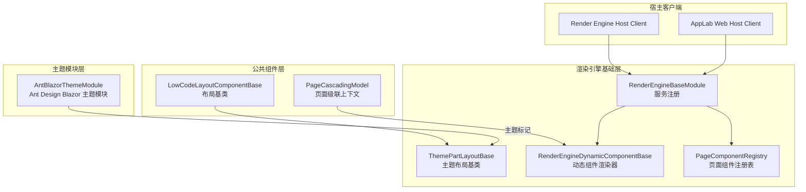
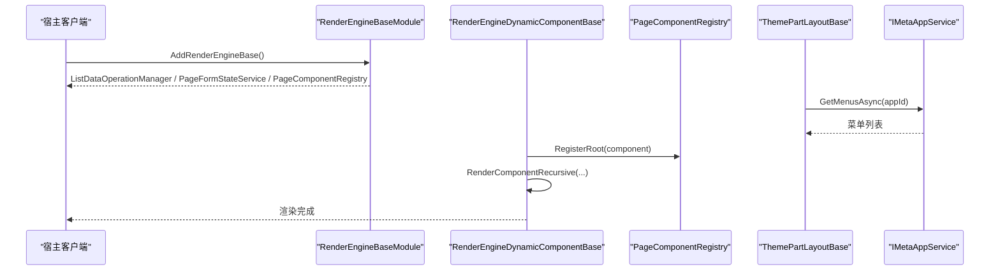
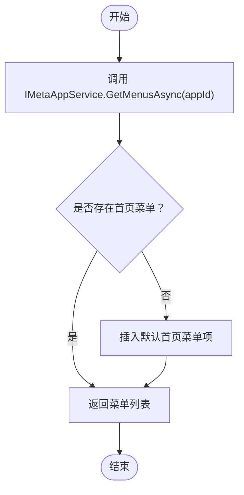
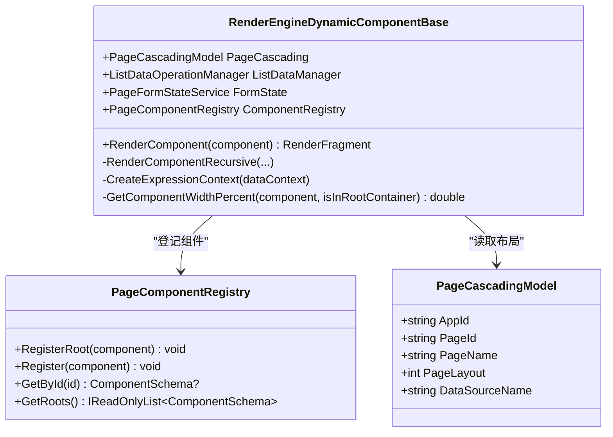
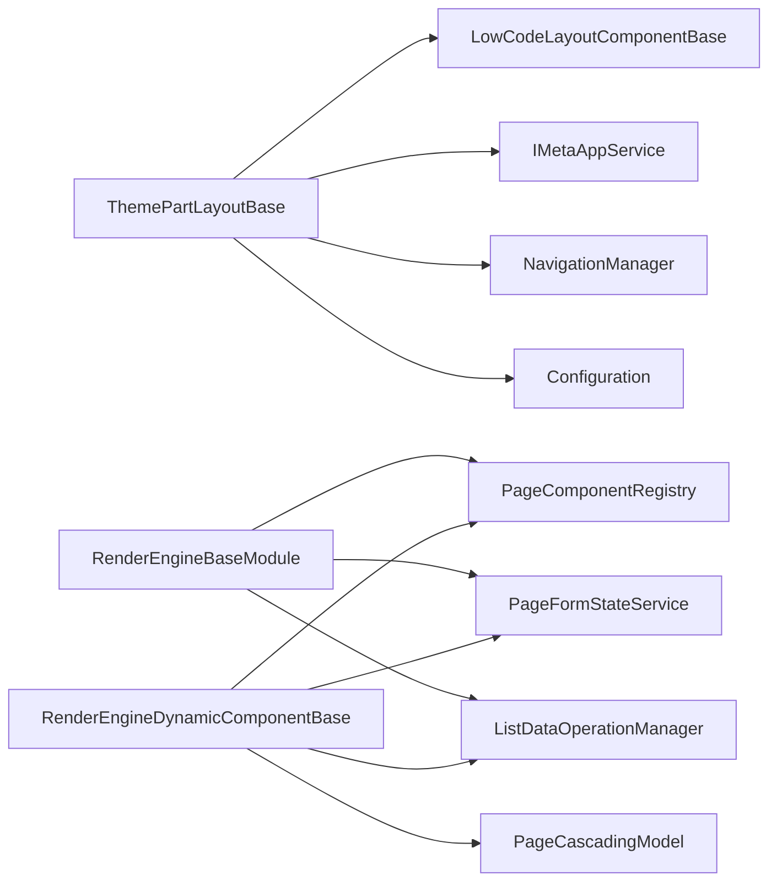

# 主题扩展

<cite>
**本文引用的文件**   
- [ThemePartLayoutBase.cs](file://src/LowCode/RenderEngine/H.LowCode.RenderEngineBase/Layout/ThemePartLayoutBase.cs)
- [LowCodeLayoutComponentBase.cs](file://src/LowCode/Common/H.LowCode.ComponentBase/LowCodeLayoutComponentBase.cs)
- [AntBlazorThemeModule.cs](file://src/LowCode/RenderEngine/H.LowCode.RenderEngine/AntBlazorThemeModule.cs)
- [PageComponentRegistry.cs](file://src/LowCode/RenderEngine/H.LowCode.RenderEngineBase/PageComponentRegistry.cs)
- [RenderEngineDynamicComponentBase.cs](file://src/LowCode/RenderEngine/H.LowCode.RenderEngineBase/RenderEngineDynamicComponentBase.cs)
- [RenderEngineBaseModule.cs](file://src/LowCode/RenderEngine/H.LowCode.RenderEngineBase/RenderEngineBaseModule.cs)
- [ClientServices.cs（渲染引擎宿主客户端）](file://src/Host/RenderEngine/H.LowCode.RenderEngine.Host.Client/ClientServices.cs)
- [ClientServices.cs（AppLab Web 宿主客户端）](file://src/Host/H.AppLab.Web.Host/H.AppLab.Web.Host.Client/ClientServices.cs)
- [PageCascadingModel.cs](file://src/LowCode/Common/H.LowCode.ComponentBase/CascadingModels/PageCascadingModel.cs)
</cite>

## 目录
1. [引言](#引言)
2. [项目结构与主题边界](#项目结构与主题边界)
3. [核心组件](#核心组件)
4. [架构总览](#架构总览)
5. [详细组件分析](#详细组件分析)
6. [依赖关系分析](#依赖关系分析)
7. [性能与样式优化](#性能与样式优化)
8. [自定义主题开发指南](#自定义主题开发指南)
9. [故障排查](#故障排查)
10. [结论](#结论)

## 引言
本文面向 AppLab 平台的低代码渲染引擎主题扩展。目标是帮助开发者理解并扩展主题体系，包括：
- 基类设计：`ThemePartLayoutBase` 及其父类 `LowCodeLayoutComponentBase`。
- Ant Design Blazor 主题集成方式与模块标记。
- CSS 变量系统与样式覆盖机制的推荐实践。
- 主题组件的发现、注册与优先级处理。
- 主题配置、动态切换与资源懒加载策略。
- 完整从零实现自定义主题的步骤，包括布局组件、颜色变量、字体配置和响应式适配。

## 项目结构与主题边界
主题相关能力分布在以下工程边界中：
- 公共组件基础能力位于 `H.LowCode.ComponentBase`，提供布局基类与级联模型。
- 渲染引擎通用能力位于 `H.LowCode.RenderEngineBase`，负责动态组件渲染、页面组件注册表、服务注册等。
- Ant Design Blazor 主题模块位于 `H.LowCode.RenderEngine`，以轻量模块标记形式接入主题生态。
- 宿主客户端通过调用 `AddRenderEngineBase()` 注入渲染引擎所需的服务。

图表来源
- [LowCodeLayoutComponentBase.cs:1-64](file://src/LowCode/Common/H.LowCode.ComponentBase/LowCodeLayoutComponentBase.cs#L1-L64)
- [ThemePartLayoutBase.cs:1-44](file://src/LowCode/RenderEngine/H.LowCode.RenderEngineBase/Layout/ThemePartLayoutBase.cs#L1-L44)
- [RenderEngineDynamicComponentBase.cs:1-120](file://src/LowCode/RenderEngine/H.LowCode.RenderEngineBase/RenderEngineDynamicComponentBase.cs#L1-L120)
- [PageComponentRegistry.cs:1-48](file://src/LowCode/RenderEngine/H.LowCode.RenderEngineBase/PageComponentRegistry.cs#L1-L48)
- [RenderEngineBaseModule.cs:1-22](file://src/LowCode/RenderEngine/H.LowCode.RenderEngineBase/RenderEngineBaseModule.cs#L1-L22)
- [AntBlazorThemeModule.cs:1-8](file://src/LowCode/RenderEngine/H.LowCode.RenderEngine/AntBlazorThemeModule.cs#L1-L8)
- [ClientServices.cs（渲染引擎宿主客户端）](file://src/Host/RenderEngine/H.LowCode.RenderEngine.Host.Client/ClientServices.cs)
- [ClientServices.cs（AppLab Web 宿主客户端）](file://src/Host/H.AppLab.Web.Host/H.AppLab.Web.Host.Client/ClientServices.cs)

章节来源
- [LowCodeLayoutComponentBase.cs:1-64](file://src/LowCode/Common/H.LowCode.ComponentBase/LowCodeLayoutComponentBase.cs#L1-L64)
- [ThemePartLayoutBase.cs:1-44](file://src/LowCode/RenderEngine/H.LowCode.RenderEngineBase/Layout/ThemePartLayoutBase.cs#L1-L44)
- [AntBlazorThemeModule.cs:1-8](file://src/LowCode/RenderEngine/H.LowCode.RenderEngine/AntBlazorThemeModule.cs#L1-L8)
- [RenderEngineBaseModule.cs:1-22](file://src/LowCode/RenderEngine/H.LowCode.RenderEngineBase/RenderEngineBaseModule.cs#L1-L22)
- [ClientServices.cs（渲染引擎宿主客户端）](file://src/Host/RenderEngine/H.LowCode.RenderEngine.Host.Client/ClientServices.cs)
- [ClientServices.cs（AppLab Web 宿主客户端）](file://src/Host/H.AppLab.Web.Host/H.AppLab.Web.Host.Client/ClientServices.cs)

## 核心组件
- `LowCodeLayoutComponentBase`：所有布局组件的抽象基类，提供设计模式判断、路由参数解析、应用标识与基础 URI 获取等能力。
- `ThemePartLayoutBase`：主题布局基类，继承自 `LowCodeLayoutComponentBase`，注入元数据服务、导航管理器与配置，并提供菜单加载逻辑，自动插入默认首页菜单项。
- `RenderEngineDynamicComponentBase`：低代码动态组件渲染基类，负责组件树递归渲染、显示条件求值、事件与表单状态联动、列表数据订阅等。
- `PageComponentRegistry`：页面组件注册表，在渲染过程中登记根组件与嵌套组件，供后续按 Id 查找。
- `RenderEngineBaseModule`：集中注册渲染引擎基础服务，如列表数据操作管理器、页面表单状态服务、页面组件注册表。
- `AntBlazorThemeModule`：Ant Design Blazor 主题模块标记类，用于声明主题模块的存在，便于主题发现或后续扩展。

章节来源
- [LowCodeLayoutComponentBase.cs:1-64](file://src/LowCode/Common/H.LowCode.ComponentBase/LowCodeLayoutComponentBase.cs#L1-L64)
- [ThemePartLayoutBase.cs:1-44](file://src/LowCode/RenderEngine/H.LowCode.RenderEngineBase/Layout/ThemePartLayoutBase.cs#L1-L44)
- [RenderEngineDynamicComponentBase.cs:1-120](file://src/LowCode/RenderEngine/H.LowCode.RenderEngineBase/RenderEngineDynamicComponentBase.cs#L1-L120)
- [PageComponentRegistry.cs:1-48](file://src/LowCode/RenderEngine/H.LowCode.RenderEngineBase/PageComponentRegistry.cs#L1-L48)
- [RenderEngineBaseModule.cs:1-22](file://src/LowCode/RenderEngine/H.LowCode.RenderEngineBase/RenderEngineBaseModule.cs#L1-L22)
- [AntBlazorThemeModule.cs:1-8](file://src/LowCode/RenderEngine/H.LowCode.RenderEngine/AntBlazorThemeModule.cs#L1-L8)

## 架构总览
渲染引擎的主题架构围绕“布局基类 + 动态渲染 + 服务注册”展开。主题扩展通过继承布局基类、注入元数据服务、定义主题特定的布局和样式，并在宿主端注册基础服务完成集成。

图表来源
- [RenderEngineBaseModule.cs:10-22](file://src/LowCode/RenderEngine/H.LowCode.RenderEngineBase/RenderEngineBaseModule.cs#L10-L22)
- [ThemePartLayoutBase.cs:12-44](file://src/LowCode/RenderEngine/H.LowCode.RenderEngineBase/Layout/ThemePartLayoutBase.cs#L12-L44)
- [RenderEngineDynamicComponentBase.cs:100-160](file://src/LowCode/RenderEngine/H.LowCode.RenderEngineBase/RenderEngineDynamicComponentBase.cs#L100-L160)
- [PageComponentRegistry.cs:12-35](file://src/LowCode/RenderEngine/H.LowCode.RenderEngineBase/PageComponentRegistry.cs#L12-L35)

## 详细组件分析

### ThemePartLayoutBase 主题布局基类
职责与行为：
- 继承 `LowCodeLayoutComponentBase`，获得设计模式、路由参数与应用标识能力。
- 注入 `IMetaAppService`、`NavigationManager`、`Configuration`，用于获取菜单、导航与配置。
- 提供 `GetMenusAsync` 方法：获取菜单列表后，若不存在默认首页 URL，则自动插入一个首页菜单项。
- 内部私有方法 `GetMenuListAsync` 封装对元数据服务的调用，返回菜单集合。

复杂度分析：
- 菜单查询为一次远程调用，时间复杂度取决于后端接口；本地插入默认项为 O(1)。
- 整体适合在布局初始化阶段执行，避免频繁重复调用。

错误处理与健壮性：
- 使用空合并运算符确保返回空集合而非 null。
- 默认首页插入前检查是否存在相同 URL，避免重复。

图表来源
- [ThemePartLayoutBase.cs:12-44](file://src/LowCode/RenderEngine/H.LowCode.RenderEngineBase/Layout/ThemePartLayoutBase.cs#L12-L44)

章节来源
- [ThemePartLayoutBase.cs:1-44](file://src/LowCode/RenderEngine/H.LowCode.RenderEngineBase/Layout/ThemePartLayoutBase.cs#L1-L44)

### LowCodeLayoutComponentBase 布局基类
职责与行为：
- 注入 `LowCodeAppState` 与 `NavigationManager`，提供设计模式开关、路由参数读取与应用名、基础 URI 工具方法。
- `IsDesign` 暴露当前是否处于设计模式，便于布局组件在编辑态与运行态差异化渲染。
- `AppId`、`AppName` 提供应用标识能力；`GetRouteValue` 从路由数据中提取参数。

使用建议：
- 所有主题布局组件应继承此基类以获得一致的上下文能力。
- 在设计模式下可隐藏生产态元素，或在编辑态展示调试信息。

章节来源
- [LowCodeLayoutComponentBase.cs:1-64](file://src/LowCode/Common/H.LowCode.ComponentBase/LowCodeLayoutComponentBase.cs#L1-L64)

### AntBlazorThemeModule 主题模块标记
职责与行为：
- 作为 Ant Design Blazor 主题模块的标记类，无具体逻辑，但可作为主题发现的占位点。
- 可在后续扩展中结合依赖注入、程序集扫描或配置来启用特定主题。

扩展建议：
- 将样式资源引入与主题激活逻辑放在宿主客户端或服务启动流程中。
- 可通过程序集属性或配置枚举主题 ID，配合模块标记进行主题切换。

章节来源
- [AntBlazorThemeModule.cs:1-8](file://src/LowCode/RenderEngine/H.LowCode.RenderEngine/AntBlazorThemeModule.cs#L1-L8)

### PageComponentRegistry 页面组件注册表
职责与行为：
- 维护根组件列表与按 Id 索引的组件字典。
- `RegisterRoot` 登记根组件并去重；`Register` 登记任意嵌套组件；`GetById` 支持按 Id 查询；`GetRoots` 返回不可变根列表。

复杂度分析：
- 登记与查找均为 O(1) 平均复杂度，适合高频访问场景。
- 内存占用随组件数量线性增长，需关注长会话下的组件树规模。

使用场景：
- 动态组件渲染时登记组件树，以便后续保存、校验、事件处理按 Id 定位组件配置。

章节来源
- [PageComponentRegistry.cs:1-48](file://src/LowCode/RenderEngine/H.LowCode.RenderEngineBase/PageComponentRegistry.cs#L1-L48)

### RenderEngineDynamicComponentBase 动态组件渲染器
职责与行为：
- 订阅表单状态变化与列表数据变化，驱动界面重新渲染。
- 创建表达式上下文，计算组件宽度百分比，支持栅格布局。
- 递归渲染组件树，处理显隐条件、条件渲染组件、数据源绑定等。
- 通过 `PageComponentRegistry.RegisterRoot` 登记根组件，使后续操作能定位组件。

关键路径：
- `OnInitializedAsync` 订阅事件，`Dispose` 取消订阅，避免内存泄漏。
- `RenderComponent` 与 `RenderComponentRecursive` 构成渲染主循环。
- 组件宽度计算基于页面布局列数与 ItemWidth 配置。

图表来源
- [RenderEngineDynamicComponentBase.cs:1-120](file://src/LowCode/RenderEngine/H.LowCode.RenderEngineBase/RenderEngineDynamicComponentBase.cs#L1-L120)
- [PageComponentRegistry.cs:1-48](file://src/LowCode/RenderEngine/H.LowCode.RenderEngineBase/PageComponentRegistry.cs#L1-L48)
- [PageCascadingModel.cs:1-23](file://src/LowCode/Common/H.LowCode.ComponentBase/CascadingModels/PageCascadingModel.cs#L1-L23)

章节来源
- [RenderEngineDynamicComponentBase.cs:1-120](file://src/LowCode/RenderEngine/H.LowCode.RenderEngineBase/RenderEngineDynamicComponentBase.cs#L1-L120)
- [PageCascadingModel.cs:1-23](file://src/LowCode/Common/H.LowCode.ComponentBase/CascadingModels/PageCascadingModel.cs#L1-L23)

### 服务注册与主题加载机制
- `RenderEngineBaseModule.AddRenderEngineBase` 注册：
  - `ListDataOperationManager`：单例，保证跨组件的数据操作一致性。
  - `PageFormStateService`：按作用域隔离，管理表单状态。
  - `PageComponentRegistry`：按作用域隔离，管理组件树注册。
- 宿主客户端通过调用该方法完成渲染引擎基础能力的注入：
  - 渲染引擎宿主客户端：[ClientServices.cs](file://src/Host/RenderEngine/H.LowCode.RenderEngine.Host.Client/ClientServices.cs)
  - AppLab Web 宿主客户端：[ClientServices.cs](file://src/Host/H.AppLab.Web.Host/H.AppLab.Web.Host.Client/ClientServices.cs)

主题组件的发现与优先级：
- 当前代码库未实现程序集扫描或主题优先级排序。
- 推荐做法：在宿主端根据配置选择主题模块（例如 AntBlazorThemeModule），并在此处注入主题样式、设置 CSS 变量、挂载布局组件类型映射。
- 若需要多主题并存，可通过主题 ID 与优先级字段决定最终生效的主题。

章节来源
- [RenderEngineBaseModule.cs:10-22](file://src/LowCode/RenderEngine/H.LowCode.RenderEngineBase/RenderEngineBaseModule.cs#L10-L22)
- [ClientServices.cs（渲染引擎宿主客户端）](file://src/Host/RenderEngine/H.LowCode.RenderEngine.Host.Client/ClientServices.cs)
- [ClientServices.cs（AppLab Web 宿主客户端）](file://src/Host/H.AppLab.Web.Host/H.AppLab.Web.Host.Client/ClientServices.cs)

## 依赖关系分析
主题扩展的关键依赖如下：
- 主题布局组件依赖：
  - `LowCodeLayoutComponentBase`：布局上下文与路由能力。
  - `IMetaAppService`：菜单与元数据获取。
  - `NavigationManager` 与 `Configuration`：导航与配置。
- 动态渲染组件依赖：
  - `PageComponentRegistry`：组件树登记与查询。
  - `PageFormStateService`：表单状态。
  - `ListDataOperationManager`：列表数据操作。
  - `PageCascadingModel`：页面布局与数据源名称。
- 服务注册依赖：
  - `RenderEngineBaseModule`：统一注册上述服务。

图表来源
- [ThemePartLayoutBase.cs:1-44](file://src/LowCode/RenderEngine/H.LowCode.RenderEngineBase/Layout/ThemePartLayoutBase.cs#L1-L44)
- [LowCodeLayoutComponentBase.cs:1-64](file://src/LowCode/Common/H.LowCode.ComponentBase/LowCodeLayoutComponentBase.cs#L1-L64)
- [RenderEngineDynamicComponentBase.cs:1-120](file://src/LowCode/RenderEngine/H.LowCode.RenderEngineBase/RenderEngineDynamicComponentBase.cs#L1-L120)
- [PageComponentRegistry.cs:1-48](file://src/LowCode/RenderEngine/H.LowCode.RenderEngineBase/PageComponentRegistry.cs#L1-L48)
- [RenderEngineBaseModule.cs:10-22](file://src/LowCode/RenderEngine/H.LowCode.RenderEngineBase/RenderEngineBaseModule.cs#L10-L22)
- [PageCascadingModel.cs:1-23](file://src/LowCode/Common/H.LowCode.ComponentBase/CascadingModels/PageCascadingModel.cs#L1-L23)

章节来源
- [ThemePartLayoutBase.cs:1-44](file://src/LowCode/RenderEngine/H.LowCode.RenderEngineBase/Layout/ThemePartLayoutBase.cs#L1-L44)
- [RenderEngineDynamicComponentBase.cs:1-120](file://src/LowCode/RenderEngine/H.LowCode.RenderEngineBase/RenderEngineDynamicComponentBase.cs#L1-L120)
- [RenderEngineBaseModule.cs:10-22](file://src/LowCode/RenderEngine/H.LowCode.RenderEngineBase/RenderEngineBaseModule.cs#L10-L22)

## 性能与样式优化
- 样式隔离：
  - 使用 scoped CSS 或 CSS Modules 隔离主题样式，避免污染全局。
  - 将主题变量集中在根节点 CSS 变量中，通过父容器限定作用域。
- 性能优化：
  - 避免在渲染循环中频繁更新 CSS 变量；批量更新并通过防抖减少重排。
  - 使用静态资源缓存与按需加载主题包，减少首屏体积。
- 浏览器兼容性：
  - 针对不支持 CSS 变量的旧浏览器提供降级方案（JS 回退或预编译 CSS）。
  - 对深色模式媒体查询做兼容处理，必要时监听系统主题变化。

[本节为通用指导，不直接分析具体文件]

## 自定义主题开发指南

### 目标
从零创建一个自定义主题，包含：
- 继承 `ThemePartLayoutBase` 的布局组件。
- 主题特定的颜色变量与字体配置。
- 响应式样式适配与深色模式切换。
- 主题注册与动态切换。

### 步骤一：继承主题布局基类
- 新建布局组件类，继承 `ThemePartLayoutBase`。
- 在该组件中组合侧边栏、头部、内容区等结构，并使用 `GetMenusAsync` 获取菜单。
- 如需扩展菜单行为，重写或调用基类方法后追加业务逻辑。

参考路径
- [ThemePartLayoutBase.cs:12-44](file://src/LowCode/RenderEngine/H.LowCode.RenderEngineBase/Layout/ThemePartLayoutBase.cs#L12-L44)

### 步骤二：定义主题变量与样式
- 在主题样式文件中定义 CSS 变量，包括：
  - 主色、辅助色、成功色、警告色、危险色。
  - 背景色、文本色、边框色。
  - 字体族、字号、行高、字重。
- 在根容器或主题包裹组件上设置这些变量，确保子组件通过 `var(--xxx)` 引用。
- 对于 Ant Design Blazor 组件，优先通过其主题 API 或样式覆盖类名进行定制，避免直接侵入框架样式。

示例结构建议
- 主题根类名包裹应用，避免样式泄漏到其他主题。
- 使用媒体查询实现响应式布局。
- 使用 `prefers-color-scheme` 或 JS 监听切换深色模式，动态切换根节点类名。

### 步骤三：实现响应式与深色模式
- 响应式：
  - 在小屏幕设备上隐藏侧边栏或改为抽屉式菜单。
  - 调整栅格列数与组件间距。
- 深色模式：
  - 定义浅色与深色两套变量。
  - 通过切换根节点类名或修改 CSS 变量值实现即时切换。
  - 持久化用户偏好到本地存储或后端配置。

### 步骤四：注册主题模块与服务
- 在宿主客户端调用 `AddRenderEngineBase()` 注册渲染引擎基础服务。
- 在主题模块类中（例如仿照 `AntBlazorThemeModule`）加入主题标识，便于后续扩展主题发现逻辑。
- 在应用启动时根据配置选择主题，并注入对应样式资源。

参考路径
- [RenderEngineBaseModule.cs:10-22](file://src/LowCode/RenderEngine/H.LowCode.RenderEngineBase/RenderEngineBaseModule.cs#L10-L22)
- [AntBlazorThemeModule.cs:1-8](file://src/LowCode/RenderEngine/H.LowCode.RenderEngine/AntBlazorThemeModule.cs#L1-L8)
- [ClientServices.cs（渲染引擎宿主客户端）](file://src/Host/RenderEngine/H.LowCode.RenderEngine.Host.Client/ClientServices.cs)
- [ClientServices.cs（AppLab Web 宿主客户端）](file://src/Host/H.AppLab.Web.Host/H.AppLab.Web.Host.Client/ClientServices.cs)

### 步骤五：动态主题切换
- 提供主题切换服务，维护当前主题 ID。
- 切换时更新根节点类名或 CSS 变量，触发 UI 重新渲染。
- 将主题配置（颜色、字体、布局）序列化到配置中心或本地存储，支持运行时加载。

### 步骤六：主题资源懒加载
- 将非首屏样式拆分为独立资源文件。
- 在用户首次进入某个功能模块时按需加载对应样式。
- 使用浏览器缓存与版本控制避免重复下载。

[本节为实施指导，不直接分析具体文件]

## 故障排查
常见问题与建议：
- 菜单为空或未显示首页：
  - 检查 `IMetaAppService.GetMenusAsync` 返回值是否为空。
  - 确认 `ThemePartLayoutBase.GetMenusAsync` 是否正确插入默认首页。
- 组件无法按 Id 查找：
  - 确认动态渲染过程中调用了 `PageComponentRegistry.RegisterRoot`。
  - 检查组件是否被条件渲染隐藏。
- 样式冲突或主题未生效：
  - 检查 CSS 变量作用域是否与主题根节点一致。
  - 确认宿主客户端已注入 `AddRenderEngineBase` 并加载了主题样式。
- 深色模式切换无效：
  - 检查是否更新了根节点类名或 CSS 变量。
  - 确认媒体查询或 JS 监听逻辑正确。

章节来源
- [ThemePartLayoutBase.cs:12-44](file://src/LowCode/RenderEngine/H.LowCode.RenderEngineBase/Layout/ThemePartLayoutBase.cs#L12-L44)
- [PageComponentRegistry.cs:12-35](file://src/LowCode/RenderEngine/H.LowCode.RenderEngineBase/PageComponentRegistry.cs#L12-L35)
- [RenderEngineBaseModule.cs:10-22](file://src/LowCode/RenderEngine/H.LowCode.RenderEngineBase/RenderEngineBaseModule.cs#L10-L22)

## 结论
AppLab 的低代码渲染引擎主题架构以 `ThemePartLayoutBase` 为核心，结合 `RenderEngineDynamicComponentBase` 的动态渲染与 `PageComponentRegistry` 的组件注册，形成可扩展的主题体系。通过宿主端注册基础服务、主题模块标记与样式变量管理，开发者可以便捷地构建自定义主题，并实现响应式与深色模式支持。遵循样式隔离、性能优化与兼容性最佳实践，可获得稳定且高性能的主题体验。

[本节为总结，不直接分析具体文件]