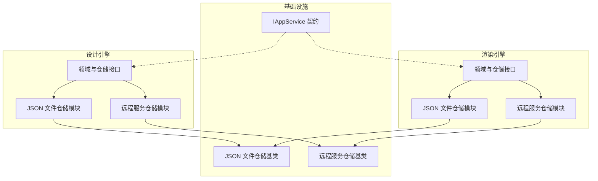
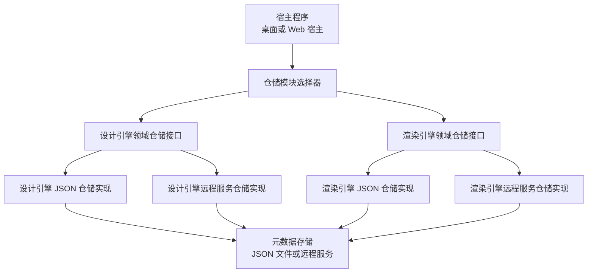
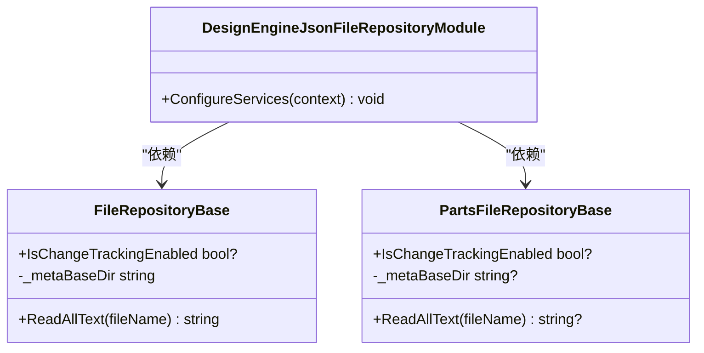
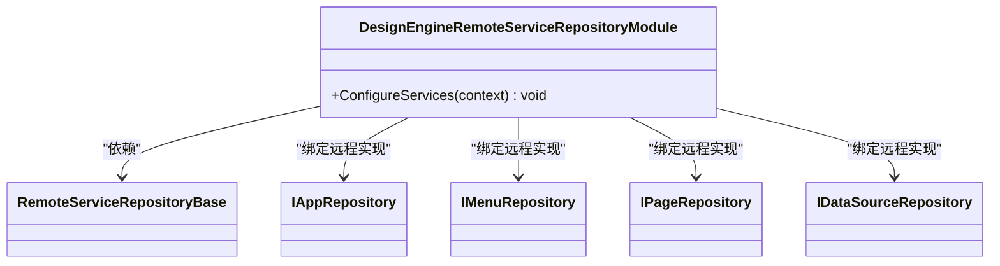
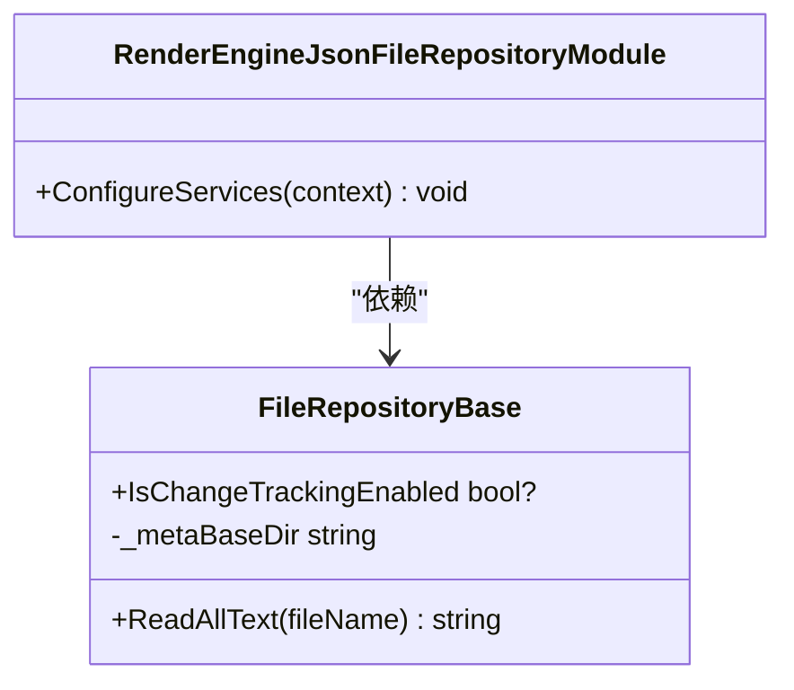
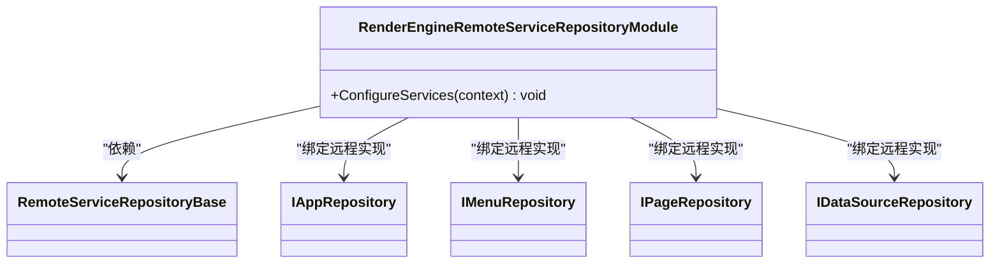
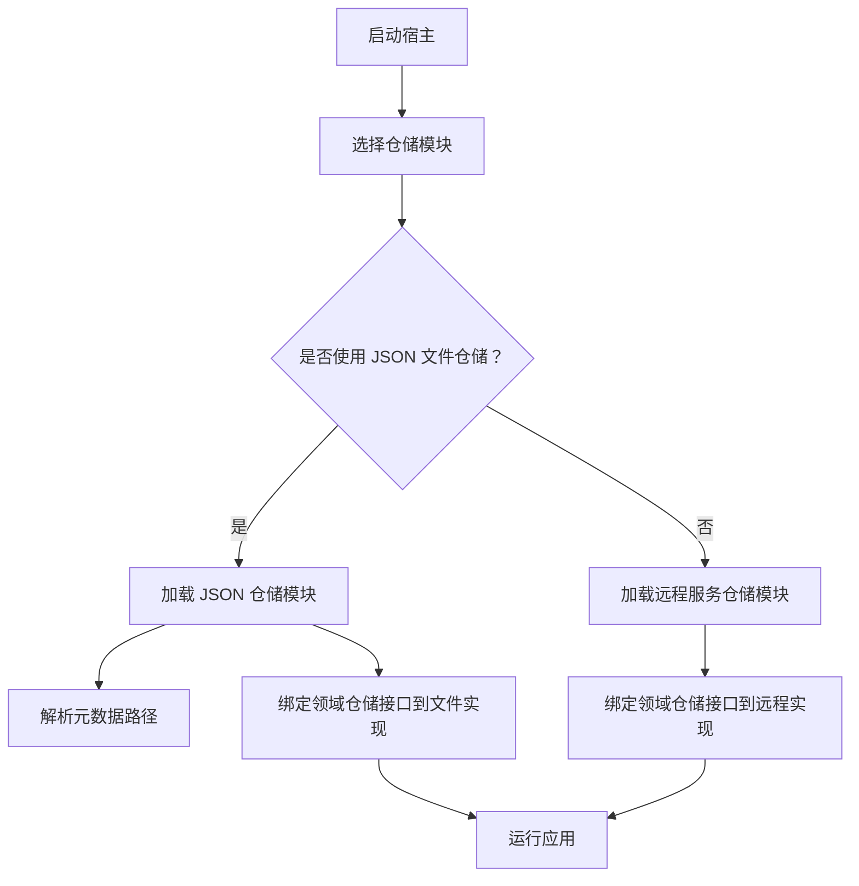
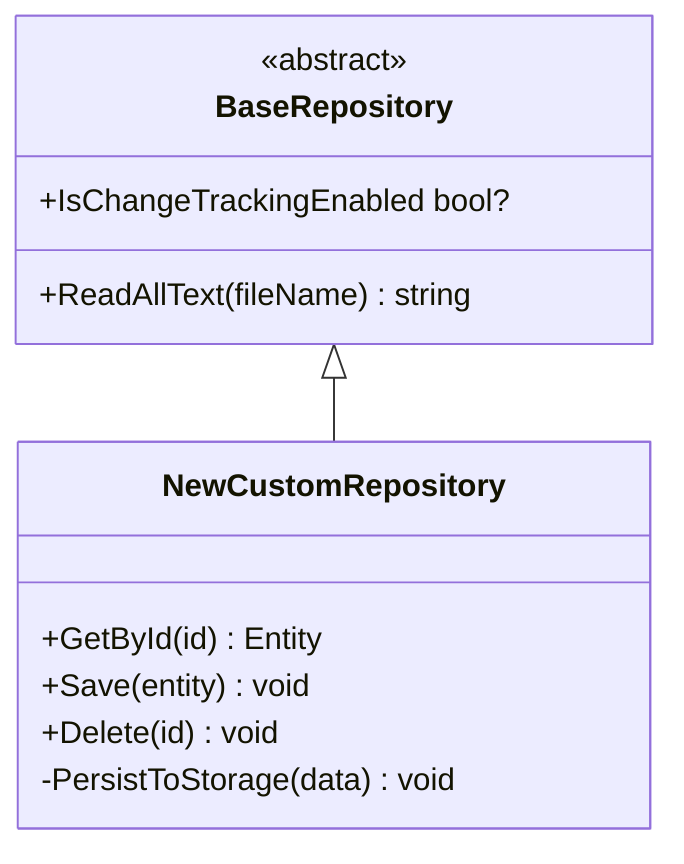
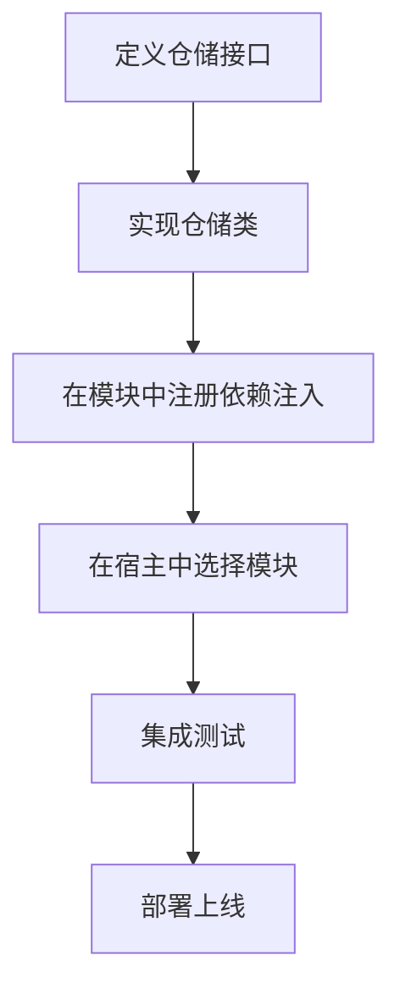

# 仓储实现扩展

<cite>
**本文引用的文件**   
- [FileRepositoryBase.cs（设计引擎 JSON 文件仓储基类）](file://src/LowCode/DesignEngine/H.LowCode.DesignEngine.Repository.JsonFile/Base/FileRepositoryBase.cs)
- [PartsFileRepositoryBase.cs（设计引擎部件 JSON 文件仓储基类）](file://src/LowCode/DesignEngine/H.LowCode.DesignEngine.Repository.JsonFile/Base/PartsFileRepositoryBase.cs)
- [DesignEngineJsonFileRepositoryModule.cs（设计引擎 JSON 仓储模块）](file://src/LowCode/DesignEngine/H.LowCode.DesignEngine.Repository.JsonFile/DesignEngineJsonFileRepositoryModule.cs)
- [RemoteServiceRepositoryBase.cs（设计引擎远程服务仓储基类）](file://src/LowCode/DesignEngine/H.LowCode.DesignEngine.Repository.RemoteService/Base/RemoteServiceRepositoryBase.cs)
- [DesignEngineRemoteServiceRepositoryModule.cs（设计引擎远程服务仓储模块）](file://src/LowCode/DesignEngine/H.LowCode.DesignEngine.Repository.RemoteService/DesignEngineRemoteServiceRepositoryModule.cs)
- [FileRepositoryBase.cs（渲染引擎 JSON 文件仓储基类）](file://src/LowCode/RenderEngine/H.LowCode.RenderEngine.Repository.JsonFile/Base/FileRepositoryBase.cs)
- [RenderEngineJsonFileRepositoryModule.cs（渲染引擎 JSON 仓储模块）](file://src/LowCode/RenderEngine/H.LowCode.RenderEngine.Repository.JsonFile/RenderEngineJsonFileRepositoryModule.cs)
- [RemoteServiceRepositoryBase.cs（渲染引擎远程服务仓储基类）](file://src/LowCode/RenderEngine/H.LowCode.RenderEngine.Repository.RemoteService/Base/RemoteServiceRepositoryBase.cs)
- [RenderEngineRemoteServiceRepositoryModule.cs（渲染引擎远程服务仓储模块）](file://src/LowCode/RenderEngine/H.LowCode.RenderEngine.Repository.RemoteService/RenderEngineRemoteServiceRepositoryModule.cs)
- [IAppService.cs（应用服务统一契约）](file://src/Utils/H.Abp.Application.Contracts/IAppService.cs)
</cite>

## 目录

1. [引言](#引言)
2. [项目结构](#项目结构)
3. [核心组件](#核心组件)
4. [架构总览](#架构总览)
5. [详细组件分析](#详细组件分析)
6. [依赖关系分析](#依赖关系分析)
7. [性能与一致性考虑](#性能与一致性考虑)
8. [故障排查指南](#故障排查指南)
9. [结论](#结论)
10. [附录：自定义仓储实现指南](#附录自定义仓储实现指南)

## 引言

本扩展文档面向 AppLab 平台的低代码设计引擎与渲染引擎，聚焦其存储抽象层。平台为两个引擎分别提供两种仓储实现：

- **JSON 文件仓储**：将元数据、页面、菜单、数据源等对象持久化为本地 JSON 文件，适合开发调试、单机部署或轻量环境。
- **远程服务仓储**：通过远程接口访问后端服务，适合分布式部署、多实例运行和集中式数据管理。

同时，文档说明 `IAppService` 作为统一契约的设计模式，并给出在不同宿主环境中选择仓储实现的策略、混合存储架构思路、并发与错误恢复注意事项、迁移策略以及扩展新仓储提供者的实践方法。

## 项目结构

仓储相关代码按“引擎 × 仓储类型”组织：

| 区域 | 职责 | 典型产物 |
|---|---|---|
| 设计引擎 JSON 仓储 | 以 JSON 文件形式保存设计期元数据 | `FileRepositoryBase`、`PartsFileRepositoryBase`、`DesignEngineJsonFileRepositoryModule` |
| 设计引擎远程服务仓储 | 通过远端服务读写设计期元数据 | `RemoteServiceRepositoryBase`、`DesignEngineRemoteServiceRepositoryModule` |
| 渲染引擎 JSON 仓储 | 以 JSON 文件形式保存运行时渲染所需元数据 | `FileRepositoryBase`、`RenderEngineJsonFileRepositoryModule` |
| 渲染引擎远程服务仓储 | 通过远端服务读取渲染期元数据 | `RemoteServiceRepositoryBase`、`RenderEngineRemoteServiceRepositoryModule` |
| 通用契约 | 定义跨引擎、跨宿主的应用服务契约 | `IAppService` |

**图示来源**
- [DesignEngineJsonFileRepositoryModule.cs:1-30](file://src/LowCode/DesignEngine/H.LowCode.DesignEngine.Repository.JsonFile/DesignEngineJsonFileRepositoryModule.cs#L1-L30)
- [DesignEngineRemoteServiceRepositoryModule.cs:1-18](file://src/LowCode/DesignEngine/H.LowCode.DesignEngine.Repository.RemoteService/DesignEngineRemoteServiceRepositoryModule.cs#L1-L18)
- [RenderEngineJsonFileRepositoryModule.cs:1-22](file://src/LowCode/RenderEngine/H.LowCode.RenderEngine.Repository.JsonFile/RenderEngineJsonFileRepositoryModule.cs#L1-L22)
- [RenderEngineRemoteServiceRepositoryModule.cs:1-18](file://src/LowCode/RenderEngine/H.LowCode.RenderEngine.Repository.RemoteService/RenderEngineRemoteServiceRepositoryModule.cs#L1-L18)

**章节来源**
- [DesignEngineJsonFileRepositoryModule.cs:1-30](file://src/LowCode/DesignEngine/H.LowCode.DesignEngine.Repository.JsonFile/DesignEngineJsonFileRepositoryModule.cs#L1-L30)
- [DesignEngineRemoteServiceRepositoryModule.cs:1-18](file://src/LowCode/DesignEngine/H.LowCode.DesignEngine.Repository.RemoteService/DesignEngineRemoteServiceRepositoryModule.cs#L1-L18)
- [RenderEngineJsonFileRepositoryModule.cs:1-22](file://src/LowCode/RenderEngine/H.LowCode.RenderEngine.Repository.JsonFile/RenderEngineJsonFileRepositoryModule.cs#L1-L22)
- [RenderEngineRemoteServiceRepositoryModule.cs:1-18](file://src/LowCode/RenderEngine/H.LowCode.RenderEngine.Repository.RemoteService/RenderEngineRemoteServiceRepositoryModule.cs#L1-L18)

## 核心组件

### 设计引擎 JSON 文件仓储基类

设计引擎的 JSON 文件仓储基类负责：

- 从配置中读取元数据根路径；
- 提供统一的文本读取能力；
- 暴露变更跟踪开关；
- 对缺失文件进行明确异常处理。

关键点：

- 使用配置选项注入基础路径；
- 未找到文件时抛出文件未找到异常；
- 默认关闭变更跟踪；
- 设计期数据通常包含应用、发布、成员、角色、菜单、页面、数据源等更丰富的实体。

**章节来源**
- [FileRepositoryBase.cs（设计引擎 JSON 文件仓储基类）:1-26](file://src/LowCode/DesignEngine/H.LowCode.DesignEngine.Repository.JsonFile/Base/FileRepositoryBase.cs#L1-L26)
- [PartsFileRepositoryBase.cs（设计引擎部件 JSON 文件仓储基类）:1-26](file://src/LowCode/DesignEngine/H.LowCode.DesignEngine.Repository.JsonFile/Base/PartsFileRepositoryBase.cs#L1-L26)

### 渲染引擎 JSON 文件仓储基类

渲染引擎的 JSON 文件仓储基类与设计引擎类似，但路径处理更严格：

- 显式获取绝对路径；
- 同样提供文本读取能力；
- 同样暴露变更跟踪开关；
- 同样对缺失文件抛出异常。

差异点在于渲染引擎更强调运行时路径稳定性，因此对基础路径做了绝对化转换。

**章节来源**
- [FileRepositoryBase.cs（渲染引擎 JSON 文件仓储基类）:1-27](file://src/LowCode/RenderEngine/H.LowCode.RenderEngine.Repository.JsonFile/Base/FileRepositoryBase.cs#L1-L27)

### 设计引擎远程服务仓储基类

设计引擎的远程服务仓储基类当前是一个空抽象类，主要作用是：

- 为远程服务仓储提供统一继承点；
- 与 JSON 文件仓储基类形成对称结构；
- 便于后续扩展重试、超时、序列化、鉴权等横切逻辑。

**章节来源**
- [RemoteServiceRepositoryBase.cs（设计引擎远程服务仓储基类）:1-5](file://src/LowCode/DesignEngine/H.LowCode.DesignEngine.Repository.RemoteService/Base/RemoteServiceRepositoryBase.cs#L1-L5)

### 渲染引擎远程服务仓储基类

渲染引擎的远程服务仓储基类同样为空抽象类，承担相同职责：

- 统一继承入口；
- 保持设计引擎与渲染引擎仓储结构一致；
- 为未来分布式存储能力预留扩展点。

**章节来源**
- [RemoteServiceRepositoryBase.cs（渲染引擎远程服务仓储基类）:1-5](file://src/LowCode/RenderEngine/H.LowCode.RenderEngine.Repository.RemoteService/Base/RemoteServiceRepositoryBase.cs#L1-L5)

### 仓储模块：依赖注入与实现切换

两个引擎都通过 ABP 模块化机制注册仓储实现：

- JSON 文件仓储模块依赖对应引擎的 Domain 模块；
- 远程服务仓储模块也依赖对应引擎的 Domain 模块；
- 模块中将领域仓储接口映射到具体实现；
- JSON 文件仓储模块额外注册并配置元数据选项。

这种设计使宿主程序可以通过加载不同模块，无缝切换底层存储方式，而不需要修改上层业务代码。

**章节来源**
- [DesignEngineJsonFileRepositoryModule.cs:1-30](file://src/LowCode/DesignEngine/H.LowCode.DesignEngine.Repository.JsonFile/DesignEngineJsonFileRepositoryModule.cs#L1-L30)
- [DesignEngineRemoteServiceRepositoryModule.cs:1-18](file://src/LowCode/DesignEngine/H.LowCode.DesignEngine.Repository.RemoteService/DesignEngineRemoteServiceRepositoryModule.cs#L1-L18)
- [RenderEngineJsonFileRepositoryModule.cs:1-22](file://src/LowCode/RenderEngine/H.LowCode.RenderEngine.Repository.JsonFile/RenderEngineJsonFileRepositoryModule.cs#L1-L22)
- [RenderEngineRemoteServiceRepositoryModule.cs:1-18](file://src/LowCode/RenderEngine/H.LowCode.RenderEngine.Repository.RemoteService/RenderEngineRemoteServiceRepositoryModule.cs#L1-L18)

### IAppService 统一契约

`IAppService` 位于通用工具库中，是 AppLab 平台对外暴露应用服务的统一契约接口。它的作用包括：

- 定义跨宿主、跨进程的应用服务边界；
- 为远程代理生成、API 路由、客户端调用提供契约依据；
- 让仓储层之上的应用服务层与底层存储解耦；
- 支持在本地文件存储与远程服务存储之间透明切换。

虽然仓储层本身直接面向领域仓储接口，但应用服务层通常基于 `IAppService` 或与其配套的 CRUD 契约使用仓储，从而获得一致的 API 风格。

**章节来源**
- [IAppService.cs（应用服务统一契约）](file://src/Utils/H.Abp.Application.Contracts/IAppService.cs)

## 架构总览

下图展示仓储抽象层在 AppLab 中的位置：

**图示来源**
- [DesignEngineJsonFileRepositoryModule.cs:1-30](file://src/LowCode/DesignEngine/H.LowCode.DesignEngine.Repository.JsonFile/DesignEngineJsonFileRepositoryModule.cs#L1-L30)
- [DesignEngineRemoteServiceRepositoryModule.cs:1-18](file://src/LowCode/DesignEngine/H.LowCode.DesignEngine.Repository.RemoteService/DesignEngineRemoteServiceRepositoryModule.cs#L1-L18)
- [RenderEngineJsonFileRepositoryModule.cs:1-22](file://src/LowCode/RenderEngine/H.LowCode.RenderEngine.Repository.JsonFile/RenderEngineJsonFileRepositoryModule.cs#L1-L22)
- [RenderEngineRemoteServiceRepositoryModule.cs:1-18](file://src/LowCode/RenderEngine/H.LowCode.RenderEngine.Repository.RemoteService/RenderEngineRemoteServiceRepositoryModule.cs#L1-L18)

## 详细组件分析

### 设计引擎仓储体系

#### JSON 文件仓储

设计引擎 JSON 仓储模块注册了大量仓储接口，覆盖应用、发布、成员、角色、菜单、页面、数据源，以及组件库、组件部件、页面模板和应用模板等设计期资源。

特点：

- 通过依赖注入将领域仓储接口绑定到文件仓储实现；
- 使用 `MetaOption` 配置元数据路径；
- 文件仓储基类提供统一的读取能力；
- 适合单进程、可移植、版本化管理场景。

**图示来源**
- [DesignEngineJsonFileRepositoryModule.cs:1-30](file://src/LowCode/DesignEngine/H.LowCode.DesignEngine.Repository.JsonFile/DesignEngineJsonFileRepositoryModule.cs#L1-L30)
- [FileRepositoryBase.cs（设计引擎 JSON 文件仓储基类）:1-26](file://src/LowCode/DesignEngine/H.LowCode.DesignEngine.Repository.JsonFile/Base/FileRepositoryBase.cs#L1-L26)
- [PartsFileRepositoryBase.cs（设计引擎部件 JSON 文件仓储基类）:1-26](file://src/LowCode/DesignEngine/H.LowCode.DesignEngine.Repository.JsonFile/Base/PartsFileRepositoryBase.cs#L1-L26)

#### 远程服务仓储

设计引擎远程服务仓储模块将核心仓储接口映射到远程服务实现，包括应用、菜单、页面和数据源。

特点：

- 不直接操作文件系统；
- 通过远端服务完成数据持久化；
- 适合多实例、分布式、云原生部署；
- 可配合网关、缓存、消息队列提升吞吐与一致性。

**图示来源**
- [DesignEngineRemoteServiceRepositoryModule.cs:1-18](file://src/LowCode/DesignEngine/H.LowCode.DesignEngine.Repository.RemoteService/DesignEngineRemoteServiceRepositoryModule.cs#L1-L18)
- [RemoteServiceRepositoryBase.cs（设计引擎远程服务仓储基类）:1-5](file://src/LowCode/DesignEngine/H.LowCode.DesignEngine.Repository.RemoteService/Base/RemoteServiceRepositoryBase.cs#L1-L5)

### 渲染引擎仓储体系

#### JSON 文件仓储

渲染引擎 JSON 仓储模块注册了应用、菜单、页面和数据源等运行时常用仓储接口，并将它们绑定到文件仓储实现。

特点：

- 路径解析采用绝对路径，降低相对路径带来的不确定性；
- 文件读取失败时抛出明确异常；
- 适合静态渲染、预构建、离线运行场景。

**图示来源**
- [RenderEngineJsonFileRepositoryModule.cs:1-22](file://src/LowCode/RenderEngine/H.LowCode.RenderEngine.Repository.JsonFile/RenderEngineJsonFileRepositoryModule.cs#L1-L22)
- [FileRepositoryBase.cs（渲染引擎 JSON 文件仓储基类）:1-27](file://src/LowCode/RenderEngine/H.LowCode.RenderEngine.Repository.JsonFile/Base/FileRepositoryBase.cs#L1-L27)

#### 远程服务仓储

渲染引擎远程服务仓储模块同样将核心仓储接口绑定到远程服务实现，保证运行时读取行为一致。

**图示来源**
- [RenderEngineRemoteServiceRepositoryModule.cs:1-18](file://src/LowCode/RenderEngine/H.LowCode.RenderEngine.Repository.RemoteService/RenderEngineRemoteServiceRepositoryModule.cs#L1-L18)
- [RemoteServiceRepositoryBase.cs（渲染引擎远程服务仓储基类）:1-5](file://src/LowCode/RenderEngine/H.LowCode.RenderEngine.Repository.RemoteService/Base/RemoteServiceRepositoryBase.cs#L1-L5)

## 依赖关系分析

仓储层依赖关系可以概括为：

1. 宿主程序选择加载 JSON 文件仓储模块或远程服务仓储模块。
2. 模块将领域仓储接口映射到具体实现。
3. JSON 文件仓储实现依赖元数据配置和文件系统。
4. 远程服务仓储实现依赖远端服务接口。
5. 上层应用服务通过领域仓储接口调用仓储，无需关心底层是文件还是远程服务。

**图示来源**
- [DesignEngineJsonFileRepositoryModule.cs:1-30](file://src/LowCode/DesignEngine/H.LowCode.DesignEngine.Repository.JsonFile/DesignEngineJsonFileRepositoryModule.cs#L1-L30)
- [DesignEngineRemoteServiceRepositoryModule.cs:1-18](file://src/LowCode/DesignEngine/H.LowCode.DesignEngine.Repository.RemoteService/DesignEngineRemoteServiceRepositoryModule.cs#L1-L18)
- [RenderEngineJsonFileRepositoryModule.cs:1-22](file://src/LowCode/RenderEngine/H.LowCode.RenderEngine.Repository.JsonFile/RenderEngineJsonFileRepositoryModule.cs#L1-L22)
- [RenderEngineRemoteServiceRepositoryModule.cs:1-18](file://src/LowCode/RenderEngine/H.LowCode.RenderEngine.Repository.RemoteService/RenderEngineRemoteServiceRepositoryModule.cs#L1-L18)

**章节来源**
- [DesignEngineJsonFileRepositoryModule.cs:1-30](file://src/LowCode/DesignEngine/H.LowCode.DesignEngine.Repository.JsonFile/DesignEngineJsonFileRepositoryModule.cs#L1-L30)
- [DesignEngineRemoteServiceRepositoryModule.cs:1-18](file://src/LowCode/DesignEngine/H.LowCode.DesignEngine.Repository.RemoteService/DesignEngineRemoteServiceRepositoryModule.cs#L1-L18)
- [RenderEngineJsonFileRepositoryModule.cs:1-22](file://src/LowCode/RenderEngine/H.LowCode.RenderEngine.Repository.JsonFile/RenderEngineJsonFileRepositoryModule.cs#L1-L22)
- [RenderEngineRemoteServiceRepositoryModule.cs:1-18](file://src/LowCode/RenderEngine/H.LowCode.RenderEngine.Repository.RemoteService/RenderEngineRemoteServiceRepositoryModule.cs#L1-L18)

## 性能与一致性考虑

### JSON 文件仓储的性能特征

- 优点：零网络开销、易于调试、天然可版本化、适合小体量元数据。
- 风险：高并发写可能产生文件竞争；大对象序列化开销较大；路径错误会导致启动或运行失败。

建议：

- 控制单个 JSON 文件大小；
- 避免频繁写入热点文件；
- 使用只读缓存减少重复读取；
- 在部署前校验元数据目录存在且可写。

### 远程服务仓储的性能特征

- 优点：支持水平扩展、集中存储、事务和权限由后端统一管理。
- 风险：网络延迟、服务不可用、序列化不一致、限流与重试策略复杂。

建议：

- 在服务端增加缓存层；
- 合理设置超时、重试、熔断；
- 对写操作加幂等键；
- 对读操作区分强一致与最终一致。

### 数据一致性

- JSON 文件仓储应确保原子写入，例如先写临时文件再替换。
- 远程服务仓储应利用服务端事务或补偿机制。
- 对于设计期与渲染期数据，应避免双向同步造成循环更新。

### 迁移策略

- 从 JSON 文件迁移到远程服务时，应先兼容读取旧格式；
- 引入版本号字段，逐步升级数据结构；
- 保留回滚脚本和备份目录；
- 在灰度环境中验证读写一致性后再全量切换。

[本节为通用指导，不直接分析具体文件]

## 故障排查指南

### 找不到元数据文件

现象：

- 启动或渲染时报文件未找到异常；
- JSON 文件不存在或路径不正确。

排查步骤：

1. 检查 `MetaOption` 配置中的元数据路径是否正确；
2. 确认路径是否为期望的绝对路径或相对路径；
3. 确认文件是否存在且可读；
4. 如果是渲染引擎，注意路径是否已转换为绝对路径。

**章节来源**
- [FileRepositoryBase.cs（设计引擎 JSON 文件仓储基类）:1-26](file://src/LowCode/DesignEngine/H.LowCode.DesignEngine.Repository.JsonFile/Base/FileRepositoryBase.cs#L1-L26)
- [FileRepositoryBase.cs（渲染引擎 JSON 文件仓储基类）:1-27](file://src/LowCode/RenderEngine/H.LowCode.RenderEngine.Repository.JsonFile/Base/FileRepositoryBase.cs#L1-L27)

### 模块未正确注册仓储实现

现象：

- 容器无法解析某个仓储接口；
- 运行时出现依赖注入失败。

排查步骤：

1. 确认当前宿主加载的是 JSON 文件仓储模块还是远程服务仓储模块；
2. 检查模块是否依赖对应引擎的 Domain 模块；
3. 核对接口与实现的绑定是否完整；
4. 若混用多个模块，注意同名接口被后注册实现覆盖。

**章节来源**
- [DesignEngineJsonFileRepositoryModule.cs:1-30](file://src/LowCode/DesignEngine/H.LowCode.DesignEngine.Repository.JsonFile/DesignEngineJsonFileRepositoryModule.cs#L1-L30)
- [DesignEngineRemoteServiceRepositoryModule.cs:1-18](file://src/LowCode/DesignEngine/H.LowCode.DesignEngine.Repository.RemoteService/DesignEngineRemoteServiceRepositoryModule.cs#L1-L18)
- [RenderEngineJsonFileRepositoryModule.cs:1-22](file://src/LowCode/RenderEngine/H.LowCode.RenderEngine.Repository.JsonFile/RenderEngineJsonFileRepositoryModule.cs#L1-L22)
- [RenderEngineRemoteServiceRepositoryModule.cs:1-18](file://src/LowCode/RenderEngine/H.LowCode.RenderEngine.Repository.RemoteService/RenderEngineRemoteServiceRepositoryModule.cs#L1-L18)

### 远程服务仓储未实现具体逻辑

现象：

- 远程服务仓储基类为空；
- 新增仓储实现缺少必要逻辑。

排查步骤：

1. 确认具体仓储类是否继承正确的远程服务仓储基类；
2. 确认仓储类是否实现领域仓储接口；
3. 检查模块是否将该仓储实现注册到容器中；
4. 补充远程调用、序列化、错误处理和重试逻辑。

**章节来源**
- [RemoteServiceRepositoryBase.cs（设计引擎远程服务仓储基类）:1-5](file://src/LowCode/DesignEngine/H.LowCode.DesignEngine.Repository.RemoteService/Base/RemoteServiceRepositoryBase.cs#L1-L5)
- [RemoteServiceRepositoryBase.cs（渲染引擎远程服务仓储基类）:1-5](file://src/LowCode/RenderEngine/H.LowCode.RenderEngine.Repository.RemoteService/Base/RemoteServiceRepositoryBase.cs#L1-L5)

## 结论

AppLab 的低代码设计引擎与渲染引擎通过仓储抽象层实现了存储解耦。JSON 文件仓储适合轻量、开发和单机场景；远程服务仓储适合分布式、多实例和集中式存储场景。两个引擎各自提供 JSON 与远程服务两套仓储模块，并通过依赖注入模块完成实现切换。

`IAppService` 作为统一契约进一步屏蔽了宿主差异，使上层应用服务可以在不同部署环境下保持一致的行为。未来扩展时，应优先复用现有基类和模块结构，并在仓储层之上保持应用服务契约稳定。

[本节为总结性内容，不直接分析具体文件]

## 附录：自定义仓储实现指南

### 目标

为新宿主环境或新存储后端实现一个仓储提供者，使其能替代现有 JSON 文件仓储或远程服务仓储，而无需改动上层业务代码。

### 适用场景

- 新的数据库后端；
- 新的对象存储系统；
- 新的远端配置中心；
- 新的混合存储方案，例如热数据走缓存、冷数据走文件。

### 步骤一：确定仓储类型

| 仓储类型 | 适用场景 | 推荐基类 |
|---|---|---|
| JSON 文件仓储 | 本地文件、可移植、开发调试 | 设计引擎 `FileRepositoryBase` 或渲染引擎 `FileRepositoryBase` |
| 远程服务仓储 | 分布式、多实例、服务端托管 | 设计引擎 `RemoteServiceRepositoryBase` 或渲染引擎 `RemoteServiceRepositoryBase` |

### 步骤二：继承基类并实现仓储接口

1. 选择与目标引擎匹配的基类。
2. 实现领域仓储接口，例如应用、菜单、页面、数据源仓储接口。
3. 复用基类的配置读取和文本读取能力，避免重复实现路径处理。
4. 如果新增复杂持久化逻辑，可在子类中添加私有辅助方法。

**图示来源**
- [FileRepositoryBase.cs（设计引擎 JSON 文件仓储基类）:1-26](file://src/LowCode/DesignEngine/H.LowCode.DesignEngine.Repository.JsonFile/Base/FileRepositoryBase.cs#L1-L26)
- [FileRepositoryBase.cs（渲染引擎 JSON 文件仓储基类）:1-27](file://src/LowCode/RenderEngine/H.LowCode.RenderEngine.Repository.JsonFile/Base/FileRepositoryBase.cs#L1-L27)

### 步骤三：处理并发访问

- JSON 文件仓储：避免多个进程同时写入同一文件；必要时引入文件锁或顺序写入队列。
- 远程服务仓储：将并发控制下沉到服务端；客户端侧实现重试和幂等。
- 设计期与渲染期数据分离，避免双向竞态条件。

### 步骤四：处理错误恢复

- 文件不存在：记录日志并返回明确错误信息；
- 网络异常：实现指数退避重试；
- 数据损坏：提供校验和或版本校验；
- 部分失败：使用事务或补偿操作保证一致性。

### 步骤五：注册仓储实现

创建一个新的仓储模块，例如：

- 继承 ABP 模块；
- 依赖对应引擎的 Domain 模块；
- 将领域仓储接口绑定到新实现；
- 如果需要，注入配置项。

**图示来源**
- [DesignEngineJsonFileRepositoryModule.cs:1-30](file://src/LowCode/DesignEngine/H.LowCode.DesignEngine.Repository.JsonFile/DesignEngineJsonFileRepositoryModule.cs#L1-L30)
- [DesignEngineRemoteServiceRepositoryModule.cs:1-18](file://src/LowCode/DesignEngine/H.LowCode.DesignEngine.Repository.RemoteService/DesignEngineRemoteServiceRepositoryModule.cs#L1-L18)
- [RenderEngineJsonFileRepositoryModule.cs:1-22](file://src/LowCode/RenderEngine/H.LowCode.RenderEngine.Repository.JsonFile/RenderEngineJsonFileRepositoryModule.cs#L1-L22)
- [RenderEngineRemoteServiceRepositoryModule.cs:1-18](file://src/LowCode/RenderEngine/H.LowCode.RenderEngine.Repository.RemoteService/RenderEngineRemoteServiceRepositoryModule.cs#L1-L18)

### 仓储选择策略

| 环境 | 推荐仓储实现 | 原因 |
|---|---|---|
| 本地开发 | JSON 文件仓储 | 简单、快速、易调试 |
| 单实例生产 | JSON 文件仓储或远程服务仓储 | 根据数据规模和服务架构决定 |
| 多实例生产 | 远程服务仓储 | 避免文件竞争，支持集中管理 |
| 混合架构 | 设计期远程服务 + 渲染期只读缓存或远程服务 | 提高一致性与性能 |

### 最佳实践清单

- 保持仓储接口稳定，避免频繁变更领域模型；
- 将存储细节封装在仓储实现中；
- 对关键路径添加单元测试和集成测试；
- 对远程服务仓储增加超时、重试、熔断；
- 对 JSON 文件仓储增加路径校验和文件格式校验；
- 使用模块隔离不同仓储实现；
- 在宿主启动阶段输出当前使用的仓储实现以便排障。

[本节为扩展指南，不直接分析具体文件]