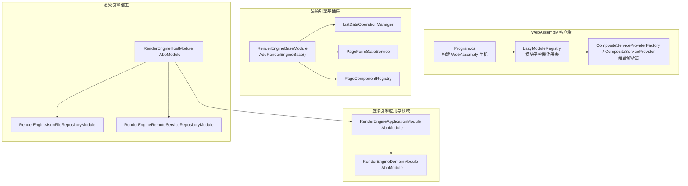
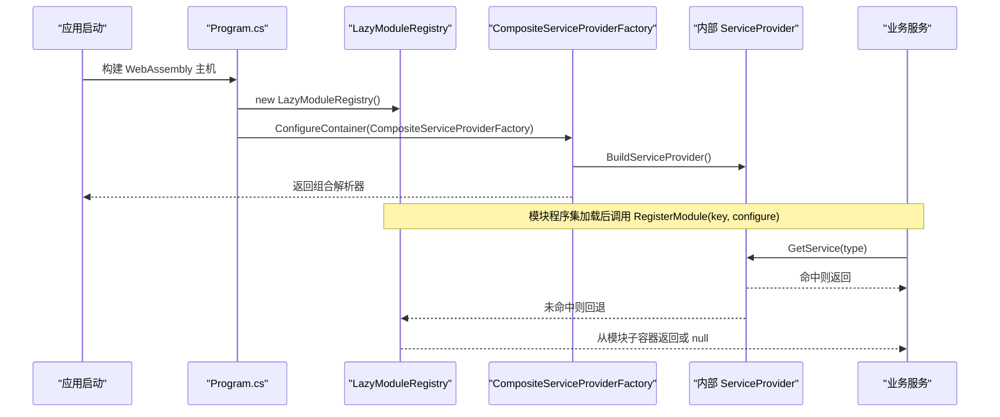
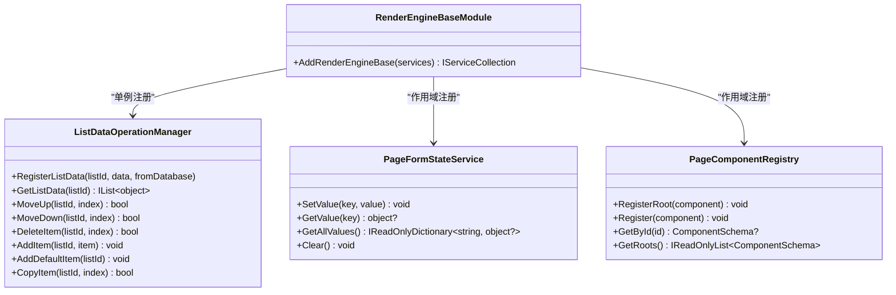
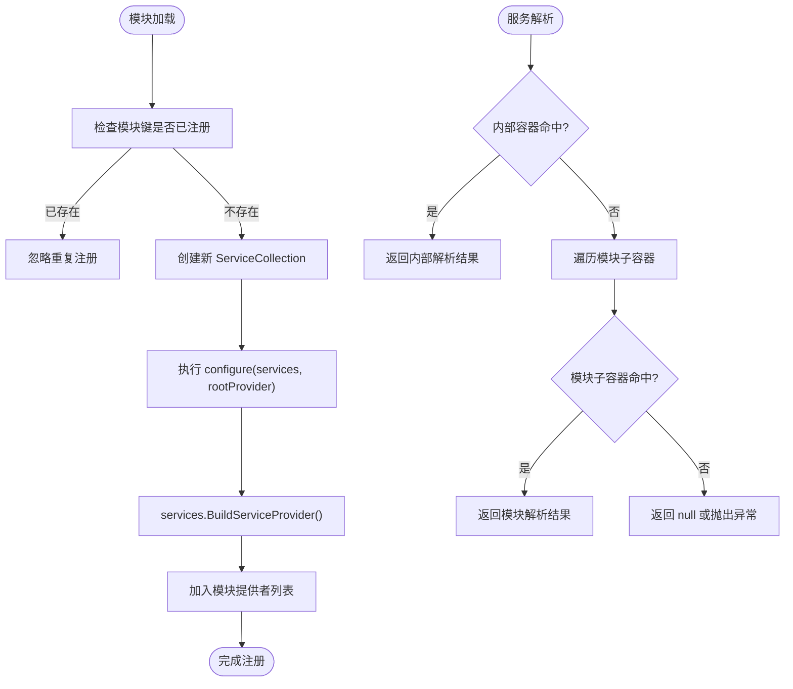
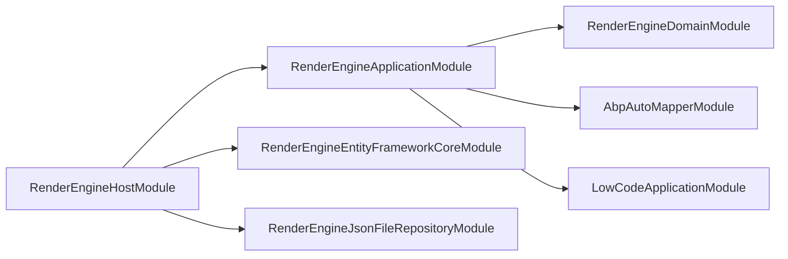

# 依赖注入扩展

<cite>
**本文引用的文件**   
- [RenderEngineBaseModule.cs](file://src/LowCode/RenderEngine/H.LowCode.RenderEngineBase/RenderEngineBaseModule.cs)
- [ListDataOperationManager.cs](file://src/LowCode/RenderEngine/H.LowCode.RenderEngineBase/ListDataOperationManager.cs)
- [PageFormStateService.cs](file://src/LowCode/RenderEngine/H.LowCode.RenderEngineBase/PageFormStateService.cs)
- [PageComponentRegistry.cs](file://src/LowCode/RenderEngine/H.LowCode.RenderEngineBase/PageComponentRegistry.cs)
- [LazyModuleServices.cs](file://src/Host/H.AppLab.Web.Host/H.AppLab.Web.Host.Client/LazyModuleServices.cs)
- [Program.cs](file://src/Host/H.AppLab.Web.Host/H.AppLab.Web.Host.Client/Program.cs)
- [RenderEngineApplicationModule.cs](file://src/LowCode/RenderEngine/H.LowCode.RenderEngine.Application/RenderEngineApplicationModule.cs)
- [RenderEngineDomainModule.cs](file://src/LowCode/RenderEngine/H.LowCode.RenderEngine.Domain/RenderEngineDomainModule.cs)
- [RenderEngineHostModule.cs](file://src/Host/RenderEngine/H.LowCode.RenderEngine.Host/RenderEngineHostModule.cs)
- [WorkbenchCoreModule.cs](file://src/Agent/Workbench/H.Workbench.Core/WorkbenchCoreModule.cs)
- [LowCodeApplicationModule.cs](file://src/LowCode/Common/H.LowCode.Application/LowCodeApplicationModule.cs)
- [RenderEngineJsonFileRepositoryModule.cs](file://src/LowCode/RenderEngine/H.LowCode.RenderEngine.Repository.JsonFile/RenderEngineJsonFileRepositoryModule.cs)
- [RenderEngineRemoteServiceRepositoryModule.cs](file://src/LowCode/RenderEngine/H.LowCode.RenderEngine.Repository.RemoteService/RenderEngineRemoteServiceRepositoryModule.cs)
</cite>

## 目录
1. [引言](#引言)
2. [项目结构](#项目结构)
3. [核心组件](#核心组件)
4. [架构总览](#架构总览)
5. [详细组件分析](#详细组件分析)
6. [依赖关系分析](#依赖关系分析)
7. [性能与内存特性](#性能与内存特性)
8. [自定义模块扩展指南](#自定义模块扩展指南)
9. [服务容器高级用法](#服务容器高级用法)
10. [最佳实践](#最佳实践)
11. [故障排查](#故障排查)
12. [结论](#结论)

## 引言
本文面向 AppLab 平台的依赖注入扩展，聚焦 ABP Framework 模块系统与平台自研的懒加载组合容器机制。文档以 RenderEngineBaseModule 的模块化设计为切入点，梳理服务注册层次、模块间依赖管理；解释 LazyModuleRegistry 的动态模块加载原理；给出 AbpModule 自定义扩展方法；并总结条件注册、装饰器模式、服务替换等高级用法与最佳实践。

## 项目结构
AppLab 采用多领域、多层模块化组织：
- 低代码渲染引擎包含基础层、应用层、领域层、数据访问实现层和宿主装配层。
- WebAssembly 客户端通过组合式容器支持运行时动态模块加载。
- 业务域与服务按功能划分模块，并通过 DependsOn 声明依赖。

图示来源
- [Program.cs:1-13](file://src/Host/H.AppLab.Web.Host/H.AppLab.Web.Host.Client/Program.cs#L1-L13)
- [LazyModuleServices.cs:1-141](file://src/Host/H.AppLab.Web.Host/H.AppLab.Web.Host.Client/LazyModuleServices.cs#L1-L141)
- [RenderEngineBaseModule.cs:1-22](file://src/LowCode/RenderEngine/H.LowCode.RenderEngineBase/RenderEngineBaseModule.cs#L1-L22)
- [RenderEngineApplicationModule.cs:1-29](file://src/LowCode/RenderEngine/H.LowCode.RenderEngine.Application/RenderEngineApplicationModule.cs#L1-L29)
- [RenderEngineDomainModule.cs:1-10](file://src/LowCode/RenderEngine/H.LowCode.RenderEngine.Domain/RenderEngineDomainModule.cs#L1-L10)
- [RenderEngineHostModule.cs:1-39](file://src/Host/RenderEngine/H.LowCode.RenderEngine.Host/RenderEngineHostModule.cs#L1-L39)
- [RenderEngineJsonFileRepositoryModule.cs:10-15](file://src/LowCode/RenderEngine/H.LowCode.RenderEngine.Repository.JsonFile/RenderEngineJsonFileRepositoryModule.cs#L10-L15)
- [RenderEngineRemoteServiceRepositoryModule.cs:9-14](file://src/LowCode/RenderEngine/H.LowCode.RenderEngine.Repository.RemoteService/RenderEngineRemoteServiceRepositoryModule.cs#L9-L14)

章节来源
- [Program.cs:1-13](file://src/Host/H.AppLab.Web.Host/H.AppLab.Web.Host.Client/Program.cs#L1-L13)
- [RenderEngineHostModule.cs:1-39](file://src/Host/RenderEngine/H.LowCode.RenderEngine.Host/RenderEngineHostModule.cs#L1-L39)

## 核心组件
- RenderEngineBaseModule：以静态扩展方法集中注册渲染引擎基础服务，区分单例与会话作用域，确保 WebAssembly 状态保持与页面级隔离。
- LazyModuleRegistry + CompositeServiceProvider：提供“根容器 + 模块子容器”的组合解析能力，支持程序集下载后按需注册服务，并在作用域内回退解析。
- 渲染基础服务：
  - ListDataOperationManager：列表数据的增删改查、排序、数据库同步删除记录追踪。
  - PageFormStateService：页面表单值状态存储与变更通知。
  - PageComponentRegistry：页面组件树登记与按 Id 检索。

章节来源
- [RenderEngineBaseModule.cs:1-22](file://src/LowCode/RenderEngine/H.LowCode.RenderEngineBase/RenderEngineBaseModule.cs#L1-L22)
- [ListDataOperationManager.cs:1-248](file://src/LowCode/RenderEngine/H.LowCode.RenderEngineBase/ListDataOperationManager.cs#L1-L248)
- [PageFormStateService.cs:1-98](file://src/LowCode/RenderEngine/H.LowCode.RenderEngineBase/PageFormStateService.cs#L1-L98)
- [PageComponentRegistry.cs:1-48](file://src/LowCode/RenderEngine/H.LowCode.RenderEngineBase/PageComponentRegistry.cs#L1-L48)
- [LazyModuleServices.cs:1-141](file://src/Host/H.AppLab.Web.Host/H.AppLab.Web.Host.Client/LazyModuleServices.cs#L1-L141)

## 架构总览
WebAssembly 启动时创建 LazyModuleRegistry，并通过 CompositeServiceProviderFactory 包装底层 ServiceProvider，形成组合解析器。模块程序集在运行时被发现并调用 RegisterModule 将服务注册到独立子容器；解析优先内部容器，失败再回退模块子容器。

图示来源
- [Program.cs:1-13](file://src/Host/H.AppLab.Web.Host/H.AppLab.Web.Host.Client/Program.cs#L1-L13)
- [LazyModuleServices.cs:1-141](file://src/Host/H.AppLab.Web.Host/H.AppLab.Web.Host.Client/LazyModuleServices.cs#L1-L141)

## 详细组件分析

### RenderEngineBaseModule 模块化设计
- 职责边界
  - 不承载业务逻辑，只负责平台通用服务的生命周期注册。
  - 使用静态扩展方法对外暴露 AddRenderEngineBase，便于宿主按需启用。
- 服务生命周期
  - ListDataOperationManager 注册为单例，保证跨请求与 WebAssembly 的状态一致性。
  - PageFormStateService 与 PageComponentRegistry 注册为 scoped，按会话隔离。
- 扩展点
  - 新增基础服务可在同一扩展方法中追加注册，避免分散配置。

图示来源
- [RenderEngineBaseModule.cs:1-22](file://src/LowCode/RenderEngine/H.LowCode.RenderEngineBase/RenderEngineBaseModule.cs#L1-L22)
- [ListDataOperationManager.cs:1-248](file://src/LowCode/RenderEngine/H.LowCode.RenderEngineBase/ListDataOperationManager.cs#L1-L248)
- [PageFormStateService.cs:1-98](file://src/LowCode/RenderEngine/H.LowCode.RenderEngineBase/PageFormStateService.cs#L1-L98)
- [PageComponentRegistry.cs:1-48](file://src/LowCode/RenderEngine/H.LowCode.RenderEngineBase/PageComponentRegistry.cs#L1-L48)

章节来源
- [RenderEngineBaseModule.cs:1-22](file://src/LowCode/RenderEngine/H.LowCode.RenderEngineBase/RenderEngineBaseModule.cs#L1-L22)

### LazyModuleRegistry 动态模块加载机制
- 关键类型
  - LazyModuleRegistry：维护模块子容器集合与键去重；提供 RootProvider 供模块注册时访问根容器。
  - CompositeServiceProvider：优先内部容器解析，失败回退模块子容器；同时处理 IServiceScopeFactory 拦截，确保作用域内也能回退。
  - CompositeServiceScope：对作用域内的 GetService 进行同样回退处理。
  - CompositeServiceProviderFactory：构建内部容器并设置 RootProvider，返回组合解析器。
- 行为要点
  - RegisterModule 接受 key 与 Action<IServiceCollection, IServiceProvider>，基于根容器构建独立 ServiceCollection 子容器。
  - GetService 遍历已注册模块子容器，首个命中即返回。
  - Dispose 释放所有模块子容器。

图示来源
- [LazyModuleServices.cs:1-141](file://src/Host/H.AppLab.Web.Host/H.AppLab.Web.Host.Client/LazyModuleServices.cs#L1-L141)

章节来源
- [LazyModuleServices.cs:1-141](file://src/Host/H.AppLab.Web.Host/H.AppLab.Web.Host.Client/LazyModuleServices.cs#L1-L141)

### 渲染引擎模块依赖链
- RenderEngineApplicationModule：依赖 AbpAutoMapperModule、LowCodeApplicationModule、RenderEngineDomainModule；配置 MetaOption 与 AutoMapper。
- RenderEngineDomainModule：领域模块占位，可扩展领域服务。
- RenderEngineHostModule：作为宿主模块，依赖 Autofac、Mvc、渲染应用与 EF Core 模块，并启用 Json 文件仓库；注册 LowCodeAppState 并扫描控制器。

图示来源
- [RenderEngineApplicationModule.cs:1-29](file://src/LowCode/RenderEngine/H.LowCode.RenderEngine.Application/RenderEngineApplicationModule.cs#L1-L29)
- [RenderEngineDomainModule.cs:1-10](file://src/LowCode/RenderEngine/H.LowCode.RenderEngine.Domain/RenderEngineDomainModule.cs#L1-L10)
- [RenderEngineHostModule.cs:1-39](file://src/Host/RenderEngine/H.LowCode.RenderEngine.Host/RenderEngineHostModule.cs#L1-L39)
- [RenderEngineJsonFileRepositoryModule.cs:10-15](file://src/LowCode/RenderEngine/H.LowCode.RenderEngine.Repository.JsonFile/RenderEngineJsonFileRepositoryModule.cs#L10-L15)

章节来源
- [RenderEngineApplicationModule.cs:1-29](file://src/LowCode/RenderEngine/H.LowCode.RenderEngine.Application/RenderEngineApplicationModule.cs#L1-L29)
- [RenderEngineDomainModule.cs:1-10](file://src/LowCode/RenderEngine/H.LowCode.RenderEngine.Domain/RenderEngineDomainModule.cs#L1-L10)
- [RenderEngineHostModule.cs:1-39](file://src/Host/RenderEngine/H.LowCode.RenderEngine.Host/RenderEngineHostModule.cs#L1-L39)

## 依赖关系分析
- 模块耦合
  - RenderEngineHostModule 对应用层、EF Core 和数据仓库实现具有强依赖，但通过模块边界清晰隔离。
  - RenderEngineApplicationModule 通过 DependsOn 显式声明对 AbpAutoMapperModule、LowCodeApplicationModule、RenderEngineDomainModule 的依赖，降低隐式耦合。
- 依赖方向
  - 宿主 → 应用 → 领域，单向依赖，符合分层架构。
  - 仓库实现（Json/远程）与应用接口解耦，由宿主选择具体实现。
- 潜在循环依赖
  - 当前未发现模块间互相 DependsOn 的情况。
  - 若未来引入横向横切关注点（如审计、日志），建议通过接口与事件总线解耦，避免直接模块间引用。

章节来源
- [RenderEngineApplicationModule.cs:1-29](file://src/LowCode/RenderEngine/H.LowCode.RenderEngine.Application/RenderEngineApplicationModule.cs#L1-L29)
- [RenderEngineHostModule.cs:1-39](file://src/Host/RenderEngine/H.LowCode.RenderEngine.Host/RenderEngineHostModule.cs#L1-L39)

## 性能与内存特性
- 单例 vs 作用域
  - ListDataOperationManager 使用单例可减少对象创建成本，适合跨请求共享状态；但需注意线程安全与状态清理策略。
  - PageFormStateService 与 PageComponentRegistry 使用作用域，避免跨会话污染，同时减少全局锁竞争。
- 组合容器开销
  - CompositeServiceProvider 每次解析都会尝试内部容器与模块子容器，带来轻微额外查找成本；可通过明确作用域服务减少频繁解析。
- 内存泄漏防护
  - LazyModuleRegistry.Dispose 释放所有模块子容器，避免长时间运行下子容器累积。
  - 单例服务中的集合字段（如字典、哈希集合）应提供 Clear/Remove 方法并在适当生命周期清理，例如页面卸载或应用关闭钩子。

[本节为通用性能讨论，不直接分析具体文件]

## 自定义模块扩展指南

### 继承 AbpModule 的基本范式
- 新建模块类继承 AbpModule，使用 DependsOn 声明对其他模块的依赖。
- 在 ConfigureServices 中完成服务注册与配置绑定。
- 如需初始化或清理，可重写 OnApplicationInitialization 与 OnApplicationShutdown。

示例参考路径
- [WorkbenchCoreModule.cs:7-26](file://src/Agent/Workbench/H.Workbench.Core/WorkbenchCoreModule.cs#L7-L26)
- [LowCodeApplicationModule.cs:7-13](file://src/LowCode/Common/H.LowCode.Application/LowCodeApplicationModule.cs#L7-L13)

章节来源
- [WorkbenchCoreModule.cs:7-26](file://src/Agent/Workbench/H.Workbench.Core/WorkbenchCoreModule.cs#L7-L26)
- [LowCodeApplicationModule.cs:7-13](file://src/LowCode/Common/H.LowCode.Application/LowCodeApplicationModule.cs#L7-L13)

### 定义模块依赖
- 使用 [DependsOn(typeof(...))] 声明依赖模块，ABP 会按拓扑顺序加载。
- 推荐将基础设施依赖放在宿主模块，领域依赖放在应用模块。

示例参考路径
- [RenderEngineApplicationModule.cs:10-17](file://src/LowCode/RenderEngine/H.LowCode.RenderEngine.Application/RenderEngineApplicationModule.cs#L10-L17)
- [RenderEngineHostModule.cs:12-21](file://src/Host/RenderEngine/H.LowCode.RenderEngine.Host/RenderEngineHostModule.cs#L12-L21)

章节来源
- [RenderEngineApplicationModule.cs:10-17](file://src/LowCode/RenderEngine/H.LowCode.RenderEngine.Application/RenderEngineApplicationModule.cs#L10-L17)
- [RenderEngineHostModule.cs:12-21](file://src/Host/RenderEngine/H.LowCode.RenderEngine.Host/RenderEngineHostModule.cs#L12-L21)

### 实现 Initialize 与 Shutdown 生命周期方法
- 在需要完整容器的初始化阶段执行一次性任务（如缓存预热、后台任务启动）。
- 在应用关闭前释放资源、停止任务、持久化状态。

说明
- 本仓库未直接重写这两个方法，但迁移流程展示了 InitializeAsync 的使用方式，可按需添加。

章节来源
- [RenderEngineHostModule.cs:22-39](file://src/Host/RenderEngine/H.LowCode.RenderEngine.Host/RenderEngineHostModule.cs#L22-L39)

### 完整的业务模块扩展示例
以下为一个独立的业务模块实现思路，结合现有代码风格：
- 新建模块类 BusinessModule : AbpModule，DependsOn 所需基础模块。
- 在 ConfigureServices 中：
  - 从 IConfiguration 绑定选项。
  - 注册业务服务（如 AddScoped<IBusinessService, BusinessService>()）。
  - 如有仓储，注册对应 Repository 实现。
- 在 OnApplicationInitialization 中执行一次性初始化。
- 在 OnApplicationShutdown 中释放资源。

参考路径
- [WorkbenchCoreModule.cs:9-25](file://src/Agent/Workbench/H.Workbench.Core/WorkbenchCoreModule.cs#L9-L25)
- [RenderEngineApplicationModule.cs:19-27](file://src/LowCode/RenderEngine/H.LowCode.RenderEngine.Application/RenderEngineApplicationModule.cs#L19-L27)

章节来源
- [WorkbenchCoreModule.cs:9-25](file://src/Agent/Workbench/H.Workbench.Core/WorkbenchCoreModule.cs#L9-L25)
- [RenderEngineApplicationModule.cs:19-27](file://src/LowCode/RenderEngine/H.LowCode.RenderEngine.Application/RenderEngineApplicationModule.cs#L19-L27)

## 服务容器高级用法

### 条件服务注册
- 根据配置或环境切换不同实现。例如：
  - 在 RenderEngineHostModule 中可选择 Json 文件仓库或远程服务仓库。
  - 通过 DependsOn 选择 RenderEngineJsonFileRepositoryModule 或 RenderEngineRemoteServiceRepositoryModule。

示例参考路径
- [RenderEngineJsonFileRepositoryModule.cs:10-15](file://src/LowCode/RenderEngine/H.LowCode.RenderEngine.Repository.JsonFile/RenderEngineJsonFileRepositoryModule.cs#L10-L15)
- [RenderEngineRemoteServiceRepositoryModule.cs:9-14](file://src/LowCode/RenderEngine/H.LowCode.RenderEngine.Repository.RemoteService/RenderEngineRemoteServiceRepositoryModule.cs#L9-L14)

章节来源
- [RenderEngineJsonFileRepositoryModule.cs:10-15](file://src/LowCode/RenderEngine/H.LowCode.RenderEngine.Repository.JsonFile/RenderEngineJsonFileRepositoryModule.cs#L10-L15)
- [RenderEngineRemoteServiceRepositoryModule.cs:9-14](file://src/LowCode/RenderEngine/H.LowCode.RenderEngine.Repository.RemoteService/RenderEngineRemoteServiceRepositoryModule.cs#L9-L14)

### 装饰器模式应用
- 在服务注册时使用装饰器包装目标服务，增加横切关注点（如日志、缓存、重试）。
- 建议在应用层模块中统一注册装饰器，保持业务服务纯净。

说明
- 本仓库未直接出现装饰器注册代码，但可通过 IServiceCollection 扩展方法实现装饰器封装。

[本节为概念性说明，不直接分析具体文件]

### 服务替换机制
- 通过先注册接口，再注册具体实现的方式替换默认实现。
- 例如：在测试模块中替换业务服务为 Mock 实现，或在不同环境下切换仓储实现。

说明
- 本仓库通过不同仓库模块实现替换策略，可按需在宿主模块中选择。

章节来源
- [RenderEngineHostModule.cs:12-39](file://src/Host/RenderEngine/H.LowCode.RenderEngine.Host/RenderEngineHostModule.cs#L12-L39)

## 最佳实践
- 循环依赖检测
  - 避免模块间互相 DependsOn；必要时引入接口与事件总线解耦。
  - 将横向横切关注点抽象为独立模块，被多个模块依赖但不反向依赖。
- 性能优化
  - 合理选择服务生命周期：CPU 密集型对象用 Scoped，跨会话共享状态用 Singleton。
  - 减少不必要的解析次数，尽量在构造函数中注入必要依赖。
- 内存泄漏防护
  - 单例服务中的集合字段提供 Clear/Remove 方法，并在合适时机清理。
  - LazyModuleRegistry 已实现 Dispose，确保模块子容器释放。
  - 事件订阅方应在生命周期结束时取消订阅，避免持有长生命周期对象引用。

[本节为通用指导，不直接分析具体文件]

## 故障排查
- 模块加载失败
  - 检查 DependsOn 是否正确声明依赖模块。
  - 确认模块类名与命名空间正确，且项目引用完整。
- 服务解析失败
  - 确认服务是否在正确的模块中注册。
  - 在 WebAssembly 环境中，检查 LazyModuleRegistry.RootProvider 是否已初始化。
- 作用域服务误用
  - 避免在 Singleton 中注入 Scoped 服务；WorkbenchCoreModule 注释明确指出工具实例被单例捕获时的红线约束。

章节来源
- [WorkbenchCoreModule.cs:17-25](file://src/Agent/Workbench/H.Workbench.Core/WorkbenchCoreModule.cs#L17-L25)
- [LazyModuleServices.cs:1-141](file://src/Host/H.AppLab.Web.Host/H.AppLab.Web.Host.Client/LazyModuleServices.cs#L1-L141)

## 结论
AppLab 的依赖注入扩展围绕 ABP 模块系统与平台自研的 LazyModuleRegistry 展开。RenderEngineBaseModule 提供了清晰的基础服务注册边界；LazyModuleRegistry 与 CompositeServiceProvider 实现了运行时动态模块加载与作用域回退解析。通过 DependsOn 声明模块依赖、在 ConfigureServices 中完成服务注册、在生命周期钩子中执行初始化与清理，开发者可以构建高内聚、低耦合的业务模块。结合条件注册、装饰器模式和服务替换，可以在不同环境与需求下灵活扩展系统能力。遵循最佳实践可有效避免循环依赖、提升性能并防止内存泄漏。