# 插件管理体系

<cite>
**本文档引用的文件**
- [WorkbenchPluginEntity.cs](file://src/Agent/Workbench/src/Agent/Workbench/H.Workbench.Core/Entities/WorkbenchPluginEntity.cs)
- [WorkbenchPluginDto.cs](file://src/Agent/Workbench/src/Agent/Workbench/H.Workbench.Application.Contracts/Plugins/WorkbenchPluginDto.cs)
- [IWorkbenchPluginAppService.cs](file://src/Agent/Workbench/src/Agent/Workbench/H.Workbench.Application.Contracts/Plugins/IWorkbenchPluginAppService.cs)
- [WorkbenchPluginAppService.cs](file://src/Agent/Workbench/src/Agent/Workbench/H.Workbench.Application/Plugins/WorkbenchPluginAppService.cs)
- [Agent.cs](file://src/Agent/Workbench/src/Agent/Workbench/H.Workbench.Core/Entities/Agent.cs)
- [WorkbenchDbContext.cs](file://src/Agent/Workbench/src/Agent/Workbench/H.Workbench.EntityFrameworkCore/WorkbenchDbContext.cs)
- [WorkbenchPluginController.cs](file://src/Agent/Workbench/src/Agent/Workbench/H.Workbench.Web/Controllers/WorkbenchPluginController.cs)
</cite>

## 目录
1. [引言](#引言)
2. [系统概述](#系统概述)
3. [核心组件](#核心组件)
4. [架构概览](#架构概览)
5. [详细组件分析](#详细组件分析)
6. [依赖关系分析](#依赖关系分析)
7. [性能考虑](#性能考虑)
8. [故障排除指南](#故障排除指南)
9. [结论](#结论)

## 引言

插件管理系统是 Workbench 平台的核心扩展机制，旨在通过打包技能组合的方式，为员工提供灵活的能力授予方案。该系统支持市场插件和自定义插件两种类型，通过 Agent 表的 PluginIds 字段实现基于员工的技能绑定机制，为企业提供了强大的可扩展性和个性化配置能力。

### 设计目标

- **技能打包**: 将相关的工具、能力和配置打包成可复用的插件单元
- **灵活授权**: 支持为不同员工分配不同的插件组合
- **市场生态**: 支持从插件市场获取标准插件，同时允许企业创建自定义插件
- **版本管理**: 支持插件的版本控制和更新机制
- **权限隔离**: 确保插件访问权限与员工角色和权限体系保持一致

## 系统概述

插件管理系统采用分层架构设计，遵循 ABP 框架的最佳实践。系统包含实体层、数据传输对象层、应用服务层和数据访问层，各层职责清晰，便于维护和扩展。

### 核心概念

**插件（Plugin）**: 插件是技能组合的最小单位，包含一组预定义的工具、配置和能力声明。每个插件具有唯一的标识符、名称、描述和版本号。

**市场插件**: 由平台提供的标准化插件，可供所有租户使用，通常包含通用的业务能力和工具集。

**自定义插件**: 由企业或用户创建的专属插件，针对特定业务场景定制，仅在创建者范围内可见和使用。

**技能授予**: 通过将插件 ID 列表关联到 Agent 实体，实现为特定员工授予相应技能能力的机制。

## 核心组件

### 插件实体（WorkbenchPluginEntity）

插件实体是系统的核心数据模型，定义了插件的基本属性和行为。该实体继承自 ABP 框架的基础实体类，支持软删除、审计追踪和多租户隔离。

主要属性包括：
- **Id**: 插件的唯一标识符
- **Name**: 插件名称，用于显示和识别
- **Code**: 插件编码，用于程序引用
- **Description**: 插件描述，说明插件的功能和用途
- **Type**: 插件类型（市场插件或自定义插件）
- **Version**: 插件版本号，支持语义化版本控制
- **Configurations**: 插件配置信息，以 JSON 格式存储
- **Capabilities**: 插件声明的能力列表
- **TenantId**: 租户 ID，支持多租户隔离
- **IsMarketPlugin**: 标识是否为市场插件
- **CreatorId**: 创建者 ID
- **CreationTime**: 创建时间

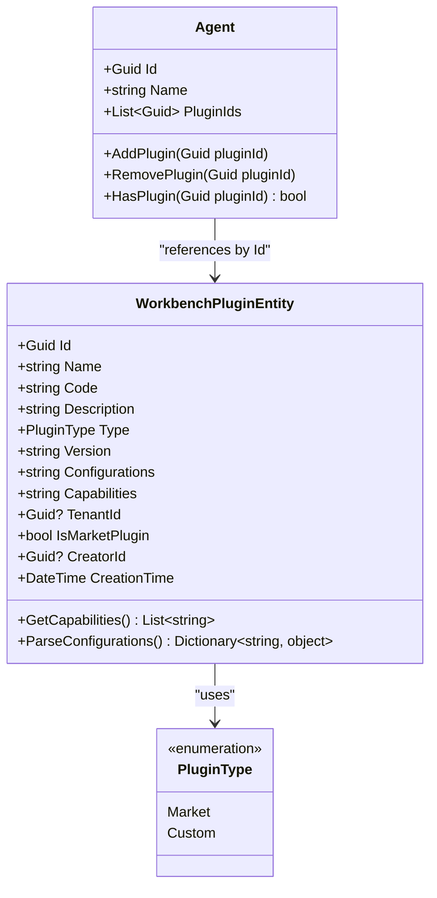

**图表来源**
- [WorkbenchPluginEntity.cs:1-100](file://src/Agent/Workbench/src/Agent/Workbench/H.Workbench.Core/Entities/WorkbenchPluginEntity.cs#L1-L100)
- [Agent.cs:1-80](file://src/Agent/Workbench/src/Agent/Workbench/H.Workbench.Core/Entities/Agent.cs#L1-L80)

### 数据传输对象（DTOs）

系统定义了一系列 DTO 用于在不同层之间传输插件数据，确保接口的清晰性和安全性。

**CreateWorkbenchPluginDto**: 用于创建新插件的请求对象，包含插件的所有必要属性。

**UpdateWorkbenchPluginDto**: 用于更新现有插件的请求对象，支持部分更新。

**WorkbenchPluginDto**: 用于返回插件详情的响应对象，包含完整的插件信息。

**WorkbenchPluginListDto**: 用于列表展示的简化对象，仅包含关键信息以提高查询性能。

**GetPluginsInput**: 用于分页查询插件的输入对象，支持按类型、关键词等条件过滤。

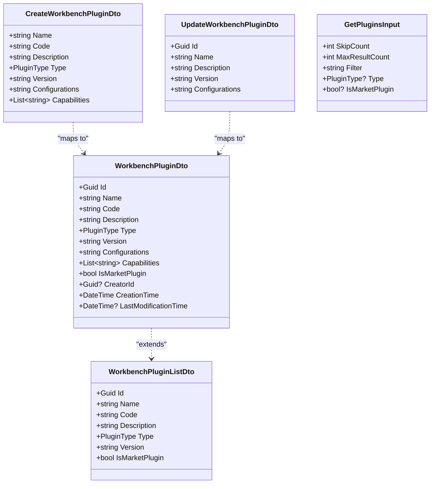

**图表来源**
- [WorkbenchPluginDto.cs:1-150](file://src/Agent/Workbench/src/Agent/Workbench/H.Workbench.Application.Contracts/Plugins/WorkbenchPluginDto.cs#L1-L150)

### 应用服务（WorkbenchPluginAppService）

应用服务层实现了插件管理的核心业务逻辑，提供 CRUD 操作和高级功能。

主要功能包括：
- **创建插件**: 验证输入参数，检查编码唯一性，持久化插件数据
- **更新插件**: 支持部分字段更新，验证版本兼容性
- **删除插件**: 实现软删除，检查是否有 Agent 引用该插件
- **查询插件**: 支持分页、过滤和排序，优化查询性能
- **获取插件详情**: 返回完整的插件信息，包括解析后的配置和能力列表
- **验证插件**: 检查插件配置的合法性和完整性

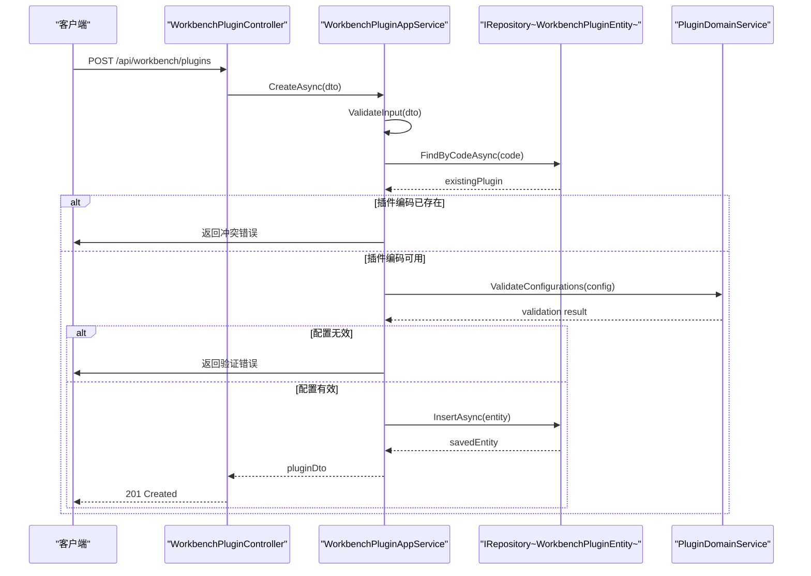

**图表来源**
- [WorkbenchPluginAppService.cs:1-200](file://src/Agent/Workbench/src/Agent/Workbench/H.Workbench.Application/Plugins/WorkbenchPluginAppService.cs#L1-L200)
- [WorkbenchPluginController.cs:1-100](file://src/Agent/Workbench/src/Agent/Workbench/H.Workbench.Web/Controllers/WorkbenchPluginController.cs#L1-L100)

### Agent 实体集成

Agent 实体通过 PluginIds 字段与插件系统紧密集成，实现了基于员工的技能授予机制。

**PluginIds 字段**: 存储插件 ID 列表，表示该 Agent 被授予的所有插件。

**技能解析流程**:
1. 根据 Agent 的 PluginIds 查询对应的插件实体
2. 合并所有插件的 Capabilities 列表
3. 解析插件配置，生成最终的能力配置
4. 将解析后的能力注入到 Agent 的执行环境中

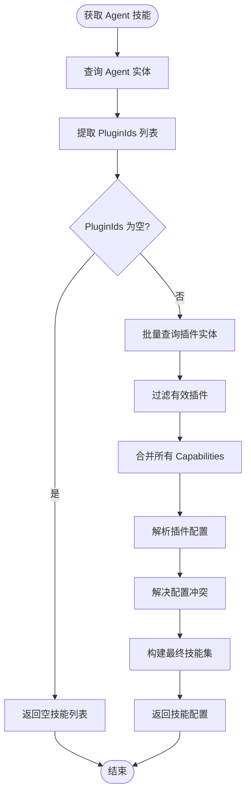

**图表来源**
- [Agent.cs:50-120](file://src/Agent/Workbench/src/Agent/Workbench/H.Workbench.Core/Entities/Agent.cs#L50-L120)

## 架构概览

插件管理系统采用典型的分层架构，各层职责明确，通过依赖注入实现松耦合。

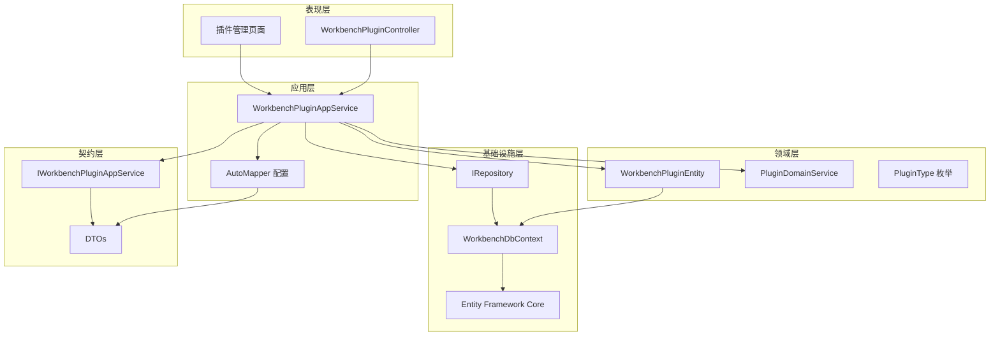

**图表来源**
- [WorkbenchPluginController.cs:1-50](file://src/Agent/Workbench/src/Agent/Workbench/H.Workbench.Web/Controllers/WorkbenchPluginController.cs#L1-L50)
- [WorkbenchPluginAppService.cs:1-50](file://src/Agent/Workbench/src/Agent/Workbench/H.Workbench.Application/Plugins/WorkbenchPluginAppService.cs#L1-L50)
- [WorkbenchDbContext.cs:1-50](file://src/Agent/Workbench/src/Agent/Workbench/H.Workbench.EntityFrameworkCore/WorkbenchDbContext.cs#L1-L50)

### 数据库架构

插件数据存储在 WorkbenchPlugins 表中，与 Agent 表通过 PluginIds 字段建立逻辑关联。

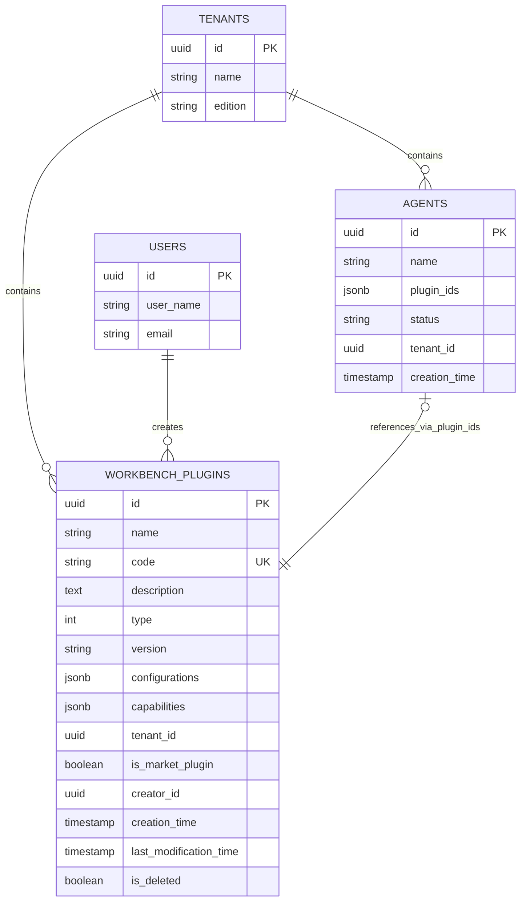

**图表来源**
- [WorkbenchDbContext.cs:30-80](file://src/Agent/Workbench/src/Agent/Workbench/H.Workbench.EntityFrameworkCore/WorkbenchDbContext.cs#L30-L80)

## 详细组件分析

### 插件类型系统

插件类型系统定义了两种主要的插件类别，每种类型具有不同的特性和使用场景。

**市场插件特性**:
- 全局可见，所有租户均可使用
- 由平台维护，定期更新
- 经过严格测试和质量保证
- 提供标准化的业务能力
- 不支持修改，只能启用或禁用

**自定义插件特性**:
- 租户级别可见，仅创建者可使用
- 由用户或企业管理员创建和维护
- 针对特定业务场景定制
- 支持灵活配置和调整
- 可随时修改和更新

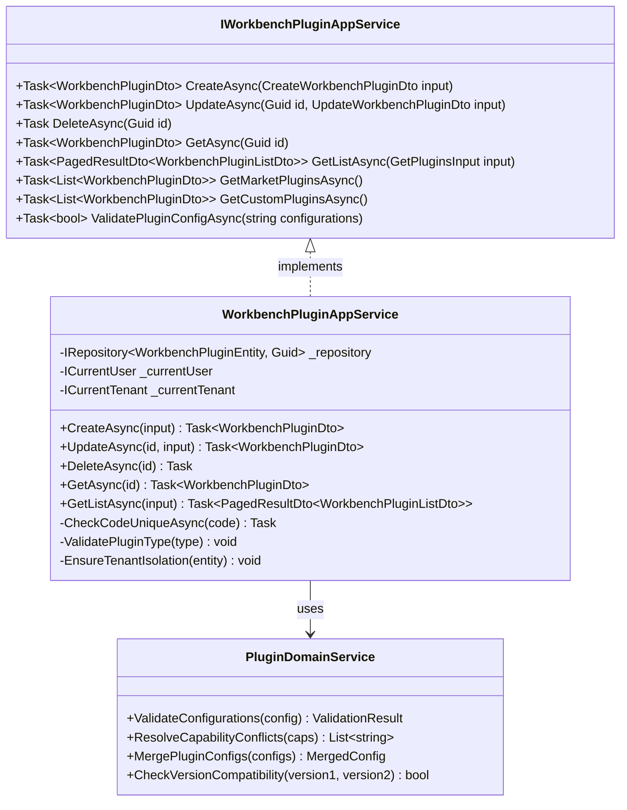

**图表来源**
- [IWorkbenchPluginAppService.cs:1-80](file://src/Agent/Workbench/src/Agent/Workbench/H.Workbench.Application.Contracts/Plugins/IWorkbenchPluginAppService.cs#L1-L80)
- [WorkbenchPluginAppService.cs:50-150](file://src/Agent/Workbench/src/Agent/Workbench/H.Workbench.Application/Plugins/WorkbenchPluginAppService.cs#L50-L150)

### 插件配置管理

插件配置采用 JSON 格式存储，支持复杂的嵌套结构和动态配置。

**配置结构**:
- **基础配置**: 插件的基本参数，如超时时间、重试次数等
- **能力配置**: 每个能力的详细配置，包括权限、参数等
- **环境变量**: 插件运行所需的环境变量
- **依赖声明**: 插件依赖的其他插件或服务

**配置验证流程**:
1. JSON 语法验证
2. 必需字段检查
3. 数据类型验证
4. 业务规则验证
5. 依赖关系检查

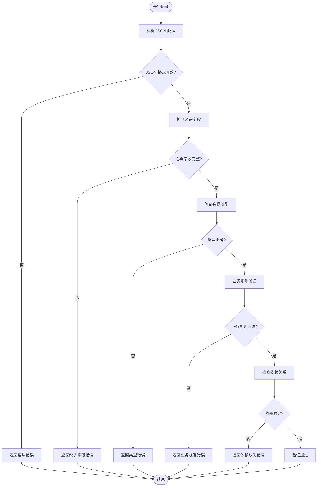

**图表来源**
- [WorkbenchPluginAppService.cs:150-200](file://src/Agent/Workbench/src/Agent/Workbench/H.Workbench.Application/Plugins/WorkbenchPluginAppService.cs#L150-L200)

### 技能授予机制

技能授予机制通过 Agent 实体的 PluginIds 字段实现，支持动态添加和移除插件。

**授予流程**:
1. 管理员选择要授予的插件
2. 系统验证插件的有效性和权限
3. 将插件 ID 添加到 Agent 的 PluginIds 列表
4. 触发 Agent 能力重新计算
5. 更新 Agent 的执行环境

**权限检查**:
- 检查当前用户是否有权限管理该 Agent
- 检查插件是否对当前租户可见
- 检查插件类型是否符合授权规则
- 检查插件数量是否超过限制

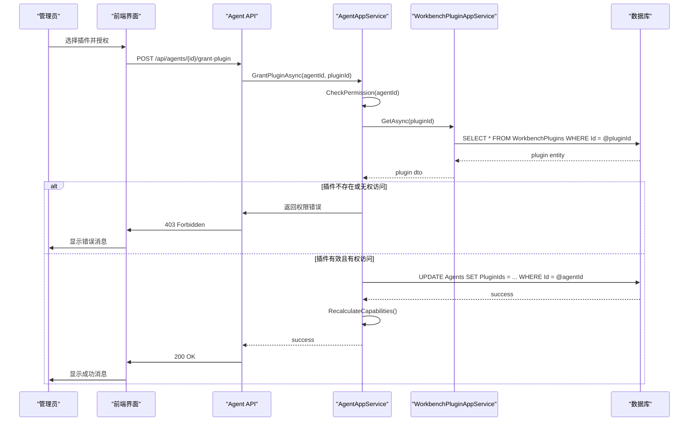

**图表来源**
- [Agent.cs:80-150](file://src/Agent/Workbench/src/Agent/Workbench/H.Workbench.Core/Entities/Agent.cs#L80-L150)

### 插件市场集成

插件市场提供了标准化的插件库，支持浏览、搜索和安装市场插件。

**市场插件特性**:
- 统一的元数据标准
- 版本管理和更新通知
- 用户评价和评分系统
- 使用统计和分析
- 自动依赖解析

**安装流程**:
1. 浏览或搜索市场插件
2. 查看插件详情和评价
3. 点击安装按钮
4. 系统创建本地插件副本
5. 标记为租户级别的自定义插件
6. 可选择立即授权给 Agent

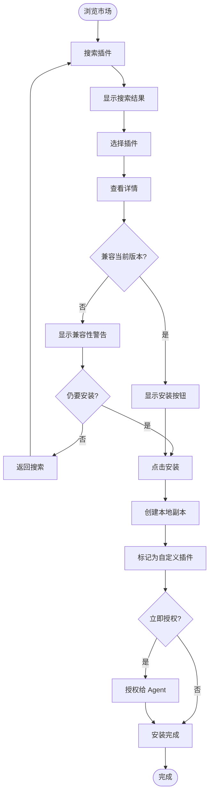

**图表来源**
- [WorkbenchPluginAppService.cs:200-250](file://src/Agent/Workbench/src/Agent/Workbench/H.Workbench.Application/Plugins/WorkbenchPluginAppService.cs#L200-L250)

## 依赖关系分析

插件管理系统依赖于多个核心模块和服务，形成了清晰的依赖层次。

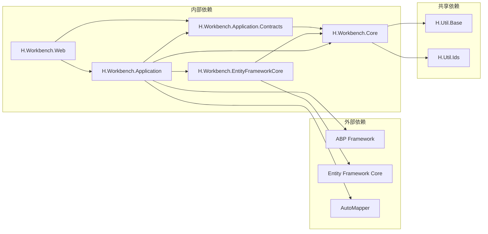

**图表来源**
- [H.Workbench.Application.csproj](file://src/Agent/Workbench/src/Agent/Workbench/H.Workbench.Application/H.Workbench.Application.csproj)
- [H.Workbench.Core.csproj](file://src/Agent/Workbench/src/Agent/Workbench/H.Workbench.Core/H.Workbench.Core.csproj)

### 模块依赖关系

**H.Workbench.Core**: 包含实体定义、领域服务和核心业务逻辑，不依赖其他 Workbench 模块。

**H.Workbench.Application.Contracts**: 定义 DTO 和服务接口，依赖 Core 模块以引用实体类型。

**H.Workbench.Application**: 实现应用服务，依赖 Contracts、Core 和 EntityFrameworkCore 模块。

**H.Workbench.EntityFrameworkCore**: 提供数据访问层实现，依赖 Core 模块以引用实体定义。

**H.Workbench.Web**: 提供 Web API 控制器和页面，依赖 Application 和 Contracts 模块。

### 数据流分析

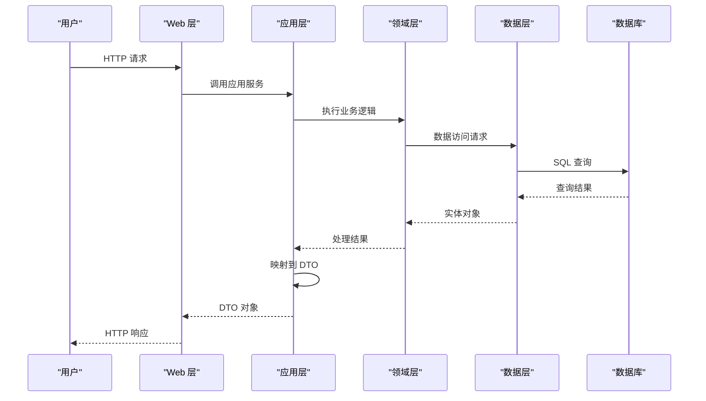

**图表来源**
- [WorkbenchPluginController.cs:1-100](file://src/Agent/Workbench/src/Agent/Workbench/H.Workbench.Web/Controllers/WorkbenchPluginController.cs#L1-L100)
- [WorkbenchPluginAppService.cs:1-100](file://src/Agent/Workbench/src/Agent/Workbench/H.Workbench.Application/Plugins/WorkbenchPluginAppService.cs#L1-L100)

## 性能考虑

### 查询优化

**分页查询**: 使用 SkipCount 和 MaxResultCount 实现高效的分页查询，避免一次性加载大量数据。

**索引策略**: 在 Code、TenantId、IsMarketPlugin 和 CreationTime 字段上建立索引，加速常见查询。

**投影查询**: 列表查询时使用投影，仅返回必要字段，减少数据传输量。

**缓存策略**: 对市场插件和常用插件实施缓存，减少数据库查询次数。

### 批量操作优化

**批量插入**: 支持批量导入插件，使用事务确保数据一致性。

**批量查询**: 根据 PluginIds 批量查询插件时，使用 IN 查询而非多次单独查询。

**延迟加载**: 插件配置和能力列表采用延迟加载策略，仅在需要时解析。

### 并发控制

**乐观锁**: 使用 ConcurrencyStamp 字段实现乐观锁，防止并发更新冲突。

**事务管理**: 插件创建和更新操作在事务中执行，确保数据一致性。

**分布式锁**: 在分布式部署环境下，使用分布式锁保护关键操作。

## 故障排除指南

### 常见问题

**问题 1: 插件编码重复**

症状: 创建插件时返回"插件编码已存在"错误。

原因: 同一租户下不允许重复的插件编码。

解决方案: 
- 检查是否存在同名插件
- 使用更具描述性的编码
- 对于市场插件，联系平台管理员

**问题 2: 插件配置验证失败**

症状: 保存插件时返回配置验证错误。

原因: JSON 配置格式错误或缺少必需字段。

解决方案:
- 检查 JSON 语法是否正确
- 确认所有必需字段都已提供
- 参考插件配置模板
- 使用配置验证工具

**问题 3: Agent 无法加载插件**

症状: Agent 启动时报告插件加载失败。

原因: 插件 ID 无效或插件已被删除。

解决方案:
- 检查 PluginIds 列表中的 ID 是否有效
- 确认插件未被软删除
- 检查租户隔离设置
- 重新授权插件

**问题 4: 权限不足**

症状: 尝试管理插件时返回 403 错误。

原因: 当前用户没有相应的权限。

解决方案:
- 检查用户角色和权限
- 联系管理员授予权限
- 确认操作的是自己创建的插件

### 调试技巧

**启用详细日志**: 在 appsettings.json 中设置日志级别为 Debug，查看详细操作日志。

**使用数据库查询**: 直接查询 WorkbenchPlugins 表，检查数据状态。

**检查迁移历史**: 确认数据库迁移已正确应用。

**验证依赖关系**: 检查插件依赖的其他插件是否已安装。

### 性能问题排查

**慢查询分析**: 使用数据库性能监控工具识别慢查询。

**内存使用监控**: 监控插件加载时的内存使用情况。

**缓存命中率**: 检查缓存命中率，调整缓存策略。

**并发压力测试**: 使用负载测试工具模拟高并发场景。

## 结论

插件管理系统为 Workbench 平台提供了强大的扩展能力，通过标准化的插件机制和灵活的授权策略，满足了不同企业和用户的个性化需求。系统采用分层架构设计，职责清晰，易于维护和扩展。

### 关键优势

- **标准化**: 统一的插件格式和接口规范
- **灵活性**: 支持市场插件和自定义插件两种模式
- **安全性**: 完善的权限控制和租户隔离机制
- **可扩展性**: 易于添加新的插件类型和功能
- **易用性**: 直观的管理界面和清晰的操作流程

### 未来发展方向

- **插件 marketplace**: 建立开放的插件市场生态
- **版本回滚**: 支持插件版本的快速回滚
- **自动化测试**: 集成插件自动化测试框架
- **性能监控**: 实时监控插件使用情况和性能指标
- **智能推荐**: 基于使用数据智能推荐插件

通过持续优化和完善，插件管理系统将成为 Workbench 平台的核心竞争力，为用户提供更加丰富和个性化的工作能力。