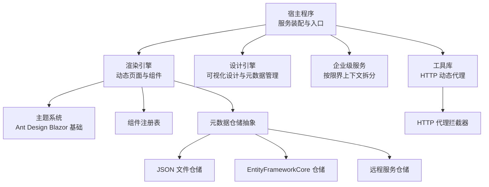
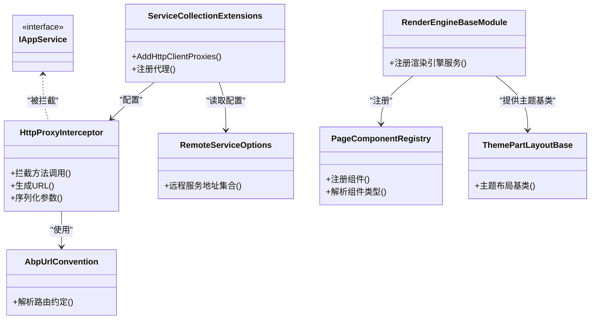
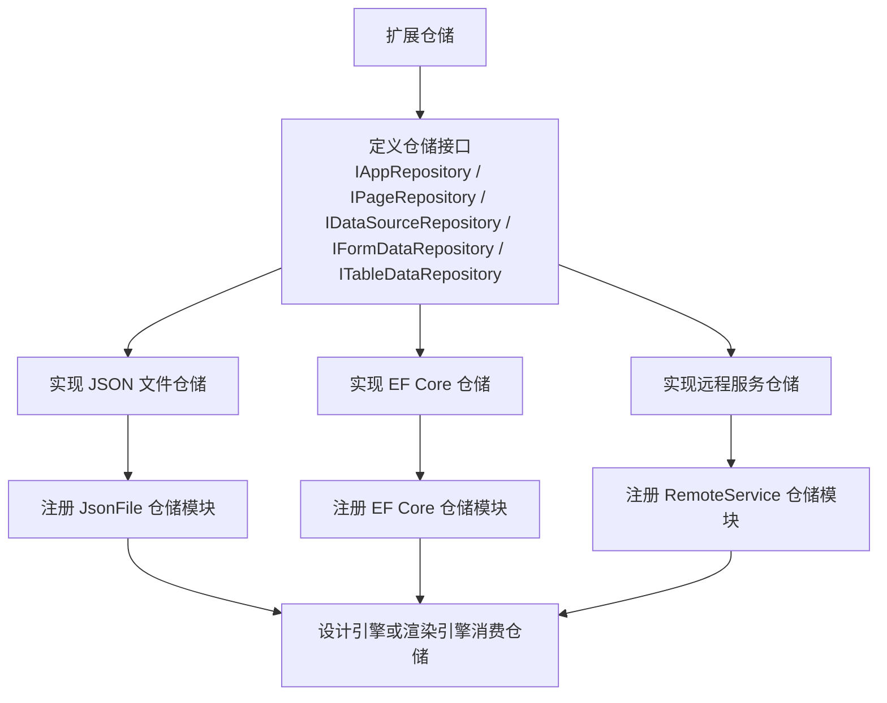
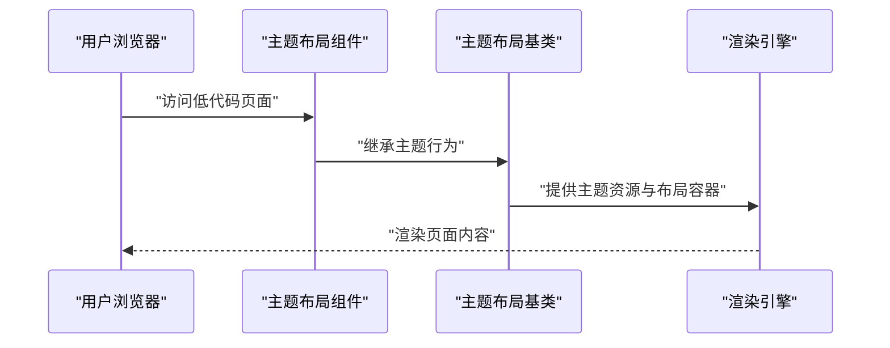
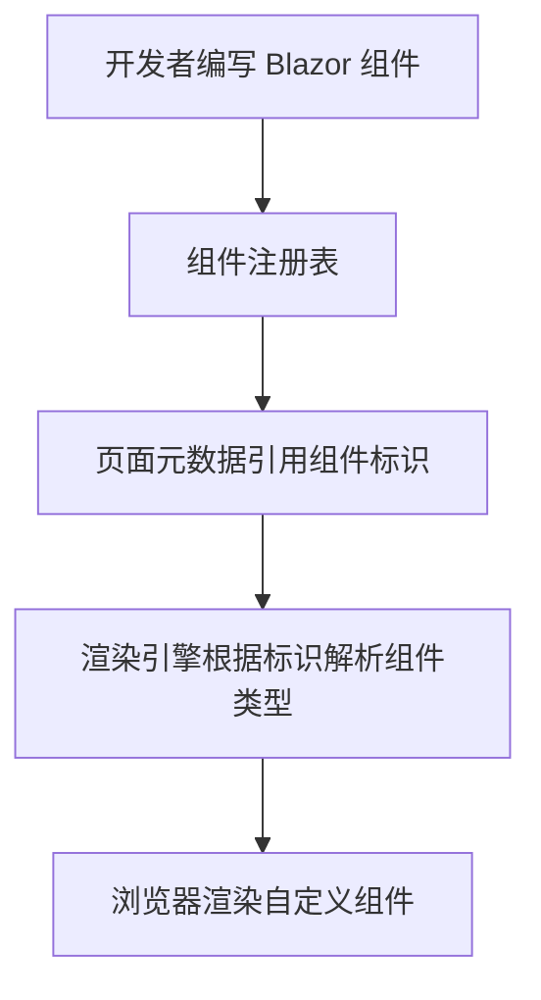
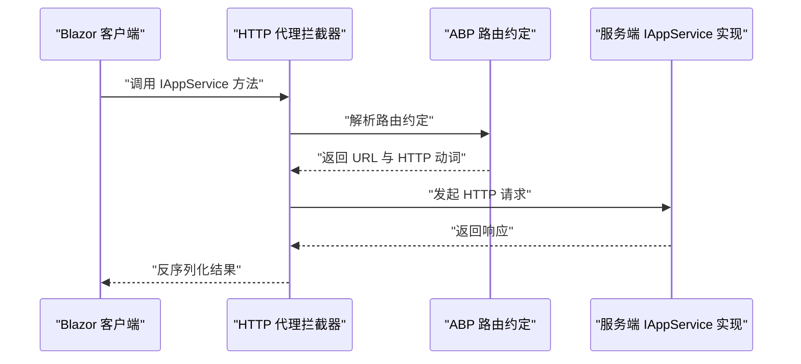
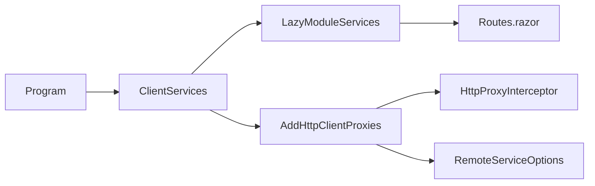

# 扩展点设计

<cite>
**本文引用的文件**   
- [README.md](file://README.md)
- [H.LowCode.DesignEngineBase.csproj](file://src/LowCode/DesignEngine/H.LowCode.DesignEngineBase/H.LowCode.DesignEngineBase.csproj)
- [HttpClientProxyInterceptor.cs](file://src/Utils/H.Abp.HttpClientProxy/HttpClientProxyInterceptor.cs)
- [AbpUrlConvention.cs](file://src/Utils/H.Abp.HttpClientProxy/AbpUrlConvention.cs)
- [ServiceCollectionExtensions.cs](file://src/Utils/H.Abp.HttpClientProxy/ServiceCollectionExtensions.cs)
- [RemoteServiceOptions.cs](file://src/Utils/H.Abp.HttpClientProxy/RemoteServiceOptions.cs)
- [Program.cs](file://src/Host/H.AppLab.Web.Host/H.AppLab.Web.Host.Client/Program.cs)
- [Routes.razor](file://src/Host/H.AppLab.Web.Host/H.AppLab.Web.Host.Client/Routes.razor)
- [LazyModuleServices.cs](file://src/Host/H.AppLab.Web.Host/H.AppLab.Web.Host.Client/LazyModuleServices.cs)
- [ClientServices.cs](file://src/Host/H.AppLab.Web.Host/H.AppLab.Web.Host.Client/ClientServices.cs)
- [RenderEngineBaseModule.cs](file://src/LowCode/RenderEngine/H.LowCode.RenderEngineBase/RenderEngineBaseModule.cs)
- [PageComponentRegistry.cs](file://src/LowCode/RenderEngine/H.LowCode.RenderEngineBase/PageComponentRegistry.cs)
- [ThemePartLayoutBase.cs](file://src/LowCode/RenderEngine/H.LowCode.RenderEngineBase/Layout/ThemePartLayoutBase.cs)
- [DesignEngineJsonFileRepositoryModule.cs](file://src/LowCode/DesignEngine/H.LowCode.DesignEngine.Repository.JsonFile/DesignEngineJsonFileRepositoryModule.cs)
- [DesignEngineRemoteServiceRepositoryModule.cs](file://src/LowCode/DesignEngine/H.LowCode.DesignEngine.Repository.RemoteService/DesignEngineRemoteServiceRepositoryModule.cs)
- [RenderEngineJsonFileRepositoryModule.cs](file://src/LowCode/RenderEngine/H.LowCode.RenderEngine.Repository.JsonFile/RenderEngineJsonFileRepositoryModule.cs)
- [RenderEngineRemoteServiceRepositoryModule.cs](file://src/LowCode/RenderEngine/H.LowCode.RenderEngine.Repository.RemoteService/RenderEngineRemoteServiceRepositoryModule.cs)
</cite>

## 目录
1. [引言](#引言)
2. [项目结构与扩展边界](#项目结构与扩展边界)
3. [核心扩展点总览](#核心扩展点总览)
4. [架构概览](#架构概览)
5. [详细扩展点分析](#详细扩展点分析)
6. [依赖关系与插件发现机制](#依赖关系与插件发现机制)
7. [性能特性与优化建议](#性能特性与优化建议)
8. [扩展示例与集成步骤](#扩展示例与集成步骤)
9. [安全考虑与权限控制](#安全考虑与权限控制)
10. [最佳实践：接口、兼容性与版本管理](#最佳实践接口兼容性与版本管理)
11. [故障排查指南](#故障排查指南)
12. [结论](#结论)

## 引言
AppLab 平台采用模块化 .NET + Blazor 架构，既支持单体部署，也支持按服务独立部署。其可插拔能力体现在四个关键方向：
- 仓储实现扩展：通过 JsonFile、EntityFrameworkCore、RemoteService 三种实现方式替换低代码元数据与数据的持久化策略。
- UI 主题扩展：渲染引擎以 Ant Design Blazor 为基础，提供主题布局基类，允许扩展新的 Blazor 主题。
- 组件扩展：通过组件注册表扩展自定义 Blazor 组件，使低代码页面能动态渲染业务组件。
- HTTP 代理拦截器扩展：基于 ABP 约定将 IAppService 接口调用转换为 HTTP 请求，并提供拦截器扩展点用于统一鉴权、日志、重试等横切关注点。

这些扩展点共同构成 AppLab 的“约定优于配置”式扩展体系：领域接口定义稳定，具体实现由模块装配决定；WebAssembly 客户端与服务端共享契约，业务代码无感知地切换进程内调用与远程 HTTP 调用。

## 项目结构与扩展边界
从仓库结构看，扩展点主要分布在以下区域：
- LowCode：低代码核心，包含设计引擎与渲染引擎，以及多种仓储实现和主题相关基础类型。
- Services：按限界上下文划分的企业级服务，每个服务遵循 Application.Contracts / Application / EntityFrameworkCore / Web 分层，可作为远程服务被其他宿主或客户端访问。
- Host：宿主程序负责启动应用、注册服务、装配模块，是扩展点的最终装配位置。
- Utils：通用工具库，其中 H.Abp.HttpClientProxy 提供 HTTP 动态代理与拦截器扩展点。
- Components：共享 UI 组件，例如 AppDrawer，为各应用提供统一的导航与布局体验。

图表来源
- [README.md:1-73](file://README.md#L1-L73)
- [Program.cs](file://src/Host/H.AppLab.Web.Host/H.AppLab.Web.Host.Client/Program.cs)
- [RenderEngineBaseModule.cs](file://src/LowCode/RenderEngine/H.LowCode.RenderEngineBase/RenderEngineBaseModule.cs)
- [ServiceCollectionExtensions.cs](file://src/Utils/H.Abp.HttpClientProxy/ServiceCollectionExtensions.cs)

章节来源
- [README.md:1-73](file://README.md#L1-L73)

## 核心扩展点总览
| 扩展类别 | 扩展目标 | 已有实现 | 扩展方式 | 典型使用场景 |
|---|---|---|---|---|
| 仓储实现 | 低代码元数据与表单/表格数据持久化 | JsonFile、EntityFrameworkCore、RemoteService | 新增实现并注册到依赖注入容器 | 本地开发用 JSON 文件，生产环境用数据库或远端服务 |
| UI 主题 | Blazor 页面主题布局与样式 | Ant Design Blazor 主题布局基类 | 继承主题布局基类并注册主题 | 企业品牌定制、多租户主题隔离 |
| 组件扩展 | 自定义 Blazor 组件纳入低代码渲染 | 组件注册表 | 在组件注册表中声明组件标识与类型 | 业务表单控件、图表、地图等业务组件 |
| HTTP 拦截器 | IAppService 调用的横切处理 | DispatchProxy 拦截器 | 实现拦截逻辑并在代理初始化时启用 | 统一认证、审计、限流、重试 |

## 架构概览
AppLab 的扩展架构围绕三个层次展开：
- 契约层：IAppService 接口、仓储接口、组件元数据描述。契约保持稳定，是扩展的基础。
- 实现层：仓储的具体实现、主题布局实现、组件类型、拦截器实现。
- 装配层：宿主 Program、模块 Module、客户端 ClientServices 负责将契约绑定到具体实现，并启用懒加载与代理。

图表来源
- [HttpClientProxyInterceptor.cs](file://src/Utils/H.Abp.HttpClientProxy/HttpClientProxyInterceptor.cs)
- [AbpUrlConvention.cs](file://src/Utils/H.Abp.HttpClientProxy/AbpUrlConvention.cs)
- [ServiceCollectionExtensions.cs](file://src/Utils/H.Abp.HttpClientProxy/ServiceCollectionExtensions.cs)
- [RemoteServiceOptions.cs](file://src/Utils/H.Abp.HttpClientProxy/RemoteServiceOptions.cs)
- [RenderEngineBaseModule.cs](file://src/LowCode/RenderEngine/H.LowCode.RenderEngineBase/RenderEngineBaseModule.cs)
- [PageComponentRegistry.cs](file://src/LowCode/RenderEngine/H.LowCode.RenderEngineBase/PageComponentRegistry.cs)
- [ThemePartLayoutBase.cs](file://src/LowCode/RenderEngine/H.LowCode.RenderEngineBase/Layout/ThemePartLayoutBase.cs)

## 详细扩展点分析

### 仓储实现扩展（JsonFile / EntityFrameworkCore / RemoteService）
仓储扩展面向两类对象：
- 元数据仓储：应用、页面、菜单、数据源、模板、发布、RBAC 等低代码元数据。
- 数据仓储：表单数据、表格数据等运行时数据。

仓库命名体现“约定”：
- JsonFile 仓储位于 `*Repository.JsonFile` 项目，提供本地 JSON 文件读写。
- EntityFrameworkCore 仓储位于 `*EntityFrameworkCore` 项目，提供数据库持久化。
- RemoteService 仓储位于 `*Repository.RemoteService` 项目，通过已注册的 IAppService 远程调用访问数据。

模块装配体现“可插拔”：
- 设计引擎有独立的 JsonFile 与 RemoteService 仓储模块。
- 渲染引擎也有独立的 JsonFile 与 RemoteService 仓储模块。
- EF Core 仓储通常作为服务端基础设施直接注册到宿主容器。

图表来源
- [DesignEngineJsonFileRepositoryModule.cs](file://src/LowCode/DesignEngine/H.LowCode.DesignEngine.Repository.JsonFile/DesignEngineJsonFileRepositoryModule.cs)
- [DesignEngineRemoteServiceRepositoryModule.cs](file://src/LowCode/DesignEngine/H.LowCode.DesignEngine.Repository.RemoteService/DesignEngineRemoteServiceRepositoryModule.cs)
- [RenderEngineJsonFileRepositoryModule.cs](file://src/LowCode/RenderEngine/H.LowCode.RenderEngine.Repository.JsonFile/RenderEngineJsonFileRepositoryModule.cs)
- [RenderEngineRemoteServiceRepositoryModule.cs](file://src/LowCode/RenderEngine/H.LowCode.RenderEngine.Repository.RemoteService/RenderEngineRemoteServiceRepositoryModule.cs)

章节来源
- [DesignEngineJsonFileRepositoryModule.cs](file://src/LowCode/DesignEngine/H.LowCode.DesignEngine.Repository.JsonFile/DesignEngineJsonFileRepositoryModule.cs)
- [DesignEngineRemoteServiceRepositoryModule.cs](file://src/LowCode/DesignEngine/H.LowCode.DesignEngine.Repository.RemoteService/DesignEngineRemoteServiceRepositoryModule.cs)
- [RenderEngineJsonFileRepositoryModule.cs](file://src/LowCode/RenderEngine/H.LowCode.RenderEngine.Repository.JsonFile/RenderEngineJsonFileRepositoryModule.cs)
- [RenderEngineRemoteServiceRepositoryModule.cs](file://src/LowCode/RenderEngine/H.LowCode.RenderEngine.Repository.RemoteService/RenderEngineRemoteServiceRepositoryModule.cs)

### UI 主题扩展（Ant Design Blazor 主题支持）
渲染引擎提供主题布局基类，用于封装主题相关的布局、样式、资源加载和页面壳结构。新主题需要：
- 创建主题布局组件，继承主题布局基类。
- 引入 Ant Design Blazor 所需样式与脚本。
- 在宿主或模块中注册该主题布局，供渲染引擎选择。

图表来源
- [ThemePartLayoutBase.cs](file://src/LowCode/RenderEngine/H.LowCode.RenderEngineBase/Layout/ThemePartLayoutBase.cs)
- [RenderEngineBaseModule.cs](file://src/LowCode/RenderEngine/H.LowCode.RenderEngineBase/RenderEngineBaseModule.cs)

章节来源
- [ThemePartLayoutBase.cs](file://src/LowCode/RenderEngine/H.LowCode.RenderEngineBase/Layout/ThemePartLayoutBase.cs)
- [RenderEngineBaseModule.cs](file://src/LowCode/RenderEngine/H.LowCode.RenderEngineBase/RenderEngineBaseModule.cs)

### 组件扩展（自定义 Blazor 组件注册）
低代码渲染引擎通过组件注册表维护组件标识与组件类型的映射。扩展组件时：
- 将自定义组件编译为 Blazor 组件。
- 在组件注册表中注册组件标识与类型。
- 在低代码页面元数据中使用该组件标识引用组件。

图表来源
- [PageComponentRegistry.cs](file://src/LowCode/RenderEngine/H.LowCode.RenderEngineBase/PageComponentRegistry.cs)
- [RenderEngineBaseModule.cs](file://src/LowCode/RenderEngine/H.LowCode.RenderEngineBase/RenderEngineBaseModule.cs)

章节来源
- [PageComponentRegistry.cs](file://src/LowCode/RenderEngine/H.LowCode.RenderEngineBase/PageComponentRegistry.cs)
- [RenderEngineBaseModule.cs](file://src/LowCode/RenderEngine/H.LowCode.RenderEngineBase/RenderEngineBaseModule.cs)

### HTTP 代理拦截器扩展
前端通过 IAppService 接口调用后端服务，不需要手写 HttpClient 请求。系统使用 DispatchProxy 拦截接口方法调用，并按 ABP 路由约定将方法名转换为 HTTP 请求路径与动词，复杂参数自动序列化为请求体。

图表来源
- [HttpClientProxyInterceptor.cs](file://src/Utils/H.Abp.HttpClientProxy/HttpClientProxyInterceptor.cs)
- [AbpUrlConvention.cs](file://src/Utils/H.Abp.HttpClientProxy/AbpUrlConvention.cs)
- [ServiceCollectionExtensions.cs](file://src/Utils/H.Abp.HttpClientProxy/ServiceCollectionExtensions.cs)
- [RemoteServiceOptions.cs](file://src/Utils/H.Abp.HttpClientProxy/RemoteServiceOptions.cs)

章节来源
- [HttpClientProxyInterceptor.cs](file://src/Utils/H.Abp.HttpClientProxy/HttpClientProxyInterceptor.cs)
- [AbpUrlConvention.cs](file://src/Utils/H.Abp.HttpClientProxy/AbpUrlConvention.cs)
- [ServiceCollectionExtensions.cs](file://src/Utils/H.Abp.HttpClientProxy/ServiceCollectionExtensions.cs)
- [RemoteServiceOptions.cs](file://src/Utils/H.Abp.HttpClientProxy/RemoteServiceOptions.cs)

## 依赖关系与插件发现机制
AppLab 的依赖注入与插件发现主要体现在三个方面：
- 模块装配：仓储模块、渲染引擎模块通过各自 Module 文件注册服务。
- 客户端代理扫描：通过 AddHttpClientProxies 扫描程序集内所有 IAppService 接口并批量注册代理。
- 懒加载模块：WebAssembly 客户端使用 LazyModuleRegistry 与 CompositeServiceProvider 管理路由模块的服务容器，按需加载程序集后再注册服务。

图表来源
- [Program.cs](file://src/Host/H.AppLab.Web.Host/H.AppLab.Web.Host.Client/Program.cs)
- [ClientServices.cs](file://src/Host/H.AppLab.Web.Host/H.AppLab.Web.Host.Client/ClientServices.cs)
- [LazyModuleServices.cs](file://src/Host/H.AppLab.Web.Host/H.AppLab.Web.Host.Client/LazyModuleServices.cs)
- [Routes.razor](file://src/Host/H.AppLab.Web.Host/H.AppLab.Web.Host.Client/Routes.razor)
- [ServiceCollectionExtensions.cs](file://src/Utils/H.Abp.HttpClientProxy/ServiceCollectionExtensions.cs)
- [HttpClientProxyInterceptor.cs](file://src/Utils/H.Abp.HttpClientProxy/HttpClientProxyInterceptor.cs)
- [RemoteServiceOptions.cs](file://src/Utils/H.Abp.HttpClientProxy/RemoteServiceOptions.cs)

章节来源
- [Program.cs](file://src/Host/H.AppLab.Web.Host/H.AppLab.Web.Host.Client/Program.cs)
- [ClientServices.cs](file://src/Host/H.AppLab.Web.Host/H.AppLab.Web.Host.Client/ClientServices.cs)
- [LazyModuleServices.cs](file://src/Host/H.AppLab.Web.Host/H.AppLab.Web.Host.Client/LazyModuleServices.cs)
- [Routes.razor](file://src/Host/H.AppLab.Web.Host/H.AppLab.Web.Host.Client/Routes.razor)
- [ServiceCollectionExtensions.cs](file://src/Utils/H.Abp.HttpClientProxy/ServiceCollectionExtensions.cs)

## 性能特性与优化建议
根据 README 说明，系统在客户端侧具备以下性能优化：
- WebAssembly 懒加载：首页仅加载必要程序集，其余 Contracts、LowCode 库及第三方依赖在导航到对应路由时才按需下载。
- AOT 与裁剪：Release 模式启用 AOT 与 Trimming，减少下载体积；Debug 模式额外加载 .pdb 支持调试。
- 组合式 DI：LazyModuleRegistry 与 CompositeServiceProvider 支撑懒加载后的服务注册，避免一次性加载全部程序集。

建议：
- 仓储实现应优先使用远程服务仓储进行跨进程访问，避免在 WebAssembly 环境中直接操作文件系统。
- 主题与组件应尽量拆分为独立程序集，配合懒加载降低首屏体积。
- HTTP 拦截器应避免阻塞主线程，将耗时操作下沉到服务端或通过异步任务处理。

章节来源
- [README.md:1-73](file://README.md#L1-L73)

## 扩展示例与集成步骤

### 如何编写自定义仓储
步骤：
1. 明确仓储接口：参考现有 IAppRepository、IPageRepository、IDataSourceRepository、IFormDataRepository、ITableDataRepository 等接口，确定要扩展的数据类型。
2. 选择实现方式：
   - 本地开发：新建 JsonFile 仓储，实现文件的读写与序列化。
   - 生产环境：新建 EF Core 仓储，定义 DbContext、实体映射与查询优化。
   - 分布式环境：新建 RemoteService 仓储，复用 IAppService 远程调用。
3. 注册仓储模块：在宿主或模块中注册对应的 JsonFile 或 RemoteService 仓储模块；EF Core 仓储通常在服务端直接注册。
4. 验证：通过设计引擎或渲染引擎消费仓储接口，确认数据读写正常。

注意：
- 不要修改契约接口，只在实现层扩展。
- RemoteService 仓储依赖服务端已正确暴露 IAppService。
- JsonFile 仓储适合单机开发与演示，不适合高并发与多实例部署。

### 如何扩展组件库
步骤：
1. 创建 Blazor 组件：编写组件 Razor 文件与必要的模型。
2. 注册组件：在组件注册表中注册组件标识与类型。
3. 引入元数据：在低代码页面元数据中引用该组件标识。
4. 打包与懒加载：将组件库放入独立程序集，并通过 Routes.razor 的路由触发懒加载。

注意：
- 组件标识应保持全局唯一且语义清晰。
- 组件参数应与低代码 Schema 对齐，确保设计器与渲染器一致。
- 组件样式尽量局部化，避免污染全局主题。

### 如何添加新的 UI 主题
步骤：
1. 新建主题布局组件：继承主题布局基类。
2. 引入主题资源：添加 Ant Design Blazor 样式与脚本。
3. 注册主题：在宿主或模块中注册主题布局。
4. 切换主题：在运行时根据租户或用户配置选择主题。

注意：
- 主题布局不应硬编码业务组件类型，只负责布局与资源。
- 主题变量应尽量集中，便于多租户切换。
- 主题升级时需保证向后兼容，避免破坏已有页面。

章节来源
- [README.md:1-73](file://README.md#L1-L73)
- [RenderEngineBaseModule.cs](file://src/LowCode/RenderEngine/H.LowCode.RenderEngineBase/RenderEngineBaseModule.cs)
- [PageComponentRegistry.cs](file://src/LowCode/RenderEngine/H.LowCode.RenderEngineBase/PageComponentRegistry.cs)
- [ThemePartLayoutBase.cs](file://src/LowCode/RenderEngine/H.LowCode.RenderEngineBase/Layout/ThemePartLayoutBase.cs)

## 安全考虑与权限控制
扩展点的安全风险主要集中在以下几处：
- HTTP 代理拦截器：若未校验令牌、签名或重放防护，可能被伪造请求利用。
- RemoteService 仓储：远程调用可能暴露敏感数据，需服务端接口做好授权与最小权限原则。
- 组件注册表：恶意组件可能执行危险逻辑，需限制可加载程序集来源。
- 主题布局：主题资源加载应限制来源域名，防止注入外部脚本。
- 懒加载模块：程序集加载后注册的服务应具有明确的生命周期与作用域，避免单例泄露状态。

建议：
- 在 HttpProxyInterceptor 中统一注入身份上下文、租户信息、请求追踪 ID。
- 对 RemoteService 调用增加超时、重试上限与熔断保护。
- 对组件与主题程序集进行签名校验与白名单控制。
- 在仓储层区分只读与写操作，写操作要求更高权限。
- 在模块装配阶段记录已注册扩展点，便于审计与回滚。

## 最佳实践：接口、兼容性与版本管理

### 接口设计原则
- 面向契约编程：仓储、IAppService、组件元数据均保持接口稳定。
- 单一职责：仓储接口按聚合根或资源维度拆分，避免巨型接口。
- 幂等性：写操作尽量幂等，便于重试与分布式事务补偿。
- 可观测性：接口返回值包含错误码、消息与跟踪信息。

### 向后兼容性保证
- 不删除既有接口成员，新增成员时使用可选字段或默认值。
- 远程服务接口变更需保留旧版本兼容路由。
- 组件标识变更需提供迁移映射。
- 主题布局升级需兼容旧版页面元数据。

### 版本管理策略
- 契约与实现分离：契约项目版本号独立于实现项目。
- 远程服务路由带版本前缀，如 `/api/v1/...`。
- 仓储实现通过模块装配选择版本，避免硬编码类型。
- 组件与主题通过清单文件声明兼容范围，宿主在启动时校验。

## 故障排查指南

### 仓储无法解析
症状：
- 设计引擎或渲染引擎启动时报仓储未注册。
- RemoteService 仓储调用失败。

排查：
- 检查是否注册了对应的 JsonFile 或 RemoteService 仓储模块。
- 检查服务端是否已注册 IAppService 实现。
- 检查 RemoteServiceOptions 中的远程服务地址是否正确。

### 组件未渲染
症状：
- 低代码页面中出现空白或未识别组件。
- 组件类型解析失败。

排查：
- 检查组件注册表是否已注册该组件标识。
- 检查页面元数据中的组件标识是否与注册一致。
- 检查组件程序集是否已懒加载。

### HTTP 代理调用异常
症状：
- 前端调用 IAppService 抛出异常。
- 路由转换错误或参数序列化失败。

排查：
- 检查 AbpUrlConvention 是否能正确解析方法名到路由。
- 检查 RemoteServiceOptions 是否配置了正确的远程服务地址。
- 检查 HttpProxyInterceptor 是否启用了认证头或签名。

章节来源
- [HttpClientProxyInterceptor.cs](file://src/Utils/H.Abp.HttpClientProxy/HttpClientProxyInterceptor.cs)
- [AbpUrlConvention.cs](file://src/Utils/H.Abp.HttpClientProxy/AbpUrlConvention.cs)
- [ServiceCollectionExtensions.cs](file://src/Utils/H.Abp.HttpClientProxy/ServiceCollectionExtensions.cs)
- [RemoteServiceOptions.cs](file://src/Utils/H.Abp.HttpClientProxy/RemoteServiceOptions.cs)

## 结论
AppLab 平台的扩展点以契约为核心、模块装配为桥梁、懒加载为性能保障，形成“约定优于配置”的可插拔架构。仓储实现、UI 主题、组件注册与 HTTP 代理拦截器四大扩展点覆盖了数据持久化、界面风格、业务组件与横切关注点。扩展者只需遵循接口契约、遵守模块装配约定，即可在不侵入核心代码的前提下扩展平台能力。为确保长期可维护性，应坚持接口稳定、版本兼容、安全可控与可观测性原则，并将扩展点纳入统一的注册、审计与回滚流程。