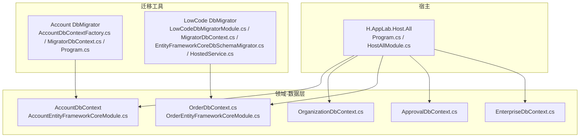
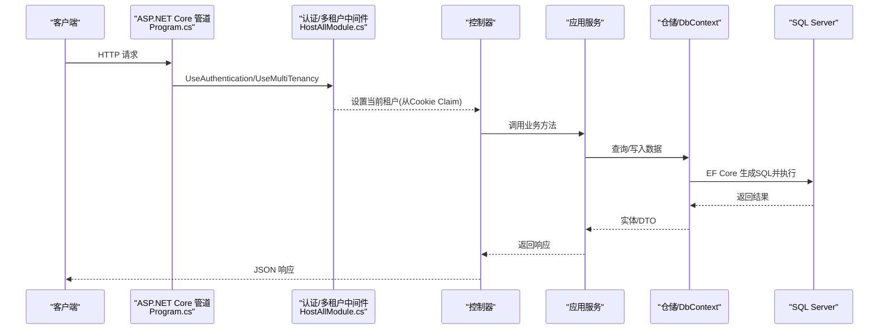
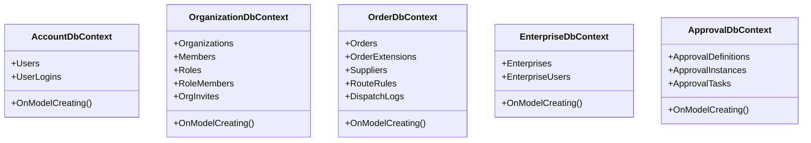
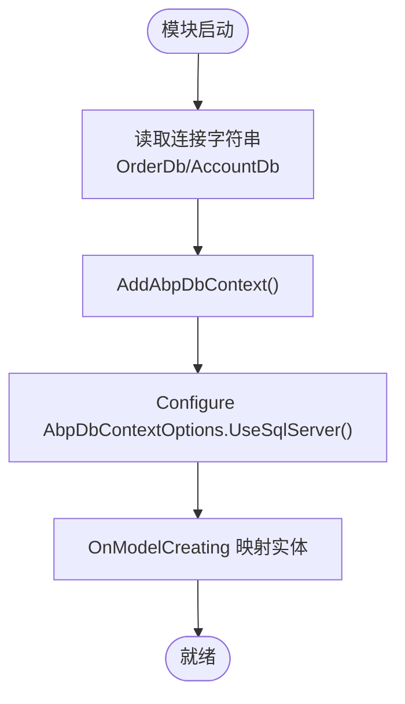
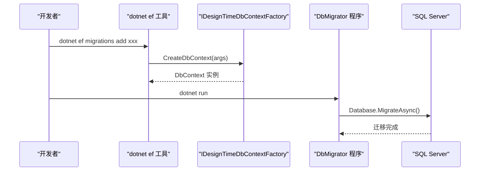
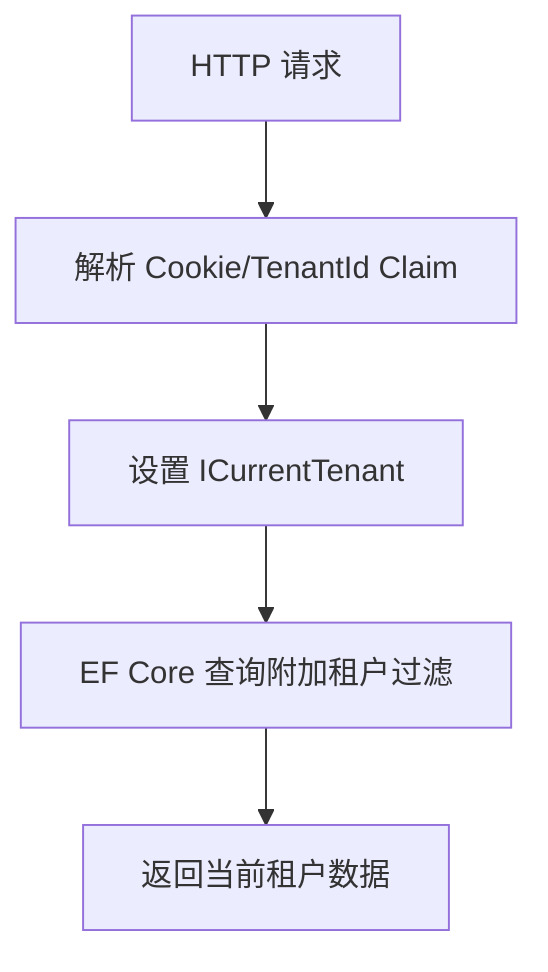
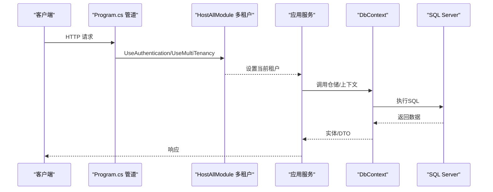
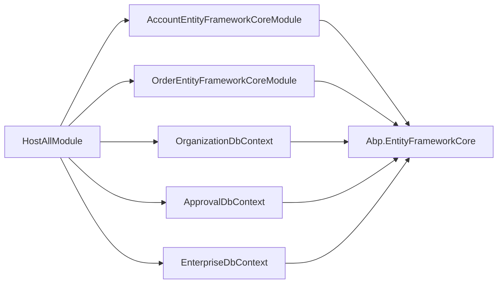

# 数据架构

<cite>
**本文引用的文件**   
- [Program.cs](file://src/Host/H.AppLab.Host.All/H.AppLab.Host.All/Program.cs)
- [HostAllModule.cs](file://src/Host/H.AppLab.Host.All/H.AppLab.Host.All/HostAllModule.cs)
- [ClaimsTenantResolveContributor.cs](file://src/Host/H.AppLab.Host.All/H.AppLab.Host.All/ClaimsTenantResolveContributor.cs)
- [AccountDbContext.cs](file://src/Services/Account/H.Account.EntityFrameworkCore/AccountDbContext.cs)
- [AccountEntityFrameworkCoreModule.cs](file://src/Services/Account/H.Account.EntityFrameworkCore/AccountEntityFrameworkCoreModule.cs)
- [OrganizationDbContext.cs](file://src/Services/Organization/H.Organization.EntityFrameworkCore/OrganizationDbContext.cs)
- [OrderDbContext.cs](file://src/Services/Order/H.Order.EntityFrameworkCore/OrderDbContext.cs)
- [OrderEntityFrameworkCoreModule.cs](file://src/Services/Order/H.Order.EntityFrameworkCore/OrderEntityFrameworkCoreModule.cs)
- [EnterpriseDbContext.cs](file://src/System/Enterprise/H.Enterprise.EntityFrameworkCore/EnterpriseDbContext.cs)
- [ApprovalDbContext.cs](file://src/Services/Approval/H.Approval.EntityFrameworkCore/ApprovalDbContext.cs)
- [AccountDbContextFactory.cs](file://src/Tools/H.Account.DbMigrator/AccountDbContextFactory.cs)
- [MigratorDbContext.cs（Account）](file://src/Tools/H.Account.DbMigrator/MigratorDbContext.cs)
- [Program.cs（Account DbMigrator）](file://src/Tools/H.Account.DbMigrator/Program.cs)
- [LowCodeDbMigratorModule.cs](file://src/Tools/H.LowCode.DbMigrator/LowCodeDbMigratorModule.cs)
- [MigratorDbContext.cs（LowCode）](file://src/Tools/H.LowCode.DbMigrator/MigrationServices/MigratorDbContext.cs)
- [EntityFrameworkCoreDbSchemaMigrator.cs](file://src/Tools/H.LowCode.DbMigrator/MigrationServices/EntityFrameworkCoreDbSchemaMigrator.cs)
- [HostedService.cs（LowCode DbMigrator）](file://src/Tools/H.LowCode.DbMigrator/HostedService.cs)
- [OrderApplicationModule.cs](file://src/Services/Order/H.Order.Application/OrderApplicationModule.cs)
</cite>

## 目录
1. [引言](#引言)
2. [项目结构](#项目结构)
3. [核心组件](#核心组件)
4. [架构总览](#架构总览)
5. [详细组件分析](#详细组件分析)
6. [依赖关系分析](#依赖关系分析)
7. [性能考虑](#性能考虑)
8. [故障排查指南](#故障排查指南)
9. [结论](#结论)
10. [附录](#附录)

## 引言
本文件面向AppLab平台的数据架构，聚焦多数据库与多租户设计、EntityFramework Core配置与使用模式、数据迁移策略、以及从API到数据库的完整数据流。文档同时给出缓存策略、连接池与性能优化建议，帮助读者快速理解并正确扩展系统的数据层。

## 项目结构
- 按业务域划分多个独立EF Core DbContext与数据库：账户、组织、订单、审批、低代码引擎等，每个域通过独立的AbpModule注册连接字符串与SQL Server提供程序。
- 统一宿主模块聚合所有应用模块，启用多租户、认证授权、控制器发现等能力。
- 每个域配套独立的DbMigrator工具项目，用于生成与应用迁移脚本，保证版本可控与可回滚。

**图表来源** 
- [Program.cs:1-115](file://src/Host/H.AppLab.Host.All/H.AppLab.Host.All/Program.cs#L1-L115)
- [HostAllModule.cs:1-203](file://src/Host/H.AppLab.Host.All/H.AppLab.Host.All/HostAllModule.cs#L1-L203)
- [AccountDbContext.cs:1-28](file://src/Services/Account/H.Account.EntityFrameworkCore/AccountDbContext.cs#L1-L28)
- [AccountEntityFrameworkCoreModule.cs:1-38](file://src/Services/Account/H.Account.EntityFrameworkCore/AccountEntityFrameworkCoreModule.cs#L1-L38)
- [OrganizationDbContext.cs:1-145](file://src/Services/Organization/H.Organization.EntityFrameworkCore/OrganizationDbContext.cs#L1-L145)
- [OrderDbContext.cs:1-110](file://src/Services/Order/H.Order.EntityFrameworkCore/OrderDbContext.cs#L1-L110)
- [OrderEntityFrameworkCoreModule.cs:1-31](file://src/Services/Order/H.Order.EntityFrameworkCore/OrderEntityFrameworkCoreModule.cs#L1-L31)
- [ApprovalDbContext.cs:43-71](file://src/Services/Approval/H.Approval.EntityFrameworkCore/ApprovalDbContext.cs#L43-L71)
- [EnterpriseDbContext.cs:1-44](file://src/System/Enterprise/H.Enterprise.EntityFrameworkCore/EnterpriseDbContext.cs#L1-L44)
- [AccountDbContextFactory.cs:1-28](file://src/Tools/H.Account.DbMigrator/AccountDbContextFactory.cs#L1-L28)
- [MigratorDbContext.cs（Account）:1-23](file://src/Tools/H.Account.DbMigrator/MigratorDbContext.cs#L1-L23)
- [Program.cs（Account DbMigrator）:1-37](file://src/Tools/H.Account.DbMigrator/Program.cs#L1-L37)
- [LowCodeDbMigratorModule.cs:31-40](file://src/Tools/H.LowCode.DbMigrator/LowCodeDbMigratorModule.cs#L31-L40)
- [MigratorDbContext.cs（LowCode）:1-36](file://src/Tools/H.LowCode.DbMigrator/MigrationServices/MigratorDbContext.cs#L1-L36)
- [EntityFrameworkCoreDbSchemaMigrator.cs:1-28](file://src/Tools/H.LowCode.DbMigrator/MigrationServices/EntityFrameworkCoreDbSchemaMigrator.cs#L1-L28)
- [HostedService.cs（LowCode DbMigrator）:1-49](file://src/Tools/H.LowCode.DbMigrator/HostedService.cs#L1-L49)

**章节来源**
- [Program.cs:1-115](file://src/Host/H.AppLab.Host.All/H.AppLab.Host.All/Program.cs#L1-L115)
- [HostAllModule.cs:1-203](file://src/Host/H.AppLab.Host.All/H.AppLab.Host.All/HostAllModule.cs#L1-L203)

## 核心组件
- 多DbContext与多数据库：每个业务域一个DbContext，并通过AbpModule注入连接字符串与SQL Server提供程序。
- 多租户：基于ABP的多租户机制，结合自定义Claim解析器从Cookie中读取TenantId，驱动行级隔离。
- 迁移工具：各域独立DbMigrator，支持dotnet ef命令与运行时迁移执行。
- 事件与消息：订单域集成CAP，持久化到数据库，保障异步任务可靠性。

**章节来源**
- [AccountEntityFrameworkCoreModule.cs:1-38](file://src/Services/Account/H.Account.EntityFrameworkCore/AccountEntityFrameworkCoreModule.cs#L1-L38)
- [OrderEntityFrameworkCoreModule.cs:1-31](file://src/Services/Order/H.Order.EntityFrameworkCore/OrderEntityFrameworkCoreModule.cs#L1-L31)
- [ClaimsTenantResolveContributor.cs:1-30](file://src/Host/H.AppLab.Host.All/H.AppLab.Host.All/ClaimsTenantResolveContributor.cs#L1-L30)
- [OrderApplicationModule.cs:34-50](file://src/Services/Order/H.Order.Application/OrderApplicationModule.cs#L34-L50)

## 架构总览
下图展示从HTTP请求到数据库操作的端到端流程，包括多租户解析、控制器路由、服务调用、EF Core查询与SQL Server交互。

**图表来源** 
- [Program.cs:81-88](file://src/Host/H.AppLab.Host.All/H.AppLab.Host.All/Program.cs#L81-L88)
- [HostAllModule.cs:171-201](file://src/Host/H.AppLab.Host.All/H.AppLab.Host.All/HostAllModule.cs#L171-L201)
- [ClaimsTenantResolveContributor.cs:1-30](file://src/Host/H.AppLab.Host.All/H.AppLab.Host.All/ClaimsTenantResolveContributor.cs#L1-L30)

## 详细组件分析

### 多数据库与DbContext设计
- 账户域：AccountDbContext继承AbpDbContext，使用[ConnectionStringName("AccountDb")]标记，模块中注册默认仓储与SQL Server提供程序，并将AccountDb与AbpIdentity共享同一连接字符串。
- 组织域：OrganizationDbContext定义部门、成员、角色、邀请等表及关系映射，包含自引用父子层级与唯一索引。
- 订单域：OrderDbContext定义订单、扩展、供应商、路由规则、下发日志等表，包含大量索引与一对一/一对多关系。
- 企业域：EnterpriseDbContext为跨租户实体，不应用租户过滤，单独管理企业与用户关联。
- 审批域：ApprovalDbContext定义审批定义、实例、任务等实体及其关系。

**图表来源** 
- [AccountDbContext.cs:1-28](file://src/Services/Account/H.Account.EntityFrameworkCore/AccountDbContext.cs#L1-L28)
- [OrganizationDbContext.cs:1-145](file://src/Services/Organization/H.Organization.EntityFrameworkCore/OrganizationDbContext.cs#L1-L145)
- [OrderDbContext.cs:1-110](file://src/Services/Order/H.Order.EntityFrameworkCore/OrderDbContext.cs#L1-L110)
- [EnterpriseDbContext.cs:1-44](file://src/System/Enterprise/H.Enterprise.EntityFrameworkCore/EnterpriseDbContext.cs#L1-L44)
- [ApprovalDbContext.cs:43-71](file://src/Services/Approval/H.Approval.EntityFrameworkCore/ApprovalDbContext.cs#L43-L71)

**章节来源**
- [AccountDbContext.cs:1-28](file://src/Services/Account/H.Account.EntityFrameworkCore/AccountDbContext.cs#L1-L28)
- [OrganizationDbContext.cs:1-145](file://src/Services/Organization/H.Organization.EntityFrameworkCore/OrganizationDbContext.cs#L1-L145)
- [OrderDbContext.cs:1-110](file://src/Services/Order/H.Order.EntityFrameworkCore/OrderDbContext.cs#L1-L110)
- [EnterpriseDbContext.cs:1-44](file://src/System/Enterprise/H.Enterprise.EntityFrameworkCore/EnterpriseDbContext.cs#L1-L44)
- [ApprovalDbContext.cs:43-71](file://src/Services/Approval/H.Approval.EntityFrameworkCore/ApprovalDbContext.cs#L43-L71)

### EntityFramework Core配置与使用模式
- 连接字符串：通过AbpDbConnectionOptions在各模块中绑定具体连接名（如AccountDb、OrderDb）。
- SQL Server提供程序：在AbpDbContextOptions.UseSqlServer()中统一配置。
- 模型映射：在DbContext.OnModelCreating中配置表名、主键、属性长度、类型、索引与关系。
- 默认仓储：AddDefaultRepositories(includeAllEntities: true)自动生成CRUD仓储。

**图表来源** 
- [OrderEntityFrameworkCoreModule.cs:1-31](file://src/Services/Order/H.Order.EntityFrameworkCore/OrderEntityFrameworkCoreModule.cs#L1-L31)
- [AccountEntityFrameworkCoreModule.cs:1-38](file://src/Services/Account/H.Account.EntityFrameworkCore/AccountEntityFrameworkCoreModule.cs#L1-L38)
- [OrderDbContext.cs:32-110](file://src/Services/Order/H.Order.EntityFrameworkCore/OrderDbContext.cs#L32-L110)
- [AccountDbContext.cs:21-27](file://src/Services/Account/H.Account.EntityFrameworkCore/AccountDbContext.cs#L21-L27)

**章节来源**
- [OrderEntityFrameworkCoreModule.cs:1-31](file://src/Services/Order/H.Order.EntityFrameworkCore/OrderEntityFrameworkCoreModule.cs#L1-L31)
- [AccountEntityFrameworkCoreModule.cs:1-38](file://src/Services/Account/H.Account.EntityFrameworkCore/AccountEntityFrameworkCoreModule.cs#L1-L38)

### 数据迁移策略与版本管理
- 设计时工厂：每个域DbMigrator项目实现IDesignTimeDbContextFactory，指定迁移程序集指向DbMigrator项目，避免迁移文件散落。
- 运行时代码迁移：Account DbMigrator使用原生DbContext（MigratorDbContext）显式配置Identity模型，调用Database.MigrateAsync执行迁移。
- LowCode迁移：通过HostedService初始化ABP应用，调用DbMigrationService.MigrateAsync；MigratorDbContext继承DesignEngineDbContext并动态加载动态实体类型。

**图表来源** 
- [AccountDbContextFactory.cs:1-28](file://src/Tools/H.Account.DbMigrator/AccountDbContextFactory.cs#L1-L28)
- [Program.cs（Account DbMigrator）:1-37](file://src/Tools/H.Account.DbMigrator/Program.cs#L1-L37)
- [MigratorDbContext.cs（Account）:1-23](file://src/Tools/H.Account.DbMigrator/MigratorDbContext.cs#L1-L23)
- [LowCodeDbMigratorModule.cs:31-40](file://src/Tools/H.LowCode.DbMigrator/LowCodeDbMigratorModule.cs#L31-L40)
- [MigratorDbContext.cs（LowCode）:1-36](file://src/Tools/H.LowCode.DbMigrator/MigrationServices/MigratorDbContext.cs#L1-L36)
- [EntityFrameworkCoreDbSchemaMigrator.cs:1-28](file://src/Tools/H.LowCode.DbMigrator/MigrationServices/EntityFrameworkCoreDbSchemaMigrator.cs#L1-L28)
- [HostedService.cs（LowCode DbMigrator）:1-49](file://src/Tools/H.LowCode.DbMigrator/HostedService.cs#L1-L49)

**章节来源**
- [AccountDbContextFactory.cs:1-28](file://src/Tools/H.Account.DbMigrator/AccountDbContextFactory.cs#L1-L28)
- [Program.cs（Account DbMigrator）:1-37](file://src/Tools/H.Account.DbMigrator/Program.cs#L1-L37)
- [MigratorDbContext.cs（Account）:1-23](file://src/Tools/H.Account.DbMigrator/MigratorDbContext.cs#L1-L23)
- [LowCodeDbMigratorModule.cs:31-40](file://src/Tools/H.LowCode.DbMigrator/LowCodeDbMigratorModule.cs#L31-L40)
- [MigratorDbContext.cs（LowCode）:1-36](file://src/Tools/H.LowCode.DbMigrator/MigrationServices/MigratorDbContext.cs#L1-L36)
- [EntityFrameworkCoreDbSchemaMigrator.cs:1-28](file://src/Tools/H.LowCode.DbMigrator/MigrationServices/EntityFrameworkCoreDbSchemaMigrator.cs#L1-L28)
- [HostedService.cs（LowCode DbMigrator）:1-49](file://src/Tools/H.LowCode.DbMigrator/HostedService.cs#L1-L49)

### 多租户数据隔离机制
- 租户解析：ClaimsTenantResolveContributor从认证Cookie中的“TenantId”Claim解析当前租户，置于解析链首位优先生效。
- 中间件：HostAllModule启用UseMultiTenancy，并在租户无效时清理Cookie并重定向首页，避免阻断请求。
- 行级安全：ABP在多租户模式下自动为查询附加租户过滤条件（由框架实现），确保数据隔离。

**图表来源** 
- [ClaimsTenantResolveContributor.cs:1-30](file://src/Host/H.AppLab.Host.All/H.AppLab.Host.All/ClaimsTenantResolveContributor.cs#L1-L30)
- [HostAllModule.cs:171-201](file://src/Host/H.AppLab.Host.All/H.AppLab.Host.All/HostAllModule.cs#L171-L201)
- [Program.cs:81-88](file://src/Host/H.AppLab.Host.All/H.AppLab.Host.All/Program.cs#L81-L88)

**章节来源**
- [ClaimsTenantResolveContributor.cs:1-30](file://src/Host/H.AppLab.Host.All/H.AppLab.Host.All/ClaimsTenantResolveContributor.cs#L1-L30)
- [HostAllModule.cs:171-201](file://src/Host/H.AppLab.Host.All/H.AppLab.Host.All/HostAllModule.cs#L171-L201)
- [Program.cs:81-88](file://src/Host/H.AppLab.Host.All/H.AppLab.Host.All/Program.cs#L81-L88)

### 数据流图：从API到数据库

**图表来源** 
- [Program.cs:81-88](file://src/Host/H.AppLab.Host.All/H.AppLab.Host.All/Program.cs#L81-L88)
- [HostAllModule.cs:171-201](file://src/Host/H.AppLab.Host.All/H.AppLab.Host.All/HostAllModule.cs#L171-L201)

## 依赖关系分析
- 宿主模块依赖所有应用模块与EF Core模块，集中注册控制器与中间件。
- 各域EF Core模块依赖Abp.EntityFrameworkCore与Abp.Data，提供连接字符串与SQL Server配置。
- DbMigrator项目依赖对应域的DbContext与迁移文件，确保设计与运行时一致。

**图表来源** 
- [HostAllModule.cs:37-78](file://src/Host/H.AppLab.Host.All/H.AppLab.Host.All/HostAllModule.cs#L37-L78)
- [AccountEntityFrameworkCoreModule.cs:1-38](file://src/Services/Account/H.Account.EntityFrameworkCore/AccountEntityFrameworkCoreModule.cs#L1-L38)
- [OrderEntityFrameworkCoreModule.cs:1-31](file://src/Services/Order/H.Order.EntityFrameworkCore/OrderEntityFrameworkCoreModule.cs#L1-L31)

**章节来源**
- [HostAllModule.cs:37-78](file://src/Host/H.AppLab.Host.All/H.AppLab.Host.All/HostAllModule.cs#L37-L78)

## 性能考虑
- 连接池：SQL Server默认连接池已启用，建议在AbpDbContextOptions.UseSqlServer()中根据负载调整最大连接数与最小空闲连接。
- 查询优化：在DbContext.OnModelCreating中为高频查询字段添加索引（如OrderNo、Industry、BuyerId等），减少全表扫描。
- 读写分离：在高并发场景下可引入只读副本，将复杂查询路由至只读库。
- 缓存策略：对热点数据采用内存缓存（IMemoryCache或分布式缓存），降低数据库压力；注意缓存失效与一致性。
- 异步与批处理：使用异步I/O与批量插入/更新，提升吞吐。
- CAP消息队列：订单域使用CAP持久化到数据库，失败重试次数与间隔可按需调优。

[本节为通用指导，无需特定文件来源]

## 故障排查指南
- 迁移失败：检查DbMigrator项目的appsettings.json连接字符串是否正确，确认MigrationsAssembly指向DbMigrator程序集。
- 找不到DbContext：确保dotnet ef命令的--startup-project指向包含DbContext配置的项目。
- 多租户错误：验证Cookie中TenantId Claim是否存在且有效，必要时清理__tenant Cookie并重定向首页。
- 性能问题：查看慢查询日志，检查缺失索引与N+1查询，适当引入缓存与分页。

**章节来源**
- [AccountDbContextFactory.cs:1-28](file://src/Tools/H.Account.DbMigrator/AccountDbContextFactory.cs#L1-L28)
- [Program.cs（Account DbMigrator）:1-37](file://src/Tools/H.Account.DbMigrator/Program.cs#L1-L37)
- [HostAllModule.cs:189-201](file://src/Host/H.AppLab.Host.All/H.AppLab.Host.All/HostAllModule.cs#L189-L201)

## 结论
AppLab平台采用多数据库与多租户架构，通过ABP与EF Core实现清晰的领域边界与数据隔离。统一的宿主模块整合各域能力，DbMigrator工具保障迁移的可控性。结合索引优化、连接池与缓存策略，可在高并发场景下保持良好性能与稳定性。

[本节为总结，无需特定文件来源]

## 附录
- 常用命令：
  - 生成迁移：dotnet ef migrations add MigrationName --startup-project <StartupProject>
  - 应用迁移：dotnet ef database update --project <DbMigratorProject>
  - 查看迁移列表：dotnet ef migrations list --startup-project <StartupProject>
- 最佳实践：
  - 每个域独立DbContext与数据库，避免跨域耦合。
  - 在OnModelCreating中明确表名、索引与关系，便于维护与审计。
  - 迁移文件纳入版本控制，发布前进行预演与回滚测试。

[本节为补充信息，无需特定文件来源]