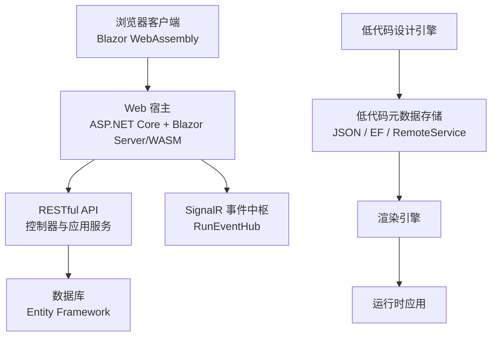
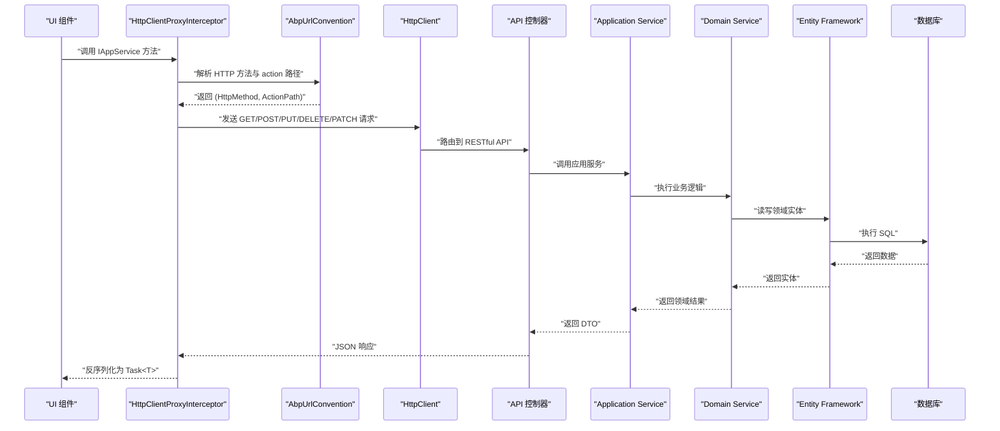
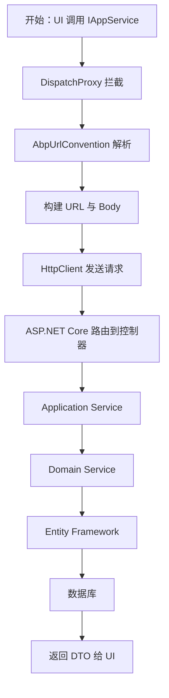
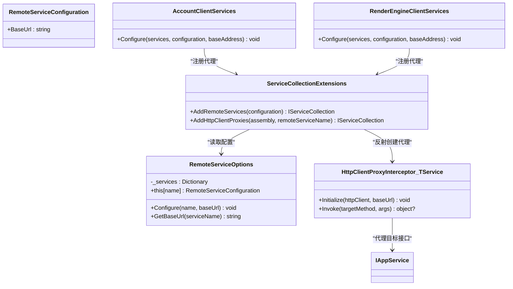
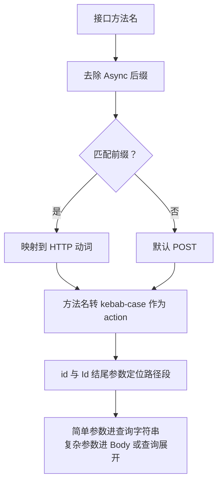
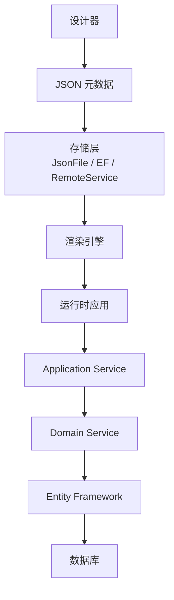
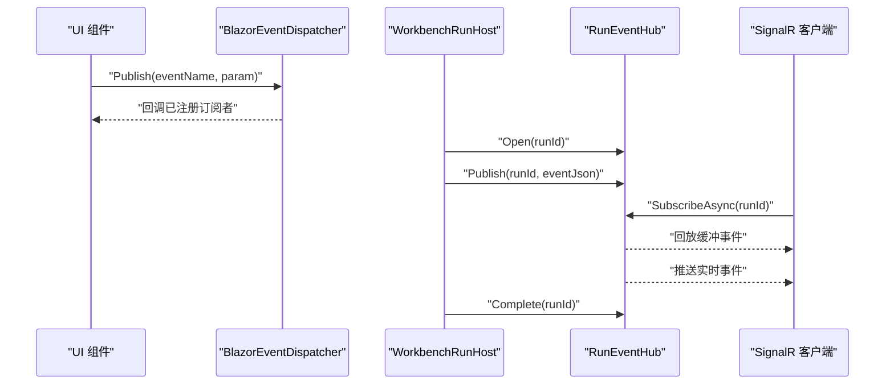
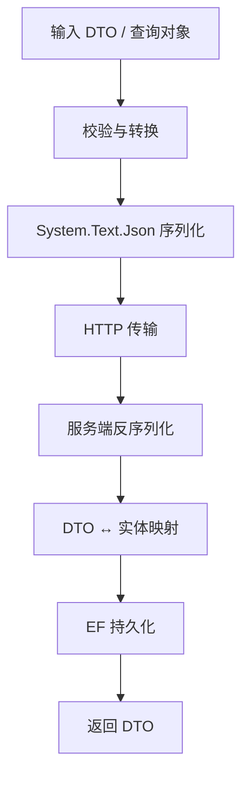
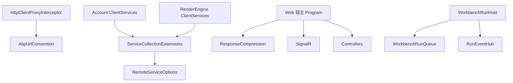

# 数据流设计

<cite>
**本文引用的文件**   
- [README.md](file://README.md)
- [HttpClientProxyInterceptor.cs](file://src/Utils/H.Abp.HttpClientProxy/HttpClientProxyInterceptor.cs)
- [AbpUrlConvention.cs](file://src/Utils/H.Abp.HttpClientProxy/AbpUrlConvention.cs)
- [ServiceCollectionExtensions.cs](file://src/Utils/H.Abp.HttpClientProxy/ServiceCollectionExtensions.cs)
- [RemoteServiceOptions.cs](file://src/Utils/H.Abp.HttpClientProxy/RemoteServiceOptions.cs)
- [IAppService.cs](file://src/Utils/H.Abp.Application.Contracts/IAppService.cs)
- [Program.cs（Web 宿主）](file://src/Host/H.AppLab.Web.Host/H.AppLab.Web.Host/Program.cs)
- [appsettings.json（Web 宿主）](file://src/Host/H.AppLab.Web.Host/H.AppLab.Web.Host/appsettings.json)
- [ClientServices.cs（Account 客户端）](file://src/Host/Account/H.Account.Host.Client/ClientServices.cs)
- [ClientServices.cs（RenderEngine 客户端）](file://src/Host/RenderEngine/H.LowCode.RenderEngine.Host.Client/ClientServices.cs)
- [BlazorEventDispatcher.cs](file://src/Utils/H.Util.Blazor/BlazorEventDispatcher.cs)
- [RunEventHub.cs](file://src/Agent/Workbench/H.Workbench.Application/Services/Execution/RunEventHub.cs)
- [WorkbenchRunHost.cs](file://src/Agent/Workbench/H.Workbench.Application/Workers/WorkbenchRunHost.cs)
</cite>

## 目录
1. [引言](#引言)
2. [项目结构](#项目结构)
3. [核心组件](#核心组件)
4. [架构总览](#架构总览)
5. [关键数据流详解](#关键数据流详解)
6. [低代码数据流：设计器到运行期](#低代码数据流设计器到运行期)
7. [实时通信机制](#实时通信机制)
8. [数据转换层](#数据转换层)
9. [缓存策略](#缓存策略)
10. [性能优化建议](#性能优化建议)
11. [依赖关系分析](#依赖关系分析)
12. [故障排查指南](#故障排查指南)
13. [结论](#结论)

## 引言
本文件面向 AppLab 平台的数据流设计，覆盖前端 UI 到后端数据库的完整请求链路、低代码元数据的“设计器 → 存储 → 渲染器 → 运行时应用”流程，以及基于 Blazor 与 SignalR 的实时事件分发。文档同时说明 DTO 映射、序列化、错误处理、缓存与性能优化实践，帮助开发者在统一数据契约下扩展业务服务或新增运行时应用。

## 项目结构
AppLab 采用模块化 .NET + Blazor 架构，支持单体部署与按服务独立部署。仓库中主要分层包括：
- Host：宿主程序，负责 Blazor Web App、SignalR、压缩、静态资源等基础设施注册。
- LowCode：低代码核心，包含元数据 Schema、设计引擎与渲染引擎。
- Services：按限界上下文划分的业务服务，每个服务遵循 Application.Contracts / Application / EntityFrameworkCore / Web 分层。
- Utils：共享工具库，包括 HTTP 动态代理、Blazor 事件分发、ID 生成、基础类型扩展等。
- Tools：各服务的数据库迁移控制台程序。

图表来源
- [Program.cs（Web 宿主）](file://src/Host/H.AppLab.Web.Host/H.AppLab.Web.Host/Program.cs)
- [README.md](file://README.md)

章节来源
- [README.md](file://README.md)

## 核心组件
- HttpClientProxyInterceptor：基于 DispatchProxy 的前端 HTTP 动态代理，拦截 IAppService 接口方法调用并转换为 HTTP 请求。
- AbpUrlConvention：将接口名与方法名转换为 ABP 风格 URL，确定 HTTP 动词、控制器名称与 action 路径。
- ServiceCollectionExtensions：扫描 IAppService 接口并批量注册 HTTP 客户端代理，从配置读取远程服务 BaseUrl。
- RemoteServiceOptions：集中管理远程服务 BaseUrl 配置。
- IAppService：标记接口，用于标识可通过 HTTP 代理远程调用的服务接口。
- Program（Web 宿主）：注册 Blazor、SignalR、JSON 序列化、响应压缩、路由、认证、授权、控制器、MCP 与 Razor 组件。
- BlazorEventDispatcher：进程内轻量级事件订阅/发布中心，供 Blazor 组件间解耦通信。
- RunEventHub：运行期事件中枢，提供有界缓冲、回放、订阅、完成清理等能力。
- WorkbenchRunHost：后台执行宿主，从队列取任务执行并通过 Hub 推送事件。

章节来源
- [HttpClientProxyInterceptor.cs](file://src/Utils/H.Abp.HttpClientProxy/HttpClientProxyInterceptor.cs)
- [AbpUrlConvention.cs](file://src/Utils/H.Abp.HttpClientProxy/AbpUrlConvention.cs)
- [ServiceCollectionExtensions.cs](file://src/Utils/H.Abp.HttpClientProxy/ServiceCollectionExtensions.cs)
- [RemoteServiceOptions.cs](file://src/Utils/H.Abp.HttpClientProxy/RemoteServiceOptions.cs)
- [IAppService.cs](file://src/Utils/H.Abp.Application.Contracts/IAppService.cs)
- [Program.cs（Web 宿主）](file://src/Host/H.AppLab.Web.Host/H.AppLab.Web.Host/Program.cs)
- [BlazorEventDispatcher.cs](file://src/Utils/H.Util.Blazor/BlazorEventDispatcher.cs)
- [RunEventHub.cs](file://src/Agent/Workbench/H.Workbench.Application/Services/Execution/RunEventHub.cs)
- [WorkbenchRunHost.cs](file://src/Agent/Workbench/H.Workbench.Application/Workers/WorkbenchRunHost.cs)

## 架构总览
AppLab 的请求链路由前端 UI 触发，通过 HttpClientProxyInterceptor 自动构造 HTTP 请求，由 ASP.NET Core 路由到控制器与 Application Service，再进入 Domain Service 与 Entity Framework 访问数据库。低代码数据流通过设计器编辑 JSON 元数据，存储于文件或远端服务，再由渲染引擎解析并生成可运行应用。实时通信由 SignalR 驱动，WorkbenchRunHost 执行任务并将事件推送到 RunEventHub，客户端通过 Hub 接收运行状态。

图表来源
- [HttpClientProxyInterceptor.cs](file://src/Utils/H.Abp.HttpClientProxy/HttpClientProxyInterceptor.cs)
- [AbpUrlConvention.cs](file://src/Utils/H.Abp.HttpClientProxy/AbpUrlConvention.cs)
- [Program.cs（Web 宿主）](file://src/Host/H.AppLab.Web.Host/H.AppLab.Web.Host/Program.cs)

## 关键数据流详解

### 前端到后端请求链
- UI 组件直接调用 IAppService 接口方法。
- HttpClientProxyInterceptor 使用 DispatchProxy 拦截方法调用。
- AbpUrlConvention 根据方法名前缀决定 HTTP 动词与 action 路径，并根据参数位置与命名规则构建 URL。
- 复杂类型作为 POST/PUT 请求体；简单类型或查询对象作为查询参数；名为 id 的参数放在路径前段，以 Id 结尾的参数放在 action 后段。
- HttpClient 发送请求，服务端通过 MapControllers 路由到控制器。
- 控制器调用 Application Service，进一步调用 Domain Service 与 Entity Framework。

图表来源
- [HttpClientProxyInterceptor.cs](file://src/Utils/H.Abp.HttpClientProxy/HttpClientProxyInterceptor.cs)
- [AbpUrlConvention.cs](file://src/Utils/H.Abp.HttpClientProxy/AbpUrlConvention.cs)
- [Program.cs（Web 宿主）](file://src/Host/H.AppLab.Web.Host/H.AppLab.Web.Host/Program.cs)

章节来源
- [HttpClientProxyInterceptor.cs](file://src/Utils/H.Abp.HttpClientProxy/HttpClientProxyInterceptor.cs)
- [AbpUrlConvention.cs](file://src/Utils/H.Abp.HttpClientProxy/AbpUrlConvention.cs)

### 服务代理注册与远程服务配置
- ServiceCollectionExtensions.AddRemoteServices 从 appsettings.json 的 RemoteServices 节点加载 BaseUrl。
- AddHttpClientProxies 扫描指定程序集中所有继承 IAppService 的接口，为每个接口注册 HttpClient 代理实现。
- Account 客户端与 RenderEngine 客户端分别通过 ClientServices.Configure 注入 CookieHandler，使 WASM 请求携带认证 Cookie。
- RemoteServiceOptions 提供按服务名获取 BaseUrl 的能力。

图表来源
- [ServiceCollectionExtensions.cs](file://src/Utils/H.Abp.HttpClientProxy/ServiceCollectionExtensions.cs)
- [RemoteServiceOptions.cs](file://src/Utils/H.Abp.HttpClientProxy/RemoteServiceOptions.cs)
- [ClientServices.cs（Account 客户端）](file://src/Host/Account/H.Account.Host.Client/ClientServices.cs)
- [ClientServices.cs（RenderEngine 客户端）](file://src/Host/RenderEngine/H.LowCode.RenderEngine.Host.Client/ClientServices.cs)
- [IAppService.cs](file://src/Utils/H.Abp.Application.Contracts/IAppService.cs)

章节来源
- [ServiceCollectionExtensions.cs](file://src/Utils/H.Abp.HttpClientProxy/ServiceCollectionExtensions.cs)
- [RemoteServiceOptions.cs](file://src/Utils/H.Abp.HttpClientProxy/RemoteServiceOptions.cs)
- [ClientServices.cs（Account 客户端）](file://src/Host/Account/H.Account.Host.Client/ClientServices.cs)
- [ClientServices.cs（RenderEngine 客户端）](file://src/Host/RenderEngine/H.LowCode.RenderEngine.Host.Client/ClientServices.cs)
- [IAppService.cs](file://src/Utils/H.Abp.Application.Contracts/IAppService.cs)

### URL 约定与参数映射规则
- 控制器名称：去除 I 前缀与 AppService/ApplicationService 后缀，转为 kebab-case。
- 方法名前缀映射：GetList/GetAll/Get → GET；Put/Update → PUT；Delete/Remove → DELETE；Create/Add/Insert/Post → POST；Patch → PATCH。
- 无匹配前缀时默认 POST，并以完整方法名作为 action。
- URL 路径参数：名为 id 的简单类型参数放 action 前；仅一个以 Id 结尾的简单类型参数放 action 后。
- 查询参数：简单类型参数放入查询字符串；GET/DELETE 的复杂类型参数展开属性为键值对。
- 请求体：POST/PUT 的第一个非简单类型参数作为 JSON 请求体。

图表来源
- [AbpUrlConvention.cs](file://src/Utils/H.Abp.HttpClientProxy/AbpUrlConvention.cs)
- [HttpClientProxyInterceptor.cs](file://src/Utils/H.Abp.HttpClientProxy/HttpClientProxyInterceptor.cs)

章节来源
- [AbpUrlConvention.cs](file://src/Utils/H.Abp.HttpClientProxy/AbpUrlConvention.cs)
- [HttpClientProxyInterceptor.cs](file://src/Utils/H.Abp.HttpClientProxy/HttpClientProxyInterceptor.cs)

## 低代码数据流：设计器到运行期
低代码数据流围绕“设计器产出 JSON 元数据 → 存储 → 渲染器解析 → 运行时应用”展开：
- 设计器（LowCode.DesignEngine）可视化编辑页面与组件，产出应用与部件的元数据（JSON）。
- 元数据存储支持 JsonFile、EntityFrameworkCore、RemoteService 多种实现。
- 渲染引擎（LowCode.RenderEngine）读取元数据，动态渲染出可运行的 Blazor 应用。
- 运行时应用通过 Application Service 与 Domain Service 访问业务数据，最终由 Entity Framework 持久化到数据库。

图表来源
- [README.md](file://README.md)

章节来源
- [README.md](file://README.md)

## 实时通信机制
实时通信分为两类：
- BlazorEventDispatcher：进程内轻量事件总线，适用于同一进程内的组件间解耦通信。它维护事件名到委托列表的字典，支持订阅、移除与发布。
- SignalR 与 RunEventHub：Workbench 的执行任务脱离 HTTP 请求，在后台执行宿主中串行消费 Channel 中的任务，并为每个运行创建事件通道；RunEventHub 提供有界缓冲、回放与订阅，确保浏览器断连重连后可继续看到历史事件与实时流。

图表来源
- [BlazorEventDispatcher.cs](file://src/Utils/H.Util.Blazor/BlazorEventDispatcher.cs)
- [RunEventHub.cs](file://src/Agent/Workbench/H.Workbench.Application/Services/Execution/RunEventHub.cs)
- [WorkbenchRunHost.cs](file://src/Agent/Workbench/H.Workbench.Application/Workers/WorkbenchRunHost.cs)
- [Program.cs（Web 宿主）](file://src/Host/H.AppLab.Web.Host/H.AppLab.Web.Host/Program.cs)

章节来源
- [BlazorEventDispatcher.cs](file://src/Utils/H.Util.Blazor/BlazorEventDispatcher.cs)
- [RunEventHub.cs](file://src/Agent/Workbench/H.Workbench.Application/Services/Execution/RunEventHub.cs)
- [WorkbenchRunHost.cs](file://src/Agent/Workbench/H.Workbench.Application/Workers/WorkbenchRunHost.cs)
- [Program.cs（Web 宿主）](file://src/Host/H.AppLab.Web.Host/H.AppLab.Web.Host/Program.cs)

## 数据转换层
- DTO 映射：业务服务通常定义 Application.Contracts 中的 DTO，Application Service 将 DTO 与 Domain 实体进行映射。仓库中存在大量 AppService 与 Entity 文件，体现这一分层模式。
- 序列化与反序列化：
  - 前端 HttpClientProxyInterceptor 使用 System.Text.Json，设置 camelCase 命名策略与大小写不敏感属性名。
  - Web 宿主启用 AddJsonOptions 并设置 PropertyNamingPolicy 为 camelCase，保证前后端一致。
- 错误处理：
  - HttpClientProxyInterceptor 在响应为非成功状态时抛出异常。
  - Web 宿主在非开发环境启用异常处理器与 HSTS，并统一状态码页。

图表来源
- [HttpClientProxyInterceptor.cs](file://src/Utils/H.Abp.HttpClientProxy/HttpClientProxyInterceptor.cs)
- [Program.cs（Web 宿主）](file://src/Host/H.AppLab.Web.Host/H.AppLab.Web.Host/Program.cs)

章节来源
- [HttpClientProxyInterceptor.cs](file://src/Utils/H.Abp.HttpClientProxy/HttpClientProxyInterceptor.cs)
- [Program.cs（Web 宿主）](file://src/Host/H.AppLab.Web.Host/H.AppLab.Web.Host/Program.cs)

## 缓存策略
当前仓库未显式集成 Redis 分布式缓存或 IMemoryCache 本地内存缓存。现有缓存相关能力主要体现在：
- 浏览器与静态资源缓存：MapStaticAssets 处理 Blazor 启动清单与指纹化程序集的缓存策略，避免手动设置为 immutable 导致更新后无法拉取新清单的问题。
- 运行事件缓冲：RunEventHub 使用有界内存缓冲保留最近 BufferLimit 条事件，并按完成时间与无人订阅条件定期回收。
- 配置与服务发现：RemoteServiceOptions 在进程内缓存远程服务 BaseUrl 字典。

若需引入 Redis 与 IMemoryCache，建议在以下层次接入：
- 热点数据与分页结果：在服务层封装缓存读取与写入逻辑，优先命中缓存，未命中则回源数据库并回填缓存。
- 跨实例共享：使用 Redis 缓存会话、令牌、限流计数、消息队列索引等。
- 失效策略：基于键前缀与版本号控制失效，配合背景任务清理过期缓存。

[本节为通用指导，不直接分析具体源码文件]

## 性能优化建议
- 请求合并：
  - 在 UI 层对高频小请求进行节流与合并，例如将多次表单字段验证合并为一次批量校验。
  - 在 HttpClientProxyInterceptor 外层增加请求去重与聚合中间件，避免重复请求。
- 响应压缩：
  - Web 宿主已启用 Brotli 与 Gzip 压缩，并覆盖 wasm/dll/octets 等 MIME 类型，显著减少 WASM 资源体积。
- 懒加载策略：
  - README 明确说明首页仅加载必要程序集，其余 Contracts、LowCode 库及第三方依赖在导航到对应路由时才按需下载。
  - 自研组合式 DI 支撑懒加载后的服务注册，LazyModuleRegistry 管理模块容器，CompositeServiceProvider 提供根容器到模块容器的回退解析。
- 连接池与超时：
  - 通过 IHttpClientFactory 管理 HttpClient 生命周期，合理设置超时与重试策略。
- 批处理与异步：
  - WorkbenchRunHost 使用 Channel 与后台任务串行消费，真正并发上限由执行内核限制，避免阻塞整体队列。

章节来源
- [Program.cs（Web 宿主）](file://src/Host/H.AppLab.Web.Host/H.AppLab.Web.Host/Program.cs)
- [README.md](file://README.md)
- [WorkbenchRunHost.cs](file://src/Agent/Workbench/H.Workbench.Application/Workers/WorkbenchRunHost.cs)

## 依赖关系分析
- 前端代理依赖：
  - HttpClientProxyInterceptor 依赖 AbpUrlConvention 解析 URL。
  - ServiceCollectionExtensions 依赖 RemoteServiceOptions 与 IConfiguration 加载配置。
- 客户端注册依赖：
  - Account 客户端与 RenderEngine 客户端通过 ClientServices.Configure 注入 CookieHandler 与动态代理。
- 宿主管线依赖：
  - Program 注册 Blazor、SignalR、JSON、压缩、路由、认证、授权、控制器、MCP 与 Razor 组件。
- 实时通信依赖：
  - WorkbenchRunHost 依赖 WorkbenchRunQueue 与 RunEventHub，将执行结果广播给客户端。

图表来源
- [HttpClientProxyInterceptor.cs](file://src/Utils/H.Abp.HttpClientProxy/HttpClientProxyInterceptor.cs)
- [AbpUrlConvention.cs](file://src/Utils/H.Abp.HttpClientProxy/AbpUrlConvention.cs)
- [ServiceCollectionExtensions.cs](file://src/Utils/H.Abp.HttpClientProxy/ServiceCollectionExtensions.cs)
- [RemoteServiceOptions.cs](file://src/Utils/H.Abp.HttpClientProxy/RemoteServiceOptions.cs)
- [ClientServices.cs（Account 客户端）](file://src/Host/Account/H.Account.Host.Client/ClientServices.cs)
- [ClientServices.cs（RenderEngine 客户端）](file://src/Host/RenderEngine/H.LowCode.RenderEngine.Host.Client/ClientServices.cs)
- [Program.cs（Web 宿主）](file://src/Host/H.AppLab.Web.Host/H.AppLab.Web.Host/Program.cs)
- [WorkbenchRunHost.cs](file://src/Agent/Workbench/H.Workbench.Application/Workers/WorkbenchRunHost.cs)
- [RunEventHub.cs](file://src/Agent/Workbench/H.Workbench.Application/Services/Execution/RunEventHub.cs)

章节来源
- [HttpClientProxyInterceptor.cs](file://src/Utils/H.Abp.HttpClientProxy/HttpClientProxyInterceptor.cs)
- [AbpUrlConvention.cs](file://src/Utils/H.Abp.HttpClientProxy/AbpUrlConvention.cs)
- [ServiceCollectionExtensions.cs](file://src/Utils/H.Abp.HttpClientProxy/ServiceCollectionExtensions.cs)
- [RemoteServiceOptions.cs](file://src/Utils/H.Abp.HttpClientProxy/RemoteServiceOptions.cs)
- [ClientServices.cs（Account 客户端）](file://src/Host/Account/H.Account.Host.Client/ClientServices.cs)
- [ClientServices.cs（RenderEngine 客户端）](file://src/Host/RenderEngine/H.LowCode.RenderEngine.Host.Client/ClientServices.cs)
- [Program.cs（Web 宿主）](file://src/Host/H.AppLab.Web.Host/H.AppLab.Web.Host/Program.cs)
- [WorkbenchRunHost.cs](file://src/Agent/Workbench/H.Workbench.Application/Workers/WorkbenchRunHost.cs)
- [RunEventHub.cs](file://src/Agent/Workbench/H.Workbench.Application/Services/Execution/RunEventHub.cs)

## 故障排查指南
- 前端代理抛出不支持的返回类型：
  - 检查 IAppService 方法的返回类型是否为 Task 或 Task<T>。
- URL 不匹配或路由错误：
  - 确认方法名前缀是否符合约定（Get/Create/Put/Delete/Patch）。
  - 检查 id 与 Id 结尾参数的命名与位置是否正确。
- 认证失败或 Cookie 丢失：
  - 确认客户端是否通过 CookieHandler 注册命名 HttpClient，并在 RemoteServices 中正确配置 BaseUrl。
- 响应过大或加载缓慢：
  - 确认服务端已启用 ResponseCompression，且静态资源通过 MapStaticAssets 处理。
- 实时事件丢失：
  - 检查 RunEventHub 的缓冲容量与保留时间，确认客户端重连后能回放历史事件。
  - 检查 WorkbenchRunHost 是否正确 Open/Complete 运行生命周期。

章节来源
- [HttpClientProxyInterceptor.cs](file://src/Utils/H.Abp.HttpClientProxy/HttpClientProxyInterceptor.cs)
- [AbpUrlConvention.cs](file://src/Utils/H.Abp.HttpClientProxy/AbpUrlConvention.cs)
- [ClientServices.cs（Account 客户端）](file://src/Host/Account/H.Account.Host.Client/ClientServices.cs)
- [ClientServices.cs（RenderEngine 客户端）](file://src/Host/RenderEngine/H.LowCode.RenderEngine.Host.Client/ClientServices.cs)
- [Program.cs（Web 宿主）](file://src/Host/H.AppLab.Web.Host/H.AppLab.Web.Host/Program.cs)
- [RunEventHub.cs](file://src/Agent/Workbench/H.Workbench.Application/Services/Execution/RunEventHub.cs)
- [WorkbenchRunHost.cs](file://src/Agent/Workbench/H.Workbench.Application/Workers/WorkbenchRunHost.cs)

## 结论
AppLab 的数据流以 IAppService 为统一契约，通过 HttpClientProxyInterceptor 与 AbpUrlConvention 实现前端到后端的自动化 HTTP 调用；低代码数据流通过设计器产出 JSON 元数据并由渲染引擎动态生成运行时应用；实时通信通过 SignalR 与 RunEventHub 提供可靠的运行期事件推送。当前体系在序列化、压缩与懒加载方面已有良好基础，后续可按需在服务层引入 Redis 与 IMemoryCache，进一步优化热点数据访问与跨实例共享能力。