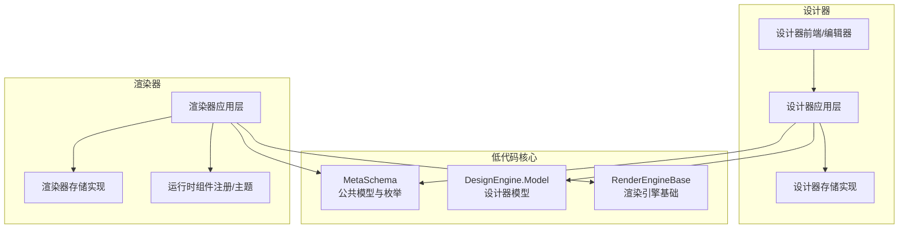
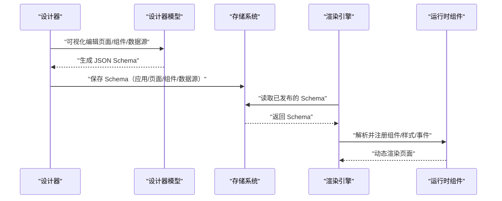
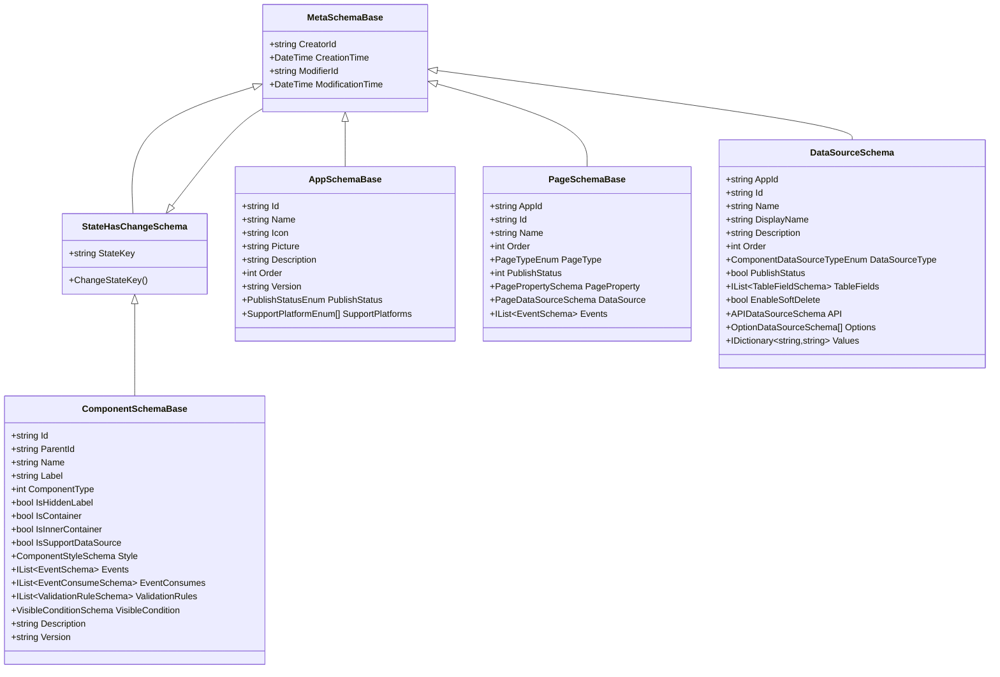
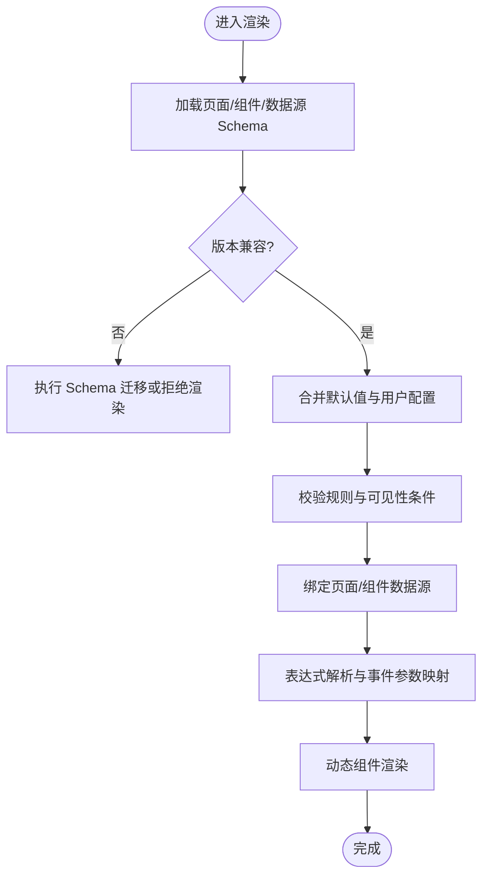
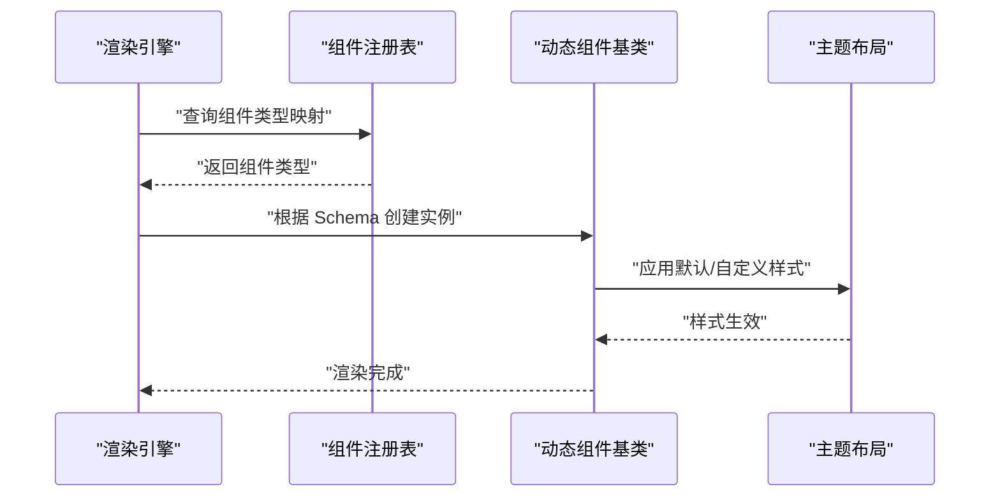
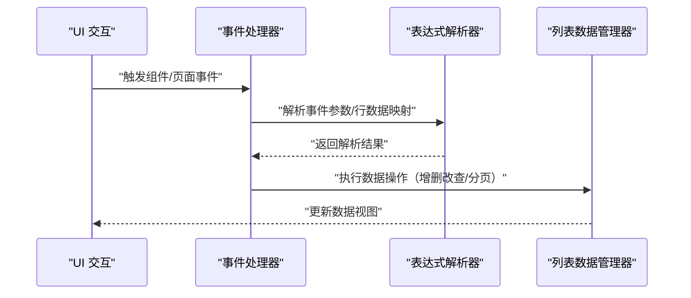
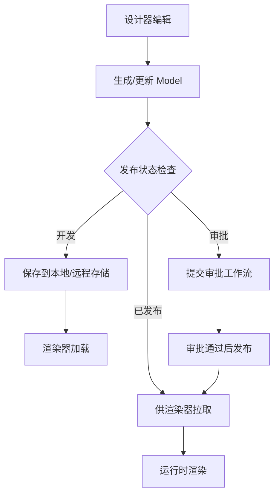
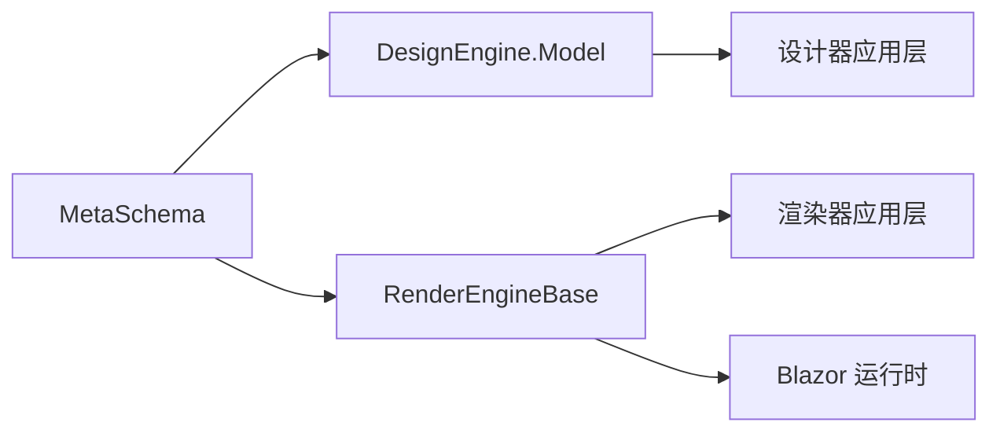

# 低代码数据流

<cite>
**本文引用的文件**   
- [MetaSchemaBase.cs](file://src/LowCode/Common/H.LowCode.MetaSchema/MetaSchemaBase.cs)
- [AppSchemaBase.cs](file://src/LowCode/Common/H.LowCode.MetaSchema/AppSchemaBase.cs)
- [PageSchemaBase.cs](file://src/LowCode/Common/H.LowCode.MetaSchema/PageSchemaBase.cs)
- [ComponentSchemaBase.cs](file://src/LowCode/Common/H.LowCode.MetaSchema/ComponentSchemaBase.cs)
- [StateHasChangeSchema.cs](file://src/LowCode/Common/H.LowCode.MetaSchema/StateHasChangeSchema.cs)
- [DataSourceSchema.cs](file://src/LowCode/Common/H.LowCode.MetaSchema/DataSourceSchema.cs)
- [PageDataSourceSchema.cs](file://src/LowCode/Common/H.LowCode.MetaSchema/DataSourceSchemas/PageDataSourceSchema.cs)
- [ComponentDataSourceSchema.cs](file://src/LowCode/Common/H.LowCode.MetaSchema/DataSourceSchemas/ComponentDataSourceSchema.cs)
- [APIDataSourceSchema.cs](file://src/LowCode/Common/H.LowCode.MetaSchema/DataSourceSchemas/APIDataSourceSchema.cs)
- [SQLDataSourceSchema.cs](file://src/LowCode/Common/H.LowCode.MetaSchema/DataSourceSchemas/SQLDataSourceSchema.cs)
- [ListDataSourceSchema.cs](file://src/LowCode/Common/H.LowCode.MetaSchema/DataSourceSchemas/ListDataSourceSchema.cs)
- [OptionDataSourceSchema.cs](file://src/LowCode/Common/H.LowCode.MetaSchema/DataSourceSchemas/OptionDataSourceSchema.cs)
- [TableFieldSchema.cs](file://src/LowCode/Common/H.LowCode.MetaSchema/DataSourceSchemas/TableFieldSchema.cs)
- [PagePropertySchema.cs](file://src/LowCode/Common/H.LowCode.MetaSchema/PropertySchemas/PagePropertySchema.cs)
- [ComponentStyleSchema.cs](file://src/LowCode/Common/H.LowCode.MetaSchema/PropertySchemas/ComponentStyleSchema.cs)
- [EventSchema.cs](file://src/LowCode/Common/H.LowCode.MetaSchema/PropertySchemas/EventSchema.cs)
- [ValidationRuleSchema.cs](file://src/LowCode/Common/H.LowCode.MetaSchema/PropertySchemas/ValidationRuleSchema.cs)
- [VisibleConditionSchema.cs](file://src/LowCode/Common/H.LowCode.MetaSchema/PropertySchemas/VisibleConditionSchema.cs)
- [MenuSchema.cs](file://src/LowCode/Common/H.LowCode.MetaSchema/MenuSchema.cs)
- [PublishStatusEnum.cs](file://src/LowCode/Common/H.LowCode.MetaSchema/Enums/PublishStatusEnum.cs)
- [PageTypeEnum.cs](file://src/LowCode/Common/H.LowCode.MetaSchema/Enums/PageTypeEnum.cs)
- [ComponentValueTypeEnum.cs](file://src/LowCode/Common/H.LowCode.MetaSchema/Enums/ComponentValueTypeEnum.cs)
- [ObjectMerger.cs](file://src/LowCode/Common/H.LowCode.MetaSchema/Utils/ObjectMerger.cs)
- [RenderEngineDynamicComponentBase.cs](file://src/src/LowCode/RenderEngine/H.LowCode.RenderEngineBase/RenderEngineDynamicComponentBase.cs)
- [PageComponentRegistry.cs](file://src/src/LowCode/RenderEngine/H.LowCode.RenderEngineBase/PageComponentRegistry.cs)
- [LowCodeExpressionResolver.cs](file://src/src/LowCode/RenderEngine/H.LowCode.RenderEngineBase/LowCodeExpressionResolver.cs)
- [ListDataOperationManager.cs](file://src/src/LowCode/RenderEngine/H.LowCode.RenderEngineBase/ListDataOperationManager.cs)
- [PageFormStateService.cs](file://src/src/LowCode/RenderEngine/H.LowCode.RenderEngineBase/PageFormStateService.cs)
- [RenderEngineBaseModule.cs](file://src/src/LowCode/RenderEngine/H.LowCode.RenderEngineBase/RenderEngineBaseModule.cs)
- [ThemePartLayoutBase.cs](file://src/src/LowCode/RenderEngine/H.LowCode.RenderEngineBase/Layout/ThemePartLayoutBase.cs)
- [H.LowCode.DesignEngine.Model.csproj](file://src/LowCode/DesignEngine/H.LowCode.DesignEngine.Model/H.LowCode.DesignEngine.Model.csproj)
- [PageListModel.cs](file://src/LowCode/DesignEngine/H.LowCode.DesignEngine.Model/Models/PageListModel.cs)
- [AppListModel.cs](file://src/LowCode/DesignEngine/H.LowCode.DesignEngine.Model/Models/AppListModel.cs)
- [DataSourceListModel.cs](file://src/LowCode/DesignEngine/H.LowCode.DesignEngine.Model/Models/DataSourceListModel.cs)
- [ComponentListModel.cs](file://src/LowCode/DesignEngine/H.LowCode.DesignEngine.Model/Models/ComponentListModel.cs)
</cite>

## 目录
1. [引言](#引言)
2. [项目结构](#项目结构)
3. [核心组件](#核心组件)
4. [架构总览](#架构总览)
5. [详细组件分析](#详细组件分析)
6. [依赖关系分析](#依赖关系分析)
7. [性能与缓存](#性能与缓存)
8. [故障排查指南](#故障排查指南)
9. [结论](#结论)

## 引言
本文面向低代码平台的数据流，围绕“页面元数据”的完整生命周期进行技术说明：从设计器中的可视化编辑、JSON Schema 生成、持久化到存储系统，再到渲染引擎的加载解析与动态组件渲染。重点解释 MetaSchema 的设计规范（组件元数据、页面布局、样式、交互行为），设计器与渲染器的数据契约（版本兼容与 Schema 校验），以及组件库数据流（内置组件注册、自定义组件加载、主题样式注入）。同时给出发布流程、部署机制、性能优化策略与缓存方案。

## 项目结构
本仓库采用分层模块化组织方式，低代码相关能力集中在以下区域：
- MetaSchema：跨端共享的 JSON Schema 模型与枚举，是设计器与渲染器的共同契约。
- DesignEngine.Model：设计器侧用于管理应用、页面、数据源、组件等聚合模型的 DTO。
- RenderEngineBase：渲染引擎基础能力，包含动态组件渲染、表达式解析、事件回调、列表数据操作、页面状态服务与主题布局基类。
- 其他服务与应用层：如 Account、Order、Setting 等业务服务与本主题无直接耦合。

图表来源
- [H.LowCode.DesignEngine.Model.csproj:1-20](file://src/LowCode/DesignEngine/H.LowCode.DesignEngine.Model/H.LowCode.DesignEngine.Model.csproj#L1-L20)
- [RenderEngineBaseModule.cs:1-40](file://src/src/LowCode/RenderEngine/H.LowCode.RenderEngineBase/RenderEngineBaseModule.cs#L1-L40)

章节来源
- [H.LowCode.DesignEngine.Model.csproj:1-20](file://src/LowCode/DesignEngine/H.LowCode.DesignEngine.Model/H.LowCode.DesignEngine.Model.csproj#L1-L20)

## 核心组件
- MetaSchemaBase：所有元数据的统一基类，提供创建者、修改者、时间戳等审计字段，并继承 StateHasChangeSchema 以支持运行时状态键变更。
- AppSchemaBase：应用级元数据，包含应用标识、名称、图标、描述、排序、版本、发布状态与支持平台数组。
- PageSchemaBase：页面级元数据，包含应用归属、页面标识、名称、排序、页面类型、发布状态、页面属性、页面数据源、页面级事件集合。
- ComponentSchemaBase：组件实例元数据，包含组件实例标识、父容器、显示名、组件类型、容器标记、是否支持数据源、样式、事件、事件消费、校验规则、可见性条件、描述与版本号。
- DataSourceSchema：数据源元数据，区分表结构、API、选项等数据源类型，并提供软删除、字段定义、API/选项/SQL 配置。
- PageDataSourceSchema / ComponentDataSourceSchemaBase：分别定义页面级与组件级数据源绑定信息；组件数据源还支持固定选项、API 选项、SQL 选项、动态表达式与列表循环数据源。
- PropertySchemas：页面属性（布局列数、标题宽度、默认/自定义样式）、组件样式（宽高、标签宽、默认/自定义样式）、事件、校验规则、可见性条件。
- MenuSchema：菜单树结构，支持父子层级、路径与排序。
- Enums：发布状态、页面类型、组件值类型、数据源分组与目标类型等枚举。
- ObjectMerger：对象合并工具，常用于运行期默认值与用户配置的合并。

章节来源
- [MetaSchemaBase.cs:1-18](file://src/LowCode/Common/H.LowCode.MetaSchema/MetaSchemaBase.cs#L1-L18)
- [AppSchemaBase.cs:1-31](file://src/LowCode/Common/H.LowCode.MetaSchema/AppSchemaBase.cs#L1-L31)
- [PageSchemaBase.cs:1-40](file://src/LowCode/Common/H.LowCode.MetaSchema/PageSchemaBase.cs#L1-L40)
- [ComponentSchemaBase.cs:1-110](file://src/LowCode/Common/H.LowCode.MetaSchema/ComponentSchemaBase.cs#L1-L110)
- [DataSourceSchema.cs:1-69](file://src/LowCode/Common/H.LowCode.MetaSchema/DataSourceSchema.cs#L1-L69)
- [PageDataSourceSchema.cs:1-18](file://src/LowCode/Common/H.LowCode.MetaSchema/DataSourceSchemas/PageDataSourceSchema.cs#L1-L18)
- [ComponentDataSourceSchema.cs:1-58](file://src/LowCode/Common/H.LowCode.MetaSchema/DataSourceSchemas/ComponentDataSourceSchema.cs#L1-L58)
- [PagePropertySchema.cs:1-36](file://src/LowCode/Common/H.LowCode.MetaSchema/PropertySchemas/PagePropertySchema.cs#L1-L36)
- [ComponentStyleSchema.cs:1-38](file://src/LowCode/Common/H.LowCode.MetaSchema/PropertySchemas/ComponentStyleSchema.cs#L1-L38)
- [EventSchema.cs:1-66](file://src/LowCode/Common/H.LowCode.MetaSchema/PropertySchemas/EventSchema.cs#L1-L66)
- [ValidationRuleSchema.cs:1-172](file://src/LowCode/Common/H.LowCode.MetaSchema/PropertySchemas/ValidationRuleSchema.cs#L1-L172)
- [VisibleConditionSchema.cs:1-49](file://src/LowCode/Common/H.LowCode.MetaSchema/PropertySchemas/VisibleConditionSchema.cs#L1-L49)
- [MenuSchema.cs:1-37](file://src/LowCode/Common/H.LowCode.MetaSchema/MenuSchema.cs#L1-L37)
- [PublishStatusEnum.cs:1-8](file://src/LowCode/Common/H.LowCode.MetaSchema/Enums/PublishStatusEnum.cs#L1-L8)
- [PageTypeEnum.cs:1-15](file://src/LowCode/Common/H.LowCode.MetaSchema/Enums/PageTypeEnum.cs#L1-L15)
- [ComponentValueTypeEnum.cs:1-20](file://src/LowCode/Common/H.LowCode.MetaSchema/Enums/ComponentValueTypeEnum.cs#L1-L20)
- [ObjectMerger.cs:1-200](file://src/LowCode/Common/H.LowCode.MetaSchema/Utils/ObjectMerger.cs#L1-L200)

## 架构总览
低代码数据流贯穿“设计器 → 存储 → 渲染器 → 运行时”。

图表来源
- [PageSchemaBase.cs:1-40](file://src/LowCode/Common/H.LowCode.MetaSchema/PageSchemaBase.cs#L1-L40)
- [ComponentSchemaBase.cs:1-110](file://src/LowCode/Common/H.LowCode.MetaSchema/ComponentSchemaBase.cs#L1-L110)
- [PageComponentRegistry.cs:1-200](file://src/src/LowCode/RenderEngine/H.LowCode.RenderEngineBase/PageComponentRegistry.cs#L1-L200)
- [RenderEngineDynamicComponentBase.cs:1-200](file://src/src/LowCode/RenderEngine/H.LowCode.RenderEngineBase/RenderEngineDynamicComponentBase.cs#L1-L200)

## 详细组件分析

### MetaSchema 设计规范
- 通用审计字段：CreatorId、CreationTime、ModifierId、ModificationTime，来自 MetaSchemaBase。
- 应用元数据：AppSchemaBase 提供 Id、Name、Icon、Picture、Description、Order、Version、PublishStatus、SupportPlatforms。
- 页面元数据：PageSchemaBase 提供 AppId、Id、Name、Order、PageType、PublishStatus、PageProperty、DataSource、Events。
- 组件元数据：ComponentSchemaBase 提供 Id、ParentId、Name、Label、ComponentType、IsHiddenLabel、IsContainer、IsInnerContainer、IsSupportDataSource、Style、Events、EventConsumes、ValidationRules、VisibleCondition、Description、Version。
- 页面属性：PagePropertySchema 定义 PageLayout（1-4 列）、TitleWidth、DefaultStyle、CustomStyle、DataSource。
- 组件样式：ComponentStyleSchema 定义 ItemWidth、ItemHeight、LabelWidth、DefaultStyle、CustomStyle。
- 事件体系：EventSchema 支持标准事件（目标 ID/动作）、自定义脚本（语言/内容）、数据操作事件（类型）与参数映射（行数据参数）。
- 校验规则：ValidationRuleSchema 支持必填、长度、数值范围、正则、邮箱/手机/URL/身份证、自定义表达式，触发时机包括失焦、改变、提交。
- 可见性条件：VisibleConditionSchema 支持值表达式、比较操作符与期望值表达式，用于显隐联动。
- 数据源：
  - 页面数据源：PageDataSourceSchema 指定 DataSourceType、DataSourceId/Name/Value。
  - 组件数据源：ComponentDataSourceSchemaBase 支持固定选项、API 选项、SQL 选项、动态表达式与 ListDataSource。
  - 数据源实体：DataSourceSchema 区分 Table/API/Option，并提供 TableFields、EnableSoftDelete、Options/Values 等。
- 菜单：MenuSchema 支持父子层级、路径、图标、排序与类型（菜单/目录）。

图表来源
- [MetaSchemaBase.cs:1-18](file://src/LowCode/Common/H.LowCode.MetaSchema/MetaSchemaBase.cs#L1-L18)
- [AppSchemaBase.cs:1-31](file://src/LowCode/Common/H.LowCode.MetaSchema/AppSchemaBase.cs#L1-L31)
- [PageSchemaBase.cs:1-40](file://src/LowCode/Common/H.LowCode.MetaSchema/PageSchemaBase.cs#L1-L40)
- [ComponentSchemaBase.cs:1-110](file://src/LowCode/Common/H.LowCode.MetaSchema/ComponentSchemaBase.cs#L1-L110)
- [DataSourceSchema.cs:1-69](file://src/LowCode/Common/H.LowCode.MetaSchema/DataSourceSchema.cs#L1-L69)

章节来源
- [MetaSchemaBase.cs:1-18](file://src/LowCode/Common/H.LowCode.MetaSchema/MetaSchemaBase.cs#L1-L18)
- [AppSchemaBase.cs:1-31](file://src/LowCode/Common/H.LowCode.MetaSchema/AppSchemaBase.cs#L1-L31)
- [PageSchemaBase.cs:1-40](file://src/LowCode/Common/H.LowCode.MetaSchema/PageSchemaBase.cs#L1-L40)
- [ComponentSchemaBase.cs:1-110](file://src/LowCode/Common/H.LowCode.MetaSchema/ComponentSchemaBase.cs#L1-L110)
- [DataSourceSchema.cs:1-69](file://src/LowCode/Common/H.LowCode.MetaSchema/DataSourceSchema.cs#L1-L69)

### 设计器到渲染器的数据契约
- 版本兼容：
  - 应用与组件均携带 Version 字段，渲染时可据此做兼容性判断或迁移。
  - PageSchemaBase 中通过 PublishStatus 与 PageTypeEnum 控制页面展示形态与发布阶段。
- Schema 校验：
  - 使用 ValidationRuleSchema 对表单类组件进行输入校验，支持多种内置规则与自定义表达式。
  - VisibleConditionSchema 在渲染时求值决定是否渲染组件，保证显隐联动逻辑正确。
- 数据绑定：
  - 页面级通过 PageDataSourceSchema 绑定数据源；组件级通过 ComponentDataSourceSchemaBase 绑定固定/API/SQL 选项与列表循环数据源。
  - DataSourceSchema 提供 Table/API/Option 三类数据源结构，供设计器与渲染器一致理解。

图表来源
- [ComponentSchemaBase.cs:1-110](file://src/LowCode/Common/H.LowCode.MetaSchema/ComponentSchemaBase.cs#L1-L110)
- [PageSchemaBase.cs:1-40](file://src/LowCode/Common/H.LowCode.MetaSchema/PageSchemaBase.cs#L1-L40)
- [PageDataSourceSchema.cs:1-18](file://src/LowCode/Common/H.LowCode.MetaSchema/DataSourceSchemas/PageDataSourceSchema.cs#L1-L18)
- [ComponentDataSourceSchema.cs:1-58](file://src/LowCode/Common/H.LowCode.MetaSchema/DataSourceSchemas/ComponentDataSourceSchema.cs#L1-L58)
- [ValidationRuleSchema.cs:1-172](file://src/LowCode/Common/H.LowCode.MetaSchema/PropertySchemas/ValidationRuleSchema.cs#L1-L172)
- [VisibleConditionSchema.cs:1-49](file://src/LowCode/Common/H.LowCode.MetaSchema/PropertySchemas/VisibleConditionSchema.cs#L1-L49)

章节来源
- [ComponentSchemaBase.cs:1-110](file://src/LowCode/Common/H.LowCode.MetaSchema/ComponentSchemaBase.cs#L1-L110)
- [PageSchemaBase.cs:1-40](file://src/LowCode/Common/H.LowCode.MetaSchema/PageSchemaBase.cs#L1-L40)
- [PageDataSourceSchema.cs:1-18](file://src/LowCode/Common/H.LowCode.MetaSchema/DataSourceSchemas/PageDataSourceSchema.cs#L1-L18)
- [ComponentDataSourceSchema.cs:1-58](file://src/LowCode/Common/H.LowCode.MetaSchema/DataSourceSchemas/ComponentDataSourceSchema.cs#L1-L58)
- [ValidationRuleSchema.cs:1-172](file://src/LowCode/Common/H.LowCode.MetaSchema/PropertySchemas/ValidationRuleSchema.cs#L1-L172)
- [VisibleConditionSchema.cs:1-49](file://src/LowCode/Common/H.LowCode.MetaSchema/PropertySchemas/VisibleConditionSchema.cs#L1-L49)

### 组件库数据流
- 内置组件注册：
  - 渲染引擎通过 PageComponentRegistry 维护组件类型到具体 Blazor 组件的映射，支持按页面/全局注册。
- 自定义组件加载：
  - 通过 RenderEngineDynamicComponentBase 根据 Schema 的组件类型动态实例化组件，支持容器与原子组件。
- 主题样式注入：
  - ThemePartLayoutBase 作为主题布局基类，承载默认样式与自定义样式的合并策略，结合 ComponentStyleSchema 与 PagePropertySchema 生效。

图表来源
- [PageComponentRegistry.cs:1-200](file://src/src/LowCode/RenderEngine/H.LowCode.RenderEngineBase/PageComponentRegistry.cs#L1-L200)
- [RenderEngineDynamicComponentBase.cs:1-200](file://src/src/LowCode/RenderEngine/H.LowCode.RenderEngineBase/RenderEngineDynamicComponentBase.cs#L1-L200)
- [ThemePartLayoutBase.cs:1-200](file://src/src/LowCode/RenderEngine/H.LowCode.RenderEngineBase/Layout/ThemePartLayoutBase.cs#L1-L200)

章节来源
- [PageComponentRegistry.cs:1-200](file://src/src/LowCode/RenderEngine/H.LowCode.RenderEngineBase/PageComponentRegistry.cs#L1-L200)
- [RenderEngineDynamicComponentBase.cs:1-200](file://src/src/LowCode/RenderEngine/H.LowCode.RenderEngineBase/RenderEngineDynamicComponentBase.cs#L1-L200)
- [ThemePartLayoutBase.cs:1-200](file://src/src/LowCode/RenderEngine/H.LowCode.RenderEngineBase/Layout/ThemePartLayoutBase.cs#L1-L200)

### 事件与表达式处理
- 事件路由：EventSchema 支持标准事件目标（页面/组件 ID + 动作）、自定义脚本、数据操作事件与参数映射（RowDataParams）。
- 表达式解析：LowCodeExpressionResolver 负责解析页面/组件表达式，如 $(item.f_x)、$(form.key)、$query(x)，用于可见性条件与数据绑定。
- 列表数据操作：ListDataOperationManager 统一管理分页、筛选、排序等操作，配合组件数据源中的 ListDataSource 与 DataSourceSchema。

图表来源
- [EventSchema.cs:1-66](file://src/LowCode/Common/H.LowCode.MetaSchema/PropertySchemas/EventSchema.cs#L1-L66)
- [LowCodeExpressionResolver.cs:1-200](file://src/src/LowCode/RenderEngine/H.LowCode.RenderEngineBase/LowCodeExpressionResolver.cs#L1-L200)
- [ListDataOperationManager.cs:1-200](file://src/src/LowCode/RenderEngine/H.LowCode.RenderEngineBase/ListDataOperationManager.cs#L1-L200)

章节来源
- [EventSchema.cs:1-66](file://src/LowCode/Common/H.LowCode.MetaSchema/PropertySchemas/EventSchema.cs#L1-L66)
- [LowCodeExpressionResolver.cs:1-200](file://src/src/LowCode/RenderEngine/H.LowCode.RenderEngineBase/LowCodeExpressionResolver.cs#L1-L200)
- [ListDataOperationManager.cs:1-200](file://src/src/LowCode/RenderEngine/H.LowCode.RenderEngineBase/ListDataOperationManager.cs#L1-L200)

### 设计器模型与持久化
- 设计器模型：
  - PageListModel、AppListModel、DataSourceListModel、ComponentListModel 封装设计器侧的页面、应用、数据源、组件聚合体。
- 存储实现：
  - 设计器与渲染器均提供 JsonFile 与 RemoteService 两种存储实现，便于本地开发与远程部署。
- 发布流程：
  - 应用/页面/组件/数据源具备 PublishStatus 或 PublishStatusEnum，支持 Development/Approving/Published 状态流转。

图表来源
- [PageListModel.cs:1-200](file://src/LowCode/DesignEngine/H.LowCode.DesignEngine.Model/Models/PageListModel.cs#L1-L200)
- [AppListModel.cs:1-200](file://src/LowCode/DesignEngine/H.LowCode.DesignEngine.Model/Models/AppListModel.cs#L1-L200)
- [DataSourceListModel.cs:1-200](file://src/LowCode/DesignEngine/H.LowCode.DesignEngine.Model/Models/DataSourceListModel.cs#L1-L200)
- [ComponentListModel.cs:1-200](file://src/LowCode/DesignEngine/H.LowCode.DesignEngine.Model/Models/ComponentListModel.cs#L1-L200)
- [PublishStatusEnum.cs:1-8](file://src/LowCode/Common/H.LowCode.MetaSchema/Enums/PublishStatusEnum.cs#L1-L8)

章节来源
- [PageListModel.cs:1-200](file://src/LowCode/DesignEngine/H.LowCode.DesignEngine.Model/Models/PageListModel.cs#L1-L200)
- [AppListModel.cs:1-200](file://src/LowCode/DesignEngine/H.LowCode.DesignEngine.Model/Models/AppListModel.cs#L1-L200)
- [DataSourceListModel.cs:1-200](file://src/LowCode/DesignEngine/H.LowCode.DesignEngine.Model/Models/DataSourceListModel.cs#L1-L200)
- [ComponentListModel.cs:1-200](file://src/LowCode/DesignEngine/H.LowCode.DesignEngine.Model/Models/ComponentListModel.cs#L1-L200)
- [PublishStatusEnum.cs:1-8](file://src/LowCode/Common/H.LowCode.MetaSchema/Enums/PublishStatusEnum.cs#L1-L8)

## 依赖关系分析
- MetaSchema 被设计器与渲染器共同依赖，是稳定契约层。
- DesignEngine.Model 依赖 MetaSchema，用于封装设计器业务对象。
- RenderEngineBase 依赖 MetaSchema 与 Blazor 运行时组件体系，提供动态渲染、事件、表达式与列表操作能力。
- 模块装配：RenderEngineBaseModule 负责注册渲染引擎相关服务。

图表来源
- [H.LowCode.DesignEngine.Model.csproj:1-20](file://src/LowCode/DesignEngine/H.LowCode.DesignEngine.Model/H.LowCode.DesignEngine.Model.csproj#L1-L20)
- [RenderEngineBaseModule.cs:1-40](file://src/src/LowCode/RenderEngine/H.LowCode.RenderEngineBase/RenderEngineBaseModule.cs#L1-L40)

章节来源
- [H.LowCode.DesignEngine.Model.csproj:1-20](file://src/LowCode/DesignEngine/H.LowCode.DesignEngine.Model/H.LowCode.DesignEngine.Model.csproj#L1-L20)
- [RenderEngineBaseModule.cs:1-40](file://src/src/LowCode/RenderEngine/H.LowCode.RenderEngineBase/RenderEngineBaseModule.cs#L1-L40)

## 性能与缓存
- 默认值与配置合并：
  - 使用 ObjectMerger 在运行期合并默认样式、页面属性与用户自定义配置，减少重复计算。
- 状态键管理：
  - StateHasChangeSchema 提供 StateKey 与 ChangeStateKey，避免不必要的重渲染。
- 表达式与数据源：
  - LowCodeExpressionResolver 集中解析表达式，降低分散解析开销。
  - ListDataOperationManager 统一管理列表操作，支持分页与筛选，提升大数据量下的渲染性能。
- 组件注册与主题：
  - PageComponentRegistry 缓存组件类型映射，避免重复反射与查找。
  - ThemePartLayoutBase 将主题样式集中管理，减少样式计算成本。

章节来源
- [ObjectMerger.cs:1-200](file://src/LowCode/Common/H.LowCode.MetaSchema/Utils/ObjectMerger.cs#L1-L200)
- [StateHasChangeSchema.cs:1-15](file://src/LowCode/Common/H.LowCode.MetaSchema/StateHasChangeSchema.cs#L1-L15)
- [LowCodeExpressionResolver.cs:1-200](file://src/src/LowCode/RenderEngine/H.LowCode.RenderEngineBase/LowCodeExpressionResolver.cs#L1-L200)
- [ListDataOperationManager.cs:1-200](file://src/src/LowCode/RenderEngine/H.LowCode.RenderEngineBase/ListDataOperationManager.cs#L1-L200)
- [PageComponentRegistry.cs:1-200](file://src/src/LowCode/RenderEngine/H.LowCode.RenderEngineBase/PageComponentRegistry.cs#L1-L200)
- [ThemePartLayoutBase.cs:1-200](file://src/src/LowCode/RenderEngine/H.LowCode.RenderEngineBase/Layout/ThemePartLayoutBase.cs#L1-L200)

## 故障排查指南
- 渲染失败或空白页：
  - 检查组件类型是否在 PageComponentRegistry 中注册。
  - 确认 ComponentSchemaBase 的 ComponentType 与运行时组件映射一致。
- 样式未生效：
  - 核对 ComponentStyleSchema 与 PagePropertySchema 的 DefaultStyle/CustomStyle 是否正确合并。
  - 查看 ThemePartLayoutBase 的主题注入逻辑。
- 事件不触发或参数错误：
  - 校验 EventSchema 的 EventTargetId/EventTargetAction 与目标组件/页面是否存在。
  - 检查 RowDataParams 映射是否与行数据结构匹配。
- 校验规则无效：
  - 确认 ValidationRuleSchema 的 RuleType、Trigger 与组件字段类型一致。
  - 检查 VisibleConditionSchema 的条件表达式是否能正确求值。
- 数据源绑定异常：
  - 检查 DataSourceSchema 的 DataSourceType 与实际数据源类型是否匹配。
  - 对于组件数据源，确认 ComponentDataSourceSchemaBase 的 DataSourceId/Name/Value 或选项配置正确。

章节来源
- [PageComponentRegistry.cs:1-200](file://src/src/LowCode/RenderEngine/H.LowCode.RenderEngineBase/PageComponentRegistry.cs#L1-L200)
- [ThemePartLayoutBase.cs:1-200](file://src/src/LowCode/RenderEngine/H.LowCode.RenderEngineBase/Layout/ThemePartLayoutBase.cs#L1-L200)
- [EventSchema.cs:1-66](file://src/LowCode/Common/H.LowCode.MetaSchema/PropertySchemas/EventSchema.cs#L1-L66)
- [ValidationRuleSchema.cs:1-172](file://src/LowCode/Common/H.LowCode.MetaSchema/PropertySchemas/ValidationRuleSchema.cs#L1-L172)
- [VisibleConditionSchema.cs:1-49](file://src/LowCode/Common/H.LowCode.MetaSchema/PropertySchemas/VisibleConditionSchema.cs#L1-L49)
- [DataSourceSchema.cs:1-69](file://src/LowCode/Common/H.LowCode.MetaSchema/DataSourceSchema.cs#L1-L69)
- [ComponentDataSourceSchema.cs:1-58](file://src/LowCode/Common/H.LowCode.MetaSchema/DataSourceSchemas/ComponentDataSourceSchema.cs#L1-L58)

## 结论
MetaSchema 为低代码平台提供了稳定、可扩展的元数据契约，覆盖应用、页面、组件、数据源、样式、事件与校验规则等关键维度。设计器通过可视化编辑生成 Schema，持久化后由渲染引擎加载并动态渲染。借助组件注册表、表达式解析器与列表数据管理器，平台实现了从设计到运行的闭环。版本兼容、Schema 校验与主题样式注入进一步提升了系统的健壮性与可定制性。建议在扩展组件与数据源时严格遵循 MetaSchema 规范，并结合 ObjectMerger 与状态管理机制优化性能。