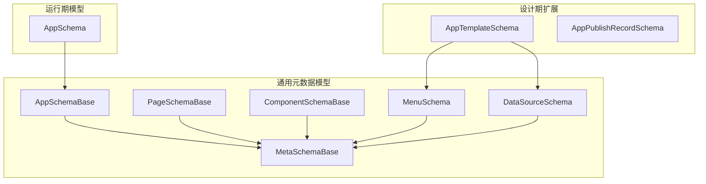
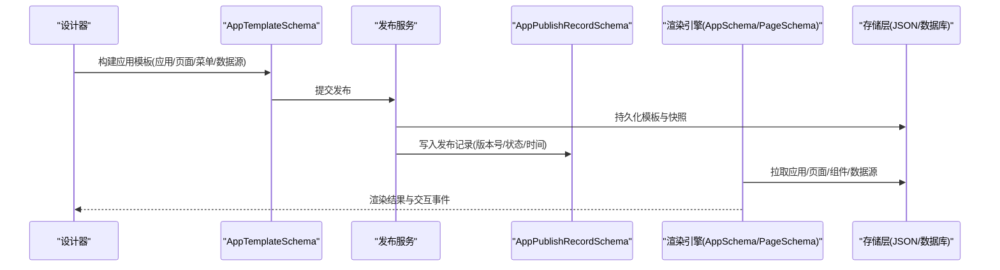
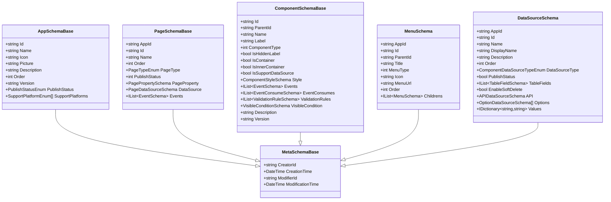
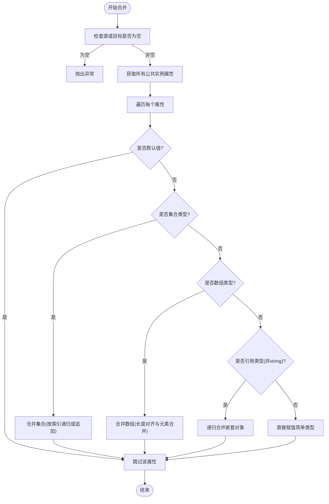
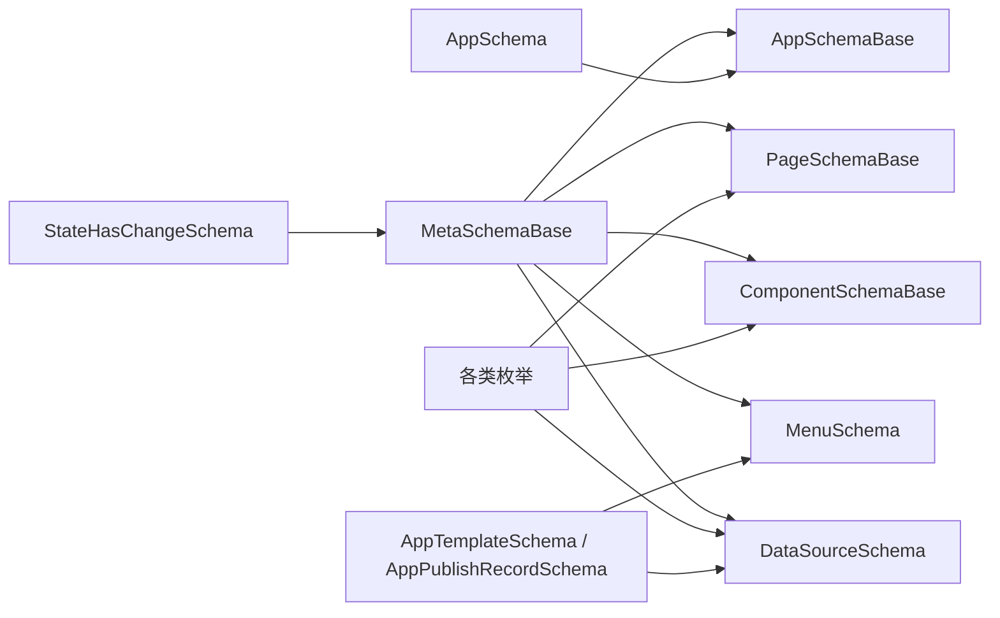

# 元数据存储

<cite>
**本文引用的文件**   
- [AppSchemaBase.cs](file://src/LowCode/Common/H.LowCode.MetaSchema/AppSchemaBase.cs)
- [PageSchemaBase.cs](file://src/LowCode/Common/H.LowCode.MetaSchema/PageSchemaBase.cs)
- [ComponentSchemaBase.cs](file://src/LowCode/Common/H.LowCode.MetaSchema/ComponentSchemaBase.cs)
- [MetaSchemaBase.cs](file://src/LowCode/Common/H.LowCode.MetaSchema/MetaSchemaBase.cs)
- [MenuSchema.cs](file://src/LowCode/Common/H.LowCode.MetaSchema/MenuSchema.cs)
- [DataSourceSchema.cs](file://src/LowCode/Common/H.LowCode.MetaSchema/DataSourceSchema.cs)
- [PagePropertySchema.cs](file://src/LowCode/Common/H.LowCode.MetaSchema/PropertySchemas/PagePropertySchema.cs)
- [PageDataSourceSchema.cs](file://src/LowCode/Common/H.LowCode.MetaSchema/DataSourceSchemas/PageDataSourceSchema.cs)
- [TableFieldSchema.cs](file://src/LowCode/Common/H.LowCode.MetaSchema/DataSourceSchemas/TableFieldSchema.cs)
- [APIDataSourceSchema.cs](file://src/LowCode/Common/H.LowCode.MetaSchema/DataSourceSchemas/APIDataSourceSchema.cs)
- [OptionDataSourceSchema.cs](file://src/LowCode/Common/H.LowCode.MetaSchema/DataSourceSchemas/OptionDataSourceSchema.cs)
- [SQLDataSourceSchema.cs](file://src/LowCode/Common/H.LowCode.MetaSchema/DataSourceSchemas/SQLDataSourceSchema.cs)
- [ValidationRuleSchema.cs](file://src/LowCode/Common/H.LowCode.MetaSchema/PropertySchemas/ValidationRuleSchema.cs)
- [VisibleConditionSchema.cs](file://src/LowCode/Common/H.LowCode.MetaSchema/PropertySchemas/VisibleConditionSchema.cs)
- [EventSchema.cs](file://src/LowCode/Common/H.LowCode.MetaSchema/PropertySchemas/EventSchema.cs)
- [StateHasChangeSchema.cs](file://src/LowCode/Common/H.LowCode.MetaSchema/StateHasChangeSchema.cs)
- [ObjectMerger.cs](file://src/LowCode/Common/H.LowCode.MetaSchema/Utils/ObjectMerger.cs)
- [TablePropertySchema.cs](file://src/LowCode/Common/H.LowCode.MetaSchema/PropertySchemas/TableSchemas/TablePropertySchema.cs)
- [TableColumnSchema.cs](file://src/LowCode/Common/H.LowCode.MetaSchema/PropertySchemas/TableSchemas/TableColumnSchema.cs)
- [TableButtonSchema.cs](file://src/LowCode/Common/H.LowCode.MetaSchema/PropertySchemas/TableSchemas/TableButtonSchema.cs)
- [AppPublishRecordSchema.cs](file://src/LowCode/Common/H.LowCode.MetaSchema.DesignEngine/AppPublishRecordSchema.cs)
- [AppTemplateSchema.cs](file://src/LowCode/Common/H.LowCode.MetaSchema.DesignEngine/AppTemplateSchema.cs)
- [AppSchema.cs](file://src/LowCode/Common/H.LowCode.MetaSchema.RenderEngine/AppSchema.cs)
</cite>

## 目录
1. [引言](#引言)
2. [项目结构](#项目结构)
3. [核心组件](#核心组件)
4. [架构总览](#架构总览)
5. [详细组件分析](#详细组件分析)
6. [依赖关系分析](#依赖关系分析)
7. [性能与体积优化](#性能与体积优化)
8. [导入导出与版本管理](#导入导出与版本管理)
9. [数据库同步与回滚](#数据库同步与回滚)
10. [安全与审计](#安全与审计)
11. [质量检查与优化建议](#质量检查与优化建议)
12. [故障排查](#故障排查)
13. [结论](#结论)

## 引言
本技术文档聚焦低代码平台的元数据存储体系，覆盖应用配置、页面定义、组件元数据、数据源配置、菜单结构等核心 JSON Schema 规范，并说明文件命名约定、目录组织、版本管理策略、导入导出机制、冲突处理与数据验证规则。同时给出元数据到数据库的增量同步、变更追踪与回滚方案，以及迁移工具使用场景、安全考虑和质量检查优化建议。

## 项目结构
元数据相关类型主要分布在以下三个领域：
- 通用元数据模型：H.LowCode.MetaSchema，提供应用、页面、组件、数据源、菜单、事件、校验等基础结构与枚举。
- 设计期扩展：H.LowCode.MetaSchema.DesignEngine，提供应用模板、发布记录、部件（Parts）扩展等设计与发布期能力。
- 运行期模型：H.LowCode.MetaSchema.RenderEngine，面向渲染引擎使用的精简模型，如 AppSchema、PageSchema、ComponentSchema 等。

图表来源
- [AppSchemaBase.cs:1-31](file://src/LowCode/Common/H.LowCode.MetaSchema/AppSchemaBase.cs#L1-L31)
- [PageSchemaBase.cs:1-40](file://src/LowCode/Common/H.LowCode.MetaSchema/PageSchemaBase.cs#L1-L40)
- [ComponentSchemaBase.cs:1-110](file://src/LowCode/Common/H.LowCode.MetaSchema/ComponentSchemaBase.cs#L1-L110)
- [MetaSchemaBase.cs:1-18](file://src/LowCode/Common/H.LowCode.MetaSchema/MetaSchemaBase.cs#L1-L18)
- [MenuSchema.cs:1-37](file://src/LowCode/Common/H.LowCode.MetaSchema/MenuSchema.cs#L1-L37)
- [DataSourceSchema.cs:1-69](file://src/LowCode/Common/H.LowCode.MetaSchema/DataSourceSchema.cs#L1-L69)
- [AppTemplateSchema.cs:1-64](file://src/LowCode/Common/H.LowCode.MetaSchema.DesignEngine/AppTemplateSchema.cs#L1-L64)
- [AppPublishRecordSchema.cs:1-58](file://src/LowCode/Common/H.LowCode.MetaSchema.DesignEngine/AppPublishRecordSchema.cs#L1-L58)
- [AppSchema.cs:1-6](file://src/LowCode/Common/H.LowCode.MetaSchema.RenderEngine/AppSchema.cs#L1-L6)

章节来源
- [AppSchemaBase.cs:1-31](file://src/LowCode/Common/H.LowCode.MetaSchema/AppSchemaBase.cs#L1-L31)
- [PageSchemaBase.cs:1-40](file://src/LowCode/Common/H.LowCode.MetaSchema/PageSchemaBase.cs#L1-L40)
- [ComponentSchemaBase.cs:1-110](file://src/LowCode/Common/H.LowCode.MetaSchema/ComponentSchemaBase.cs#L1-L110)
- [MetaSchemaBase.cs:1-18](file://src/LowCode/Common/H.LowCode.MetaSchema/MetaSchemaBase.cs#L1-L18)
- [MenuSchema.cs:1-37](file://src/LowCode/Common/H.LowCode.MetaSchema/MenuSchema.cs#L1-L37)
- [DataSourceSchema.cs:1-69](file://src/LowCode/Common/H.LowCode.MetaSchema/DataSourceSchema.cs#L1-L69)
- [AppTemplateSchema.cs:1-64](file://src/LowCode/Common/H.LowCode.MetaSchema.DesignEngine/AppTemplateSchema.cs#L1-L64)
- [AppPublishRecordSchema.cs:1-58](file://src/LowCode/Common/H.LowCode.MetaSchema.DesignEngine/AppPublishRecordSchema.cs#L1-L58)
- [AppSchema.cs:1-6](file://src/LowCode/Common/H.LowCode.MetaSchema.RenderEngine/AppSchema.cs#L1-L6)

## 核心组件
本节按“应用-页面-组件-数据源-菜单”的主线梳理元数据结构及其 JSON 字段约定。

### 应用元数据（Application）
- 标识与描述：应用级 Id、名称、图标、图片、描述、排序。
- 版本与状态：版本号、发布状态（开发中、审批中、已发布）。
- 平台支持：Web、移动端、小程序等多端支持标记。
- 基类统一审计字段：创建者、创建时间、修改者、修改时间。

关键 JSON 键示例（仅列键名）：
- id、n、icon、pic、desc、order、v、pub、platform

章节来源
- [AppSchemaBase.cs:1-31](file://src/LowCode/Common/H.LowCode.MetaSchema/AppSchemaBase.cs#L1-L31)
- [MetaSchemaBase.cs:1-18](file://src/LowCode/Common/H.LowCode.MetaSchema/MetaSchemaBase.cs#L1-L18)

### 页面元数据（Page）
- 归属与应用关联：appId。
- 标识与排序：id、name、order。
- 页面类型：普通、表单、列表、报表等。
- 发布状态：页面级发布状态。
- 页面属性：布局列数、标题宽度、默认样式、自定义样式、页面级数据源。
- 页面事件：页面级事件集合。

关键 JSON 键示例：
- aid、id、n、order、pt、pub、pageplayout、titlew、dsty、csty、ds、evs

章节来源
- [PageSchemaBase.cs:1-40](file://src/LowCode/Common/H.LowCode.MetaSchema/PageSchemaBase.cs#L1-L40)
- [PagePropertySchema.cs:1-36](file://src/LowCode/Common/H.LowCode.MetaSchema/PropertySchemas/PagePropertySchema.cs#L1-L36)

### 组件元数据（Component）
- 实例标识与树形关系：id、parentId。
- 展示信息：name、label、是否隐藏标签。
- 组件分类：原子/组合、容器/内部容器。
- 数据源支持：容器组件不支持数据源，非容器组件可开启。
- 样式与行为：style、events、eventConsumes。
- 校验与可见性：validationRules、visibleCondition。
- 描述与版本：description、version。

关键 JSON 键示例：
- id、pid、n、lb、ct、hlb、container、incontainer、sptds、stl、evs、evcs、valrules、vcond、desc、v

章节来源
- [ComponentSchemaBase.cs:1-110](file://src/LowCode/Common/H.LowCode.MetaSchema/ComponentSchemaBase.cs#L1-L110)

### 数据源配置（DataSource）
- 通用字段：appId、id、name、displayName、description、order、type、publishStatus。
- 表数据源：字段列表 TableFields、软删除开关。
- API 数据源：域名、路径、方法、查询参数、请求体、请求头。
- 选项数据源：选项数组、固定值字典 Values。
- SQL 数据源：数据库类型、SQL 语句。

关键 JSON 键示例：
- aid、id、n、disn、desc、order、type、pub、fields、enableSoftDelete、api、ops、vals、dt、sql

章节来源
- [DataSourceSchema.cs:1-69](file://src/LowCode/Common/H.LowCode.MetaSchema/DataSourceSchema.cs#L1-L69)
- [APIDataSourceSchema.cs:1-59](file://src/LowCode/Common/H.LowCode.MetaSchema/DataSourceSchemas/APIDataSourceSchema.cs#L1-L59)
- [OptionDataSourceSchema.cs:1-28](file://src/LowCode/Common/H.LowCode.MetaSchema/DataSourceSchemas/OptionDataSourceSchema.cs#L1-L28)
- [SQLDataSourceSchema.cs:1-12](file://src/LowCode/Common/H.LowCode.MetaSchema/DataSourceSchemas/SQLDataSourceSchema.cs#L1-L12)
- [TableFieldSchema.cs:1-33](file://src/LowCode/Common/H.LowCode.MetaSchema/DataSourceSchemas/TableFieldSchema.cs#L1-L33)

### 菜单结构（Menu）
- 层级结构：父子关系 parentId/childrens。
- 显示与导航：title、icon、menuUrl、order。
- 类型：菜单/目录。
- 应用归属：appId。

关键 JSON 键示例：
- aid、id、pid、t、type、icon、path、order、childs

章节来源
- [MenuSchema.cs:1-37](file://src/LowCode/Common/H.LowCode.MetaSchema/MenuSchema.cs#L1-L37)

### 页面数据源绑定（PageDataSourceSchema）
- 数据源类型：None、DB、API。
- 绑定的数据源引用：dataSourceId、dataSourceName、dataSourceValue。

关键 JSON 键示例：
- dst、dsid、dsn、dsv

章节来源
- [PageDataSourceSchema.cs:1-18](file://src/LowCode/Common/H.LowCode.MetaSchema/DataSourceSchemas/PageDataSourceSchema.cs#L1-L18)

### 表格属性与列（Table Property & Columns）
- 表格列：列 id、name、title、主键标记、顺序、过滤与排序支持。
- 搜索项：SearchItems（当前为空实现占位）。
- 按钮：顶部按钮与行按钮，含名称、标题、类型、禁用、顺序、支持事件、事件绑定，并提供更新方法。

关键 JSON 键示例：
- tcols、searchs、tbtns、rbtns；id、n、t、pk、order、filterable、sortable；bt、disabled、sptevs、evs

章节来源
- [TablePropertySchema.cs:1-24](file://src/LowCode/Common/H.LowCode.MetaSchema/PropertySchemas/TableSchemas/TablePropertySchema.cs#L1-L24)
- [TableColumnSchema.cs:1-34](file://src/LowCode/Common/H.LowCode.MetaSchema/PropertySchemas/TableSchemas/TableColumnSchema.cs#L1-L34)
- [TableButtonSchema.cs:1-48](file://src/LowCode/Common/H.LowCode.MetaSchema/PropertySchemas/TableSchemas/TableButtonSchema.cs#L1-L48)

### 事件系统（EventSchema）
- 标准事件：目标 id、目标动作。
- 自定义脚本：语言、脚本内容。
- 数据操作事件：数据类型化动作。
- 参数映射：事件参数、行数据参数映射。

关键 JSON 键示例：
- en、eht、etid、eta、ecl、ecs、edat、args、rowparams

章节来源
- [EventSchema.cs:1-66](file://src/LowCode/Common/H.LowCode.MetaSchema/PropertySchemas/EventSchema.cs#L1-L66)

### 校验与可见性（Validation & Visibility）
- 校验规则：必填、长度、数值范围、正则、邮箱、手机、URL、身份证、自定义表达式、触发时机、错误消息、排序。
- 可见条件：值表达式、比较操作符、期望表达式。

关键 JSON 键示例：
- id、cid、enabled、type、required、minlen、maxlen、minval、maxval、pattern、expr、errmsg、trigger、order；vexpr、op、eexpr

章节来源
- [ValidationRuleSchema.cs:1-172](file://src/LowCode/Common/H.LowCode.MetaSchema/PropertySchemas/ValidationRuleSchema.cs#L1-L172)
- [VisibleConditionSchema.cs:1-49](file://src/LowCode/Common/H.LowCode.MetaSchema/PropertySchemas/VisibleConditionSchema.cs#L1-L49)

### 发布与模板（Design-time Publishing & Templates）
- 应用模板：包含应用、页面、菜单、数据源的完整快照，用于复用和分发。
- 发布记录：版本号、状态（已发布/回滚）、说明、操作人、时间、页面数量。

关键 JSON 键示例：
- tid、n、desc、theme、platform、order、pub、app、pages、menus、datasources；aid、id、v、status、desc、op、pt、pc

章节来源
- [AppTemplateSchema.cs:1-64](file://src/LowCode/Common/H.LowCode.MetaSchema.DesignEngine/AppTemplateSchema.cs#L1-L64)
- [AppPublishRecordSchema.cs:1-58](file://src/LowCode/Common/H.LowCode.MetaSchema.DesignEngine/AppPublishRecordSchema.cs#L1-L58)

## 架构总览
下图展示了元数据从设计期到运行期的流转关系：设计器产出应用模板（包含应用、页面、菜单、数据源），发布后形成发布记录；运行期根据应用与页面元数据渲染界面与交互。

图表来源
- [AppTemplateSchema.cs:1-64](file://src/LowCode/Common/H.LowCode.MetaSchema.DesignEngine/AppTemplateSchema.cs#L1-L64)
- [AppPublishRecordSchema.cs:1-58](file://src/LowCode/Common/H.LowCode.MetaSchema.DesignEngine/AppPublishRecordSchema.cs#L1-L58)
- [AppSchema.cs:1-6](file://src/LowCode/Common/H.LowCode.MetaSchema.RenderEngine/AppSchema.cs#L1-L6)
- [PageSchemaBase.cs:1-40](file://src/LowCode/Common/H.LowCode.MetaSchema/PageSchemaBase.cs#L1-L40)

## 详细组件分析

### 应用-页面-组件-数据源-菜单 关系图

图表来源
- [MetaSchemaBase.cs:1-18](file://src/LowCode/Common/H.LowCode.MetaSchema/MetaSchemaBase.cs#L1-L18)
- [AppSchemaBase.cs:1-31](file://src/LowCode/Common/H.LowCode.MetaSchema/AppSchemaBase.cs#L1-L31)
- [PageSchemaBase.cs:1-40](file://src/LowCode/Common/H.LowCode.MetaSchema/PageSchemaBase.cs#L1-L40)
- [ComponentSchemaBase.cs:1-110](file://src/LowCode/Common/H.LowCode.MetaSchema/ComponentSchemaBase.cs#L1-L110)
- [MenuSchema.cs:1-37](file://src/LowCode/Common/H.LowCode.MetaSchema/MenuSchema.cs#L1-L37)
- [DataSourceSchema.cs:1-69](file://src/LowCode/Common/H.LowCode.MetaSchema/DataSourceSchema.cs#L1-L69)

### 对象合并与批量导入流程
ObjectMerger 提供了基于反射的对象合并能力，跳过默认值，递归处理复杂对象，并对集合与数组进行位置对齐与元素合并。该能力可用于元数据的增量导入与合并。

图表来源
- [ObjectMerger.cs:1-170](file://src/LowCode/Common/H.LowCode.MetaSchema/Utils/ObjectMerger.cs#L1-L170)

章节来源
- [ObjectMerger.cs:1-170](file://src/LowCode/Common/H.LowCode.MetaSchema/Utils/ObjectMerger.cs#L1-L170)

## 依赖关系分析
- 元数据基类：MetaSchemaBase 为所有元数据实体提供统一的审计字段。
- 状态键：StateHasChangeSchema 提供 StateKey 生成与变更刷新机制，便于 UI 状态更新。
- 枚举依赖：PageTypeEnum、PublishStatusEnum、SupportPlatformEnum、ComponentValueTypeEnum、ComponentDataSourceTypeEnum、PageDataSourceTypeEnum 等被多个模型引用，确保跨模块一致性。
- 设计期与运行期解耦：DesignEngine 侧侧重模板与发布记录，RenderEngine 侧提供轻量运行模型。

图表来源
- [MetaSchemaBase.cs:1-18](file://src/LowCode/Common/H.LowCode.MetaSchema/MetaSchemaBase.cs#L1-L18)
- [StateHasChangeSchema.cs:1-15](file://src/LowCode/Common/H.LowCode.MetaSchema/StateHasChangeSchema.cs#L1-L15)
- [AppSchemaBase.cs:1-31](file://src/LowCode/Common/H.LowCode.MetaSchema/AppSchemaBase.cs#L1-L31)
- [PageSchemaBase.cs:1-40](file://src/LowCode/Common/H.LowCode.MetaSchema/PageSchemaBase.cs#L1-L40)
- [ComponentSchemaBase.cs:1-110](file://src/LowCode/Common/H.LowCode.MetaSchema/ComponentSchemaBase.cs#L1-L110)
- [MenuSchema.cs:1-37](file://src/LowCode/Common/H.LowCode.MetaSchema/MenuSchema.cs#L1-L37)
- [DataSourceSchema.cs:1-69](file://src/LowCode/Common/H.LowCode.MetaSchema/DataSourceSchema.cs#L1-L69)
- [AppTemplateSchema.cs:1-64](file://src/LowCode/Common/H.LowCode.MetaSchema.DesignEngine/AppTemplateSchema.cs#L1-L64)
- [AppPublishRecordSchema.cs:1-58](file://src/LowCode/Common/H.LowCode.MetaSchema.DesignEngine/AppPublishRecordSchema.cs#L1-L58)
- [AppSchema.cs:1-6](file://src/LowCode/Common/H.LowCode.MetaSchema.RenderEngine/AppSchema.cs#L1-L6)

章节来源
- [MetaSchemaBase.cs:1-18](file://src/LowCode/Common/H.LowCode.MetaSchema/MetaSchemaBase.cs#L1-L18)
- [StateHasChangeSchema.cs:1-15](file://src/LowCode/Common/H.LowCode.MetaSchema/StateHasChangeSchema.cs#L1-L15)
- [AppSchemaBase.cs:1-31](file://src/LowCode/Common/H.LowCode.MetaSchema/AppSchemaBase.cs#L1-L31)
- [PageSchemaBase.cs:1-40](file://src/LowCode/Common/H.LowCode.MetaSchema/PageSchemaBase.cs#L1-L40)
- [ComponentSchemaBase.cs:1-110](file://src/LowCode/Common/H.LowCode.MetaSchema/ComponentSchemaBase.cs#L1-L110)
- [MenuSchema.cs:1-37](file://src/LowCode/Common/H.LowCode.MetaSchema/MenuSchema.cs#L1-L37)
- [DataSourceSchema.cs:1-69](file://src/LowCode/Common/H.LowCode.MetaSchema/DataSourceSchema.cs#L1-L69)
- [AppTemplateSchema.cs:1-64](file://src/LowCode/Common/H.LowCode.MetaSchema.DesignEngine/AppTemplateSchema.cs#L1-L64)
- [AppPublishRecordSchema.cs:1-58](file://src/LowCode/Common/H.LowCode.MetaSchema.DesignEngine/AppPublishRecordSchema.cs#L1-L58)
- [AppSchema.cs:1-6](file://src/LowCode/Common/H.LowCode.MetaSchema.RenderEngine/AppSchema.cs#L1-L6)

## 性能与体积优化
- 压缩 JSON 键名：大量使用短键（如 n、id、pid、type、pub、v、aid、evs、stl 等），显著减少序列化体积，有利于网络传输与缓存命中。
- 延迟与按需加载：页面数据源采用懒绑定（PageDataSourceSchema），仅在需要时解析 dsid/dsn/dsv。
- 避免冗余：容器组件自动屏蔽数据源支持（IsSupportDataSource 逻辑），防止无效配置。
- 合并策略：使用 ObjectMerger 对集合与数组进行位置对齐合并，减少重复写入与全量覆盖带来的开销。
- 状态刷新：StateHasChangeSchema 通过 StateKey 变化驱动视图重绘，降低不必要的整体刷新成本。

[本节为通用性能建议，不直接分析具体文件]

## 导入导出与版本管理

### 导入导出机制
- 导出：以 AppTemplateSchema 为聚合根，导出应用元信息、页面、菜单、数据源快照，便于打包、分享与复用。
- 导入：利用 ObjectMerger 将外部元数据合并到现有对象，支持增量更新与字段级覆盖。
- 批量操作：可对菜单、表格按钮、事件、校验规则等集合进行批量增删改；集合合并按索引对齐，新元素追加。
- 冲突处理：
  - 同名 ID 优先保留目标已有记录，新增来自源的数据；
  - 对于对象集合中的元素，若目标存在对应索引元素且类型为引用类型，则递归合并，否则替换；
  - 简单类型直接覆盖。
- 数据验证规则：
  - 必填字段校验：如 appId、id、name 等；
  - 枚举取值校验：页类型、发布状态、数据源类型等；
  - 业务约束：容器组件不得配置数据源；菜单需保持无环结构；数据源类型与配置项匹配。

章节来源
- [AppTemplateSchema.cs:1-64](file://src/LowCode/Common/H.LowCode.MetaSchema.DesignEngine/AppTemplateSchema.cs#L1-L64)
- [ObjectMerger.cs:1-170](file://src/LowCode/Common/H.LowCode.MetaSchema/Utils/ObjectMerger.cs#L1-L170)
- [ComponentSchemaBase.cs:1-110](file://src/LowCode/Common/H.LowCode.MetaSchema/ComponentSchemaBase.cs#L1-L110)

### 版本管理策略
- 应用与组件均具备 version 字段，用于标识元数据版本。
- 发布记录 AppPublishRecordSchema 维护每次发布的版本号、状态、时间与页面数量，支撑灰度与回滚。
- 建议在升级前导出模板快照，并在失败时依据发布记录恢复至上一稳定版本。

章节来源
- [AppSchemaBase.cs:1-31](file://src/LowCode/Common/H.LowCode.MetaSchema/AppSchemaBase.cs#L1-L31)
- [ComponentSchemaBase.cs:1-110](file://src/LowCode/Common/H.LowCode.MetaSchema/ComponentSchemaBase.cs#L1-L110)
- [AppPublishRecordSchema.cs:1-58](file://src/LowCode/Common/H.LowCode.MetaSchema.DesignEngine/AppPublishRecordSchema.cs#L1-L58)

## 数据库同步与回滚

### 增量更新与变更追踪
- 审计字段：MetaSchemaBase 提供 CreatorId/CreatedTime/ModifierId/ModifiedTime，可作为变更追踪的基础。
- 增量同步策略：
  - 以最后修改时间为基准，仅拉取变更后的元数据；
  - 使用 ObjectMerger 将服务端最新元数据与本地缓存合并，避免全量覆盖导致的状态丢失；
  - 对集合型属性（如事件、校验规则、表格按钮）采用索引对齐合并，保证用户编辑历史不被意外覆盖。
- 变更追踪建议：
  - 在存储层维护 lastSyncVersion 或 etag；
  - 对大型集合（如页面组件树）分片同步，先同步骨架再同步细节。

章节来源
- [MetaSchemaBase.cs:1-18](file://src/LowCode/Common/H.LowCode.MetaSchema/MetaSchemaBase.cs#L1-L18)
- [ObjectMerger.cs:1-170](file://src/LowCode/Common/H.LowCode.MetaSchema/Utils/ObjectMerger.cs#L1-L170)

### 回滚策略
- 发布记录 AppPublishRecordSchema 明确区分 Published/Rollback 状态，结合版本号实现快速定位。
- 回滚流程：
  - 选择目标版本的发布记录；
  - 从模板快照恢复应用、页面、菜单、数据源；
  - 重新发布并记录 Rollback 条目，确保审计链完整。

章节来源
- [AppPublishRecordSchema.cs:1-58](file://src/LowCode/Common/H.LowCode.MetaSchema.DesignEngine/AppPublishRecordSchema.cs#L1-L58)
- [AppTemplateSchema.cs:1-64](file://src/LowCode/Common/H.LowCode.MetaSchema.DesignEngine/AppTemplateSchema.cs#L1-L64)

## 安全与审计
- 权限控制：
  - 应用级 publishStatus 控制可见性与可编辑性；
  - 菜单级别可结合角色/权限策略限制访问；
  - 数据源 API 配置应限制敏感域名与头部注入。
- 敏感信息加密：
  - 数据源配置中的 API Key、Token 等应加密存储；
  - 运行时解密，避免明文落盘。
- 访问审计：
  - 利用 MetaSchemaBase 的审计字段记录创建与修改；
  - 发布记录 AppPublishRecordSchema 记录操作人与时间；
  - 建议增加操作日志表，记录导入/导出、发布/回滚、权限变更等关键行为。

章节来源
- [AppSchemaBase.cs:1-31](file://src/LowCode/Common/H.LowCode.MetaSchema/AppSchemaBase.cs#L1-L31)
- [MenuSchema.cs:1-37](file://src/LowCode/Common/H.LowCode.MetaSchema/MenuSchema.cs#L1-L37)
- [DataSourceSchema.cs:1-69](file://src/LowCode/Common/H.LowCode.MetaSchema/DataSourceSchema.cs#L1-L69)
- [MetaSchemaBase.cs:1-18](file://src/LowCode/Common/H.LowCode.MetaSchema/MetaSchemaBase.cs#L1-L18)
- [AppPublishRecordSchema.cs:1-58](file://src/LowCode/Common/H.LowCode.MetaSchema.DesignEngine/AppPublishRecordSchema.cs#L1-L58)

## 质量检查与优化建议

### 冗余检测
- 未引用的页面或组件：扫描 appId 下的页面与组件，检测未被菜单或父节点引用的孤立节点。
- 未使用的事件与校验规则：统计 events 与 validationRules 的实际引用情况，清理无用配置。
- 空集合与默认值：移除值为空集合或默认值的冗余字段，减小 JSON 体积。

### 性能分析
- 组件树深度：限制最大嵌套层级，避免渲染性能退化。
- 事件复杂度：评估事件链路与表达式求值成本，避免过度依赖复杂表达式。
- 数据源查询频率：对频繁请求的 API 数据源引入缓存策略。

### 依赖关系检查
- 页面数据源绑定：校验 PageDataSourceSchema 的 dsid 是否存在于 DataSourceSchema 列表。
- 组件数据源类型：校验 ComponentSchemaBase 的 IsSupportDataSource 与其实际数据源配置的一致性。
- 菜单环检测：校验 MenuSchema 的父子关系不构成环。

章节来源
- [PageDataSourceSchema.cs:1-18](file://src/LowCode/Common/H.LowCode.MetaSchema/DataSourceSchemas/PageDataSourceSchema.cs#L1-L18)
- [DataSourceSchema.cs:1-69](file://src/LowCode/Common/H.LowCode.MetaSchema/DataSourceSchema.cs#L1-L69)
- [ComponentSchemaBase.cs:1-110](file://src/LowCode/Common/H.LowCode.MetaSchema/ComponentSchemaBase.cs#L1-L110)
- [MenuSchema.cs:1-37](file://src/LowCode/Common/H.LowCode.MetaSchema/MenuSchema.cs#L1-L37)

## 故障排查
- 导入后数据丢失：确认 ObjectMerger 的集合合并行为是否符合预期，特别是数组与列表的顺序与长度差异。
- 页面无法渲染：检查 PageSchemaBase 的 pt 与 PagePropertySchema 的布局字段是否与渲染引擎兼容。
- 组件不可见：查看 VisibleConditionSchema 的 vexpr/op/eexpr 表达式是否正确，必要时打印中间变量。
- 校验不生效：确认 ValidationRuleSchema 的 enabled/type/trigger 配置，以及是否绑定到正确的 ComponentId。
- 发布后回滚失败：核对 AppPublishRecordSchema 的版本号与状态，确保模板快照完整可用。

章节来源
- [ObjectMerger.cs:1-170](file://src/LowCode/Common/H.LowCode.MetaSchema/Utils/ObjectMerger.cs#L1-L170)
- [PageSchemaBase.cs:1-40](file://src/LowCode/Common/H.LowCode.MetaSchema/PageSchemaBase.cs#L1-L40)
- [VisibleConditionSchema.cs:1-49](file://src/LowCode/Common/H.LowCode.MetaSchema/PropertySchemas/VisibleConditionSchema.cs#L1-L49)
- [ValidationRuleSchema.cs:1-172](file://src/LowCode/Common/H.LowCode.MetaSchema/PropertySchemas/ValidationRuleSchema.cs#L1-L172)
- [AppPublishRecordSchema.cs:1-58](file://src/LowCode/Common/H.LowCode.MetaSchema.DesignEngine/AppPublishRecordSchema.cs#L1-L58)

## 结论
该低代码平台的元数据存储体系以紧凑的 JSON 键名与清晰的层次结构为基础，围绕应用、页面、组件、数据源、菜单构建了可扩展的模型族谱。通过设计期模板与发布记录实现版本化与回滚，通过 ObjectMerger 实现安全的增量合并与批量导入。配合审计字段与发布状态，可实现完善的变更追踪与安全管控。在生产环境中，建议结合质量检查与性能优化策略，持续治理冗余配置与复杂依赖，保障系统的稳定性与可演进性。