# 渲染引擎数据流

<cite>
**本文引用的文件**   
- [AppSchema.cs](file://src/LowCode/Common/H.LowCode.MetaSchema.RenderEngine/AppSchema.cs)
- [PageSchema.cs](file://src/LowCode/Common/H.LowCode.MetaSchema.RenderEngine/PageSchema.cs)
- [ComponentSchema.cs](file://src/LowCode/Common/H.LowCode.MetaSchema.RenderEngine/ComponentSchema.cs)
- [ComponentAttributeDefineSchema.cs](file://src/LowCode/Common/H.LowCode.MetaSchema.RenderEngine/PropertySchemas/ComponentAttributeDefineSchema.cs)
- [ComponentAttributeDefineGroupSchema.cs](file://src/LowCode/Common/H.LowCode.MetaSchema.RenderEngine/PropertySchemas/ComponentAttributeDefineGroupSchema.cs)
- [ComponentFragmentSchema.cs](file://src/LowCode/Common/H.LowCode.MetaSchema.RenderEngine/PropertySchemas/ComponentFragmentSchema.cs)
- [ComponentDataSourceSchema.cs](file://src/LowCode/Common/H.LowCode.MetaSchema.RenderEngine/DataSourceSchemas/ComponentDataSourceSchema.cs)
- [H.LowCode.MetaSchema.RenderEngine.csproj](file://src/LowCode/Common/H.LowCode.MetaSchema.RenderEngine/H.LowCode.MetaSchema.RenderEngine.csproj)
- [RenderEngineDynamicComponentBase.cs](file://src/LowCode/RenderEngine/H.LowCode.RenderEngineBase/RenderEngineDynamicComponentBase.cs)
- [PageComponentRegistry.cs](file://src/LowCode/RenderEngine/H.LowCode.RenderEngineBase/PageComponentRegistry.cs)
- [ListDataOperationManager.cs](file://src/LowCode/RenderEngine/H.LowCode.RenderEngineBase/ListDataOperationManager.cs)
- [PageFormStateService.cs](file://src/LowCode/RenderEngine/H.LowCode.RenderEngineBase/PageFormStateService.cs)
- [LowCodeExpressionResolver.cs](file://src/LowCode/RenderEngine/H.LowCode.RenderEngineBase/LowCodeExpressionResolver.cs)
- [EventCallbackHelper.cs](file://src/LowCode/RenderEngine/H.LowCode.RenderEngineBase/EventCallbackHelper.cs)
- [RenderEngineBaseModule.cs](file://src/LowCode/RenderEngine/H.LowCode.RenderEngineBase/RenderEngineBaseModule.cs)
- [RenderEngineLowCodeComponentBase.cs](file://src/LowCode/RenderEngine/H.LowCode.RenderEngineBase/RenderEngineLowCodeComponentBase.cs)
</cite>

## 目录

1. [引言](#引言)
2. [项目结构](#项目结构)
3. [核心组件](#核心组件)
4. [架构总览](#架构总览)
5. [详细组件分析](#详细组件分析)
6. [依赖关系分析](#依赖关系分析)
7. [性能与优化建议](#性能与优化建议)
8. [故障排查指南](#故障排查指南)
9. [结论](#结论)
10. [附录：主题定制与高级用法](#附录主题定制与高级用法)

## 引言

本文面向低代码渲染引擎的数据流，重点描述页面元数据从存储系统加载后，到最终在浏览器中完成渲染的完整过程。文档覆盖以下关键阶段：

- JSON Schema 解析与模型映射
- 组件实例化与递归渲染
- 属性定义合并与属性映射
- 表达式求值、条件渲染与显隐联动
- 事件绑定与回调动态创建
- 样式与主题注入方式
- 动态组件加载、懒加载机制与运行时扩展
- 业务数据集成：数据源绑定、列表操作、表单状态、API 调用封装位置
- 主题定制、CSS 变量注入、JavaScript 表达式执行思路
- 性能优化实践：虚拟滚动、组件复用、内存管理

本仓库中的渲染引擎由两部分组成：

- **渲染元数据模型层**：`H.LowCode.MetaSchema.RenderEngine`，定义页面、组件、片段、数据源等结构化 Schema。
- **渲染引擎基础层**：`H.LowCode.RenderEngineBase`，提供动态组件渲染、表达式求值、事件回调、表单状态、列表数据操作、页面组件注册表等通用能力。

## 项目结构

从源码结构看，渲染相关代码集中在 `src/LowCode/Common/H.LowCode.MetaSchema.RenderEngine` 和 `src/LowCode/RenderEngine/H.LowCode.RenderEngineBase` 两个模块中。

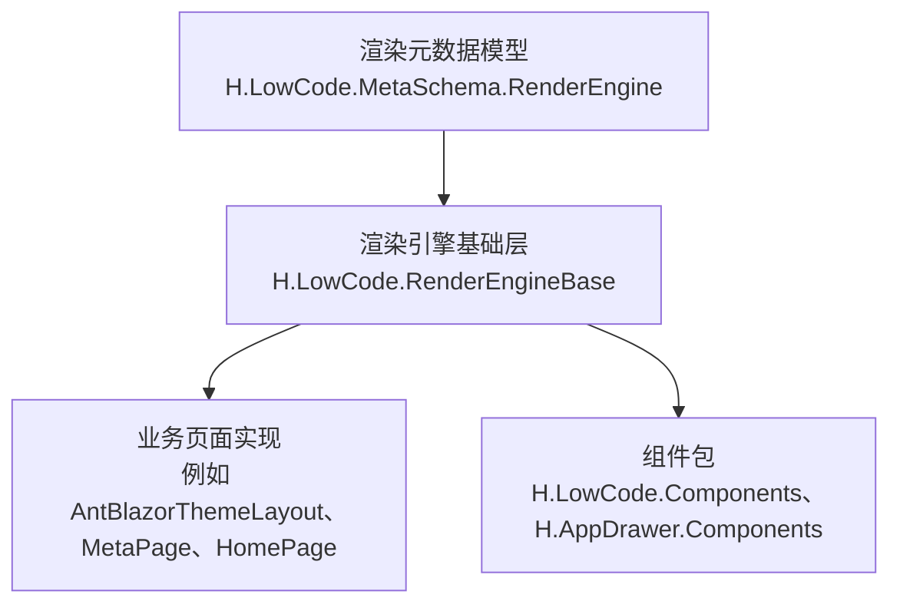

**图表来源**
- [H.LowCode.MetaSchema.RenderEngine.csproj:1-6](file://src/LowCode/Common/H.LowCode.MetaSchema.RenderEngine/H.LowCode.MetaSchema.RenderEngine.csproj#L1-L6)
- [RenderEngineBaseModule.cs:1-22](file://src/LowCode/RenderEngine/H.LowCode.RenderEngineBase/RenderEngineBaseModule.cs#L1-L22)

### 渲染元数据模型层

该层主要定义低代码页面的数据结构，包括应用、页面、组件、组件片段、属性定义分组、数据源等。其项目引用了更底层的 `H.LowCode.MetaSchema`，说明它是在基础元数据模型之上为“渲染端”增加字段或语义。

| 文件 | 职责 | 关键字段/行为 |
|---|---|---|
| [AppSchema.cs](file://src/LowCode/Common/H.LowCode.MetaSchema.RenderEngine/AppSchema.cs) | 渲染端应用 Schema | 继承 `AppSchemaBase`，为空扩展类 |
| [PageSchema.cs](file://src/LowCode/Common/H.LowCode.MetaSchema.RenderEngine/PageSchema.cs) | 页面 Schema | 暴露 `comps` 子组件集合 |
| [ComponentSchema.cs](file://src/LowCode/Common/H.LowCode.MetaSchema.RenderEngine/ComponentSchema.cs) | 组件 Schema | 包含 Fragment、数据源、属性定义分组、子组件、条件分支；支持将属性定义合并进 Fragment |
| [ComponentFragmentSchema.cs](file://src/LowCode/Common/H.LowCode.MetaSchema.RenderEngine/PropertySchemas/ComponentFragmentSchema.cs) | 组件片段 Schema | 描述组件类型名、默认类型名、子片段 |
| [ComponentAttributeDefineSchema.cs](file://src/LowCode/Common/H.LowCode.MetaSchema.RenderEngine/PropertySchemas/ComponentAttributeDefineSchema.cs) | 属性定义 Schema | 继承基础属性定义模型 |
| [ComponentAttributeDefineGroupSchema.cs](file://src/LowCode/Common/H.LowCode.MetaSchema.RenderEngine/PropertySchemas/ComponentAttributeDefineGroupSchema.cs) | 属性定义分组 Schema | 承载多个属性定义 |
| [ComponentDataSourceSchema.cs](file://src/LowCode/Common/H.LowCode.MetaSchema.RenderEngine/DataSourceSchemas/ComponentDataSourceSchema.cs) | 组件数据源 Schema | 数据源片段、列表项模板 |

**章节来源**
- [AppSchema.cs:1-6](file://src/LowCode/Common/H.LowCode.MetaSchema.RenderEngine/AppSchema.cs#L1-L6)
- [PageSchema.cs:1-9](file://src/LowCode/Common/H.LowCode.MetaSchema.RenderEngine/PageSchema.cs#L1-L9)
- [ComponentSchema.cs:1-83](file://src/LowCode/Common/H.LowCode.MetaSchema.RenderEngine/ComponentSchema.cs#L1-L83)
- [ComponentFragmentSchema.cs:1-28](file://src/LowCode/Common/H.LowCode.MetaSchema.RenderEngine/PropertySchemas/ComponentFragmentSchema.cs#L1-L28)
- [ComponentAttributeDefineSchema.cs:1-6](file://src/LowCode/Common/H.LowCode.MetaSchema.RenderEngine/PropertySchemas/ComponentAttributeDefineSchema.cs#L1-L6)
- [ComponentAttributeDefineGroupSchema.cs:1-9](file://src/LowCode/Common/H.LowCode.MetaSchema.RenderEngine/PropertySchemas/ComponentAttributeDefineGroupSchema.cs#L1-L9)
- [ComponentDataSourceSchema.cs:1-18](file://src/LowCode/Common/H.LowCode.MetaSchema.RenderEngine/DataSourceSchemas/ComponentDataSourceSchema.cs#L1-L18)
- [H.LowCode.MetaSchema.RenderEngine.csproj:1-6](file://src/LowCode/Common/H.LowCode.MetaSchema.RenderEngine/H.LowCode.MetaSchema.RenderEngine.csproj#L1-L6)

### 渲染引擎基础层

该层负责把 Schema 变成真实 UI 组件，并提供运行时能力：

| 文件 | 职责 |
|---|---|
| [RenderEngineDynamicComponentBase.cs](file://src/LowCode/RenderEngine/H.LowCode.RenderEngineBase/RenderEngineDynamicComponentBase.cs) | 动态组件渲染基类，处理递归渲染、条件渲染、数据源、表达式上下文、事件与生命周期订阅 |
| [PageComponentRegistry.cs](file://src/LowCode/RenderEngine/H.LowCode.RenderEngineBase/PageComponentRegistry.cs) | 页面组件注册表，维护根组件和按 Id 索引的组件配置 |
| [ListDataOperationManager.cs](file://src/LowCode/RenderEngine/H.LowCode.RenderEngineBase/ListDataOperationManager.cs) | 列表数据操作管理器，统一管理增删改查、排序、复制、删除记录主键等 |
| [PageFormStateService.cs](file://src/LowCode/RenderEngine/H.LowCode.RenderEngineBase/PageFormStateService.cs) | 页面表单状态服务，统一存储输入组件值并触发显隐联动 |
| [LowCodeExpressionResolver.cs](file://src/LowCode/RenderEngine/H.LowCode.RenderEngineBase/LowCodeExpressionResolver.cs) | 低代码表达式解析器，支持 `$query`、`$(item.field)`、`$(form.key)`、`$(formjson(...))`、`$(now)` 等 |
| [EventCallbackHelper.cs](file://src/LowCode/RenderEngine/H.LowCode.RenderEngineBase/EventCallbackHelper.cs) | 动态创建 `EventCallback`，适配有参和无参事件 |
| [RenderEngineBaseModule.cs](file://src/LowCode/RenderEngine/H.LowCode.RenderEngineBase/RenderEngineBaseModule.cs) | 依赖注入注册，注册列表管理器、表单状态、组件注册表 |
| [RenderEngineLowCodeComponentBase.cs](file://src/LowCode/RenderEngine/H.LowCode.RenderEngineBase/RenderEngineLowCodeComponentBase.cs) | 低代码组件基类，提供页面级级联参数 |

**章节来源**
- [RenderEngineDynamicComponentBase.cs:1-200](file://src/LowCode/RenderEngine/H.LowCode.RenderEngineBase/RenderEngineDynamicComponentBase.cs#L1-L200)
- [PageComponentRegistry.cs:1-48](file://src/LowCode/RenderEngine/H.LowCode.RenderEngineBase/PageComponentRegistry.cs#L1-L48)
- [ListDataOperationManager.cs:1-248](file://src/LowCode/RenderEngine/H.LowCode.RenderEngineBase/ListDataOperationManager.cs#L1-L248)
- [PageFormStateService.cs:1-98](file://src/LowCode/RenderEngine/H.LowCode.RenderEngineBase/PageFormStateService.cs#L1-L98)
- [LowCodeExpressionResolver.cs:1-270](file://src/LowCode/RenderEngine/H.LowCode.RenderEngineBase/LowCodeExpressionResolver.cs#L1-L270)
- [EventCallbackHelper.cs:1-84](file://src/LowCode/RenderEngine/H.LowCode.RenderEngineBase/EventCallbackHelper.cs#L1-L84)
- [RenderEngineBaseModule.cs:1-22](file://src/LowCode/RenderEngine/H.LowCode.RenderEngineBase/RenderEngineBaseModule.cs#L1-L22)
- [RenderEngineLowCodeComponentBase.cs:1-15](file://src/LowCode/RenderEngine/H.LowCode.RenderEngineBase/RenderEngineLowCodeComponentBase.cs#L1-L15)

## 核心组件

### 组件注册表：`PageComponentRegistry`

组件注册表是渲染过程中的“组件树登记中心”。渲染开始时，每个根组件都会调用注册方法，将自身及其 Id 登记进去。后续保存、校验、事件处理等操作可以按组件 Id 查找对应配置。

| 能力 | 说明 |
|---|---|
| 登记根组件 | 防止重复登记同一个根组件对象 |
| 登记任意组件 | 按组件 Id 建立索引 |
| 按 Id 查询 | 供表单校验、保存、事件处理器使用 |
| 获取根组件列表 | 供页面级操作遍历根节点 |

**章节来源**
- [PageComponentRegistry.cs:1-48](file://src/LowCode/RenderEngine/H.LowCode.RenderEngineBase/PageComponentRegistry.cs#L1-L48)

### 列表数据操作管理器：`ListDataOperationManager`

列表数据管理器是低代码页面中“表格、列表、动态行”等场景的核心运行时设施。它维护每个列表组件的数据、是否来自数据库、删除的主键记录、以及增删改移、复制、排序等能力。

| 能力 | 行为 |
|---|---|
| 注册列表数据 | 可标记数据来源于数据库，以便保存时同步删除已移除的行 |
| 获取列表数据 | 未注册时自动返回空列表 |
| 添加默认项 | 自动生成主键字段 |
| 复制项 | 对字典类型深拷贝并重新生成主键 |
| 删除项 | 若数据来源是数据库，则记录被删除行的主键 |
| 移动项 | 上移、下移并触发变更通知 |
| 更新顺序字段 | 按当前顺序更新 `f_order` 等字段 |
| 获取主键 | 通过表达式解析器读取行主键 |

**章节来源**
- [ListDataOperationManager.cs:1-248](file://src/LowCode/RenderEngine/H.LowCode.RenderEngineBase/ListDataOperationManager.cs#L1-L248)

### 页面表单状态服务：`PageFormStateService`

表单状态服务用于统一管理页面内所有输入组件的值。它采用字符串 key 作为标识：

- 普通组件：使用组件 `Name`。
- 列表实例组件：使用 `{listId}|{itemPrimaryKey}|{componentName}`。
- 特殊 key：`__lastid` 用于保存最近一次表单保存生成的主键。

当值发生变化时，会触发 `OnChange` 事件，驱动显隐联动、条件渲染、值回显等逻辑重新计算。

**章节来源**
- [PageFormStateService.cs:1-98](file://src/LowCode/RenderEngine/H.LowCode.RenderEngineBase/PageFormStateService.cs#L1-L98)

### 表达式解析器：`LowCodeExpressionResolver`

表达式解析器负责把低代码配置中的表达式转换为实际值。它支持混合文本与表达式，也支持整串表达式直接返回原始类型值。

| 表达式 | 含义 |
|---|---|
| `$query(name)` | 读取 URL 参数；支持多个名称依次回退 |
| `$(item.field)` | 读取当前行数据字段，支持字典和反射属性 |
| `$(form.key)` | 读取表单状态值 |
| `$(form[innerExpr])` | 表单状态值，key 本身可以是表达式 |
| `$(formjson(listId,compName))` | 聚合某列表组件中某组件名的全部实例值为 JSON 数组 |
| `$(now)` | 当前时间，格式化为 `yyyy-MM-dd HH:mm:ss` |

**章节来源**
- [LowCodeExpressionResolver.cs:1-270](file://src/LowCode/RenderEngine/H.LowCode.RenderEngineBase/LowCodeExpressionResolver.cs#L1-L270)

### 动态事件回调辅助：`EventCallbackHelper`

动态事件回调辅助工具用于根据目标组件参数的类型，动态创建 Blazor 的 `EventCallback`。它同时支持：

- 无参事件，如点击事件；
- 有参事件，如 `ValueChanged`；
- 泛型 `EventCallback<T>`；
- 非泛型 `EventCallback`。

这使渲染引擎可以在不知道具体组件类型的情况下，安全地绑定事件。

**章节来源**
- [EventCallbackHelper.cs:1-84](file://src/LowCode/RenderEngine/H.LowCode.RenderEngineBase/EventCallbackHelper.cs#L1-L84)

## 架构总览

渲染引擎的整体架构可以分为四层：

1. **元数据层**：JSON Schema 对应的 C# 模型。
2. **渲染引擎基础层**：动态组件渲染、表达式求值、事件绑定、表单状态、列表数据、组件注册表。
3. **页面层**：具体页面布局与页面级渲染器，例如主题布局、元数据页面、主页等。
4. **组件层**：业务组件包，如 `H.LowCode.Components`、`H.AppDrawer.Components`。

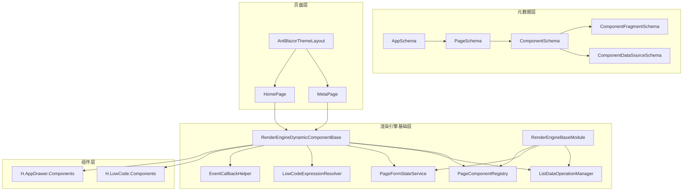

**图表来源**
- [PageSchema.cs:1-9](file://src/LowCode/Common/H.LowCode.MetaSchema.RenderEngine/PageSchema.cs#L1-L9)
- [ComponentSchema.cs:1-83](file://src/LowCode/Common/H.LowCode.MetaSchema.RenderEngine/ComponentSchema.cs#L1-L83)
- [ComponentFragmentSchema.cs:1-28](file://src/LowCode/Common/H.LowCode.MetaSchema.RenderEngine/PropertySchemas/ComponentFragmentSchema.cs#L1-L28)
- [ComponentDataSourceSchema.cs:1-18](file://src/LowCode/Common/H.LowCode.MetaSchema.RenderEngine/DataSourceSchemas/ComponentDataSourceSchema.cs#L1-L18)
- [RenderEngineDynamicComponentBase.cs:1-200](file://src/LowCode/RenderEngine/H.LowCode.RenderEngineBase/RenderEngineDynamicComponentBase.cs#L1-L200)
- [PageComponentRegistry.cs:1-48](file://src/LowCode/RenderEngine/H.LowCode.RenderEngineBase/PageComponentRegistry.cs#L1-L48)
- [ListDataOperationManager.cs:1-248](file://src/LowCode/RenderEngine/H.LowCode.RenderEngineBase/ListDataOperationManager.cs#L1-L248)
- [PageFormStateService.cs:1-98](file://src/LowCode/RenderEngine/H.LowCode.RenderEngineBase/PageFormStateService.cs#L1-L98)
- [LowCodeExpressionResolver.cs:1-270](file://src/LowCode/RenderEngine/H.LowCode.RenderEngineBase/LowCodeExpressionResolver.cs#L1-L270)
- [EventCallbackHelper.cs:1-84](file://src/LowCode/RenderEngine/H.LowCode.RenderEngineBase/EventCallbackHelper.cs#L1-L84)
- [RenderEngineBaseModule.cs:1-22](file://src/LowCode/RenderEngine/H.LowCode.RenderEngineBase/RenderEngineBaseModule.cs#L1-L22)

## 详细组件分析

### 渲染入口与递归渲染流程

渲染入口位于 `RenderEngineDynamicComponentBase`。该基类继承了低代码动态组件基类，并在初始化时：

1. 订阅表单状态变化，驱动显隐联动与值回显重新求值。
2. 订阅列表数据变化，驱动列表重新渲染。
3. 在组件销毁时取消订阅，避免内存泄漏。

组件渲染入口通过 `RenderComponent` 开始，内部再调用 `RenderComponentRecursive` 进行递归渲染。递归渲染过程中会处理：

- 组件 Fragment 的类型名解析；
- 可见性条件求值；
- 条件渲染组件分支选择；
- 数据源渲染；
- 子组件递归；
- 组件注册。

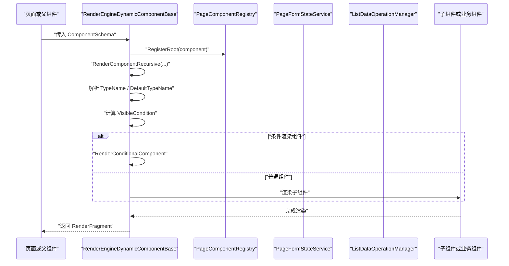

**图表来源**
- [RenderEngineDynamicComponentBase.cs:1-200](file://src/LowCode/RenderEngine/H.LowCode.RenderEngineBase/RenderEngineDynamicComponentBase.cs#L1-L200)
- [PageComponentRegistry.cs:1-48](file://src/LowCode/RenderEngine/H.LowCode.RenderEngineBase/PageComponentRegistry.cs#L1-L48)
- [PageFormStateService.cs:1-98](file://src/LowCode/RenderEngine/H.LowCode.RenderEngineBase/PageFormStateService.cs#L1-L98)
- [ListDataOperationManager.cs:1-248](file://src/LowCode/RenderEngine/H.LowCode.RenderEngineBase/ListDataOperationManager.cs#L1-L248)

**章节来源**
- [RenderEngineDynamicComponentBase.cs:1-200](file://src/LowCode/RenderEngine/H.LowCode.RenderEngineBase/RenderEngineDynamicComponentBase.cs#L1-L200)

### JSON Schema 解析与属性映射

渲染元数据模型定义了页面、组件、片段、数据源等结构。其中 `ComponentSchema` 承担了重要职责：

- 通过 `frag` 描述组件渲染片段；
- 通过 `ds` 描述数据源；
- 通过 `attrdefgroups` 描述属性定义分组；
- 通过 `childs` 描述子组件；
- 通过 `cases` 和 `default` 描述条件渲染分支；
- 提供 `MergeAttributeDefineToFragment` 方法，将属性定义合并到 Fragment 的属性列表中。

这意味着设计端定义的属性分组，可以在渲染前转换为 Fragment 中的属性，从而让组件在运行时拿到属性值。

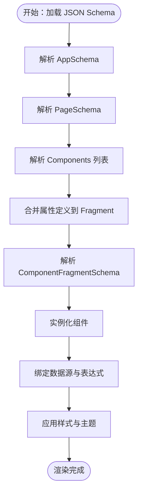

**图表来源**
- [AppSchema.cs:1-6](file://src/LowCode/Common/H.LowCode.MetaSchema.RenderEngine/AppSchema.cs#L1-L6)
- [PageSchema.cs:1-9](file://src/LowCode/Common/H.LowCode.MetaSchema.RenderEngine/PageSchema.cs#L1-L9)
- [ComponentSchema.cs:1-83](file://src/LowCode/Common/H.LowCode.MetaSchema.RenderEngine/ComponentSchema.cs#L1-L83)
- [ComponentFragmentSchema.cs:1-28](file://src/LowCode/Common/H.LowCode.MetaSchema.RenderEngine/PropertySchemas/ComponentFragmentSchema.cs#L1-L28)

**章节来源**
- [ComponentSchema.cs:1-83](file://src/LowCode/Common/H.LowCode.MetaSchema.RenderEngine/ComponentSchema.cs#L1-L83)
- [ComponentAttributeDefineGroupSchema.cs:1-9](file://src/LowCode/Common/H.LowCode.MetaSchema.RenderEngine/PropertySchemas/ComponentAttributeDefineGroupSchema.cs#L1-L9)
- [ComponentAttributeDefineSchema.cs:1-6](file://src/LowCode/Common/H.LowCode.MetaSchema.RenderEngine/PropertySchemas/ComponentAttributeDefineSchema.cs#L1-L6)
- [ComponentFragmentSchema.cs:1-28](file://src/LowCode/Common/H.LowCode.MetaSchema.RenderEngine/PropertySchemas/ComponentFragmentSchema.cs#L1-L28)

### 表达式求值与动态内容

表达式解析器支持多种表达式语法，这些表达式常用于：

- 显示条件；
- 组件标题；
- 占位文本；
- 表单初始值；
- 按钮文案；
- 路由参数；
- 列表项展示字段。

表达式解析器会根据上下文决定返回值类型：如果整个字符串是单一表达式，返回原始类型；否则返回插值后的字符串。

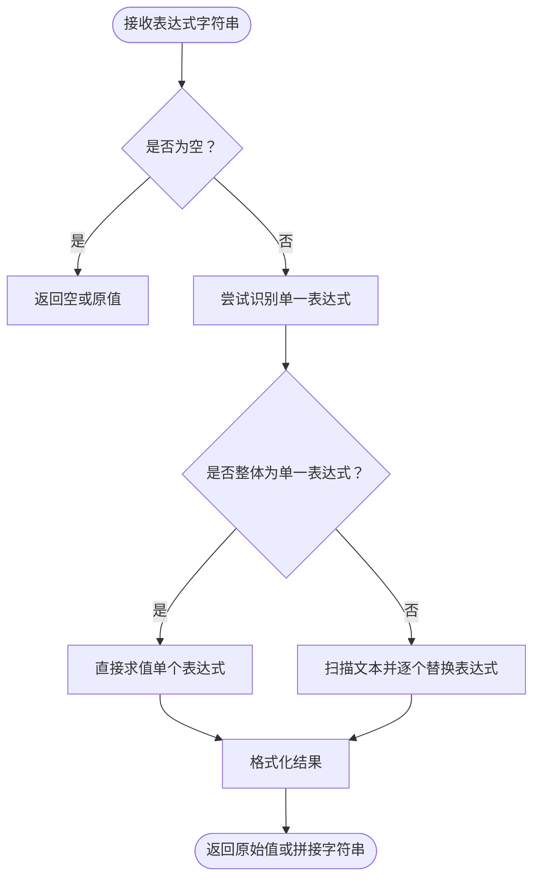

**图表来源**
- [LowCodeExpressionResolver.cs:1-270](file://src/LowCode/RenderEngine/H.LowCode.RenderEngineBase/LowCodeExpressionResolver.cs#L1-L270)

**章节来源**
- [LowCodeExpressionResolver.cs:1-270](file://src/LowCode/RenderEngine/H.LowCode.RenderEngineBase/LowCodeExpressionResolver.cs#L1-L270)

### 事件绑定与回调动态创建

事件绑定由渲染引擎与事件回调辅助工具共同完成。`EventCallbackHelper` 通过反射找到 `EventCallbackFactory.Create` 的合适重载，然后根据目标参数类型创建回调。

典型流程如下：

1. 渲染引擎发现某个组件属性是 `EventCallback` 或 `EventCallback<T>`。
2. 渲染引擎构造一个通用的处理器委托。
3. `EventCallbackHelper` 动态创建合适的 `EventCallback`。
4. 将回调赋值给组件属性，完成事件绑定。

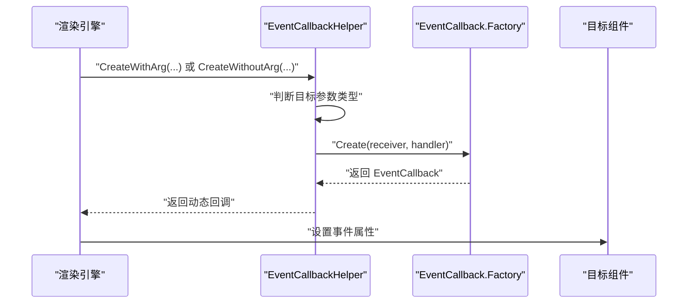

**图表来源**
- [EventCallbackHelper.cs:1-84](file://src/LowCode/RenderEngine/H.LowCode.RenderEngineBase/EventCallbackHelper.cs#L1-L84)

**章节来源**
- [EventCallbackHelper.cs:1-84](file://src/LowCode/RenderEngine/H.LowCode.RenderEngineBase/EventCallbackHelper.cs#L1-L84)

### 动态组件加载与懒加载机制

动态组件加载主要通过 `ComponentFragmentSchema` 的 `TypeName` 和 `DefaultTypeName` 实现：

- `DefaultTypeName` 是设计端落盘的默认类型名；
- 如果运行时 `TypeName` 为空，则回退到 `DefaultTypeName`；
- 如果两者都为空，则抛出异常，阻止无效渲染。

这意味着：

- 普通组件可以使用 .NET 类型全名；
- 原生 HTML 元素可以使用 `html:{tag}` 形式；
- 运行时可以通过覆盖 `TypeName` 实现动态替换；
- 延迟加载需要在更高层（例如页面或服务层）配合，先加载组件程序集或资源，再设置 `TypeName`。

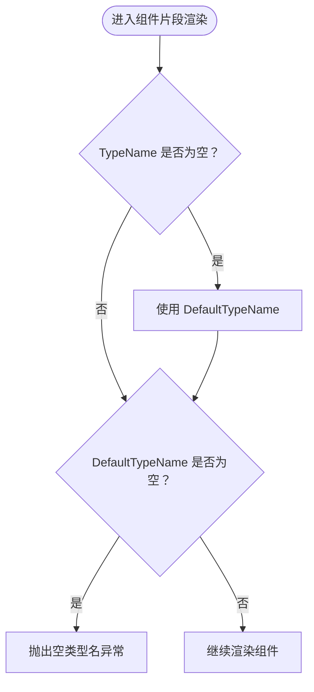

**图表来源**
- [ComponentFragmentSchema.cs:1-28](file://src/LowCode/Common/H.LowCode.MetaSchema.RenderEngine/PropertySchemas/ComponentFragmentSchema.cs#L1-L28)
- [RenderEngineDynamicComponentBase.cs:1-200](file://src/LowCode/RenderEngine/H.LowCode.RenderEngineBase/RenderEngineDynamicComponentBase.cs#L1-L200)

**章节来源**
- [ComponentFragmentSchema.cs:1-28](file://src/LowCode/Common/H.LowCode.MetaSchema.RenderEngine/PropertySchemas/ComponentFragmentSchema.cs#L1-L28)
- [RenderEngineDynamicComponentBase.cs:1-200](file://src/LowCode/RenderEngine/H.LowCode.RenderEngineBase/RenderEngineDynamicComponentBase.cs#L1-L200)

### 条件渲染与显隐联动

条件渲染分为两类：

1. **条件渲染组件**：当组件 Fragment 类型为条件渲染组件且存在 `Cases` 时，渲染引擎进入条件分支渲染逻辑。
2. **可见性条件**：即使不是条件渲染组件，也可能因为 `VisibleCondition` 求值为假而被跳过渲染。

此外，表单状态变化会触发 `OnFormStateChanged`，进而调用 `StateHasChanged`，让渲染引擎重新计算可见性和值。

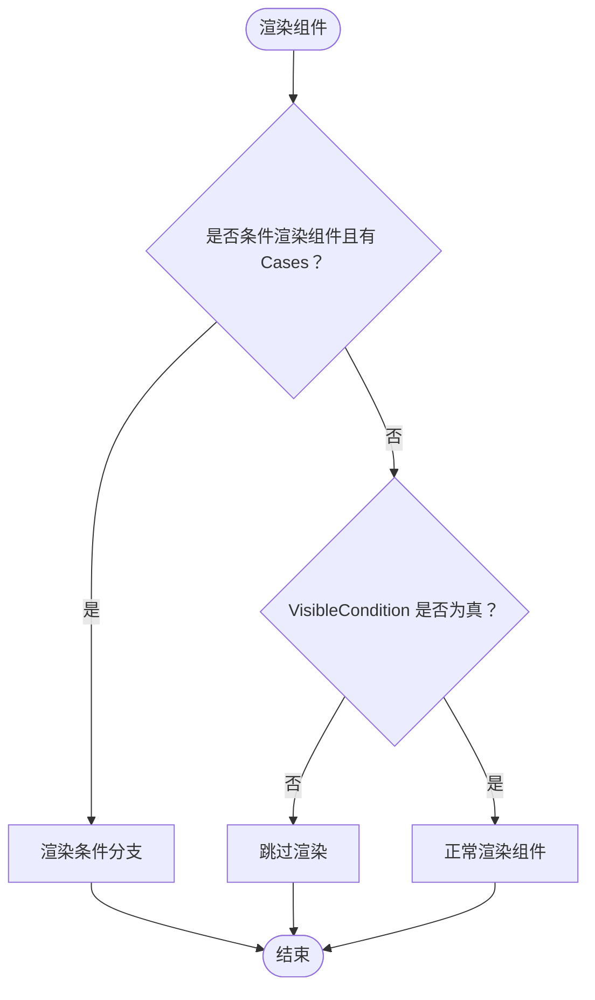

**图表来源**
- [RenderEngineDynamicComponentBase.cs:1-200](file://src/LowCode/RenderEngine/H.LowCode.RenderEngineBase/RenderEngineDynamicComponentBase.cs#L1-L200)

**章节来源**
- [RenderEngineDynamicComponentBase.cs:1-200](file://src/LowCode/RenderEngine/H.LowCode.RenderEngineBase/RenderEngineDynamicComponentBase.cs#L1-L200)

### 数据源与列表渲染

数据源 Schema 由 `ComponentDataSourceSchema` 描述，包含：

- `dsfrag`：数据源片段；
- `itemtpl`：列表项模板，支持完整组件配置和条件渲染。

列表数据在运行期由 `ListDataOperationManager` 管理。渲染引擎会在初始化时订阅列表数据变更事件，从而在用户增删改行、排序、复制后重新渲染列表。

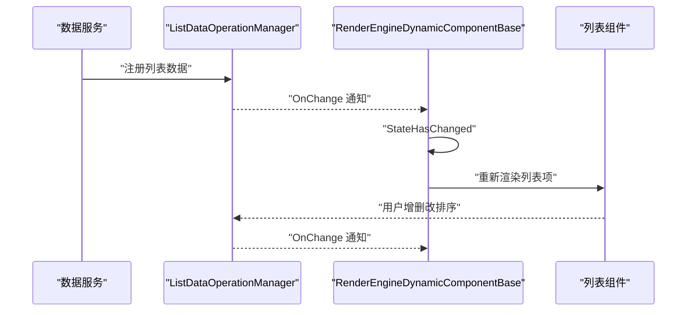

**图表来源**
- [ComponentDataSourceSchema.cs:1-18](file://src/LowCode/Common/H.LowCode.MetaSchema.RenderEngine/DataSourceSchemas/ComponentDataSourceSchema.cs#L1-L18)
- [ListDataOperationManager.cs:1-248](file://src/LowCode/RenderEngine/H.LowCode.RenderEngineBase/ListDataOperationManager.cs#L1-L248)
- [RenderEngineDynamicComponentBase.cs:1-200](file://src/LowCode/RenderEngine/H.LowCode.RenderEngineBase/RenderEngineDynamicComponentBase.cs#L1-L200)

**章节来源**
- [ComponentDataSourceSchema.cs:1-18](file://src/LowCode/Common/H.LowCode.MetaSchema.RenderEngine/DataSourceSchemas/ComponentDataSourceSchema.cs#L1-L18)
- [ListDataOperationManager.cs:1-248](file://src/LowCode/RenderEngine/H.LowCode.RenderEngineBase/ListDataOperationManager.cs#L1-L248)
- [RenderEngineDynamicComponentBase.cs:1-200](file://src/LowCode/RenderEngine/H.LowCode.RenderEngineBase/RenderEngineDynamicComponentBase.cs#L1-L200)

### 依赖注入与服务生命周期

渲染引擎基础层通过 `RenderEngineBaseModule` 注册以下服务：

| 服务 | 生命周期 | 作用 |
|---|---:|---|
| `ListDataOperationManager` | Singleton | 保证 WebAssembly 中列表状态保持 |
| `PageFormStateService` | Scoped | 按会话隔离表单状态 |
| `PageComponentRegistry` | Scoped | 按会话隔离页面组件树 |

这种设计意味着：

- 列表数据在单例中共享，适合跨组件共享同一份列表状态；
- 表单状态和组件注册表按请求或页面会话隔离，避免不同页面互相污染；
- 渲染引擎基类可通过依赖注入获得这些服务。

**章节来源**
- [RenderEngineBaseModule.cs:1-22](file://src/LowCode/RenderEngine/H.LowCode.RenderEngineBase/RenderEngineBaseModule.cs#L1-L22)

## 依赖关系分析

### 元数据模型依赖

`H.LowCode.MetaSchema.RenderEngine` 只引用 `H.LowCode.MetaSchema`，说明它专注于为渲染端扩展元数据模型，而不直接依赖 Blazor 或 ASP.NET Core。

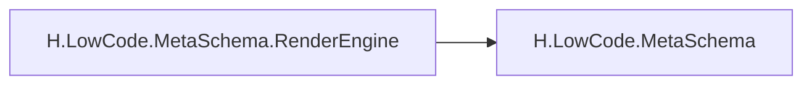

**图表来源**
- [H.LowCode.MetaSchema.RenderEngine.csproj:1-6](file://src/LowCode/Common/H.LowCode.MetaSchema.RenderEngine/H.LowCode.MetaSchema.RenderEngine.csproj#L1-L6)

### 渲染引擎基础层依赖

渲染引擎基础层依赖：

- 低代码组件基类；
- 低代码应用契约；
- 元数据模型；
- Blazor 运行时；
- 依赖注入容器。

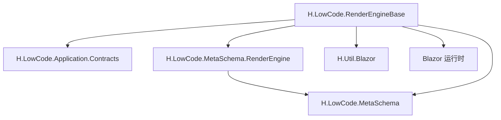

**图表来源**
- [RenderEngineBaseModule.cs:1-22](file://src/LowCode/RenderEngine/H.LowCode.RenderEngineBase/RenderEngineBaseModule.cs#L1-L22)
- [RenderEngineDynamicComponentBase.cs:1-200](file://src/LowCode/RenderEngine/H.LowCode.RenderEngineBase/RenderEngineDynamicComponentBase.cs#L1-L200)

**章节来源**
- [H.LowCode.MetaSchema.RenderEngine.csproj:1-6](file://src/LowCode/Common/H.LowCode.MetaSchema.RenderEngine/H.LowCode.MetaSchema.RenderEngine.csproj#L1-L6)
- [RenderEngineBaseModule.cs:1-22](file://src/LowCode/RenderEngine/H.LowCode.RenderEngineBase/RenderEngineBaseModule.cs#L1-L22)
- [RenderEngineDynamicComponentBase.cs:1-200](file://src/LowCode/RenderEngine/H.LowCode.RenderEngineBase/RenderEngineDynamicComponentBase.cs#L1-L200)

## 性能与优化建议

虽然仓库中未直接提供虚拟滚动实现，但可以从现有架构出发提出合理优化方向：

| 优化点 | 现状与建议 |
|---|---|
| 虚拟滚动 | 列表组件应结合可视区域与分页策略，仅渲染可见行；对于大数据量列表，建议在业务组件层实现虚拟滚动，并由 `ListDataOperationManager` 提供数据源 |
| 组件复用 | 使用稳定 Id 和 Key，避免频繁重建组件；对相同配置的组件尽量复用实例 |
| 表达式缓存 | 对高频求值的表达式可考虑缓存结果，特别是 `$(form.key)` 和 `$(item.field)` |
| 事件去抖 | 表单输入事件应做防抖或节流，减少频繁 `StateHasChanged` |
| 订阅清理 | 渲染引擎已在 `Dispose` 中取消订阅，自定义组件也应遵循相同模式 |
| 条件渲染剪枝 | 对不可见组件尽早短路，不创建子树 |
| 数据源按需加载 | 大列表、图片、富文本等资源应懒加载 |
| 主题样式分离 | 将主题样式以 CSS 变量或静态资源方式注入，避免每次渲染注入大量样式 |
| 组件注册表容量控制 | 对超大页面应限制根组件数量，避免注册表过大 |

[本节为通用优化建议，不直接分析具体文件]

## 故障排查指南

### 组件类型名为空

**现象**：渲染时报错，提示组件片段类型名为空。

**原因**：`ComponentFragmentSchema.TypeName` 和 `DefaultTypeName` 均为空。

**处理**：

1. 检查设计端是否输出 `dt` 字段；
2. 检查运行时是否覆盖了 `TypeName`；
3. 确保动态组件加载成功后才渲染。

**章节来源**
- [ComponentFragmentSchema.cs:1-28](file://src/LowCode/Common/H.LowCode.MetaSchema.RenderEngine/PropertySchemas/ComponentFragmentSchema.cs#L1-L28)
- [RenderEngineDynamicComponentBase.cs:1-200](file://src/LowCode/RenderEngine/H.LowCode.RenderEngineBase/RenderEngineDynamicComponentBase.cs#L1-L200)

### 表单联动不生效

**现象**：修改某个输入框，其他组件的显隐或显示值没有更新。

**可能原因**：

- 表单状态 key 不正确；
- 表达式未使用正确的 `$(form.key)` 语法；
- 组件未在表单状态服务中写入值；
- 订阅未正确触发。

**处理**：

1. 确认普通组件 key 为组件 `Name`；
2. 确认列表组件 key 为 `{listId}|{itemPrimaryKey}|{componentName}`；
3. 检查表达式是否使用了 `$(form.key)`；
4. 检查 `PageFormStateService` 是否正确触发 `OnChange`。

**章节来源**
- [PageFormStateService.cs:1-98](file://src/LowCode/RenderEngine/H.LowCode.RenderEngineBase/PageFormStateService.cs#L1-L98)
- [LowCodeExpressionResolver.cs:1-270](file://src/LowCode/RenderEngine/H.LowCode.RenderEngineBase/LowCodeExpressionResolver.cs#L1-L270)
- [RenderEngineDynamicComponentBase.cs:1-200](file://src/LowCode/RenderEngine/H.LowCode.RenderEngineBase/RenderEngineDynamicComponentBase.cs#L1-L200)

### 列表数据未刷新

**现象**：新增、删除、排序后页面没有更新。

**可能原因**：

- 列表数据未注册到 `ListDataOperationManager`；
- 操作未触发 `OnChange`；
- 组件未订阅列表数据变化；
- 组件未调用 `StateHasChanged`。

**处理**：

1. 确认列表数据通过 `RegisterListData` 注册；
2. 确认增删改移后调用了变更通知；
3. 确认渲染引擎已订阅 `ListDataManager.OnChange`；
4. 确认组件在回调中调用了 `StateHasChanged`。

**章节来源**
- [ListDataOperationManager.cs:1-248](file://src/LowCode/RenderEngine/H.LowCode.RenderEngineBase/ListDataOperationManager.cs#L1-L248)
- [RenderEngineDynamicComponentBase.cs:1-200](file://src/LowCode/RenderEngine/H.LowCode.RenderEngineBase/RenderEngineDynamicComponentBase.cs#L1-L200)

### 事件无法绑定

**现象**：组件事件属性设置了回调，但点击或输入时未触发。

**可能原因**：

- 组件属性不是 `EventCallback` 或 `EventCallback<T>`；
- 动态回调创建失败；
- 回调处理器参数类型不匹配。

**处理**：

1. 确认目标组件参数类型；
2. 使用 `EventCallbackHelper` 创建回调；
3. 确认处理器签名与参数类型一致。

**章节来源**
- [EventCallbackHelper.cs:1-84](file://src/LowCode/RenderEngine/H.LowCode.RenderEngineBase/EventCallbackHelper.cs#L1-L84)

## 结论

该低代码渲染引擎采用“元数据模型 + 动态渲染引擎”的分层架构：

- 元数据模型层清晰描述页面、组件、片段、数据源；
- 渲染引擎基础层负责把 Schema 转为真实 UI；
- 表单状态、列表数据、表达式、事件回调、组件注册表等能力集中在基础层；
- 业务页面和组件包在上层组合使用。

这一架构的优势是：

- 组件与渲染逻辑解耦；
- 属性定义与运行时 Fragment 分离；
- 表达式与业务数据解耦；
- 事件绑定与组件类型解耦；
- 列表数据和表单状态集中管理。

未来可扩展的方向包括：

- 增强动态组件加载与懒加载策略；
- 引入表达式缓存；
- 实现虚拟滚动；
- 增强主题系统与 CSS 变量注入；
- 扩展 JavaScript 表达式执行环境；
- 提供更丰富的数据源适配器。

[本节为总结性内容，不直接分析具体文件]

## 附录：主题定制与高级用法

### 主题与样式注入

渲染引擎基础层提供了页面级级联参数 `PageCascadingModel`，组件基类也暴露了该参数。主题样式通常通过以下方式注入：

- 在页面布局中引入主题 CSS；
- 通过 CSS 变量定义主题色、字体、间距；
- 组件根据 `PageCascading` 中的主题信息动态调整样式；
- 业务组件包提供默认样式，主题包覆盖默认样式。

由于本仓库中主题相关实现分散在页面布局和组件样式文件中，推荐将主题配置抽象为独立配置对象，并通过依赖注入或级联参数传递。

[本节为概念性说明，不直接分析具体文件]

### JavaScript 表达式执行

当前表达式解析器支持字符串形式的低代码表达式，但不直接执行任意 JavaScript。若需要执行 JavaScript：

- 可在渲染引擎中注入 JS Interop 服务；
- 在表达式解析器中扩展新函数，例如 `$js(funcName, args)`；
- 在服务层执行预授权脚本，避免执行不受信任的代码；
- 对表达式结果做严格类型校验。

[本节为概念性说明，不直接分析具体文件]

### 自定义渲染逻辑

开发者可通过以下方式扩展渲染引擎：

1. 继承 `RenderEngineDynamicComponentBase` 或 `RenderEngineLowCodeComponentBase`；
2. 注册自定义组件类型映射；
3. 重写特定组件的渲染逻辑；
4. 扩展表达式解析器；
5. 扩展事件回调处理器；
6. 扩展数据源适配器。

这种方式既保留了通用渲染能力，又允许业务侧灵活扩展。

[本节为概念性说明，不直接分析具体文件]