# 组件库数据流

<cite>
**本文引用的文件**   
- [ComponentSchemaBase.cs](file://src/LowCode/Common/H.LowCode.MetaSchema/ComponentSchemaBase.cs)
- [MetaSchemaBase.cs](file://src/LowCode/Common/H.LowCode.MetaSchema/MetaSchemaBase.cs)
- [AppSchemaBase.cs](file://src/LowCode/Common/H.LowCode.MetaSchema/AppSchemaBase.cs)
- [PageSchemaBase.cs](file://src/LowCode/Common/H.LowCode.MetaSchema/PageSchemaBase.cs)
- [DataSourceSchema.cs](file://src/LowCode/Common/H.LowCode.MetaSchema/DataSourceSchema.cs)
- [MenuSchema.cs](file://src/LowCode/Common/H.LowCode.MetaSchema/MenuSchema.cs)
- [EventSchema.cs](file://src/LowCode/Common/H.LowCode.MetaSchema/PropertySchemas/EventSchema.cs)
- [ComponentStyleSchema.cs](file://src/LowCode/Common/H.LowCode.MetaSchema/PropertySchemas/ComponentStyleSchema.cs)
- [VisibleConditionSchema.cs](file://src/LowCode/Common/H.LowCode.MetaSchema/PropertySchemas/VisibleConditionSchema.cs)
- [ValidationRuleSchema.cs](file://src/LowCode/Common/H.LowCode.MetaSchema/PropertySchemas/ValidationRuleSchema.cs)
- [PagePropertySchema.cs](file://src/LowCode/Common/H.LowCode.MetaSchema/PropertySchemas/PagePropertySchema.cs)
- [TableFieldSchema.cs](file://src/LowCode/Common/H.LowCode.MetaSchema/DataSourceSchemas/TableFieldSchema.cs)
- [RenderEngineDynamicComponentBase.cs](file://src/LowCode/RenderEngine/H.LowCode.RenderEngineBase/RenderEngineDynamicComponentBase.cs)
- [RenderEngineLowCodeComponentBase.cs](file://src/LowCode/RenderEngine/H.LowCode.RenderEngineBase/RenderEngineLowCodeComponentBase.cs)
- [ThemePartLayoutBase.cs](file://src/LowCode/RenderEngine/H.LowCode.RenderEngineBase/Layout/ThemePartLayoutBase.cs)
- [LowCodeDynamicComponentBase.cs](file://src/LowCode/Common/H.LowCode.ComponentBase/LowCodeDynamicComponentBase.cs)
- [LowCodeComponentBase.cs](file://src/LowCode/Common/H.LowCode.ComponentBase/LowCodeComponentBase.cs)
- [LowCodeAppState.cs](file://src/LowCode/Common/H.LowCode.ComponentBase/LowCodeAppState.cs)
- [NativeResourceMount.razor](file://src/LowCode/Common/H.LowCode.ComponentBase/Components/NativeResourceMount.razor)
- [Conditional.razor](file://src/LowCode/Common/H.LowCode.ComponentBase/Components/Conditional.razor)
- [LcTable.razor](file://src/LowCode/Common/H.LowCode.Components/Components/LcTable.razor)
- [ComponentRender.razor](file://src/LowCode/RenderEngine/H.LowCode.RenderEngine/ComponentRender/ComponentRender.razor)
- [FormComponentRender.razor](file://src/LowCode/RenderEngine/H.LowCode.RenderEngine/ComponentRender/FormComponentRender.razor)
- [ContainerComponentRender.razor](file://src/LowCode/RenderEngine/H.LowCode.RenderEngine/ComponentRender/ContainerComponentRender.razor)
- [NormalPageRender.razor](file://src/LowCode/RenderEngine/H.LowCode.RenderEngine/PageRender/NormalPageRender.razor)
- [FormPageRender.razor](file://src/LowCode/RenderEngine/H.LowCode.RenderEngine/PageRender/FormPageRender.razor)
- [TablePageRender.razor](file://src/LowCode/RenderEngine/H.LowCode.RenderEngine/PageRender/TablePageRender.razor)
</cite>

## 目录
1. [引言](#引言)
2. [项目结构](#项目结构)
3. [核心概念与元数据结构](#核心概念与元数据结构)
4. [组件生命周期数据流](#组件生命周期数据流)
5. [渲染器适配与动态加载机制](#渲染器适配与动态加载机制)
6. [属性面板生成与事件处理](#属性面板生成与事件处理)
7. [主题系统与样式集成](#主题系统与样式集成)
8. [自定义组件开发指南](#自定义组件开发指南)
9. [依赖关系分析](#依赖关系分析)
10. [性能优化策略](#性能优化策略)
11. [故障排查指南](#故障排查指南)
12. [结论](#结论)

## 引言
本文面向低代码平台的组件库，系统化梳理“组件定义 → 元数据注册 → 属性面板生成 → 渲染器适配 → 运行时加载”的完整数据流。文档重点解释组件元数据的标准结构、组件的动态加载机制、与主题系统的集成方式，并给出自定义组件的开发流程、测试方法和发布建议，同时总结虚拟化渲染、状态管理、内存泄漏防护等性能优化实践。

## 项目结构
该仓库围绕低代码平台的核心能力组织为若干模块：
- 元数据模式层：统一描述应用、页面、菜单、数据源、组件及其属性的 JSON 契约。
- 设计引擎侧：用于编辑、预览、组合、校验和发布组件及页面。
- 渲染引擎侧：在运行时将元数据解析为实际 Blazor 组件树，完成动态加载、事件绑定、条件渲染和数据驱动。
- 公共组件基类：提供通用状态、上下文、资源挂载、条件渲染等基础能力。
- 内置组件：如表格等常用 UI 组件，作为示例展示如何遵循元数据规范进行实现。

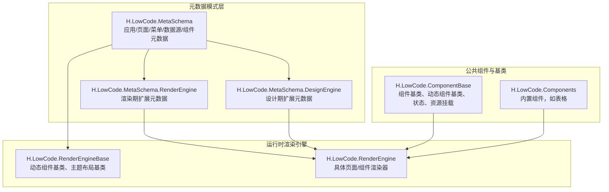

**图表来源**
- [ComponentSchemaBase.cs:1-110](file://src/LowCode/Common/H.LowCode.MetaSchema/ComponentSchemaBase.cs#L1-L110)
- [PageSchemaBase.cs:1-40](file://src/LowCode/Common/H.LowCode.MetaSchema/PageSchemaBase.cs#L1-L40)
- [RenderEngineDynamicComponentBase.cs](file://src/LowCode/RenderEngine/H.LowCode.RenderEngineBase/RenderEngineDynamicComponentBase.cs)
- [RenderEngineLowCodeComponentBase.cs](file://src/LowCode/RenderEngine/H.LowCode.RenderEngineBase/RenderEngineLowCodeComponentBase.cs)
- [ComponentRender.razor](file://src/LowCode/RenderEngine/H.LowCode.RenderEngine/ComponentRender/ComponentRender.razor)
- [NormalPageRender.razor](file://src/LowCode/RenderEngine/H.LowCode.RenderEngine/PageRender/NormalPageRender.razor)

**章节来源**
- [ComponentSchemaBase.cs:1-110](file://src/LowCode/Common/H.LowCode.MetaSchema/ComponentSchemaBase.cs#L1-L110)
- [PageSchemaBase.cs:1-40](file://src/LowCode/Common/H.LowCode.MetaSchema/PageSchemaBase.cs#L1-L40)
- [RenderEngineDynamicComponentBase.cs](file://src/LowCode/RenderEngine/H.LowCode.RenderEngineBase/RenderEngineDynamicComponentBase.cs)
- [RenderEngineLowCodeComponentBase.cs](file://src/LowCode/RenderEngine/H.LowCode.RenderEngineBase/RenderEngineLowCodeComponentBase.cs)
- [ComponentRender.razor](file://src/LowCode/RenderEngine/H.LowCode.RenderEngine/ComponentRender/ComponentRender.razor)
- [NormalPageRender.razor](file://src/LowCode/RenderEngine/H.LowCode.RenderEngine/PageRender/NormalPageRender.razor)

## 核心概念与元数据结构
低代码平台以“元数据驱动”的方式组织应用、页面、组件与数据源。所有关键实体均继承自统一的基类或共享枚举类型，保证序列化键名一致、可扩展性强。

### 元数据基类与应用模型
- 元数据基类提供创建者、创建时间、修改者、修改时间等审计字段，便于版本追踪与变更溯源。
- 应用模型包含应用标识、名称、图标、图片、描述、排序、版本、发布状态与支持平台列表等，体现应用级配置。
- 页面模型包含所属应用、页面标识、名称、排序、页面类型、发布状态、页面属性与页面数据源，以及页面级事件。

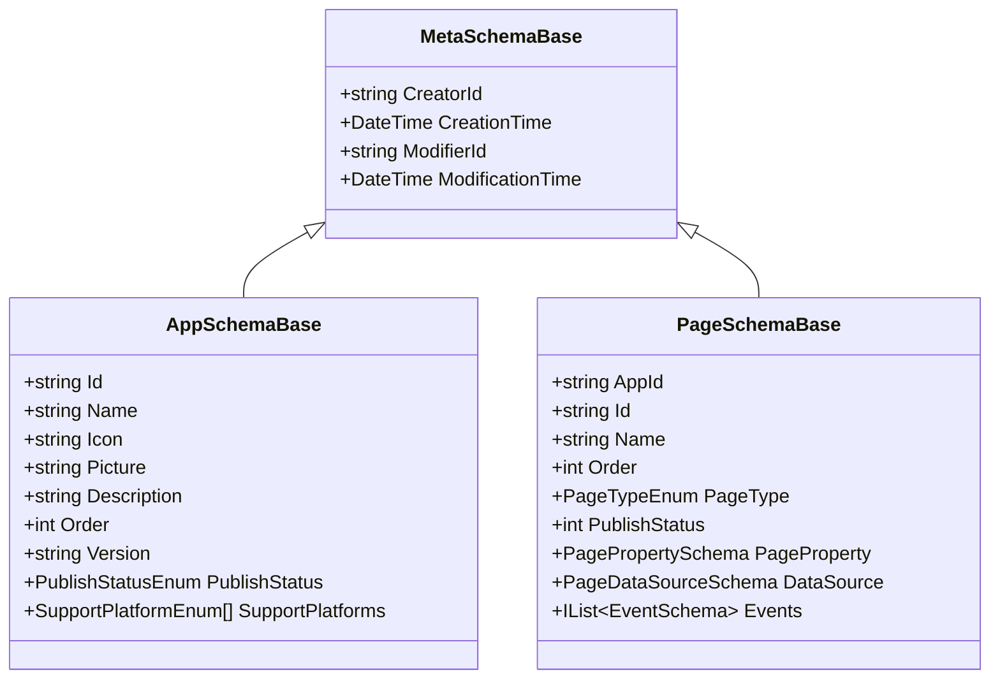

**图表来源**
- [MetaSchemaBase.cs:1-18](file://src/LowCode/Common/H.LowCode.MetaSchema/MetaSchemaBase.cs#L1-L18)
- [AppSchemaBase.cs:1-31](file://src/LowCode/Common/H.LowCode.MetaSchema/AppSchemaBase.cs#L1-L31)
- [PageSchemaBase.cs:1-40](file://src/LowCode/Common/H.LowCode.MetaSchema/PageSchemaBase.cs#L1-L40)

**章节来源**
- [MetaSchemaBase.cs:1-18](file://src/LowCode/Common/H.LowCode.MetaSchema/MetaSchemaBase.cs#L1-L18)
- [AppSchemaBase.cs:1-31](file://src/LowCode/Common/H.LowCode.MetaSchema/AppSchemaBase.cs#L1-L31)
- [PageSchemaBase.cs:1-40](file://src/LowCode/Common/H.LowCode.MetaSchema/PageSchemaBase.cs#L1-L40)

### 组件元数据标准结构
组件元数据是低代码平台的核心契约，描述组件实例在设计与运行时的全部可配置信息。

| 类别 | 关键字段 | 含义与用途 |
|---|---|---|
| 基础信息 | id、pid、n、lb、ct | 组件实例标识、父节点、内部名称、显示标签、组件类型（原子/组合） |
| 容器特性 | container、incontainer | 是否容器、是否为内部容器（影响布局与数据源支持） |
| 数据源支持 | sptds | 是否支持数据源；容器组件强制不支持 |
| 样式 | stl.itemw、stl.itemh、stl.labelw、stl.defaultstyle、stl.customstyle | 宽度、高度、标签宽度、默认样式、自定义样式 |
| 事件 | evs、evcs | 事件定义与消费映射，支持目标动作、脚本语言与内容、数据操作 |
| 校验规则 | valrules | 必填、长度、数值范围、正则、邮箱、手机、URL、身份证、自定义表达式 |
| 显示条件 | vcond | 值表达式、比较操作符、期望表达式，用于显隐联动 |
| 版本与描述 | v、desc | 组件版本与说明 |

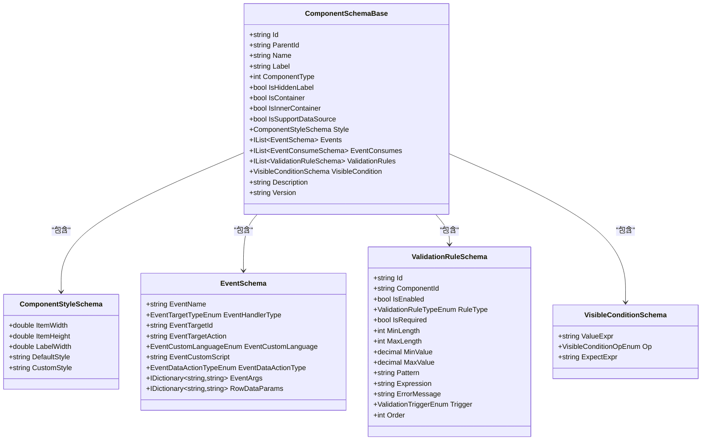

**图表来源**
- [ComponentSchemaBase.cs:1-110](file://src/LowCode/Common/H.LowCode.MetaSchema/ComponentSchemaBase.cs#L1-L110)
- [ComponentStyleSchema.cs:1-38](file://src/LowCode/Common/H.LowCode.MetaSchema/PropertySchemas/ComponentStyleSchema.cs#L1-L38)
- [EventSchema.cs:1-66](file://src/LowCode/Common/H.LowCode.MetaSchema/PropertySchemas/EventSchema.cs#L1-L66)
- [ValidationRuleSchema.cs:1-172](file://src/LowCode/Common/H.LowCode.MetaSchema/PropertySchemas/ValidationRuleSchema.cs#L1-L172)
- [VisibleConditionSchema.cs:1-49](file://src/LowCode/Common/H.LowCode.MetaSchema/PropertySchemas/VisibleConditionSchema.cs#L1-L49)

**章节来源**
- [ComponentSchemaBase.cs:1-110](file://src/LowCode/Common/H.LowCode.MetaSchema/ComponentSchemaBase.cs#L1-L110)
- [ComponentStyleSchema.cs:1-38](file://src/LowCode/Common/H.LowCode.MetaSchema/PropertySchemas/ComponentStyleSchema.cs#L1-L38)
- [EventSchema.cs:1-66](file://src/LowCode/Common/H.LowCode.MetaSchema/PropertySchemas/EventSchema.cs#L1-L66)
- [ValidationRuleSchema.cs:1-172](file://src/LowCode/Common/H.LowCode.MetaSchema/PropertySchemas/ValidationRuleSchema.cs#L1-L172)
- [VisibleConditionSchema.cs:1-49](file://src/LowCode/Common/H.LowCode.MetaSchema/PropertySchemas/VisibleConditionSchema.cs#L1-L49)

### 数据源与菜单模型
- 数据源模型支持表结构、API 接口、选项集合等多种类型，并提供软删除开关、字典映射等扩展能力。
- 菜单模型支持父子层级、类型区分（菜单/目录）、路径与图标，用于导航构建。

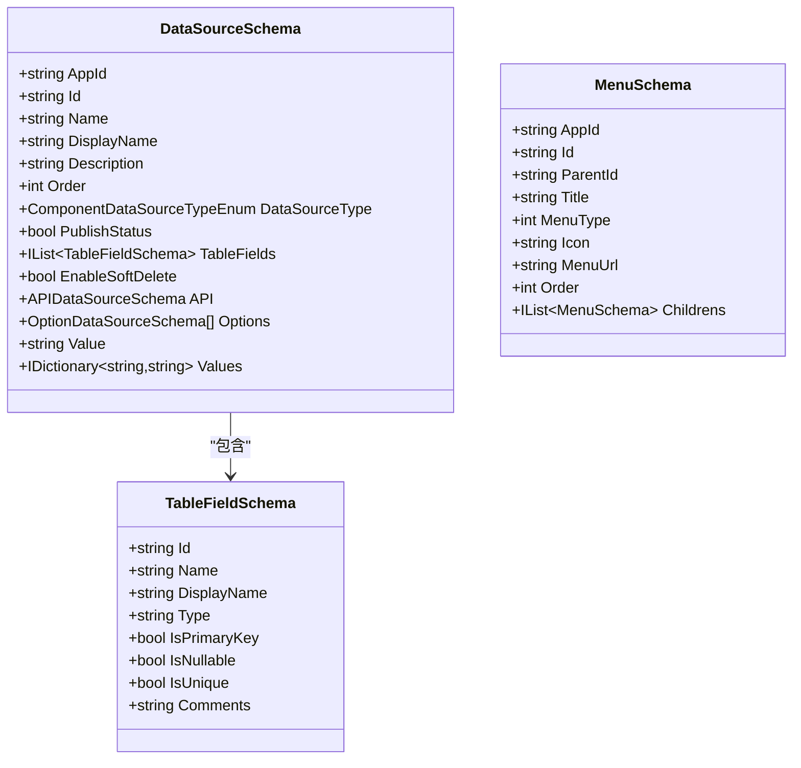

**图表来源**
- [DataSourceSchema.cs:1-69](file://src/LowCode/Common/H.LowCode.MetaSchema/DataSourceSchema.cs#L1-L69)
- [MenuSchema.cs:1-37](file://src/LowCode/Common/H.LowCode.MetaSchema/MenuSchema.cs#L1-L37)
- [TableFieldSchema.cs:1-33](file://src/LowCode/Common/H.LowCode.MetaSchema/DataSourceSchemas/TableFieldSchema.cs#L1-L33)

**章节来源**
- [DataSourceSchema.cs:1-69](file://src/LowCode/Common/H.LowCode.MetaSchema/DataSourceSchema.cs#L1-L69)
- [MenuSchema.cs:1-37](file://src/LowCode/Common/H.LowCode.MetaSchema/MenuSchema.cs#L1-L37)
- [TableFieldSchema.cs:1-33](file://src/LowCode/Common/H.LowCode.MetaSchema/DataSourceSchemas/TableFieldSchema.cs#L1-L33)

## 组件生命周期数据流
组件从开发到使用的数据流分为以下阶段：
1. **组件定义**：开发者编写 Blazor 组件，遵循组件基类约定，声明属性、事件、插槽与样式行为。
2. **元数据注册**：通过组件元数据模型描述组件的基础信息、属性定义、事件定义、样式配置、显示条件、校验规则与数据源支持。
3. **属性面板生成**：设计引擎根据元数据生成可视化属性编辑器，包括基本属性、事件绑定、样式设置与数据源选择。
4. **渲染器适配**：渲染引擎根据组件类型与页面类型，选择对应的渲染器（普通页面、表单页面、表格页面），再按组件元数据构造组件树。
5. **运行时加载**：动态组件基类负责按需加载组件、解析依赖、注入上下文与主题，最终输出 DOM。

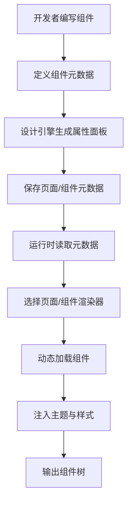

**图表来源**
- [ComponentSchemaBase.cs:1-110](file://src/LowCode/Common/H.LowCode.MetaSchema/ComponentSchemaBase.cs#L1-L110)
- [ComponentRender.razor](file://src/LowCode/RenderEngine/H.LowCode.RenderEngine/ComponentRender/ComponentRender.razor)
- [RenderEngineDynamicComponentBase.cs](file://src/LowCode/RenderEngine/H.LowCode.RenderEngineBase/RenderEngineDynamicComponentBase.cs)
- [ThemePartLayoutBase.cs](file://src/LowCode/RenderEngine/H.LowCode.RenderEngineBase/Layout/ThemePartLayoutBase.cs)

**章节来源**
- [ComponentSchemaBase.cs:1-110](file://src/LowCode/Common/H.LowCode.MetaSchema/ComponentSchemaBase.cs#L1-L110)
- [ComponentRender.razor](file://src/LowCode/RenderEngine/H.LowCode.RenderEngine/ComponentRender/ComponentRender.razor)
- [RenderEngineDynamicComponentBase.cs](file://src/LowCode/RenderEngine/H.LowCode.RenderEngineBase/RenderEngineDynamicComponentBase.cs)
- [ThemePartLayoutBase.cs](file://src/LowCode/RenderEngine/H.LowCode.RenderEngineBase/Layout/ThemePartLayoutBase.cs)

## 渲染器适配与动态加载机制
### 页面渲染器
渲染引擎提供多种页面渲染器，分别对应不同业务场景：
- 普通页面渲染器：承载自由布局与组件树。
- 表单页面渲染器：聚焦表单控件、数据绑定与校验。
- 表格页面渲染器：侧重表格数据展示、筛选与分页。

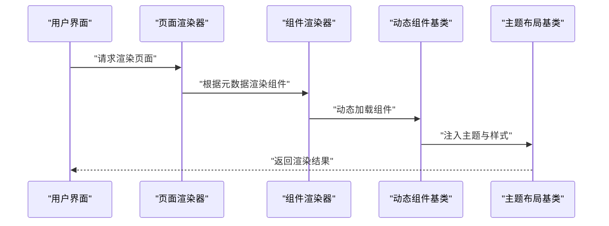

**图表来源**
- [NormalPageRender.razor](file://src/LowCode/RenderEngine/H.LowCode.RenderEngine/PageRender/NormalPageRender.razor)
- [FormPageRender.razor](file://src/LowCode/RenderEngine/H.LowCode.RenderEngine/PageRender/FormPageRender.razor)
- [TablePageRender.razor](file://src/LowCode/RenderEngine/H.LowCode.RenderEngine/PageRender/TablePageRender.razor)
- [ComponentRender.razor](file://src/LowCode/RenderEngine/H.LowCode.RenderEngine/ComponentRender/ComponentRender.razor)
- [RenderEngineDynamicComponentBase.cs](file://src/LowCode/RenderEngine/H.LowCode.RenderEngineBase/RenderEngineDynamicComponentBase.cs)
- [ThemePartLayoutBase.cs](file://src/LowCode/RenderEngine/H.LowCode.RenderEngineBase/Layout/ThemePartLayoutBase.cs)

### 组件动态加载流程
动态组件基类负责：
- 根据组件标识查找已注册组件类型。
- 按需加载组件程序集与资源。
- 注入页面上下文、应用状态、数据源与主题。
- 处理条件渲染与事件回调。

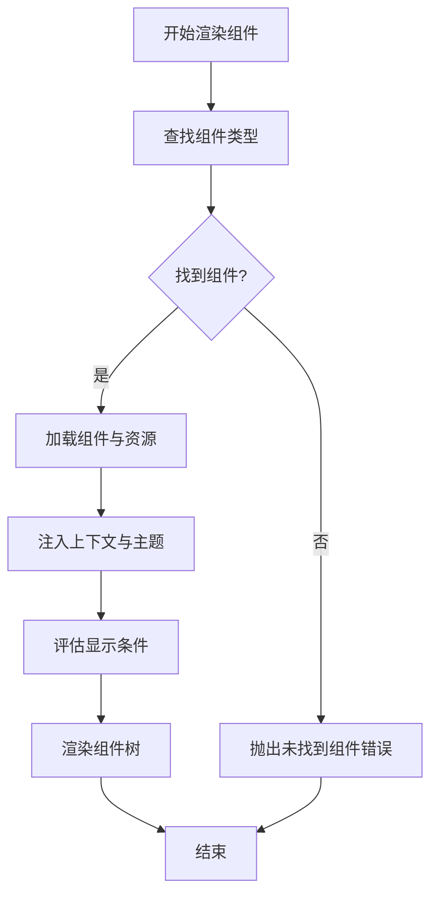

**图表来源**
- [RenderEngineDynamicComponentBase.cs](file://src/LowCode/RenderEngine/H.LowCode.RenderEngineBase/RenderEngineDynamicComponentBase.cs)
- [LowCodeDynamicComponentBase.cs](file://src/LowCode/Common/H.LowCode.ComponentBase/LowCodeDynamicComponentBase.cs)
- [Conditional.razor](file://src/LowCode/Common/H.LowCode.ComponentBase/Components/Conditional.razor)
- [ComponentSchemaBase.cs:1-110](file://src/LowCode/Common/H.LowCode.MetaSchema/ComponentSchemaBase.cs#L1-L110)

**章节来源**
- [NormalPageRender.razor](file://src/LowCode/RenderEngine/H.LowCode.RenderEngine/PageRender/NormalPageRender.razor)
- [FormPageRender.razor](file://src/LowCode/RenderEngine/H.LowCode.RenderEngine/PageRender/FormPageRender.razor)
- [TablePageRender.razor](file://src/LowCode/RenderEngine/H.LowCode.RenderEngine/PageRender/TablePageRender.razor)
- [ComponentRender.razor](file://src/LowCode/RenderEngine/H.LowCode.RenderEngine/ComponentRender/ComponentRender.razor)
- [RenderEngineDynamicComponentBase.cs](file://src/LowCode/RenderEngine/H.LowCode.RenderEngineBase/RenderEngineDynamicComponentBase.cs)
- [LowCodeDynamicComponentBase.cs](file://src/LowCode/Common/H.LowCode.ComponentBase/LowCodeDynamicComponentBase.cs)
- [Conditional.razor](file://src/LowCode/Common/H.LowCode.ComponentBase/Components/Conditional.razor)
- [ComponentSchemaBase.cs:1-110](file://src/LowCode/Common/H.LowCode.MetaSchema/ComponentSchemaBase.cs#L1-L110)

## 属性面板生成与事件处理
### 属性面板
设计引擎依据组件元数据生成属性面板，支持：
- 基本属性编辑：名称、标签、宽度、高度、标签宽度等。
- 事件定义与绑定：目标动作、脚本语言、脚本内容、数据操作类型、参数映射。
- 样式设置：默认样式与自定义样式。
- 校验规则：必填、长度、数值范围、正则、触发时机。
- 显示条件：值表达式、比较操作符、期望表达式。

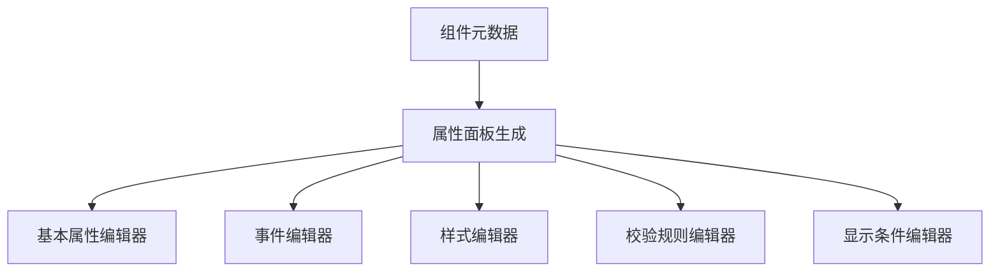

**图表来源**
- [ComponentSchemaBase.cs:1-110](file://src/LowCode/Common/H.LowCode.MetaSchema/ComponentSchemaBase.cs#L1-L110)
- [EventSchema.cs:1-66](file://src/LowCode/Common/H.LowCode.MetaSchema/PropertySchemas/EventSchema.cs#L1-L66)
- [ComponentStyleSchema.cs:1-38](file://src/LowCode/Common/H.LowCode.MetaSchema/PropertySchemas/ComponentStyleSchema.cs#L1-L38)
- [ValidationRuleSchema.cs:1-172](file://src/LowCode/Common/H.LowCode.MetaSchema/PropertySchemas/ValidationRuleSchema.cs#L1-L172)
- [VisibleConditionSchema.cs:1-49](file://src/LowCode/Common/H.LowCode.MetaSchema/PropertySchemas/VisibleConditionSchema.cs#L1-L49)

### 事件处理
事件元数据支持：
- 标准事件：指定目标组件 ID 与目标动作。
- 自定义脚本：选择脚本语言并编写脚本内容。
- 数据操作事件：执行增删改查等操作。
- 参数映射：行数据字段到 URL 参数的映射。

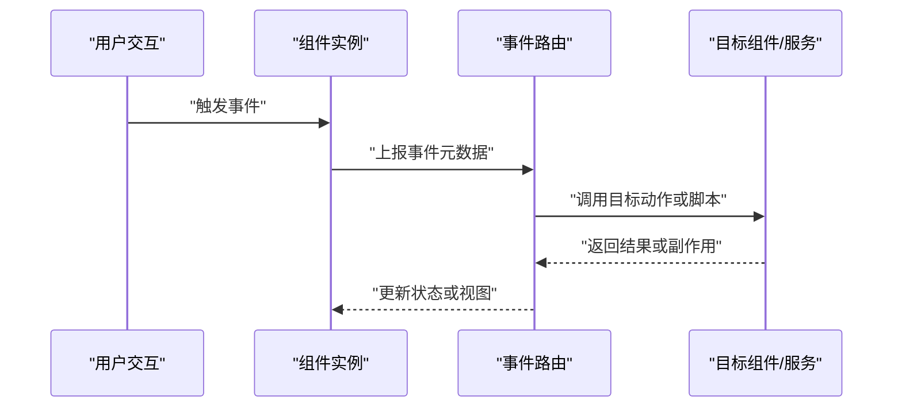

**图表来源**
- [EventSchema.cs:1-66](file://src/LowCode/Common/H.LowCode.MetaSchema/PropertySchemas/EventSchema.cs#L1-L66)
- [ComponentSchemaBase.cs:1-110](file://src/LowCode/Common/H.LowCode.MetaSchema/ComponentSchemaBase.cs#L1-L110)

**章节来源**
- [ComponentSchemaBase.cs:1-110](file://src/LowCode/Common/H.LowCode.MetaSchema/ComponentSchemaBase.cs#L1-L110)
- [EventSchema.cs:1-66](file://src/LowCode/Common/H.LowCode.MetaSchema/PropertySchemas/EventSchema.cs#L1-L66)
- [ComponentStyleSchema.cs:1-38](file://src/LowCode/Common/H.LowCode.MetaSchema/PropertySchemas/ComponentStyleSchema.cs#L1-L38)
- [ValidationRuleSchema.cs:1-172](file://src/LowCode/Common/H.LowCode.MetaSchema/PropertySchemas/ValidationRuleSchema.cs#L1-L172)
- [VisibleConditionSchema.cs:1-49](file://src/LowCode/Common/H.LowCode.MetaSchema/PropertySchemas/VisibleConditionSchema.cs#L1-L49)

## 主题系统与样式集成
渲染引擎通过主题布局基类为组件提供统一的样式环境，支持：
- 样式隔离：避免全局样式污染。
- CSS 变量：使用主题变量控制颜色、字体、间距等。
- 主题切换响应：动态更新组件外观。

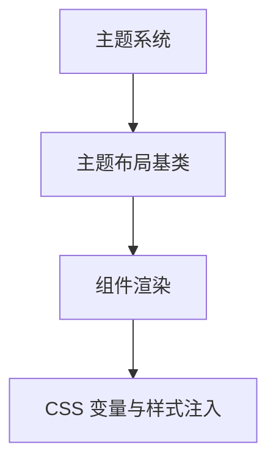

**图表来源**
- [ThemePartLayoutBase.cs](file://src/LowCode/RenderEngine/H.LowCode.RenderEngineBase/Layout/ThemePartLayoutBase.cs)
- [ComponentStyleSchema.cs:1-38](file://src/LowCode/Common/H.LowCode.MetaSchema/PropertySchemas/ComponentStyleSchema.cs#L1-L38)

**章节来源**
- [ThemePartLayoutBase.cs](file://src/LowCode/RenderEngine/H.LowCode.RenderEngineBase/Layout/ThemePartLayoutBase.cs)
- [ComponentStyleSchema.cs:1-38](file://src/LowCode/Common/H.LowCode.MetaSchema/PropertySchemas/ComponentStyleSchema.cs#L1-L38)

## 自定义组件开发指南
### 组件基类使用
- 继承组件基类以获得通用状态、上下文与生命周期钩子。
- 使用动态组件基类接入渲染引擎的动态加载与主题注入。
- 在组件中声明属性、事件、插槽与样式行为，使其与元数据模型保持一致。

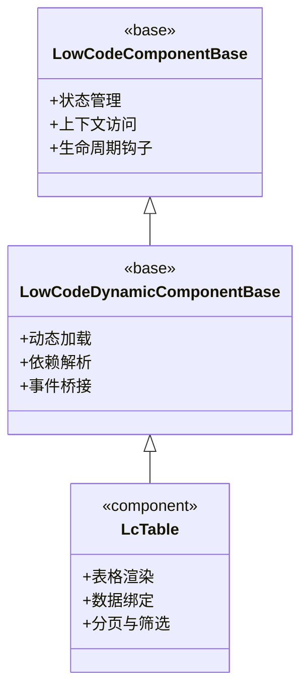

**图表来源**
- [LowCodeComponentBase.cs](file://src/LowCode/Common/H.LowCode.ComponentBase/LowCodeComponentBase.cs)
- [LowCodeDynamicComponentBase.cs](file://src/LowCode/Common/H.LowCode.ComponentBase/LowCodeDynamicComponentBase.cs)
- [LcTable.razor](file://src/LowCode/Common/H.LowCode.Components/Components/LcTable.razor)

### 元数据定义
- 为组件定义基础信息、属性、事件、样式、校验规则与显示条件。
- 明确是否容器、是否支持数据源、是否隐藏标题等特性。
- 使用统一的 JSON 键名，确保序列化与反序列化一致性。

### 测试方法
- 单元测试：验证组件属性渲染、事件触发、校验规则生效。
- 集成测试：验证页面渲染器对组件树的组装与主题注入。
- 元数据校验：验证元数据结构的完整性与合法性。

### 发布流程
- 打包组件程序集与资源。
- 注册组件元数据至设计引擎与渲染引擎。
- 发布应用时包含组件包，并在运行时按需加载。

**章节来源**
- [LowCodeComponentBase.cs](file://src/LowCode/Common/H.LowCode.ComponentBase/LowCodeComponentBase.cs)
- [LowCodeDynamicComponentBase.cs](file://src/LowCode/Common/H.LowCode.ComponentBase/LowCodeDynamicComponentBase.cs)
- [LcTable.razor](file://src/LowCode/Common/H.LowCode.Components/Components/LcTable.razor)
- [ComponentSchemaBase.cs:1-110](file://src/LowCode/Common/H.LowCode.MetaSchema/ComponentSchemaBase.cs#L1-L110)

## 依赖关系分析
低代码平台的依赖关系呈现分层清晰、职责单一的特点：
- 元数据模式层被设计引擎与渲染引擎共同依赖。
- 渲染引擎依赖动态组件基类与主题布局基类。
- 公共组件基类为内置组件与自定义组件提供基础能力。
- 内置组件作为示例，演示如何遵循元数据规范实现。

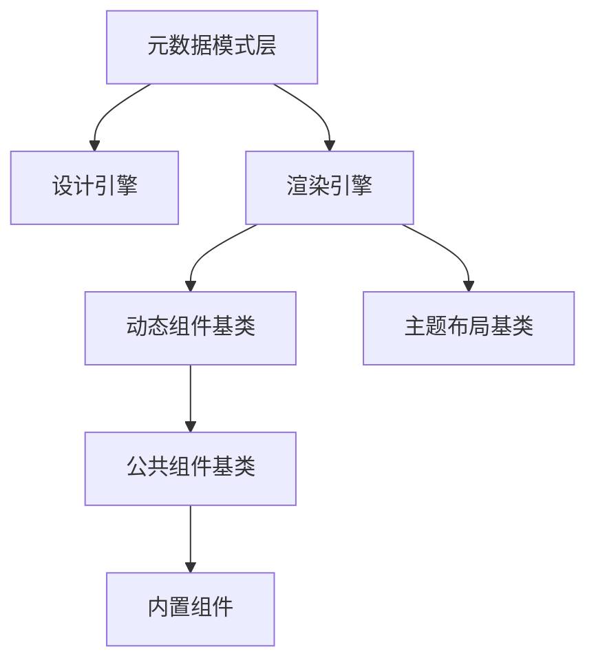

**图表来源**
- [ComponentSchemaBase.cs:1-110](file://src/LowCode/Common/H.LowCode.MetaSchema/ComponentSchemaBase.cs#L1-L110)
- [RenderEngineDynamicComponentBase.cs](file://src/LowCode/RenderEngine/H.LowCode.RenderEngineBase/RenderEngineDynamicComponentBase.cs)
- [ThemePartLayoutBase.cs](file://src/LowCode/RenderEngine/H.LowCode.RenderEngineBase/Layout/ThemePartLayoutBase.cs)
- [LowCodeComponentBase.cs](file://src/LowCode/Common/H.LowCode.ComponentBase/LowCodeComponentBase.cs)
- [LcTable.razor](file://src/LowCode/Common/H.LowCode.Components/Components/LcTable.razor)

**章节来源**
- [ComponentSchemaBase.cs:1-110](file://src/LowCode/Common/H.LowCode.MetaSchema/ComponentSchemaBase.cs#L1-L110)
- [RenderEngineDynamicComponentBase.cs](file://src/LowCode/RenderEngine/H.LowCode.RenderEngineBase/RenderEngineDynamicComponentBase.cs)
- [ThemePartLayoutBase.cs](file://src/LowCode/RenderEngine/H.LowCode.RenderEngineBase/Layout/ThemePartLayoutBase.cs)
- [LowCodeComponentBase.cs](file://src/LowCode/Common/H.LowCode.ComponentBase/LowCodeComponentBase.cs)
- [LcTable.razor](file://src/LowCode/Common/H.LowCode.Components/Components/LcTable.razor)

## 性能优化策略
- 虚拟化渲染：对大型列表与表格采用虚拟滚动，减少 DOM 节点数量，提升渲染性能。
- 状态管理：使用统一的应用状态对象管理组件状态，避免重复计算与不必要的重渲染。
- 内存泄漏防护：在组件销毁时取消订阅事件、清理定时器与释放资源引用。
- 按需加载：组件与资源按需加载，减少首屏体积与初始化时间。
- 条件渲染：基于显示条件提前判断是否渲染组件，降低无效渲染开销。
- 样式隔离：使用局部样式与 CSS 变量，避免全局样式冲突导致的重排与重绘。

[本节为通用指导，不直接分析具体文件]

## 故障排查指南
- 组件未找到：检查组件标识是否在元数据中正确注册，动态加载逻辑是否能解析组件类型。
- 事件未触发：确认事件元数据中的目标动作与脚本配置是否正确，事件路由是否正常转发。
- 样式异常：检查主题布局是否正确注入，CSS 变量是否生效，默认样式与自定义样式是否存在冲突。
- 校验失败：核对校验规则的类型、触发时机与消息配置，确保表达式语法合法。
- 显示条件不生效：验证值表达式与期望表达式的求值结果，确认比较操作符是否符合预期。

**章节来源**
- [ComponentSchemaBase.cs:1-110](file://src/LowCode/Common/H.LowCode.MetaSchema/ComponentSchemaBase.cs#L1-L110)
- [EventSchema.cs:1-66](file://src/LowCode/Common/H.LowCode.MetaSchema/PropertySchemas/EventSchema.cs#L1-L66)
- [ComponentStyleSchema.cs:1-38](file://src/LowCode/Common/H.LowCode.MetaSchema/PropertySchemas/ComponentStyleSchema.cs#L1-L38)
- [ValidationRuleSchema.cs:1-172](file://src/LowCode/Common/H.LowCode.MetaSchema/PropertySchemas/ValidationRuleSchema.cs#L1-L172)
- [VisibleConditionSchema.cs:1-49](file://src/LowCode/Common/H.LowCode.MetaSchema/PropertySchemas/VisibleConditionSchema.cs#L1-L49)

## 结论
本文件系统梳理了低代码平台组件库的数据流与架构，明确了组件元数据的标准结构、渲染器的适配机制与动态加载流程，并给出了属性面板生成、事件处理、主题集成与自定义组件开发的实践建议。通过遵循统一元数据契约、合理使用基类与渲染器、实施性能优化与故障排查，团队可以高效构建、维护与扩展低代码组件生态。