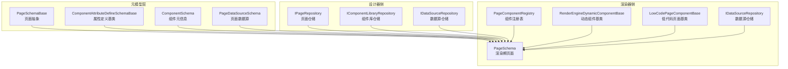
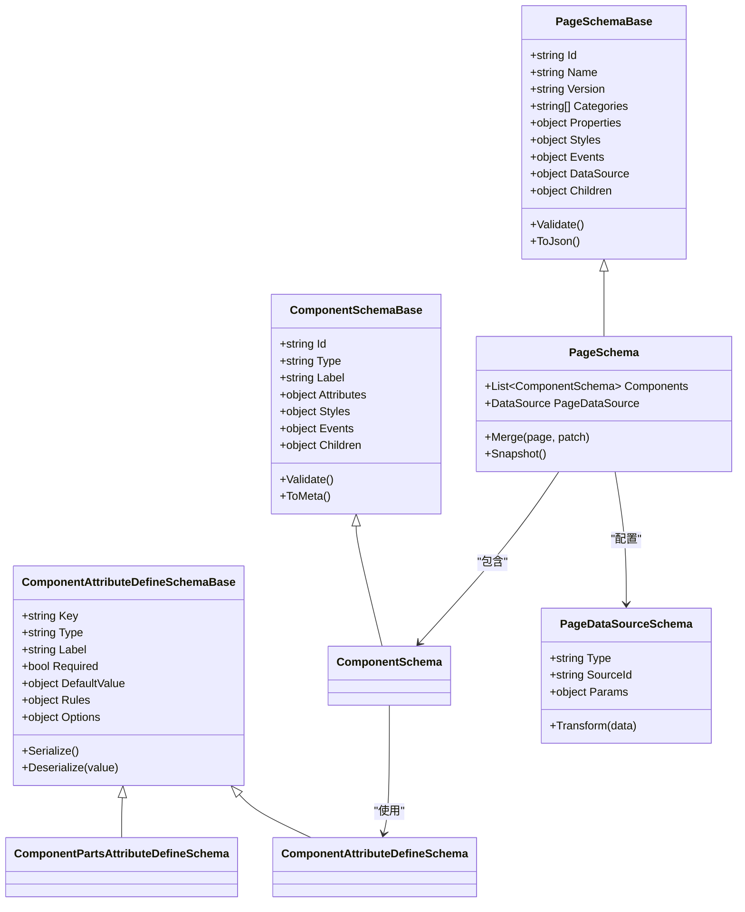
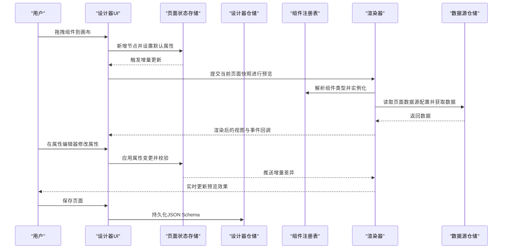
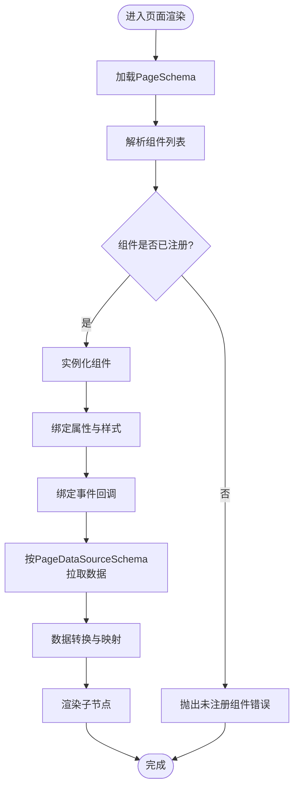
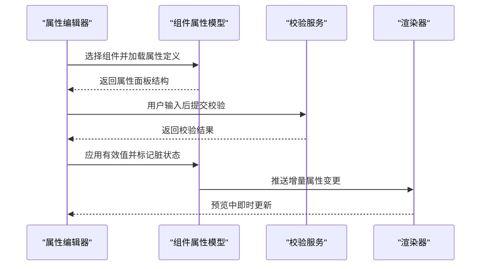
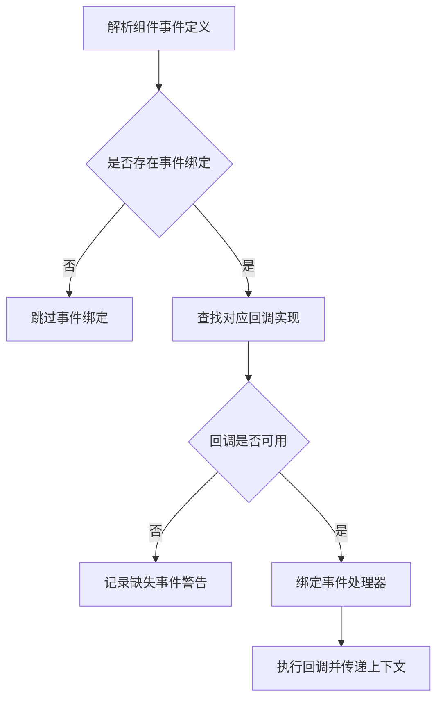
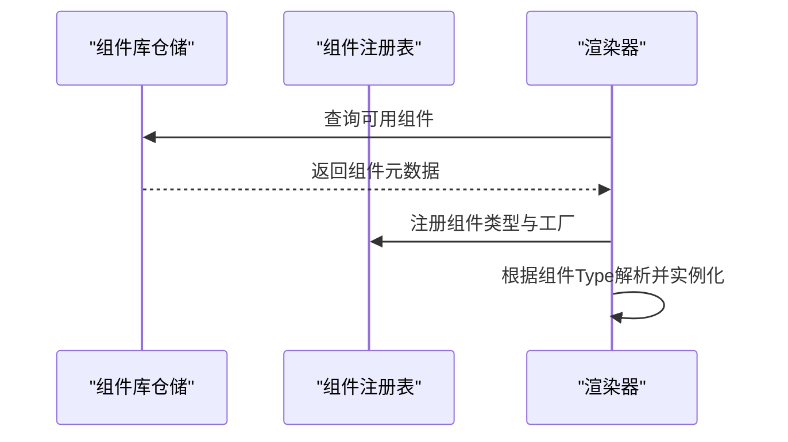
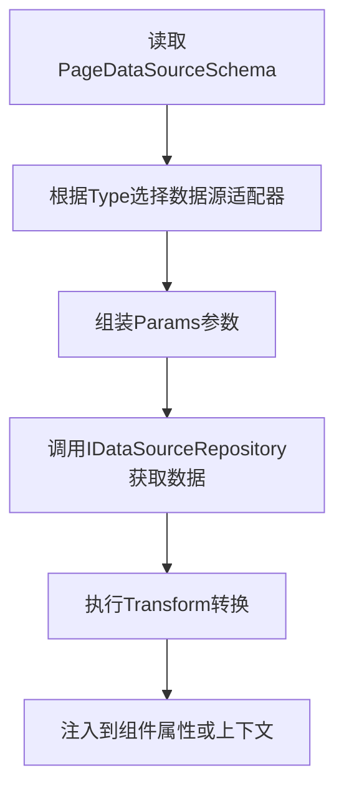
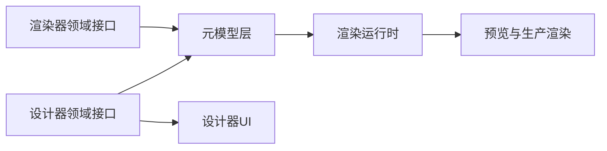

# 设计器数据流

<cite>
**本文引用的文件**   
- [PageSchemaBase.cs](file://src/src/LowCode/Common/H.LowCode.MetaSchema/PageSchemaBase.cs)
- [ComponentAttributeDefineSchemaBase.cs](file://src/src/LowCode/Common/H.LowCode.MetaSchema/PropertySchemas/ComponentAttributeDefineSchemaBase.cs)
- [ComponentPartsAttributeDefineSchema.cs](file://src/src/LowCode/Common/H.LowCode.MetaSchema.DesignEngine/PropertySchemas/ComponentPartsAttributeDefineSchema.cs)
- [ComponentAttributeDefineSchema.cs](file://src/src/LowCode/Common/H.LowCode.MetaSchema.RenderEngine/PropertySchemas/ComponentAttributeDefineSchema.cs)
- [PageSchema.cs](file://src/src/LowCode/Common/H.LowCode.MetaSchema.RenderEngine/PageSchema.cs)
- [ComponentSchema.cs](file://src/src/LowCode/Common/H.LowCode.MetaSchema.RenderEngine/ComponentSchema.cs)
- [PageDataSourceSchema.cs](file://src/src/LowCode/Common/H.LowCode.MetaSchema/DataSourceSchemas/PageDataSourceSchema.cs)
- [RenderEngineDynamicComponentBase.cs](file://src/src/LowCode/RenderEngine/H.LowCode.RenderEngineBase/RenderEngineDynamicComponentBase.cs)
- [PageComponentRegistry.cs](file://src/src/LowCode/RenderEngine/H.LowCode.RenderEngineBase/PageComponentRegistry.cs)
- [LowCodePageComponentBase.cs](file://src/src/LowCode/Common/H.LowCode.ComponentBase/LowCodePageComponentBase.cs)
- [IDataSourceRepository.cs（设计器领域）](file://src/src/LowCode/DesignEngine/H.LowCode.DesignEngine.Domain/MetaRepositories/IDataSourceRepository.cs)
- [IPageRepository.cs（设计器领域）](file://src/src/LowCode/DesignEngine/H.LowCode.DesignEngine.Domain/MetaRepositories/IPageRepository.cs)
- [IComponentLibraryRepository.cs（设计器领域）](file://src/src/LowCode/DesignEngine/H.LowCode.DesignEngine.Domain/PartsRepositories/IComponentLibraryRepository.cs)
- [IDataSourceRepository.cs（渲染器领域）](file://src/src/LowCode/RenderEngine/H.LowCode.RenderEngine.Domain/MetaRepositories/IDataSourceRepository.cs)
- [IPageRepository.cs（渲染器领域）](file://src/src/LowCode/RenderEngine/H.LowCode.RenderEngine.Domain/MetaRepositories/IPageRepository.cs)
- [FormValidationAppService.cs](file://src/src/LowCode/Common/H.LowCode.Application.Services/FormValidationAppService.cs)
- [IFormValidationAppService.cs](file://src/src/LowCode/Common/H.LowCode.Application.Contracts/AppServices/IFormValidationAppService.cs)
</cite>

## 目录
1. [简介](#简介)
2. [项目结构](#项目结构)
3. [核心数据结构](#核心数据结构)
4. [架构总览](#架构总览)
5. [详细组件分析](#详细组件分析)
6. [依赖关系分析](#依赖关系分析)
7. [性能与优化](#性能与优化)
8. [故障排查](#故障排查)
9. [结论](#结论)
10. [附录：自定义组件开发指南](#附录自定义组件开发指南)

## 简介
本文面向低代码设计器的数据流，聚焦“页面元素在设计器中的完整数据处理过程”。文档从用户拖拽组件到画布开始，贯穿属性编辑器的双向绑定、实时预览更新，直至最终输出 JSON Schema。同时梳理设计器与组件库的交互机制、版本兼容校验思路，以及自定义组件的开发规范与性能优化策略。

## 项目结构
本项目在低代码领域划分为三层职责：
- 元模型层：定义页面、组件、属性、数据源等跨端共享的结构化描述，位于 MetaSchema 相关命名空间。
- 设计器侧：提供页面建模、组件库管理、属性面板与事件绑定的能力，位于 DesignEngine 领域与仓储接口。
- 渲染器侧：将页面元模型渲染为真实 UI 组件，负责动态组件解析、事件分发与运行时数据源访问，位于 RenderEngine 基础与仓储接口。

**图表来源**
- [PageSchemaBase.cs:1-200](file://src/src/LowCode/Common/H.LowCode.MetaSchema/PageSchemaBase.cs#L1-L200)
- [ComponentSchema.cs:1-200](file://src/src/LowCode/Common/H.LowCode.MetaSchema.RenderEngine/ComponentSchema.cs#L1-L200)
- [ComponentAttributeDefineSchemaBase.cs:1-200](file://src/src/LowCode/Common/H.LowCode.MetaSchema/PropertySchemas/ComponentAttributeDefineSchemaBase.cs#L1-L200)
- [PageSchema.cs:1-200](file://src/src/LowCode/Common/H.LowCode.MetaSchema.RenderEngine/PageSchema.cs#L1-L200)
- [PageDataSourceSchema.cs:1-200](file://src/src/LowCode/Common/H.LowCode.MetaSchema/DataSourceSchemas/PageDataSourceSchema.cs#L1-L200)
- [PageComponentRegistry.cs:1-200](file://src/src/LowCode/RenderEngine/H.LowCode.RenderEngineBase/PageComponentRegistry.cs#L1-L200)
- [RenderEngineDynamicComponentBase.cs:1-200](file://src/src/LowCode/RenderEngine/H.LowCode.RenderEngineBase/RenderEngineDynamicComponentBase.cs#L1-L200)
- [LowCodePageComponentBase.cs:1-200](file://src/src/LowCode/Common/H.LowCode.ComponentBase/LowCodePageComponentBase.cs#L1-L200)
- [IPageRepository.cs（设计器领域）:1-200](file://src/src/LowCode/DesignEngine/H.LowCode.DesignEngine.Domain/MetaRepositories/IPageRepository.cs#L1-L200)
- [IComponentLibraryRepository.cs（设计器领域）:1-200](file://src/src/LowCode/DesignEngine/H.LowCode.DesignEngine.Domain/PartsRepositories/IComponentLibraryRepository.cs#L1-L200)
- [IDataSourceRepository.cs（设计器领域）:1-200](file://src/src/LowCode/DesignEngine/H.LowCode.DesignEngine.Domain/MetaRepositories/IDataSourceRepository.cs#L1-L200)
- [IDataSourceRepository.cs（渲染器领域）:1-200](file://src/src/LowCode/RenderEngine/H.LowCode.RenderEngine.Domain/MetaRepositories/IDataSourceRepository.cs#L1-L200)

**章节来源**
- [PageSchemaBase.cs:1-200](file://src/src/LowCode/Common/H.LowCode.MetaSchema/PageSchemaBase.cs#L1-L200)
- [ComponentSchema.cs:1-200](file://src/src/LowCode/Common/H.LowCode.MetaSchema.RenderEngine/ComponentSchema.cs#L1-L200)
- [ComponentAttributeDefineSchemaBase.cs:1-200](file://src/src/LowCode/Common/H.LowCode.MetaSchema/PropertySchemas/ComponentAttributeDefineSchemaBase.cs#L1-L200)
- [PageSchema.cs:1-200](file://src/src/LowCode/Common/H.LowCode.MetaSchema.RenderEngine/PageSchema.cs#L1-L200)
- [PageDataSourceSchema.cs:1-200](file://src/src/LowCode/Common/H.LowCode.MetaSchema/DataSourceSchemas/PageDataSourceSchema.cs#L1-L200)
- [PageComponentRegistry.cs:1-200](file://src/src/LowCode/RenderEngine/H.LowCode.RenderEngineBase/PageComponentRegistry.cs#L1-L200)
- [RenderEngineDynamicComponentBase.cs:1-200](file://src/src/LowCode/RenderEngine/H.LowCode.RenderEngineBase/RenderEngineDynamicComponentBase.cs#L1-L200)
- [LowCodePageComponentBase.cs:1-200](file://src/src/LowCode/Common/H.LowCode.ComponentBase/LowCodePageComponentBase.cs#L1-L200)
- [IPageRepository.cs（设计器领域）:1-200](file://src/src/LowCode/DesignEngine/H.LowCode.DesignEngine.Domain/MetaRepositories/IPageRepository.cs#L1-L200)
- [IComponentLibraryRepository.cs（设计器领域）:1-200](file://src/src/LowCode/DesignEngine/H.LowDesignEngine.Domain/PartsRepositories/IComponentLibraryRepository.cs#L1-L200)
- [IDataSourceRepository.cs（设计器领域）:1-200](file://src/src/LowCode/DesignEngine/H.LowCode.DesignEngine.Domain/MetaRepositories/IDataSourceRepository.cs#L1-L200)
- [IDataSourceRepository.cs（渲染器领域）:1-200](file://src/src/LowCode/RenderEngine/H.LowCode.RenderEngine.Domain/MetaRepositories/IDataSourceRepository.cs#L1-L200)

## 核心数据结构
本节梳理低代码页面的核心数据结构及其关系，包括页面、组件、属性、事件与数据源。

**图表来源**
- [PageSchemaBase.cs:1-200](file://src/src/LowCode/Common/H.LowCode.MetaSchema/PageSchemaBase.cs#L1-L200)
- [ComponentSchema.cs:1-200](file://src/src/LowCode/Common/H.LowCode.MetaSchema.RenderEngine/ComponentSchema.cs#L1-L200)
- [ComponentAttributeDefineSchemaBase.cs:1-200](file://src/src/LowCode/Common/H.LowCode.MetaSchema/PropertySchemas/ComponentAttributeDefineSchemaBase.cs#L1-L200)
- [ComponentPartsAttributeDefineSchema.cs:1-200](file://src/src/LowCode/Common/H.LowCode.MetaSchema.DesignEngine/PropertySchemas/ComponentPartsAttributeDefineSchema.cs#L1-L200)
- [ComponentAttributeDefineSchema.cs:1-200](file://src/src/LowCode/Common/H.LowCode.MetaSchema.RenderEngine/PropertySchemas/ComponentAttributeDefineSchema.cs#L1-L200)
- [PageSchema.cs:1-200](file://src/src/LowCode/Common/H.LowCode.MetaSchema.RenderEngine/PageSchema.cs#L1-L200)
- [PageDataSourceSchema.cs:1-200](file://src/src/LowCode/Common/H.LowCode.MetaSchema/DataSourceSchemas/PageDataSourceSchema.cs#L1-L200)

### 关键说明
- 页面元数据继承自统一的页面基类，提供通用字段如标识、名称、版本、分类、样式、事件与数据源等。
- 组件元数据以类型驱动，支持属性、样式、事件与子节点的树形组合。
- 属性定义分为“设计期”和“运行期”两类：设计期用于生成属性面板；运行期用于渲染时校验与序列化。
- 页面数据源通过统一的数据源模式声明，支持参数化查询与结果转换。

**章节来源**
- [PageSchemaBase.cs:1-200](file://src/src/LowCode/Common/H.LowCode.MetaSchema/PageSchemaBase.cs#L1-L200)
- [ComponentSchema.cs:1-200](file://src/src/LowCode/Common/H.LowCode.MetaSchema.RenderEngine/ComponentSchema.cs#L1-L200)
- [ComponentAttributeDefineSchemaBase.cs:1-200](file://src/src/LowCode/Common/H.LowCode.MetaSchema/PropertySchemas/ComponentAttributeDefineSchemaBase.cs#L1-L200)
- [ComponentPartsAttributeDefineSchema.cs:1-200](file://src/src/LowCode/Common/H.LowCode.MetaSchema.DesignEngine/PropertySchemas/ComponentPartsAttributeDefineSchema.cs#L1-L200)
- [ComponentAttributeDefineSchema.cs:1-200](file://src/src/LowCode/Common/H.LowCode.MetaSchema.RenderEngine/PropertySchemas/ComponentAttributeDefineSchema.cs#L1-L200)
- [PageSchema.cs:1-200](file://src/src/LowCode/Common/H.LowCode.MetaSchema.RenderEngine/PageSchema.cs#L1-L200)
- [PageDataSourceSchema.cs:1-200](file://src/src/LowCode/Common/H.LowCode.MetaSchema/DataSourceSchemas/PageDataSourceSchema.cs#L1-L200)

## 架构总览
低代码平台采用“元模型+设计器+渲染器”的分层架构：
- 元模型层提供稳定、可序列化的页面与组件描述。
- 设计器侧重建模与编辑，包括拖拽、布局、属性面板、事件绑定与组件库管理。
- 渲染器基于元模型动态加载组件，执行事件回调与数据源请求，实现所见即所得的预览与生产环境渲染。

**图表来源**
- [PageSchema.cs:1-200](file://src/src/LowCode/Common/H.LowCode.MetaSchema.RenderEngine/PageSchema.cs#L1-L200)
- [PageComponentRegistry.cs:1-200](file://src/src/LowCode/RenderEngine/H.LowCode.RenderEngineBase/PageComponentRegistry.cs#L1-L200)
- [RenderEngineDynamicComponentBase.cs:1-200](file://src/src/LowCode/RenderEngine/H.LowCode.RenderEngineBase/RenderEngineDynamicComponentBase.cs#L1-L200)
- [IPageRepository.cs（设计器领域）:1-200](file://src/src/LowCode/DesignEngine/H.LowCode.DesignEngine.Domain/MetaRepositories/IPageRepository.cs#L1-L200)
- [IDataSourceRepository.cs（渲染器领域）:1-200](file://src/src/LowCode/RenderEngine/H.LowCode.RenderEngine.Domain/MetaRepositories/IDataSourceRepository.cs#L1-L200)

## 详细组件分析

### 页面元数据与渲染流程
页面元数据由设计期与运行期共同维护。设计期负责创建、编辑与校验；运行期负责解析、合并与快照。

**图表来源**
- [PageSchema.cs:1-200](file://src/src/LowCode/Common/H.LowCode.MetaSchema.RenderEngine/PageSchema.cs#L1-L200)
- [ComponentSchema.cs:1-200](file://src/src/LowCode/Common/H.LowCode.MetaSchema.RenderEngine/ComponentSchema.cs#L1-L200)
- [PageComponentRegistry.cs:1-200](file://src/src/LowCode/RenderEngine/H.LowCode.RenderEngineBase/PageComponentRegistry.cs#L1-L200)
- [RenderEngineDynamicComponentBase.cs:1-200](file://src/src/LowCode/RenderEngine/H.LowCode.RenderEngineBase/RenderEngineDynamicComponentBase.cs#L1-L200)
- [PageDataSourceSchema.cs:1-200](file://src/src/LowCode/Common/H.LowCode.MetaSchema/DataSourceSchemas/PageDataSourceSchema.cs#L1-L200)

**章节来源**
- [PageSchema.cs:1-200](file://src/src/LowCode/Common/H.LowCode.MetaSchema.RenderEngine/PageSchema.cs#L1-L200)
- [ComponentSchema.cs:1-200](file://src/src/LowCode/Common/H.LowCode.MetaSchema.RenderEngine/ComponentSchema.cs#L1-L200)
- [PageComponentRegistry.cs:1-200](file://src/src/LowCode/RenderEngine/H.LowCode.RenderEngineBase/PageComponentRegistry.cs#L1-L200)
- [RenderEngineDynamicComponentBase.cs:1-200](file://src/src/LowCode/RenderEngine/H.LowCode.RenderEngineBase/RenderEngineDynamicComponentBase.cs#L1-L200)
- [PageDataSourceSchema.cs:1-200](file://src/src/LowCode/Common/H.LowCode.MetaSchema/DataSourceSchemas/PageDataSourceSchema.cs#L1-L200)

### 属性编辑器与双向绑定
属性编辑器基于组件属性定义动态生成表单控件，并在变更时触发校验与同步。

**图表来源**
- [ComponentAttributeDefineSchemaBase.cs:1-200](file://src/src/LowCode/Common/H.LowCode.MetaSchema/PropertySchemas/ComponentAttributeDefineSchemaBase.cs#L1-L200)
- [ComponentAttributeDefineSchema.cs:1-200](file://src/src/LowCode/Common/H.LowCode.MetaSchema.RenderEngine/PropertySchemas/ComponentAttributeDefineSchema.cs#L1-L200)
- [ComponentPartsAttributeDefineSchema.cs:1-200](file://src/src/LowCode/Common/H.LowCode.MetaSchema.DesignEngine/PropertySchemas/ComponentPartsAttributeDefineSchema.cs#L1-L200)
- [FormValidationAppService.cs:1-200](file://src/src/LowCode/Common/H.LowCode.Application.Services/FormValidationAppService.cs#L1-L200)
- [IFormValidationAppService.cs:1-200](file://src/src/LowCode/Common/H.LowCode.Application.Contracts/AppServices/IFormValidationAppService.cs#L1-L200)

**章节来源**
- [ComponentAttributeDefineSchemaBase.cs:1-200](file://src/src/LowCode/Common/H.LowCode.MetaSchema/PropertySchemas/ComponentAttributeDefineSchemaBase.cs#L1-L200)
- [ComponentAttributeDefineSchema.cs:1-200](file://src/src/LowCode/Common/H.LowCode.MetaSchema.RenderEngine/PropertySchemas/ComponentAttributeDefineSchema.cs#L1-L200)
- [ComponentPartsAttributeDefineSchema.cs:1-200](file://src/src/LowCode/Common/H.LowCode.MetaSchema.DesignEngine/PropertySchemas/ComponentPartsAttributeDefineSchema.cs#L1-L200)
- [FormValidationAppService.cs:1-200](file://src/src/LowCode/Common/H.LowCode.Application.Services/FormValidationAppService.cs#L1-L200)
- [IFormValidationAppService.cs:1-200](file://src/src/LowCode/Common/H.LowCode.Application.Contracts/AppServices/IFormValidationAppService.cs#L1-L200)

### 事件处理与回调绑定
事件绑定由组件元数据中的事件定义驱动，渲染期将回调函数注入到事件处理器中，确保运行时行为与设计期意图一致。

**图表来源**
- [ComponentSchema.cs:1-200](file://src/src/LowCode/Common/H.LowCode.MetaSchema.RenderEngine/ComponentSchema.cs#L1-L200)
- [RenderEngineDynamicComponentBase.cs:1-200](file://src/src/LowCode/RenderEngine/H.LowCode.RenderEngineBase/RenderEngineDynamicComponentBase.cs#L1-L200)
- [LowCodePageComponentBase.cs:1-200](file://src/src/LowCode/Common/H.LowCode.ComponentBase/LowCodePageComponentBase.cs#L1-L200)

**章节来源**
- [ComponentSchema.cs:1-200](file://src/src/LowCode/Common/H.LowCode.MetaSchema.RenderEngine/ComponentSchema.cs#L1-L200)
- [RenderEngineDynamicComponentBase.cs:1-200](file://src/src/LowCode/RenderEngine/H.LowCode.RenderEngineBase/RenderEngineDynamicComponentBase.cs#L1-L200)
- [LowCodePageComponentBase.cs:1-200](file://src/src/LowCode/Common/H.LowCode.ComponentBase/LowCodePageComponentBase.cs#L1-L200)

### 组件库交互与注册
组件库通过仓储接口暴露组件清单与详情，渲染器通过注册表解析并实例化组件，确保类型安全与可扩展性。

**图表来源**
- [IComponentLibraryRepository.cs（设计器领域）:1-200](file://src/src/LowCode/DesignEngine/H.LowCode.DesignEngine.Domain/PartsRepositories/IComponentLibraryRepository.cs#L1-L200)
- [PageComponentRegistry.cs:1-200](file://src/src/LowCode/RenderEngine/H.LowCode.RenderEngineBase/PageComponentRegistry.cs#L1-L200)
- [ComponentSchema.cs:1-200](file://src/src/LowCode/Common/H.LowCode.MetaSchema.RenderEngine/ComponentSchema.cs#L1-L200)

**章节来源**
- [IComponentLibraryRepository.cs（设计器领域）:1-200](file://src/src/LowCode/DesignEngine/H.LowCode.DesignEngine.Domain/PartsRepositories/IComponentLibraryRepository.cs#L1-L200)
- [PageComponentRegistry.cs:1-200](file://src/src/LowCode/RenderEngine/H.LowCode.RenderEngineBase/PageComponentRegistry.cs#L1-L200)
- [ComponentSchema.cs:1-200](file://src/src/LowCode/Common/H.LowCode.MetaSchema.RenderEngine/ComponentSchema.cs#L1-L200)

### 数据源访问与预览更新
页面数据源由设计期配置，渲染期按类型与参数拉取数据并进行转换，以实现实时预览与生产渲染的一致性。

**图表来源**
- [PageDataSourceSchema.cs:1-200](file://src/src/LowCode/Common/H.LowCode.MetaSchema/DataSourceSchemas/PageDataSourceSchema.cs#L1-L200)
- [IDataSourceRepository.cs（渲染器领域）:1-200](file://src/src/LowCode/RenderEngine/H.LowCode.RenderEngine.Domain/MetaRepositories/IDataSourceRepository.cs#L1-L200)
- [PageSchema.cs:1-200](file://src/src/LowCode/Common/H.LowCode.MetaSchema.RenderEngine/PageSchema.cs#L1-L200)

**章节来源**
- [PageDataSourceSchema.cs:1-200](file://src/src/LowCode/Common/H.LowCode.MetaSchema/DataSourceSchemas/PageDataSourceSchema.cs#L1-L200)
- [IDataSourceRepository.cs（渲染器领域）:1-200](file://src/src/LowCode/RenderEngine/H.LowCode.RenderEngine.Domain/MetaRepositories/IDataSourceRepository.cs#L1-L200)
- [PageSchema.cs:1-200](file://src/src/LowCode/Common/H.LowCode.MetaSchema.RenderEngine/PageSchema.cs#L1-L200)

## 依赖关系分析
设计器与渲染器在元模型层面解耦，通过稳定的数据结构与仓储接口协作。

**图表来源**
- [IPageRepository.cs（设计器领域）:1-200](file://src/src/LowCode/DesignEngine/H.LowCode.DesignEngine.Domain/MetaRepositories/IPageRepository.cs#L1-L200)
- [IDataSourceRepository.cs（设计器领域）:1-200](file://src/src/LowCode/DesignEngine/H.LowCode.DesignEngine.Domain/MetaRepositories/IDataSourceRepository.cs#L1-L200)
- [IPageRepository.cs（渲染器领域）:1-200](file://src/src/LowCode/RenderEngine/H.LowCode.RenderEngine.Domain/MetaRepositories/IPageRepository.cs#L1-L200)
- [IDataSourceRepository.cs（渲染器领域）:1-200](file://src/src/LowCode/RenderEngine/H.LowCode.RenderEngine.Domain/MetaRepositories/IDataSourceRepository.cs#L1-L200)
- [PageSchemaBase.cs:1-200](file://src/src/LowCode/Common/H.LowCode.MetaSchema/PageSchemaBase.cs#L1-L200)

**章节来源**
- [IPageRepository.cs（设计器领域）:1-200](file://src/src/LowCode/DesignEngine/H.LowCode.DesignEngine.Domain/MetaRepositories/IPageRepository.cs#L1-L200)
- [IDataSourceRepository.cs（设计器领域）:1-200](file://src/src/LowCode/DesignEngine/H.LowCode.DesignEngine.Domain/MetaRepositories/IDataSourceRepository.cs#L1-L200)
- [IPageRepository.cs（渲染器领域）:1-200](file://src/src/LowCode/RenderEngine/H.LowCode.RenderEngine.Domain/MetaRepositories/IPageRepository.cs#L1-L200)
- [IDataSourceRepository.cs（渲染器领域）:1-200](file://src/src/LowCode/RenderEngine/H.LowCode.RenderEngine.Domain/MetaRepositories/IDataSourceRepository.cs#L1-L200)
- [PageSchemaBase.cs:1-200](file://src/src/LowCode/Common/H.LowCode.MetaSchema/PageSchemaBase.cs#L1-L200)

## 性能与优化
- 大页面渲染优化
  - 使用虚拟化列表与懒加载子节点，仅在可视区域渲染组件。
  - 对复杂组件进行按需加载，避免一次性构建整个组件树。
- 增量更新机制
  - 属性编辑器仅推送变更的差异，渲染器基于差异进行局部重渲染。
  - 页面快照与补丁分离，减少全量序列化与传输开销。
- 缓存与复用
  - 组件注册表与数据源适配器进行实例级缓存，降低重复初始化成本。
  - 页面模板与常用组件片段进行缓存，加速新建页面。
- 事件批处理
  - 高频事件进行节流与合并，避免频繁触发回调导致界面卡顿。

[本节为通用指导，不直接分析具体文件]

## 故障排查
- 组件未注册
  - 现象：渲染时报错找不到组件类型。
  - 排查：检查组件注册表是否加载了该类型；确认组件库仓储返回的元数据是否正确。
  - 参考路径：[PageComponentRegistry.cs:1-200](file://src/src/LowCode/RenderEngine/H.LowCode.RenderEngineBase/PageComponentRegistry.cs#L1-L200)
- 属性校验失败
  - 现象：属性编辑器无法保存或预览不更新。
  - 排查：确认属性定义中的必填项、规则与选项是否配置正确；校验服务返回的错误信息需在前端提示。
  - 参考路径：[ComponentAttributeDefineSchemaBase.cs:1-200](file://src/src/LowCode/Common/H.LowCode.MetaSchema/PropertySchemas/ComponentAttributeDefineSchemaBase.cs#L1-L200)、[FormValidationAppService.cs:1-200](file://src/src/LowCode/Common/H.LowCode.Application.Services/FormValidationAppService.cs#L1-L200)
- 事件回调缺失
  - 现象：点击组件无响应或控制台报错。
  - 排查：确认事件绑定是否存在且回调实现可被解析；必要时降级为无操作或记录告警。
  - 参考路径：[RenderEngineDynamicComponentBase.cs:1-200](file://src/src/LowCode/RenderEngine/H.LowCode.RenderEngineBase/RenderEngineDynamicComponentBase.cs#L1-L200)
- 数据源不可用
  - 现象：预览数据为空或异常。
  - 排查：检查数据源类型与参数配置；确认仓储接口能成功拉取数据。
  - 参考路径：[PageDataSourceSchema.cs:1-200](file://src/src/LowCode/Common/H.LowCode.MetaSchema/DataSourceSchemas/PageDataSourceSchema.cs#L1-L200)、[IDataSourceRepository.cs（渲染器领域）:1-200](file://src/src/LowCode/RenderEngine/H.LowCode.RenderEngine.Domain/MetaRepositories/IDataSourceRepository.cs#L1-L200)

**章节来源**
- [PageComponentRegistry.cs:1-200](file://src/src/LowCode/RenderEngine/H.LowCode.RenderEngineBase/PageComponentRegistry.cs#L1-L200)
- [ComponentAttributeDefineSchemaBase.cs:1-200](file://src/src/LowCode/Common/H.LowCode.MetaSchema/PropertySchemas/ComponentAttributeDefineSchemaBase.cs#L1-L200)
- [FormValidationAppService.cs:1-200](file://src/src/LowCode/Common/H.LowCode.Application.Services/FormValidationAppService.cs#L1-L200)
- [RenderEngineDynamicComponentBase.cs:1-200](file://src/src/LowCode/RenderEngine/H.LowCode.RenderEngineBase/RenderEngineDynamicComponentBase.cs#L1-L200)
- [PageDataSourceSchema.cs:1-200](file://src/src/LowCode/Common/H.LowCode.MetaSchema/DataSourceSchemas/PageDataSourceSchema.cs#L1-L200)
- [IDataSourceRepository.cs（渲染器领域）:1-200](file://src/src/LowCode/RenderEngine/H.LowCode.RenderEngine.Domain/MetaRepositories/IDataSourceRepository.cs#L1-L200)

## 结论
本设计器数据流以稳定的元模型为核心，通过设计器与渲染器的职责分离，实现了从拖拽、属性编辑、实时预览到最终 JSON Schema 生成的完整闭环。借助仓储接口与组件注册表，系统具备良好的扩展性与可维护性。结合增量更新、缓存与虚拟化等优化手段，可在大规模页面场景下保持良好性能。

[本节为总结性内容，不直接分析具体文件]

## 附录：自定义组件开发指南
- 组件元数据定义
  - 定义组件类型、标签、默认属性、样式与事件。
  - 使用设计期属性定义生成属性面板，使用运行期属性定义进行校验与序列化。
  - 参考路径：
    - [ComponentSchema.cs:1-200](file://src/src/LowCode/Common/H.LowCode.MetaSchema.RenderEngine/ComponentSchema.cs#L1-L200)
    - [ComponentPartsAttributeDefineSchema.cs:1-200](file://src/src/LowCode/Common/H.LowCode.MetaSchema.DesignEngine/PropertySchemas/ComponentPartsAttributeDefineSchema.cs#L1-L200)
    - [ComponentAttributeDefineSchema.cs:1-200](file://src/src/LowCode/Common/H.LowCode.MetaSchema.RenderEngine/PropertySchemas/ComponentAttributeDefineSchema.cs#L1-L200)
- 属性编辑器实现
  - 基于属性定义生成表单控件，支持必填、默认值、选项与规则。
  - 集成校验服务，确保输入合法性。
  - 参考路径：
    - [ComponentAttributeDefineSchemaBase.cs:1-200](file://src/src/LowCode/Common/H.LowCode.MetaSchema/PropertySchemas/ComponentAttributeDefineSchemaBase.cs#L1-L200)
    - [FormValidationAppService.cs:1-200](file://src/src/LowCode/Common/H.LowCode.Application.Services/FormValidationAppService.cs#L1-L200)
- 预览模式下的特殊处理
  - 在预览环境中避免副作用逻辑，使用模拟数据或只读模式。
  - 事件回调可降级为日志或占位实现，防止运行时错误。
  - 参考路径：
    - [RenderEngineDynamicComponentBase.cs:1-200](file://src/src/LowCode/RenderEngine/H.LowCode.RenderEngineBase/RenderEngineDynamicComponentBase.cs#L1-L200)
    - [LowCodePageComponentBase.cs:1-200](file://src/src/LowCode/Common/H.LowCode.ComponentBase/LowCodePageComponentBase.cs#L1-L200)
- 组件注册与可用性
  - 将组件类型注册到注册表，确保渲染器能正确解析与实例化。
  - 参考路径：
    - [PageComponentRegistry.cs:1-200](file://src/src/LowCode/RenderEngine/H.LowCode.RenderEngineBase/PageComponentRegistry.cs#L1-L200)

**章节来源**
- [ComponentSchema.cs:1-200](file://src/src/LowCode/Common/H.LowCode.MetaSchema.RenderEngine/ComponentSchema.cs#L1-L200)
- [ComponentPartsAttributeDefineSchema.cs:1-200](file://src/src/LowCode/Common/H.LowCode.MetaSchema.DesignEngine/PropertySchemas/ComponentPartsAttributeDefineSchema.cs#L1-L200)
- [ComponentAttributeDefineSchema.cs:1-200](file://src/src/LowCode/Common/H.LowCode.MetaSchema.RenderEngine/PropertySchemas/ComponentAttributeDefineSchema.cs#L1-L200)
- [ComponentAttributeDefineSchemaBase.cs:1-200](file://src/src/LowCode/Common/H.LowCode.MetaSchema/PropertySchemas/ComponentAttributeDefineSchemaBase.cs#L1-L200)
- [FormValidationAppService.cs:1-200](file://src/src/LowCode/Common/H.LowCode.Application.Services/FormValidationAppService.cs#L1-L200)
- [RenderEngineDynamicComponentBase.cs:1-200](file://src/src/LowCode/RenderEngine/H.LowCode.RenderEngineBase/RenderEngineDynamicComponentBase.cs#L1-L200)
- [LowCodePageComponentBase.cs:1-200](file://src/src/LowCode/Common/H.LowCode.ComponentBase/LowCodePageComponentBase.cs#L1-L200)
- [PageComponentRegistry.cs:1-200](file://src/src/LowCode/RenderEngine/H.LowCode.RenderEngineBase/PageComponentRegistry.cs#L1-L200)