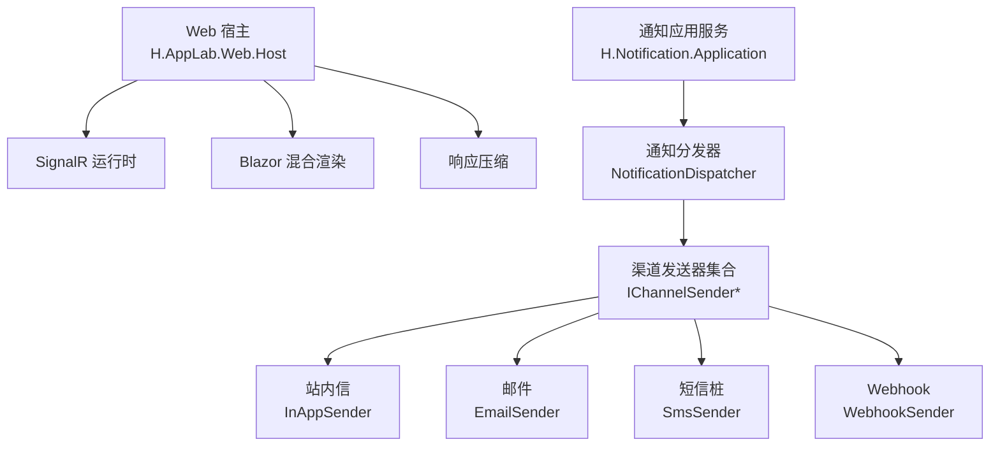
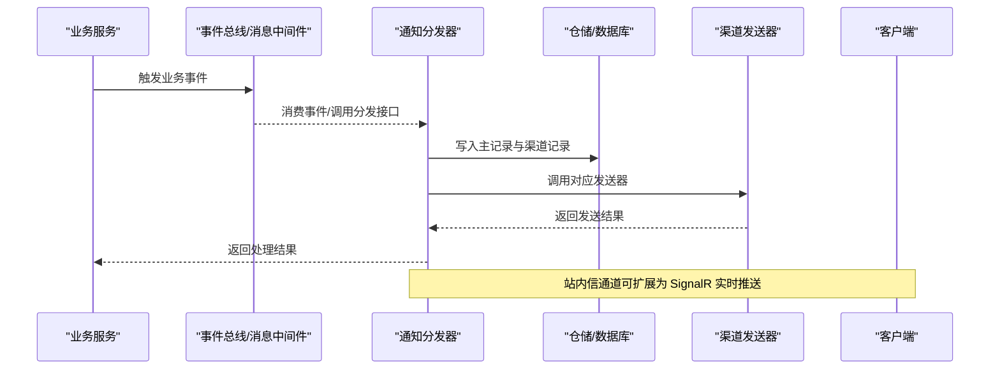
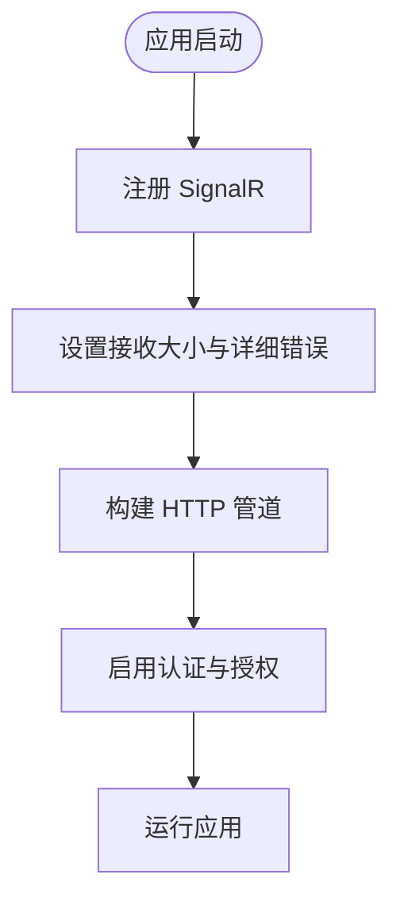
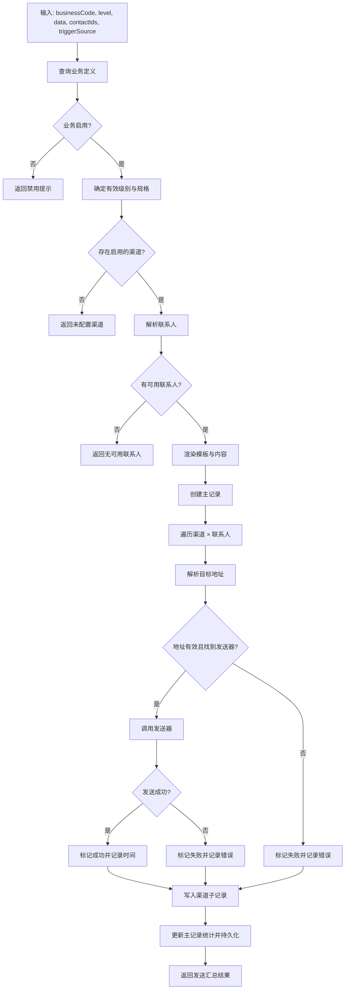
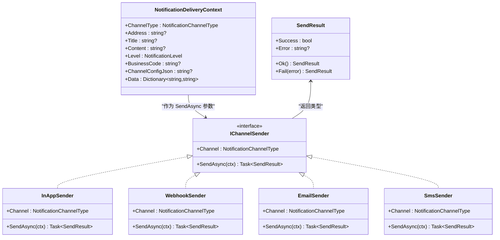
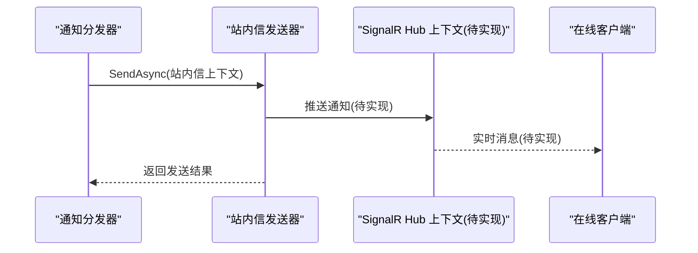
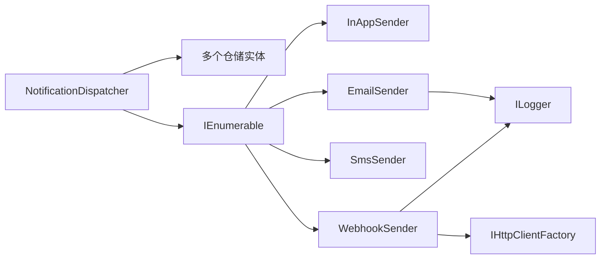

# 实时通信流

<cite>
**本文引用的文件**   
- [Program.cs](file://src/Host/H.AppLab.Web.Host/H.AppLab.Web.Host/Program.cs)
- [IChannelSender.cs](file://src/Services/Notification/H.Notification.Application/Sending/IChannelSender.cs)
- [InAppSender.cs](file://src/Services/Notification/H.Notification.Application/Sending/InAppSender.cs)
- [WebhookSender.cs](file://src/Services/Notification/H.Notification.Application/Sending/WebhookSender.cs)
- [EmailSender.cs](file://src/Services/Notification/H.Notification.Application/Sending/EmailSender.cs)
- [SmsSender.cs](file://src/Services/Notification/H.Notification.Application/Sending/SmsSender.cs)
- [NotificationDispatcher.cs](file://src/Services/Notification/H.Notification.Application/Sending/NotificationDispatcher.cs)
- [OrderAppService.cs](file://src/Services/Order/H.Order.Application/Services/OrderAppService.cs)
</cite>

## 目录
1. [引言](#引言)
2. [项目结构](#项目结构)
3. [核心组件](#核心组件)
4. [架构总览](#架构总览)
5. [详细组件分析](#详细组件分析)
6. [依赖关系分析](#依赖关系分析)
7. [性能与负载均衡](#性能与负载均衡)
8. [故障排查指南](#故障排查指南)
9. [结论](#结论)

## 引言
本文面向“实时通信数据流”，围绕 SignalR 连接建立、消息订阅发布机制、连接管理策略、消息格式规范，以及 Web 与移动端适配方案进行系统化说明。当前仓库在宿主层已启用 SignalR，但尚未发现自定义 Hub 类；通知子系统通过“业务编码 + 级别规格 + 联系人组 + 渠道发送器”的编排完成异步投递，其中站内信通道作为“本地直达通道”是后续接入实时推送的理想扩展点。

## 项目结构
本项目采用多服务模块化结构：
- 宿主服务 H.AppLab.Web.Host 负责 ASP.NET Core 管道、Blazor 混合渲染、SignalR 注册、静态资源压缩等。
- 通知服务 H.Notification.Application 提供通知分发编排与各渠道发送实现（站内信、邮件、短信、Webhook）。
- 其他业务服务（如订单）通过事件总线或外部消息中间件触发业务流程，可在此基础上接入实时通知。

**图示来源**
- [Program.cs:10-21](file://src/Host/H.AppLab.Web.Host/H.AppLab.Web.Host/Program.cs#L10-L21)
- [IChannelSender.cs:1-50](file://src/Services/Notification/H.Notification.Application/Sending/IChannelSender.cs#L1-L50)
- [NotificationDispatcher.cs:1-200](file://src/Services/Notification/H.Notification.Application/Sending/NotificationDispatcher.cs#L1-L200)

**章节来源**
- [Program.cs:1-112](file://src/Host/H.AppLab.Web.Host/H.AppLab.Web.Host/Program.cs#L1-L112)

## 核心组件
- SignalR 基础设施：在宿主中启用 SignalR，设置最大接收消息大小与开发环境详细错误输出。
- 通知分发器：根据业务编码与级别规则解析渠道、联系人、模板，创建主记录与渠道子记录，并调用具体发送器。
- 渠道发送器抽象：统一封装各通道的发送语义，返回成功/失败结果。
- 具体发送器实现：站内信、邮件、短信桩、Webhook。

**章节来源**
- [Program.cs:14-21](file://src/Host/H.AppLab.Web.Host/H.AppLab.Web.Host/Program.cs#L14-L21)
- [NotificationDispatcher.cs:1-200](file://src/Services/Notification/H.Notification.Application/Sending/NotificationDispatcher.cs#L1-L200)
- [IChannelSender.cs:1-50](file://src/Services/Notification/H.Notification.Application/Sending/IChannelSender.cs#L1-L50)

## 架构总览
下图展示从业务侧到通知分发的端到端流程，以及与 SignalR 的关系定位：
- 业务服务通过事件总线或外部消息触发通知分发。
- 分发器将通知落库，并按渠道执行发送。
- 站内信通道可作为“本地直达通道”，未来可扩展为通过 SignalR 向在线用户即时推送。

**图示来源**
- [NotificationDispatcher.cs:1-200](file://src/Services/Notification/H.Notification.Application/Sending/NotificationDispatcher.cs#L1-L200)
- [Program.cs:14-21](file://src/Host/H.AppLab.Web.Host/H.AppLab.Web.Host/Program.cs#L14-L21)

## 详细组件分析

### SignalR 连接建立与配置
- 宿主通过 AddSignalR 注册 SignalR 服务，并设置：
  - MaximumReceiveMessageSize：单条消息最大字节数。
  - EnableDetailedErrors：仅在开发环境启用详细错误信息。
- 当前未发现 MapHub 或自定义 Hub 类，因此尚无显式路由与 Hub 方法。
- 认证授权管线已启用 UseAuthentication 与 UseAuthorization，便于后续基于声明的鉴权。

**图示来源**
- [Program.cs:14-21](file://src/Host/H.AppLab.Web.Host/H.AppLab.Web.Host/Program.cs#L14-L21)
- [Program.cs:70-112](file://src/Host/H.AppLab.Web.Host/H.AppLab.Web.Host/Program.cs#L70-L112)

**章节来源**
- [Program.cs:14-21](file://src/Host/H.AppLab.Web.Host/H.AppLab.Web.Host/Program.cs#L14-L21)
- [Program.cs:70-112](file://src/Host/H.AppLab.Web.Host/H.AppLab.Web.Host/Program.cs#L70-L112)

### 通知分发与消息发布机制
通知分发器负责将业务事件转化为可投递的通知，其核心流程如下：
- 按 businessCode 查询业务定义，校验是否启用。
- 选择有效级别 level，匹配对应的通知规格 specs。
- 解析渠道 channelTypes，并获取启用渠道的配置映射。
- 解析联系人 contacts（支持联系人组）。
- 渲染标题与内容（支持模板），创建主记录。
- 对每个渠道与联系人组合执行发送，生成渠道子记录并统计成功/失败数量。
- 最终持久化主记录并返回汇总结果。

**图示来源**
- [NotificationDispatcher.cs:1-200](file://src/Services/Notification/H.Notification.Application/Sending/NotificationDispatcher.cs#L1-L200)

**章节来源**
- [NotificationDispatcher.cs:1-200](file://src/Services/Notification/H.Notification.Application/Sending/NotificationDispatcher.cs#L1-L200)

### 渠道发送器模型与实现
- 抽象与上下文
  - IChannelSender：定义 Channel 类型与 SendAsync 接口。
  - NotificationDeliveryContext：包含渠道类型、目标地址、标题、内容、级别、业务编码、渠道配置 JSON、附加数据等。
  - SendResult：包含 Success 与 Error 字段，并提供 Ok/Fail 工厂方法。

- 站内信发送器
  - 入参校验：若未配置站内信目标标识则失败。
  - 行为说明：站内信内容随投递记录持久化，无需额外动作。

- Webhook 发送器
  - 使用 HttpClientFactory 创建客户端，POST 请求至配置的地址。
  - 负载结构包含 businessCode、level、title、content、data。
  - 支持从 ChannelConfigJson 解析自定义请求头。
  - 非 2xx 状态码视为失败，异常时记录日志并返回失败结果。

- 邮件发送器
  - 从 ChannelConfigJson 解析 SMTP 配置（Host、Port、UseSsl、UserName、Password、From、FromName）。
  - 校验必要参数后构造 MailMessage 并通过 SmtpClient 发送。
  - 异常时记录日志并返回失败结果。

- 短信发送器
  - 桩实现：仅记录日志并返回成功，预留后续接入短信网关扩展点。

**图示来源**
- [IChannelSender.cs:1-50](file://src/Services/Notification/H.Notification.Application/Sending/IChannelSender.cs#L1-L50)
- [InAppSender.cs:1-23](file://src/Services/Notification/H.Notification.Application/Sending/InAppSender.cs#L1-L23)
- [WebhookSender.cs:1-101](file://src/Services/Notification/H.Notification.Application/Sending/WebhookSender.cs#L1-L101)
- [EmailSender.cs:1-97](file://src/Services/Notification/H.Notification.Application/Sending/EmailSender.cs#L1-L97)
- [SmsSender.cs:1-32](file://src/Services/Notification/H.Notification.Application/Sending/SmsSender.cs#L1-L32)

**章节来源**
- [IChannelSender.cs:1-50](file://src/Services/Notification/H.Notification.Application/Sending/IChannelSender.cs#L1-L50)
- [InAppSender.cs:1-23](file://src/Services/Notification/H.Notification.Application/Sending/InAppSender.cs#L1-L23)
- [WebhookSender.cs:1-101](file://src/Services/Notification/H.Notification.Application/Sending/WebhookSender.cs#L1-L101)
- [EmailSender.cs:1-97](file://src/Services/Notification/H.Notification.Application/Sending/EmailSender.cs#L1-L97)
- [SmsSender.cs:1-32](file://src/Services/Notification/H.Notification.Application/Sending/SmsSender.cs#L1-L32)

### 消息格式规范与协议设计
- 通知上下文
  - 渠道类型：用于路由到具体发送器。
  - 目标地址：邮箱、手机号、Webhook 地址等。
  - 标题/内容：可由模板渲染。
  - 级别：表示通知优先级。
  - 业务编码：关联业务定义与规则。
  - 渠道配置 JSON：各渠道独立配置（如 SMTP、Webhook 头）。
  - 附加数据：键值对扩展字段。

- Webhook 负载结构
  - businessCode：字符串。
  - level：枚举字符串形式。
  - title：字符串。
  - content：字符串。
  - data：键值对象。

- 发送结果
  - success：布尔。
  - error：可选错误信息。

- 错误码约定
  - 当前实现以 SendResult.Error 描述错误原因，未定义全局错误码表；建议在后续扩展中补充标准化错误码。

**章节来源**
- [IChannelSender.cs:1-50](file://src/Services/Notification/H.Notification.Application/Sending/IChannelSender.cs#L1-L50)
- [WebhookSender.cs:40-90](file://src/Services/Notification/H.Notification.Application/Sending/WebhookSender.cs#L40-L90)

### 连接管理与异常恢复
- 当前代码未发现心跳检测、自动重连、断线恢复等连接管理逻辑。
- 建议后续在客户端与服务端分别实现：
  - 服务端：在 Hub 中维护连接生命周期，记录 OnConnectedAsync/OnDisconnectedAsync，结合 Redis/内存字典做跨实例广播。
  - 客户端：实现指数退避重连、超时重试、网络状态监听与降级策略。

[本节为通用实践建议，不直接分析具体文件]

### 不同客户端连接适配方案
- Web 客户端（Blazor）
  - 可利用宿主已启用的 SignalR 能力，通过 JavaScript Interop 或直接 Blazor SignalR 客户端 SDK 建立连接。
  - 建议使用浏览器缓存与压缩优化传输（宿主机已启用 Brotli/Gzip 压缩）。
- 移动端客户端
  - iOS/Android 原生或跨平台框架可使用各自 SignalR 客户端 SDK。
  - 建议增加离线队列、后台保活与弱网重试策略。

[本节为通用实践建议，不直接分析具体文件]

### 实时推送扩展点（站内信 → SignalR）
- 站内信通道目前仅做落库即达，适合作为“本地直达通道”。
- 可在 InAppSender.SendAsync 中扩展：
  - 查找在线用户连接。
  - 通过 IHubContext 推送消息。
  - 保留原落库逻辑，确保可靠性与审计。

**图示来源**
- [InAppSender.cs:1-23](file://src/Services/Notification/H.Notification.Application/Sending/InAppSender.cs#L1-L23)
- [Program.cs:14-21](file://src/Host/H.AppLab.Web.Host/H.AppLab.Web.Host/Program.cs#L14-L21)

## 依赖关系分析
- 通知分发器依赖多个仓储实体（业务、渠道、联系人、联系人组成员、业务分组、记录）。
- 分发器通过 IEnumerable<IChannelSender> 注入所有发送器，解耦具体通道实现。
- WebhookSender 依赖 IHttpClientFactory 与 ILogger。
- EmailSender 依赖 .NET Mail 相关类型与 ILogger。
- 宿主 Program.cs 注入 SignalR 服务，未出现 MapHub 或自定义 Hub 类。

**图示来源**
- [NotificationDispatcher.cs:1-200](file://src/Services/Notification/H.Notification.Application/Sending/NotificationDispatcher.cs#L1-L200)
- [WebhookSender.cs:1-101](file://src/Services/Notification/H.Notification.Application/Sending/WebhookSender.cs#L1-L101)
- [EmailSender.cs:1-97](file://src/Services/Notification/H.Notification.Application/Sending/EmailSender.cs#L1-L97)

**章节来源**
- [NotificationDispatcher.cs:1-200](file://src/Services/Notification/H.Notification.Application/Sending/NotificationDispatcher.cs#L1-L200)
- [WebhookSender.cs:1-101](file://src/Services/Notification/H.Notification.Application/Sending/WebhookSender.cs#L1-L101)
- [EmailSender.cs:1-97](file://src/Services/Notification/H.Notification.Application/Sending/EmailSender.cs#L1-L97)

## 性能与负载均衡
- 宿主层已启用 Brotli 与 Gzip 响应压缩，有助于减少 WASM 资源体积与提升加载速度。
- SignalR 配置允许调整 MaximumReceiveMessageSize，避免大消息被拒绝。
- 建议：
  - 前端合并消息、批量发送，降低连接开销。
  - 后端使用异步 IO，避免阻塞线程池。
  - 跨实例部署时使用 Redis 或消息中间件做广播与粘性会话控制。
  - 对热点频道进行分区与限流，防止雪崩。

**章节来源**
- [Program.cs:14-21](file://src/Host/H.AppLab.Web.Host/H.AppLab.Web.Host/Program.cs#L14-L21)
- [Program.cs:22-52](file://src/Host/H.AppLab.Web.Host/H.AppLab.Web.Host/Program.cs#L22-L52)

## 故障排查指南
- 检查 SignalR 服务是否正确注册与启用。
- 确认认证与授权管线是否开启，以便后续基于声明鉴权。
- 排查通知分发流程：
  - 业务编码是否存在且启用。
  - 级别规格与渠道是否配置。
  - 联系人是否绑定且地址有效。
  - 渠道发送器是否注册并可解析配置。
- Webhook 发送失败常见原因：
  - 目标地址不可达或返回非 2xx。
  - 自定义请求头配置解析失败。
  - 网络异常导致发送失败。
- 邮件发送失败常见原因：
  - SMTP 配置缺失或不正确。
  - 认证凭据错误或服务器限制。
  - 网络异常或反垃圾策略拦截。
- 日志查看：
  - 关注各发送器的异常日志输出。
  - 检查通知主记录与渠道子记录的错误字段与时间戳。

**章节来源**
- [Program.cs:14-21](file://src/Host/H.AppLab.Web.Host/H.AppLab.Web.Host/Program.cs#L14-L21)
- [Program.cs:70-112](file://src/Host/H.AppLab.Web.Host/H.AppLab.Web.Host/Program.cs#L70-L112)
- [WebhookSender.cs:60-101](file://src/Services/Notification/H.Notification.Application/Sending/WebhookSender.cs#L60-L101)
- [EmailSender.cs:50-97](file://src/Services/Notification/H.Notification.Application/Sending/EmailSender.cs#L50-L97)

## 结论
当前仓库已具备 SignalR 基础能力与完善的通知分发体系。下一步重点在于：
- 在服务端引入 Hub 与连接管理，实现用户在线状态与实时推送。
- 在客户端实现重连、心跳与降级策略，保障弱网稳定性。
- 将站内信通道扩展为 SignalR 推送通道，形成统一的实时通信中枢。
- 完善消息格式与错误码规范，提升系统可观测性与可维护性。

[本节为总结性内容，不直接分析具体文件]