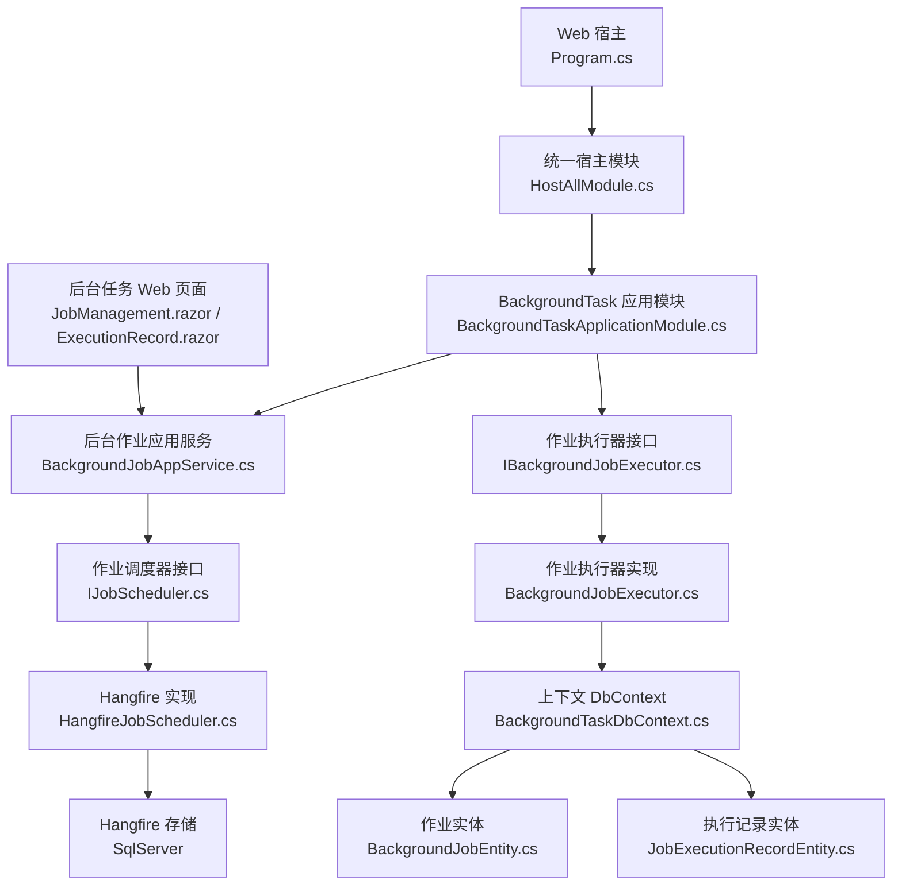
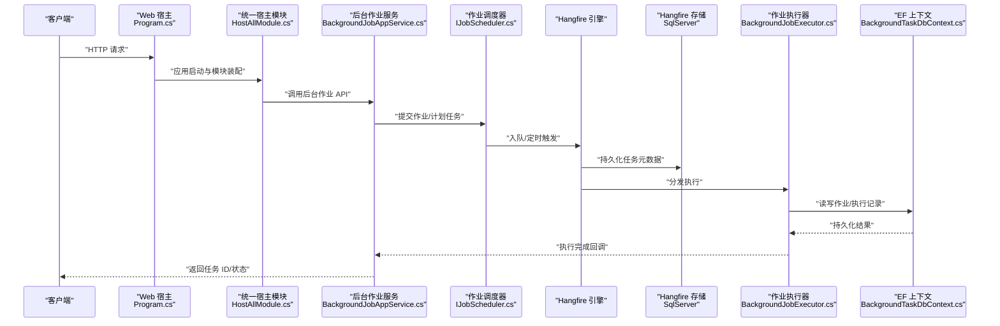
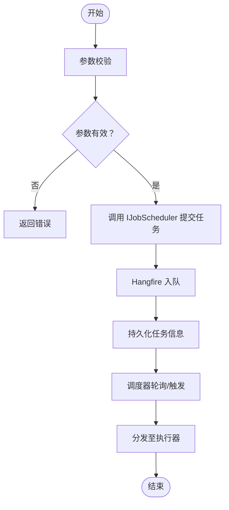
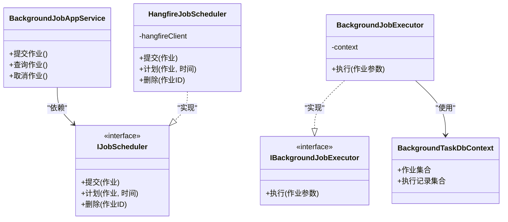
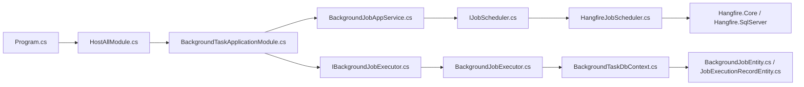

# 异步任务流

<cite>
**本文引用的文件**   
- [Program.cs](file://src/Host/H.AppLab.Web.Host/H.AppLab.Web.Host/Program.cs)
- [HostAllModule.cs](file://src/Host/H.AppLab.Web.Host/H.AppLab.Web.Host/HostAllModule.cs)
- [appsettings.json](file://src/Host/H.AppLab.Web.Host/H.AppLab.Web.Host/appsettings.json)
- [Directory.Packages.props](file://src/Directory.Packages.props)
- [AppLab.slnx](file://src/AppLab.slnx)
- [BackgroundTaskApplicationModule.cs](file://src/services/src/Services/BackgroundTask/H.BackgroundTask.Application/BackgroundTaskApplicationModule.cs)
- [BackgroundJobAppService.cs](file://src/services/src/Services/BackgroundTask/H.BackgroundTask.Application/Services/BackgroundJobAppService.cs)
- [IJobScheduler.cs](file://src/services/src/Services/BackgroundTask/H.BackgroundTask.Application/Services/IJobScheduler.cs)
- [HangfireJobScheduler.cs](file://src/services/src/Services/BackgroundTask/H.BackgroundTask.Application/Services/HangfireJobScheduler.cs)
- [IBackgroundJobExecutor.cs](file://src/services/src/Services/BackgroundTask/H.BackgroundTask.Application/Services/IBackgroundJobExecutor.cs)
- [BackgroundJobExecutor.cs](file://src/services/src/Services/BackgroundTask/H.BackgroundTask.Application/Services/BackgroundJobExecutor.cs)
- [BackgroundJobEntity.cs](file://src/services/src/Services/BackgroundTask/H.BackgroundTask.EntityFrameworkCore/Entities/BackgroundJobEntity.cs)
- [JobExecutionRecordEntity.cs](file://src/services/src/Services/BackgroundTask/H.BackgroundTask.EntityFrameworkCore/Entities/JobExecutionRecordEntity.cs)
- [BackgroundTaskDbContext.cs](file://src/services/src/Services/BackgroundTask/H.BackgroundTask.EntityFrameworkCore/BackgroundTaskDbContext.cs)
- [BackgroundJobDtos.cs](file://src/services/src/Services/BackgroundTask/H.BackgroundTask.Application.Contracts/Dtos/BackgroundJobDtos.cs)
- [BackgroundTaskMappers.cs](file://src/services/src/Services/BackgroundTask/H.BackgroundTask.Application/Mapping/BackgroundTaskMappers.cs)
- [JobManagement.razor](file://src/services/src/Services/BackgroundTask/H.BackgroundTask.Web/Pages/JobManagement.razor)
- [ExecutionRecord.razor](file://src/services/src/Services/BackgroundTask/H.BackgroundTask.Web/Pages/ExecutionRecord.razor)
- [20260724162027_Init.cs](file://src/Tools/H.BackgroundTask.DbMigrator/Migrations/20260724162027_Init.cs)
- [20260801151832_Drop_IsDelete.cs](file://src/Tools/H.BackgroundTask.DbMigrator/Migrations/20260801151832_Drop_IsDelete.cs)
</cite>

## 目录
1. [引言](#引言)
2. [项目结构](#项目结构)
3. [核心组件](#核心组件)
4. [架构总览](#架构总览)
5. [详细组件分析](#详细组件分析)
6. [依赖关系分析](#依赖关系分析)
7. [性能与优化](#性能与优化)
8. [监控与管理](#监控与管理)
9. [故障排查](#故障排查)
10. [结论](#结论)

## 引言
本技术文档聚焦于系统中的异步任务数据流，围绕 Hangfire 的调度流程展开，覆盖任务创建、队列管理、执行调度、结果回调；说明后台任务的定义方式（Job 类设计、参数传递、依赖注入）；解释任务监控与管理机制（执行状态跟踪、失败重试、日志记录）；描述分布式处理方案（多实例部署下的任务分配、负载均衡、故障转移）；并提供性能优化策略（批量处理、资源池管理、内存优化），以及监控界面与数据持久化机制。

## 项目结构
系统采用 ABP 模块化架构，异步任务能力由 BackgroundTask 领域模块提供，Web 宿主通过 Program 启动 Hangfire Dashboard，并在应用层暴露 Job 调度与应用服务接口。数据库迁移工具负责初始化 Hangfire 所需表结构与业务任务实体表。

图表来源
- [Program.cs:1-112](file://src/Host/H.AppLab.Web.Host/H.AppLab.Web.Host/Program.cs#L1-L112)
- [HostAllModule.cs:1-207](file://src/Host/H.AppLab.Web.Host/H.AppLab.Web.Host/HostAllModule.cs#L1-L207)
- [BackgroundTaskApplicationModule.cs](file://src/services/src/Services/BackgroundTask/H.BackgroundTask.Application/BackgroundTaskApplicationModule.cs)
- [BackgroundJobAppService.cs](file://src/services/src/Services/BackgroundTask/H.BackgroundTask.Application/Services/BackgroundJobAppService.cs)
- [IJobScheduler.cs](file://src/services/src/Services/BackgroundTask/H.BackgroundTask.Application/Services/IJobScheduler.cs)
- [HangfireJobScheduler.cs](file://src/services/src/Services/BackgroundTask/H.BackgroundTask.Application/Services/HangfireJobScheduler.cs)
- [IBackgroundJobExecutor.cs](file://src/services/src/Services/BackgroundTask/H.BackgroundTask.Application/Services/IBackgroundJobExecutor.cs)
- [BackgroundJobExecutor.cs](file://src/services/src/Services/BackgroundTask/H.BackgroundTask.Application/Services/BackgroundJobExecutor.cs)
- [BackgroundTaskDbContext.cs](file://src/services/src/Services/BackgroundTask/H.BackgroundTask.EntityFrameworkCore/BackgroundTaskDbContext.cs)
- [BackgroundJobEntity.cs](file://src/services/src/Services/BackgroundTask/H.BackgroundTask.EntityFrameworkCore/Entities/BackgroundJobEntity.cs)
- [JobExecutionRecordEntity.cs](file://src/services/src/Services/BackgroundTask/H.BackgroundTask.EntityFrameworkCore/Entities/JobExecutionRecordEntity.cs)
- [JobManagement.razor](file://src/services/src/Services/BackgroundTask/H.BackgroundTask.Web/Pages/JobManagement.razor)
- [ExecutionRecord.razor](file://src/services/src/Services/BackgroundTask/H.BackgroundTask.Web/Pages/ExecutionRecord.razor)

章节来源
- [Program.cs:1-112](file://src/Host/H.AppLab.Web.Host/H.AppLab.Web.Host/Program.cs#L1-L112)
- [HostAllModule.cs:1-207](file://src/Host/H.AppLab.Web.Host/H.AppLab.Web.Host/HostAllModule.cs#L1-L207)
- [AppLab.slnx](file://src/AppLab.slnx)

## 核心组件
- 宿主入口与中间件：Program.cs 注册 Blazor、SignalR、响应压缩、认证授权、控制器映射，并挂载 Hangfire Dashboard 路由。
- 统一宿主模块：HostAllModule.cs 聚合各应用模块，包含 BackgroundTaskApplicationModule，使后台任务能力在宿主中可用。
- 应用层服务：BackgroundJobAppService.cs 对外暴露后台作业相关 API，供前端调用以提交、查询和管理任务。
- 调度抽象与实现：IJobScheduler.cs 定义调度接口，HangfireJobScheduler.cs 基于 Hangfire 进行具体调度实现。
- 执行抽象与实现：IBackgroundJobExecutor.cs 定义作业执行器接口，BackgroundJobExecutor.cs 完成具体业务逻辑执行。
- 数据模型与上下文：BackgroundTaskDbContext.cs 提供 EF Core 上下文，BackgroundJobEntity.cs 和 JobExecutionRecordEntity.cs 分别表示作业与执行记录。
- DTO 与映射：BackgroundJobDtos.cs 定义数据传输对象，BackgroundTaskMappers.cs 定义实体到 DTO 的映射。
- Web 监控页：JobManagement.razor 与 ExecutionRecord.razor 提供作业列表、状态查看与执行记录展示。

章节来源
- [BackgroundJobAppService.cs](file://src/services/src/Services/BackgroundTask/H.BackgroundTask.Application/Services/BackgroundJobAppService.cs)
- [IJobScheduler.cs](file://src/services/src/Services/BackgroundTask/H.BackgroundTask.Application/Services/IJobScheduler.cs)
- [HangfireJobScheduler.cs](file://src/services/src/Services/BackgroundTask/H.BackgroundTask.Application/Services/HangfireJobScheduler.cs)
- [IBackgroundJobExecutor.cs](file://src/services/src/Services/BackgroundTask/H.BackgroundTask.Application/Services/IBackgroundJobExecutor.cs)
- [BackgroundJobExecutor.cs](file://src/services/src/Services/BackgroundTask/H.BackgroundTask.Application/Services/BackgroundJobExecutor.cs)
- [BackgroundTaskDbContext.cs](file://src/services/src/Services/BackgroundTask/H.BackgroundTask.EntityFrameworkCore/BackgroundTaskDbContext.cs)
- [BackgroundJobEntity.cs](file://src/services/src/Services/BackgroundTask/H.BackgroundTask.EntityFrameworkCore/Entities/BackgroundJobEntity.cs)
- [JobExecutionRecordEntity.cs](file://src/services/src/Services/BackgroundTask/H.BackgroundTask.EntityFrameworkCore/Entities/JobExecutionRecordEntity.cs)
- [BackgroundJobDtos.cs](file://src/services/src/Services/BackgroundTask/H.BackgroundTask.Application.Contracts/Dtos/BackgroundJobDtos.cs)
- [BackgroundTaskMappers.cs](file://src/services/src/Services/BackgroundTask/H.BackgroundTask.Application/Mapping/BackgroundTaskMappers.cs)
- [JobManagement.razor](file://src/services/src/Services/BackgroundTask/H.BackgroundTask.Web/Pages/JobManagement.razor)
- [ExecutionRecord.razor](file://src/services/src/Services/BackgroundTask/H.BackgroundTask.Web/Pages/ExecutionRecord.razor)

## 架构总览
下图展示从 Web 请求到 Hangfire 任务调度的端到端流程，包括控制台入口、宿主模块装配、应用服务调用、调度器转发、Hangfire 执行引擎与数据库持久化。

图表来源
- [Program.cs:1-112](file://src/Host/H.AppLab.Web.Host/H.AppLab.Web.Host/Program.cs#L1-L112)
- [HostAllModule.cs:1-207](file://src/Host/H.AppLab.Web.Host/H.AppLab.Web.Host/HostAllModule.cs#L1-L207)
- [BackgroundJobAppService.cs](file://src/services/src/Services/BackgroundTask/H.BackgroundTask.Application/Services/BackgroundJobAppService.cs)
- [IJobScheduler.cs](file://src/services/src/Services/BackgroundTask/H.BackgroundTask.Application/Services/IJobScheduler.cs)
- [HangfireJobScheduler.cs](file://src/services/src/Services/BackgroundTask/H.BackgroundTask.Application/Services/HangfireJobScheduler.cs)
- [BackgroundJobExecutor.cs](file://src/services/src/Services/BackgroundTask/H.BackgroundTask.Application/Services/BackgroundJobExecutor.cs)
- [BackgroundTaskDbContext.cs](file://src/services/src/Services/BackgroundTask/H.BackgroundTask.EntityFrameworkCore/BackgroundTaskDbContext.cs)

## 详细组件分析

### 任务创建与调度流程
- 应用服务层通过 BackgroundJobAppService.cs 接收外部请求，校验参数后委托 IJobScheduler.cs 进行调度。
- HangfireJobScheduler.cs 使用 Hangfire 提供的 API 将任务加入默认或指定队列，支持延迟执行与重复任务（RecurringJob）。
- 调度完成后，Hangfire 根据配置轮询任务队列，将任务分发给已注册的作业执行器。

图表来源
- [BackgroundJobAppService.cs](file://src/services/src/Services/BackgroundTask/H.BackgroundTask.Application/Services/BackgroundJobAppService.cs)
- [IJobScheduler.cs](file://src/services/src/Services/BackgroundTask/H.BackgroundTask.Application/Services/IJobScheduler.cs)
- [HangfireJobScheduler.cs](file://src/services/src/Services/BackgroundTask/H.BackgroundTask.Application/Services/HangfireJobScheduler.cs)

章节来源
- [BackgroundJobAppService.cs](file://src/services/src/Services/BackgroundTask/H.BackgroundTask.Application/Services/BackgroundJobAppService.cs)
- [IJobScheduler.cs](file://src/services/src/Services/BackgroundTask/H.BackgroundTask.Application/Services/IJobScheduler.cs)
- [HangfireJobScheduler.cs](file://src/services/src/Services/BackgroundTask/H.BackgroundTask.Application/Services/HangfireJobScheduler.cs)

### 后台任务的定义方式
- Job 类设计：通过 HangfireJobScheduler.cs 封装对 Hangfire 的调用，屏蔽底层差异，向上暴露统一的调度接口 IJobScheduler.cs。
- 参数传递：BackgroundJobDtos.cs 定义作业传输对象，用于跨进程序列化与传递；BackgroundTaskMappers.cs 负责 DTO 与实体的映射。
- 依赖注入支持：宿主使用 Autofac（见 Program.cs 中的 UseAutofac），ABP 框架自动解析 IJobScheduler、IBackgroundJobExecutor 等依赖，保证作业执行时的 DI 容器可用。

章节来源
- [BackgroundJobDtos.cs](file://src/services/src/Services/BackgroundTask/H.BackgroundTask.Application.Contracts/Dtos/BackgroundJobDtos.cs)
- [BackgroundTaskMappers.cs](file://src/services/src/Services/BackgroundTask/H.BackgroundTask.Application/Mapping/BackgroundTaskMappers.cs)
- [Program.cs:1-112](file://src/Host/H.AppLab.Web.Host/H.AppLab.Web.Host/Program.cs#L1-L112)

### 执行调度与结果回调
- 执行器：IBackgroundJobExecutor.cs 定义执行接口，BackgroundJobExecutor.cs 实现具体业务逻辑。
- 结果回调：BackgroundJobExecutor.cs 在执行前后更新执行记录（JobExecutionRecordEntity.cs），并通过应用服务或消息通道通知调用方。
- 持久化：BackgroundTaskDbContext.cs 统一管理 EF Core 上下文，所有作业与执行记录的读写均经过该上下文。

图表来源
- [BackgroundJobAppService.cs](file://src/services/src/Services/BackgroundTask/H.BackgroundTask.Application/Services/BackgroundJobAppService.cs)
- [IJobScheduler.cs](file://src/services/src/Services/BackgroundTask/H.BackgroundTask.Application/Services/IJobScheduler.cs)
- [HangfireJobScheduler.cs](file://src/services/src/Services/BackgroundTask/H.BackgroundTask.Application/Services/HangfireJobScheduler.cs)
- [IBackgroundJobExecutor.cs](file://src/services/src/Services/BackgroundTask/H.BackgroundTask.Application/Services/IBackgroundJobExecutor.cs)
- [BackgroundJobExecutor.cs](file://src/services/src/Services/BackgroundTask/H.BackgroundTask.Application/Services/BackgroundJobExecutor.cs)
- [BackgroundTaskDbContext.cs](file://src/services/src/Services/BackgroundTask/H.BackgroundTask.EntityFrameworkCore/BackgroundTaskDbContext.cs)

章节来源
- [IBackgroundJobExecutor.cs](file://src/services/src/Services/BackgroundTask/H.BackgroundTask.Application/Services/IBackgroundJobExecutor.cs)
- [BackgroundJobExecutor.cs](file://src/services/src/Services/BackgroundTask/H.BackgroundTask.Application/Services/BackgroundJobExecutor.cs)
- [BackgroundTaskDbContext.cs](file://src/services/src/Services/BackgroundTask/H.BackgroundTask.EntityFrameworkCore/BackgroundTaskDbContext.cs)

### 任务监控与管理机制
- 执行状态跟踪：JobExecutionRecordEntity.cs 记录每次执行的开始时间、结束时间、状态、异常信息等；BackgroundTaskDbContext.cs 提供查询接口。
- 失败重试：Hangfire 内置重试机制（可配置最大重试次数、退避策略），可通过 HangfireDashboard 查看失败任务并手动重试。
- 日志记录：结合 Serilog 与 Hangfire 的事件管道，可在作业执行过程中输出结构化日志，便于追踪问题。

章节来源
- [JobExecutionRecordEntity.cs](file://src/services/src/Services/BackgroundTask/H.BackgroundTask.EntityFrameworkCore/Entities/JobExecutionRecordEntity.cs)
- [BackgroundTaskDbContext.cs](file://src/services/src/Services/BackgroundTask/H.BackgroundTask.EntityFrameworkCore/BackgroundTaskDbContext.cs)

### 分布式任务处理
- 多实例部署：多个 Web 宿主实例共享同一 Hangfire 存储（SqlServer），Hangfire 会自动协调任务分配，避免重复执行。
- 负载均衡：Hangfire 按 Worker 数量与队列优先级进行负载分配，可配置不同队列的处理并发度。
- 故障转移：当某个实例宕机，Hangfire 会将未完成的任务重新分配给其他存活实例，确保任务最终完成。

章节来源
- [Directory.Packages.props](file://src/Directory.Packages.props)
- [appsettings.json](file://src/Host/H.AppLab.Web.Host/H.AppLab.Web.Host/appsettings.json)

### 任务性能优化策略
- 批量处理：通过批量作业或批处理器模式，减少频繁 IO 与事务开销；可使用 Hangfire 的批处理特性或自定义批处理器。
- 资源池管理：控制执行器并行度，避免数据库连接池耗尽；合理设置 Hangfire Worker 数量与队列并发。
- 内存优化：避免在作业中持有大对象引用，尽量使用 DTO 而非实体；及时释放临时资源，避免 GC 压力。

[本节为通用指导，不直接分析具体文件]

## 依赖关系分析
- 宿主层：Program.cs 引入 Hangfire 中间件并挂载 Dashboard 路由；HostAllModule.cs 聚合 BackgroundTaskApplicationModule。
- 应用层：BackgroundJobAppService.cs 依赖 IJobScheduler.cs；HangfireJobScheduler.cs 依赖 Hangfire 客户端。
- 执行层：BackgroundJobExecutor.cs 依赖 BackgroundTaskDbContext.cs，读写作业与执行记录实体。
- 数据层：BackgroundTaskDbContext.cs 依赖 EF Core；Hangfire 使用 SqlServer 作为持久化后端。

图表来源
- [Program.cs:1-112](file://src/Host/H.AppLab.Web.Host/H.AppLab.Web.Host/Program.cs#L1-L112)
- [HostAllModule.cs:1-207](file://src/Host/H.AppLab.Web.Host/H.AppLab.Web.Host/HostAllModule.cs#L1-L207)
- [BackgroundTaskApplicationModule.cs](file://src/services/src/Services/BackgroundTask/H.BackgroundTask.Application/BackgroundTaskApplicationModule.cs)
- [BackgroundJobAppService.cs](file://src/services/src/Services/BackgroundTask/H.BackgroundTask.Application/Services/BackgroundJobAppService.cs)
- [IJobScheduler.cs](file://src/services/src/Services/BackgroundTask/H.BackgroundTask.Application/Services/IJobScheduler.cs)
- [HangfireJobScheduler.cs](file://src/services/src/Services/BackgroundTask/H.BackgroundTask.Application/Services/HangfireJobScheduler.cs)
- [IBackgroundJobExecutor.cs](file://src/services/src/Services/BackgroundTask/H.BackgroundTask.Application/Services/IBackgroundJobExecutor.cs)
- [BackgroundJobExecutor.cs](file://src/services/src/Services/BackgroundTask/H.BackgroundTask.Application/Services/BackgroundJobExecutor.cs)
- [BackgroundTaskDbContext.cs](file://src/services/src/Services/BackgroundTask/H.BackgroundTask.EntityFrameworkCore/BackgroundTaskDbContext.cs)
- [BackgroundJobEntity.cs](file://src/services/src/Services/BackgroundTask/H.BackgroundTask.EntityFrameworkCore/Entities/BackgroundJobEntity.cs)
- [JobExecutionRecordEntity.cs](file://src/services/src/Services/BackgroundTask/H.BackgroundTask.EntityFrameworkCore/Entities/JobExecutionRecordEntity.cs)

章节来源
- [Directory.Packages.props](file://src/Directory.Packages.props)
- [AppLab.slnx](file://src/AppLab.slnx)

## 性能与优化
- 建议将高频小任务合并为批处理作业，降低数据库事务与网络往返。
- 针对 CPU 密集型任务，限制并发 Worker 数量，避免线程争用。
- 对于 IO 密集型任务，使用异步 I/O 并合理设置超时与重试策略。
- 使用 Hangfire Dashboard 观察队列长度、执行时长、失败率，动态调整队列权重与并发。

[本节为通用指导，不直接分析具体文件]

## 监控与管理
- Hangfire Dashboard：在 Program.cs 中启用 /hangfire 路由，提供可视化任务面板，支持查看任务状态、失败重试、手动触发。
- 业务监控页：JobManagement.razor 与 ExecutionRecord.razor 提供作业列表、筛选、分页与执行记录详情，便于运维人员快速定位问题。
- 数据持久化：Hangfire 的元数据与业务作业的实体表均由 EF Core 迁移脚本维护，确保数据一致性与可恢复性。

章节来源
- [Program.cs:1-112](file://src/Host/H.AppLab.Web.Host/H.AppLab.Web.Host/Program.cs#L1-L112)
- [JobManagement.razor](file://src/services/src/Services/BackgroundTask/H.BackgroundTask.Web/Pages/JobManagement.razor)
- [ExecutionRecord.razor](file://src/services/src/Services/BackgroundTask/H.BackgroundTask.Web/Pages/ExecutionRecord.razor)
- [20260724162027_Init.cs](file://src/Tools/H.BackgroundTask.DbMigrator/Migrations/20260724162027_Init.cs)
- [20260801151832_Drop_IsDelete.cs](file://src/Tools/H.BackgroundTask.DbMigrator/Migrations/20260801151832_Drop_IsDelete.cs)

## 故障排查
- 任务未执行：检查 Hangfire Dashboard 中任务状态是否为“待处理”或“失败”，确认 Worker 是否正常运行。
- 执行失败：查看执行记录（JobExecutionRecordEntity.cs）中的异常信息，定位业务逻辑错误；必要时增加更细粒度的日志。
- 重复执行：确认 Hangfire 配置是否正确，避免多实例同时消费同一队列导致重复；核对 Worker 数量与队列并发设置。
- 数据库连接问题：检查 appsettings.json 中的 ConnectionStrings 配置，确保 BackgroundTaskDb 与其他服务的数据库连通性正常。

章节来源
- [JobExecutionRecordEntity.cs](file://src/services/src/Services/BackgroundTask/H.BackgroundTask.EntityFrameworkCore/Entities/JobExecutionRecordEntity.cs)
- [appsettings.json](file://src/Host/H.AppLab.Web.Host/H.AppLab.Web.Host/appsettings.json)

## 结论
本系统通过 ABP 模块化架构与 Hangfire 实现了可靠的异步任务处理能力。应用服务层提供统一的作业提交与管理接口，调度器抽象屏蔽了 Hangfire 的具体实现，执行器负责业务逻辑与结果持久化。依托 Hangfire Dashboard 与业务监控页，运维人员可以直观地监控任务执行情况，并结合重试机制与日志体系快速定位和解决问题。在多实例部署下，Hangfire 提供了稳定的任务分配、负载均衡与故障转移能力，配合合理的性能优化策略，能够满足高吞吐、低延迟的异步任务需求。