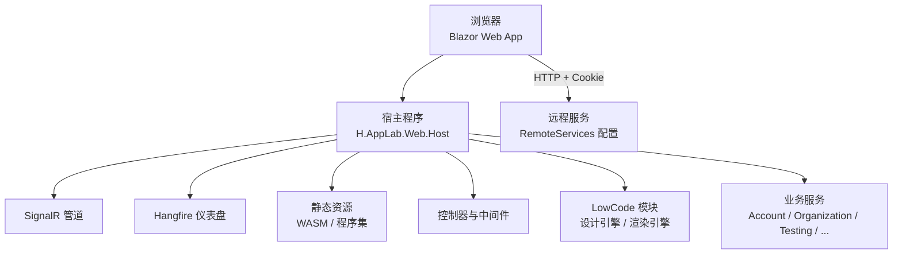
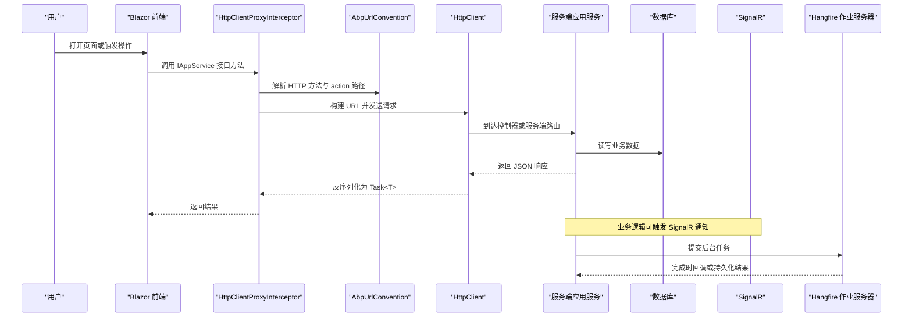
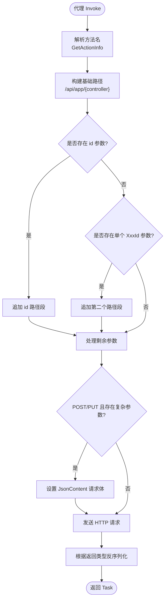
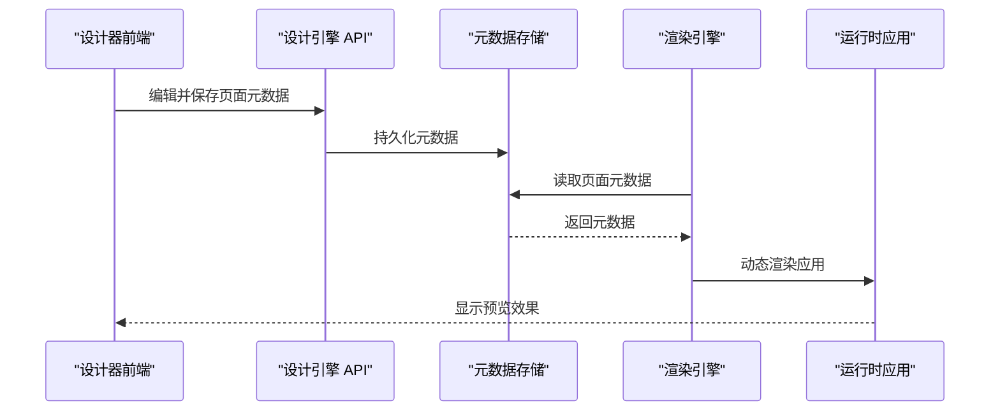
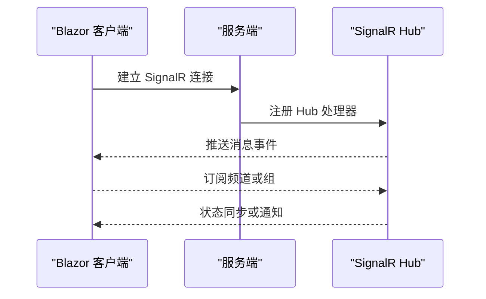
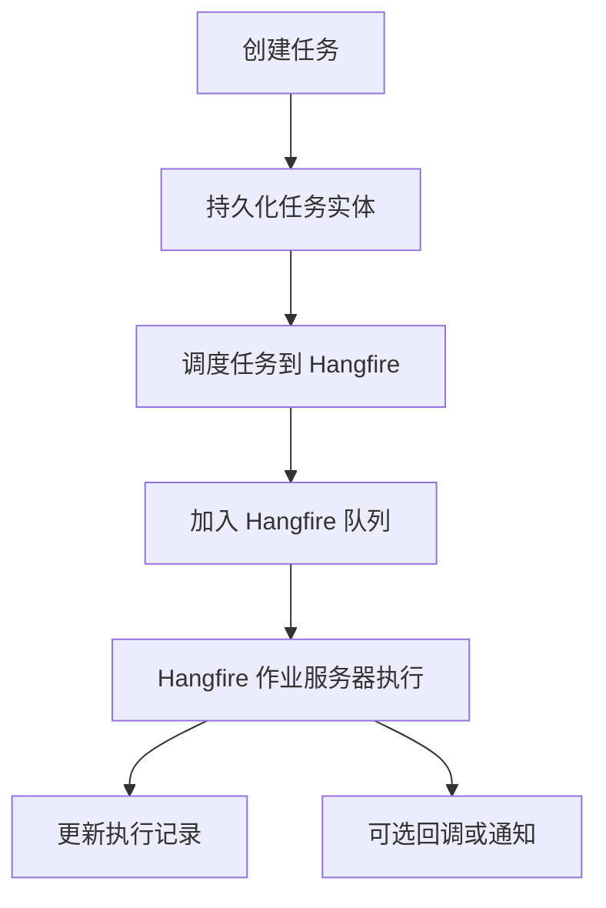

# 数据流设计

<cite>
**本文引用的文件**   
- [README.md](file://README.md)
- [Program.cs](file://src/Host/H.AppLab.Web.Host/H.AppLab.Web.Host/Program.cs)
- [ClientServices.cs](file://src/Host/H.AppLab.Web.Host/H.AppLab.Web.Host.Client/ClientServices.cs)
- [HttpClientProxyInterceptor.cs](file://src/Utils/H.Abp.HttpClientProxy/HttpClientProxyInterceptor.cs)
- [AbpUrlConvention.cs](file://src/Utils/H.Abp.HttpClientProxy/AbpUrlConvention.cs)
- [RemoteServiceOptions.cs](file://src/Utils/H.Abp.HttpClientProxy/RemoteServiceOptions.cs)
- [ServiceCollectionExtensions.cs](file://src/Utils/H.Abp.HttpClientProxy/ServiceCollectionExtensions.cs)
- [IAppService.cs](file://src/Utils/H.Abp.Application.Contracts/IAppService.cs)
- [BackgroundJobAppService.cs](file://src/Services/BackgroundTask/H.BackgroundTask.Application/Services/BackgroundJobAppService.cs)
- [HangfireJobScheduler.cs](file://src/Services/BackgroundTask/H.BackgroundTask.Application/Services/HangfireJobScheduler.cs)
- [BackgroundJobExecutor.cs](file://src/Services/BackgroundTask/H.BackgroundTask.Application/Services/BackgroundJobExecutor.cs)
- [BackgroundTaskApplicationModule.cs](file://src/Services/BackgroundTask/H.BackgroundTask.Application/BackgroundTaskApplicationModule.cs)
- [BackgroundJobEntity.cs](file://src/Services/BackgroundTask/H.BackgroundTask.EntityFrameworkCore/Entities/BackgroundJobEntity.cs)
</cite>

## 目录
1. [引言](#引言)
2. [项目结构](#项目结构)
3. [核心组件](#核心组件)
4. [架构总览](#架构总览)
5. [详细组件分析](#详细组件分析)
6. [依赖关系分析](#依赖关系分析)
7. [性能与体积优化](#性能与体积优化)
8. [故障排查指南](#故障排查指南)
9. [结论](#结论)

## 引言
本文面向 H.AppLab 平台的数据流设计，重点描述从 Blazor 前端到后端 API 的完整请求流转，并覆盖以下关键数据流：
- HTTP 动态代理机制：客户端拦截器、URL 路由约定转换、参数序列化。
- 低代码设计器的数据流：页面元数据的编辑、保存、预览、渲染。
- 实时通信的数据流：SignalR 连接建立、消息订阅发布、状态同步。
- 异步任务的数据流：Hangfire 任务调度、队列处理、结果回调。

整体目标是通过统一的服务契约 IAppService 和 HTTP 动态代理，让 Blazor 前端与服务端应用服务保持一致的调用体验；同时以 LowCode 的设计引擎和渲染引擎分离职责，实现“设计态”与“运行态”的数据流解耦。

**章节来源**
- [README.md:1-73](file://README.md#L1-L73)

## 项目结构
H.AppLab 采用模块化架构，支持单体部署和按服务独立部署。与数据流直接相关的顶层结构如下：
- Host：宿主程序，负责 Blazor Web App、SignalR、Hangfire 仪表盘、静态资源等基础设施配置。
- LowCode：低代码核心，包含设计引擎（DesignEngine）与渲染引擎（RenderEngine），以及公共元数据和组件库。
- Services：按业务限界上下文划分的后端服务，每个服务提供 Application.Contracts、Application、EntityFrameworkCore、Web 分层。
- Utils：工具类库，包括 HTTP 动态代理、Blazor 工具、ID 生成器等。



**图示来源**
- [Program.cs:1-112](file://src/Host/H.AppLab.Web.Host/H.AppLab.Web.Host/Program.cs#L1-L112)
- [README.md:10-73](file://README.md#L10-L73)

**章节来源**
- [README.md:10-73](file://README.md#L10-L73)

## 核心组件
本节聚焦数据流中的关键组件及其职责：
- Blazor 前端与 ClientServices：按需懒加载模块，注册远程服务代理。
- HTTP 动态代理：DispatchProxy 拦截接口方法，转换为 HTTP 请求。
- URL 约定转换：将接口名和方法名映射为 ABP 风格 URL。
- 远程服务配置：RemoteServiceOptions 管理多服务的 BaseUrl。
- 低代码设计器与渲染器：DesignEngine 产出页面元数据，RenderEngine 消费元数据渲染应用。
- 实时通信：SignalR 在宿主中启用，用于跨进程或跨客户端的状态推送。
- 异步任务：HangfireJobScheduler 封装调度，BackgroundJobExecutor 执行具体任务。

**章节来源**
- [ClientServices.cs:1-193](file://src/Host/H.AppLab.Web.Host/H.AppLab.Web.Host.Client/ClientServices.cs#L1-L193)
- [HttpClientProxyInterceptor.cs:1-234](file://src/Utils/H.Abp.HttpClientProxy/HttpClientProxyInterceptor.cs#L1-L234)
- [AbpUrlConvention.cs:1-86](file://src/Utils/H.Abp.HttpClientProxy/AbpUrlConvention.cs#L1-L86)
- [RemoteServiceOptions.cs:1-33](file://src/Utils/H.Abp.HttpClientProxy/RemoteServiceOptions.cs#L1-L33)
- [ServiceCollectionExtensions.cs:1-63](file://src/Utils/H.Abp.HttpClientProxy/ServiceCollectionExtensions.cs#L1-L63)
- [IAppService.cs:1-8](file://src/Utils/H.Abp.Application.Contracts/IAppService.cs#L1-L8)

## 架构总览
下图展示 H.AppLab 的整体数据流架构，包括 Blazor 前端、HTTP 动态代理、服务端应用服务、SignalR、Hangfire 和低代码引擎之间的交互。



**图示来源**
- [ClientServices.cs:20-193](file://src/Host/H.AppLab.Web.Host/H.AppLab.Web.Host.Client/ClientServices.cs#L20-L193)
- [HttpClientProxyInterceptor.cs:1-234](file://src/Utils/H.Abp.HttpClientProxy/HttpClientProxyInterceptor.cs#L1-L234)
- [AbpUrlConvention.cs:1-86](file://src/Utils/H.Abp.HttpClientProxy/AbpUrlConvention.cs#L1-L86)
- [Program.cs:1-112](file://src/Host/H.AppLab.Web.Host/H.AppLab.Web.Host/Program.cs#L1-L112)

## 详细组件分析

### HTTP 动态代理机制
HTTP 动态代理是 Blazor 前端访问后端 IAppService 的核心机制。其流程包括：
- 客户端通过 AddHttpClientProxies 扫描程序集中继承 IAppService 的接口，批量注册代理实现。
- 代理实例由 HttpClientProxyInterceptor 创建，持有 HttpClient、BaseUrl 和服务对应的 ControllerName。
- 当 Blazor 调用接口方法时，DispatchProxy.Invoke 被拦截，随后 AbpUrlConvention 将方法名转换为 HTTP 方法与 action 路径。
- 根据参数类型和位置，构建最终 URL：id 参数作为路径段，其他简单参数进入查询字符串，复杂类型在 POST/PUT 时放入请求体。
- 最后通过 HttpClient.SendAsync 发送请求，并根据返回类型进行 JSON 反序列化或直接返回文本。



**图示来源**
- [HttpClientProxyInterceptor.cs:1-234](file://src/Utils/H.Abp.HttpClientProxy/HttpClientProxyInterceptor.cs#L1-L234)
- [AbpUrlConvention.cs:1-86](file://src/Utils/H.Abp.HttpClientProxy/AbpUrlConvention.cs#L1-L86)

#### 关键处理节点与技术细节
- 接口标记：IAppService 作为可代理接口的标记基接口。
- 代理工厂：ServiceCollectionExtensions.AddHttpClientProxies 扫描程序集并注册代理。
- URL 约定：AbpUrlConvention.GetControllerName 与 GetActionInfo 分别处理控制器名与方法名映射。
- 参数处理：IsSimpleType 区分简单类型与复杂类型；GET/DELETE 的复杂参数展开为查询参数；POST/PUT 的复杂参数进入请求体。
- 返回处理：SendWithResultAsync 针对 Task<T> 返回类型，支持 string 纯文本响应和无内容响应。

**章节来源**
- [IAppService.cs:1-8](file://src/Utils/H.Abp.Application.Contracts/IAppService.cs#L1-L8)
- [ServiceCollectionExtensions.cs:1-63](file://src/Utils/H.Abp.HttpClientProxy/ServiceCollectionExtensions.cs#L1-L63)
- [HttpClientProxyInterceptor.cs:1-234](file://src/Utils/H.Abp.HttpClientProxy/HttpClientProxyInterceptor.cs#L1-L234)
- [AbpUrlConvention.cs:1-86](file://src/Utils/H.Abp.HttpClientProxy/AbpUrlConvention.cs#L1-L86)

### 低代码设计器的数据流
低代码系统分为设计引擎（DesignEngine）和渲染引擎（RenderEngine）两个主要部分：
- 设计阶段：用户在 DesignEngine 中编辑页面元数据，保存后由后端存储（JSON 文件或数据库）。
- 渲染阶段：RenderEngine 读取页面元数据，动态渲染出可运行的应用。
- 客户端侧：ClientServices 在导航时按需注册 LowCode 相关代理，确保设计器和渲染器共享的 LowCode 基础服务可用。



**图示来源**
- [ClientServices.cs:120-193](file://src/Host/H.AppLab.Web.Host/H.AppLab.Web.Host.Client/ClientServices.cs#L120-L193)
- [README.md:20-55](file://README.md#L20-L55)

#### 关键处理节点与技术细节
- 设计器应用服务：例如 PageAppService、MenuAppService 等，负责页面与菜单的 CRUD。
- 渲染器应用服务：MetaAppService 提供元数据查询能力。
- 客户端懒加载：Routes 导航时通过 RegisterLazyModule 注册 lowcode-render 与 lowcode-design 模块。
- 共享状态：LowCodeAppState 在设计时宿主中注入 true，表示当前处于设计模式。

**章节来源**
- [ClientServices.cs:120-193](file://src/Host/H.AppLab.Web.Host/H.AppLab.Web.Host.Client/ClientServices.cs#L120-L193)
- [README.md:20-55](file://README.md#L20-L55)

### 实时通信的数据流
SignalR 在宿主 Program.cs 中启用，允许服务端向客户端推送实时消息。虽然当前仓库未找到具体的 Hub 实现，但基础设施已就绪：
- 添加 SignalR 服务，设置最大接收消息大小和开发环境详细错误。
- 后续可在任意服务中注入 IHubContext 并调用 Clients.All 或 Clients.Group 推送消息。
- 客户端可通过 JavaScript 或 .NET Blazor JSInterop 建立连接并订阅事件。



**图示来源**
- [Program.cs:10-20](file://src/Host/H.AppLab.Web.Host/H.AppLab.Web.Host/Program.cs#L10-L20)

#### 关键处理节点与技术细节
- 信号服务注册：AddSignalR 配置最大消息大小和调试选项。
- 扩展点：可基于 INotificationAppService 或自定义 Hub 实现消息通道。
- 安全与鉴权：结合 UseAuthentication 与 UseAuthorization 保证连接安全。

**章节来源**
- [Program.cs:10-20](file://src/Host/H.AppLab.Web.Host/H.AppLab.Web.Host/Program.cs#L10-L20)

### 异步任务的数据流
异步任务通过 Hangfire 实现，由 BackgroundTask 服务封装调度与执行：
- 应用服务层：BackgroundJobAppService 提供任务的增删改查，并与 Hangfire 调度联动。
- 调度层：HangfireJobScheduler 使用 IBackgroundJobClient 和 IRichRecurringJobManager 注册一次性任务和周期任务。
- 执行层：BackgroundJobExecutor 由 Hangfire 调用，手动开启工作单元读写数据库，并执行 API 或 SQL 任务。
- 实体层：BackgroundJobEntity 持久化任务定义，并记录 HangfireJobId 以便关联。



**图示来源**
- [BackgroundJobAppService.cs:13-110](file://src/Services/BackgroundTask/H.BackgroundTask.Application/Services/BackgroundJobAppService.cs#L13-L110)
- [HangfireJobScheduler.cs:8-87](file://src/Services/BackgroundTask/H.BackgroundTask.Application/Services/HangfireJobScheduler.cs#L8-L87)
- [BackgroundJobExecutor.cs:14-143](file://src/Services/BackgroundTask/H.BackgroundTask.Application/Services/BackgroundJobExecutor.cs#L14-L143)
- [BackgroundTaskApplicationModule.cs:22-53](file://src/Services/BackgroundTask/H.BackgroundTask.Application/BackgroundTaskApplicationModule.cs#L22-L53)
- [BackgroundJobEntity.cs:9-51](file://src/Services/BackgroundTask/H.BackgroundTask.EntityFrameworkCore/Entities/BackgroundJobEntity.cs#L9-L51)

#### 关键处理节点与技术细节
- 任务创建：CreateAsync 将输入 DTO 映射为实体，调用 _scheduler.Schedule 并回写 HangfireJobId。
- 任务更新：UpdateAsync 先移除旧调度，再重新注册新调度。
- 任务删除：Remove 清空 HangfireJobId 并调用调度器 Remove。
- 执行器：BackgroundJobExecutor.ExecuteAsync 根据任务类型（API/SQL）执行相应逻辑，并记录执行结果。

**章节来源**
- [BackgroundJobAppService.cs:13-110](file://src/Services/BackgroundTask/H.BackgroundTask.Application/Services/BackgroundJobAppService.cs#L13-L110)
- [HangfireJobScheduler.cs:8-87](file://src/Services/BackgroundTask/H.BackgroundTask.Application/Services/HangfireJobScheduler.cs#L8-L87)
- [BackgroundJobExecutor.cs:14-143](file://src/Services/BackgroundTask/H.BackgroundTask.Application/Services/BackgroundJobExecutor.cs#L14-L143)
- [BackgroundTaskApplicationModule.cs:22-53](file://src/Services/BackgroundTask/H.BackgroundTask.Application/BackgroundTaskApplicationModule.cs#L22-L53)
- [BackgroundJobEntity.cs:9-51](file://src/Services/BackgroundTask/H.BackgroundTask.EntityFrameworkCore/Entities/BackgroundJobEntity.cs#L9-L51)

## 依赖关系分析
H.AppLab 的依赖关系围绕 IAppService 契约展开，客户端与服务端共享接口定义，实现方式因环境而异：
- 在服务端：接口由 Application 层实现。
- 在客户端：接口由 HttpClientProxyInterceptor 动态代理实现。

```mermaid
classDiagram
    class IAppService {
        <<interface>>
    }

    class HttpClientProxyInterceptor_T_ {
        +Initialize(httpClient, baseUrl)
        +Invoke(method, args) object
        -BuildUrl(...)
        -FindBodyParameter(...)
        -IsSimpleType(type) bool
        -ToCamelCase(name) string
    }

    class AbpUrlConvention {
        +GetControllerName(type) string
        +GetActionInfo(methodName) (HttpMethod, string)
        +ToKebabCase(input) string
    }

    class RemoteServiceOptions {
        +this[name] RemoteServiceConfiguration
        +Configure(name, baseUrl) void
        +GetBaseUrl(serviceName) string
    }

    class ServiceCollectionExtensions {
        +AddRemoteServices(configuration) IServiceCollection
        +AddHttpClientProxies(assembly, remoteServiceName) IServiceCollection
    }

    IAppService <|-- * : "被代理接口"
    ServiceCollectionExtensions --> IAppService : "扫描接口"
    HttpClientProxyInterceptor_T_ --> AbpUrlConvention : "使用 URL 约定"
    ServiceCollectionExtensions --> RemoteServiceOptions : "读取远程服务配置"
```

**图示来源**
- [IAppService.cs:1-8](file://src/Utils/H.Abp.Application.Contracts/IAppService.cs#L1-L8)
- [HttpClientProxyInterceptor.cs:1-234](file://src/Utils/H.Abp.HttpClientProxy/HttpClientProxyInterceptor.cs#L1-L234)
- [AbpUrlConvention.cs:1-86](file://src/Utils/H.Abp.HttpClientProxy/AbpUrlConvention.cs#L1-L86)
- [RemoteServiceOptions.cs:1-33](file://src/Utils/H.Abp.HttpClientProxy/RemoteServiceOptions.cs#L1-L33)
- [ServiceCollectionExtensions.cs:1-63](file://src/Utils/H.Abp.HttpClientProxy/ServiceCollectionExtensions.cs#L1-L63)

**章节来源**
- [IAppService.cs:1-8](file://src/Utils/H.Abp.Application.Contracts/IAppService.cs#L1-L8)
- [ServiceCollectionExtensions.cs:1-63](file://src/Utils/H.Abp.HttpClientProxy/ServiceCollectionExtensions.cs#L1-L63)
- [HttpClientProxyInterceptor.cs:1-234](file://src/Utils/H.Abp.HttpClientProxy/HttpClientProxyInterceptor.cs#L1-L234)
- [AbpUrlConvention.cs:1-86](file://src/Utils/H.Abp.HttpClientProxy/AbpUrlConvention.cs#L1-L86)
- [RemoteServiceOptions.cs:1-33](file://src/Utils/H.Abp.HttpClientProxy/RemoteServiceOptions.cs#L1-L33)

## 性能与体积优化
- 压缩传输：启用 Brotli 与 Gzip 压缩，减少 WASM 程序集与静态资源的下载体积。
- 懒加载模块：首页仅加载必要程序集，其余模块在导航时按需下载。
- AOT 与裁剪：Release 模式启用 AOT 与 Trimming，进一步减少体积。
- 超时策略：Testing 远程服务设置为无限超时，避免长时间测试用例被取消。

**章节来源**
- [Program.cs:14-40](file://src/Host/H.AppLab.Web.Host/H.AppLab.Web.Host/Program.cs#L14-L40)
- [ClientServices.cs:40-120](file://src/Host/H.AppLab.Web.Host/H.AppLab.Web.Host.Client/ClientServices.cs#L40-L120)
- [README.md:55-73](file://README.md#L55-L73)

## 故障排查指南
- 代理无法解析：检查 AddHttpClientProxies 是否扫描了正确的程序集，并确保接口继承 IAppService。
- URL 不匹配：确认 AbpUrlConvention 的方法名前缀是否符合约定（GetList、GetAll、Get、Put、Update、Delete、Remove、Create、Add、Insert、Post、Patch）。
- 参数序列化异常：复杂类型仅在 POST/PUT 时放入请求体；GET/DELETE 的复杂参数会展开为查询参数。
- SignalR 连接失败：检查 Program.cs 中 AddSignalR 配置，确认 UseAuthentication 与 UseAuthorization 已启用。
- Hangfire 任务未执行：确认 BackgroundTaskApplicationModule 已注册 Hangfire 服务与作业服务器，并检查 HangfireJobId 是否正确回写。

**章节来源**
- [ServiceCollectionExtensions.cs:1-63](file://src/Utils/H.Abp.HttpClientProxy/ServiceCollectionExtensions.cs#L1-L63)
- [AbpUrlConvention.cs:1-86](file://src/Utils/H.Abp.HttpClientProxy/AbpUrlConvention.cs#L1-L86)
- [HttpClientProxyInterceptor.cs:1-234](file://src/Utils/H.Abp.HttpClientProxy/HttpClientProxyInterceptor.cs#L1-L234)
- [Program.cs:10-20](file://src/Host/H.AppLab.Web.Host/H.AppLab.Web.Host/Program.cs#L10-L20)
- [BackgroundTaskApplicationModule.cs:22-53](file://src/Services/BackgroundTask/H.BackgroundTask.Application/BackgroundTaskApplicationModule.cs#L22-L53)

## 结论
H.AppLab 平台通过统一的 IAppService 契约和 HTTP 动态代理，实现了 Blazor 前端与服务端应用服务的无缝对接。低代码设计器与渲染引擎的职责分离，使得页面元数据可以在设计态与运行态之间自由流转。SignalR 与 Hangfire 分别为实时通信和异步任务提供了可靠的基础设施。整体架构清晰、可扩展性强，适合在企业级应用中复用和演进。