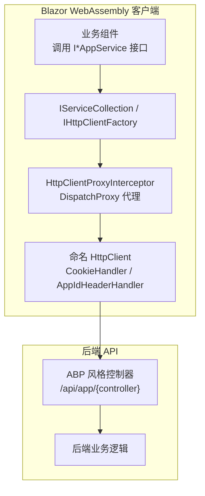
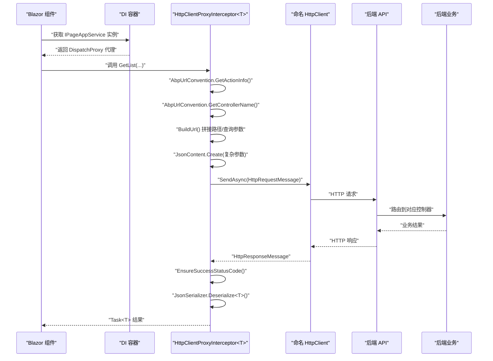
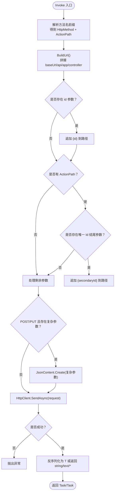
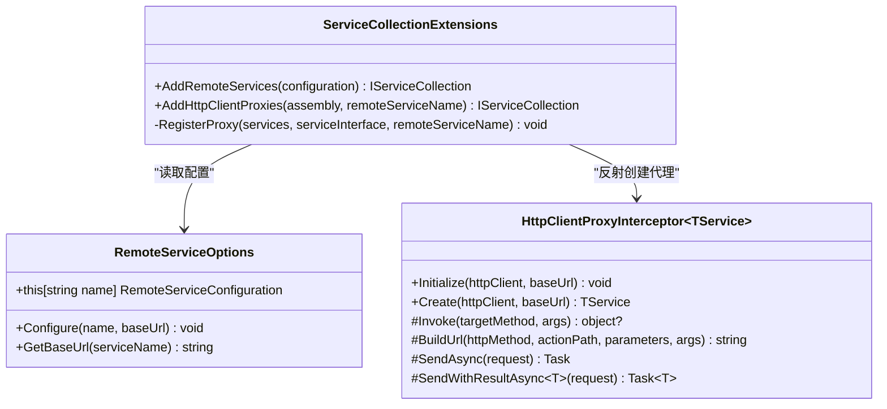
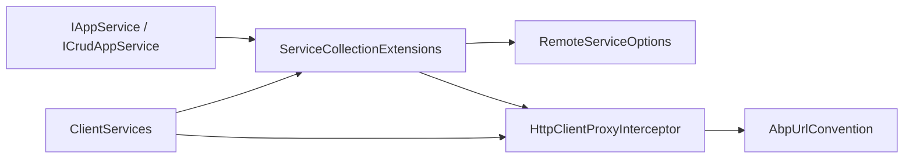

# 用户请求流

<cite>
**本文引用的文件**   
- [HttpClientProxyInterceptor.cs](file://src/Utils/H.Abp.HttpClientProxy/HttpClientProxyInterceptor.cs)
- [AbpUrlConvention.cs](file://src/Utils/H.Abp.HttpClientProxy/AbpUrlConvention.cs)
- [ServiceCollectionExtensions.cs](file://src/Utils/H.Abp.HttpClientProxy/ServiceCollectionExtensions.cs)
- [RemoteServiceOptions.cs](file://src/Utils/H.Abp.HttpClientProxy/RemoteServiceOptions.cs)
- [IAppService.cs](file://src/src/Utils/src/Utils/H.Abp.Application.Contracts/IAppService.cs)
- [ICrudAppService.cs](file://src/src/Utils/src/Utils/H.Abp.Application.Contracts/ICrudAppService.cs)
- [ClientServices.cs](file://src/Host/H.AppLab.Web.Host/H.AppLab.Web.Host.Client/ClientServices.cs)
- [Program.cs](file://src/Host/H.AppLab.Web.Host/H.AppLab.Web.Host.Client/Program.cs)
- [ClientServices.cs](file://src/Host/Account/H.Account.Host.Client/ClientServices.cs)
- [ClientServices.cs](file://src/Host/RenderEngine/H.LowCode.RenderEngine.Host.Client/ClientServices.cs)
</cite>

## 目录
1. [简介](#简介)
2. [项目结构](#项目结构)
3. [核心组件](#核心组件)
4. [架构总览](#架构总览)
5. [详细组件分析](#详细组件分析)
6. [依赖关系分析](#依赖关系分析)
7. [性能与可观测性](#性能与可观测性)
8. [故障排查指南](#故障排查指南)
9. [结论](#结论)
10. [附录：客户端自动代理示例](#附录客户端自动代理示例)

## 简介
本文面向 Blazor WebAssembly 前端到后端 API 的完整用户请求流，重点解释以下内容：
- 如何通过 HttpClientProxyInterceptor 拦截对 IAppService 接口方法的调用。
- URL 路由约定 AbpUrlConvention 如何将接口名、方法名转换为 ABP 风格路径。
- 请求参数如何序列化为 JSON，以及响应体如何反序列化为泛型返回类型。
- 客户端服务注册与配置，特别是 ClientServices.cs 中的依赖注入设置和命名 HttpClient 管道。
- 认证令牌处理策略（Cookie 透传）、错误响应的统一处理方式和可扩展的重试机制建议。
- 如何在客户端使用自定义 AppService 接口并自动生成 HTTP 代理实现。
- 请求性能监控与调试技巧。

## 项目结构
本项目的请求链路涉及两个关键层次：
- 工具层：H.Abp.HttpClientProxy 提供基于 DispatchProxy 的 HTTP 客户端代理、ABP URL 约定解析、远程服务配置加载与 DI 扩展。
- 宿主层：Blazor WebAssembly 客户端通过 ClientServices 将远程服务接口注册为 HttpClient 代理，并通过命名 HttpClient 注入 Cookie 等消息处理器。

**图示来源**
- [HttpClientProxyInterceptor.cs:1-234](file://src/Utils/H.Abp.HttpClientProxy/HttpClientProxyInterceptor.cs#L1-L234)
- [ServiceCollectionExtensions.cs:1-63](file://src/Utils/H.Abp.HttpClientProxy/ServiceCollectionExtensions.cs#L1-L63)
- [ClientServices.cs:1-193](file://src/Host/H.AppLab.Web.Host/H.AppLab.Web.Host.Client/ClientServices.cs#L1-L193)

**章节来源**
- [HttpClientProxyInterceptor.cs:1-234](file://src/Utils/H.Abp.HttpClientProxy/HttpClientProxyInterceptor.cs#L1-L234)
- [ServiceCollectionExtensions.cs:1-63](file://src/Utils/H.Abp.HttpClientProxy/ServiceCollectionExtensions.cs#L1-L63)
- [ClientServices.cs:1-193](file://src/Host/H.AppLab.Web.Host/H.AppLab.Web.Host.Client/ClientServices.cs#L1-L193)

## 核心组件
- HttpClientProxyInterceptor<TService>：基于 DispatchProxy 的拦截器，把接口方法调用转为 HTTP 请求，并负责 URL 构建、参数序列化、响应反序列化。
- AbpUrlConvention：提供 ABP 风格的 URL 约定，包括控制器名和方法名转换。
- ServiceCollectionExtensions：提供 AddRemoteServices 与 AddHttpClientProxies，从配置中读取远程服务 BaseUrl，扫描程序集内所有继承 IAppService 的接口并注册代理。
- RemoteServiceOptions：保存 RemoteServices 节点下的各服务 BaseUrl 配置。
- IAppService / ICrudAppService：作为客户端与服务端共享的契约基类，用于识别需要生成代理的服务接口。
- ClientServices：在 Blazor WASM 启动时注册远程服务 HttpClient、消息处理器、代理工厂；支持按模块懒加载注册。

**章节来源**
- [HttpClientProxyInterceptor.cs:1-234](file://src/Utils/H.Abp.HttpClientProxy/HttpClientProxyInterceptor.cs#L1-L234)
- [AbpUrlConvention.cs:1-86](file://src/Utils/H.Abp.HttpClientProxy/AbpUrlConvention.cs#L1-L86)
- [ServiceCollectionExtensions.cs:1-63](file://src/Utils/H.Abp.HttpClientProxy/ServiceCollectionExtensions.cs#L1-L63)
- [RemoteServiceOptions.cs:1-33](file://src/Utils/H.Abp.HttpClientProxy/RemoteServiceOptions.cs#L1-L33)
- [IAppService.cs](file://src/src/Utils/src/Utils/H.Abp.Application.Contracts/IAppService.cs)
- [ICrudAppService.cs](file://src/src/Utils/src/Utils/H.Abp.Application.Contracts/ICrudAppService.cs)
- [ClientServices.cs:1-193](file://src/Host/H.AppLab.Web.Host/H.AppLab.Web.Host.Client/ClientServices.cs#L1-L193)

## 架构总览
下图展示一次典型的用户请求从 Blazor 组件发起，到后端 API 处理的完整流程：

**图示来源**
- [HttpClientProxyInterceptor.cs:1-234](file://src/Utils/H.Abp.HttpClientProxy/HttpClientProxyInterceptor.cs#L1-L234)
- [AbpUrlConvention.cs:1-86](file://src/Utils/H.Abp.HttpClientProxy/AbpUrlConvention.cs#L1-L86)
- [ClientServices.cs:1-193](file://src/Host/H.AppLab.Web.Host/H.AppLab.Web.Host.Client/ClientServices.cs#L1-L193)

## 详细组件分析

### HttpClientProxyInterceptor：请求拦截与数据流转
该拦截器是客户端请求流的“中枢”，承担以下职责：
- 初始化阶段：持有 HttpClient、baseUrl 以及根据 TService 推导出的 _controllerName。
- 拦截阶段：Invoke 捕获接口方法调用，解析 HTTP 动词、action 路径，构建 URL，封装请求体，执行 SendAsync。
- 响应阶段：校验成功状态码，处理空响应、纯文本 string 响应、JSON 响应并反序列化为 Task<T> 或 Task。

关键行为说明：
- 方法名前缀映射：GetList、GetAll、Get → GET；Put、Update → PUT；Delete、Remove → DELETE；Create、Add、Insert、Post → POST；Patch → PATCH。无匹配前缀时默认 POST。
- 控制器名推导：去掉 I 前缀、去除 AppService/ApplicationService 后缀，再转换为 kebab-case。
- URL 构建规则：
  - 基础路径：{baseUrl}/api/app/{controller}
  - id 参数：名为 id 且类型为简单类型的参数会插入到 controller 之后。
  - actionPath：若有 action，则追加到路径。
  - 二级 Id：若恰好有一个以 Id 结尾且非 id 本身的简单类型参数，会追加到 action 之后。
  - 查询参数：剩余简单参数转为 camelCase 后放入查询字符串；GET/DELETE 的复杂参数会展开为键值对查询参数。
- 请求体：POST/PUT 时，第一个非简单类型参数会被序列化为 JSON 放入请求体。
- 返回值：
  - Task：直接发送并检查状态码。
  - Task<T>：根据返回类型反序列化响应体；NoContent 返回 default；string 且 Content-Type 为 text/* 时直接返回原文。

**图示来源**
- [HttpClientProxyInterceptor.cs:1-234](file://src/Utils/H.Abp.HttpClientProxy/HttpClientProxyInterceptor.cs#L1-L234)

**章节来源**
- [HttpClientProxyInterceptor.cs:1-234](file://src/Utils/H.Abp.HttpClientProxy/HttpClientProxyInterceptor.cs#L1-L234)

### AbpUrlConvention：URL 路由约定
AbpUrlConvention 保证客户端与服务端的 URL 约定一致：
- GetControllerName：
  - 去掉 I 前缀。
  - 去除 ApplicationService 或 AppService 后缀。
  - PascalCase → kebab-case，例如 GetById → get-by-id。
- GetActionInfo：
  - 去除 Async 后缀。
  - 匹配 ABP 前缀：GetList、GetAll、Get、Put、Update、Delete、Remove、Create、Add、Insert、Post、Patch。
  - 未匹配时默认 POST，并将剩余方法名转为 kebab-case 作为 action。
- ToKebabCase：
  - 先转 camelCase，再在小写字母/数字与大写字母之间插入连字符，最后全小写。

这些约定使得客户端无需手写 API 地址，只需遵循 ABP 命名规范即可自动映射到服务端控制器。

**章节来源**
- [AbpUrlConvention.cs:1-86](file://src/Utils/H.Abp.HttpClientProxy/AbpUrlConvention.cs#L1-L86)

### ServiceCollectionExtensions：客户端服务注册与配置
ServiceCollectionExtensions 提供两个重要扩展：
- AddRemoteServices(configuration)：
  - 读取 IConfiguration 的 RemoteServices 节点。
  - 将每个子项的 BaseUrl 写入 RemoteServiceOptions。
- AddHttpClientProxies(assembly, remoteServiceName)：
  - 扫描 assembly 中所有继承 IAppService 的接口。
  - 为每个接口注册一个 scoped 代理实例。
  - 代理通过反射调用 HttpClientProxyInterceptor<T>.Create(httpClient, baseUrl)。
  - httpClient 由 IHttpClientFactory 创建，baseUrl 由 RemoteServiceOptions 提供。

**图示来源**
- [ServiceCollectionExtensions.cs:1-63](file://src/Utils/H.Abp.HttpClientProxy/ServiceCollectionExtensions.cs#L1-L63)
- [RemoteServiceOptions.cs:1-33](file://src/Utils/H.Abp.HttpClientProxy/RemoteServiceOptions.cs#L1-L33)
- [HttpClientProxyInterceptor.cs:1-234](file://src/Utils/H.Abp.HttpClientProxy/HttpClientProxyInterceptor.cs#L1-L234)

**章节来源**
- [ServiceCollectionExtensions.cs:1-63](file://src/Utils/H.Abp.HttpClientProxy/ServiceCollectionExtensions.cs#L1-L63)
- [RemoteServiceOptions.cs:1-33](file://src/Utils/H.Abp.HttpClientProxy/RemoteServiceOptions.cs#L1-L33)

### ClientServices：Blazor WASM 启动配置与模块懒加载
ClientServices 是 Blazor WASM 应用的服务注册中心，主要职责：
- 加载 RemoteServices 配置。
- 注册默认 HttpClient（BaseAddress 为宿主地址）。
- 注册全局 CookieHandler、AppIdHeaderHandler。
- 为每个远程服务注册命名 HttpClient，并附加 CookieHandler 与 AppIdHeaderHandler。
- 按需懒加载各模块的 IAppService 代理。

关键特性：
- 命名 HttpClient 列表：DesignEngine、RenderEngine、Account、Organization、Approval、Testing、Portal、Notification、AI、Enterprise、SystemPortal、Order、Setting、SupplyChain、BackgroundTask、File。
- Testing 远程服务超时设置为无限，避免长时间测试任务被取消。
- LazyModuleRegistrations：将路由段映射到模块注册 key，并在 LazyModuleRegistry 下载完程序集后延迟注册代理。
- RegisterLazyModule：转发根容器的 RemoteServiceOptions、IHttpClientFactory、IJSRuntime 到模块子容器，确保代理能正确解析所需服务。

其他客户端示例：
- Account.Host.Client：最小化注册，仅包含 Account 服务的代理。
- RenderEngine.Host.Client：注册 RenderEngine 与 LowCode 基础服务的代理，并注入 LowCodeAppState。

**章节来源**
- [ClientServices.cs:1-193](file://src/Host/H.AppLab.Web.Host/H.AppLab.Web.Host.Client/ClientServices.cs#L1-L193)
- [ClientServices.cs:1-34](file://src/Host/Account/H.Account.Host.Client/ClientServices.cs#L1-L34)
- [ClientServices.cs:1-49](file://src/Host/RenderEngine/H.LowCode.RenderEngine.Host.Client/ClientServices.cs#L1-L49)
- [Program.cs:1-13](file://src/Host/H.AppLab.Web.Host/H.AppLab.Web.Host.Client/Program.cs#L1-L13)

### 认证令牌处理、错误响应与重试机制
- 认证令牌处理：
  - 当前实现通过 CookieHandler 让 Blazor WASM 的 fetch 请求携带认证 Cookie。
  - 如果需要访问令牌（Bearer Token），可在 CookieHandler 或新增的消息处理器中动态添加 Authorization 头。
- 错误响应统一处理：
  - 当前 HttpClientProxyInterceptor 使用 EnsureSuccessStatusCode()，当状态码非成功时会抛出异常。
  - 如需统一错误格式，可以在 CookieHandler 或新增消息处理器中包装 HttpResponseMessage，或在业务层捕获异常并转换为前端友好提示。
- 重试机制：
  - 当前代码未内置重试策略。
  - 可通过 Polly 或自定义 HttpMessageHandler 实现指数退避重试、针对特定状态码重试。
  - 建议在命名 HttpClient 管道中插入重试处理器，以便对所有远程服务生效。

**章节来源**
- [HttpClientProxyInterceptor.cs:1-234](file://src/Utils/H.Abp.HttpClientProxy/HttpClientProxyInterceptor.cs#L1-L234)
- [ClientServices.cs:1-193](file://src/Host/H.AppLab.Web.Host/H.AppLab.Web.Host.Client/ClientServices.cs#L1-L193)

## 依赖关系分析
下图展示了关键组件之间的依赖关系：

**图示来源**
- [IAppService.cs](file://src/src/Utils/src/Utils/H.Abp.Application.Contracts/IAppService.cs)
- [ICrudAppService.cs](file://src/src/Utils/src/Utils/H.Abp.Application.Contracts/ICrudAppService.cs)
- [ServiceCollectionExtensions.cs:1-63](file://src/Utils/H.Abp.HttpClientProxy/ServiceCollectionExtensions.cs#L1-L63)
- [RemoteServiceOptions.cs:1-33](file://src/Utils/H.Abp.HttpClientProxy/RemoteServiceOptions.cs#L1-L33)
- [HttpClientProxyInterceptor.cs:1-234](file://src/Utils/H.Abp.HttpClientProxy/HttpClientProxyInterceptor.cs#L1-L234)
- [ClientServices.cs:1-193](file://src/Host/H.AppLab.Web.Host/H.AppLab.Web.Host.Client/ClientServices.cs#L1-L193)

**章节来源**
- [ServiceCollectionExtensions.cs:1-63](file://src/Utils/H.Abp.HttpClientProxy/ServiceCollectionExtensions.cs#L1-L63)
- [HttpClientProxyInterceptor.cs:1-234](file://src/Utils/H.Abp.HttpClientProxy/HttpClientProxyInterceptor.cs#L1-L234)
- [ClientServices.cs:1-193](file://src/Host/H.AppLab.Web.Host/H.AppLab.Web.Host.Client/ClientServices.cs#L1-L193)

## 性能与可观测性
- 性能优化建议：
  - 复用命名 HttpClient：ClientServices 已为每个远程服务注册命名 HttpClient，避免重复创建连接。
  - 合理设置超时：Testing 远程服务使用无限超时以避免长任务中断；其他服务可根据业务调整。
  - 减少复杂参数展开：GET/DELETE 的复杂参数会展开为多个查询参数，注意避免过大查询串。
  - 压缩与缓存：对静态资源或频繁请求的数据启用压缩与浏览器缓存。
- 可观测性与调试技巧：
  - 在 CookieHandler 或新增消息处理器中记录请求 URL、方法、耗时、状态码。
  - 使用浏览器开发者工具的 Network 面板观察请求与响应。
  - 在服务端启用日志，对照客户端日志进行端到端追踪。
  - 对高频接口增加指标收集（如每秒请求数、错误率、平均延迟）。

[本节为通用指导，不直接分析具体文件]

## 故障排查指南
常见问题与解决思路：
- 接口方法无法映射到预期 URL：
  - 检查方法名前缀是否符合约定（GetList、GetAll、Get、Put、Update、Delete、Remove、Create、Add、Insert、Post、Patch）。
  - 确认控制器名是否遵循 I*AppService 命名规范。
- 参数未正确传递：
  - id 参数必须命名为 id 且为简单类型。
  - 二级 Id 参数必须以 Id 结尾且只有一个。
  - 复杂参数在 POST/PUT 时才会进入请求体；GET/DELETE 的复杂参数会展开为查询参数。
- 响应为空或反序列化失败：
  - NoContent 返回 default。
  - string 且 Content-Type 为 text/* 时直接返回原文。
  - 其他情况尝试 JSON 反序列化；确保服务端返回的 JSON 字段与目标类型兼容。
- 认证失败：
  - 检查 CookieHandler 是否正确注入并携带 Cookie。
  - 如需 Bearer Token，请扩展消息处理器注入 Authorization 头。
- 长任务被取消：
  - 检查对应命名 HttpClient 的 Timeout 设置；Testing 服务已设为无限超时。

**章节来源**
- [HttpClientProxyInterceptor.cs:1-234](file://src/Utils/H.Abp.HttpClientProxy/HttpClientProxyInterceptor.cs#L1-L234)
- [ClientServices.cs:1-193](file://src/Host/H.AppLab.Web.Host/H.AppLab.Web.Host.Client/ClientServices.cs#L1-L193)

## 结论
本项目通过 HttpClientProxyInterceptor 与 AbpUrlConvention 实现了 ABP 风格的客户端 HTTP 代理，结合 ServiceCollectionExtensions 与 ClientServices 完成依赖注入与模块化懒加载。请求流清晰可控：Blazor 组件调用 IAppService 接口，代理自动转换为 HTTP 请求，经命名 HttpClient 与消息处理器发送到后端 API，最终返回强类型结果。认证通过 Cookie 透传，错误响应统一抛异常，重试机制可扩展。整体架构简洁、可维护性强，适合多模块、多远程服务的 Blazor WASM 应用。

[本节为总结性内容，不直接分析具体文件]

## 附录：客户端自动代理示例
下面给出一个自定义 AppService 接口在客户端被自动代理实现的示例说明。假设你定义了一个 PageAppService 接口并继承 IAppService：

- 服务端约定：
  - 接口名：IPageAppService
  - 方法名：GetList、GetById、Create、Update、Delete
- 客户端自动代理行为：
  - 控制器名：page
  - URL 映射：
    - GetList → GET /api/app/page/get-list
    - GetById(id) → GET /api/app/page/get-by-id/{id}
    - Create(data) → POST /api/app/page/create（data 为 JSON 请求体）
    - Update(data) → PUT /api/app/page/update（data 为 JSON 请求体）
    - Delete(id) → DELETE /api/app/page/delete/{id}

你可以在任意 Blazor 组件中直接注入 IPageAppService，并调用其异步方法。依赖注入容器会自动返回 DispatchProxy 代理实例，无需手动构造 HttpClient 或拼接 URL。

**章节来源**
- [AbpUrlConvention.cs:1-86](file://src/Utils/H.Abp.HttpClientProxy/AbpUrlConvention.cs#L1-L86)
- [HttpClientProxyInterceptor.cs:1-234](file://src/Utils/H.Abp.HttpClientProxy/HttpClientProxyInterceptor.cs#L1-L234)
- [ServiceCollectionExtensions.cs:1-63](file://src/Utils/H.Abp.HttpClientProxy/ServiceCollectionExtensions.cs#L1-L63)
- [ClientServices.cs:1-193](file://src/Host/H.AppLab.Web.Host/H.AppLab.Web.Host.Client/ClientServices.cs#L1-L193)