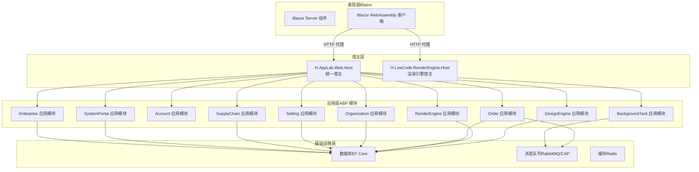
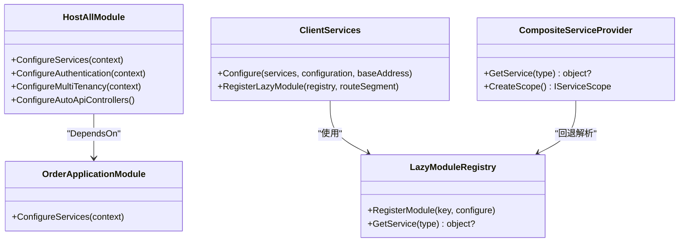
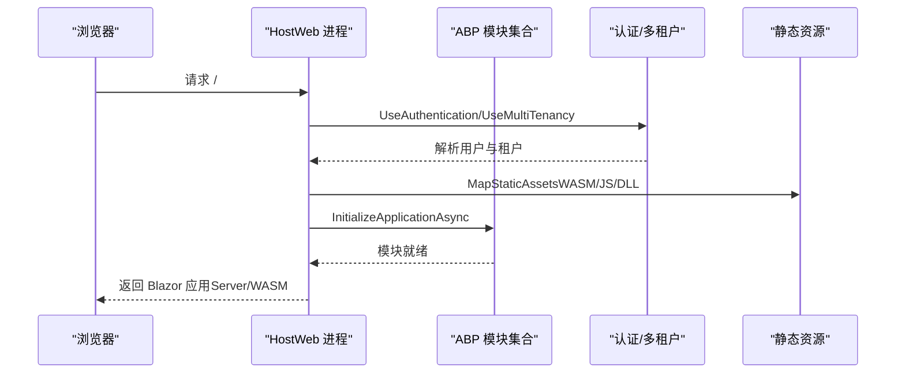
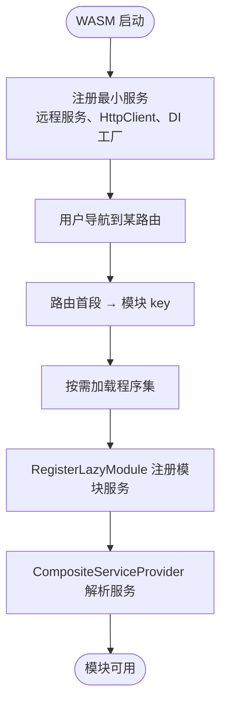
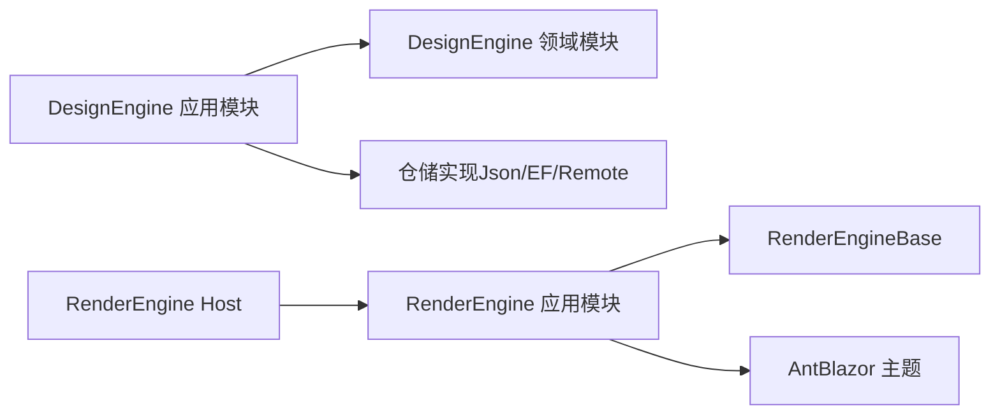
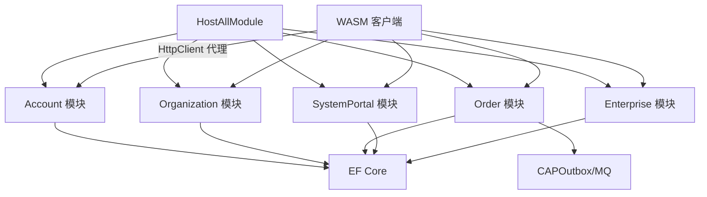

# 整体架构

<cite>
**本文引用的文件**   
- [README.md](file://README.md)
- [Program.cs](file://src/Host/H.AppLab.Web.Host/H.AppLab.Web.Host/Program.cs)
- [HostAllModule.cs](file://src/Host/H.AppLab.Web.Host/H.AppLab.Web.Host/HostAllModule.cs)
- [ClientServices.cs](file://src/Host/H.AppLab.Web.Host/H.AppLab.Web.Host.Client/ClientServices.cs)
- [LazyModuleServices.cs](file://src/Host/H.AppLab.Web.Host/H.AppLab.Web.Host.Client/LazyModuleServices.cs)
- [Program.cs（RenderEngine Host）](file://src/Host/RenderEngine/H.LowCode.RenderEngine.Host/Program.cs)
- [Program.cs（RenderEngine Client）](file://src/Host/RenderEngine/H.LowCode.RenderEngine.Host.Client/Program.cs)
- [OrderApplicationModule.cs](file://src/Services/Order/H.Order.Application/OrderApplicationModule.cs)
- [AccountApplicationContractsModule.cs](file://src/Services/Account/H.Account.Application.Contracts/AccountApplicationContractsModule.cs)
- [OrderApplicationContractsModule.cs](file://src/Services/Order/H.Order.Application.Contracts/OrderApplicationContractsModule.cs)
- [docker-compose.yml](file://cd/docker-compose.yml)
</cite>

## 更新摘要
**已进行的变更**
- 更新了统一宿主项目名称从 H.AppLab.Host.All 到 H.AppLab.Web.Host
- 修正了所有架构图和引用路径以反映新的项目结构
- 更新了相关配置和依赖关系说明

## 目录
1. [简介](#简介)
2. [项目结构](#项目结构)
3. [核心组件](#核心组件)
4. [架构总览](#架构总览)
5. [详细组件分析](#详细组件分析)
6. [依赖关系分析](#依赖关系分析)
7. [性能考量](#性能考量)
8. [故障排查指南](#故障排查指南)
9. [结论](#结论)
10. [附录](#附录)

## 简介
本文件为 AppLab 平台的整体架构文档，面向希望理解系统分层、模块化与 Blazor Web App 模式的技术读者。平台基于 .NET + ABP 框架与 Blazor（Server + WebAssembly）构建，采用"统一宿主 + 多模块"的混合架构：既支持单体部署（H.AppLab.Web.Host），也支持按服务独立部署（各业务域单独 Host）。通过 ABP 模块系统实现功能解耦与独立演进；通过 HttpClient 动态代理与 WASM 懒加载，达成前端按需加载与零样板调用代码；通过多租户、认证授权、响应压缩与 AOT/Trimming 等能力，兼顾可运维性与性能。

## 项目结构
- 宿主层（Host）
  - H.AppLab.Web.Host：统一宿主，聚合所有应用模块，提供统一的入口、路由、认证、多租户、中间件管线与静态资源托管。
  - 其他 Host：如 RenderEngine 单服务宿主，用于独立部署渲染引擎。
- 领域与服务层（Services）
  - 按限界上下文划分：Account、Organization、Approval、Notification、Order、Setting、SupplyChain、BackgroundTask、Testing 等。每个模块遵循 Application.Contracts / Application / EntityFrameworkCore / Web 的分层组织。
- 低代码子系统（LowCode）
  - Common：元数据 Schema、组件基类、默认组件库、实体与应用契约等公共部分。
  - DesignEngine：设计器，产出应用元数据，包含 Workbench、MyApp 等设计端应用。
  - RenderEngine：渲染引擎，根据元数据动态渲染应用，主题基于 Ant Design Blazor。
  - meta：应用与组件的元数据（JSON）存放目录。仓储支持 JsonFile / EF Core / RemoteService 多种实现。
- 系统级应用（System）
  - Enterprise、SystemPortal，面向平台运营侧，与 Services 下的企业级应用严格隔离。
- 工具与共享（Tools、Utils、Components）
  - Tools：各服务的 DbMigrator 控制台程序，用于数据库迁移。
  - Utils：HttpClient 动态代理、Blazor 工具、ID 生成、系统扩展等。
  - Components：共享 UI 组件（如 AppDrawer）。

章节来源
- [README.md:1-74](file://README.md#L1-L74)

## 核心组件
- 统一宿主（H.AppLab.Web.Host）
  - 职责：注册所有 ABP 模块、配置认证与多租户、启用 MVC 控制器、SignalR、响应压缩、Hangfire 仪表盘、Blazor 路由与静态资源托管。
  - 关键点：通过 AbpModule 的 DependsOn 声明聚合所有应用模块；使用 Cookie 认证与多租户解析器；集中注册自动 API 控制器。
- 客户端服务与懒加载
  - 职责：在 WASM 启动时仅注册最小必要服务；导航到具体路由时再延迟注册对应模块的 HttpClient 代理与基础服务。
  - 关键点：ClientServices 维护路由到模块 key 的映射；LazyModuleRegistry 管理模块子容器；CompositeServiceProvider 实现根容器与模块容器的回退解析。
- 低代码子系统
  - 设计器（DesignEngine）：负责页面/组件可视化设计与元数据持久化，仓储可切换 JSON/EF/RemoteService。
  - 渲染器（RenderEngine）：根据元数据动态渲染应用，支持主题（AntBlazor）与运行时数据操作。
- 业务服务（Services）
  - 以限界上下文划分，每个模块具备 Contracts/Application/EF/Web 四层，保证高内聚、低耦合与独立演进。
- 工具与共享
  - HttpClient 动态代理（Abp.HttpClientProxy）：基于 IAppService 接口自动生成 HTTP 调用，前后端一致。
  - 组件库（AppDrawer）：统一布局与导航体验。

章节来源
- [HostAllModule.cs:1-203](file://src/Host/H.AppLab.Web.Host/H.AppLab.Web.Host/HostAllModule.cs#L1-L203)
- [ClientServices.cs:1-171](file://src/Host/H.AppLab.Web.Host/H.AppLab.Web.Host.Client/ClientServices.cs#L1-L171)
- [LazyModuleServices.cs:1-144](file://src/Host/H.AppLab.Web.Host/H.AppLab.Web.Host.Client/LazyModuleServices.cs#L1-L144)
- [OrderApplicationModule.cs:1-49](file://src/Services/Order/H.Order.Application/OrderApplicationModule.cs#L1-L49)

## 架构总览
系统采用分层架构与模块化设计：
- 表现层（Blazor）
  - Server 组件处理交互逻辑与渲染；WASM 客户端按需加载程序集，减少首屏体积。
- 应用层（ABP 模块）
  - 每个业务域一个模块，暴露 IAppService 接口；通过 Abp.AspNetCore.Mvc 自动注册控制器。
- 领域层（Domain）
  - 定义实体、仓储接口与领域服务；仓储实现可替换（JsonFile/EF/RemoteService）。
- 基础设施层（Infrastructure）
  - EF Core 数据访问、CAP 消息总线、Redis/RabbitMQ 等外部依赖。

## 详细组件分析

### 统一宿主（H.AppLab.Web.Host）
- 启动流程
  - 创建 WebApplicationBuilder，注册 Blazor、SignalR、JSON 序列化、响应压缩。
  - 使用 Autofac 并加载 HostAllModule，完成所有模块的服务注册。
  - 构建应用后初始化，配置异常处理、HTTPS、路由、认证、多租户、授权、防伪令牌。
  - 映射控制器、MCP 端点、Hangfire 仪表盘与 Blazor 组件（含多个 WebAssembly 程序集）。
- 关键特性
  - 多租户：启用 ABP 多租户，自定义从 Claims 解析租户，无效租户清理并重定向。
  - 认证：Cookie 认证（系统与通用两套 Scheme），登录/拒绝路径统一。
  - 控制器：集中注册各模块的自动 API 控制器。
  - 静态资源：MapStaticAssets 统一管理 WASM 程序集的缓存策略。

章节来源
- [Program.cs:1-115](file://src/Host/H.AppLab.Web.Host/H.AppLab.Web.Host/Program.cs#L1-L115)
- [HostAllModule.cs:1-203](file://src/Host/H.AppLab.Web.Host/H.AppLab.Web.Host/HostAllModule.cs#L1-L203)

### 客户端服务与懒加载（WASM）
- 启动阶段
  - 仅注册最小服务：远程服务配置、默认 HttpClient、命名 HttpClient（带 CookieHandler）、组合式 DI 工厂。
  - 不预加载任何业务 Contracts 代理，避免初始包体过大。
- 导航阶段
  - 根据路由首段映射到模块 key（如 organization、approval、lowcode-design 等）。
  - 触发程序集懒加载后，调用 RegisterLazyModule 将对应模块的 HttpClient 代理与基础服务注册到模块子容器。
  - CompositeServiceProvider 在解析服务时优先根容器，未命中则回退到模块子容器。
- 优势
  - 首屏快速、按需下载、模块隔离、服务生命周期清晰。

章节来源
- [ClientServices.cs:1-171](file://src/Host/H.AppLab.Web.Host/H.AppLab.Web.Host.Client/ClientServices.cs#L1-L171)
- [LazyModuleServices.cs:1-144](file://src/Host/H.AppLab.Web.Host/H.AppLab.Web.Host.Client/LazyModuleServices.cs#L1-L144)

### 低代码子系统（DesignEngine 与 RenderEngine）
- 设计器（DesignEngine）
  - 应用层模块依赖 Domain 与 Common，提供 IAppApplicationService 等接口。
  - 仓储实现可切换（JsonFile/EF/RemoteService），便于开发/测试/生产环境灵活选择。
- 渲染器（RenderEngine）
  - 应用层模块依赖 Common 与 MetaSchema，根据元数据动态渲染页面与组件。
  - 主题基于 AntBlazor，提供一致的 UI 风格。
- 宿主（RenderEngine Host）
  - 独立的单服务宿主，仅承载渲染引擎，适合独立部署与扩缩容。

章节来源
- [Program.cs（RenderEngine Host）:1-49](file://src/Host/RenderEngine/H.LowCode.RenderEngine.Host/Program.cs#L1-L49)
- [Program.cs（RenderEngine Client）:1-18](file://src/Host/RenderEngine/H.LowCode.RenderEngine.Host.Client/Program.cs#L1-L18)

### 业务服务示例（Order）
- 应用层模块
  - 注册 HttpContextAccessor、HttpClient、供应商客户端工厂与领域服务。
  - 集成 CAP：SqlServer 作为 Outbox 存储，In-Memory 消息队列（开发环境），消费者订阅事件。
- 价值
  - 通过 CAP 实现可靠的消息发布/订阅与最终一致性；易于切换到 RabbitMQ/Kafka。

章节来源
- [OrderApplicationModule.cs:1-49](file://src/Services/Order/H.Order.Application/OrderApplicationModule.cs#L1-L49)

### 契约模块标记（示例）
- Account 与 Order 的 Contracts 模块提供 Assembly 属性，供 HttpClient 动态代理扫描与注册。
- 作用：在 WASM 客户端按程序集批量注册代理，无需手写 HttpClient 调用。

章节来源
- [AccountApplicationContractsModule.cs:1-10](file://src/Services/Account/H.Account.Application.Contracts/AccountApplicationContractsModule.cs#L1-L10)
- [OrderApplicationContractsModule.cs:1-10](file://src/Services/Order/H.Order.Application.Contracts/OrderApplicationContractsModule.cs#L1-L10)

## 依赖关系分析
- 宿主对模块的依赖
  - HostAllModule 通过 DependsOn 声明聚合所有应用模块，形成"统一宿主"的强聚合视图。
- 客户端对契约的依赖
  - WASM 客户端仅依赖 Application.Contracts 中的接口，通过 Abp.HttpClientProxy 生成 HTTP 代理。
- 模块间依赖
  - Approval.Web 引用 Organization 的 Contracts（跨模块依赖，合理且受控）。
- 基础设施依赖
  - EF Core、CAP、Redis、RabbitMQ 等由 docker-compose 或配置文件注入。

章节来源
- [HostAllModule.cs:1-203](file://src/Host/H.AppLab.Web.Host/H.AppLab.Web.Host/HostAllModule.cs#L1-L203)
- [OrderApplicationModule.cs:1-49](file://src/Services/Order/H.Order.Application/OrderApplicationModule.cs#L1-L49)
- [docker-compose.yml:1-32](file://cd/docker-compose.yml#L1-L32)

## 性能考量
- 响应压缩
  - 启用 Brotli/Gzip 压缩，针对 WASM、DLL、二进制流优化传输体积。
- 静态资源缓存
  - MapStaticAssets 对指纹化的 WASM 程序集启用 immutable 长缓存，避免更新失效问题。
- WASM 懒加载
  - 首屏仅加载必要程序集，其余模块在导航时按需下载，显著降低初始负载。
- AOT 与裁剪
  - Release 模式启用 AOT 与 Trimming，进一步减小包体与提升启动速度。
- 并发与实时
  - SignalR 支持大消息与详细错误（开发环境），适用于实时通知与协作场景。

## 故障排查指南
- 常见问题
  - WASM 启动卡在"加载中..."：检查是否误将整个 /_framework 标记为 immutable，导致清单与指纹不一致。
  - 租户无效导致 404：检查 __tenant Cookie 与 Claims 中的 TenantId，确保租户存在且有效。
  - 认证失败：确认 Cookie 名称、过期时间、滑动过期与登录路径配置正确。
  - 代理未生效：确认 AddHttpClientProxies 已按模块程序集注册，且 RemoteServices 配置正确。
- 定位手段
  - 启用 WebAssembly 调试与详细错误日志。
  - Hangfire 仪表盘查看后台任务执行情况。
  - 通过浏览器开发者工具检查网络请求与程序集加载顺序。

章节来源
- [Program.cs:1-115](file://src/Host/H.AppLab.Web.Host/H.AppLab.Web.Host/Program.cs#L1-L115)
- [HostAllModule.cs:1-203](file://src/Host/H.AppLab.Web.Host/H.AppLab.Web.Host/HostAllModule.cs#L1-L203)

## 结论
AppLab 平台通过 ABP 模块化与 Blazor Web App（Server + WASM）的组合，实现了高内聚、低耦合、可独立部署与高性能的前后端一体化架构。统一宿主（H.AppLab.Web.Host）简化了部署与运维，WASM 懒加载与 HttpClient 动态代理提升了用户体验与开发效率。低代码子系统与设计/渲染分离，使平台具备强大的可扩展性与主题定制能力。结合多租户、认证授权、消息总线与缓存，平台满足企业级应用的复杂需求。

## 附录
- 本地依赖服务（Redis、RabbitMQ）可通过 cd/docker-compose.yml 一键启动。
- 数据库迁移通过 Tools 下各 DbMigrator 执行。
- 主程序启动命令参考 README 说明。

章节来源
- [docker-compose.yml:1-32](file://cd/docker-compose.yml#L1-L32)
- [README.md:38-56](file://README.md#L38-L56)