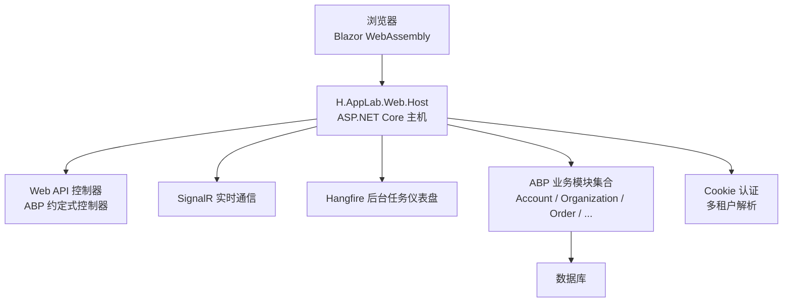
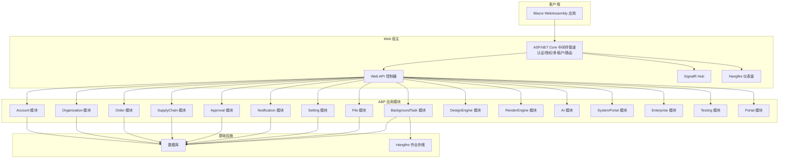
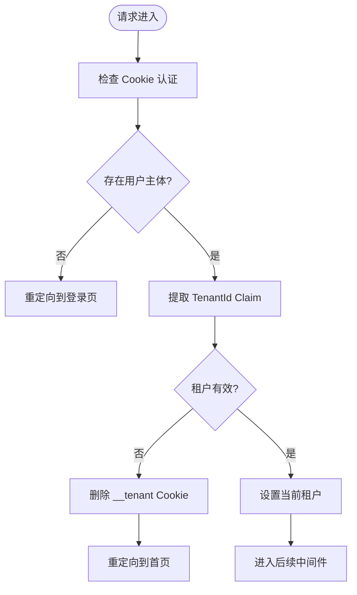
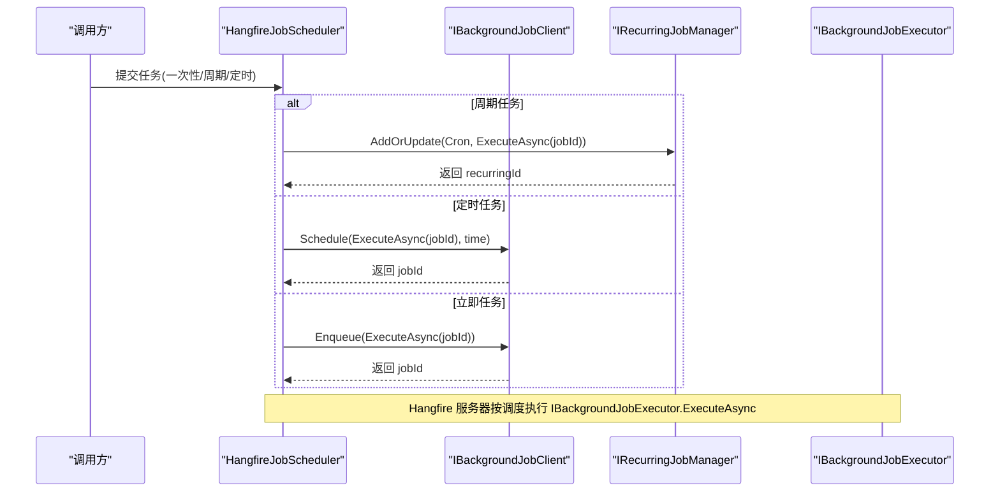
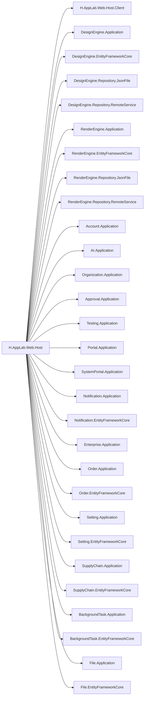
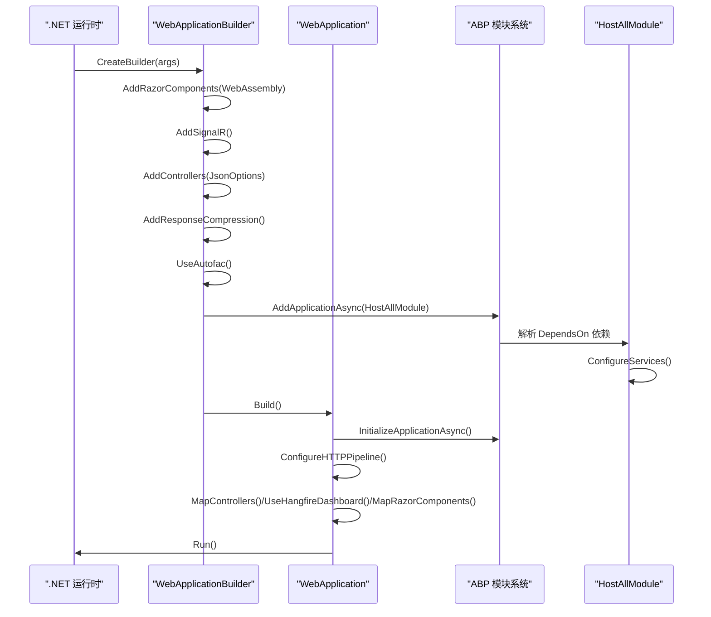

# 整体架构概览

<cite>
**本文引用的文件**   
- [Program.cs](file://src/Host/H.AppLab.Web.Host/H.AppLab.Web.Host/Program.cs)
- [HostAllModule.cs](file://src/Host/H.AppLab.Web.Host/H.AppLab.Web.Host/HostAllModule.cs)
- [ClaimsTenantResolveContributor.cs](file://src/Host/H.AppLab.Web.Host/H.AppLab.Web.Host/ClaimsTenantResolveContributor.cs)
- [H.AppLab.Web.Host.csproj](file://src/Host/H.AppLab.Web.Host/H.AppLab.Web.Host/H.AppLab.Web.Host.csproj)
- [BackgroundTaskApplicationModule.cs](file://src/Services/BackgroundTask/H.BackgroundTask.Application/BackgroundTaskApplicationModule.cs)
- [HangfireJobScheduler.cs](file://src/Services/BackgroundTask/H.BackgroundTask.Application/Services/HangfireJobScheduler.cs)
</cite>

## 目录
1. [引言](#引言)
2. [项目结构](#项目结构)
3. [核心组件](#核心组件)
4. [架构总览](#架构总览)
5. [详细组件分析](#详细组件分析)
6. [依赖关系分析](#依赖关系分析)
7. [性能与可观测性](#性能与可观测性)
8. [启动流程与模块加载机制](#启动流程与模块加载机制)
9. [故障排查指南](#故障排查指南)
10. [结论](#结论)

## 引言
本文件面向 H.AppLab 平台的整体架构，目标是帮助读者快速理解系统采用的 Blazor WebAssembly + ASP.NET Core Web API 全栈模式、ABP Framework 模块化应用框架基础，以及微服务与单体混合部署形态。文档重点说明统一宿主模块如何整合所有业务模块与服务依赖，并解释 SignalR 实时通信、Hangfire 后台任务、多租户支持、Cookie 认证等关键基础设施在系统中的职责和协作方式。同时提供系统上下文图、启动流程图和模块依赖图，便于从宏观到微观把握系统边界与数据流向。

## 项目结构
H.AppLab 采用领域驱动与 ABP 模块化分层组织：
- Host 层：Web 宿主程序承载 Blazor WebAssembly 运行时、ASP.NET Core Web API、SignalR、Hangfire 仪表盘及统一中间件管道。
- Services 层：按业务域拆分为多个 ABP Application 模块，例如账户、企业、订单、供应链、审批、通知、设置、文件、背景任务等，每个模块通常包含 Application、Application.Contracts、EntityFrameworkCore 等子项目。
- LowCode 层：设计引擎与渲染引擎分别作为独立能力域，提供低代码建模、页面设计与运行渲染能力。
- Tools 层：数据库迁移工具，为各业务域提供独立的 DbMigrator 入口。

**图示来源**
- [Program.cs:1-112](file://src/Host/H.AppLab.Web.Host/H.AppLab.Web.Host/Program.cs#L1-L112)
- [HostAllModule.cs:1-207](file://src/Host/H.AppLab.Web.Host/H.AppLab.Web.Host/HostAllModule.cs#L1-L207)

**章节来源**
- [H.AppLab.Web.Host.csproj:1-64](file://src/Host/H.AppLab.Web.Host/H.AppLab.Web.Host/H.AppLab.Web.Host.csproj#L1-L64)

## 核心组件
- 统一宿主模块：HostAllModule 通过 ABP 的 DependsOn 声明，集中注册所有业务模块、基础设施与外部登录能力，是平台扩展与集成的中心点。
- 宿主程序：Program.cs 负责构建 ASP.NET Core 主机、启用 Blazor WebAssembly、SignalR、响应压缩、Hangfire 仪表盘，并按顺序挂载中间件管道。
- 多租户支持：通过 ABP MultiTenancy 与自定义 ClaimsTenantResolveContributor，从认证 Cookie 中的 TenantId Claim 解析当前租户。
- 后台任务：BackgroundTaskApplicationModule 配置 Hangfire 作业存储与服务器；HangfireJobScheduler 封装一次性任务与周期任务的调度逻辑。
- 认证与安全：使用 Cookie 认证，区分系统登录与业务登录两种 Scheme，并在 HostAllModule 中关闭 CSRF 自动验证以适配 WASM 场景。

**章节来源**
- [HostAllModule.cs:1-207](file://src/Host/H.AppLab.Web.Host/H.AppLab.Web.Host/HostAllModule.cs#L1-L207)
- [Program.cs:1-112](file://src/Host/H.AppLab.Web.Host/H.AppLab.Web.Host/Program.cs#L1-L112)
- [ClaimsTenantResolveContributor.cs:1-29](file://src/Host/H.AppLab.Web.Host/H.AppLab.Web.Host/ClaimsTenantResolveContributor.cs#L1-L29)
- [BackgroundTaskApplicationModule.cs:1-55](file://src/Services/BackgroundTask/H.BackgroundTask.Application/BackgroundTaskApplicationModule.cs#L1-L55)
- [HangfireJobScheduler.cs:1-89](file://src/Services/BackgroundTask/H.BackgroundTask.Application/Services/HangfireJobScheduler.cs#L1-L89)

## 架构总览
H.AppLab 的整体架构遵循“前端 Blazor WebAssembly + 后端 ASP.NET Core Web API”的全栈模式，并以 ABP Framework 作为应用框架基础。宿主程序同时承担以下职责：
- 提供 Blazor WebAssembly 渲染与静态资源分发。
- 暴露 RESTful API 给前端调用。
- 集成 SignalR 实现实时消息推送。
- 集成 Hangfire 提供可视化后台任务管理。
- 通过 ABP 的多租户能力实现企业级数据隔离。
- 使用 Cookie 认证保障会话安全与跨页面状态一致性。

**图示来源**
- [Program.cs:1-112](file://src/Host/H.AppLab.Web.Host/H.AppLab.Web.Host/Program.cs#L1-L112)
- [HostAllModule.cs:1-207](file://src/Host/H.AppLab.Web.Host/H.AppLab.Web.Host/HostAllModule.cs#L1-L207)
- [BackgroundTaskApplicationModule.cs:1-55](file://src/Services/BackgroundTask/H.BackgroundTask.Application/BackgroundTaskApplicationModule.cs#L1-L55)

## 详细组件分析

### 统一宿主模块 HostAllModule
HostAllModule 是 ABP 模块化架构中的聚合模块，集中声明与其他模块的依赖关系，并在此完成：
- 依赖注入容器初始化（Autofac）。
- HttpClient 与 HttpContextAccessor 注册。
- Cookie 认证双 Scheme 配置（系统登录与业务登录）。
- 多租户开启与自定义租户解析器注入。
- 外部登录服务（如微信、钉钉）绑定与注册。
- 约定式控制器扫描，使各模块的 AppService 自动暴露为 API。
- 针对 WASM 关闭 CSRF 自动验证，避免重复校验带来的兼容问题。

```mermaid
classDiagram
    class HostAllModule {
        +ConfigureServices(context)
        -ConfigureAuthentication(context)
        -ConfigureAutoApiControllers()
        -ConfigureExternalLogin(context)
        -ConfigureMultiTenancy(context)
    }

    class AbpAutofacModule
    class AbpAspNetCoreMvcModule
    class AbpAspNetCoreMultiTenancyModule
    class AccountApplicationModule
    class OrganizationApplicationModule
    class OrderApplicationModule
    class SupplyChainApplicationModule
    class ApprovalApplicationModule
    class NotificationApplicationModule
    class SettingApplicationModule
    class FileApplicationModule
    class BackgroundTaskApplicationModule
    class DesignEngineApplicationModule
    class RenderEngineApplicationModule
    class AIApplicationModule
    class SystemPortalApplicationModule
    class EnterpriseApplicationModule
    class TestingApplicationModule
    class PortalApplicationModule

    HostAllModule --> AbpAutofacModule : "依赖"
    HostAllModule --> AbpAspNetCoreMvcModule : "依赖"
    HostAllModule --> AbpAspNetCoreMultiTenancyModule : "依赖"
    HostAllModule --> AccountApplicationModule : "依赖"
    HostAllModule --> OrganizationApplicationModule : "依赖"
    HostAllModule --> OrderApplicationModule : "依赖"
    HostAllModule --> SupplyChainApplicationModule : "依赖"
    HostAllModule --> ApprovalApplicationModule : "依赖"
    HostAllModule --> NotificationApplicationModule : "依赖"
    HostAllModule --> SettingApplicationModule : "依赖"
    HostAllModule --> FileApplicationModule : "依赖"
    HostAllModule --> BackgroundTaskApplicationModule : "依赖"
    HostAllModule --> DesignEngineApplicationModule : "依赖"
    HostAllModule --> RenderEngineApplicationModule : "依赖"
    HostAllModule --> AIApplicationModule : "依赖"
    HostAllModule --> SystemPortalApplicationModule : "依赖"
    HostAllModule --> EnterpriseApplicationModule : "依赖"
    HostAllModule --> TestingApplicationModule : "依赖"
    HostAllModule --> PortalApplicationModule : "依赖"
```

**图示来源**
- [HostAllModule.cs:1-207](file://src/Host/H.AppLab.Web.Host/H.AppLab.Web.Host/HostAllModule.cs#L1-L207)

**章节来源**
- [HostAllModule.cs:1-207](file://src/Host/H.AppLab.Web.Host/H.AppLab.Web.Host/HostAllModule.cs#L1-L207)

### 多租户与 Cookie 认证
系统在认证层面提供两个 Cookie Scheme：
- 默认 Scheme：用于业务登录。
- SystemCookies Scheme：用于系统管理员登录。

多租户方面，ABP 启用多租户后，HostAllModule 将 ITenantStore 指向 Enterprise 模块的企业租户存储，并通过 ClaimsTenantResolveContributor 从用户 Principal 的 TenantId Claim 解析租户。该解析器被插入到 ABP 内置解析链首位，优先生效。当租户无效时，中间件会清理过期 __tenant Cookie 并重定向首页，而不是直接阻断请求。

**图示来源**
- [HostAllModule.cs:1-207](file://src/Host/H.AppLab.Web.Host/H.AppLab.Web.Host/HostAllModule.cs#L1-L207)
- [ClaimsTenantResolveContributor.cs:1-29](file://src/Host/H.AppLab.Web.Host/H.AppLab.Web.Host/ClaimsTenantResolveContributor.cs#L1-L29)

**章节来源**
- [HostAllModule.cs:1-207](file://src/Host/H.AppLab.Web.Host/H.AppLab.Web.Host/HostAllModule.cs#L1-L207)
- [ClaimsTenantResolveContributor.cs:1-29](file://src/Host/H.AppLab.Web.Host/H.AppLab.Web.Host/ClaimsTenantResolveContributor.cs#L1-L29)

### 后台任务与 Hangfire
BackgroundTaskApplicationModule 负责：
- 注册 IBackgroundJobExecutor 与 IJobScheduler。
- 配置 Hangfire 使用 SQL Server 存储。
- 启动 Hangfire 作业服务器作为托管服务随宿主运行。

HangfireJobScheduler 提供统一的 Job 调度接口，根据触发类型执行不同策略：
- 周期任务：基于 Cron 表达式，使用 RecurringJob。
- 定时任务：在指定时间入队。
- 立即任务：直接入队。
- 移除任务：根据记录的任务 ID 或约定 ID 进行清理。

**图示来源**
- [BackgroundTaskApplicationModule.cs:1-55](file://src/Services/BackgroundTask/H.BackgroundTask.Application/BackgroundTaskApplicationModule.cs#L1-L55)
- [HangfireJobScheduler.cs:1-89](file://src/Services/BackgroundTask/H.BackgroundTask.Application/Services/HangfireJobScheduler.cs#L1-L89)

**章节来源**
- [BackgroundTaskApplicationModule.cs:1-55](file://src/Services/BackgroundTask/H.BackgroundTask.Application/BackgroundTaskApplicationModule.cs#L1-L55)
- [HangfireJobScheduler.cs:1-89](file://src/Services/BackgroundTask/H.BackgroundTask.Application/Services/HangfireJobScheduler.cs#L1-L89)

### 实时通信 SignalR
Program.cs 显式注册 SignalR，并配置最大接收消息大小与开发环境详细错误输出。SignalR 可用于实时通知、进度推送、在线状态更新等场景，与 Web API 并行存在于同一 ASP.NET Core 管道中，由中间件统一处理连接生命周期。

**章节来源**
- [Program.cs:1-112](file://src/Host/H.AppLab.Web.Host/H.AppLab.Web.Host/Program.cs#L1-L112)

## 依赖关系分析
H.AppLab.Web.Host 通过 csproj 引用大量 Application 模块与 EF Core 模块，从而在编译期建立强依赖关系。这种依赖关系体现了“单体内分域”的设计：虽然各业务模块可独立演进，但宿主程序统一装配它们，形成单一可部署单元。

**图示来源**
- [H.AppLab.Web.Host.csproj:1-64](file://src/Host/H.AppLab.Web.Host/H.AppLab.Web.Host/H.AppLab.Web.Host.csproj#L1-L64)

**章节来源**
- [H.AppLab.Web.Host.csproj:1-64](file://src/Host/H.AppLab.Web.Host/H.AppLab.Web.Host/H.AppLab.Web.Host.csproj#L1-L64)

## 性能与可观测性
- 响应压缩：启用 Brotli 与 Gzip 压缩，提升 WASM 资源传输效率，降低首屏加载时间。
- 静态资源缓存：MapStaticAssets 统一管理，指纹化程序集可长缓存，boot manifest 保留校验语义，避免重建后静默 404。
- 调试与异常：开发环境启用 WASM 调试；生产环境启用异常处理器与 HSTS。
- 后台任务可观测性：Hangfire 仪表盘提供任务队列、执行历史、失败重试等可视化能力。

**章节来源**
- [Program.cs:1-112](file://src/Host/H.AppLab.Web.Host/H.AppLab.Web.Host/Program.cs#L1-L112)

## 启动流程与模块加载机制
宿主程序的启动流程如下：
1. 创建 WebApplication 构建器。
2. 添加 Blazor WebAssembly 交互式组件服务。
3. 添加 SignalR 服务。
4. 配置 JSON 序列化策略。
5. 启用响应压缩并优化压缩级别。
6. 使用 Autofac 作为依赖注入容器。
7. 通过 AddApplicationAsync 加载 HostAllModule，完成 ABP 模块发现与依赖解析。
8. 构建应用并调用 InitializeApplicationAsync。
9. 配置 HTTP 管道：错误处理、HTTPS 重定向、状态码页面、响应压缩、静态资源、路由、认证、多租户、授权、防伪造。
10. 映射控制器与 Hangfire 仪表盘。
11. 映射 Blazor 组件并注册额外程序集，包括门户与各业务模块的前端程序集。

**图示来源**
- [Program.cs:1-112](file://src/Host/H.AppLab.Web.Host/H.AppLab.Web.Host/Program.cs#L1-L112)
- [HostAllModule.cs:1-207](file://src/Host/H.AppLab.Web.Host/H.AppLab.Web.Host/HostAllModule.cs#L1-L207)

**章节来源**
- [Program.cs:1-112](file://src/Host/H.AppLab.Web.Host/H.AppLab.Web.Host/Program.cs#L1-L112)
- [HostAllModule.cs:1-207](file://src/Host/H.AppLab.Web.Host/H.AppLab.Web.Host/HostAllModule.cs#L1-L207)

## 故障排查指南
- 无法加载模块或服务：检查 HostAllModule 的 DependsOn 是否遗漏目标模块程序集引用，确认 csproj 中已正确引入相关 Application 与 EF Core 模块。
- 多租户解析异常：确认用户登录后已将 TenantId 写入 Claim，并检查 ClaimsTenantResolveContributor 是否被注册且位于解析链首位。
- 租户无效导致 404 或中断：检查 __tenant Cookie 是否指向已删除租户，HostAllModule 会在中间件中清理并跳转首页。
- Cookie 认证未生效：确认使用的是正确的 Cookie Scheme，并核对登录路径与访问拒绝路径配置。
- Hangfire 任务未执行：检查 BackgroundTaskDb 连接字符串是否正确，Hangfire 服务器是否随宿主启动，任务调度是否被重复添加或移除。
- WASM 资源卡住加载：不要手动将 /_framework 标记为 immutable，确保 MapStaticAssets 正确处理 boot manifest 与指纹程序集的缓存策略。

**章节来源**
- [HostAllModule.cs:1-207](file://src/Host/H.AppLab.Web.Host/H.AppLab.Web.Host/HostAllModule.cs#L1-L207)
- [ClaimsTenantResolveContributor.cs:1-29](file://src/Host/H.AppLab.Web.Host/H.AppLab.Web.Host/ClaimsTenantResolveContributor.cs#L1-L29)
- [Program.cs:1-112](file://src/Host/H.AppLab.Web.Host/H.AppLab.Web.Host/Program.cs#L1-L112)
- [BackgroundTaskApplicationModule.cs:1-55](file://src/Services/BackgroundTask/H.BackgroundTask.Application/BackgroundTaskApplicationModule.cs#L1-L55)

## 结论
H.AppLab 以 ABP Framework 为核心，通过 HostAllModule 统一聚合所有业务模块与基础设施，形成清晰的模块化架构。宿主程序在 ASP.NET Core 上提供 Blazor WebAssembly、SignalR、Hangfire、Cookie 认证与多租户能力，支撑前后端分离与实时交互。系统在当前阶段呈现“单体内分域”的混合部署模式，既保证了模块间的解耦与可演进性，又降低了运维复杂度。随着业务增长，可将更多模块拆分至独立服务，但仍可复用现有 ABP 模块化与基础设施能力。