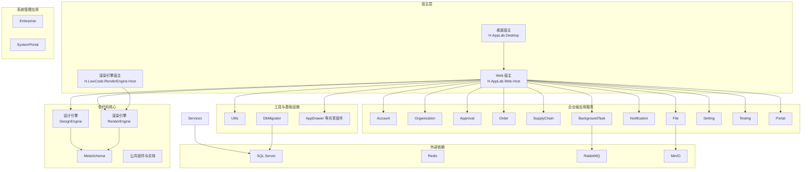
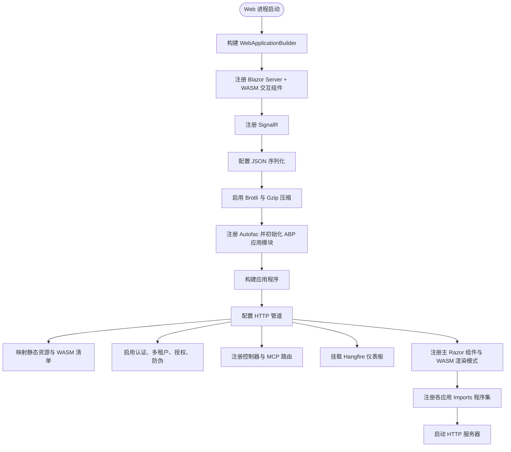
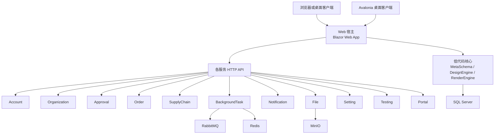
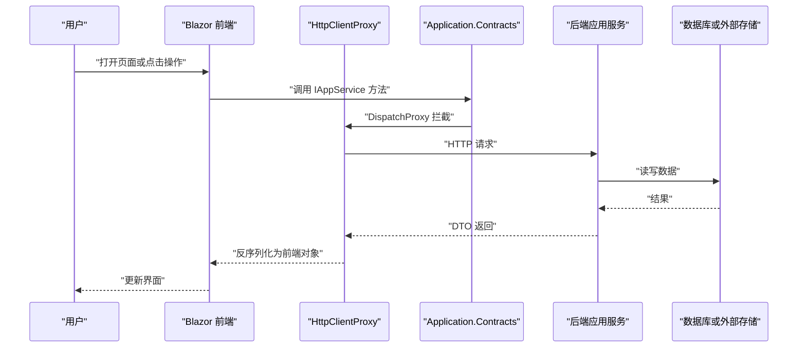
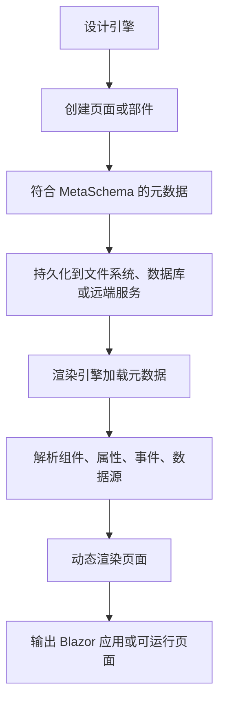
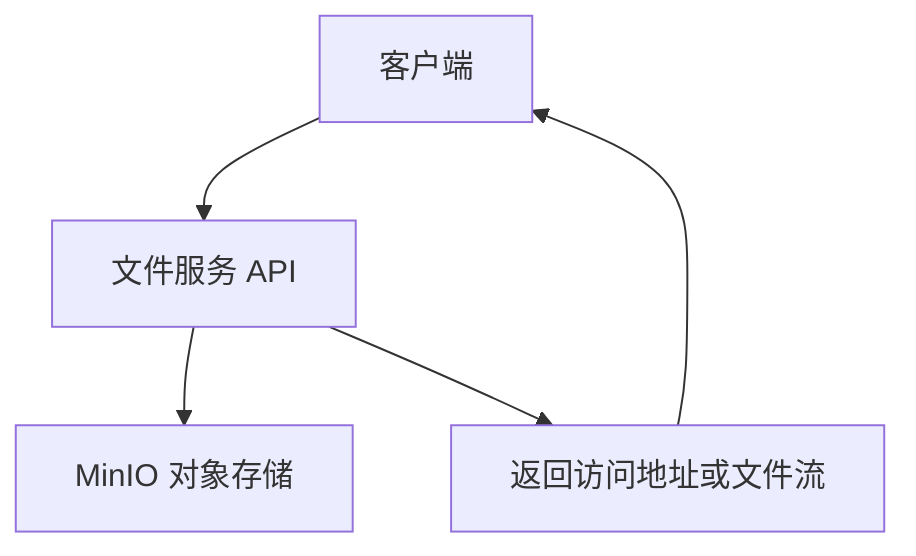
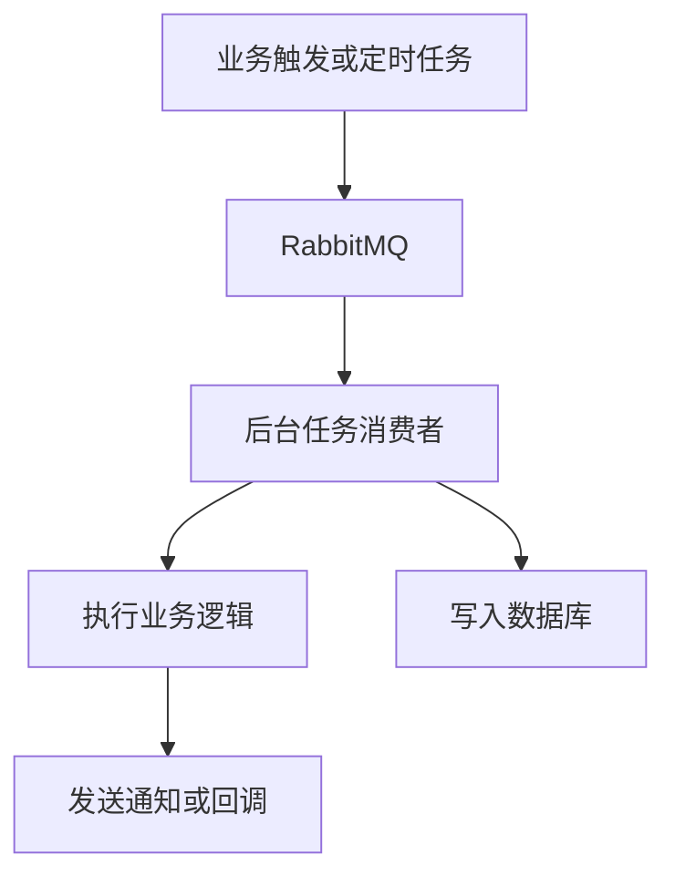
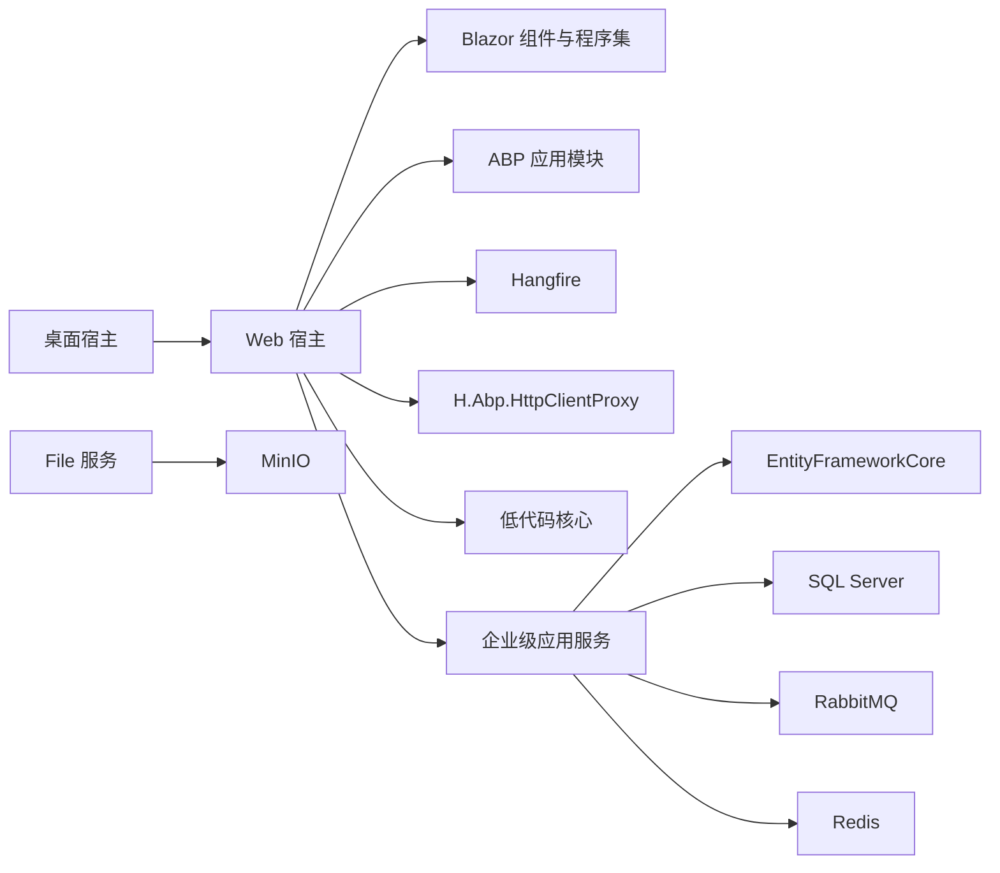
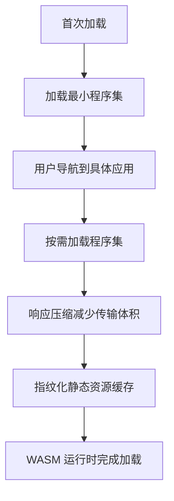
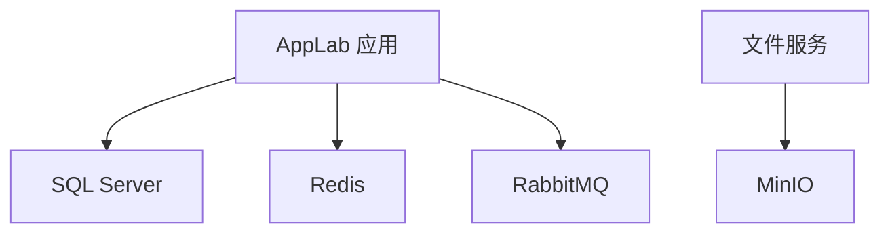

# 整体架构概览

<cite>
**本文引用的文件**   
- [README.md](file://README.md)
- [global.json](file://src/global.json)
- [docker-compose.yml](file://cd/docker-compose.yml)
- [Web 宿主程序入口](file://src/Host/H.AppLab.Web.Host/H.AppLab.Web.Host/Program.cs)
- [桌面宿主程序入口](file://src/Host/H.AppLab.Desktop/Program.cs)
- [远程服务配置项](file://src/Utils/H.Abp.HttpClientProxy/RemoteServiceOptions.cs)
- [MinIO 连接选项](file://src/Services/File/H.File.Application/MinioOptions.cs)
</cite>

## 目录

1. [引言](#引言)
2. [项目结构](#项目结构)
3. [核心组件](#核心组件)
4. [架构总览](#架构总览)
5. [详细组件分析](#详细组件分析)
6. [依赖关系分析](#依赖关系分析)
7. [性能与运行时特性](#性能与运行时特性)
8. [部署拓扑与容器化策略](#部署拓扑与容器化策略)
9. [故障排查指南](#故障排查指南)
10. [结论](#结论)

## 引言

AppLab 是一个基于 .NET 与 Blazor 的实验性应用开发平台。它提供“低代码核心 + 企业级应用服务 + 系统管理应用 + 工具库”的模块化体系，支持单体部署和按限界上下文独立部署的微服务模式。平台同时提供 Web 宿主与 Avalonia 桌面宿主，统一承载 Portal、Account、Organization、Approval、Order、SupplyChain、BackgroundTask、Notification、Setting、File、Testing、Workbench 等应用。

本文件从系统架构、模块边界、数据流、集成点、错误处理、性能特征和部署策略等维度，给出 AppLab 的整体技术视图。

**章节来源**
- [README.md:1-20](file://README.md#L1-L20)

## 项目结构

仓库采用分层、分域的组织方式：

| 目录 | 职责 | 典型产物 |
|---|---|---|
| `src/Host` | 宿主程序，不包含业务逻辑，仅做服务注册、路由、中间件与前端程序集聚合 | Web 宿主、Desktop 宿主、RenderEngine 宿主、Account 宿主 |
| `src/LowCode` | 低代码核心：元数据 Schema、设计引擎、渲染引擎、公共组件基类与默认组件库 | MetaSchema、DesignEngine、RenderEngine、Common、meta |
| `src/Services` | 按限界上下文划分的业务服务：Account、Organization、Approval、Order、SupplyChain、BackgroundTask、Notification、File、Portal、Setting、Testing 等 | Application / Application.Contracts / EntityFrameworkCore / Web |
| `src/System` | 面向平台运营的系统级应用：Enterprise、SystemPortal | Application / Application.Contracts / Web |
| `src/Tools` | 各服务的数据库迁移控制台程序 | DbMigrator |
| `src/Utils` | 跨领域工具库：ABP 契约扩展、HTTP 动态代理、Blazor 工具、ID 生成、基础扩展 | H.Abp.*、H.Util.* |
| `src/Components` | 共享 UI 组件，例如 AppDrawer | Razor 组件与模型 |
| `src/Agent` | MCP 与 Workbench 相关扩展（如云效集成、工作流测试工具） | McpServers、Workbench |

**图表来源**
- [README.md:1-45](file://README.md#L1-L45)
- [Web 宿主程序入口:1-113](file://src/Host/H.AppLab.Web.Host/H.AppLab.Web.Host/Program.cs#L1-L113)

**章节来源**
- [README.md:1-45](file://README.md#L1-L45)

## 核心组件

### 宿主程序

#### Web 宿主

Web 宿主是 AppLab 的主要运行入口，使用 Blazor Web App（Server + WebAssembly Client）模式，承担以下职责：

- 启动 ASP.NET Core 管道并启用 SignalR。
- 注册 JSON 序列化、响应压缩、Brotli/Gzip。
- 初始化 ABP 应用模块，包括 HostAllModule。
- 挂载静态资源、身份认证、多租户、授权、防伪造令牌。
- 注册控制器与 MCP 端点 `/yunxiao`。
- 挂载 Hangfire 后台任务仪表板 `/hangfire`。
- 聚合多个 Web 应用的 Razor 程序集，实现单入口多应用导航。

关键行为体现在 Web 宿主程序入口中：Blazor InteractiveWebAssemblyComponents、SignalR、ResponseCompression、Autofac、ABP 初始化、Hangfire Dashboard、静态资源映射、多程序集 MapRazorComponents。

**图表来源**
- [Web 宿主程序入口:1-113](file://src/Host/H.AppLab.Web.Host/H.AppLab.Web.Host/Program.cs#L1-L113)

#### 桌面宿主

桌面宿主使用 Avalonia，作为所有客户端应用的统一外壳。其入口只负责创建 Avalonia 应用构建器、启用平台检测、安装字体、启用日志跟踪，并把生命周期交给经典桌面运行时。

这意味着 AppLab 的桌面体验不是另一个后端服务，而是以本地窗口形式承载 Blazor/Avalonia 界面，并通过 HTTP API 访问后端服务。

**章节来源**
- [Web 宿主程序入口:1-113](file://src/Host/H.AppLab.Web.Host/H.AppLab.Web.Host/Program.cs#L1-L113)
- [桌面宿主程序入口:1-19](file://src/Host/H.AppLab.Desktop/Program.cs#L1-L19)

### 低代码核心

低代码核心分为三个层次：

| 层次 | 职责 | 关键概念 |
|---|---|---|
| MetaSchema | 定义元数据的类型、结构、校验规则与通用能力 | 元数据 Schema、组件基类、公共实体 |
| DesignEngine | 提供可视化设计能力，产出应用或部件的元数据 | 设计端应用、部件设计引擎、开发者主页 |
| RenderEngine | 根据元数据动态渲染可运行应用，支持主题 | 渲染引擎、Ant Design Blazor 主题、远程仓储 |

MetaSchema 被 DesignEngine 和 RenderEngine 共同依赖；DesignEngine 输出 JSON 元数据，RenderEngine 消费元数据并生成运行时页面。仓储实现支持 JsonFile、EntityFrameworkCore 和 RemoteService，使低代码应用在单机、单体与微服务环境中都能复用同一套元数据协议。

**章节来源**
- [README.md:20-45](file://README.md#L20-L45)

### 企业级应用服务

Services 下的每个限界上下文遵循一致的分层结构：

- Application.Contracts：对外暴露的接口与数据传输对象。
- Application：应用服务、领域逻辑编排。
- EntityFrameworkCore：领域实体、DbContext、迁移。
- Web：API 控制器、Blazor 页面或前后端集成。

这些服务包括但不限于：

- Account：账户与登录。
- Organization：组织与权限上下文。
- Approval：审批流程。
- Order：订单业务。
- SupplyChain：供应链业务。
- BackgroundTask：后台任务。
- Notification：通知。
- File：文件存储，依赖 MinIO。
- Setting：设置。
- Testing：测试用例与模板。
- Portal：门户服务。

**章节来源**
- [README.md:30-45](file://README.md#L30-L45)

### 系统管理应用

System 目录包含 Enterprise 与 SystemPortal，面向平台运营侧，与企业级应用严格隔离。它们通常用于企业管理、系统监控、租户管理、平台配置等运营功能，而不是普通业务用户的主界面。

**章节来源**
- [README.md:35-45](file://README.md#L35-L45)

### 工具库

Utils 提供跨项目复用的基础设施能力：

- `H.Abp.Application.Contracts`：IAppService、CRUD 契约、分页 DTO 等。
- `H.Abp.HttpClientProxy`：基于 IAppService 接口的 HTTP 动态代理，让前端只引用契约即可调用远端服务。
- `H.Util.Blazor`：Blazor 事件分发、Toast 提示、通用组件。
- `H.Util.Ids`：ShortId、SnowflakeId 生成器。
- `H.Util.Base`：BaseOutput、枚举扩展、JSON 扩展、对象扩展、类型扩展。

**章节来源**
- [README.md:45-73](file://README.md#L45-L73)

## 架构总览

AppLab 的整体架构可以理解为四层：

1. **接入层**：Web 宿主与桌面宿主，提供浏览器与本地桌面入口。
2. **应用与编排层**：各限界上下文的应用服务，组合领域逻辑、调用基础设施。
3. **低代码核心层**：MetaSchema、DesignEngine、RenderEngine，支撑页面设计与动态渲染。
4. **基础设施层**：SQL Server、Redis、RabbitMQ、MinIO。

**图表来源**
- [README.md:1-45](file://README.md#L1-L45)
- [Web 宿主程序入口:1-113](file://src/Host/H.AppLab.Web.Host/H.AppLab.Web.Host/Program.cs#L1-L113)
- [docker-compose.yml:1-48](file://cd/docker-compose.yml#L1-L48)

## 详细组件分析

### 模块化边界与通信契约

AppLab 采用模块化架构，每个限界上下文独立成服务，模块之间通过 HTTP API 通信。契约由 Application.Contracts 定义，服务端用 Application 实现，Web 层通过 ABP 约定暴露 REST API。

在 Blazor 前端，H.Abp.HttpClientProxy 把 IAppService 接口转换为 HTTP 请求。前端不需要手写 HttpClient 调用，只需引用契约程序集并在 DI 中注册代理。

**图表来源**
- [README.md:55-73](file://README.md#L55-L73)
- [远程服务配置项:1-33](file://src/Utils/H.Abp.HttpClientProxy/RemoteServiceOptions.cs#L1-L33)

**章节来源**
- [README.md:55-73](file://README.md#L55-L73)
- [远程服务配置项:1-33](file://src/Utils/H.Abp.HttpClientProxy/RemoteServiceOptions.cs#L1-L33)

### 低代码元数据流转

低代码的核心流转如下：

1. 设计师在设计引擎中创建页面或部件。
2. 设计引擎将设计结果持久化为元数据 JSON。
3. 渲染引擎读取元数据，解析组件树、属性、事件和数据绑定。
4. 渲染引擎根据主题和运行时环境生成可执行页面。

**图表来源**
- [README.md:20-45](file://README.md#L20-L45)

**章节来源**
- [README.md:20-45](file://README.md#L20-L45)

### 文件服务与 MinIO

File 服务通过 MinioOptions 配置 MinIO 连接参数，包括 Endpoint、AccessKey、SecretKey、UseSsl 和 ExternalEndpoint。ExternalEndpoint 用于生成预览或下载 URL，说明文件服务不仅负责上传，还负责对外暴露可访问的资源地址。

**图表来源**
- [MinIO 连接选项:1-14](file://src/Services/File/H.File.Application/MinioOptions.cs#L1-L14)
- [docker-compose.yml:28-41](file://cd/docker-compose.yml#L28-L41)

**章节来源**
- [MinIO 连接选项:1-14](file://src/Services/File/H.File.Application/MinioOptions.cs#L1-L14)
- [docker-compose.yml:28-41](file://cd/docker-compose.yml#L28-L41)

### 后台任务与消息队列

BackgroundTask 服务适合承载异步、延迟、重试型任务；RabbitMQ 提供消息队列能力，Redis 提供缓存与会话能力。Web 宿主的 Hangfire Dashboard 为后台任务提供可视化管理入口。

**图表来源**
- [docker-compose.yml:15-27](file://cd/docker-compose.yml#L15-L27)
- [Web 宿主程序入口:60-90](file://src/Host/H.AppLab.Web.Host/H.AppLab.Web.Host/Program.cs#L60-L90)

**章节来源**
- [docker-compose.yml:15-27](file://cd/docker-compose.yml#L15-L27)
- [Web 宿主程序入口:60-90](file://src/Host/H.AppLab.Web.Host/H.AppLab.Web.Host/Program.cs#L60-L90)

## 依赖关系分析

### 技术栈

| 类别 | 技术 | 用途 |
|---|---|---|
| 运行时 | .NET 10 | 全局 SDK 版本约束 |
| 前端框架 | Blazor Web App | Server + WebAssembly 混合渲染 |
| 架构框架 | ABP Framework | 模块化、多租户、认证、授权、应用服务约定 |
| 桌面框架 | Avalonia | 跨平台桌面宿主 |
| 工作流与任务 | Elsa、Hangfire | 工作流与后台任务（仓库文档与宿主挂载点体现任务管理能力） |
| 消息队列 | RabbitMQ | 异步任务与事件驱动 |
| 缓存 | Redis | 缓存、会话、分布式能力 |
| 对象存储 | MinIO | 文件与二进制对象存储 |
| 数据库 | SQL Server | 各服务持久化存储 |

**章节来源**
- [global.json:1-6](file://src/global.json#L1-L6)
- [README.md:1-15](file://README.md#L1-L15)
- [Web 宿主程序入口:1-113](file://src/Host/H.AppLab.Web.Host/H.AppLab.Web.Host/Program.cs#L1-L113)
- [docker-compose.yml:1-48](file://cd/docker-compose.yml#L1-L48)

### 组件耦合关系

**图表来源**
- [README.md:1-45](file://README.md#L1-L45)
- [Web 宿主程序入口:1-113](file://src/Host/H.AppLab.Web.Host/H.AppLab.Web.Host/Program.cs#L1-L113)
- [docker-compose.yml:1-48](file://cd/docker-compose.yml#L1-L48)

**章节来源**
- [README.md:1-45](file://README.md#L1-L45)
- [Web 宿主程序入口:1-113](file://src/Host/H.AppLab.Web.Host/H.AppLab.Web.Host/Program.cs#L1-L113)

## 性能与运行时特性

### WebAssembly 懒加载

首页只加载必要程序集，其他应用、LowCode 库和第三方依赖在导航到对应路由时按需下载。这样可以减少首屏体积，提升初始加载速度。

### 响应压缩

Web 宿主启用 Brotli 和 Gzip 压缩，并将 `.wasm`、`.dll`、`application/octet-stream` 加入压缩 MIME 类型列表，有助于减少 Blazor WebAssembly 资源的传输体积。

### AOT 与裁剪

Release 模式启用 AOT 与裁剪，进一步减小发布包体积；Debug 模式额外加载 `.pdb` 以便调试。

### 静态资源缓存策略

Web 宿主对静态资源进行指纹化缓存：WASM 程序集文件名带内容哈希，浏览器可长期缓存；Blazor 启动清单保留重新校验语义，避免旧清单指向新文件名导致的静默 404。

**图表来源**
- [README.md:55-73](file://README.md#L55-L73)
- [Web 宿主程序入口:15-55](file://src/Host/H.AppLab.Web.Host/H.AppLab.Web.Host/Program.cs#L15-L55)

**章节来源**
- [README.md:55-73](file://README.md#L55-L73)
- [Web 宿主程序入口:15-55](file://src/Host/H.AppLab.Web.Host/H.AppLab.Web.Host/Program.cs#L15-L55)

## 部署拓扑与容器化策略

### 单体模式

在单体模式下，一个 Web 宿主进程加载多个 ABP 模块，内部直接调用各限界上下文的应用服务。这种方式适合中小团队、快速验证和初期上线。

关键特征：

- 单一 Web 宿主进程。
- 多个应用服务在同一进程中运行。
- 数据库连接集中配置。
- 部署单元简单，运维成本低。

### 微服务模式

在微服务模式下，Account、Organization、Approval、Order、SupplyChain、BackgroundTask、Notification、File、Setting、Testing、Portal、LowCode 等各自独立部署，模块间通过 HTTP API 通信。

关键特征：

- 每个限界上下文独立服务。
- 前端通过 HttpClientProxy 调用远端 IAppService。
- 共享契约位于 Application.Contracts。
- 可通过网关、负载均衡和配置中心扩展。

### 容器化依赖

`cd/docker-compose.yml` 定义了开发环境的依赖服务：

| 服务 | 镜像 | 端口 | 用途 |
|---|---|---:|---|
| Redis | redis:8.8-alpine | 6379 | 缓存、会话、分布式能力 |
| RabbitMQ | rabbitmq:4.0-management-alpine | 5672、15672 | 消息队列与管理控制台 |
| MinIO | minio/minio:latest | 9000、9001 | 对象存储与控制台 |

**图表来源**
- [docker-compose.yml:1-48](file://cd/docker-compose.yml#L1-L48)

**章节来源**
- [README.md:1-20](file://README.md#L1-L20)
- [docker-compose.yml:1-48](file://cd/docker-compose.yml#L1-L48)

## 故障排查指南

### 前端无法加载 WASM 或停留在“加载中”

Web 宿主对静态资源和 Blazor 启动清单做了明确注释：不要把整个 `/_framework` 标记为 immutable，否则浏览器可能复用过期启动清单，导致指纹变化的程序集找不到，出现静默 404。

排查建议：

1. 检查反向代理或 CDN 是否错误地将 `/_framework` 全部设置为不可变缓存。
2. 确认构建后重启应用，确保启动清单与程序集指纹一致。
3. 检查浏览器网络面板中是否存在旧清单指向新文件的 404。
4. 在生产环境确认 HTTPS 重定向和异常处理已启用。

**章节来源**
- [Web 宿主程序入口:40-75](file://src/Host/H.AppLab.Web.Host/H.AppLab.Web.Host/Program.cs#L40-L75)

### 远程服务调用失败

前端通过 `RemoteServiceOptions` 从配置节点 `RemoteServices` 获取远端 BaseUrl。若未正确配置或域名不可达，IAppService 代理会发出无效请求。

排查建议：

1. 检查 appsettings 中的 `RemoteServices` 节点。
2. 确认远端服务 BaseUrl 不以多余斜杠结尾。
3. 确认 CORS、认证头、网关路径与 ABP 路由约定一致。
4. 在服务端确认对应 IAppService 已注册且路由可用。

**章节来源**
- [远程服务配置项:1-33](file://src/Utils/H.Abp.HttpClientProxy/RemoteServiceOptions.cs#L1-L33)

### 文件上传或预览失败

MinIO 配置需要 Endpoint、AccessKey、SecretKey、UseSsl 和 ExternalEndpoint。如果 ExternalEndpoint 未配置或不可访问，生成的预览链接会失效。

排查建议：

1. 检查 MinIO 容器是否启动，端口 9000 和 9001 是否可达。
2. 核对 AccessKey 与 SecretKey。
3. 确认 UseSsl 与实际部署一致。
4. 配置正确的 ExternalEndpoint，使其可从客户端访问。

**章节来源**
- [MinIO 连接选项:1-14](file://src/Services/File/H.File.Application/MinioOptions.cs#L1-L14)
- [docker-compose.yml:28-41](file://cd/docker-compose.yml#L28-L41)

### 后台任务无输出

Hangfire Dashboard 挂载在 `/hangfire`，可用于查看任务状态；RabbitMQ 提供消息队列能力。

排查建议：

1. 访问 `/hangfire` 查看任务执行情况。
2. 检查 RabbitMQ 容器是否运行，用户名密码是否与配置一致。
3. 检查 BackgroundTask 服务是否启动并订阅对应队列。
4. 查看数据库表、Redis 键值和消息队列状态。

**章节来源**
- [Web 宿主程序入口:60-90](file://src/Host/H.AppLab.Web.Host/H.AppLab.Web.Host/Program.cs#L60-L90)
- [docker-compose.yml:15-27](file://cd/docker-compose.yml#L15-L27)

## 结论

AppLab 是一个以模块化 ABP 架构为基础、以 Blazor 为前端载体、以 MetaSchema 为核心协议的低代码平台。它的优势在于：

- 模块化清晰：宿主、低代码核心、企业级应用、系统应用、工具库职责分离。
- 部署灵活：支持单体模式和微服务模式。
- 前端友好：IAppService 动态代理让 Blazor 前端像调用本地服务一样调用远端 API。
- 运行时优化：WASM 懒加载、响应压缩、AOT 与裁剪、静态资源指纹缓存。
- 基础设施完备：SQL Server、Redis、RabbitMQ、MinIO 覆盖常见企业场景。

在实际演进中，应优先保证契约稳定、配置集中、部署脚本完善，再逐步将高内聚限界上下文拆分为独立服务，配合容器编排与网关治理，实现从单体到微服务的平滑过渡。