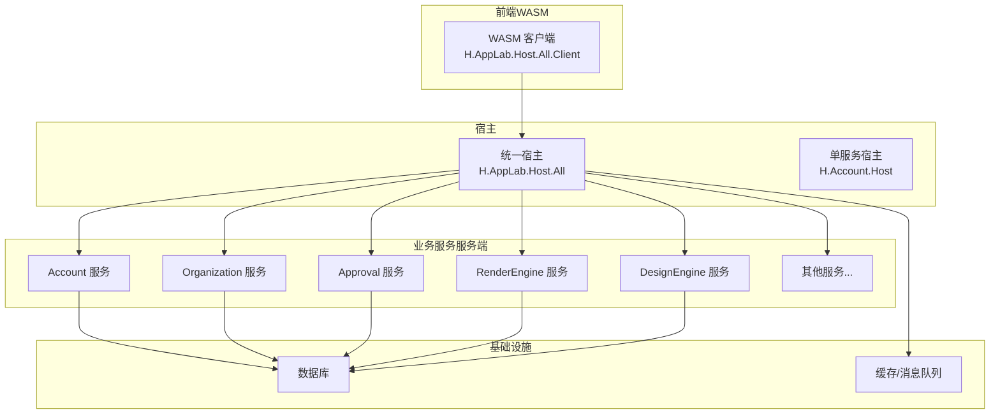
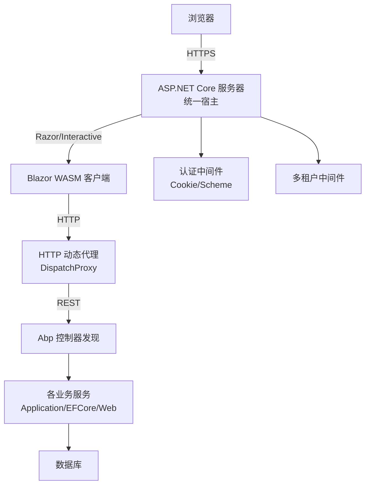
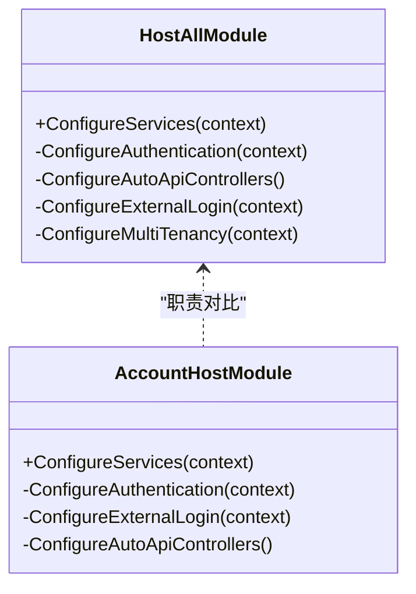
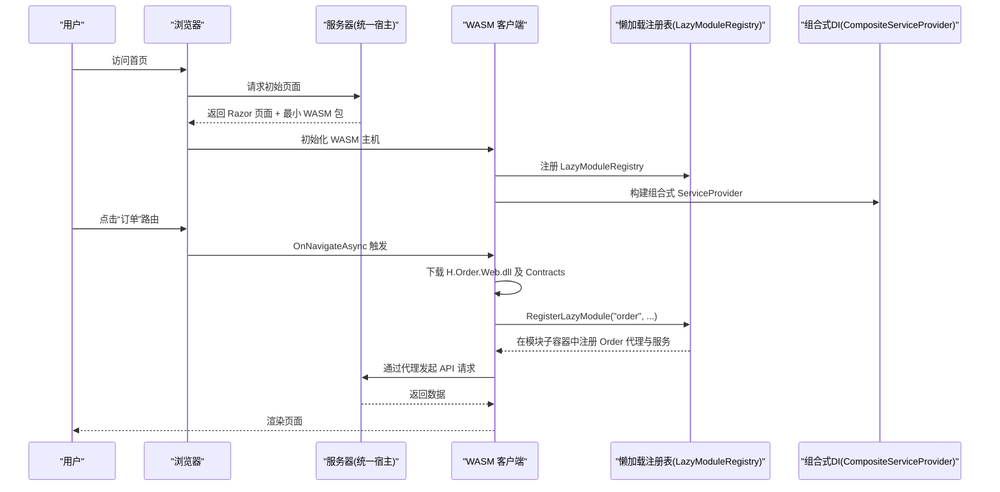
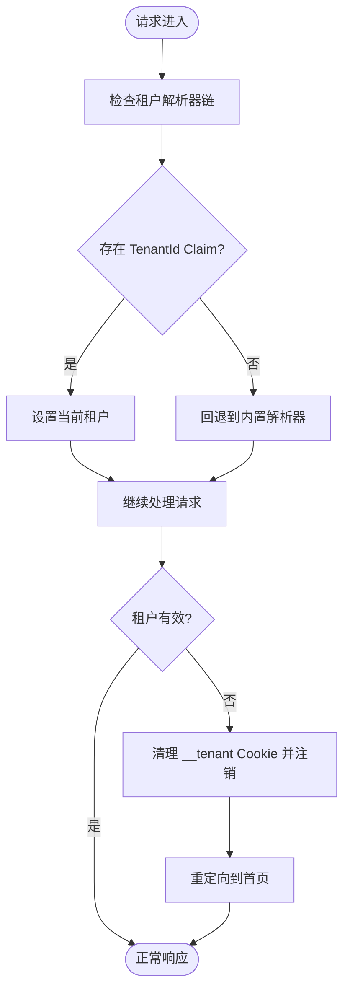
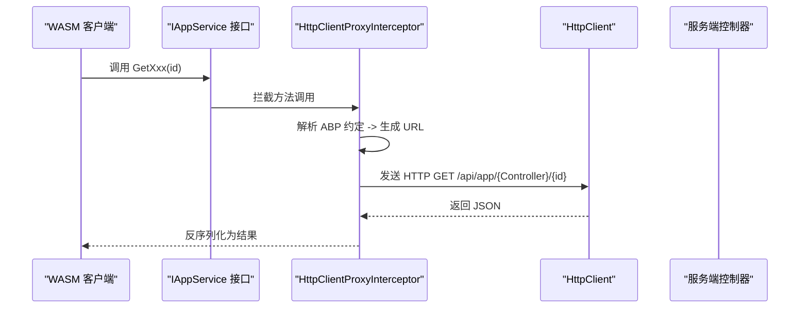
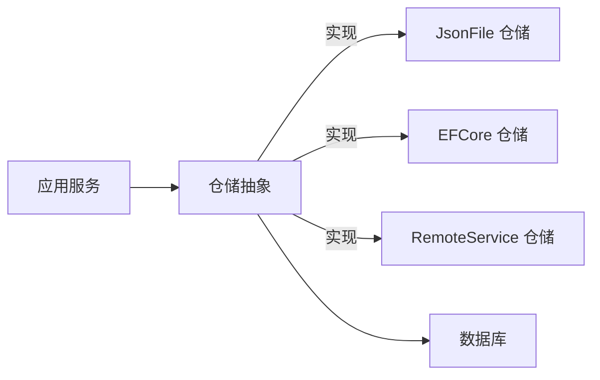
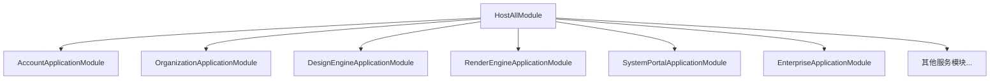

# 架构设计

<cite>
**本文引用的文件**   
- [README.md](file://README.md)
- [Program.cs（统一宿主）](file://src/Host/H.AppLab.Host.All/H.AppLab.Host.All/Program.cs)
- [HostAllModule.cs（统一宿主模块）](file://src/Host/H.AppLab.Host.All/H.AppLab.Host.All/HostAllModule.cs)
- [ClaimsTenantResolveContributor.cs（基于 Claim 的租户解析器）](file://src/Host/H.AppLab.Host.All/H.AppLab.Host.All/ClaimsTenantResolveContributor.cs)
- [Program.cs（账户单服务宿主）](file://src/Host/Account/H.Account.Host/Program.cs)
- [AccountHostModule.cs（账户宿主模块）](file://src/Host/Account/H.Account.Host/AccountHostModule.cs)
- [Program.cs（WASM 客户端入口）](file://src/Host/H.AppLab.Host.All/H.AppLab.Host.All.Client/Program.cs)
- [ClientServices.cs（客户端服务与懒加载注册）](file://src/Host/H.AppLab.Host.All/H.AppLab.Host.All.Client/ClientServices.cs)
- [LazyModuleServices.cs（组合式 DI 与懒加载容器）](file://src/Host/H.AppLab.Host.All/H.AppLab.Host.All.Client/LazyModuleServices.cs)
- [HttpClientProxyInterceptor.cs（HTTP 动态代理拦截器）](file://src/Utils/H.Abp.HttpClientProxy/HttpClientProxyInterceptor.cs)
- [ServiceCollectionExtensions.cs（远程服务与代理注册扩展）](file://src/Utils/H.Abp.HttpClientProxy/ServiceCollectionExtensions.cs)
- [IAppService.cs（应用服务标记接口）](file://src/Utils/H.Abp.Application.Contracts/IAppService.cs)
- [LowCodeAppState.cs（低代码运行态标志）](file://src/LowCode/Common/H.LowCode.ComponentBase/LowCodeAppState.cs)
</cite>

## 目录
1. [引言](#引言)
2. [项目结构](#项目结构)
3. [核心组件](#核心组件)
4. [架构总览](#架构总览)
5. [详细组件分析](#详细组件分析)
6. [依赖关系分析](#依赖关系分析)
7. [性能考量](#性能考量)
8. [故障排查指南](#故障排查指南)
9. [结论](#结论)
10. [附录](#附录)

## 引言
本架构设计文档面向 AppLab 平台，系统性阐述其模块化、分层与依赖注入机制，解释统一宿主与单服务宿主的差异，说明 Blazor Web App（Server + WebAssembly Client）模式实现原理，并覆盖多租户、服务间通信、数据访问层等关键技术决策。文档包含架构图与数据流图，帮助读者理解组件交互与扩展点设计。

## 项目结构
- Host：宿主程序，仅负责服务注册与管线配置，不包含业务逻辑。H.AppLab.Host.All 为统一宿主（单体），其他如 H.Account.Host 为单服务宿主。均采用 Blazor Web App 模式（Server + WASM）。
- Components：共享 UI 组件（如 AppDrawer 抽屉导航）。
- LowCode：低代码核心，包含元数据 Schema、组件基类、默认组件库、设计引擎与渲染引擎；仓储支持 JsonFile / EFCore / RemoteService。
- Services：按限界上下文划分的业务模块（Account、Organization、Approval、Notification、Order、Setting、SupplyChain、BackgroundTask、Testing 等），遵循 Application.Contracts / Application / EntityFrameworkCore / Web 分层。
- System：系统级应用（Enterprise、SystemPortal），与企业级应用隔离。
- Tools：各服务的 DbMigrator 控制台程序。
- Utils：通用工具库（ABP 契约、HTTP 动态代理、Blazor 工具、ID 生成等）。

[本图为概念性结构示意，不直接映射具体源码文件]

**章节来源**
- [README.md](file://README.md)

## 核心组件
- 统一宿主（H.AppLab.Host.All）：聚合所有应用模块，启用多租户、认证、SignalR、响应压缩、Hangfire 仪表盘，并通过 MapRazorComponents 注册多个 Web 程序集以支持路由懒加载。
- 单服务宿主（如 H.Account.Host）：仅承载单一业务域，独立部署，具备最小化依赖与更清晰的边界。
- Blazor Web App 模式：服务端提供 Razor 组件与 API，客户端通过 InteractiveWebAssembly 渲染模式按需加载程序集，结合自定义懒加载与组合式 DI 实现“启动时最小化 + 路由触发加载”。
- HTTP 动态代理：基于 IAppService 接口与 DispatchProxy 拦截，将方法调用转换为 ABP 约定 URL 的 HTTP 请求，前后端同一套接口无感知切换。
- 多租户：从认证 Cookie 中的 TenantId Claim 解析当前租户，驱动数据隔离；异常时清理 Cookie 并重定向首页。
- 数据访问层：每个服务拥有独立 DbContext 与 EFCore 模块，仓储可替换为 JsonFile / RemoteService 等实现。

**章节来源**
- [Program.cs（统一宿主）](file://src/Host/H.AppLab.Host.All/H.AppLab.Host.All/Program.cs)
- [HostAllModule.cs（统一宿主模块）](file://src/Host/H.AppLab.Host.All/H.AppLab.Host.All/HostAllModule.cs)
- [Program.cs（账户单服务宿主）](file://src/Host/Account/H.Account.Host/Program.cs)
- [AccountHostModule.cs（账户宿主模块）](file://src/Host/Account/H.Account.Host/AccountHostModule.cs)
- [HttpClientProxyInterceptor.cs（HTTP 动态代理拦截器）](file://src/Utils/H.Abp.HttpClientProxy/HttpClientProxyInterceptor.cs)
- [ServiceCollectionExtensions.cs（远程服务与代理注册扩展）](file://src/Utils/H.Abp.HttpClientProxy/ServiceCollectionExtensions.cs)
- [IAppService.cs（应用服务标记接口）](file://src/Utils/H.Abp.Application.Contracts/IAppService.cs)

## 架构总览
整体采用“模块化 + 分层 + 依赖注入”的架构风格。统一宿主作为聚合入口，通过 AbpModule 声明依赖，集中配置认证、多租户、控制器发现、外部登录等横切关注点。前端采用 Blazor Web App 模式，服务端与 WASM 客户端通过 HTTP 动态代理进行服务间通信。数据访问层由 EFCore 模块封装，仓储实现可插拔。

**图表来源**
- [Program.cs（统一宿主）](file://src/Host/H.AppLab.Host.All/H.AppLab.Host.All/Program.cs)
- [HostAllModule.cs（统一宿主模块）](file://src/Host/H.AppLab.Host.All/H.AppLab.Host.All/HostAllModule.cs)
- [HttpClientProxyInterceptor.cs（HTTP 动态代理拦截器）](file://src/Utils/H.Abp.HttpClientProxy/HttpClientProxyInterceptor.cs)

## 详细组件分析

### 统一宿主与单服务宿主对比
- 统一宿主（H.AppLab.Host.All）
  - 聚合所有模块（Account、Organization、Approval、RenderEngine、DesignEngine、SystemPortal、Enterprise、Order、Setting、SupplyChain、BackgroundTask、Notification、Assistant 等）。
  - 启用多租户、Cookie 认证（双 Scheme）、SignalR、响应压缩、Hangfire 仪表盘。
  - 通过 AddAdditionalAssemblies 注册多个 Web 程序集，配合路由懒加载。
- 单服务宿主（H.Account.Host）
  - 仅注册 Account 相关模块与 EFCore 模块。
  - 最小化依赖，便于独立部署与运维。

**图表来源**
- [HostAllModule.cs（统一宿主模块）](file://src/Host/H.AppLab.Host.All/H.AppLab.Host.All/HostAllModule.cs)
- [AccountHostModule.cs（账户宿主模块）](file://src/Host/Account/H.Account.Host/AccountHostModule.cs)

**章节来源**
- [Program.cs（统一宿主）](file://src/Host/H.AppLab.Host.All/H.AppLab.Host.All/Program.cs)
- [HostAllModule.cs（统一宿主模块）](file://src/Host/H.AppLab.Host.All/H.AppLab.Host.All/HostAllModule.cs)
- [Program.cs（账户单服务宿主）](file://src/Host/Account/H.Account.Host/Program.cs)
- [AccountHostModule.cs（账户宿主模块）](file://src/Host/Account/H.Account.Host/AccountHostModule.cs)

### Blazor Web App（Server + WASM）实现原理
- 服务端使用 AddRazorComponents().AddInteractiveWebAssemblyComponents() 启用交互式 WASM 渲染。
- 客户端 Program.cs 构建 WebAssemblyHostBuilder，注入 LazyModuleRegistry 与 CompositeServiceProviderFactory，实现“根容器 + 模块子容器”的组合式 DI。
- 路由导航时根据首段路由匹配模块 key，触发对应程序集下载，并在 LazyModuleRegistry 中延迟注册该模块的服务（如 HttpClientProxies、RenderEngineBase、LowCodeAppState 等）。
- 静态资源通过 MapStaticAssets 管理，启用 Brotli/Gzip 压缩，避免错误设置 immutable 导致清单失效。

**图表来源**
- [Program.cs（WASM 客户端入口）](file://src/Host/H.AppLab.Host.All/H.AppLab.Host.All.Client/Program.cs)
- [ClientServices.cs（客户端服务与懒加载注册）](file://src/Host/H.AppLab.Host.All/H.AppLab.Host.All.Client/ClientServices.cs)
- [LazyModuleServices.cs（组合式 DI 与懒加载容器）](file://src/Host/H.AppLab.Host.All/H.AppLab.Host.All.Client/LazyModuleServices.cs)

**章节来源**
- [Program.cs（统一宿主）](file://src/Host/H.AppLab.Host.All/H.AppLab.Host.All/Program.cs)
- [Program.cs（WASM 客户端入口）](file://src/Host/H.AppLab.Host.All/H.AppLab.Host.All.Client/Program.cs)
- [ClientServices.cs（客户端服务与懒加载注册）](file://src/Host/H.AppLab.Host.All/H.AppLab.Host.All.Client/ClientServices.cs)
- [LazyModuleServices.cs（组合式 DI 与懒加载容器）](file://src/Host/H.AppLab.Host.All/H.AppLab.Host.All.Client/LazyModuleServices.cs)

### 多租户架构与租户解析
- 启用 ABP 多租户，ITenantStore 从 Enterprise 数据库读取租户配置。
- 自定义 ClaimsTenantResolveContributor 优先从认证 Cookie 的 "TenantId" Claim 解析当前租户，置于解析器链首位。
- 当租户无效（如陈旧 __tenant Cookie）时，中间件清理 Cookie、注销并重定向首页，避免 404 阻断。

**图表来源**
- [HostAllModule.cs（统一宿主模块）](file://src/Host/H.AppLab.Host.All/H.AppLab.Host.All/HostAllModule.cs)
- [ClaimsTenantResolveContributor.cs（基于 Claim 的租户解析器）](file://src/Host/H.AppLab.Host.All/H.AppLab.Host.All/ClaimsTenantResolveContributor.cs)

**章节来源**
- [HostAllModule.cs（统一宿主模块）](file://src/Host/H.AppLab.Host.All/H.AppLab.Host.All/HostAllModule.cs)
- [ClaimsTenantResolveContributor.cs（基于 Claim 的租户解析器）](file://src/Host/H.AppLab.Host.All/H.AppLab.Host.All/ClaimsTenantResolveContributor.cs)

### 服务间通信（HTTP 动态代理）
- 前端仅依赖 Application.Contracts 中的 IAppService 接口，无需手写 HttpClient 调用。
- ServiceCollectionExtensions.AddHttpClientProxies 扫描程序集中继承 IAppService 的接口，批量注册代理。
- HttpClientProxyInterceptor<T> 基于 DispatchProxy 拦截方法调用，按 ABP 路由约定生成 URL（GET/POST/PUT/DELETE），复杂参数自动序列化为请求体或查询字符串。
- 远程服务地址通过配置节点 RemoteServices 统一管理，命名客户端携带 CookieHandler 以传递认证 Cookie。

**图表来源**
- [HttpClientProxyInterceptor.cs（HTTP 动态代理拦截器）](file://src/Utils/H.Abp.HttpClientProxy/HttpClientProxyInterceptor.cs)
- [ServiceCollectionExtensions.cs（远程服务与代理注册扩展）](file://src/Utils/H.Abp.HttpClientProxy/ServiceCollectionExtensions.cs)
- [IAppService.cs（应用服务标记接口）](file://src/Utils/H.Abp.Application.Contracts/IAppService.cs)

**章节来源**
- [HttpClientProxyInterceptor.cs（HTTP 动态代理拦截器）](file://src/Utils/H.Abp.HttpClientProxy/HttpClientProxyInterceptor.cs)
- [ServiceCollectionExtensions.cs（远程服务与代理注册扩展）](file://src/Utils/H.Abp.HttpClientProxy/ServiceCollectionExtensions.cs)
- [IAppService.cs（应用服务标记接口）](file://src/Utils/H.Abp.Application.Contracts/IAppService.cs)

### 数据访问层设计
- 每个服务拥有独立的 DbContext 与 EFCore 模块（如 AccountDbContext、OrderDbContext、NotificationDbContext 等）。
- 仓储实现可替换：JsonFile（开发/演示）、EntityFrameworkCore（生产）、RemoteService（分布式场景）。
- 低代码模块的元数据仓储同样支持多种实现，便于设计与渲染分离。

[本图为概念性结构示意，不直接映射具体源码文件]

**章节来源**
- [README.md](file://README.md)

### 低代码运行态（设计/渲染）
- LowCodeAppState 用于标识是否处于设计时（IsDesign=true），在服务端与客户端分别注册不同实例，确保组件行为差异。
- 渲染引擎与应用渲染共享基础服务（ListDataOperationManager 等），设计器专属服务按需懒加载。

**章节来源**
- [LowCodeAppState.cs（低代码运行态标志）](file://src/LowCode/Common/H.LowCode.ComponentBase/LowCodeAppState.cs)
- [ClientServices.cs（客户端服务与懒加载注册）](file://src/Host/H.AppLab.Host.All/H.AppLab.Host.All.Client/ClientServices.cs)

## 依赖关系分析
- 统一宿主通过 AbpModule 声明对各个 Application/EFCore/Web 模块的依赖，形成松耦合的装配关系。
- 客户端通过 LazyModuleRegistry 与 CompositeServiceProvider 实现“根容器 + 模块子容器”的回退解析，避免启动时全量加载。
- HTTP 动态代理将 IAppService 接口与远程服务解耦，降低前后端耦合度。

**图表来源**
- [HostAllModule.cs（统一宿主模块）](file://src/Host/H.AppLab.Host.All/H.AppLab.Host.All/HostAllModule.cs)

**章节来源**
- [HostAllModule.cs（统一宿主模块）](file://src/Host/H.AppLab.Host.All/H.AppLab.Host.All/HostAllModule.cs)
- [LazyModuleServices.cs（组合式 DI 与懒加载容器）](file://src/Host/H.AppLab.Host.All/H.AppLab.Host.All.Client/LazyModuleServices.cs)

## 性能考量
- 响应压缩：启用 Brotli/Gzip，针对 WASM 资源（application/wasm、application/dll）优化传输体积。
- 静态资源缓存：MapStaticAssets 指纹化 WASM 程序集，避免误用 immutable 导致清单失效。
- 懒加载：仅加载首页必要程序集，其余模块在路由导航时按需下载，减少首屏负载。
- AOT 与裁剪：Release 模式启用 AOT 与 Trimming，进一步减小包体；Debug 模式保留 .pdb 便于调试。

**章节来源**
- [Program.cs（统一宿主）](file://src/Host/H.AppLab.Host.All/H.AppLab.Host.All/Program.cs)
- [README.md](file://README.md)

## 故障排查指南
- 多租户 Cookie 问题：若出现 __tenant 指向已删除租户，中间件会清理 Cookie 并注销后重定向首页，检查认证流程是否正确写入 TenantId Claim。
- WASM 启动失败：确认未将整个 /_framework 设置为 immutable，否则构建后指纹变化但浏览器仍复用旧清单，导致静默 404。
- 代理调用失败：检查 RemoteServices 配置与命名客户端是否正确绑定 CookieHandler，确保接口方法符合 ABP 约定（GetXxx → GET 等）。
- 控制器未注册：确认 AbpAspNetCoreMvcOptions.ConventionalControllers.Create 已包含对应模块程序集。

**章节来源**
- [HostAllModule.cs（统一宿主模块）](file://src/Host/H.AppLab.Host.All/H.AppLab.Host.All/HostAllModule.cs)
- [Program.cs（统一宿主）](file://src/Host/H.AppLab.Host.All/H.AppLab.Host.All/Program.cs)
- [ServiceCollectionExtensions.cs（远程服务与代理注册扩展）](file://src/Utils/H.Abp.HttpClientProxy/ServiceCollectionExtensions.cs)

## 结论
AppLab 平台通过模块化与分层架构、依赖注入与懒加载机制，实现了高内聚、低耦合的可扩展系统。统一宿主与单服务宿主满足不同部署需求；Blazor Web App 模式结合 HTTP 动态代理提供了高效的前后端协作方式；多租户与可插拔数据访问层保障了企业级应用的隔离性与灵活性。整体架构兼顾性能与可维护性，适合持续演进与规模化扩展。

## 附录
- 本地开发与启动请参考 README 中的环境准备与命令说明。
- 各服务 DbMigrator 用于数据库迁移与种子数据初始化。
- 组件与主题（AntBlazor）可按需替换与扩展。

**章节来源**
- [README.md](file://README.md)