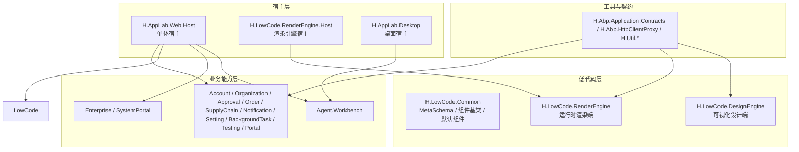
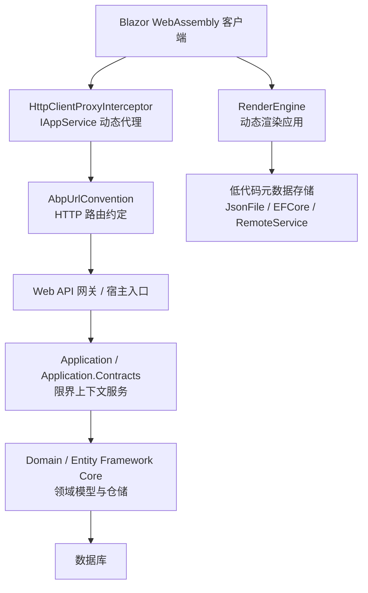
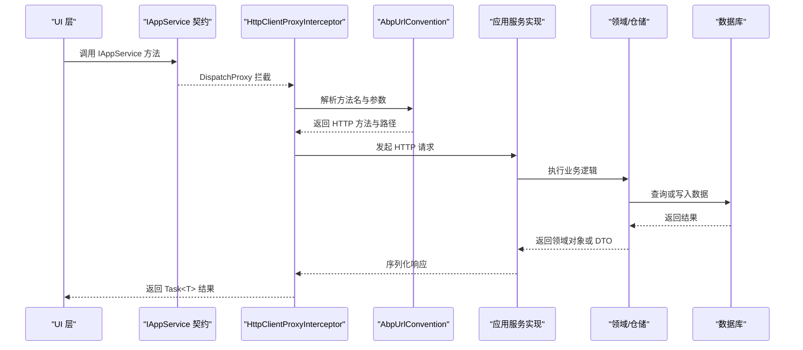
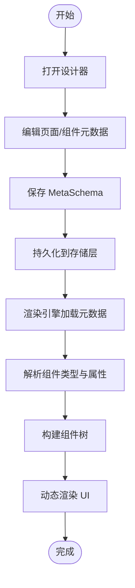
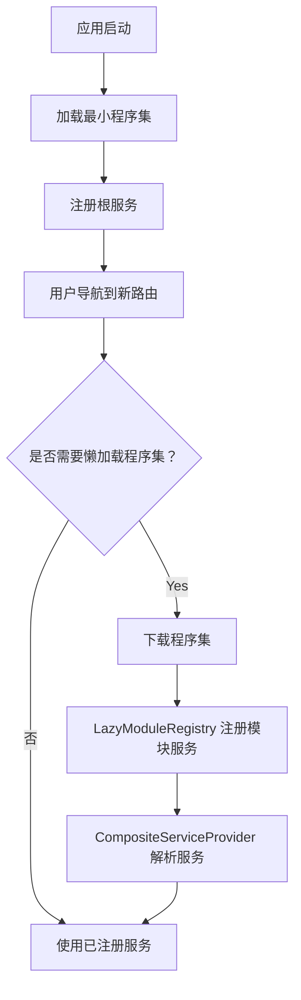
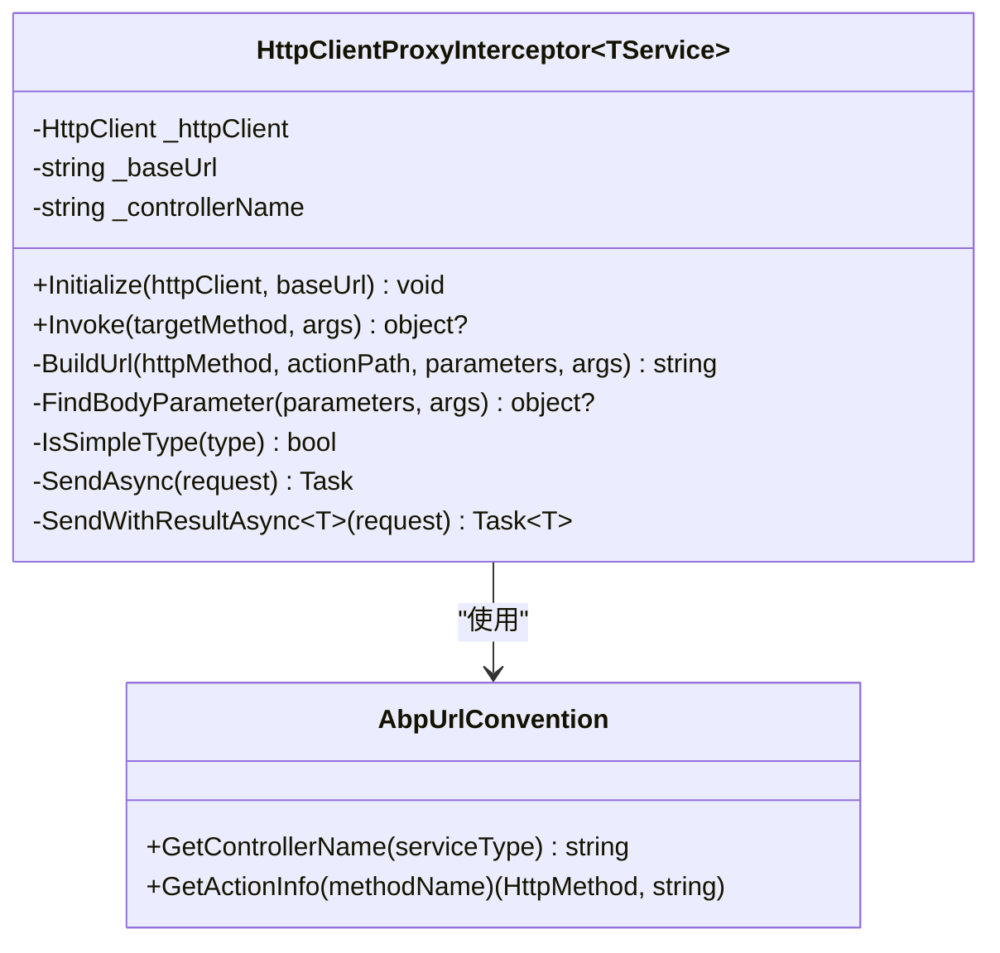
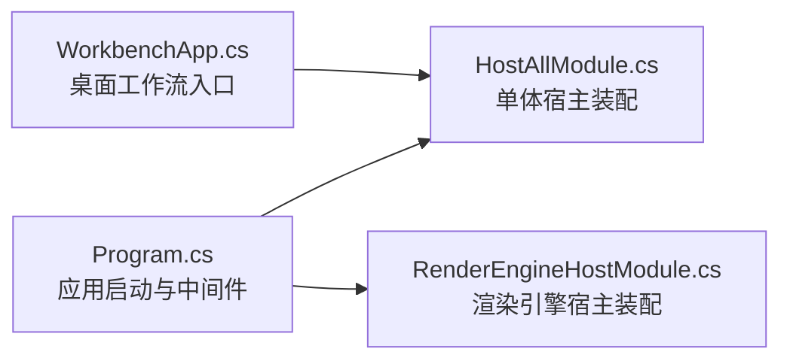
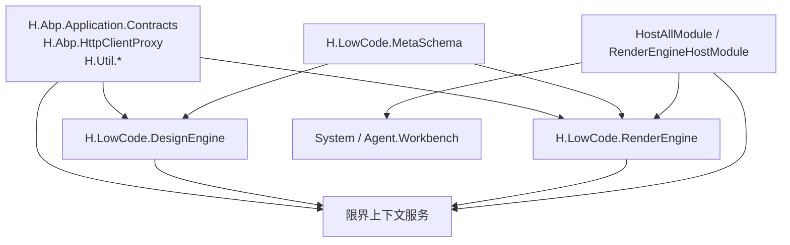
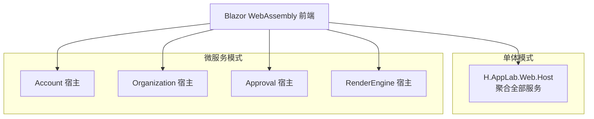

# 架构设计

<cite>
**本文引用的文件**   
- [README.md](file://README.md)
- [HttpClientProxyInterceptor.cs](file://src/Utils/H.Abp.HttpClientProxy/HttpClientProxyInterceptor.cs)
- [AbpUrlConvention.cs](file://src/Utils/H.Abp.HttpClientProxy/AbpUrlConvention.cs)
- [HostAllModule.cs](file://src/Host/src/Host/H.AppLab.Web.Host/H.AppLab.Web.Host/HostAllModule.cs)
- [RenderEngineHostModule.cs](file://src/Host/src/Host/RenderEngine/H.LowCode.RenderEngine.Host/RenderEngineHostModule.cs)
- [Program.cs](file://src/Host/src/Host/H.AppLab.Web.Host/H.AppLab.Web.Host/Program.cs)
- [WorkbenchApp.cs](file://src/Host/src/Host/H.AppLab.Desktop/WorkbenchApp.cs)
- [ComponentSchemaBase.cs](file://src/LowCode/Common/src/LowCode/Common/H.LowCode.MetaSchema/ComponentSchemaBase.cs)
- [PageMetaSchema.cs](file://src/LowCode/Common/src/LowCode/Common/H.LowCode.MetaSchema.DesignEngine/PageMetaSchema.cs)
- [ComponentFragmentSchema.cs](file://src/LowCode/Common/src/LowCode/Common/H.LowCode.MetaSchema.RenderEngine/PropertySchemas/ComponentFragmentSchema.cs)
- [RenderEngineBaseModule.cs](file://src/LowCode/RenderEngine/src/LowCode/RenderEngine/H.LowCode.RenderEngineBase/RenderEngineBaseModule.cs)
- [PageComponentRegistry.cs](file://src/LowCode/RenderEngine/src/LowCode/RenderEngine/H.LowCode.RenderEngineBase/PageComponentRegistry.cs)
- [RenderEngineDynamicComponentBase.cs](file://src/LowCode/RenderEngine/src/LowCode/RenderEngine/H.LowCode.RenderEngineBase/RenderEngineDynamicComponentBase.cs)
- [H.LowCode.MetaSchema.csproj](file://src/LowCode/Common/H.LowCode.MetaSchema/H.LowCode.MetaSchema.csproj)
- [H.LowCode.MetaSchema.DesignEngine.csproj](file://src/LowCode/Common/H.LowCode.MetaSchema.DesignEngine/H.LowCode.MetaSchema.DesignEngine.csproj)
- [H.LowCode.MetaSchema.RenderEngine.csproj](file://src/LowCode/Common/H.LowCode.MetaSchema.RenderEngine/H.LowCode.MetaSchema.RenderEngine.csproj)
- [H.LowCode.RenderEngineBase.csproj](file://src/LowCode/RenderEngine/H.LowCode.RenderEngineBase/H.LowCode.RenderEngineBase.csproj)
</cite>

## 目录
1. [引言](#引言)
2. [项目结构](#项目结构)
3. [核心组件](#核心组件)
4. [架构总览](#架构总览)
5. [详细组件分析](#详细组件分析)
6. [依赖关系分析](#依赖关系分析)
7. [性能与扩展性考量](#性能与扩展性考量)
8. [部署拓扑与系统边界](#部署拓扑与系统边界)
9. [跨领域关注点](#跨领域关注点)
10. [故障排查指南](#故障排查指南)
11. [结论](#结论)

## 引言
本架构设计文档面向 AppLab 平台，目标是帮助开发者理解整体设计决策、分层约束和扩展方式。平台基于 .NET 与 Blazor，采用模块化与分层架构，并以低代码元数据驱动页面与应用构建。关键设计原则包括：

- **模块化架构（限界上下文隔离）**：Services 下的 Account、Organization、Approval、Order、SupplyChain、Notification、Setting、BackgroundTask、Testing 等模块按业务域划分；System 下 Enterprise、SystemPortal 作为系统级应用；LowCode 提供设计与渲染能力；Agent/Workbench 提供智能体与工作流能力；Host 仅负责宿主装配。
- **分层架构（Application.Contracts / Application / EntityFrameworkCore / Web）**：每个限界上下文遵循统一分层，契约层独立发布，前端只依赖契约。
- **插件化设计**：仓储实现（JsonFile、EntityFrameworkCore、RemoteService）、主题（AntBlazor）与组件均可插拔替换。
- **ABP DDD 风格**：通过 IAppService 暴露应用服务，结合 HttpClientProxy 在客户端自动生成 HTTP 调用。
- **低代码元数据驱动**：DesignEngine 产出 MetaSchema，RenderEngine 根据元数据动态生成 UI。
- **WebAssembly 懒加载**：LazyModuleRegistry + CompositeServiceProvider 支撑按需注册模块服务。
- **动态 HTTP 代理**：HttpClientProxyInterceptor 拦截 IAppService 方法调用并映射到 ABP 约定 URL。

## 项目结构
仓库以 src 为根组织多个限界上下文与通用库：

```mermaid
graph TB
    subgraph "宿主层"
        HostAll["H.AppLab.Web.Host<br/>单体宿主"]
        RenderHost["H.LowCode.RenderEngine.Host<br/>渲染引擎宿主"]
        Desktop["H.AppLab.Desktop<br/>桌面宿主"]
    end

    subgraph "低代码层"
        Common["H.LowCode.Common<br/>MetaSchema / 组件基类 / 默认组件"]
        DesignEngine["H.LowCode.DesignEngine<br/>可视化设计端"]
        RenderEngine["H.LowCode.RenderEngine<br/>运行时渲染端"]
    end

    subgraph "业务能力层"
        Services["Account / Organization / Approval / Order / SupplyChain / Notification / Setting / BackgroundTask / Testing / Portal"]
        SystemApps["Enterprise / SystemPortal"]
        AgentWorkbench["Agent.Workbench"]
    end

    subgraph "工具与契约"
        Utils["H.Abp.Application.Contracts / H.Abp.HttpClientProxy / H.Util.*"]
    end

    HostAll --> Services
    HostAll --> LowCode
    HostAll --> SystemApps
    HostAll --> AgentWorkbench

    RenderHost --> RenderEngine
    Desktop --> AgentWorkbench

    Utils --> Services
    Utils --> RenderEngine
    Utils --> DesignEngine
```

**图表来源**  
- [README.md:1-73](file://README.md#L1-L73)
- [HostAllModule.cs:1-200](file://src/Host/src/Host/H.AppLab.Web.Host/H.AppLab.Web.Host/HostAllModule.cs#L1-L200)

**章节来源**  
- [README.md:1-73](file://README.md#L1-L73)

## 核心组件
本节聚焦平台的关键抽象与可插拔点：

| 组件 | 职责 | 扩展方式 |
|---|---|---|
| IAppService 契约层 | 定义跨进程、跨前端的统一应用服务接口 | 新增限界上下文时增加 IAppService 接口 |
| HttpClientProxyInterceptor | 将 IAppService 调用转换为 HTTP 请求 | 配置 RemoteServices 地址后自动生效 |
| AbpUrlConvention | 把方法名映射为 HTTP 方法与路径 | 修改约定或新增路由规则 |
| MetaSchema | 描述组件属性、事件、数据源、可见性条件等元数据 | 扩展 ComponentSchemaBase 子类 |
| DesignEngine | 可视化编辑 MetaSchema 并持久化 | 新增 PartsDesignEngine 或自定义设计器 |
| RenderEngine | 根据 MetaSchema 动态渲染 Blazor 组件 | 新增主题或组件库 |
| RenderEngineBaseModule | 注册渲染引擎基础服务与组件注册表 | 扩展模块装配 |
| PageComponentRegistry | 管理元数据到真实组件的映射 | 注册新组件类型 |
| RenderEngineDynamicComponentBase | 根据节点元数据动态创建组件实例 | 继承扩展渲染逻辑 |
| LazyModuleRegistry + CompositeServiceProvider | WebAssembly 懒加载后的 DI 回退 | 按路由模块注册服务 |

**章节来源**  
- [README.md:1-73](file://README.md#L1-L73)
- [HttpClientProxyInterceptor.cs:1-234](file://src/Utils/H.Abp.HttpClientProxy/HttpClientProxyInterceptor.cs#L1-L234)
- [AbpUrlConvention.cs:1-200](file://src/Utils/H.Abp.HttpClientProxy/AbpUrlConvention.cs#L1-L200)
- [ComponentSchemaBase.cs:1-200](file://src/LowCode/Common/src/LowCode/Common/H.LowCode.MetaSchema/ComponentSchemaBase.cs#L1-L200)
- [PageMetaSchema.cs:1-200](file://src/LowCode/Common/src/LowCode/Common/H.LowCode.MetaSchema.DesignEngine/PageMetaSchema.cs#L1-L200)
- [ComponentFragmentSchema.cs:1-200](file://src/LowCode/Common/src/LowCode/Common/H.LowCode.MetaSchema.RenderEngine/PropertySchemas/ComponentFragmentSchema.cs#L1-L200)
- [RenderEngineBaseModule.cs:1-200](file://src/LowCode/RenderEngine/src/LowCode/RenderEngine/H.LowCode.RenderEngineBase/RenderEngineBaseModule.cs#L1-L200)
- [PageComponentRegistry.cs:1-200](file://src/LowCode/RenderEngine/src/LowCode/RenderEngine/H.LowCode.RenderEngineBase/PageComponentRegistry.cs#L1-L200)
- [RenderEngineDynamicComponentBase.cs:1-200](file://src/LowCode/RenderEngine/src/LowCode/RenderEngine/H.LowCode.RenderEngineBase/RenderEngineDynamicComponentBase.cs#L1-L200)

## 架构总览
AppLab 的整体架构可以理解为“宿主编排 + 限界上下文服务 + 低代码引擎 + WebAssembly 前端”的组合：

```mermaid
graph TB
    Client["Blazor WebAssembly 客户端"]
    Proxy["HttpClientProxyInterceptor<br/>IAppService 动态代理"]
    Convention["AbpUrlConvention<br/>HTTP 路由约定"]
    ApiGateway["Web API 网关 / 宿主入口"]
    AppLayer["Application / Application.Contracts<br/>限界上下文服务"]
    Domain["Domain / Entity Framework Core<br/>领域模型与仓储"]
    Database["数据库"]
    MetaStore["低代码元数据存储<br/>JsonFile / EFCore / RemoteService"]
    Renderer["RenderEngine<br/>动态渲染应用"]

    Client --> Proxy
    Proxy --> Convention
    Convention --> ApiGateway
    ApiGateway --> AppLayer
    AppLayer --> Domain
    Domain --> Database

    Client --> Renderer
    Renderer --> MetaStore
```

**图表来源**  
- [HttpClientProxyInterceptor.cs:1-234](file://src/Utils/H.Abp.HttpClientProxy/HttpClientProxyInterceptor.cs#L1-L234)
- [AbpUrlConvention.cs:1-200](file://src/Utils/H.Abp.HttpClientProxy/AbpUrlConvention.cs#L1-L200)
- [HostAllModule.cs:1-200](file://src/Host/src/Host/H.AppLab.Web.Host/H.AppLab.Web.Host/HostAllModule.cs#L1-L200)
- [RenderEngineBaseModule.cs:1-200](file://src/LowCode/RenderEngine/src/LowCode/RenderEngine/H.LowCode.RenderEngineBase/RenderEngineBaseModule.cs#L1-L200)

**章节来源**  
- [README.md:1-73](file://README.md#L1-L73)

## 详细组件分析

### ABP 分层与 IAppService 契约驱动
平台在每个限界上下文中采用 Application.Contracts → Application → EntityFrameworkCore → Web 的分层：

- **Application.Contracts**：定义 IAppService 接口及 DTO，是前后端共享契约。
- **Application**：实现业务用例，组合领域服务与仓储。
- **EntityFrameworkCore**：实现 DbContext、实体映射与仓储。
- **Web**：暴露控制器或服务端入口，通常由宿主统一装配。

前端通过 IAppService 调用后端，无需手写 HttpClient 调用；服务端则直接解析接口参数并执行业务逻辑。

```mermaid
sequenceDiagram
    participant UI as "UI 层"
    participant Contract as "IAppService 契约"
    participant Proxy as "HttpClientProxyInterceptor"
    participant Convention as "AbpUrlConvention"
    participant Service as "应用服务实现"
    participant Domain as "领域/仓储"
    participant DB as "数据库"

    UI->>Contract: 调用 IAppService 方法
    Contract-->>Proxy: DispatchProxy 拦截
    Proxy->>Convention: 解析方法名与参数
    Convention-->>Proxy: 返回 HTTP 方法与路径
    Proxy->>Service: 发起 HTTP 请求
    Service->>Domain: 执行业务逻辑
    Domain->>DB: 查询或写入数据
    DB-->>Domain: 返回结果
    Domain-->>Service: 返回领域对象或 DTO
    Service-->>Proxy: 序列化响应
    Proxy-->>UI: 返回 Task<T> 结果
```

**图表来源**  
- [HttpClientProxyInterceptor.cs:1-234](file://src/Utils/H.Abp.HttpClientProxy/HttpClientProxyInterceptor.cs#L1-L234)
- [AbpUrlConvention.cs:1-200](file://src/Utils/H.Abp.HttpClientProxy/AbpUrlConvention.cs#L1-L200)

**章节来源**  
- [README.md:1-73](file://README.md#L1-L73)
- [HttpClientProxyInterceptor.cs:1-234](file://src/Utils/H.Abp.HttpClientProxy/HttpClientProxyInterceptor.cs#L1-L234)
- [AbpUrlConvention.cs:1-200](file://src/Utils/H.Abp.HttpClientProxy/AbpUrlConvention.cs#L1-L200)

### 低代码元数据驱动：MetaSchema → DesignEngine → RenderEngine
低代码引擎的核心是“元数据即应用”。DesignEngine 负责可视化编辑 MetaSchema，RenderEngine 负责根据元数据动态渲染界面：

```mermaid
flowchart TD
    Start(["开始"]) --> OpenDesigner["打开设计器"]
    OpenDesigner --> EditMeta["编辑页面/组件元数据"]
    EditMeta --> SaveMeta["保存 MetaSchema"]
    SaveMeta --> StoreMeta["持久化到存储层"]
    StoreMeta --> LoadMeta["渲染引擎加载元数据"]
    LoadMeta --> ResolveComponents["解析组件类型与属性"]
    ResolveComponents --> BuildTree["构建组件树"]
    BuildTree --> RenderUI["动态渲染 UI"]
    RenderUI --> End(["完成"])
```

**图表来源**  
- [PageMetaSchema.cs:1-200](file://src/LowCode/Common/src/LowCode/Common/H.LowCode.MetaSchema.DesignEngine/PageMetaSchema.cs#L1-L200)
- [ComponentSchemaBase.cs:1-200](file://src/LowCode/Common/src/LowCode/Common/H.LowCode.MetaSchema/ComponentSchemaBase.cs#L1-L200)
- [ComponentFragmentSchema.cs:1-200](file://src/LowCode/Common/src/LowCode/Common/H.LowCode.MetaSchema.RenderEngine/PropertySchemas/ComponentFragmentSchema.cs#L1-L200)
- [RenderEngineBaseModule.cs:1-200](file://src/LowCode/RenderEngine/src/LowCode/RenderEngine/H.LowCode.RenderEngineBase/RenderEngineBaseModule.cs#L1-L200)
- [PageComponentRegistry.cs:1-200](file://src/LowCode/RenderEngine/src/LowCode/RenderEngine/H.LowCode.RenderEngineBase/PageComponentRegistry.cs#L1-L200)
- [RenderEngineDynamicComponentBase.cs:1-200](file://src/LowCode/RenderEngine/src/LowCode/RenderEngine/H.LowCode.RenderEngineBase/RenderEngineDynamicComponentBase.cs#L1-L200)

**章节来源**  
- [README.md:1-73](file://README.md#L1-L73)
- [ComponentSchemaBase.cs:1-200](file://src/LowCode/Common/src/LowCode/Common/H.LowCode.MetaSchema/ComponentSchemaBase.cs#L1-L200)
- [PageMetaSchema.cs:1-200](file://src/LowCode/Common/src/LowCode/Common/H.LowCode.MetaSchema.DesignEngine/PageMetaSchema.cs#L1-L200)
- [ComponentFragmentSchema.cs:1-200](file://src/LowCode/Common/src/LowCode/Common/H.LowCode.MetaSchema.RenderEngine/PropertySchemas/ComponentFragmentSchema.cs#L1-L200)
- [RenderEngineBaseModule.cs:1-200](file://src/LowCode/RenderEngine/src/LowCode/RenderEngine/H.LowCode.RenderEngineBase/RenderEngineBaseModule.cs#L1-L200)
- [PageComponentRegistry.cs:1-200](file://src/LowCode/RenderEngine/src/LowCode/RenderEngine/H.LowCode.RenderEngineBase/PageComponentRegistry.cs#L1-L200)
- [RenderEngineDynamicComponentBase.cs:1-200](file://src/LowCode/RenderEngine/src/LowCode/RenderEngine/H.LowCode.RenderEngineBase/RenderEngineDynamicComponentBase.cs#L1-L200)

### WebAssembly 懒加载模块注册：LazyModuleRegistry + CompositeServiceProvider
平台在 WebAssembly 客户端采用懒加载策略：首页只加载必要程序集，其余 Contracts、LowCode 库及第三方依赖在导航到对应路由时才下载。LazyModuleRegistry 管理各路由模块的服务容器，CompositeServiceProvider 提供从根容器到模块容器的服务解析回退，使程序集加载后可以延迟注册服务。

```mermaid
flowchart TD
    Boot["应用启动"] --> LoadMinimal["加载最小程序集"]
    LoadMinimal --> RegisterRoot["注册根服务"]
    RegisterRoot --> Navigate["用户导航到新路由"]
    Navigate --> CheckLazy{"是否需要懒加载程序集？"}
    CheckLazy -->|否| UseExisting["使用已注册服务"]
    CheckLazy -->|Yes| Download["下载程序集"]
    Download --> RegisterModule["LazyModuleRegistry 注册模块服务"]
    RegisterModule --> ResolveWithFallback["CompositeServiceProvider 解析服务"]
    ResolveWithFallback --> UseExisting
```

**图表来源**  
- [README.md:1-73](file://README.md#L1-L73)

**章节来源**  
- [README.md:1-73](file://README.md#L1-L73)

### 动态 HTTP 代理：HttpClientProxyInterceptor + AbpUrlConvention
HttpClientProxyInterceptor 基于 DispatchProxy 拦截 IAppService 方法调用，AbpUrlConvention 将方法名与参数转换为 HTTP 方法与 URL：

```mermaid
classDiagram
    class HttpClientProxyInterceptor~TService~ {
        -HttpClient _httpClient
        -string _baseUrl
        -string _controllerName
        +Initialize(httpClient, baseUrl) void
        +Invoke(targetMethod, args) object?
        -BuildUrl(httpMethod, actionPath, parameters, args) string
        -FindBodyParameter(parameters, args) object?
        -IsSimpleType(type) bool
        -SendAsync(request) Task
        -SendWithResultAsync~T~(request) Task~T~
    }

    class AbpUrlConvention {
        +GetControllerName(serviceType) string
        +GetActionInfo(methodName) (HttpMethod, string)
    }

    HttpClientProxyInterceptor~TService~ --> AbpUrlConvention : "使用"
```

**图表来源**  
- [HttpClientProxyInterceptor.cs:1-234](file://src/Utils/H.Abp.HttpClientProxy/HttpClientProxyInterceptor.cs#L1-L234)
- [AbpUrlConvention.cs:1-200](file://src/Utils/H.Abp.HttpClientProxy/AbpUrlConvention.cs#L1-L200)

**章节来源**  
- [HttpClientProxyInterceptor.cs:1-234](file://src/Utils/H.Abp.HttpClientProxy/HttpClientProxyInterceptor.cs#L1-L234)
- [AbpUrlConvention.cs:1-200](file://src/Utils/H.Abp.HttpClientProxy/AbpUrlConvention.cs#L1-L200)

### 宿主装配与运行入口
HostAllModule 作为单体宿主的模块装配点，集中注册各限界上下文、LowCode 引擎与系统应用；RenderEngineHostModule 专门用于渲染引擎宿主；Program.cs 负责应用生命周期与中间件配置；WorkbenchApp 是桌面端工作流应用的入口。

```mermaid
graph LR
    Program["Program.cs<br/>应用启动与中间件"] --> HostAllModule["HostAllModule.cs<br/>单体宿主装配"]
    Program --> RenderEngineHostModule["RenderEngineHostModule.cs<br/>渲染引擎宿主装配"]
    WorkbenchApp["WorkbenchApp.cs<br/>桌面工作流入口"] --> HostAllModule
```

**图表来源**  
- [Program.cs:1-200](file://src/Host/src/Host/H.AppLab.Web.Host/H.AppLab.Web.Host/Program.cs#L1-L200)
- [HostAllModule.cs:1-200](file://src/Host/src/Host/H.AppLab.Web.Host/H.AppLab.Web.Host/HostAllModule.cs#L1-L200)
- [RenderEngineHostModule.cs:1-200](file://src/Host/src/Host/RenderEngine/H.LowCode.RenderEngine.Host/RenderEngineHostModule.cs#L1-L200)
- [WorkbenchApp.cs:1-200](file://src/Host/src/Host/H.AppLab.Desktop/WorkbenchApp.cs#L1-L200)

**章节来源**  
- [Program.cs:1-200](file://src/Host/src/Host/H.AppLab.Web.Host/H.AppLab.Web.Host/Program.cs#L1-L200)
- [HostAllModule.cs:1-200](file://src/Host/src/Host/H.AppLab.Web.Host/H.AppLab.Web.Host/HostAllModule.cs#L1-L200)
- [RenderEngineHostModule.cs:1-200](file://src/Host/src/Host/RenderEngine/H.LowCode.RenderEngine.Host/RenderEngineHostModule.cs#L1-L200)
- [WorkbenchApp.cs:1-200](file://src/Host/src/Host/H.AppLab.Desktop/WorkbenchApp.cs#L1-L200)

## 依赖关系分析
平台的依赖方向总体是单向且分层的：

```mermaid
graph TB
    Utils["H.Abp.Application.Contracts<br/>H.Abp.HttpClientProxy<br/>H.Util.*"] --> Services["限界上下文服务"]
    Utils --> RenderEngine["RenderEngine"]
    Utils --> DesignEngine["DesignEngine"]

    MetaSchema["H.LowCode.MetaSchema"] --> DesignEngine
    MetaSchema --> RenderEngine

    DesignEngine["H.LowCode.DesignEngine"] --> Services
    RenderEngine["H.LowCode.RenderEngine"] --> Services

    Host["HostAllModule / RenderEngineHostModule"] --> Services
    Host --> RenderEngine
    Host --> SystemApps["System / Agent.Workbench"]
```

**图表来源**  
- [H.LowCode.MetaSchema.csproj:1-200](file://src/LowCode/Common/H.LowCode.MetaSchema/H.LowCode.MetaSchema.csproj#L1-L200)
- [H.LowCode.MetaSchema.DesignEngine.csproj:1-200](file://src/LowCode/Common/H.LowCode.MetaSchema.DesignEngine/H.LowCode.MetaSchema.DesignEngine.csproj#L1-L200)
- [H.LowCode.MetaSchema.RenderEngine.csproj:1-200](file://src/LowCode/Common/H.LowCode.MetaSchema.RenderEngine/H.LowCode.MetaSchema.RenderEngine.csproj#L1-L200)
- [H.LowCode.RenderEngineBase.csproj:1-200](file://src/LowCode/RenderEngine/H.LowCode.RenderEngineBase/H.LowCode.RenderEngineBase.csproj#L1-L200)
- [HostAllModule.cs:1-200](file://src/Host/src/Host/H.AppLab.Web.Host/H.AppLab.Web.Host/HostAllModule.cs#L1-L200)

**章节来源**  
- [README.md:1-73](file://README.md#L1-L73)

## 性能与扩展性考量
- **WebAssembly 懒加载**：减少首屏体积，提升加载速度；通过 LazyModuleRegistry 与 CompositeServiceProvider 保证模块加载后服务仍可解析。
- **AOT 与裁剪**：Release 模式启用 AOT 与 Trimming，进一步减小包体积；Debug 模式保留 .pdb 便于调试。
- **元数据驱动渲染**：避免硬编码 UI，降低重复开发成本；但需控制元数据复杂度，避免渲染树过大。
- **动态代理开销**：DispatchProxy 会引入反射与方法解析成本，适合中小规模 API；对高频路径应考虑缓存或优化约定。
- **插件化仓储**：JsonFile 适合本地开发与演示，EFCore 适合生产持久化，RemoteService 支持分布式场景。

[本节为通用指导，不直接分析具体文件]

## 部署拓扑与系统边界
平台支持两种部署形态：

- **单体部署**：HostAllModule 聚合所有限界上下文、LowCode 引擎与系统应用，适合中小团队或快速交付。
- **微服务部署**：每个限界上下文或服务独立部署，Host 仅负责该服务的装配；RenderEngine 也可独立部署供外部系统消费。

```mermaid
graph TB
    subgraph "单体模式"
        AllHost["H.AppLab.Web.Host<br/>聚合全部服务"]
    end

    subgraph "微服务模式"
        AccountHost["Account 宿主"]
        OrgHost["Organization 宿主"]
        ApprovalHost["Approval 宿主"]
        RenderEngineHost["RenderEngine 宿主"]
    end

    Frontend["Blazor WebAssembly 前端"] --> AllHost
    Frontend --> AccountHost
    Frontend --> OrgHost
    Frontend --> ApprovalHost
    Frontend --> RenderEngineHost
```

**图表来源**  
- [README.md:1-73](file://README.md#L1-L73)
- [HostAllModule.cs:1-200](file://src/Host/src/Host/H.AppLab.Web.Host/H.AppLab.Web.Host/HostAllModule.cs#L1-L200)
- [RenderEngineHostModule.cs:1-200](file://src/Host/src/Host/RenderEngine/H.LowCode.RenderEngine.Host/RenderEngineHostModule.cs#L1-L200)

**章节来源**  
- [README.md:1-73](file://README.md#L1-L73)

## 跨领域关注点
- **安全**：通过宿主层统一配置认证授权；IAppService 可作为安全校验边界，敏感操作应在服务端验证权限。
- **监控**：建议在 Host 层接入日志、指标与健康检查；RenderEngine 与 DesignEngine 应分别记录元数据加载与渲染异常。
- **配置管理**：RemoteServices 节点统一管理远程服务地址；MetaSchema 存储位置可由 JsonFile、EFCore、RemoteService 切换。
- **错误处理**：HttpClientProxyInterceptor 会在非成功状态码时抛出异常；RenderEngine 应捕获元数据解析错误并提供降级 UI。

[本节为通用指导，不直接分析具体文件]

## 故障排查指南
- **IAppService 调用失败**：检查 AbpUrlConvention 是否匹配方法命名规范；确认 RemoteServices 地址正确；查看 HttpClientProxyInterceptor 生成的 URL 是否符合预期。
- **WebAssembly 懒加载未生效**：确认 Routes 中是否按路由触发程序集加载；检查 LazyModuleRegistry 是否注册了对应模块服务；确认 CompositeServiceProvider 是否能回退到根容器。
- **RenderEngine 无法渲染元数据**：检查 MetaSchema 是否完整；确认 PageComponentRegistry 是否注册了元数据对应的组件类型；查看 RenderEngineDynamicComponentBase 的组件解析逻辑。
- **仓储实现不一致**：确认当前环境使用的是 JsonFile、EntityFrameworkCore 还是 RemoteService；迁移数据时需确保存储格式兼容。

**章节来源**  
- [HttpClientProxyInterceptor.cs:1-234](file://src/Utils/H.Abp.HttpClientProxy/HttpClientProxyInterceptor.cs#L1-L234)
- [AbpUrlConvention.cs:1-200](file://src/Utils/H.Abp.HttpClientProxy/AbpUrlConvention.cs#L1-L200)
- [RenderEngineBaseModule.cs:1-200](file://src/LowCode/RenderEngine/src/LowCode/RenderEngine/H.LowCode.RenderEngineBase/RenderEngineBaseModule.cs#L1-L200)
- [PageComponentRegistry.cs:1-200](file://src/LowCode/RenderEngine/src/LowCode/RenderEngine/H.LowCode.RenderEngineBase/PageComponentRegistry.cs#L1-L200)
- [RenderEngineDynamicComponentBase.cs:1-200](file://src/LowCode/RenderEngine/src/LowCode/RenderEngine/H.LowCode.RenderEngineBase/RenderEngineDynamicComponentBase.cs#L1-L200)

## 结论
AppLab 通过模块化限界上下文、标准化 ABP 分层、低代码元数据驱动与 WebAssembly 懒加载，实现了“设计态与运行态解耦、前端与后端契约隔离、宿主与业务解耦”的整体架构。其扩展点集中在 IAppService 契约、MetaSchema 组件定义、仓储实现、主题与组件注册表上。对于新团队，建议优先使用单体部署快速迭代，再逐步拆分限界上下文；对低代码场景，应严格控制元数据复杂度，并通过测试与监控保障渲染稳定性。

[本节为总结，不直接分析具体文件]