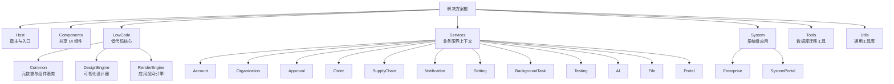
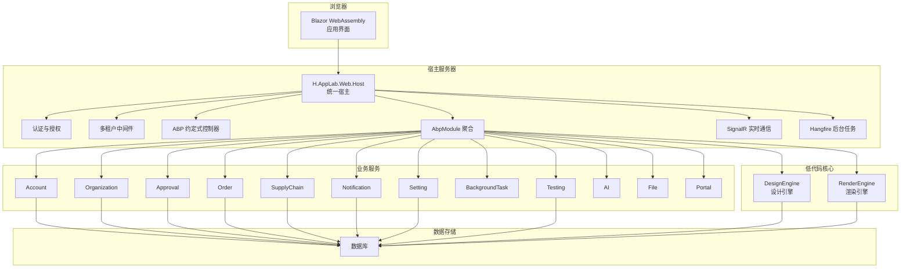
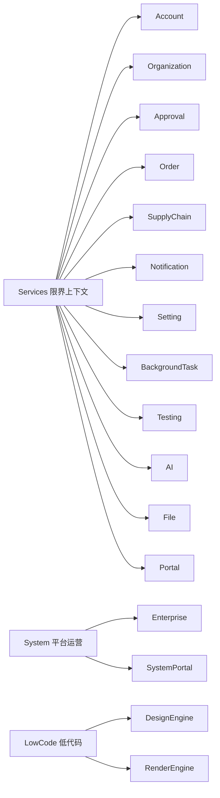
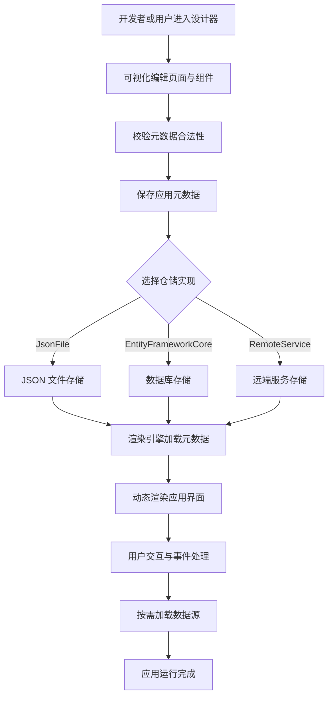
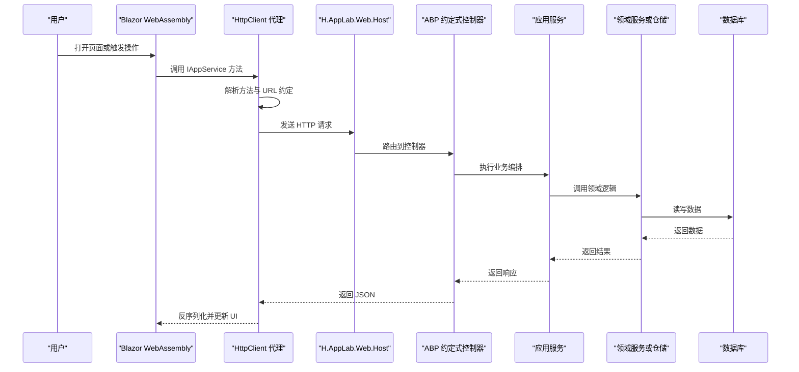
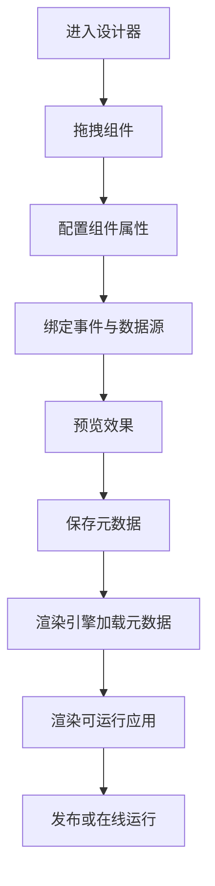
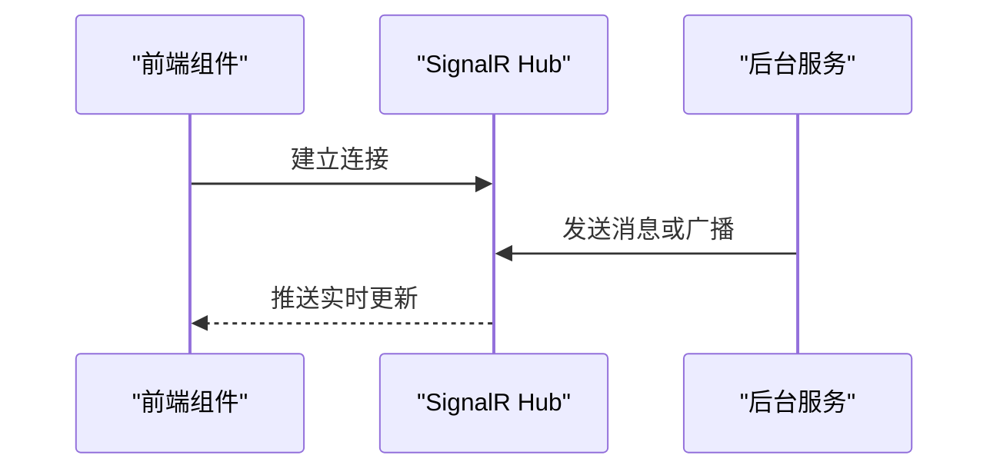
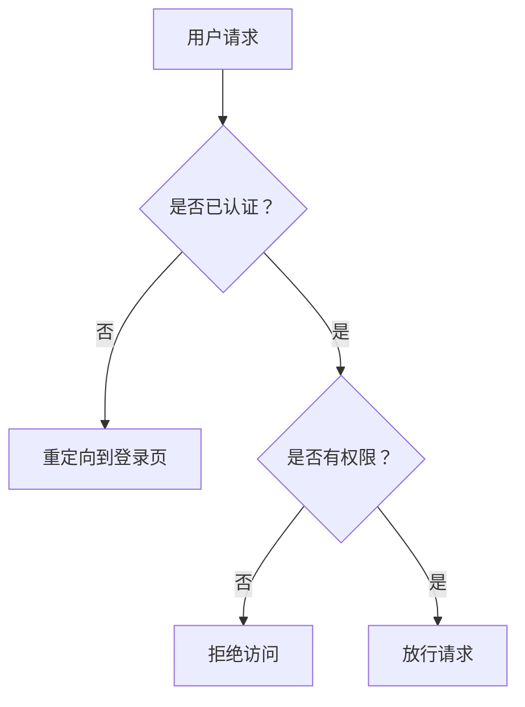
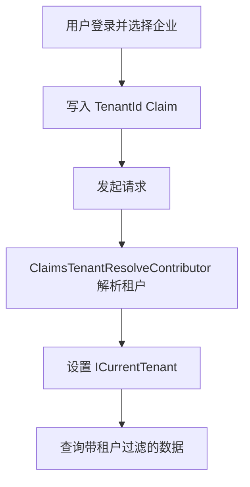
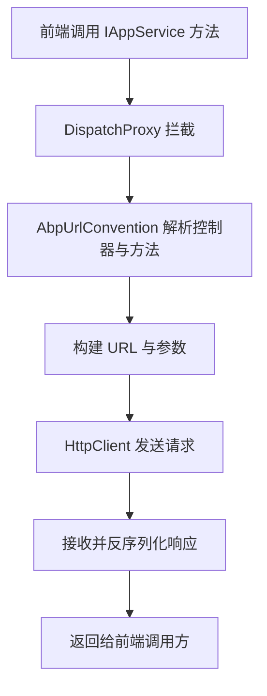

# 架构设计

<cite>
**本文引用的文件**   
- [README.md](file://README.md)
- [AppLab.slnx](file://src/AppLab.slnx)
- [common.props](file://src/common.props)
- [Program.cs（宿主）](file://src/Host/H.AppLab.Web.Host/H.AppLab.Web.Host/Program.cs)
- [HostAllModule.cs](file://src/Host/H.AppLab.Web.Host/H.AppLab.Web.Host/HostAllModule.cs)
- [ClaimsTenantResolveContributor.cs](file://src/Host/H.AppLab.Web.Host/H.AppLab.Web.Host/ClaimsTenantResolveContributor.cs)
- [Program.cs（WebAssembly 客户端）](file://src/Host/H.AppLab.Web.Host/H.AppLab.Web.Host.Client/Program.cs)
- [AppIdHeaderHandler.cs](file://src/Host/H.AppLab.Web.Host/H.AppLab.Web.Host.Client/AppIdHeaderHandler.cs)
- [CookieHandler.cs](file://src/Host/H.AppLab.Web.Host/H.AppLab.Web.Host.Client/CookieHandler.cs)
- [HttpClientProxyInterceptor.cs](file://src/Utils/H.Abp.HttpClientProxy/HttpClientProxyInterceptor.cs)
- [ServiceCollectionExtensions.cs（HttpClientProxy）](file://src/Utils/H.Abp.HttpClientProxy/ServiceCollectionExtensions.cs)
- [AbpUrlConvention.cs](file://src/Utils/H.Abp.HttpClientProxy/AbpUrlConvention.cs)
- [RemoteServiceOptions.cs](file://src/Utils/H.Abp.HttpClientProxy/RemoteServiceOptions.cs)
</cite>

## 目录
1. [引言](#引言)
2. [项目结构](#项目结构)
3. [核心组件](#核心组件)
4. [架构总览](#架构总览)
5. [分层与模块化架构](#分层与模块化架构)
6. [微服务与限界上下文划分](#微服务与限界上下文划分)
7. [低代码架构：设计与渲染引擎](#低代码架构设计与渲染引擎)
8. [数据流设计](#数据流设计)
9. [安全架构](#安全架构)
10. [依赖关系分析](#依赖关系分析)
11. [性能特性与优化](#性能特性与优化)
12. [故障排查指南](#故障排查指南)
13. [结论](#结论)

## 引言
H.AppLab 是一个基于 .NET 与 Blazor 的企业级应用开发与运行平台。它采用模块化、分层与可插拔的架构模式，既支持单体部署，也支持按服务独立部署。系统围绕“低代码”能力构建，提供可视化设计器、元数据驱动的应用渲染引擎，以及账号、组织、审批、订单、供应链、通知、设置、测试等基础与企业服务，同时通过 SystemPortal 和 Enterprise 面向平台运营与管理。

该平台的核心目标是：
- 以低代码方式快速定义页面与组件，生成并运行应用。
- 通过统一宿主聚合各业务模块，形成一致的前端体验与后端 API。
- 通过 HttpClient 动态代理与约定式路由，让前端只依赖接口契约，屏蔽 HTTP 调用细节。
- 通过多租户机制支撑企业隔离的数据访问。
- 通过 WebAssembly 懒加载与压缩策略提升前端启动与运行性能。

**章节来源**
- [README.md:1-73](file://README.md#L1-L73)

## 项目结构
仓库采用解决方案级组织方式，核心目录包括：
- Host：宿主程序，负责 Blazor Server/WebAssembly 组合渲染、SignalR、认证授权、多租户、控制器注册、静态资源与中间件管道。
- Components：跨应用复用的 UI 组件，如 AppDrawer。
- LowCode：低代码核心领域，包含 Common 公共元数据与组件基类、DesignEngine 设计引擎、RenderEngine 渲染引擎。
- Services：按限界上下文划分的业务服务，每个服务通常包含 Application.Contracts、Application、EntityFrameworkCore、Web 四个层次。
- System：系统级应用，如 Enterprise、SystemPortal，用于平台运营。
- Tools：每个服务的数据库迁移工具。
- Utils：通用工具库，包括 ABP 应用契约封装、HTTP 客户端代理、Blazor 工具、ID 生成与基础类型扩展。

```mermaid
graph TB
    A["解决方案根"] --> B["Host<br/>宿主与入口"]
    A --> C["Components<br/>共享 UI 组件"]
    A --> D["LowCode<br/>低代码核心"]
    A --> E["Services<br/>业务限界上下文"]
    A --> F["System<br/>系统级应用"]
    A --> G["Tools<br/>数据库迁移工具"]
    A --> H["Utils<br/>通用工具库"]

    D --> D1["Common<br/>元数据与组件基类"]
    D --> D2["DesignEngine<br/>可视化设计器"]
    D --> D3["RenderEngine<br/>应用渲染引擎"]

    E --> E1["Account"]
    E --> E2["Organization"]
    E --> E3["Approval"]
    E --> E4["Order"]
    E --> E5["SupplyChain"]
    E --> E6["Notification"]
    E --> E7["Setting"]
    E --> E8["BackgroundTask"]
    E --> E9["Testing"]
    E --> E10["AI"]
    E --> E11["File"]
    E --> E12["Portal"]

    F --> F1["Enterprise"]
    F --> F2["SystemPortal"]
```

**图表来源**
- [AppLab.slnx:1-180](file://src/AppLab.slnx#L1-L180)

**章节来源**
- [AppLab.slnx:1-180](file://src/AppLab.slnx#L1-L180)
- [common.props:1-15](file://src/common.props#L1-L15)

## 核心组件
本项目的关键基础设施与核心组件如下：

| 组件 | 职责 | 关键实现要点 |
| --- | --- | --- |
| 统一宿主 | 启动 Blazor、SignalR、认证授权、多租户、控制器与模块聚合 | Program 中完成中间件注册；HostAllModule 聚合所有 AbpModule |
| 低代码设计引擎 | 可视化编排页面与组件，产出应用元数据 | DesignEngine 模块，支持多种仓储实现 |
| 低代码渲染引擎 | 根据元数据动态渲染应用 | RenderEngine 模块，主题使用 Ant Design Blazor |
| 前端 HTTP 客户端代理 | 将 IAppService 接口调用转换为 HTTP 请求 | DispatchProxy 拦截 + ABP URL 约定 |
| 多租户解析器 | 从 Cookie Claim 解析当前租户 | ClaimsTenantResolveContributor |
| WebAssembly 客户端容器 | 组合式 DI，支持懒加载模块 | LazyModuleRegistry + CompositeServiceProviderFactory |
| 应用 ID 请求头处理器 | 从路由提取 appId 注入请求头 | AppIdHeaderHandler |
| Cookie 凭据处理器 | 使 WASM 请求携带 Cookie | CookieHandler |

这些组件共同构成平台的运行时骨架：宿主负责整体装配，低代码引擎负责应用定义与运行，前端代理负责契约到 HTTP 的转换，多租户与认证负责安全边界。

**章节来源**
- [Program.cs（宿主）:1-112](file://src/Host/H.AppLab.Web.Host/H.AppLab.Web.Host/Program.cs#L1-L112)
- [HostAllModule.cs:1-207](file://src/Host/H.AppLab.Web.Host/H.AppLab.Web.Host/HostAllModule.cs#L1-L207)
- [HttpClientProxyInterceptor.cs:1-234](file://src/Utils/H.Abp.HttpClientProxy/HttpClientProxyInterceptor.cs#L1-L234)
- [ServiceCollectionExtensions.cs（HttpClientProxy）:1-63](file://src/Utils/H.Abp.HttpClientProxy/ServiceCollectionExtensions.cs#L1-L63)
- [AbpUrlConvention.cs:1-86](file://src/Utils/H.Abp.HttpClientProxy/AbpUrlConvention.cs#L1-L86)
- [ClaimsTenantResolveContributor.cs:1-29](file://src/Host/H.AppLab.Web.Host/H.AppLab.Web.Host/ClaimsTenantResolveContributor.cs#L1-L29)
- [Program.cs（WebAssembly 客户端）:1-13](file://src/Host/H.AppLab.Web.Host/H.AppLab.Web.Host.Client/Program.cs#L1-L13)
- [AppIdHeaderHandler.cs:1-50](file://src/Host/H.AppLab.Web.Host/H.AppLab.Web.Host.Client/AppIdHeaderHandler.cs#L1-L50)
- [CookieHandler.cs:1-16](file://src/Host/H.AppLab.Web.Host/H.AppLab.Web.Host.Client/CookieHandler.cs#L1-L16)

## 架构总览
H.AppLab 的整体架构可以概括为“统一宿主 + 模块化业务 + 低代码引擎 + 前端契约驱动”。

- 表现层：Blazor Server + WebAssembly 混合渲染，前端通过路由懒加载不同应用的程序集。
- 应用层：ABP 应用服务，按限界上下文划分为多个 Service 模块。
- 领域层：各模块 Domain 实体与规则，部分由 EntityFrameworkCore 映射到数据库。
- 基础设施层：数据库迁移、仓储实现、配置、远程服务、HTTP 代理、SignalR、Hangfire 等。

```mermaid
graph TB
    subgraph "浏览器"
        Browser["Blazor WebAssembly<br/>应用界面"]
    end

    subgraph "宿主服务器"
        Host["H.AppLab.Web.Host<br/>统一宿主"]
        Auth["认证与授权"]
        MT["多租户中间件"]
        Controllers["ABP 约定式控制器"]
        Modules["AbpModule 聚合"]
        SignalR["SignalR 实时通信"]
        Hangfire["Hangfire 后台任务"]
    end

    subgraph "业务服务"
        S_Account["Account"]
        S_Org["Organization"]
        S_Approval["Approval"]
        S_Order["Order"]
        S_SupplyChain["SupplyChain"]
        S_Notify["Notification"]
        S_Setting["Setting"]
        S_Background["BackgroundTask"]
        S_Testing["Testing"]
        S_AI["AI"]
        S_File["File"]
        S_Portal["Portal"]
    end

    subgraph "低代码核心"
        L_Design["DesignEngine<br/>设计引擎"]
        L_Render["RenderEngine<br/>渲染引擎"]
    end

    subgraph "数据存储"
        DB["数据库"]
    end

    Browser --> Host
    Host --> Auth
    Host --> MT
    Host --> Controllers
    Host --> Modules
    Host --> SignalR
    Host --> Hangfire
    Modules --> S_Account
    Modules --> S_Org
    Modules --> S_Approval
    Modules --> S_Order
    Modules --> S_SupplyChain
    Modules --> S_Notify
    Modules --> S_Setting
    Modules --> S_Background
    Modules --> S_Testing
    Modules --> S_AI
    Modules --> S_File
    Modules --> S_Portal
    Modules --> L_Design
    Modules --> L_Render
    S_Account --> DB
    S_Org --> DB
    S_Approval --> DB
    S_Order --> DB
    S_SupplyChain --> DB
    S_Notify --> DB
    S_Setting --> DB
    S_Testing --> DB
    L_Design --> DB
    L_Render --> DB
```

**图表来源**
- [Program.cs（宿主）:1-112](file://src/Host/H.AppLab.Web.Host/H.AppLab.Web.Host/Program.cs#L1-L112)
- [HostAllModule.cs:1-207](file://src/Host/H.AppLab.Web.Host/H.AppLab.Web.Host/HostAllModule.cs#L1-L207)

**章节来源**
- [Program.cs（宿主）:1-112](file://src/Host/H.AppLab.Web.Host/H.AppLab.Web.Host/Program.cs#L1-L112)
- [HostAllModule.cs:1-207](file://src/Host/H.AppLab.Web.Host/H.AppLab.Web.Host/HostAllModule.cs#L1-L207)

## 分层与模块化架构
### 分层架构
系统遵循典型的四层结构：

| 层级 | 说明 | 在系统中的体现 |
| --- | --- | --- |
| 表现层 | 用户界面与交互逻辑 | Blazor Server + WebAssembly；AppDrawer、各 Web 模块的 Razor 组件 |
| 应用层 | 业务流程编排与对外 API | 各模块的 Application 与 Application.Contracts，如 AccountApplicationModule |
| 领域层 | 领域模型与业务规则 | 各模块 Domain 实体与行为 |
| 基础设施层 | 持久化、配置、远程调用、消息、调度等 | EntityFrameworkCore、DbMigrator、HttpClientProxy、SignalR、Hangfire |

### 模块化架构
每个业务模块遵循统一的模块结构：
- Application.Contracts：对外暴露的 DTO 与应用服务接口。
- Application：应用服务实现。
- EntityFrameworkCore：数据库上下文、实体、迁移。
- Web：Web 层入口与模块注册。

统一宿主通过 HostAllModule 聚合所有模块，避免硬编码业务耦合，同时集中配置认证、多租户、控制器与传统 MVC 约定。

```mermaid
classDiagram
    class HostAllModule {
        +ConfigureServices()
        -ConfigureAuthentication()
        -ConfigureMultiTenancy()
        -ConfigureExternalLogin()
        -ConfigureAutoApiControllers()
    }

    class AbpModule

    class AccountApplicationModule
    class OrganizationApplicationModule
    class ApprovalApplicationModule
    class OrderApplicationModule
    class SupplyChainApplicationModule
    class NotificationApplicationModule
    class SettingApplicationModule
    class BackgroundTaskApplicationModule
    class TestingApplicationModule
    class AIApplicationModule
    class FileApplicationModule
    class PortalApplicationModule
    class SystemPortalApplicationModule
    class EnterpriseApplicationModule
    class DesignEngineApplicationModule
    class RenderEngineApplicationModule

    HostAllModule --|> AbpModule : "继承"
    HostAllModule --> AccountApplicationModule : "DependsOn"
    HostAllModule --> OrganizationApplicationModule : "DependsOn"
    HostAllModule --> ApprovalApplicationModule : "DependsOn"
    HostAllModule --> OrderApplicationModule : "DependsOn"
    HostAllModule --> SupplyChainApplicationModule : "DependsOn"
    HostAllModule --> NotificationApplicationModule : "DependsOn"
    HostAllModule --> SettingApplicationModule : "DependsOn"
    HostAllModule --> BackgroundTaskApplicationModule : "DependsOn"
    HostAllModule --> TestingApplicationModule : "DependsOn"
    HostAllModule --> AIApplicationModule : "DependsOn"
    HostAllModule --> FileApplicationModule : "DependsOn"
    HostAllModule --> PortalApplicationModule : "DependsOn"
    HostAllModule --> SystemPortalApplicationModule : "DependsOn"
    HostAllModule --> EnterpriseApplicationModule : "DependsOn"
    HostAllModule --> DesignEngineApplicationModule : "DependsOn"
    HostAllModule --> RenderEngineApplicationModule : "DependsOn"
```

**图表来源**
- [HostAllModule.cs:1-207](file://src/Host/H.AppLab.Web.Host/H.AppLab.Web.Host/HostAllModule.cs#L1-L207)

**章节来源**
- [HostAllModule.cs:1-207](file://src/Host/H.AppLab.Web.Host/H.AppLab.Web.Host/HostAllModule.cs#L1-L207)

## 微服务与限界上下文划分
### 限界上下文
Services 目录下每个子目录代表一个限界上下文，典型包括：
- Account：账号管理。
- Organization：组织架构。
- Approval：审批流程。
- Order：订单。
- SupplyChain：供应链。
- Notification：通知中心。
- Setting：系统设置。
- BackgroundTask：后台任务。
- Testing：测试管理与执行。
- AI：AI 相关能力。
- File：文件管理。
- Portal：门户聚合。

System 目录下的 Enterprise 与 SystemPortal 属于平台运营域，与 Services 保持严格隔离。

### 单体与微服务部署
- 单体：HostAllModule 聚合所有模块，适合快速集成与调试。
- 微服务：README 明确支持按服务独立部署；Host 下存在 Account、RenderEngine 等单服务宿主，结合 RemoteServices 配置可将某些服务拆分为独立进程。

```mermaid
graph LR
    Subgraph_A["Services 限界上下文"]
    Account["Account"]
    Organization["Organization"]
    Approval["Approval"]
    Order["Order"]
    SupplyChain["SupplyChain"]
    Notification["Notification"]
    Setting["Setting"]
    BackgroundTask["BackgroundTask"]
    Testing["Testing"]
    AI["AI"]
    File["File"]
    Portal["Portal"]

    Subgraph_B["System 平台运营"]
    Enterprise["Enterprise"]
    SystemPortal["SystemPortal"]

    Subgraph_C["LowCode 低代码"]
    Design["DesignEngine"]
    Render["RenderEngine"]

    Subgraph_A --> Account
    Subgraph_A --> Organization
    Subgraph_A --> Approval
    Subgraph_A --> Order
    Subgraph_A --> SupplyChain
    Subgraph_A --> Notification
    Subgraph_A --> Setting
    Subgraph_A --> BackgroundTask
    Subgraph_A --> Testing
    Subgraph_A --> AI
    Subgraph_A --> File
    Subgraph_A --> Portal

    Subgraph_B --> Enterprise
    Subgraph_B --> SystemPortal

    Subgraph_C --> Design
    Subgraph_C --> Render
```

**图表来源**
- [AppLab.slnx:1-180](file://src/AppLab.slnx#L1-L180)

**章节来源**
- [README.md:1-73](file://README.md#L1-L73)
- [AppLab.slnx:1-180](file://src/AppLab.slnx#L1-L180)

## 低代码架构：设计与渲染引擎
### 设计理念
低代码架构以“元数据驱动”为核心：
- 设计阶段：DesignEngine 提供可视化编辑器，用户编排页面、组件、事件与数据源，最终输出应用元数据。
- 运行阶段：RenderEngine 读取元数据，动态渲染出可运行的应用，并通过主题系统适配界面风格。

### 元数据与组件体系
- Common 中的 MetaSchema 定义元数据结构，供设计器与渲染器共用。
- ComponentBase 与 Components 提供组件基类与默认组件库，降低自定义组件开发成本。
- 仓储层支持 JsonFile、EntityFrameworkCore 与 RemoteService 三种实现，满足本地、数据库与远端三种存储场景。

```mermaid
flowchart TD
    Start["开发者或用户进入设计器"] --> Edit["可视化编辑页面与组件"]
    Edit --> Validate["校验元数据合法性"]
    Validate --> Save["保存应用元数据"]
    Save --> Store{"选择仓储实现"}
    Store -->|JsonFile| JsonStore["JSON 文件存储"]
    Store -->|EntityFrameworkCore| DbStore["数据库存储"]
    Store -->|RemoteService| RemoteStore["远端服务存储"]

    JsonStore --> Run["渲染引擎加载元数据"]
    DbStore --> Run
    RemoteStore --> Run

    Run --> Render["动态渲染应用界面"]
    Render --> Interact["用户交互与事件处理"]
    Interact --> DataLoad["按需加载数据源"]
    DataLoad --> End["应用运行完成"]
```

**图表来源**
- [AppLab.slnx:1-180](file://src/AppLab.slnx#L1-L180)

**章节来源**
- [AppLab.slnx:1-180](file://src/AppLab.slnx#L1-L180)
- [README.md:1-73](file://README.md#L1-L73)

## 数据流设计
### 用户请求处理流程
用户在浏览器中发起请求，经过以下路径到达后端服务：

```mermaid
sequenceDiagram
    participant User as "用户"
    participant Browser as "Blazor WebAssembly"
    participant Client as "HttpClient 代理"
    participant Host as "H.AppLab.Web.Host"
    participant Controller as "ABP 约定式控制器"
    participant AppService as "应用服务"
    participant Domain as "领域服务或仓储"
    participant DB as "数据库"

    User->>Browser: 打开页面或触发操作
    Browser->>Client: 调用 IAppService 方法
    Client->>Client: 解析方法与 URL 约定
    Client->>Host: 发送 HTTP 请求
    Host->>Controller: 路由到控制器
    Controller->>AppService: 执行业务编排
    AppService->>Domain: 调用领域逻辑
    Domain->>DB: 读写数据
    DB-->>Domain: 返回数据
    Domain-->>AppService: 返回结果
    AppService-->>Controller: 返回响应
    Controller-->>Client: 返回 JSON
    Client-->>Browser: 反序列化并更新 UI
```

**图表来源**
- [HttpClientProxyInterceptor.cs:1-234](file://src/Utils/H.Abp.HttpClientProxy/HttpClientProxyInterceptor.cs#L1-L234)
- [AbpUrlConvention.cs:1-86](file://src/Utils/H.Abp.HttpClientProxy/AbpUrlConvention.cs#L1-L86)
- [Program.cs（宿主）:1-112](file://src/Host/H.AppLab.Web.Host/H.AppLab.Web.Host/Program.cs#L1-L112)
- [HostAllModule.cs:1-207](file://src/Host/H.AppLab.Web.Host/H.AppLab.Web.Host/HostAllModule.cs#L1-L207)

### 低代码设计流程
低代码设计流程强调“编辑、校验、保存、渲染”的闭环：
- 编辑：用户在 DesignEngine 中拖拽组件、绑定属性与事件。
- 校验：对元数据进行结构与语义校验。
- 保存：将元数据写入所选仓储。
- 渲染：RenderEngine 加载元数据并动态生成页面。

```mermaid
flowchart TD
    DesignStart["进入设计器"] --> Drag["拖拽组件"]
    Drag --> Configure["配置组件属性"]
    Configure --> BindEvent["绑定事件与数据源"]
    BindEvent --> Preview["预览效果"]
    Preview --> SaveMeta["保存元数据"]
    SaveMeta --> LoadMeta["渲染引擎加载元数据"]
    LoadMeta --> RenderApp["渲染可运行应用"]
    RenderApp --> Deploy["发布或在线运行"]
```

**图表来源**
- [AppLab.slnx:1-180](file://src/AppLab.slnx#L1-L180)

### 实时通信流程
宿主启用 SignalR，可用于通知、状态同步、任务进度推送等场景。前端可通过 WebSocket 与服务端建立长连接，服务端通过 Hub 推送消息。

```mermaid
sequenceDiagram
    participant Client as "前端组件"
    participant Hub as "SignalR Hub"
    participant Service as "后台服务"

    Client->>Hub: 建立连接
    Service->>Hub: 发送消息或广播
    Hub-->>Client: 推送实时更新
```

**图表来源**
- [Program.cs（宿主）:1-112](file://src/Host/H.AppLab.Web.Host/H.AppLab.Web.Host/Program.cs#L1-L112)

## 安全架构
### 认证与授权
- 宿主使用 Cookie 认证，配置了普通登录路径与系统登录路径两套 Scheme。
- 未登录时重定向到 /account/login 或 /system/login。
- CSRF 保护针对 WASM 关闭自动验证，依赖 SameSite Cookie 提供基础防护。
- 外部登录通过 WeChatAuthService 与 DingTalkAuthService 扩展。

```mermaid
flowchart TD
    Request["用户请求"] --> CheckAuth{"是否已认证？"}
    CheckAuth -->|否| Redirect["重定向到登录页"]
    CheckAuth -->|是| CheckRole{"是否有权限？"}
    CheckRole -->|否| AccessDenied["拒绝访问"]
    CheckRole -->|是| Allow["放行请求"]
```

**图表来源**
- [HostAllModule.cs:1-207](file://src/Host/H.AppLab.Web.Host/H.AppLab.Web.Host/HostAllModule.cs#L1-L207)

### 多租户隔离
- 多租户功能启用，租户信息优先从 Cookie 中的 TenantId Claim 解析。
- ClaimsTenantResolveContributor 将 Claim 中的租户 Id 注入当前租户上下文，驱动后续数据访问的租户过滤。
- 当租户无效时，中间件会清理 __tenant Cookie 并重定向首页，避免阻断所有请求。

```mermaid
flowchart TD
    Login["用户登录并选择企业"] --> SetClaim["写入 TenantId Claim"]
    SetClaim --> Request["发起请求"]
    Request --> Resolve["ClaimsTenantResolveContributor 解析租户"]
    Resolve --> CurrentTenant["设置 ICurrentTenant"]
    CurrentTenant --> Query["查询带租户过滤的数据"]
```

**图表来源**
- [ClaimsTenantResolveContributor.cs:1-29](file://src/Host/H.AppLab.Web.Host/H.AppLab.Web.Host/ClaimsTenantResolveContributor.cs#L1-L29)
- [HostAllModule.cs:1-207](file://src/Host/H.AppLab.Web.Host/H.AppLab.Web.Host/HostAllModule.cs#L1-L207)

### 数据安全
- 前端通过 CookieHandler 确保请求携带 Cookie，避免会话丢失。
- AppIdHeaderHandler 将当前路由中的 appId 注入请求头，便于后端按应用维度加载数据源或进行应用级隔离。
- 传输层启用 HTTPS 重定向与响应压缩，减少敏感数据明文传输风险并提升性能。

**章节来源**
- [HostAllModule.cs:1-207](file://src/Host/H.AppLab.Web.Host/H.AppLab.Web.Host/HostAllModule.cs#L1-L207)
- [ClaimsTenantResolveContributor.cs:1-29](file://src/Host/H.AppLab.Web.Host/H.AppLab.Web.Host/ClaimsTenantResolveContributor.cs#L1-L29)
- [CookieHandler.cs:1-16](file://src/Host/H.AppLab.Web.Host/H.AppLab.Web.Host.Client/CookieHandler.cs#L1-L16)
- [AppIdHeaderHandler.cs:1-50](file://src/Host/H.AppLab.Web.Host/H.AppLab.Web.Host.Client/AppIdHeaderHandler.cs#L1-L50)
- [Program.cs（宿主）:1-112](file://src/Host/H.AppLab.Web.Host/H.AppLab.Web.Host/Program.cs#L1-L112)

## 依赖关系分析
### 前端契约到 HTTP 的动态代理
前端通过 AddHttpClientProxies 扫描 IAppService 接口，使用 HttpClientProxyInterceptor 将方法调用转换为 HTTP 请求。URL 构造遵循 ABP 约定：
- 接口名去掉 I 前缀与 AppService/ApplicationService 后缀，转为 kebab-case。
- 方法名前缀决定 HTTP 动词，例如 GetList → GET，Create → POST。
- id 参数与以 Id 结尾的参数会被放入 URL 路径段。
- 复杂参数在 POST/PUT 时放入请求体，GET/DELETE 时可展开为查询参数。

```mermaid
flowchart TD
    Call["前端调用 IAppService 方法"] --> Intercept["DispatchProxy 拦截"]
    Intercept --> Convention["AbpUrlConvention 解析控制器与方法"]
    Convention --> BuildUrl["构建 URL 与参数"]
    BuildUrl --> Send["HttpClient 发送请求"]
    Send --> Response["接收并反序列化响应"]
    Response --> Return["返回给前端调用方"]
```

**图表来源**
- [HttpClientProxyInterceptor.cs:1-234](file://src/Utils/H.Abp.HttpClientProxy/HttpClientProxyInterceptor.cs#L1-L234)
- [AbpUrlConvention.cs:1-86](file://src/Utils/H.Abp.HttpClientProxy/AbpUrlConvention.cs#L1-L86)
- [ServiceCollectionExtensions.cs（HttpClientProxy）:1-63](file://src/Utils/H.Abp.HttpClientProxy/ServiceCollectionExtensions.cs#L1-L63)

### 服务发现与远程服务配置
RemoteServiceOptions 从配置的 RemoteServices 节点读取 BaseUrl，AddRemoteServices 将配置注入容器，AddHttpClientProxies 按远程服务名称创建 HttpClient 实例并注入代理实现。

**章节来源**
- [HttpClientProxyInterceptor.cs:1-234](file://src/Utils/H.Abp.HttpClientProxy/HttpClientProxyInterceptor.cs#L1-L234)
- [AbpUrlConvention.cs:1-86](file://src/Utils/H.Abp.HttpClientProxy/AbpUrlConvention.cs#L1-L86)
- [ServiceCollectionExtensions.cs（HttpClientProxy）:1-63](file://src/Utils/H.Abp.HttpClientProxy/ServiceCollectionExtensions.cs#L1-L63)
- [RemoteServiceOptions.cs:1-33](file://src/Utils/H.Abp.HttpClientProxy/RemoteServiceOptions.cs#L1-L33)

## 性能特性与优化
### 前端懒加载
- 首页仅加载必要程序集，其他应用在导航时按需下载。
- 使用 LazyModuleRegistry 与 CompositeServiceProviderFactory 实现懒加载后的延迟服务注册。

### 响应压缩
- 启用 Brotli 与 Gzip 压缩，减少 WASM 程序集与静态资源体积。
- 对 application/wasm、application/dll 等类型启用压缩。

### 缓存策略
- MapStaticAssets 统一处理静态资源缓存，指纹化程序集使用 immutable 长缓存，boot manifest 保留重新校验语义。

**章节来源**
- [README.md:1-73](file://README.md#L1-L73)
- [Program.cs（宿主）:1-112](file://src/Host/H.AppLab.Web.Host/H.AppLab.Web.Host/Program.cs#L1-L112)
- [Program.cs（WebAssembly 客户端）:1-13](file://src/Host/H.AppLab.Web.Host/H.AppLab.Web.Host.Client/Program.cs#L1-L13)

## 故障排查指南
### 常见问题与定位思路
| 问题现象 | 可能原因 | 排查建议 |
| --- | --- | --- |
| 页面卡在加载中 | boot manifest 与指纹程序集缓存不一致 | 检查 MapStaticAssets 与浏览器缓存，避免手动标记整个 /_framework 为 immutable |
| 前端无法携带 Cookie | WASM 请求未设置凭据 | 确认 CookieHandler 已注册并使用 |
| 远端接口调用失败 | RemoteServices 配置错误或 BaseUrl 不正确 | 检查 appsettings.json 中 RemoteServices 节点 |
| 租户数据异常 | TenantId Claim 缺失或错误 | 检查登录流程是否写入 TenantId，查看 ClaimsTenantResolveContributor |
| 控制器未生效 | 模块未正确 DependsOn 或未注册控制器 | 检查 HostAllModule 的 DependsOn 与 ConfigureAutoApiControllers |

**章节来源**
- [Program.cs（宿主）:1-112](file://src/Host/H.AppLab.Web.Host/H.AppLab.Web.Host/Program.cs#L1-L112)
- [CookieHandler.cs:1-16](file://src/Host/H.AppLab.Web.Host/H.AppLab.Web.Host.Client/CookieHandler.cs#L1-L16)
- [RemoteServiceOptions.cs:1-33](file://src/Utils/H.Abp.HttpClientProxy/RemoteServiceOptions.cs#L1-L33)
- [ClaimsTenantResolveContributor.cs:1-29](file://src/Host/H.AppLab.Web.Host/H.AppLab.Web.Host/ClaimsTenantResolveContributor.cs#L1-L29)
- [HostAllModule.cs:1-207](file://src/Host/H.AppLab.Web.Host/H.AppLab.Web.Host/HostAllModule.cs#L1-L207)

## 结论
H.AppLab 通过统一宿主、模块化业务、低代码设计与渲染引擎、前端契约驱动与多租户机制，形成了一个可扩展、可复用、可运维的企业级应用平台。其架构优势体现在：
- 清晰的层次与模块边界，便于团队分工与独立演进。
- 低代码能力覆盖从设计到运行的完整链路，降低应用开发门槛。
- 前端契约驱动与动态代理减少重复 HTTP 调用代码，提升一致性。
- 多租户与认证授权为多企业场景提供基础安全保障。
- 懒加载与压缩策略优化前端启动与运行体验。

在实际使用中，建议：
- 新增业务模块时遵循 Application.Contracts / Application / EntityFrameworkCore / Web 的分层规范。
- 谨慎扩展多租户与认证逻辑，确保 Claim 与租户上下文一致性。
- 合理拆分远程服务，利用 RemoteServices 配置实现单体到微服务的平滑过渡。
- 充分利用低代码元数据与组件体系，提高页面与功能的复用率。