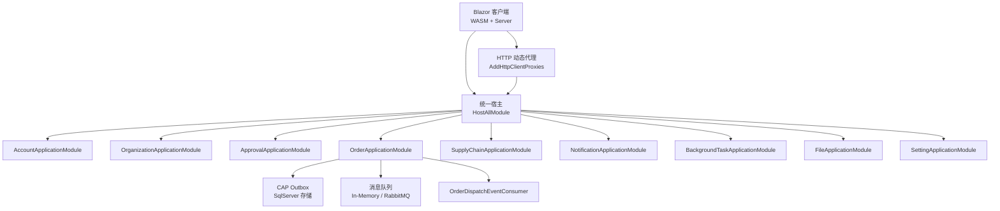
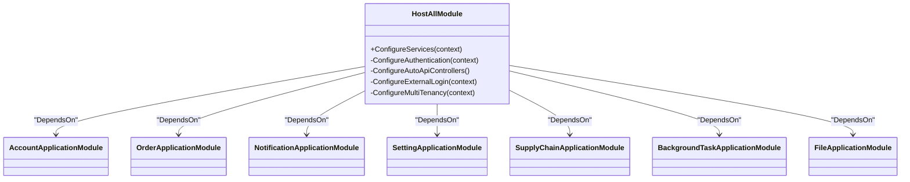
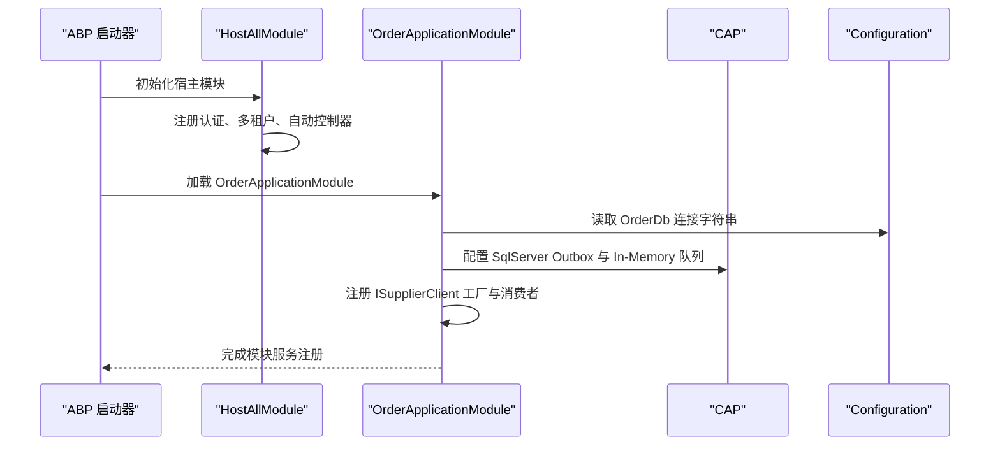
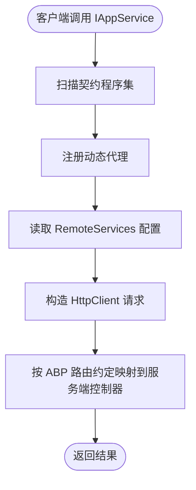
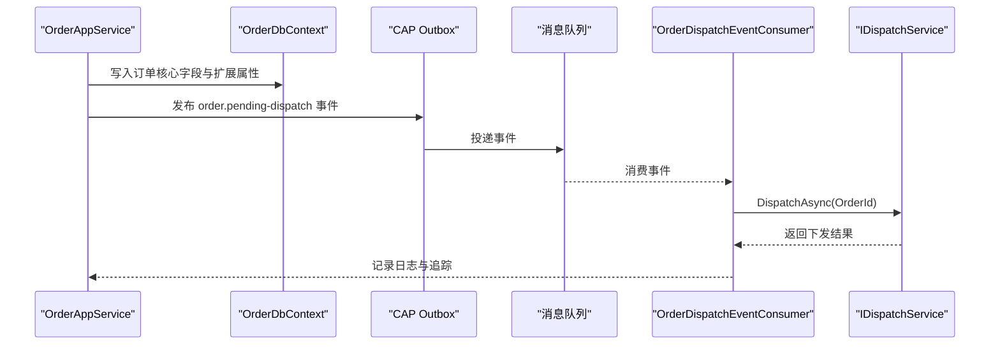
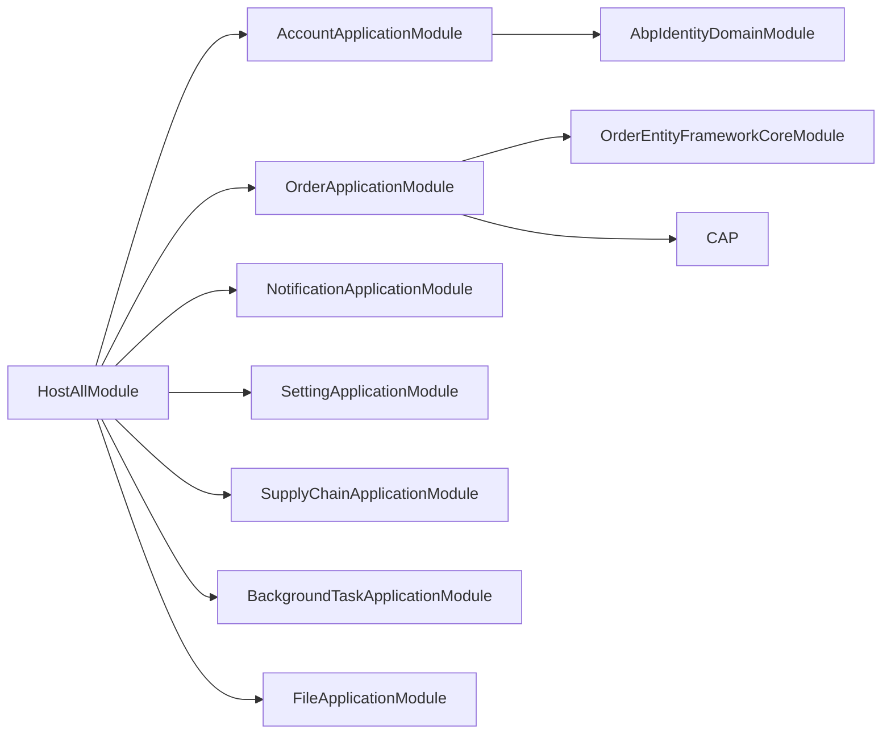

# 模块化架构设计

<cite>
**本文引用的文件**   
- [README.md](file://README.md)
- [HostAllModule.cs](file://src/Host/H.AppLab.Web.Host/H.AppLab.Web.Host/HostAllModule.cs)
- [OrderApplicationModule.cs](file://src/Services/Order/H.Order.Application/OrderApplicationModule.cs)
- [AccountApplicationModule.cs](file://src/Services/Account/H.Account.Application/AccountApplicationModule.cs)
- [ServiceCollectionExtensions.cs](file://src/Utils/H.Abp.HttpClientProxy/ServiceCollectionExtensions.cs)
- [OrderTopics.cs](file://src/Services/Order/H.Order.Application.Contracts/Abstractions/OrderTopics.cs)
- [OrderEvents.cs](file://src/Services/Order/H.Order.Application.Contracts/Events/OrderEvents.cs)
- [OrderDispatchEventConsumer.cs](file://src/Services/Order/H.Order.Application/Services/OrderDispatchEventConsumer.cs)
</cite>

## 目录
1. [引言](#引言)
2. [项目结构](#项目结构)
3. [核心组件](#核心组件)
4. [架构总览](#架构总览)
5. [详细组件分析](#详细组件分析)
6. [依赖关系分析](#依赖关系分析)
7. [性能与一致性考虑](#性能与一致性考虑)
8. [故障排查指南](#故障排查指南)
9. [结论](#结论)

## 引言
本设计文档面向 AppLab 的模块化架构，基于 ABP Framework 对限界上下文进行划分，涵盖 Account、Organization、Approval、Order、SupplyChain、Notification、BackgroundTask、File、Setting 等服务的领域模型与数据存储隔离。文档重点说明以下方面：
- 模块化原则：高内聚低耦合、接口契约优先、依赖倒置。
- 模块间通信：同步 HTTP API 动态代理、异步事件总线（CAP + RabbitMQ）、共享配置中心。
- 模块生命周期：启动顺序、依赖注入、健康检查。
- 模块依赖图与服务发现机制。
- 跨模块事务处理与分布式一致性策略。

本项目支持单体部署与按服务独立部署两种方式，前端基于 Blazor Web App，后端采用 ABP 的分层应用模块组织方式，并通过工具链提供数据库迁移能力。

**章节来源**
- [README.md:1-73](file://README.md#L1-L73)

## 项目结构
AppLab 代码库按 Host、Components、LowCode、Services、System、Tools、Utils 分层组织，其中 Services 下的每个业务域遵循 Application.Contracts / Application / EntityFrameworkCore / Web 的统一结构，形成清晰的限界上下文边界。

```mermaid
graph TB
    subgraph "宿主"
        HostAll["统一宿主<br/>H.AppLab.Web.Host"]
    end

    subgraph "服务模块"
        Acc["Account"]
        Org["Organization"]
        Apr["Approval"]
        Ord["Order"]
        Sup["SupplyChain"]
        Not["Notification"]
        Bg["BackgroundTask"]
        Fil["File"]
        Set["Setting"]
        Port["Portal"]
        Sys["SystemPortal"]
        Ent["Enterprise"]
        Test["Testing"]
    end

    subgraph "低代码平台"
        Design["DesignEngine"]
        Render["RenderEngine"]
        Common["Common"]
    end

    subgraph "工具与基础"
        Utils["Utils"]
        Tools["DbMigrator 工具集"]
    end

    HostAll --> Acc
    HostAll --> Org
    HostAll --> Apr
    HostAll --> Ord
    HostAll --> Sup
    HostAll --> Not
    HostAll --> Bg
    HostAll --> Fil
    HostAll --> Set
    HostAll --> Port
    HostAll --> Sys
    HostAll --> Ent
    HostAll --> Test
    HostAll --> Design
    HostAll --> Render
    HostAll --> Common
    HostAll --> Utils
    HostAll --> Tools
```

该结构体现了“按限界上下文拆分服务”的模块化思路，同时保留统一的 Host 入口用于单体运行和统一网关编排。

**图表来源**
- [HostAllModule.cs:1-60](file://src/Host/H.AppLab.Web.Host/H.AppLab.Web.Host/HostAllModule.cs#L1-L60)
- [README.md:1-73](file://README.md#L1-L73)

**章节来源**
- [README.md:1-73](file://README.md#L1-L73)

## 核心组件
- 统一宿主模块：负责聚合所有应用模块、注册认证、多租户、自动 API 控制器、外部登录、全局状态与提示服务等。
- 应用模块：每个业务域通过独立的 AbpModule 声明依赖、注册 HttpClient、领域服务与 CAP 消费者。
- HTTP 客户端动态代理：基于 IAppService 接口的远程调用代理，将前端或同进程内的接口调用映射为 HTTP 请求。
- 事件总线与消息队列：订单域使用 CAP 实现 Outbox 模式，开发环境使用内存消息队列，生产环境可替换为 RabbitMQ/Kafka。

这些组件共同实现了“契约先行、解耦通信、可插拔基础设施”的模块化目标。

**章节来源**
- [HostAllModule.cs:1-120](file://src/Host/H.AppLab.Web.Host/H.AppLab.Web.Host/HostAllModule.cs#L1-L120)
- [OrderApplicationModule.cs:1-47](file://src/Services/Order/H.Order.Application/OrderApplicationModule.cs#L1-L47)
- [ServiceCollectionExtensions.cs:1-63](file://src/Utils/H.Abp.HttpClientProxy/ServiceCollectionExtensions.cs#L1-L63)

## 架构总览
AppLab 的模块化架构围绕 ABP 的应用模块系统展开，统一宿主作为装配点，各服务模块以高内聚的领域模型和数据存储为核心，通过同步 HTTP API 和异步事件总线对外暴露能力。

该架构图体现以下要点：
- 统一宿主集中装配所有模块，避免运行时散乱注册。
- 订单模块通过 CAP 发布事件并消费自身或下游处理逻辑。
- 客户端通过动态代理访问各服务，屏蔽 HTTP 细节。

**图表来源**
- [HostAllModule.cs:1-120](file://src/Host/H.AppLab.Web.Host/H.AppLab.Web.Host/HostAllModule.cs#L1-L120)
- [OrderApplicationModule.cs:1-47](file://src/Services/Order/H.Order.Application/OrderApplicationModule.cs#L1-L47)
- [ServiceCollectionExtensions.cs:1-63](file://src/Utils/H.Abp.HttpClientProxy/ServiceCollectionExtensions.cs#L1-L63)

## 详细组件分析

### 统一宿主与模块装配
统一宿主模块是 AppLab 在单体模式下的装配中心，职责包括：
- 聚合 ABP 基础模块与各业务模块。
- 注册 HttpClient、HttpContextAccessor、Cookie 认证、多租户、外部登录。
- 启用 ABP 自动 API 控制器扫描，使各模块的控制器无需手动注册。
- 提供 LowCodeAppState、Toast 服务等横切能力。

该装配方式确保：
- 模块之间通过 ABP 模块系统管理依赖，降低耦合。
- 宿主不持有业务逻辑，仅做服务注册与配置。

**图表来源**
- [HostAllModule.cs:1-120](file://src/Host/H.AppLab.Web.Host/H.AppLab.Web.Host/HostAllModule.cs#L1-L120)

**章节来源**
- [HostAllModule.cs:1-210](file://src/Host/H.AppLab.Web.Host/H.AppLab.Web.Host/HostAllModule.cs#L1-L210)

### 应用模块生命周期与依赖注入
每个业务模块通过 AbpModule 定义其生命周期：
- 使用 DependsOn 声明对其他模块的依赖。
- 在 ConfigureServices 中注册 HttpContextAccessor、HttpClient、领域服务、仓储、CAP 等基础设施。
- Account 模块依赖 ABP Identity 领域模块；Order 模块依赖 EF Core 模块与 CAP。

该流程保证：
- 模块按依赖顺序启动。
- 配置从 IConfiguration 绑定，便于环境与部署差异化。
- CAP 消费者在模块启动时注册，具备失败重试能力。

**图表来源**
- [OrderApplicationModule.cs:1-47](file://src/Services/Order/H.Order.Application/OrderApplicationModule.cs#L1-L47)
- [AccountApplicationModule.cs:1-22](file://src/Services/Account/H.Account.Application/AccountApplicationModule.cs#L1-L22)

**章节来源**
- [OrderApplicationModule.cs:1-47](file://src/Services/Order/H.Order.Application/OrderApplicationModule.cs#L1-L47)
- [AccountApplicationModule.cs:1-22](file://src/Services/Account/H.Account.Application/AccountApplicationModule.cs#L1-L22)

### 同步 HTTP API 动态代理
客户端与服务端通过 IAppService 接口解耦：
- 服务端实现 IAppService，暴露 REST API。
- 客户端通过 AddRemoteServices 与 AddHttpClientProxies 扫描契约程序集，生成 HttpClient 代理。
- 远程服务 BaseUrl 由 RemoteServices 配置节点统一管理。

这种机制带来以下优势：
- 前端无需手写 HTTP 调用。
- 契约变更只需更新 Contract 程序集。
- 远程服务地址集中管理，便于服务发现与多实例切换。

**图表来源**
- [ServiceCollectionExtensions.cs:1-63](file://src/Utils/H.Abp.HttpClientProxy/ServiceCollectionExtensions.cs#L1-L63)

**章节来源**
- [ServiceCollectionExtensions.cs:1-63](file://src/Utils/H.Abp.HttpClientProxy/ServiceCollectionExtensions.cs#L1-L63)

### 异步事件总线与订单下发流程
订单域通过 CAP 实现异步事件驱动：
- 订单进入待下发状态时发布 OrderPendingDispatchEvent。
- OrderDispatchEventConsumer 订阅该事件，调用 IDispatchService.DispatchAsync 完成供应商匹配与下发。
- CAP 失败重试由框架内置，可配置重试次数与间隔。

该流程体现：
- 订单创建与事件发布在 Outbox 保障下保持一致性。
- 消费者具备重试能力，提升最终一致性。
- 主题常量集中在 OrderTopics，便于治理。

**图表来源**
- [OrderEvents.cs:1-20](file://src/Services/Order/H.Order.Application.Contracts/Events/OrderEvents.cs#L1-L20)
- [OrderTopics.cs:1-10](file://src/Services/Order/H.Order.Application.Contracts/Abstractions/OrderTopics.cs#L1-L10)
- [OrderDispatchEventConsumer.cs:1-33](file://src/Services/Order/H.Order.Application/Services/OrderDispatchEventConsumer.cs#L1-L33)

**章节来源**
- [OrderEvents.cs:1-20](file://src/Services/Order/H.Order.Application.Contracts/Events/OrderEvents.cs#L1-L20)
- [OrderTopics.cs:1-10](file://src/Services/Order/H.Order.Application.Contracts/Abstractions/OrderTopics.cs#L1-L10)
- [OrderDispatchEventConsumer.cs:1-33](file://src/Services/Order/H.Order.Application/Services/OrderDispatchEventConsumer.cs#L1-L33)

### 模块化原则与实践
- 高内聚低耦合：每个限界上下文拥有独立的 Application.Contracts、Application、EntityFrameworkCore、Web 工程，领域模型与数据访问被封装在模块内部。
- 接口契约优先：IAppService 是跨服务调用的唯一契约，客户端与服务端都基于契约编程，避免实现细节泄露。
- 依赖倒置：模块通过 ABP 模块系统与 DI 容器解耦，宿主只依赖模块接口与抽象类型，具体实现按需注册。

这些原则在本仓库中的体现包括：
- 各服务模块独立引用 H.Abp.Application.Contracts。
- 客户端通过 AddHttpClientProxies 扫描 IAppService 接口。
- 宿主通过 DependsOn 聚合模块，而不是直接依赖实现类。

**章节来源**
- [ServiceCollectionExtensions.cs:1-63](file://src/Utils/H.Abp.HttpClientProxy/ServiceCollectionExtensions.cs#L1-L63)
- [HostAllModule.cs:1-120](file://src/Host/H.AppLab.Web.Host/H.AppLab.Web.Host/HostAllModule.cs#L1-L120)

## 依赖关系分析
AppLab 的服务模块之间存在明确的依赖方向：
- 宿主依赖所有应用模块。
- 订单模块依赖 EF Core 与 CAP。
- 账户模块依赖 ABP Identity。
- 客户端依赖各模块的 Application.Contracts。

该依赖图表明：
- 模块间依赖通过 ABP 模块系统显式声明。
- 基础设施（EF、CAP）与业务模块分离，便于替换与测试。

**图表来源**
- [HostAllModule.cs:1-120](file://src/Host/H.AppLab.Web.Host/H.AppLab.Web.Host/HostAllModule.cs#L1-L120)
- [OrderApplicationModule.cs:1-47](file://src/Services/Order/H.Order.Application/OrderApplicationModule.cs#L1-L47)
- [AccountApplicationModule.cs:1-22](file://src/Services/Account/H.Account.Application/AccountApplicationModule.cs#L1-L22)

**章节来源**
- [HostAllModule.cs:1-120](file://src/Host/H.AppLab.Web.Host/H.AppLab.Web.Host/HostAllModule.cs#L1-L120)
- [OrderApplicationModule.cs:1-47](file://src/Services/Order/H.Order.Application/OrderApplicationModule.cs#L1-L47)
- [AccountApplicationModule.cs:1-22](file://src/Services/Account/H.Account.Application/AccountApplicationModule.cs#L1-L22)

## 性能与一致性考虑
- 同步 HTTP API 动态代理减少样板代码，但网络开销不可忽略，建议结合连接池、超时与重试策略优化。
- CAP Outbox 将事件持久化与业务事务绑定，避免消息丢失，适合最终一致性场景。
- 开发环境使用 In-Memory 消息队列，生产环境可无缝切换到 RabbitMQ/Kafka，无需修改业务代码。
- 多租户与 Cookie 认证在宿主层统一配置，避免重复实现。

当前仓库未出现自定义 HealthCheck 实现，建议在后续版本中引入 ABP Health Checks 对各模块数据库、CAP、Redis、RabbitMQ 等依赖进行健康探测，以便编排与健康页展示。

[本节为通用性能与一致性讨论，不直接分析具体源码文件]

## 故障排查指南
- 订单事件未消费：检查 CAP 配置是否正确，Outbox 是否写入成功，消费者是否注册，消息队列是否连通。
- 客户端无法调用远端服务：检查 RemoteServices 配置中 BaseUrl 是否正确，AddHttpClientProxies 是否扫描了对应契约程序集。
- 多租户异常：确认 Tenant Store 与 ClaimsTenantResolveContributor 配置正确，Cookie 中 TenantId 是否有效。
- 认证失败：检查 Cookie 认证方案、过期时间、滑动过期与登录路径配置。

**章节来源**
- [OrderApplicationModule.cs:1-47](file://src/Services/Order/H.Order.Application/OrderApplicationModule.cs#L1-L47)
- [OrderDispatchEventConsumer.cs:1-33](file://src/Services/Order/H.Order.Application/Services/OrderDispatchEventConsumer.cs#L1-L33)
- [ServiceCollectionExtensions.cs:1-63](file://src/Utils/H.Abp.HttpClientProxy/ServiceCollectionExtensions.cs#L1-L63)
- [HostAllModule.cs:120-210](file://src/Host/H.AppLab.Web.Host/H.AppLab.Web.Host/HostAllModule.cs#L120-L210)

## 结论
AppLab 的模块化架构以 ABP Framework 为基础，通过限界上下文划分服务，借助 IAppService 契约与 HTTP 动态代理实现解耦通信，并使用 CAP Outbox 保障订单域的异步一致性与可靠性。统一宿主承担模块装配与横切关注点，各服务模块保持高内聚低耦合，便于独立演进、测试与部署。未来可在健康检查、服务发现与配置中心方面进一步增强，以支撑更复杂的分布式部署场景。

[本节为总结性内容，不直接分析具体源码文件]